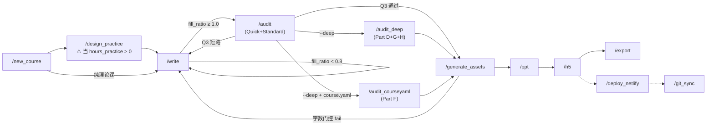

# 工作区导航 (Workspace INDEX)

> **SYSTEM INSTRUCTION**:
> 你是中文 Agent，工作于多课程备课工作区。
> 收到请求时，先扫描所有 `*/course.yaml` 确定目标课程，再加载对应课程的 knowledge 和配置。

## Agent 启动检查清单（每个新对话必做）

1. **声明身份**："我是 {角色名}" — 如 "课程工作区"、"W03写作"、"调研助手"
2. **读取简报**：`.agent/briefing.md` — 了解项目当前状态和最近活动
3. **检查邮箱**：执行 `/mailbox_in` — 查看是否有分配给自己的待办任务
4. **按需查阅 ADR**：`.agent/memory/ADR_summary.md` — 一行速查，按编号深入 `ADR.md`
5. **对话结束前**：更新 `briefing.md` 的"最近活动"和"当前状态"

## 已注册课程

通过 `manifest.json` 管理，Agent 可自动发现。

| 课程 | 目录 | 课程类型 | 状态 |
|:---|:---|:---|:---|
| 实习指导 | `实习指导/` | project | 活跃 |
| 交互产品开发 | `交互产品开发/` | weekly | 配置完毕 |
| 信息可视化 | `信息可视化/` | weekly | 配置完毕 |

## 始终激活规则 (trigger: always)

- `.agent/rules/rule_meta_learning.md` — 元学习自演化
- `.agent/rules/rule_cross_agent_protocol.md` — Agent 通信协议（邮箱通信、跨项目只读铁律）
- `.agent/rules/rule_security_governance.md` — 安全治理红线

## 条件规则 — 模型决策 (trigger: model_decision)

| 规则 | 触发描述 |
|:---|:---|
| `rule_visual_generation.md` | 调用 generate_image 时 |
| `rule_training_plan_compliance.md` | 修改 course.yaml objectives 时 |
| `rule_deploy_freshness.md` | 讨论发布上线或执行部署部署到 Netlify 时 |

## 条件规则 — 文件匹配 (trigger: glob)

| 规则 | 匹配模式 | 加载时机 |
|:---|:---|:---|
| `rule_localization.md` | `*/weeks/*/src/*.md` | 编辑脚本时 |
| `rule_asset_management.md` | `*/visuals/**`, `*/scripts/**`, `*/build/**` | 编辑资产目录时 |
| `rule_document_boundaries.md` | `*/weeks/*/src/*.md`, `*/knowledge/**` | 编辑脚本/知识库时 |
| `rule_assessment_constraints.md` | `*/course.yaml` | 编辑成绩配比时 |
| `rule_content_depth.md` | `*/weeks/*/src/*.md` | 写作过程中的达标防卫(整合原最佳实践和字数门槛) |
| `rule_narrative_standards.md` | `*/weeks/*/src/*.md` | 叙事质量基础预检 |
| `rule_outline_alignment.md` | `*/weeks/*/src/*.md` | 大纲对齐验证 |
| `rule_dma_course_design.md` | `*/course.yaml`, `*/scripts/00_structure_map.md` | DMA 课程设计 |
| `rule_practice_standards.md` | `*/practices/*.yaml`, `*/practices/*.md` | 实践设计规范、CA 闭环与 AI 教学法合规 |

## 脚本生命周期 (Script Lifecycle)

> Agent 应按照此流程依次执行工作流。每个节点标注了关键门控条件。

<!-- Flow V5 — 2026-03-29 -->

## 项目技能包（.agent/skills/）

- `agent-architect/` — Agent 扩展机制创建与管理（Rule/Workflow/Skill）
- `script_format/` — 脚本格式规范
- `narrative_archaeologist/` — 叙事考古
- `validation_suite/` — 验证套件（链接/时长/语法）
- `librarian/` — 知识枢纽查询引擎（三层漏斗：hub扫描 → search_knowledge → view_file段落）
- `pptx-nfu-branded/` — NFU 南方学院品牌 PPTX 注入
- `doubaotts/` — 豆包 TTS 桥接引擎（段落级动态合成 + IndexedDB 缓存）

## 全局技能包（系统级，非 .agent/ 目录内）

- `docx` — Word 文档处理
- `pptx` — PPT 生成/编辑/QA
- `pdf` — PDF 处理
- `xlsx` — Excel 处理

## 课程专属配置

若 `<课程>/styles/` 存在，优先加载课程级设计系统（通过 `course.yaml` 的 `agent.style` 和 `agent.standards` 字段定位）。

## 项目级视觉预设（.agent/styles/）

统一存放跨课程的 PPT/H5 视觉生成与排版字典（Visual System）。`course.yaml` 的 `agent.style` 字段直接引用此处文件。

| 主题配置 | 描述 / 适用范围 |
|:---|:---|
| `theme_academic_minimal.yaml` | 交互产品开发课（默认） — 学术极简风格 |
| `theme_constructivist_dada.yaml` | 信息可视化课 — 构成主义达达主义拼接风格 |
| `theme_kandinsky_abstract.yaml` | 康定斯基抽象艺术风格（早期版本补充） |
| `theme_swiss_typographic.yaml` | 瑞士版图印刷风格（备用） |
| `theme_rubber_hose.yaml` | 橡皮管动画复古风格（测试/备用） |

## 模板大库（.agent/templates/）

预置各类输出流的初始化模板。

| 模板资源 | 描述 |
|:---|:---|
| `course.yaml.template` | `/new_course` 初始化课程时的标准 Schema 模板 |
| `experiment_planning.md.template` | 实践规划与实验要求框架模板 |
| `practice_schema.md` | 每周实践步骤的数据规格定义模板 |

## 通用工作流

| 命令 | 说明 |
|:---|:---|
| `/new_course` | 创建新课程脚手架 |
| `/write` | 撰写逐字稿（三阶段：备料→写作→校验） |
| `/audit` | 质量审查（`--quick` / 默认 / `--deep` 三级；支持 `--week N` 和 `--module "关键词"` 聚焦审计） |
| `/audit_deep` | Deep 级别检查（Part D 知识覆盖 + Part G OBE 对齐 + Part H 实验联动合规） |
| `/audit_courseyaml` | Deep 级别检查（Part F course.yaml 合规） |
| `/validate_knowledge` | 知识库健康检查（已被 `/write` 和 `/audit` 自动调用） |
| `/design_practice` | 设计/编辑每周实践步骤规格（`practices/W0X_practice.yaml`） |
| `/generate_assets` | 批量生成视觉资产（含字数门控前置检查） |
| `/ppt` | 生成 PPT |
| `/h5` | 生成 H5 交互式课件 |
| `/export` | 导出 TTS 纯文本 / Word 审阅文档 / 词汇表 |
| `/deploy_netlify` | H5 系统前端 SSG 资源管线构建及在线发布（含双门闸预检） |
| `/git_sync` | 项目源码增量同步至 GitHub (附带 `.gitignore` 管控规则) |
| `/update_guidance` | 修改指导文档后审计下游影响（参考 `DEPENDENCY_MAP.md`） |
| `/mailbox_in` | 扫描共享邮箱中发给当前 Agent 的待处理消息 |
| `/mailbox_out` | 向其他 Agent 发送任务单或 RFC（跨项目 + 项目内） |
| `/routing_rules` | 课程工作区专属：判定修改请求属于课程端还是教务端 |

## 自演化协议

- **更新自己**：如果你学到新知识或做了新决策，**必须**固化到文档中。
- **协议**：阅读 `.agent/rules/rule_meta_learning.md`。
