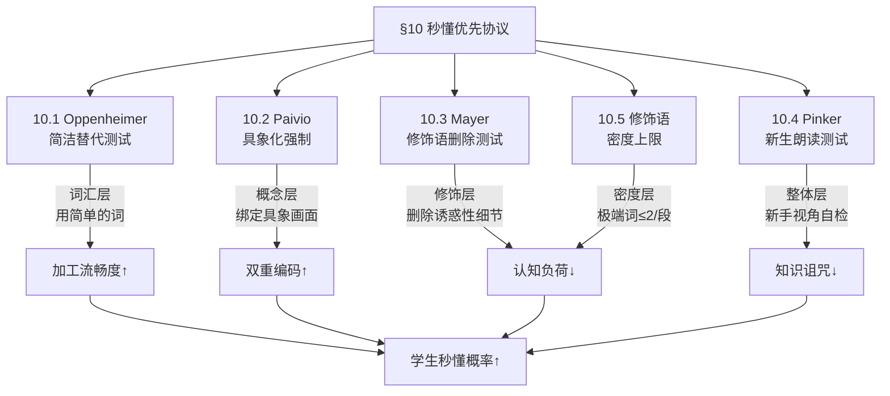

# 秒懂优先协议：理论基础与调研档案
# Instant Clarity Protocol: Theoretical Foundations & Research Archive

> **文档定位**：本文件是 `narrative_standards_guide.md` §10（秒懂优先协议）的理论支撑文档。
> 当需要理解 §10 各检查项的学术来源、深化审计判断标准、或为机制优化提供实证依据时，加载此文件。
>
> **加载时机**：
> - `/audit --deep` 执行 §10 相关检查且遇到边界判定时
> - `/write` Phase A 写作中对"张力 vs 秒懂"产生冲突时
> - 优化 `validate_script_length.py` 中的自动化检测逻辑时
> - 任何需要引用学术来源来支持决策的场合

---

## 目录

1. [问题定义：LLM 华丽偏差的系统性病因](#1-问题定义)
2. [框架 A：Oppenheimer 简洁法则](#2-框架-a-oppenheimer-简洁法则)
3. [框架 B：Paivio 双重编码与具象优势](#3-框架-b-paivio-双重编码与具象优势)
4. [框架 C：Mayer 一致性原则与诱惑性细节效应](#4-框架-c-mayer-一致性原则与诱惑性细节效应)
5. [框架 D：Pinker 知识诅咒免疫](#5-框架-d-pinker-知识诅咒免疫)
6. [补充研究：LLM 人造老练偏差](#6-补充研究-llm-人造老练偏差)
7. [框架间的协同关系](#7-框架间的协同关系)
8. [项目内的操作化映射](#8-项目内的操作化映射)
9. [参考文献](#9-参考文献)

---

## 1. 问题定义

### 1.1 症状描述

课程逐字稿中系统性地出现以下风格病：

- **词汇层**：使用"体量剧变"、"奉为圭臬"、"核爆级威力"等非日常词汇，学生需要额外的脑力去"解码"
- **修饰层**：单段内叠加 3+ 个极端修饰语（极其/绝对/彻底/死死），信噪比极低
- **隐喻层**：使用跨度过大的隐喻（"数据的前沿外科手术"），不助攻反添乱
- **标题层**：H3/H4 标题本身需要读两遍才能理解（如"有限理性的制约漏斗锁死了传统人类深海寻宝的探知极限"）

### 1.2 三重叠加根因

这不是个别词汇的问题，而是三个因素形成的因果链：

```
提示词系统要求"成熟干练/情绪张力"（§6/§8 全是油门）
        ↓
LLM 固有的 Artificial Sophistication Bias 被激活
        ↓
审计规则只检查句法（句长/标点），不检查语义复杂度
        ↓
华丽但不秒懂的文本持续通过质量关卡
```

### 1.3 核心洞察

> **华丽 ≠ 高级，流畅 = 高级。**
>
> 解决方案是**双轨并行**：
> 1. **结构性统计检测**（四字格密度、修饰语堆叠深度、信息压缩比）——与具体词汇无关，只检测写作模式
> 2. **生成侧规则硬化**（§6.6 修辞限额 + §10.6 Orwell 垂死隐喻自检）——从源头降低 LLM 华丽偏差
>
> 早期版本的判断「解决方案不是禁用词列表」是正确的方向，但过早否定了词表方案。STE100 用受控词表 + 检查器保护了航空业 40 年。打地鼠的不是词表本身，而是「没有自动化检查器的词表」。正确答案是**结构性统计**（不打地鼠）+ **油门措辞硬化**（从源头治理）。

---

## 2. 框架 A：Oppenheimer 简洁法则

### 2.1 核心论文

**Oppenheimer, D. M. (2006).** *Consequences of Erudite Vernacular Utilized Irrespective of Necessity: Problems with Using Long Words Needlessly.* Applied Cognitive Psychology, 20(2), 139-156.

> 该论文获得了 2006 年搞笑诺贝尔文学奖（Ig Nobel Prize in Literature）——"让人先笑，再让人思考"。

### 2.2 核心发现

1. **使用不必要的复杂词汇，反而让读者觉得作者更蠢，而不是更聪明。**
2. 这一效应由**加工流畅度（Processing Fluency）**中介——文本越容易阅读，读者对作者的智力评价越高。
3. 当读者能把阅读困难归因于外部因素（如字体模糊）而非作者能力时，负面效应会减弱。

### 2.3 关键机制：加工流畅度

> Processing Fluency = 信息被大脑处理的主观容易程度

- **高流畅度** → 读者感觉"可信"、"聪明"、"专业"
- **低流畅度** → 读者感觉"费劲"、"虚张声势"、"不可靠"

人类的认知系统有一个默认启发式：**"如果容易理解，大概率是对的。"** 这意味着简洁清晰的表达不仅更易被理解，还会被认为更权威。

### 2.4 项目操作化

**→ §10.1 Oppenheimer 简洁替代测试 (The Oppenheimer Swap Test)**

写完每句话后检查：能否用一个更短、更日常的词替换当前用词，而不损失任何信息？如果能，就必须替换。

| 替换前 | 替换后 | 信息损失 |
|:---|:---|:---|
| 体量剧变 | 数据量暴涨 | 无 |
| 奉为圭臬 | 公认的黄金标准 | 无 |
| 核爆级威力巨大改革 | 一场彻底的改革 | 无 |
| 倾覆 | 压过来 | 无 |
| 额叶皮层 | 大脑 | 对艺术生无损 |

### 2.5 延伸阅读

- Alter, A. L., & Oppenheimer, D. M. (2009). Uniting the tribes of fluency to form a metacognitive nation. *Personality and Social Psychology Review*, 13(3), 219-235.
- Song, H., & Schwarz, N. (2008). If it's hard to read, it's hard to do: Processing fluency affects effort prediction and motivation. *Psychological Science*, 19(10), 986-988.

---

## 3. 框架 B：Paivio 双重编码与具象优势

### 3.1 核心理论

**Paivio, A. (1986).** *Mental Representations: A Dual Coding Approach.* Oxford University Press.

**Sadoski, M., & Paivio, A. (2001).** *Imagery and Text: A Dual Coding Theory of Reading and Writing.* Lawrence Erlbaum Associates.

### 3.2 双重编码理论 (Dual Coding Theory, DCT)

人类认知通过两个独立但互联的系统处理信息：

1. **语言系统 (Verbal System)**：处理文字、句子、语言序列
2. **非语言系统 (Imagery/Nonverbal System)**：处理心理图像、空间关系、感官体验

### 3.3 具象优势效应 (Concreteness Advantage)

- **具象词**（如"苹果"、"自行车"）同时激活语言系统和意象系统 → **双重编码**
- **抽象词**（如"正义"、"概念"）主要只激活语言系统 → **单重编码**

双重编码意味着更多的记忆检索路径，因此具象词更容易被记忆和理解。

### 3.4 教学启示 (Sadoski & Paivio, 2001)

1. **具象化 (Concretizing)**：教师可以通过具体的例子、隐喻或类比来"充实"抽象概念
2. **意象策略 (Imagery Strategies)**：鼓励学习者在阅读时形成心理图像，可增强词汇习得和阅读理解
3. **多模态方法 (Multimodal Approaches)**：结合语言信息和非语言线索（图片、图表、动画），效果最佳

### 3.5 项目操作化

**→ §10.2 Paivio 具象化强制 (Concreteness Mandate)**

每个核心概念必须绑定一个"学生可以在脑海中画出来的具体画面"。抽象概念不允许用另一个抽象概念去解释。

| 抽象表述 | 具象化（可画出画面） |
|:---|:---|
| "有限理性的制约漏斗锁死了探知极限" | "就像你在超市只有 5 分钟，货架上一万种选择，你根本逛不完" |
| "认知维度的向上跃迁" | "你从'埋头写代码的工人'变成了'坐在监控室的总指挥'" |

### 3.6 延伸阅读

- Sadoski, M. (2001). Resolving the effects of concreteness on interest, comprehension, and learning important ideas from text. *Educational Psychology Review*, 13, 263-281.
- Clark, J. M., & Paivio, A. (1991). Dual coding theory and education. *Educational Psychology Review*, 3(3), 149-210.

---

## 4. 框架 C：Mayer 一致性原则与诱惑性细节效应

### 4.1 核心论文

**Harp, S. F., & Mayer, R. E. (1998).** *How seductive details do their damage: A theory of cognitive interest in science learning.* Journal of Educational Psychology, 90(3), 414-434.

**Garner, R., Gillingham, M. G., & White, C. S. (1989).** *Effects of "seductive details" on macroprocessing and microprocessing in adults and children.* Cognition and Instruction, 6(1), 41-57.

### 4.2 Seductive Details Effect（诱惑性细节效应）

在教学材料中加入"有趣但与核心学习目标无关的信息"（如轶事、装饰性图片、"有趣但跑题的冷知识"），会导致：

1. **学生记住了装饰，忘记了重点**
2. 学习核心内容的效果下降（Harp & Mayer 实验中，无诱惑性细节组的学生回忆结构重要信息的概率是有诱惑性细节组的 **3 倍**）

### 4.3 三种损害机制

| 机制 | 说明 |
|:---|:---|
| **注意力分散 (Distraction)** | 有趣的细节吸引了学生的注意力，远离了核心材料 |
| **一致性破坏 (Disruption)** | 打断了学生构建连贯心智模型的过程 |
| **不当图式激活 (Inappropriate Schema)** | 诱惑性细节激活了无关的先验知识，导致学生围绕错误的概念组织整个课程（Harp & Mayer 认为这是主要机制） |

### 4.4 Mayer 的一致性原则 (Coherence Principle)

> **"当删除无关的材料（有趣但不相关的文字、图片或声音）后，人们学得更深。"**
> — Richard E. Mayer, *Multimedia Learning* (2009)

### 4.5 与本项目的对应关系

华丽但不帮助理解核心概念的修饰语，本质上就是**文字版的诱惑性细节**。

例如："一场具有**核爆级威力巨大**的改革"——学生的工作记忆被"核爆级威力巨大"这个情绪冲击占据，反而没有空间去建立"Vibe Coding = 用自然语言指挥AI写代码"这个核心概念的心智模型。

### 4.6 项目操作化

**→ §10.3 Mayer 修饰语删除测试 (The Mayer Deletion Test)**

对每个修饰语做"删除测试"——删掉它之后，学生对核心概念的理解会不会下降？如果不会，就必须删掉。

**判定标准**：如果一个修饰语的作用仅仅是"让句子听起来更厉害"而不是"帮学生更准确理解概念"，那它就是 Seductive Detail，必须删除。

### 4.7 延伸阅读

- Mayer, R. E. (2009). *Multimedia Learning* (2nd ed.). Cambridge University Press.
- Rey, G. D. (2012). A review of research and a meta-analysis of the seductive detail effect. *Educational Research Review*, 7(3), 216-237.

---

## 5. 框架 D：Pinker 知识诅咒免疫

### 5.1 核心著作

**Pinker, S. (2014).** *The Sense of Style: The Thinking Person's Guide to Writing in the 21st Century.* Viking.

### 5.2 知识诅咒 (The Curse of Knowledge)

> 当一个人高度了解某个主题后，他几乎不可能想象"不知道这个信息"是什么感觉。
> — Steven Pinker

这是一种认知偏差，与教育心理学中的 **Expert Blind Spot（专家盲区）** 密切相关。

### 5.3 表现形式

1. **假设前提**：作者假设读者已经拥有了自己的背景知识
2. **术语滥用**：毫无解释地使用专业术语
3. **跳步推理**：跳过对新手来说至关重要的内部推导步骤
4. **抽象优先**：选择更抽象、技术性更强的表达方式

### 5.4 为什么 LLM 特别容易"知识诅咒"

LLM 的训练语料以专业文献、学术论文、技术文档为主，这些文本天生就是"被知识诅咒的"——它们是专家为专家写的。当 LLM 生成教学文本时，它复制的是训练语料中的表达模式，而不是"为新手解释"的模式。

### 5.5 Pinker 的解药

1. **Classic Style（经典风格）**：写作者是一个导游，指引读者去看世界上具体的事物——而不是一个在讲台上灌输"知识"的教授
2. **代表性读者测试**：让不具备你专业背景的人阅读你的初稿
3. **时间距离法**：放下初稿一段时间，再回来时你更可能用新手的眼光审视它

### 5.6 项目操作化

**→ §10.4 Pinker 新生朗读测试 (The Freshman Read-Aloud Test)**

写完每段正文后，执行以下心理模拟：

> **想象一个从未接触过本学科的大一新生，在课堂上第一次听到这段话。他能在 3 秒内明白你在说什么吗？**

- 需要"翻译"才能理解 → 改写
- 包含学生词汇库之外的文言词（如"圭臬""桎梏""倾覆"）→ 替换为白话
- H3/H4 标题本身需要读两遍才能理解 → 标题必须重写

### 5.7 延伸阅读

- Nickerson, R. S. (1999). How we know — and sometimes misjudge — what others know: Imputing one's own knowledge to others. *Psychological Bulletin*, 125(6), 737-759.
- Nathan, M. J., & Petrosino, A. (2003). Expert blind spot among preservice teachers. *American Educational Research Journal*, 40(4), 905-928.

---

## 6. 补充研究：LLM 人造老练偏差

### 6.1 现象描述

2024-2025 年多项研究一致发现，大语言模型在生成文本时存在一种训练产物级别的固有偏差——**Artificial Sophistication Bias（人造老练偏差）**：

> 当被要求生成"专业/成熟/有冲击力"的内容时，LLM 系统性地倾向于使用更长的词汇、更复杂的句式、更密集的修饰语。

### 6.2 成因分析

- **RLHF 训练偏差**：在"有帮助（helpful）"的强化学习训练中，"更详尽 = 更有帮助"的奖励信号导致模型倾向于冗赘和华丽
- **训练语料偏差**：模型学到了大量学术论文和技术文档中的"看起来专业"的表达模式
- **表面模式依赖**：MIT 2025 研究指出，LLM 更多依赖习得的语法模式和风格启发式，而非深层领域知识

### 6.3 关键研究来源

- **MIT 2025 研究**：LLMs often rely on learned grammatical patterns and stylistic heuristics rather than deep domain knowledge. Models may produce highly polished, complex, and confident-sounding prose that masks a lack of underlying understanding.
- **Apple 2025 "The Illusion of Thinking"**：LLMs suffer from a "complexity cliff" — when faced with simple problems, they often "overthink" and produce complex, verbose reasoning that fails to arrive at the correct answer.
- **arXiv 2025 AI Search study**：LLMs often prioritize verbose and lexically complex responses, which reduces user satisfaction. Users consistently prefer concise, source-attributed responses.

### 6.4 与本项目的关系

我们的提示词系统在 `rule_narrative_standards.md` 中要求"修辞性铺垫"、"干练成熟"、"情绪张力"时，LLM 把这些指令解读为**"越华丽越好"**——因为在它的训练经验中，"华丽"就是"专业"的统计近似。§10 的核心作用就是为这种偏差安装对冲刹车。

---

## 6.5 框架 E：Orwell 垂死隐喻理论

### 来源

**Orwell, G. (1946).** *Politics and the English Language.*

### 核心概念：隐喻三分法

| 类型 | 定义 | 中文对应 | 处置 |
|:---|:---|:---|:---|
| **Fresh** | 唤起全新画面的隐喻 | 「你的大脑是一块画布」 | ✅ 允许 |
| **Dead** | 已融入日常、无人感知原义 | 「瓶颈」「桌腿」 | ✅ 允许 |
| **Dying** | 用过太多次、失去唤起力但作者自认为有文采 | 四字成语堆砌 | 🔴 禁止 |

### 与 Paivio 的补充关系

Paivio 的具象化测试（§10.2）无法拦截 Dying Metaphor——因为成语表面上「有画面」（海市蜃楼确实能想象），但 Orwell 指出：当一个隐喻被用了太多次，大脑不再激活画面系统，只将其当作「语义空壳」处理。这解释了为什么现有规则拦不住成语堆砌。

### 项目操作化

→ §10.6 Orwell 垂死隐喻自检（The Dying Metaphor Self-Check）

---

## 6.6 框架 F：ASD-STE100 受控语言标准

### 来源

**ASD-STE100.** *Simplified Technical English.* 航空航天业 40 年工业级语言控制标准。

### 核心机制

| 机制 | STE100 规则 | 本项目移植 |
|:---|:---|:---|
| 受控词表 | ~900 个批准词，一词一义 | 不采用硬编码词表，改用结构性密度检测 |
| 句长上限 | 操作句 ≤20词，描述句 ≤25词 | 竹节 ≤20 字（已有） |
| 合规检查器 | 专用 STE Checker 软件 | `validate_script_length.py` 结构性检测引擎 |

### 核心启示

STE100 的成功不在于「限制了什么」，而在于「让合规性变成了机器可检测的」。我们的 §10 有理论但没 Checker——v2 版的结构性检测引擎就是本项目的 STE Checker。

---

## 6.7 框架 G：SNR 信噪比写作模型

### 来源

借鉴自 Shannon (1948) 信息论在写作分析中的应用。

### 核心公式

```
SNR = 信号（核心命题数）/ 噪声（修饰词 + 重复 + 套话）
```

健康文本 SNR ≥ 2.0（信号是噪声的 2 倍以上）。

M00 L161 段的实测：SNR ≈ 0.56（噪声比信号还多）。

### 项目操作化

通过信息压缩比（ICR = 加粗锚词数 / 段落字数）近似实现。ICR < 0.5 且段落 > 200 字 → 疑似修饰语填充。

---

## 6.8 框架 H：自我偏好偏差与宪法批评 (Self-Enhancement Bias & Constitutional Critique)

### 来源

**Anthropic (2023).** *Constitutional AI: Harmlessness from AI Feedback.*
**Zheng et al. (2024).** *Judging LLM-as-a-Judge with MT-Bench and Chatbot Arena.*

### 核心发现

1. **自我偏好偏差 (Self-Enhancement Bias)**：同一个大语言模型在评估它自己生成的输出时，存在系统性的结构盲区。它会倾向于给自己写的冗长、华丽但逻辑断裂的内容打高分，且在 >50% 的测试用例中无法识别客观错误。
2. **System 1 vs System 2 判断**：笼统的"审阅质量"提示词会触发模型快速模式匹配（System 1），导致其只看表面语言是否流畅。
3. **专家人格与结构化批评**：将评估任务分解为特定维度的结构化探针，并要求模型在给出判断前引用具体的"违规文本"（Constitutional Critique Chain），能显著降低偏差并触发深层推理（System 2）。

### 项目操作化

→ 将原始 `/audit` 中的"叙事质量抽查"升级为 **C5b 宪法原则探针**，不再询问"质量如何"，而是询问具体的探针问题（如"是否存在自相矛盾的修饰？"），并强制要求引用证据文本。

---

## 6.9 框架 I：回译压缩测试 (Lossy Compression Test)

### 来源

结合了机器翻译质量控制领域的 **回译 (Back-Translation)** 技术与 NLP 的 **自然语言推理 (NLI) 矛盾检测** 概念。

### 核心概念

如果一段文字是有实际意义的、逻辑连贯的，那么它所包含的信息量应当能被压缩到一个核心命题中。人类在处理复杂信息时依赖这种有损压缩；但如果文段本身是 LLM 为满足字数而堆砌的无意义幻觉（如"无损压平抛却"与"有损压缩"同句），在执行高强度压缩任务时，逻辑矛盾会被暴露，或者整个文段会坍缩为一句空话。

### 项目操作化

→ 引入 **C5a 回译压缩测试**。在 `/audit` 最终放行前，强制将关键教学区块压缩到 ≤25 字，通过观察压缩后的自洽性来判断长文中是否潜藏逻辑断裂或过度注水。

---



四个框架分别作用于不同层面，但共同指向同一个目标——**提高学生的即时理解概率**：

| 框架 | 作用层面 | 解决的问题 | 操作方式 |
|:---|:---|:---|:---|
| Oppenheimer | 词汇层 | 用了不必要的复杂词 | 逐词替代 |
| Paivio | 概念层 | 抽象概念没有具象锚点 | 绑定画面 |
| Mayer | 修饰层 | 华丽修饰占据工作记忆 | 删除测试 |
| Pinker | 整体层 | 失去了对新手难度的感知 | 视角切换 |

---

## 8. 项目内的操作化映射

### 8.1 规范层

| 文件 | 注入位置 | 内容 |
|:---|:---|:---|
| `narrative_standards_guide.md` | §10 | 五项可执行检查（定义处 / SSoT） |
| `script_format/SKILL.md` | §7 质量检查清单 | `Instant Clarity (§10)` 检查项 |

### 8.2 工作流层

| 文件 | 注入位置 | 内容 |
|:---|:---|:---|
| `write_phase2_compose.md` | Phase alpha 骨架自检 | Pinker 新生测试 |
| `write_phase2_compose.md` | Phase A 前置思考 | "油门与刹车"对冲哲学 |
| `write_phase2_compose.md` | Phase B 防注水 | Mayer 修饰语删除测试 |
| `write_phase3_verify.md` | C1 骨架还原 | `[TITLE_OPAQUE]` 标签 |
| `audit_standard.md` | Part B 第5项 | Oppenheimer 替代 + Pinker 新生模拟 |
| `audit_standard.md` | Part C | `[MODIFIER_OVERLOAD]` + `[VOCAB_BARRIER]` |

### 8.3 自动化层

| 文件 | 机制 | 内容 |
|:---|:---|:---|
| `validate_script_length.py` | `FATAL_JARGON_MARKERS` | 绝对 AI 幻觉造词 → Exit 1 |
| `validate_script_length.py` | `WARN_JARGON_MARKERS` | 语境依赖词 → `[DILUTED?]` 警告 |
| `validate_script_length.py` | `JARGON_WHITELIST` | 合法组合词安全放行 |

---

## 9. 参考文献

### 核心文献

1. Oppenheimer, D. M. (2006). Consequences of erudite vernacular utilized irrespective of necessity: Problems with using long words needlessly. *Applied Cognitive Psychology*, 20(2), 139-156.
2. Paivio, A. (1986). *Mental representations: A dual coding approach*. Oxford University Press.
3. Sadoski, M., & Paivio, A. (2001). *Imagery and text: A dual coding theory of reading and writing*. Lawrence Erlbaum Associates.
4. Harp, S. F., & Mayer, R. E. (1998). How seductive details do their damage: A theory of cognitive interest in science learning. *Journal of Educational Psychology*, 90(3), 414-434.
5. Garner, R., Gillingham, M. G., & White, C. S. (1989). Effects of "seductive details" on macroprocessing and microprocessing in adults and children. *Cognition and Instruction*, 6(1), 41-57.
6. Pinker, S. (2014). *The sense of style: The thinking person's guide to writing in the 21st century*. Viking.
7. Mayer, R. E. (2009). *Multimedia learning* (2nd ed.). Cambridge University Press.

### 补充文献

8. Alter, A. L., & Oppenheimer, D. M. (2009). Uniting the tribes of fluency to form a metacognitive nation. *Personality and Social Psychology Review*, 13(3), 219-235.
9. Nickerson, R. S. (1999). How we know — and sometimes misjudge — what others know: Imputing one's own knowledge to others. *Psychological Bulletin*, 125(6), 737-759.
10. Nathan, M. J., & Petrosino, A. (2003). Expert blind spot among preservice teachers. *American Educational Research Journal*, 40(4), 905-928.
11. Rey, G. D. (2012). A review of research and a meta-analysis of the seductive detail effect. *Educational Research Review*, 7(3), 216-237.
12. Clark, J. M., & Paivio, A. (1991). Dual coding theory and education. *Educational Psychology Review*, 3(3), 149-210.

### LLM 偏差研究 (2024-2025)

13. MIT (2025). LLM syntactic failure modes and surface-level pattern reliance.
14. Apple (2025). "The Illusion of Thinking": Complexity cliff and overthinking in reasoning models.
15. arXiv (2025). Artificial sophistication and verbosity bias in AI search applications.

---

> **维护说明**：本文档是活文档。当发现新的实证研究支持或挑战现有框架时，应追加到对应章节。所有对 §10 机制的优化都应在本文档中记录理论依据。
