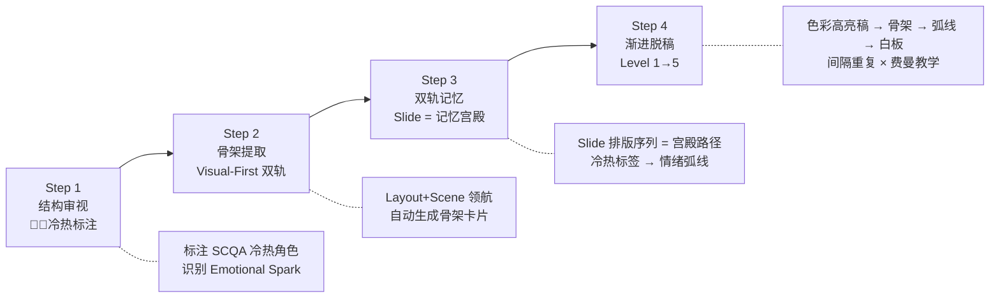

# 演讲稿脉络可视化与结构化记忆：深度调研报告 (v2)

> **调研目标**：为课程逐字稿的演讲准备场景，梳理当前成熟的脉络可视化、结构审查与记忆背诵方法论，为后续工具化/自动化提供理论基础。
>
> **v2 修正说明**：基于对 v1 的四项漏洞审查（Visual-First 双轨脱节、标签映射缺失、SCQA 冷热理解浅、工具链脱离 Agentic 生态），已全面修补并深度对齐项目 `script_format` 规范。

---

## 一、核心认知科学理论基础

在展开具体方法之前，先锚定三个认知科学的底层原理——所有成熟方法本质上都是对这三个原理的工程化实现。

### 1.1 认知负荷理论 (Cognitive Load Theory, John Sweller)

人类工作记忆容量极其有限（Miller's Law: 7±2 个通道）。演讲准备的核心挑战是：**将万字长稿的信息密度，压缩到工作记忆能承载的粒度上**。

- **内在负荷 (Intrinsic Load)**：内容本身的复杂度 → 通过"分块 Chunking"降低
- **外在负荷 (Extraneous Load)**：信息呈现方式的干扰 → 通过"格式清晰化"消除
- **关联负荷 (Germane Load)**：建构知识图式的有效努力 → 通过"结构化框架"引导

### 1.2 双编码理论 (Dual Coding Theory, Allan Paivio)

人脑通过**语言通道**和**图像通道**两条独立路径处理信息。当同一概念同时被编码为文字和画面时，记忆提取的成功率显著提升（多媒体效应）。

**对演讲准备的启示**：
- 逐字稿不应仅以"文字墙"形式存在
- 应同步生成**视觉化骨架**（思维导图/流程图/关键词卡片）
- 演讲者大脑中应同时存储"语言链"和"画面链"双轨记忆

### 1.3 图优效应 (Picture Superiority Effect)

人类记忆图像的效率约为纯文字的 **6 倍**。经过 72 小时后，图像记忆保留率约 65%，而文字仅约 10%。

**对演讲准备的启示**：将演讲稿的骨架转化为可视化图谱，比反复通读原文有效 6 倍。

---

## 二、七大成熟方法体系

### 方法 1️⃣：结构化框架法 — 记逻辑，不记文字

> **核心思想**：用固定的逻辑模型作为演讲的"骨架钢筋"，演讲者只需记住框架，血肉可以临场自然生长。

#### 常用框架

| 框架 | 结构 | 最佳场景 |
|:---|:---|:---|
| **SCQA 冷热金字塔** ★ | 🧊结论(冷) → 🔥冲突(热) → 🧊🔥支撑(交织) | 本项目核心框架（见下方专项解读） |
| **PREP** | 论点 → 理由 → 案例 → 重申论点 | 快速论证单个观点 |
| **STAR** | 情境 → 任务 → 行动 → 结果 | 案例分析/故事讲述 |
| **金字塔原理 (MECE)** | 总 → 分 → 分 → 分 → 总 | 长篇系统讲授 |
| **Monroe 动机序列** | 注意 → 需要 → 满足 → 想象 → 行动 | 说服性演讲 |
| **英雄旅程** | 日常 → 召唤 → 导师 → 历练 → 归来 | 激励型/变革型演讲 |

#### 本项目专项：冷热交替引擎 (script_format §5.1 第二层 · 认知传递层)

> [!IMPORTANT]
> 本项目的冷热交替不是教科书版的 SCQA 四步走流程，而是 §5.1 三层松耦合约束体系中**第二层（认知传递层 · 强制）**的核心机制：
> - **🧊 冷（骨骼）**：金字塔尖的核心知识点/结论，客观精准
> - **🔥 热（血肉）**：Complication 冲突点，必须击中痛点的"情感火花 (Emotional Spark)"，带听众进入深度共鸣
> - **🧊🔥 冷暖交织（支撑）**：3 个论据维度，用有温度的案例或真实切片包裹

对于演讲记忆，这意味着：
- 每个段落都有明确的**温度标签**（冷/热），演讲者需感知自己何时"沉稳精准"何时"激情燃烧"
- 冷热切换点就是天然的**记忆分界线**——情绪转折处最容易被记住（Von Restorff 效应）
- 情绪地图可通过检测冷/热标签**自动化程序生成**（见 §3.2 B）

#### 操作步骤
1. **审视逐字稿**：逐段识别每一段落的逻辑角色（S? C? Q? A?）**和温度属性**（🧊冷 / 🔥热）
2. **标注双维标签**：在稿件边缘标注 `[C🔥]`（热冲突）或 `[A🧊]`（冷结论）
3. **提炼骨架链**：整个模块压缩为一行：`[S🧊: 现状] → [C🔥: 痛点引爆] → [Q: 灵魂拷问] → [A🧊: 铁律]`
4. **记忆框架链**：只记这条冷热交替的链路，温度变化本身就是最强的记忆锚

---

### 方法 2️⃣：记忆宫殿 / 位置法 (Method of Loci) — Visual-First 增强版

> **核心思想**：将演讲内容的要点"存放"在一个你极度熟悉的物理空间中，通过"心理散步"路径触发顺序回忆。

> [!IMPORTANT]
> **Visual-First 关键增强**：在本项目中，演讲者的记忆"定桩点"不仅仅是脑海中的房间——**大屏幕上出现的 `[VISUAL].Scene` 和其 `Layout` 排版本身就是天然的空间锚点**。每次看到一个特定排版（如 `Grid` 四宫格 vs `Split` 双栏 vs `Full` 全屏沉浸），大脑会自动将其编码为不同的"视觉空间"。因此，记忆宫殿应以 **Slide 排版序列**作为主路径。

#### 操作步骤
1. **选择宫殿**：以课程的 **Slide 排版序列本身**作为记忆宫殿路径
2. **Layout 即房间**：每种 Layout 类型对应一种"空间感"：
   - `Center` = 开阔的大厅中央（聚焦一个核心概念）
   - `Split` = 左右两面墙的对比长廊（论据 A vs B）
   - `Grid` = 四扇窗户的展览室（多要点并列）
   - `Full` = 沉浸式影院（情感冲击/ 全屏画面）
3. **Scene 即画面**：每张 Slide 的 `Scene` 描述提供了具象的视觉画面——这就是你"存放"在房间里的那个荒诞形象
4. **双锚绑定**：将 `[Layout + Scene]` 与后续 Speech 的核心论断绑定
   - 例：`[Grid: 三位学者名片卡 + 粒子凝聚动画]` → 引出 "信号≠信息" 的 SCQA 落点
5. **心理行走练习**：按 Slide 排版顺序"走"一遍，在每种排版形态处停下回忆对应段落

#### 适用场景
- 适合**模块间顺序**记忆（M01 → M02 → M03 的衔接）
- 适合记忆**散落的关键术语和人名**（每个烙在一个 Slide 空间位置上）
- 特别适合本项目：**演讲者在讲台上看到的 PPT 画面本身就是最强的位置提示**

---

### 方法 3️⃣：认知分块与关键词锚定 (Chunking + Keyword Anchoring)

> **核心思想**：将万字长稿分解为 3-5 个大块，再将每个大块压缩为 1-3 个"触发关键词"。记忆路径从 `全文 → 大块 → 关键词 → 自然展开`。

#### 分层记忆金字塔

```
        层 0: 课程主题（1 句话）
       /          |          \
    层 1: 模块核心论断（3-5 个）
   /    \       /    \
  层 2: 段落关键词（每段 1-2 词）
 /   \      /   \
层 3: 细节与案例（临场展开）
```

#### 操作步骤
1. **分块**：按模块/H3 标题自然分块（本项目脚本已有完美分块：`### 1.1`, `### 1.2`, `### 1.3`）
2. **提炼锚词**：每个 H3 块提取 1 个"灵魂关键词"
   - 例：`1.1 → "砖头vs房屋"` | `1.2 → "香农消零"` | `1.3 → "恐龙隐形"`
3. **串联成线**：将锚词串成一个逻辑故事线或助记句
4. **渐进脱稿**：第一遍看全文 → 第二遍只看关键词 → 第三遍脱稿复述

> [!IMPORTANT]
> **此方法是最高 ROI 的方法**。因为它直接利用了人脑的"线索依赖记忆 (Cue-dependent Memory)"机制，关键词就像拉绳子的线头，整段内容自然被"拽"出来。

---

### 方法 4️⃣：脚本标注与色彩编码系统 (Script Markup & Color Coding)

> **核心思想**：用视觉标记（颜色、符号、手写注释）将扁平的文字稿变成一份"演讲乐谱"，让演讲者一扫而过就能感知节奏、重点和情绪变化。

#### 标注符号体系

| 符号 | 含义 |
|:---|:---|
| `/` | 短停顿（自然呼吸） |
| `//` | 长停顿（观众消化/情绪转折） |
| `___` 单下划线 | 重点强调 |
| `===` 双下划线 | 核心金句/必须逐字精确 |
| `↑` / `↓` | 语调上扬/下沉 |
| `🔥` | 🔥热区：情感火花段（Complication / Emotional Spark） |
| `🧊` | 🧊冷区：精准结论段（金字塔尖 / Teaching Moment） |
| `[H]` / `[S]` / `[C]` | 情感标注：幽默/严肃/自信 |

#### 色彩编码方案 — 与 script_format §2 标签体系的显式绑定

> [!IMPORTANT]
> 本项目已有完整的分层标签库。色彩编码必须直接映射到这些标签，而非使用通用方案。以下是**唯一标准映射**：

| 颜色 | 映射的脚本标签 | 演讲含义 | 记忆策略 |
|:---|:---|:---|:---|
| 🟡 **黄色** | `> [TEACHING MOMENT]` | 🧊 冷区：必须逐字精确的顿悟金句 | 死记硬背，逐字不差 |
| 🟢 **绿色** | `> [STORY TIME]` / `> [CASE STUDY]` / `> [LIFE CONNECT]` / `> [PHILOSOPHY]` | 🔥 热区：感性火花，可大白话发散 | 记框架即可，临场自由发挥 |
| 🔵 **蓝色** | `> [TECH NOTE]` / `> [WARNING]` / `> [DID YOU KNOW]` | 技术层：精确术语/参数/操作警告 | 需要精确发音的专有名词 |
| 🟣 **紫色** | `> [ACTIVITY]` | 节奏与互动区：切换演讲模式 | 提醒身体切换状态 |
| 🔴 **红色** | `> [VISUAL]` 块的 `Layout` + `Slide` 名 | 静默层：切 Slide 指令 / 舞台走位 | 物理行为提醒（点击/走位） |
| ⬜ **灰色斜体** | `> [VISUAL]` 块的 `Scene` 描述 | 静默层：画面内容（不朗读） | 视觉锚：看到此画面 → 触发对应段落 |

#### 执行原则
- **20% 法则**：全文高亮面积不超过 20%，否则失去视觉区分度
- **冷热交替一目了然**：黄色(🧊冷)和绿色(🔥热)的交替节奏，一扫即可感知演讲的"温度曲线"
- **迭代式标注**：先用铅笔/初稿标注，每次排练后微调
- **自动化友好**：由于标签是结构化的 Markdown 语法，可被脚本自动检测并渲染为 HTML 色彩高亮稿

---

### 方法 5️⃣：间隔重复与主动回忆 (Spaced Repetition + Active Recall)

> **核心思想**：利用艾宾浩斯遗忘曲线，在记忆衰减的临界点进行复习，将短期记忆转化为长期记忆。

#### 推荐时间表

| 复习轮次 | 间隔 | 形式 |
|:---|:---|:---|
| 第 1 轮 | 学习后 **1 小时** | 默念关键词链，复述骨架 |
| 第 2 轮 | **睡前** | 闭眼"过电影"，走一遍记忆宫殿 |
| 第 3 轮 | **次日早晨** | 脱稿完整演练 1 遍 |
| 第 4 轮 | **第 3 天** | 从任意随机段落开始复述 |
| 第 5 轮 | **第 7 天** | 模拟正式演讲环境全真演练 |

#### 关键技巧
- **主动回忆优先**：先"想"再"看"——强迫自己先回忆，卡住后才翻稿，这比被动通读有效 3 倍
- **随机起点练习**：不要总从头开始，从中间/结尾切入，确保每一段都同等熟练
- **录音自审**：录制自己的演练音频，通勤/运动时回放，在"听"中强化记忆

---

### 方法 6️⃣：费曼学习法与模拟演练 (Feynman Technique)

> **核心思想**：最好的背诵不是"读"稿——而是"讲"稿。如果你能向一个完全不懂的人解释清楚，你就真正掌握了。

#### 操作步骤

1. **首次通读**：把逐字稿快速读一遍，标记理解模糊的段落
2. **假装教学**：面对空椅子/镜子/录像头，用**自己的话**讲给"学生"听
3. **定位卡点**：讲不下去的地方 = 理解不深或逻辑不通的地方
4. **回填修补**：回到原稿学习卡点段落，再次尝试"教学"
5. **极简化表达**：最终目标是用**最简单的话**说清最复杂的概念

#### 进阶技巧
- **"低语通读" (Mumble-Read)**：初期不追求完美措辞，先低声嘟囔着走完全流程
- **时间分段计时**：给每个模块计时，发现超时/不足的段落
- **身体锚定**：配合手势和走位，将内容与身体动作绑定（动觉记忆）

---

### 方法 7️⃣：工具链 — 管线内原生 vs 管线外辅助

> [!IMPORTANT]
> 本项目基于 Antigravity IDE 多智能体自动化管线。核心功能**必须在管线内原生实现**（Skill/Workflow），禁止将结构化 Markdown 丢去外部工具手动转化。外部工具仅限于管线边界之外的人工执行环节。

#### 🔧 管线内（原生自动化，高优先级）

| 功能 | 实现形式 | 说明 |
|:---|:---|:---|
| **骨架提取** | 新 Workflow: `/cheat_sheet` | 解析 `.md` 脚本，自动输出 Visual-First 双轨骨架卡片 |
| **色彩高亮稿** | 新 Workflow: `/cheat_sheet --html` | 按标签→颜色映射表自动渲染 HTML 高亮预览稿 |
| **情绪弧线图** | 新 Workflow: `/cheat_sheet --arc` | 检测冷/热标签分布，程序化生成 ASCII/SVG 情绪曲线 |
| **渐进脱稿层级** | 新 Workflow: `/cheat_sheet --level=N` | 产出指定层级的提示稿（Level 1-5） |
| **TTS 录音** | 现有 Skill: `doubaotts` | 将逐字稿合成为音频，供通勤时回放 |

#### 🌐 管线外（人工执行，辅助性质）

| 功能 | 推荐工具 | 说明 |
|:---|:---|:---|
| **间隔重复训练** | Anki (Cloze Deletion 模式) | 将关键词/过渡句制成闪卡——记忆训练是人脑任务，不可自动化 |
| **实景排练录像** | iPhone 相机 + Voice Memos | 模拟真实讲台环境的全真演练——物理硬件行为 |
| **智能提词器** | PromptSmart Pro | AI 语音跟踪自动滚动——适用于正式演讲时的辅助 |

---

## 三、与本项目脚本格式的深度映射分析

### 3.1 现有脚本元素 → 记忆方法 → 色彩编码 三维绑定表

当前的逐字稿格式已经内置了极其丰富的"记忆锚点"。下表完成了**脚本元素 × 记忆方法 × 色彩编码**的三维显式绑定：

| 脚本元素 | 记忆方法 | 色彩 | 温度 | 记忆策略 |
|:---|:---|:---|:---|:---|
| `## Module X` | 分块第 1 层 | — | — | 天然大块划分 |
| `### X.X 断言标题` | 分块第 2 层 + 关键词锚定 | — | — | H3 标题 = 记忆触发器 |
| `> [VISUAL]` Layout | 记忆宫殿的**房间形态** | 🔴 红 | — | 空间布局锚（Grid/Split/Full/Center） |
| `> [VISUAL]` Scene | 双编码的**画面通道** | ⬜ 灰 | — | 视觉锚：看到画面 → 触发段落 |
| `> [TEACHING MOMENT]` | 必背金句 | 🟡 黄 | 🧊 冷 | 逐字精确背诵 |
| `> [STORY TIME]` | 叙事弧/情感记忆 | 🟢 绿 | 🔥 热 | 记框架，临场发挥 |
| `> [CASE STUDY]` | 案例实证 | 🟢 绿 | 🔥 热 | 记核心数据/结论 |
| `> [LIFE CONNECT]` | 生活共鸣 | 🟢 绿 | 🔥 热 | 可自由展开 |
| `> [PHILOSOPHY]` | 哲学思辨 | 🟢 绿 | 🔥 热 | 记核心悖论/命题 |
| `> [TECH NOTE]` | 技术锚定 | 🔵 蓝 | 🧊 冷 | 精确术语/参数 |
| `> [WARNING]` | 操作警告 | 🔵 蓝 | 🧊 冷 | 精确表述避免误导 |
| `> [DID YOU KNOW]` | 认知惊喜 | 🔵 蓝 | 🔥 热 | 趣味触发点 |
| `> [ACTIVITY]` | 节奏断点/身体参与 | 🟣 紫 | — | 切换演讲模式 |

| SCQA 冷热引擎 | 结构化框架法 | — | 🧊🔥 | 整体逻辑骨架 |

### 3.2 增强方向（已修正）

#### A. Visual-First 双轨骨架卡片 (Skeleton View v2)

> [!IMPORTANT]
> v1 的骨架视图只提取了文字标题，遗漏了 VISUAL 锚点。根据 Visual-First 双轨制，**Slide 的排版形态和画面描述是演讲者的第一记忆入口**。v2 骨架以 `[Layout: Scene摘要]` 作为每条记录的领航锚。

从万字逐字稿中自动提取 **≤1 页的 Visual-First 双轨骨架卡片**：

```
M01: 我们为什么需要可视化？（25min）

├── 🔴[Center: 发光粒子问号 + 数字矩阵洪流]
│   └── 1.1 [S🧊→C🔥] "砖头vs房屋" — 信号≠信息
│       ├── 🧊 钟义信：信号只是容器
│       └── 🔥 谢卓夫：数据→信息→知识的炼金术
│
├── 🔴[Grid: 三位学者名片卡 + 粒子凝聚降熵动画]
│   └── 1.1 续 — 香农/谢卓夫/钟义信跨界共识
│
├── 🔴[Split: 枯燥物料单 vs 张圣焕单反爆炸图]
│   └── 1.2 [Q🔥→A🧊] "香农消零" — 视觉降维
│       └── 🧊 香农定义：信息 = 对不确定性的消除量
│
├── 🟣 ACTIVITY: 恐龙盲盒刮刮乐 (10min)
│
├── 🔴[Split: Datasaurus Dozen 怪物网格 + Anscombe 四重奏]
│   └── 1.3 [恶果🔥] "恐龙隐形" — 统计指标的致命盲区
│       └── 🔥 MCN 业务表「平均数粉饰太平」→ 雪崩
│
└── 🔴[Split: 黑底白字碑文] → 🧊 铁律：永远先看图。
```

#### B. 情绪弧线图 (Emotional Arc Map v2) — 可自动化生成

> [!IMPORTANT]
> v1 的情绪地图靠人工凭感觉绘制。v2 利用脚本中可被代码自动检测的**冷/热信号量**来程序化生成能量曲线：
> - **🔥 热信号**（能量上升）：`> [STORY TIME]`, `> [CASE STUDY]`, `> [LIFE CONNECT]`, `> [PHILOSOPHY]`, SCQA 中的 Complication 段落
> - **🧊 冷信号**（能量收敛）：`> [TEACHING MOMENT]`, `> [TECH NOTE]`, SCQA 中的 Answer/结论段落
> - **🟣 节奏中断**（能量复位）：`> [ACTIVITY]`

```
        M01: 我们为什么需要可视化？
温度 ▲
 🔥  │        ╱╲ C🔥痛点    ╱╲ 活动高潮     ╱╲ 恐龙揭秘🔥
     │       ╱  ╲         ╱  ╲            ╱  ╲
 ──  │──S🧊╱────╲───────╱────╲──────────╱────╲────── 基准线
     │    ╱      ╲🧊结论╱  🟣  ╲复位     ╱    ╲🧊铁律
 🧊  │   ╱        ╲   ╱ ACTIVITY ╲      ╱      ╲
     └───────────────────────────────────────────→ 时间
     │ 1.1 开场  │ 1.1 收束 │ 盲盒体验  │ 1.3 反转 │ 总结 │

自动化生成依据：
  ↑ 热检测: [STORY TIME] 出现 → 能量+2
  ↑ 热检测: Complication 关键词密度 → 能量+1
  ↓ 冷检测: [TEACHING MOMENT] 出现 → 能量-2
  ↓ 冷检测: [TECH NOTE] 出现 → 能量-1
  ⟳ 复位: [ACTIVITY] 出现 → 能量归中
```

#### C. 渐进脱稿训练路径 (5 级递减)

```
Level 1: 全文逐字稿         → 完整通读（含所有 [VISUAL] 静默块）
Level 2: 色彩标注稿         → 只看高亮标签，掌握冷热节奏
Level 3: Visual-First 骨架  → 只看 [Layout: Scene] + 每段 1 个锚词
Level 4: 情绪弧线图         → 只看温度曲线 + 模块编号
Level 5: 白板 + PPT 画面    → 完全脱稿，仅凭 Slide 画面触发
```

> [!TIP]
> Level 5 是本项目的终极目标：演讲者站在讲台上，大屏幕上出现一张 `[Full: 沉浸式画面]`，这个画面本身就触发了整段演讲内容的回忆——这就是 Visual-First 双轨制的记忆终态。

---

## 四、方法组合推荐（"四步脱稿法"）

> [!IMPORTANT]
> 最有效的方法不是单独使用某一种，而是将多种方法按阶段组合。

### 📋 推荐工作流



| 步骤 | 方法 | 用时 | 产出 | 管线实现 |
|:---|:---|:---|:---|:---|
| **Step 1: 结构审视** | SCQA 冷热框架法 | 30 min | 每段标注冷热角色 | 人工 + 色彩编码辅助 |
| **Step 2: 骨架提取** | 认知分块 + Visual 锚定 | ⚡ 自动 | Visual-First 双轨骨架卡片 | `/cheat_sheet` |
| **Step 3: 双轨记忆** | Slide 宫殿 + 情绪弧线 | ⚡ 自动 | 情绪弧线图 + 色彩标注稿 | `/cheat_sheet --arc --html` |
| **Step 4: 渐进脱稿** | 费曼教学法 + 间隔重复 | 多日累积 | Level 1 → Level 5 递减 | `/cheat_sheet --level=N` |

---

## 五、调研结论

1. **不要"背"稿，要"理"稿**：所有成熟方法的共识是"理解结构"优先于"逐字背诵"
2. **本项目脚本已具备极强的"可记忆性"基因**：
   - Visual-First 双轨制提供了**画面通道**（双编码理论）
   - H3 断言标题提供了**关键词锚**（分块 + 线索依赖记忆）
   - SCQA 冷热引擎提供了**温度曲线**（Von Restorff 效应）
   - 分层标签体系提供了**结构化色彩编码基础**（直接可映射）
3. **缺失环节是"自动提取"管线**：脚本以万字全文形式存在，缺少自动压缩为骨架卡片、情绪弧线和渐进脱稿层级的工具
4. **最高 ROI 方向**：开发 `/cheat_sheet` Workflow，原生读取 `.md` 脚本，输出：
   - Visual-First 双轨骨架卡片（`[Layout: Scene] → 锚词 → SCQA角色`）
   - 冷热情绪弧线图（基于标签自动检测，非人工绘制）
   - 色彩标注 HTML 稿（标签→颜色映射自动渲染）
   - 5 级渐进脱稿提示稿

---

> **下一步建议**：基于此调研，设计并实现 `/cheat_sheet` Workflow——从 Markdown 逐字稿自动生成完整的"演讲准备套件"。
