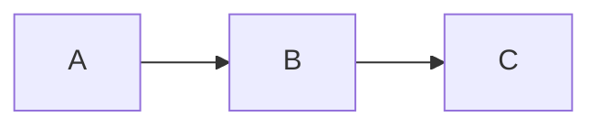

# [VISUAL] 块详细示例

## 知识标签 + Slide 引用关联示例

知识标签自身**不是** `[VISUAL]`，但可以紧跟一个 `[VISUAL]` 块：

````markdown
> [CASE STUDY: 银翼杀手的混响设计]
> 配乐大师 Vangelis 使用 Lexicon 224 创造了"心理上的雨夜"……

> [VISUAL]
> *   **Slide**: `S04_BladeRunner_City`
> *   **Layout**: `Image`
> *   **Scene**: 银翼杀手 (1982) 霓虹雨夜城市全景
> *   **Search**: `Blade Runner 1982 city rain neon cinematography`
````

## 视频型 Asset 规范

当 Slide 承载的是视频而非静态图片时，**Asset 字段必须直接指向视频文件**（`.mp4`/`.webm`），H5/PPT 引擎通过 Asset 的文件扩展名判断 Slide 类型（图片 vs 视频）。

> [!CAUTION]
> **Asset 指向 `.png`/`.jpg` 而视频链接放在块外正文** 是错误写法——引擎会将其渲染为图片 Slide，视频无法播放。

**正确格式**：

````markdown
> [VISUAL]
> **Slide**: W01_S06d_Video
> **Layout**: `Full`
> *   **Asset**: 
> **Source**: `Video` — 来源说明
> **Duration**: `2m30s`
> **TimeCategory**: `activity`
> **Text**: 视频标题
> **Scene**: 播放内容的简要说明。
````

> [!IMPORTANT]
> **Duration 归因决策指引**：
> - ≤30s 的短片段（嵌入叙事流的动画/GIF/微演示）→ `lecture`
> - >30s 的视频（案例纪录片/解析视频/完整演示）→ `activity`
> - 网站 Demo 互动探索 → `explore`（需手动估算时长）
>
> 当不确定时，默认使用 `activity`。作者可根据实际教学场景覆盖。

**禁止行为**：
- ❌ Asset 指向 `.png` 静帧封面图，而将 `.mp4` 路径放在块外 `▶️` 行中
- ❌ 向已有视频 Asset 的 VISUAL 块插入额外的图片 Asset 或 `Asset (AI fallback)` 行
- ❌ 删除或覆盖已有的视频 Asset 路径
- ❌ 视频 Asset 缺少 `Duration` 和 `TimeCategory` 字段（学时统计将产生盲区）
- ❌ **在同一 `[VISUAL]` 块中放置多个视频 Asset**（H5 引擎每块只渲染一个主 Asset，多视频必须拆分为独立 VISUAL 块并间夹叙事段落）
- ❌ **使用 `▶️ [链接文本](路径)` 语法引用视频**（引擎无法识别，必须使用 `` MD 图片语法）

---

## 内联代码块/图表/表格关联示例

`[VISUAL]` 块支持自动关联紧随其后的 Markdown 代码块或表格。解析器会将这些纯文字内容吞并为该 Slide 的内嵌视觉资产，在 H5 端以代码卡片/Mermaid 图表/结构化表格渲染，在 PPT 端以等宽代码框/API 渲染图片/表格文本框呈现。

### Mermaid 图表关联（Layout 自动推断为 `Diagram`）

````markdown
> [VISUAL]
> *   **Slide**: `W03_S12_JTBD_Flow`
> *   **Scene**: JTBD 方法论的三阶段流程图——从需求发现到方案验证


接下来我们沿着这张流程图，逐步拆解每个阶段的核心动作……
````

> **要点**：
> - 作者未指定 `**Layout**`，解析器自动推断为 `Diagram`
> - 无需提供 `**Asset**` 图片路径——H5 端通过 Mermaid CDN 动态渲染 SVG，PPT 端通过 mermaid.ink API 转为图片
> - 代码块与 `[VISUAL]` 块之间允许 ≤1 行空行

### JavaScript 代码块关联（Layout 自动推断为 `Code`）

````markdown
> [VISUAL]
> *   **Slide**: `W05_S08_D3_bindData`
> *   **Layout**: `Code`
> *   **Scene**: D3.js 数据绑定的核心三行代码
> *   **Text**: 数据绑定：select → data → enter

```javascript
d3.select("svg")
  .selectAll("circle")
  .data(dataset)
  .enter()
  .append("circle")
  .attr("r", d => d.value);
```

大家看屏幕上这段代码。`selectAll` 先选中了一组并不存在的圆……
````

> **要点**：
> - 作者显式指定了 `Layout: Code`（也可以省略，解析器会自动推断）
> - 代码块内容会在 H5 端以带语法高亮的代码卡片渲染（Mac 终端风格，红黄绿点装饰栏）

### Markdown 表格关联（Layout 自动推断为 `Table`）

````markdown
> [VISUAL]
> *   **Slide**: `W02_S15_Color_Comparison`
> *   **Scene**: 暖色系与冷色系的心理效应对照表

| 色系 | 代表色 | 心理效应 | 适用场景 |
|:---|:---|:---|:---|
| 暖色系 | 红/橙/黄 | 兴奋、食欲、紧迫感 | 餐饮/促销/警告 |
| 冷色系 | 蓝/绿/紫 | 冷静、信任、专业感 | 科技/金融/医疗 |

如表格所示，色系选择直接影响用户的潜意识判断……
````

> **要点**：
> - 表格以 `|` 管道符开头的连续行被识别，自动设置 `assetType: table`
> - 无需 ` ``` ` 包裹，解析器直接识别原生 Markdown 表格语法

---

## 反面示例：常见关联错误

### ❌ 代码块与 VISUAL 间距过大（>1 行空行）

````markdown
> [VISUAL]
> *   **Slide**: `W03_S12_JTBD_Flow`
> *   **Scene**: JTBD 方法论流程图



````

> ⚠️ **问题**：VISUAL 块与代码块之间有 **2 行空行**。解析器的 Look-Ahead 最多跳过 1 行空行，超过后视为不关联。该代码块将被当成普通正文处理（在 H5 端被丢弃或错误渲染），Slide 将缺少视觉资产并显示断链占位符。

### ❌ VISUAL 与代码块之间夹杂讲稿文字

````markdown
> [VISUAL]
> *   **Slide**: `W05_S08_Code`
> *   **Scene**: 代码演示

这段代码展示了核心逻辑：

```javascript
console.log("hello");
```
````

> ⚠️ **问题**：VISUAL 块和代码块之间插入了一行讲稿文字。解析器遇到非空非代码行时立即停止 Look-Ahead。代码块未被关联。**正确做法**：将讲稿移到代码块**之后**。

### ❌ 同时指定 Asset 图片和代码块

````markdown
> [VISUAL]
> *   **Slide**: `W05_S08_Code`
> *   **Layout**: `Code`
> *   **Asset**: 
> *   **Scene**: 代码演示

```javascript
console.log("hello");
```
````

> ⚠️ **问题**：同时提供了 `**Asset**` 图片路径和后续代码块。解析器执行"代码块优先"策略（决策 #1），将忽略 `Asset` 图片路径，仅使用代码块内容。图片永远不会被渲染。**正确做法**：二选一——要么用 `**Asset**` 指向图片，要么用代码块。
