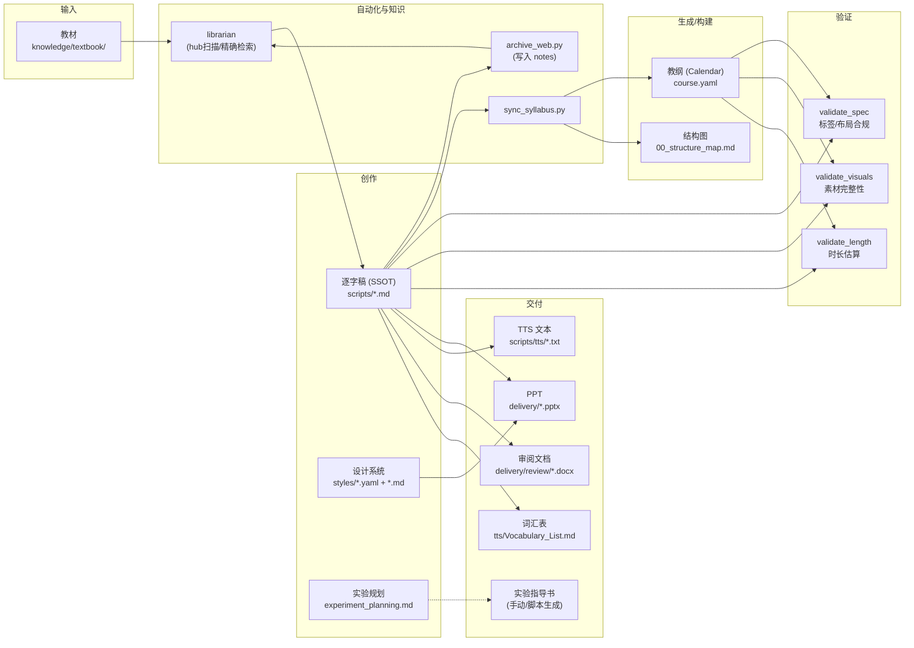
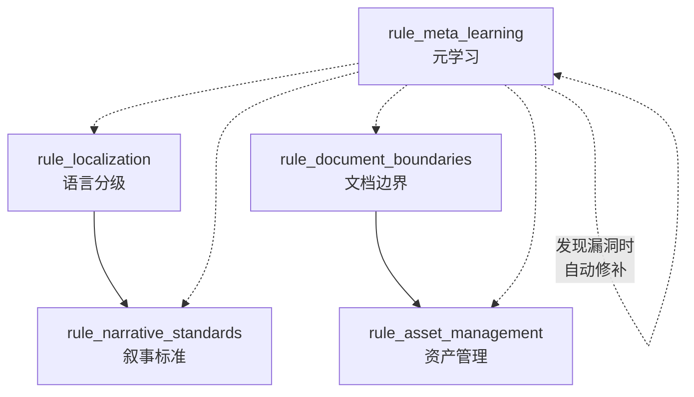

# 架构与设计哲学

> 本文档面向深度使用者，阐述工作区的架构分层、设计原则与数据流。

## 核心设计原则

### 1. 三层解耦

```text
┌─────────────────┐
│   内容层         │  knowledge/ + scripts/ + styles/
│   Content        │  教师写作，Agent 辅助，设计系统
├─────────────────┤
│   自动化层       │  .agent/ (rules + skills + workflows)
│   Automation     │  验证、转换、生成
├─────────────────┤
│   交付层         │  delivery/ + visuals/
│   Delivery       │  PPT、TTS、审阅文档
├─────────────────┤
│   实验层 (New)   │  practices/ + 教务材料/04_Experiment_Generator/
│   Experiment     │  手动/半自动化，独立于通用生成链路
└─────────────────┘
```

**每一层相互独立**：修改验证规则不影响脚本内容，更换 PPT 引擎不需要重写脚本。

### 2. 课程无关 (Course-agnostic)

所有自动化工具通过 `--course <课程名>` 参数定位目标课程，不硬编码任何路径。这意味着：

- 同一套验证脚本可用于「实习指导」和「交互产品开发」
- 新增课程无需修改任何工具代码
- 课程之间完全隔离，互不影响

### 3. 单一事实来源 (SSOT)

| 信息类型 | 唯一定义位置 | 其他地方 |
|:---|:---|:---|
| Slide 定义 | 脚本中的 `> [VISUAL]` 块 | 只引用，不重复 |
| **课程大纲 - 结构性字段** | **脚本 Frontmatter** (week/topic/hours/objectives) | `00_structure_map.md` (自动生成) |
| **课程大纲 - 教案索引** | **`course.yaml` calendar[]** (supported_objectives/task/steps/teaching_requirements 结构化) | 教案生成器直读 (ADR 007) |
| **课程目标** | **`course.yaml` objectives[]**（≥3 条/维度，`mappings` 数组格式） | 教案首页生成器直读；`/audit F4/F5` 校验 (ADR 010) |
| 实验规划 | `practices/experiment_planning.md` | `course.yaml` 仅做学时校验，不生成内容 |
| 课程元数据 | `course.yaml` (静态部分) | 只读取，不复制 |
| **多班排课参数** | **`course.yaml` classes[]**（`week_range`/`official_weeks`/`excluded_weeks`） | 教案按课程出一份；进度表按班各出一份（ADR 012） |
| 教材与笔记知识 | `knowledge_hub.yaml` (主摘要引擎) | 仅从原教材或 Web 提取摘要，原文件作为 `textbook/` 或 `notes/` |
| 全局规则 | `.agent/rules/` | 只遵守，不改写 |
| 设计系统 | `<课程>/styles/` (`.md` + `.yaml`) | 工作流只读取，不改写 |
| 架构决策 | `.agent/memory/ADR.md`（全局） | 只追加，不删除 |

## 数据流



## 规则系统

5 条全局规则构成行为约束网络，始终对 Agent 生效：

| 规则 | 文件 | 核心约束 |
|:---|:---|:---|
| **本地化协议** | `rule_localization.md` | 三层语言分级：叙事纯中文、概念中为主、软件锚点保留英文 |
| **资产管理协议** | `rule_asset_management.md` | 命名前缀 (`Sxx_`)、来源后缀 (`_ai/_web/_cap`)、模块卡槽目录 |
| **文档边界协议** | `rule_document_boundaries.md` | SSOT 执行 — Slide 定义在脚本内联，结构图不含视觉设计 |
| **叙事标准** | `rule_narrative_standards.md` | 反翻译腔、韵律句法、过渡焊接、朗读测试 |
| **元学习协议** | `rule_meta_learning.md` | Agent 学到新知必须固化到文档，不依赖对话记忆 |

### 规则协作关系



## 技能系统

6 个 Skill 构成能力矩阵：

| 技能 | 类型 | 触发方式 | 核心能力 |
|:---|:---|:---|:---|
| `validation_suite` | 工具集 | `--course` 参数 | 包含 `sync_syllabus` 及 5 个验证脚本（规范、视觉、时长、知识枢纽） |
| `script_format` | 格式规范 | `/write` 工作流 | 知识标签、VISUAL/ACTIVITY 块、Layout 枚举 |
| `narrative_archaeologist` | 调研引擎 | `/write` 自动触发 | 深度 Web 调研：Search Playbook + Quality Gate |
| `librarian` | 知识枢纽引擎 | `/write` 中主动触发 | 三层查询漏斗：主索引扫描 → 关键词检索 → 原文提取，兼顾存档回写 |
| `pptx` | 生成器 | `/ppt` 工作流 | pptxgenjs 驱动的 PPT 生成 |
| `docx` | 处理器 | `/export` | Word 文档创建/编辑/分析 |
| `pdf` | 处理器 | 直接 | PDF 提取/合并/OCR |

## 验证套件架构

```text
┌─────────────────────────────────────────┐
│  validate_project.py (统一入口)           │
│  └── --course "课程名"                   │
├─────────────────────────────────────────┤
│  validate_knowledge.py → hub完整性/性能   │
│  validate_spec.py    → 标签/布局/合规     │
│  validate_visuals.py → 素材完整性        │
│  validate_script_length.py → 时长/TTS    │
├─────────────────────────────────────────┤
│  export_review_docx.py → 审阅 Word       │
├─────────────────────────────────────────┤
│  script_parser.py (通用解析器 · 底层库)    │
│  BlockType: SPEECH | VISUAL | ACTIVITY   │
│             TAG | HEADER | META | ...    │
└─────────────────────────────────────────┘
```

## 扩展指南

### 添加新验证器

1. 在 `.agent/skills/validation_suite/scripts/` 下创建 `validate_xxx.py`
2. 导入 `script_parser` 使用通用解析能力
3. 接受 `--course` 参数
4. 成功返回 exit 0，失败返回 exit 1
5. 在 `validate_project.py` 的 `validators` 列表中注册
6. 更新 `SKILL.md`

### 添加新 Layout 类型

1. 在 `.agent/skills/pptx/layouts.md` 的统一映射总表中添加（SSoT）
2. 在 `script_parser.py` 的 `VALID_LAYOUTS` 集合中同步添加
3. 在 `ppt_layouts.js` 的 `LAYOUT_MAP` 中添加渲染映射

### PPT 引擎标题管道 (v3)

```text
Markdown 脚本
├── ### 标题行 ──→ ppt_parser.js 提取 ──→ visual.heading
├── [VISUAL] 块
│   ├── **headline**: → visual.headline
│   ├── **Text**: → visual.text
│   └── **Scene**: → visual.scene (AI 图片生成 prompt)
└──────────────────→ ppt_layouts.js extractTitle()
                     优先级: heading > headline > text > sceneSummary(scene)
                     字号: adaptiveTitleSize(title)
                           ≤10字 28pt / ≤18字 24pt / >18字 20pt
```

> **设计原理**：`scene` 字段是 AI 图片生成 prompt，不适合直接作为演示标题。`heading` 从 `###` 标题行提取，是面向观众的简短标题。
