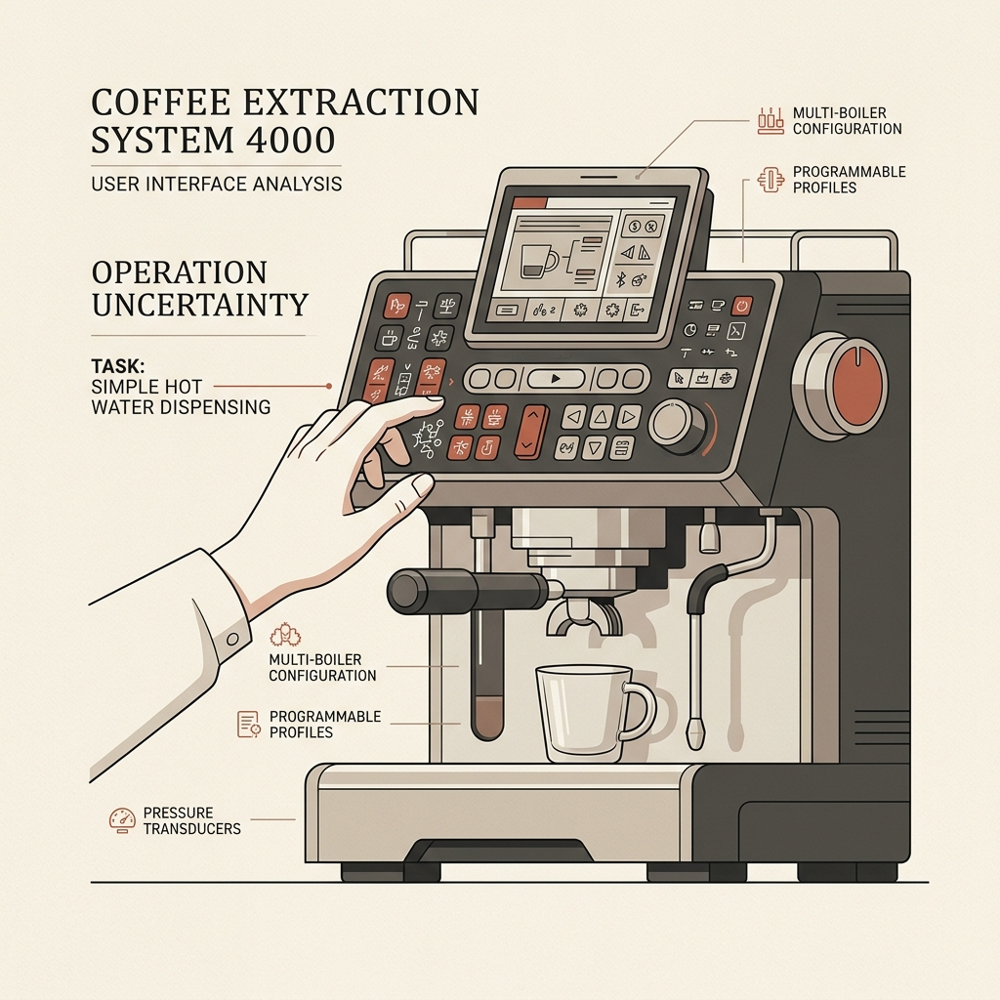
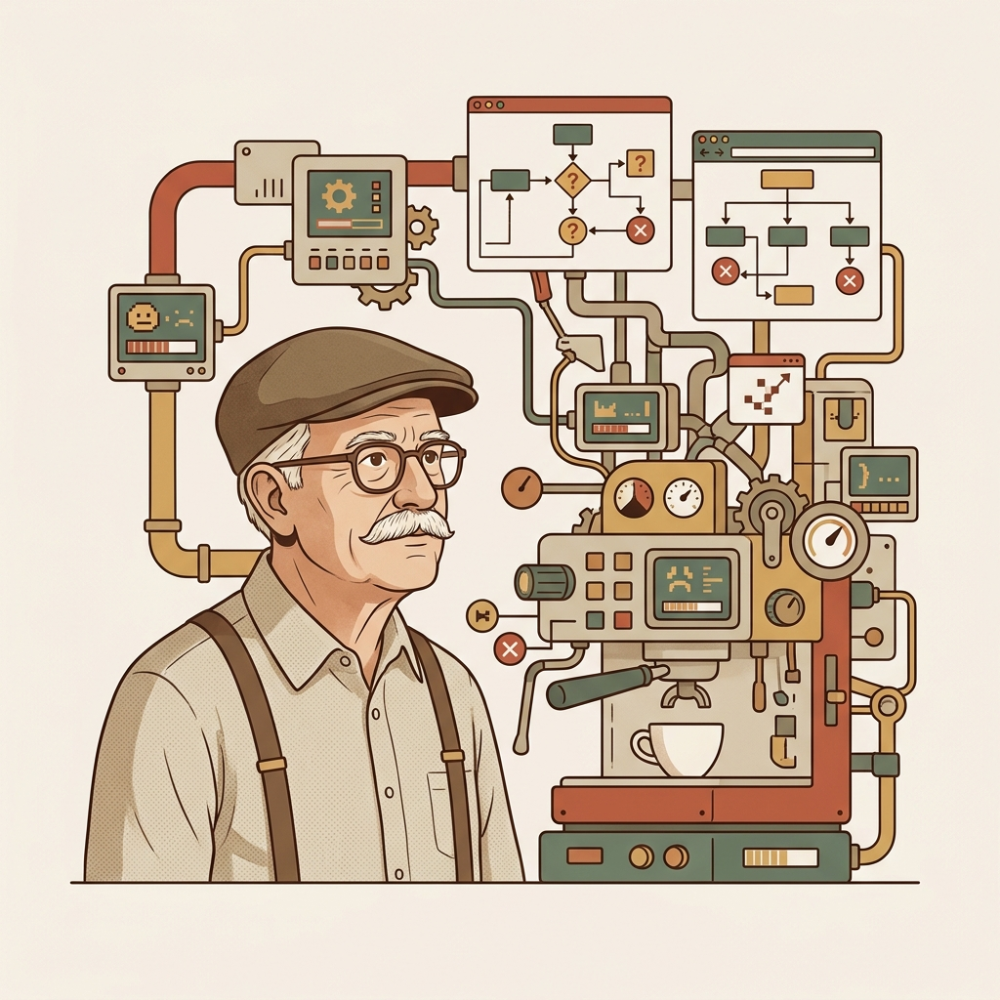
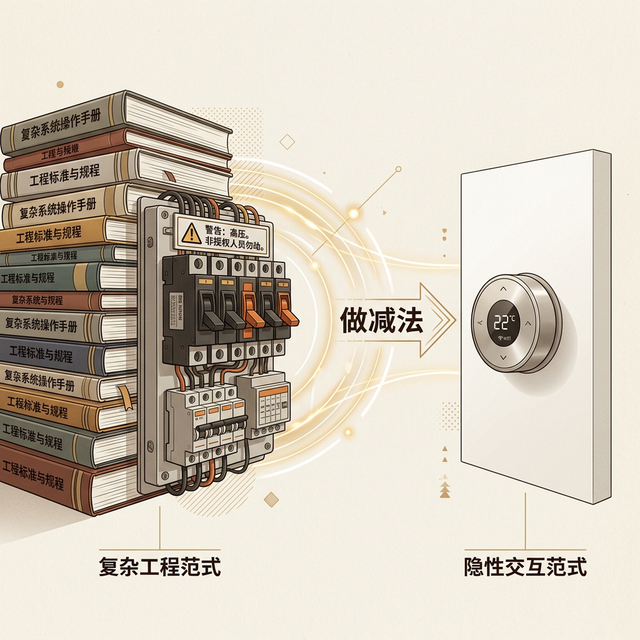
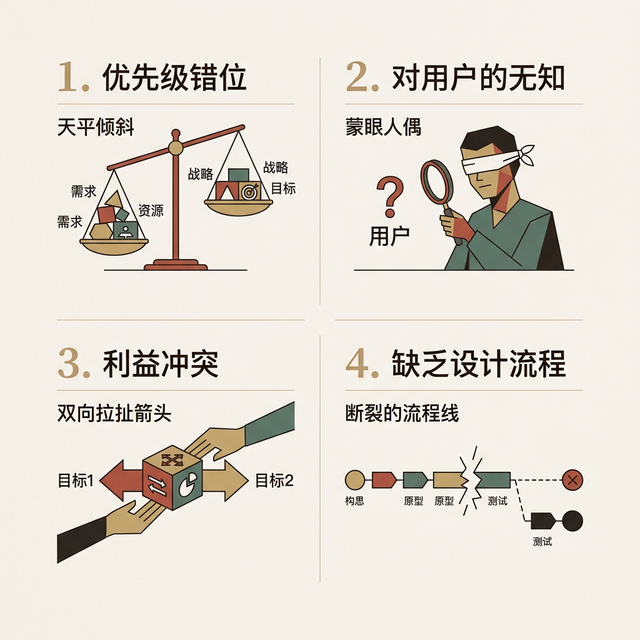
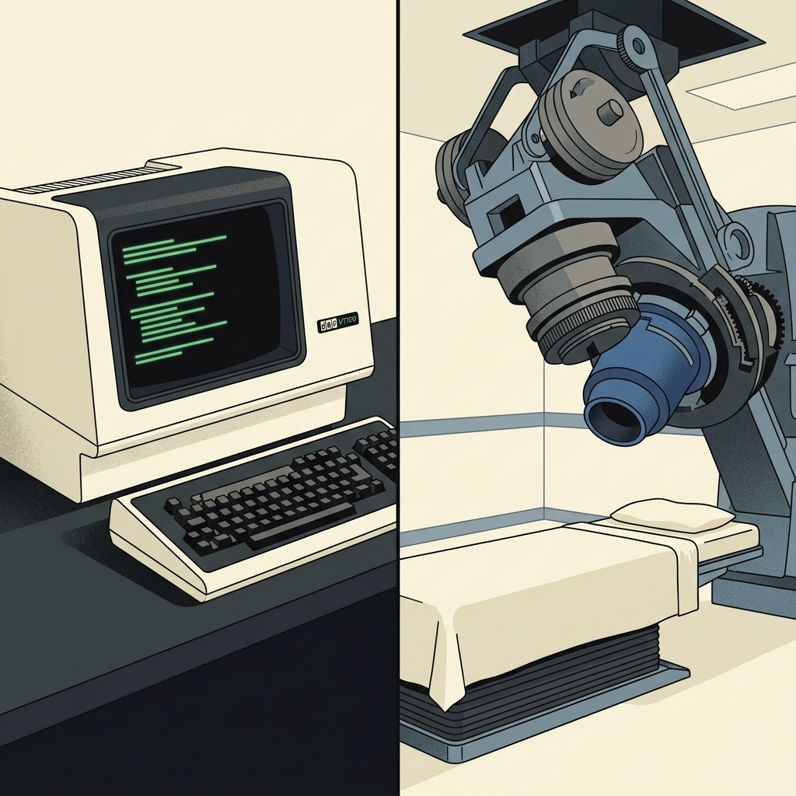
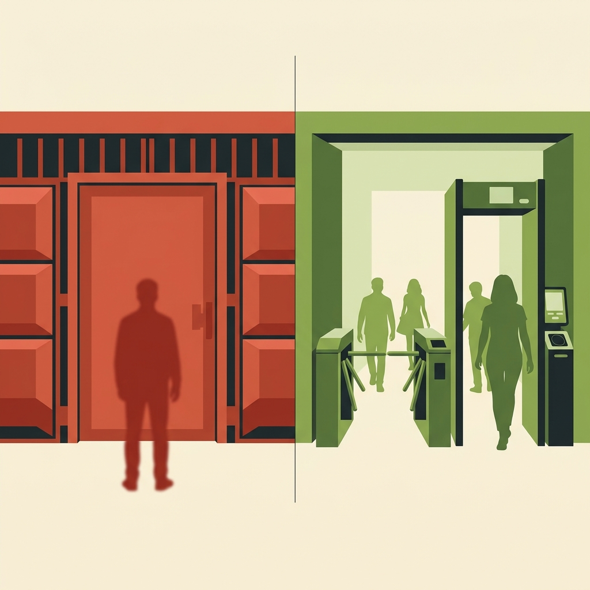
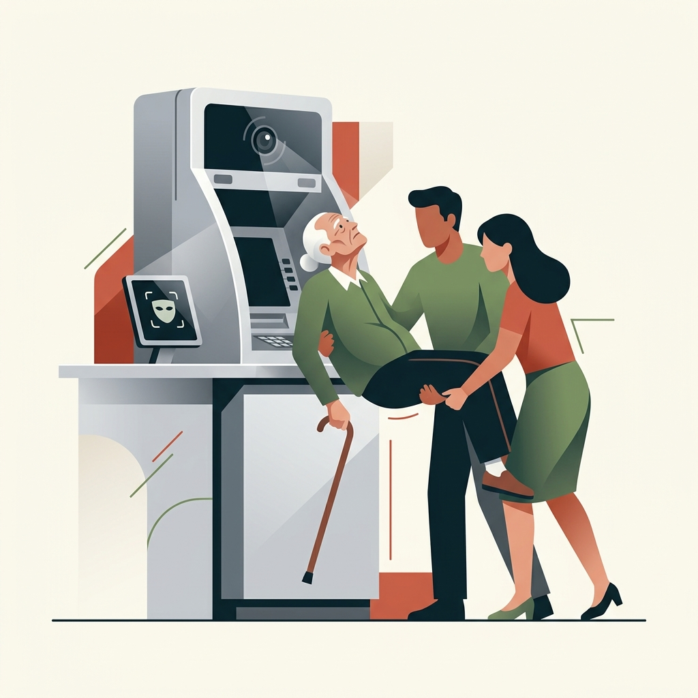
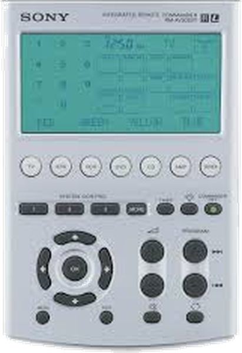

## 模块 1: 数字产品之殇 —— 我们为什么会抓狂？ (约 25 分钟)
<!-- BUDGET: 4500 chars | SLIDES: ≥9 | STATUS: done -->

### 1.1 开场：那些“反人类”的设计惨案
> [VISUAL]
> **Slide**: W01_S00
> **Layout**: `Full`
> *   **Asset**: 
> **Scene**: 概念插画：一台设计极度奢华但操作面板如同飞机驾驶舱般复杂的意式咖啡机。一只手在密密麻麻的按键上方犹豫不决，屏幕旁用图表标注着“目标：只需要一杯热水”。画面呈现学术极简的暖灰色调，用赤陶红强调用户的认知摩擦。

（讲师口述）：
在正式开始之前，我想先请大家回忆一个场景。你站在茶水间，面前是一台价值过万的高级咖啡机，面板上闪烁着蒸汽、萃取、清洗的各种指示灯，而你——只想接一杯能泡茶的**热水**。你按下了那个看起来最像水滴的图标，结果它开始磨豆子了。你的手指僵在半空中，感觉自己像个面对核按钮的白痴。

> [VISUAL]
> **Slide**: W01_S01
> **Layout**: `Full`
> *   **Asset**: 
> **Scene**: 纪实风格：一位满头白发的老人在公交车前部，举着老旧的智能手机焦急地试图扫码，身后隐约可见排队等待、神情焦躁的乘客。画面带有强烈的无助感和年龄带来的技术鸿沟，无需任何文字排版。

这个场景，在座每个人大概都经历过。但现在换一个视角：如果你是一位 70 岁的老人呢？2020 年 8 月，黑龙江哈尔滨一段广为流传的视频记录了真实的一幕——一位老人因没有智能手机无法出示健康码，被公交司机当场拒载，车上乘客非但没有帮助反而指责老人，最终民警赶到将老人带离。他不是不愿意付钱，他是**无法操作手机完成支付**。疫情期间更极端：无法出示健康码的老人被拒于地铁站外、超市门前、医院挂号窗口。一整个群体，被数字系统拒之门外。

**(Pause: 3s)**

> [VISUAL]
> **Slide**: W01_S01a
> **Layout**: `Split`
> *   **Asset**: 
> **Scene**: 概念肖像插画：交互设计大师 Alan Cooper (戴框架眼镜、留胡子的长者，穿着背带裤并戴着鸭舌帽) 正若有所思地望向一台极其复杂、毫无逻辑的咖啡机与抽象混乱的数字 UI 菜单交织而成的“高墙”，代表着令人抓狂的数字产品行为 (Digital Fail)。画面采用学术极简的暖象牙白背景，并用赤陶红与苔藓绿进行点缀，致敬《About Face》的经典风格。
> **Text**: Alan Cooper 与“数字产品行为” (Digital Fail)

这就是我们这门课要解决的核心问题。欢迎来到交互产品开发。这门课不是教你怎么画出漂亮的渐变色，或者写出花哨的代码动画——我们第一件事，是要学会怎么“不让人抓狂”，怎么不让技术成为一道高墙而不是一座桥梁。
无论是那台让你不知所措的咖啡机，在某个 App 的六级菜单里迷失自我的你，抑或是被数字系统拒之门外的老人，这些场景背后都指向同一个事实。

> [VISUAL]
> **Slide**: W01_S01_Book
> **Layout**: `Full`
> *   **Asset**: 
> **Scene**: 书籍封面展示：Alan Cooper 等人合著的经典教材《About Face 4: The Essentials of Interaction Design》。封面采用标志性的白、绿、蓝渐变背景，大号的“ABO UTF ACE” 镂空排版，体现交互设计的深度与经典感。
> **Text**: 《About Face 4: 交互设计精髓》

Alan Cooper 在《About Face》中尖锐地指出：数字产品常常失败，不是因为技术不够强，或者是需求没落地，而是因为它们表现出了极其恶劣的“产品行为”（Digital Fail）。

**(Pause: 3s)**

### 1.2 数字产品的四宗罪

> [VISUAL]
> **Slide**: W01_S01b
> **Layout**: `Grid`
> *   **Asset**: 
> **Scene**: 数字产品四宗罪列表卡片，每宗配一个拟人化图标。
> **List**: 1.粗鲁 (Rude) / 2.强迫人像计算机思考 / 3.邋遢习惯 (Sloppy) / 4.让人类承担苦力 (Heavy Lifting)

Cooper 在《About Face》中将这些恶劣的产品行为提炼为四个精准的维度，我称之为"四宗罪"：

**第一宗：粗鲁 (Rude)**
数字产品经常表现得像一个完全不懂看人脸色的暴君。在早期，粗鲁是弹出一个冰冷的错误对话框把责任推给你，逼你“确认”一个你根本看不懂的致命错误；而如今的粗鲁演变成了更隐秘的傲慢。比如拥有超级特权的**强制打断**：你正在重要会议上投屏演示，系统突然黑屏并强制开始更新，它完全无视你焦急的现实语境，粗暴剥夺你的控制权。再比如带有恶意的**情感绑架（Confirmshaming）**：想关掉一个满屏广告，它不给你一个直截了当的“关闭”按钮，而是逼你点击底部极小的一行灰色文字——“不，我宁愿做一个穷人”。这些居高临下、缺乏教养的行为，根本没有把用户当成一个需要尊重的人来对待。

**第二宗：要求人类像计算机一样思考**
举一个经典的例子：在 Microsoft Word 中，你想给正在编辑的文档重新命名。你能直接改名吗？不能。你得先关闭文档，或者使用"另存为"命令，保存新名字后再手动删除旧文件。这完全不符合人类的思维方式——在现实世界里，我们只需要在封面上划掉旧名字写上新名字就行了。但 Word 要求你按照它的文件系统逻辑来操作。

**第三宗：邋遢的行为习惯 (Sloppy Habits)**
注意，Cooper 说的“邋遢 (Sloppy) ”不是指界面长得丑，而是指**软件极其缺乏自我管理和收拾残局的能力**——就像一个毛手毛脚的小孩。
第一种邋遢是**丢三落四的“状态失忆”**：你花了十分钟填完一长串申请表，仅仅是切出去看一眼短信验证码，再切回来它竟然把页面重载了，数据一干二净。它没有窃取你的恶意，它只是粗心到忘记帮你保管上一个动作。
第二种邋遢是**乱放危险品的“高危排版”**：社交软件极易引发误拨的“视频通话”按钮常常紧挨着“返回”键。这并非系统故意设下陷阱，而像是一个 10 岁小孩漫不经心地把带刺的图钉丢在沙发上——纯粹的漫不经心与不负责任，却给用户制造了无处不在的雷区。

**第四宗：让人类承担苦力 (Heavy Lifting)**
计算机被发明出来本是为了做计算和苦力的，但在糟糕的设计下，人反而成了机器的“人肉搬运工”。比如当你输入银行卡号或手机号时，系统弹红报错，仅仅是因为你在数字之间习惯性地输入了空格——它宁愿让作为人类的你倒退光标一个个去删掉空格，也不肯自己多写一行只有 10KB 算力的自动清洗代码。

**(Pause: 3s)**

### 1.2.5 产品失败的四大根因

> [VISUAL]
> **Slide**: W01_S01d
> **Layout**: `Grid`
> *   **Asset**: 
> **Scene**: 产品失败四大根因概览卡片，每项配标志性图标：优先级错位（天平倾斜）、对用户的无知（蒙眼人偶）、利益冲突（双向拉扯箭头）、缺乏设计流程（断裂的流程线）。
> **List**: 1.优先级错位 (Misplaced Priorities) / 2.对用户的无知 (Ignorance About Users) / 3.利益冲突 (Conflicts of Interest) / 4.缺乏设计流程 (Lack of a Design Process)

那么，这些"反人类"的行为是怎么被制造出来的？是程序员故意的吗？当然不是。Cooper 进一步剖析了数字产品失败的四大根本原因——请看屏幕上这张图，我们逐一拆解：

**根因一：优先级错位 (Misplaced Priorities)**
很多团队把"按时交付"和"控制预算"放在第一位，把"用户体验"排在了第三甚至第四。管理层问的是"你们能不能在 deadline 前把这一版上线"，而不是"用户用这个东西会不会抓狂"。结果就是——产品是发布了，但用户一打开就想卸载。在硅谷的历史上，苹果是少数几家真正把设计放在工程和市场之前的公司——他们愿意为了一个按键的触感推迟整条生产线。而 Microsoft 在早期的 Windows 和 Office 中，经常选择先堆叠功能、再打补丁修体验。这两种哲学的差异，直接塑造了两家公司在用户心中截然不同的品牌调性。

**根因二：对用户的无知 (Ignorance About Users)**
最危险的无知，不是"不知道用户想要什么"，而是**自以为知道**。工程师天然倾向于按照底层的代码逻辑来直接映射界面——他们觉得"代码跑得通，界面这样放就是理所应当的"。但普通用户并不是技术专家，看到代码级的报错他们只会感到恐慌和内疚。
那么，Cooper 凭什么敢断言开发团队对用户无知呢？事实上，Cooper 创办的咨询公司在过去几十年里的核心业务，就是被各大世界 500 强企业请去“拯救”那些耗资巨大却极其难用、濒临退货的软件工程。在审计了成百上千个失败项目后，Cooper 及其团队发出了一个震聋发聩的诊断报告：在传统企业组织架构中，最终用代码敲定成百上千个功能细节的**程序员**，常年被“需求文档”和“工单”隔离在办公室里。他们几乎从未被获准走出大楼，去和真实的使用者进行过哪怕一次面对面的交谈。“写界面的不见用户，见用户的不写界面。” 这种极其普遍的组织隔离，直接切断了代码背后的同理心。这也是为什么 Cooper 后来逼不得已，发明了名震天下的 **“人物角色 (Persona)”** ——既然程序员见不到活人，那就贴一张“虚拟用户画像”在墙上，强迫他们去共情。

**根因三：利益冲突 (Conflicts of Interest)**
产品的购买者和使用者往往不是同一批人。一个 IT 部门的主管决定采购一套企业管理系统，他关心的是价格、兼容性和安全合规——而每天被迫使用这套系统的一线员工，关心的是"这个东西为什么这么难用"。当购买者的需求与使用者的需求发生冲突时，设计往往服务于掏钱的人而非真正使用的人，这就产生了结构性的体验灾难。

> [VISUAL]
> **Slide**: W01_S01e
> **Layout**: `Comparison`
> *   **Asset**: 
> **Scene**: 左侧：SAP ERP 典型操作界面截图，密密麻麻的文本框和字段代码，标注"仓库管理员的日常"。右侧：CIO 评估清单——功能数量、合规报告、许可证价格，标注"购买者的决策依据"。底部大字："购买者的暴政 (Tyranny of the Buyer)"。
> **List**: 仓库管理员的日常：密密麻麻的代码/无穷的文本框 vs 购买者的决策：功能清单/合规报告/许可证价格

这种利益冲突在企业级软件中最为普遍。你们可能没听过一家叫 SAP 的德国公司，但它的 ERP（企业资源规划）系统管理着全球 77% 的商业交易额。看屏幕左边——这就是 SAP 仓库管理员每天面对的界面：密密麻麻的文本框、看不懂的字段代码、动辄上百行的下拉菜单。再看右边——SAP 的客户是 CIO 和财务总监，他们评估系统时看的是功能清单的长度、数据合规性报告和每用户许可证价格。几乎没人问过仓库管理员觉得好不好用。Cooper 把这称为"购买者的暴政"(Tyranny of the Buyer)：**当掏钱的人和受苦的人不是同一个人，体验质量就永远排在采购清单的最后一项。**

**根因四：缺乏设计流程 (Lack of a Design Process)**
这是最根本的问题。很多团队的开发流程里有需求文档、有代码评审、有测试报告——唯独没有"设计评审"。没有人系统地去问："用户在这个节点的心理模型是什么？他们期望看到什么？我们展示的东西和他们的期望差距有多大？"没有设计流程，就意味着界面质量完全依赖程序员的个人品味——这就好像把建筑的采光、通风和空间美学全部交给水泥工来决定。
Cooper 进一步指出，很多企业以为在开发末尾找几个用户"测一测"就算是做了设计——这叫"事后粉饰"(Post-hoc Beautification)，不叫设计流程。真正的设计流程应该**贯穿产品开发的全生命周期**，从立项第一天就介入，而不是等到代码写完了再来"美化界面"。

> [DID YOU KNOW]

这四大根因里，Cooper 特别强调了第四点。他观察到一个有趣的规律：法律和医疗——两个最常由**领域专家**直接参与界面设计的职业——恰恰拥有最难用的软件系统。这绝非巧合。领域知识专家并不等于设计专家，就像一个心脏外科医生虽然精通手术台上的每一步操作，却可能完全不擅长设计一个让护士能快速找到患者病历的电子系统。

**(Pause: 3s)**

### 1.3 认知摩擦：机器逻辑对人类的入侵

> [VISUAL]
> **Slide**: W01_S01f
> **Layout**: `Comparison`
> *   **Asset**: 
> **Scene**: 左侧：物理世界可预测性三支柱示意——"重力"（石头下落箭头）、"因果即时性"（手靠近火焰→疼痛闪电符号）、"物理一致性"（固定的电灯开关或汽车踏板）。右侧：数字世界三支柱断裂——"无重力"（浮动按钮=按钮？装饰？追踪器？）、"反馈延迟"（点击→…→无响应）、"一致性崩塌"（App 更新→按钮全变位置）。中间用裂痕图案连接，标注"认知摩擦 (Cognitive Friction)"。
> **List**: 物理世界可预测性：重力/因果即时性/物理一致性 vs 数字世界三支柱断裂：无重力/反馈延迟/一致性崩塌

> [TECH NOTE]
> **认知摩擦** (Cognitive Friction) -- Alan Cooper 的核心术语：用户为理解数字产品底层逻辑而被迫消耗的额外脑力。物理工具天然可预测，数字产品却常令人措手不及。

（讲师口述）：
刚才我们讲了产品"为什么"会做出这些蠢事。现在我们来聊聊这些蠢事在用户脑子里造成了什么——**认知摩擦**。请看屏幕上这张对比图。

物理世界有一个数字世界永远无法复制的优势：**天然的可预测性**。这种可预测性建立在三根深埋直觉的支柱上。第一根是**重力**——你捡起一块石头，你知道它很重，松手它一定掉下去。第二根是**因果的即时性**——你把手放在火焰旁边，疼痛几乎零延迟地告诉你"滚开"。第三根是**物理一致性**——你家墙上的电灯开关永远在熟悉的位置，汽车的刹车踏板绝不会因为“系统升级”在明天随机跑到副驾驶去。一扇门的开合方向被它的物理铰链彻底锁定，永远不会无故改变。从你出生那天起，物理世界就一直在用这三根支柱训练你的操作直觉。

但在数字产品中，这三根支柱**全部断裂**。代码没有重力——屏幕上的一个方块既可以是导航按钮，也可以是纯装饰标签，甚至可能是一个侵害你隐私的追踪器。反馈可以被延迟或吞噬——你点了"提交"，页面纹丝不动，你无法判断系统是在处理还是已经崩溃。物理一致性荡然无存——同一个 App 更新后可能把所有按钮换了位置，昨天好用的流程今天完全不行。你无法通过"看"和"摸"来区分任何东西。

Norman 举过一个精辟的对比：一个旧式的物理温度计，你瞥一眼就知道室温——那根水银柱的长度直接映射了温度。但一个智能恒温器的数字屏幕上显示"23度"，你能确定这是实时室温、设定温度、还是某个传感器的历史均值吗？物理温度计的信息是"自解释的"(Self-Explanatory)，而数字屏幕上的信息需要额外的认知加工才能理解。

当产品经理和程序员把那些属于机器运行的底层逻辑（比如数据库索引、接口调用顺序）直接暴露给用户时，用户就会感到挫败。记住，用户不关心你的系统有多复杂，他们只关心自己能不能顺畅地达成目标。

> [CASE STUDY]

> [VISUAL]
> **Slide**: W01_S01g
> **Layout**: `Full`
> *   **Asset**: 
> **Scene**: 真实的 DEC VT100 实体终端机（当年操作员面临的物理设备硬件）与 Therac-25 放射治疗仪的机器构造档案合集。虽然没有直接展示那块“撒谎的屏幕”，但通过冰冷笨重的医疗设备实体，传递出了机器逻辑对脆弱人体的物理压迫感。**（注：此为真实历史档案图引用，严禁利用图像 AI 生成）**
> **Text**: 认知摩擦害死人：Therac-25 放射治疗仪事故

认知摩擦在绝大多数时候只是让你骂两句——但在某些场景下，它能杀人。1985 年到 1987 年间，加拿大一台名叫 **Therac-25** 的放射治疗仪，因为界面设计缺陷造成至少 6 起严重辐射过量事故，3 名患者死亡。其中一位患者本应接受 180 拉德的治疗剂量，实际却被注入了**数万拉德**——正常值的一百倍以上。他在 5 个月后去世。

最可怕的不是Bug本身，而是**界面对操作员撒了谎**。机器屏幕全程显示“no dose”——没有剂量，一切正常。操作员看到一个叫 “Malfunction 54” 的报错代码，但没有任何说明告诉她这意味着什么。由于机器平时小毛病不断，她早已习惯了按 “P” 键（Proceed，继续）跳过报错。这一次，按下 P 键，就是按下了死亡按钮。

这个案例我们在后面讲到三大模型的时候还会回来——Therac-25 的悲剧，本质上就是**表现模型说“一切正常”，工程实施模型已经完全失控**。界面欺骗了操作员的心智模型。

### 1.4 数字化的代价：物理转数字，真的全是好事吗？

Yvonne Rogers 在《Interaction Design》中花了大量篇幅讨论一个容易被忽视的问题：当我们把物理世界的活动搬到数字世界时，我们究竟**失去了什么**？

曾经，停车计时需要往咪表里塞硬币。现在呢？掏出手机、打开 App、输入车位号、扫码支付——看似更方便了。但这里隐含着一个假设：**用户必须拥有一部智能手机，且电量充足，还得会操作这个 App**。

这种"数字化转型"对以下人群是**排斥性的**：

> [VISUAL]
> **Slide**: W01_S01c
> **Layout**: `Split`
> *   **Asset**: 
> **Scene**: 数字化排斥四类人群图示，每类配场景图标。
> **List**: 不使用智能手机的老年人 / 手机没电无数据者 / 隐私敏感用户 / 辅助技术依赖者

*   不使用或不会使用智能手机的老年人
*   手机没电或没有移动数据的人
*   不愿在网上提供个人信息和信用卡的用户
*   使用辅助技术的残障人士，如果 App 的无障碍支持做得不够

Rogers 特别指出，这些人群不是边缘少数——它们可能就是你的父母、你的祖父母、你一个月后手机没电时的自己。数字化创造了便利，但同时也创造了新的不平等。
当一个城市取消了所有公交车上的投币口，只留下扫码支付，它本质上做了一个关于"谁有权乘坐公共交通"的社会选择。

> [VISUAL]
> **Slide**: W01_S01h
> **Layout**: `Comparison`
> *   **Asset**: 
> **Scene**: 概念插画：左侧"一刀切"（警告的赤陶红色系）—— 一扇冰冷且完全封闭的数字闸门，将模糊的人影拦截在外；右侧"并行"（通行的苔藓绿色系）—— 宽阔的通道，同时包含着物理闸机和数字扫码双重入口，象征设计上的包容与退路。
> **List**: ❌ 一刀切：强制消灭旧方式 vs ✅ 并行路径：物理与数字手段双通道

Rogers 由此引出了一个关键的设计理念：**过渡性设计 (Transitional Design)**。好的数字化转型不应该是"一刀切"地消灭旧方式，而应该在一段时间内提供**并行的交互路径**——既保留人们熟悉的物理方式（投币、纸质表单、柜台办理），又提供新的数字选项，让不同能力水平的人群都能以自己的节奏完成过渡。请看屏幕上的对比——左边是反面教材，右边是并行路径的正面示范。这不是技术问题，这是**设计伦理**问题。

这个理念在全球各地正在被越来越多的城市采纳。

> [VISUAL]
> **Slide**: W01_S01h_Cases
> **Layout**: `Grid`
> *   **Asset**: 
> **Scene**: 三个并列的复古静物特写组合，采用学术简约的低饱和暖色调。从左至右依次为：带零钱槽的老式公交车投币口、复古的医院电话听筒、一本经典的纸质银行存折。画面必须纯净，没有文字、字母或数据排版幻觉，仅通过物本质感传达“保留退路”的温度。
> **List**: 1. 交通：新西兰保留硬币投币 / 2. 医疗：英国 NHS 保留电话预约 / 3. 金融：日本银行保留纸质存折

> [STORY TIME]
> 新西兰的公共交通系统在 2024 年推出全国统一的电子票务卡时，明确承诺在至少三年的过渡期内保留所有公交车上的现金投币功能——因为他们发现，强制数字化会不成比例地影响老年乘客、游客和低收入群体。

> [STORY TIME]
> 英国的 NHS（国家医疗服务体系）在推行在线预约系统时，同样保留了电话预约和柜台到访两条通道，并培训前台人员协助不会使用智能手机的患者。

> [STORY TIME]
> 日本的银行系统虽然提供了高度先进的手机银行，但至今仍保留着遍布全国的实体自动柜员机网络和存折打印服务——他们深知，60 岁以上人口占全国三分之一，任何"全面数字化"的举措都必须提供退路。

> [VISUAL]
> **Slide**: W01_S01i
> **Layout**: `Full`
> *   **Asset**: 
> **Scene**: 数字鸿沟主题视觉海报。中央：一位老人被家属架起对准银行柜台摄像头的剪影。周围环绕关键数据标签："60 岁以上网民仅占 10.3%"、"日均 2 万次无健康码投诉"、"94 岁，被迫适配机器"。底部以警示色标注："数字化转型 ≠ 一刀切淘汰"。
> **Text**: 数字化转型 ≠ 一刀切淘汰

> [STORY TIME]
> 2020 年 11 月，湖北广水市一名 **94 岁的老人**为了激活社保卡，被家人抱到银行柜台进行人脸识别。画面中老人双腿颤抖、无法站稳，被两名家属架着勉强对准摄像头。这张照片在社交媒体广泛传播，成为"数字鸿沟"最具冲击力的视觉符号。

> [STORY TIME]
> 同月，湖北秭归一名老人冒雨前往社区缴纳医保，被告知"不收现金"，只能通过手机完成。

央视网当年数据显示，中国 60 岁以上网民仅占总网民的 **10.3%**，疫情期间因"无健康码"无法就医的老年人投诉量日均超过 **2 万次**。

当我们谈论"数字化转型"时，请永远记住这个画面——一个 94 岁老人被迫"适配"机器，而不是机器适配她。

> [DID YOU KNOW]

> [VISUAL]
> **Slide**: W01_S01j
> **Layout**: `Comparison`
> *   **Asset 1**: 
> *   **Asset 2**:  
> **Scene**: 强烈的实物照片对比图：左侧是早期典型的满布几十个密密麻麻相似按键的、患有“按钮繁殖症 (Buttonitis)” 的普通电视遥控器；右侧是著名的「TiVo 花生遥控器 (Peanut Remote)」原版实物图，按键极少且形状分区明显，符合人体工学。底部标注："按钮繁殖症 (Buttonitis) 及其解药"。**（注：此幻灯片适用从网络/教材引入两张真实的历史设备照片，避免由 AI 生成，以维护案例的绝对真实感）**
> **List**: 典型遥控器：满是形状相同的按键 vs TiVo「花生」遥控器：克制的核心物理按键

Rogers 在教材中还引用了一个极具启示性的正面案例。TiVo（早期的数字录像设备）的产品设计总监在设计遥控器时，做了一个不寻常的决策——让真实用户参与设计的每一个细节，从手握感到电池仓位置。他的团队甚至发明了一个内部术语来描述他们极力抵抗的趋势：**"按钮繁殖症" (Buttonitis)**——每当工程师想到一个新功能，就想在遥控器上加一个新按钮。最终他们把物理按钮严格限制在核心功能，其余功能通过屏幕菜单呈现。TiVo 遥控器后来获得了众多设计大奖。这个案例证明了**克制**，而非堆砌，才是好设计的本质。

所以，当你在 实验1(Exp1) 中去发现"痛点"时，不要只盯着"怎么让这个功能更顺畅"——有时候，**数字化本身就是痛点的来源**。一个真正有同理心的交互设计师，必须考虑到那些被数字化浪潮抛在身后的人群。这也是为什么我们强调"以人为本 (People-Centered Design)"而非"以技术为本"——Rogers 用了一个更精准的术语：**People-Centered Design**，刻意用"人"替代"用户"，因为我们要设计的对象不仅仅是"用户"这个抽象标签，而是活生生的、有情绪、有局限、有文化背景的完整的人。

**(Pause: 3s)**

---
