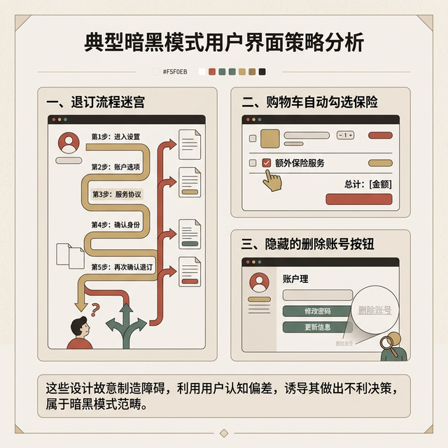
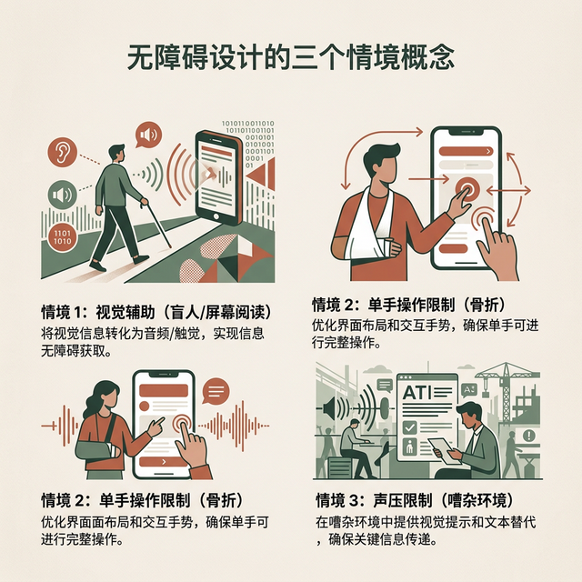

## 模块 4: 防止摩擦的五把武器：设计原则 (约 25 分钟)
<!-- BUDGET: 4500 chars | SLIDES: ≥10 | STATUS: done -->

理清了心理模型，下一步需要动用战术维度的准则来打造表现模型。Yvonne Rogers 在标准教材中给出了经典的防止摩擦设计五原则。

### 4.1 可见性 (Visibility) 与 反馈 (Feedback)

> [CASE STUDY]

> [VISUAL]
> **Slide**: W01_S05a
> **Layout**: `Image`
> *   **Asset**: 
> **Scene**: 机场自动感应水龙头特写，一个困惑的旅客手持满是泡沫的双手，正试图去拧动一个完全没有接缝的平滑金属装饰头。旁边打上一个巨大的红色问号。

在讨论极简主义之前，要直面一个现实的设计灾难。Cincinnati 国际机场的卫生间曾部署了一批全金属的自动感应水龙头。从卫生防疫角度看，非接触式设计完美规避了交叉感染。但在真实环境里，大批旅客站在洗手台前，根本无法判断水龙头是自动开启的。他们用力扭动那个不具备机械结构的顶端装饰头，甚至弯下腰去水槽底翻找隐蔽开关。这场闹剧的根源在于：水龙头的外观抹除了触发动作的物理线索。设计者未能将“将手掌平放入感应区”这个操作门槛可视化。这就是可见性为零的极简设计。

可见性原则定义了交互的第一道门槛：**重要的操作入口、警示状态必须显而易见**。如果一个涉及高额资金转移的确认按钮被折叠在了汉堡菜单的第三层，或者某个关键的后台任务正处于错误等待状态却不在前台展示警告灯，用户就如同面对一台断电的黑箱机柜，所有的操作都会陷入瞎猜的恐慌。与可见性直接绑定的，是 Jakob Nielsen 十大可用性启发式原则中的第一项——系统状态可见性。当用户把信用卡插入 ATM 机时，屏幕上哪怕是一个意义的旋转沙漏，都能极大地舒缓操作者对于吞卡风险的焦虑。

与可见性伴生的第二项要求是**反馈 (Feedback)**：系统必须对用户的每一项动作回执一张即时的感官确认单。

> [LIFE CONNECT]

> [VISUAL]
> **Slide**: W01_S05b
> **Layout**: `Split`
> *   **Asset**: 
> **Scene**: 左侧：刀刃切开硬面包的特写，标注三种感官输入（视觉：面包屑掉落；听觉：刀片摩擦硬壳的咔嚓声；触觉：刀柄传递的物理阻力）。右侧：缺乏反馈的数字黑洞，用户按下一个响应波纹的纯灰按钮，头顶冒出问号。
> **List**: 物理界的多模态即时反馈 / 屏幕界面的单一黑洞

回忆物理生活中用厨刀切片面包的过程：刀尖刺破面包硬壳的脆响（听觉）、刀身切入面团引发的粘滞阻力（触觉）、切割线产生碎屑崩塌的画面（视觉）。操作者的神经中枢在毫秒级时间内接收这三组并行数据，并瞬间锚定“切割已生效”的判定。
在玻璃触摸屏上，一切物理颗粒感被强行抹平了。当用户的手指按压屏幕上一处色块，如果界面没有产生任何色彩瞬变（视觉暗下或反白）、没有任何马达震动（触觉）、没有任何提示音（听觉），用户便进入了交互真空状态。这种反馈黑洞会诱发猛烈的连续点击行为，进而导致系统重复提交表单或死机崩溃。

> [TEACHING MOMENT]

在这里，必须纠正数字媒体艺术专业同学常犯的视觉中心主义。在界面反馈系统中，**声音（Audio）**拥有超越视觉图形的穿透力，应当被视作交互设计的指挥棒，这被称为**听觉示能 (Sonic Affordance)**。

1. **物理材质的数字投影**：在 macOS 中将废弃文稿拖入垃圾桶时那声干脆的“揉废纸声”，就是在用隐喻警告用户：接下来发生的是破坏性操作，犹如粉碎纸张一般逆。如果你设计一款木纹质感的复古打字机 App，键盘敲击声必须是厚重且具备机械回弹感的咔嗒声，一旦错用高频的电子哔哔声，用户的心理防线便会瞬间出戏。
2. **负面约束的声带**：当用户在界面中执行被禁止的非法越界动作时（例如在不能拖拽的边缘松手），系统往往不需要弹出刺眼的红色警告框，只需配以低频、沉闷的撞击音效。这种设计在不挤占屏幕像素资源的前提下，温柔地传达了“此路不通”的边界规则。

> [DID YOU KNOW]

听觉反馈在现实场景中最的应用存在于**日本铁路系统 (JR)**。每个车站不单纯播放各异的离站旋律，而是构建了一整套无需视觉参与的**地下空间听觉导航系统 (Sonic Wayfinding)**。
东京地铁利用鸟鸣声对不同形态的月台进行坐标标定：供盲人辨识位置时，开敞型的岛式月台阶梯口循环播放“草地鹨”叫声，而有着撞墙风险的封闭型侧式月台阶梯口则播放“夜莺”或“布谷鸟”啼叫。视障乘客跨入检票口的一瞬，听觉便在脑海中绘制出了精准的地形测绘图。这套通过鸟类鸣响建立环境感知的声学基建，是最顶层的无障碍反馈设计。

**(Pause: 3s)**

> [ACTIVITY]
> **Type**: `Practice`
> **Duration**: `5min`
> **Desc**: 盲听挑战：声音隐秘的操纵逻辑
> 讲师播放 3 段经典数字产品音效（Windows 报错音底噪、Slack 活泼的消息提示音、特斯拉低频锁车声）。
> 要求学生完全闭眼倾听，并在纸上快速作答：
> 1. 这个音效的频率和质感暗示了何种物理材料属性？
> 2. 它在系统可用性指标中投射了哪种状态（警报、成功确认还是安全保护）？

### 4.2 约束 (Constraints) 与 一致性 (Consistency) 的博弈

即便提供了充分的提示音与高可视化的按钮，人类在疲劳或信息过载状态下依然会做出致命的逆向选择。设计者被迫切换防线，使用物理与代码的双重屏障。

> [VISUAL]
> **Slide**: W01_S05c
> **Layout**: `Comparison`
> *   **Asset**: 
> **Scene**: 上半区：事后验证惩罚机制（用户全神贯注填完两千字的繁杂注册表单并点击验证按钮后，系统突然触发全屏红框报错提示"密码因未含特殊标点而失效" = 受挫与愤怒）。下半区：前端预防式防御机制（密码输入框悬挂有强弱密码指示条及规则池，在要求尚未被完全满足前，唯一的提交按钮被铁血锁定为点击的淡灰色 = 安全可靠的控制权转移）。

**约束 (Constraints)** 是将用户的非法操作冲动扼杀在触发前的手段。Rogers 将其划为截然不同的两条路线：**预防式约束**始终具备压倒性优势。系统利用代码逻辑在日期选择模块中将二月三十日变为点击的灰色，从源头上抹除了时间穿越的荒唐数据；**事后式约束**则是怠惰的开发习惯：放任用户在错误的道路上跑完全程，再以醒目的报错弹窗粗暴干预。

> [CASE STUDY]

约束原则起源于血腥的工业实体制造历史。在日本丰田汽车的车间里，新乡重夫 (Shigeo Shingo) 将其提炼为 **Poka-yoke（防呆设计）**。
你们平时装配的电脑主板 CPU 插槽以及显卡供电线接口，都统一被塑造出不对称的倒角或梯形缺口。这个形状本身就是一道封印。这意味着不管当班工人的注意力多么分散、智力水平几何，只要装配方向发生反向倒置，元件针脚在物理空间就无法完成接触穿透。防呆装置依靠强硬的拓扑结构接管了事故概率。我们在制作前端界面时，把依赖特定前置条件的按钮统一实施隐藏或灰色置底处理，就是属于信息工业时代的顶级防呆模块。

与物理层面的约束协同作战的，是认知层级的**一致性 (Consistency)** 原则。
在产品的横向设计逻辑中，相同概念的操作模型应当保持机械式的复刻运转。如果 App 底部导航栏处于最左侧的返回按钮，切换到设置页面时突然跳跃到右上角的微小关闭图标位置，这就属于一致性崩塌。
这涉及到了诺曼在第四条启发式原则中讨论的核心心理学机制——**双系统理论**。人类大脑在运转熟练的任务时依赖直觉与条件反射的“系统 1”，当交互链路维持着的外部与内部一致性时，大脑就不需要唤醒消耗极大血糖能量、负责理性审判的“系统 2”。保持跨平台（遵循 iOS 的底层返回手势与安卓的长按习惯分离）的一致性，是为了保证用户在心智盲跑状态下也能保持操作的丝滑与平稳。

#### 设计师底座坍塌：欺诈套路 (Dark Patterns) 

当一致性逻辑被用于榨取用户剩余价值，约束原则用作设下陷阱的藩篱，一个罪恶的设计产物便诞生了——**欺诈套路 (Dark Patterns)**。这也是所有数字媒体从业者必须高度警备的行业恶习。

> [VISUAL]
> **Slide**: W01_S05d
> **Layout**: `Grid`
> *   **Asset**: 
> **Scene**: 三个高频暗黑套路案例罗列：(1) 退订黑洞，需要点击五层菜单并撰写申诉理由才能解除连续包月。(2) 偷偷在飞机票账单最底端暗中勾选极难被发现的取消险附加服务。(3) "删除历史记录"操作被设计为接近背景色的灰色小号极微弱文字。
> **List**: 偷装购物车 (Sneak into Basket) / 退订客栈 (Roach Motel) / 虚构紧迫感 (False Urgency)

独立设计师 Harry Brignull 将这种借助人性认知漏洞（如从众心理、规避损失恐惧、视觉盲点）进行的蓄意操纵归置为欺诈套路。这类模式不依赖技术黑客的破解，而是利用了用户的系统1思维盲区达到目的。

> [!WARNING] 绝触碰的法律红线
> 随着 2024 年度欧盟《数字服务法案》(DSA) 与英国相关法规在全球范围内落地执行，“欺诈套路”正式跨越了行业道德批判的边缘地带，升级为极为严肃的商业犯罪指控。2025 年的重大判例中，由于在平台会员退订机制中预埋了虚妄的高门槛迷宫障碍，且在诱导用户付款时使用模糊虚假的验证对标标签，包括 X 原推特平台在内的数家硅谷科技巨擎接连遭到高达 1.2 亿欧元的重度罚单清算。
> 在日后布置的 W12 启发式评估沙盘对抗中，任何暴露出设计诱骗或预置欺诈迷宫选项（如伪装成下载按钮的跳链广告）的同学，将面临该次成绩直接归零的处罚。设计准则是用来捍卫人类免受技术侵袭的屏障，而不是充当割取流量的镰刀。

### 4.3 示能 (Affordance) 跨越屏幕的鸿沟

> [VISUAL]
> **Slide**: W01_S05e
> **Layout**: `Split`
> *   **Asset**: 
> **Scene**: 现实物件与代码绘图的错位对照。左侧为生活中一扇镶满拉丝推板的高级防爆门，门上的金属平面直接在物理级别排斥了任何抓握拉扯动作；右侧是一张带有渐变阴影、圆角特效，伪装着自己是实体凹凸结构的悬浮蓝色登录按钮图层。

我们频繁使用“示能 (Affordance)”一次。它在学术中特指物体由原生构造直接指派出去的操作可能性——装有平推金属板的门，天然只接纳手臂伸直向前撞击的操作；深邃凹陷的门把手则在无声引诱人类的五指去强力抓取倒退动作。

唐纳德·诺曼在此处进行了非常苛刻的概念打假。他指出：在智能手机这种表面被硅酸铝绝缘玻璃封装的发光设备上，**根本不存在一星半点的物理交互示能**。屏幕本身的物理特性仅剩下了“允许手指腹部滑动摩擦”。

于是，界面设计师每天依靠 Photoshop 涂抹生成的那种仿立体高光、悬浮阴影、以及点击时微微内凹的色彩突变逻辑，全部属于虚设的**“示能信号 (Signifier)”**。我们正试图用视觉谎言在二维坐标系内搭建一座伪 3D 的交互吊桥。

要成功搭建这座吊桥就必须遵从被物理极限界定的**Fitts规 (Fitts's Law)**：操作行为到达特定靶区的时间（T），与当前移动起点到靶区的轴向距离（D）呈正相关，而与靶区截面积（W）呈反比负相关。结论极为通俗：设计元素越是微型化，距离操作者目光及大拇指越远，人类点击到它所耗费的不确定时间呈现指数级膨胀扩张。

这能解开很多人心中的谜题：为何特斯拉 Model 3 这套被硅谷膜拜的 15 英寸中控台设计，在发布之初竟然遭到致命级投诉？设计师在这块大屏中把雨刮档位、空调风向、反光镜重置等攸关生命的高频刚需功能，统一缩小为如同 iPhone 应用般的微缩像素块，并驱逐到了方向盘边缘视觉死角区域。这在静止状态下是绝佳的视觉排版。但在高速颠簸行车时，目标模块面积 W 的微小，加上距离眼直视区域 D 极大，直接打碎了Fitts规的宽容阈值。它迫使驾驶员被迫交出本应用于注视前方路标的长达 两秒以上的深度注意力，直接诱发追尾惨案。

> [DID YOU KNOW]

示能信号遭遇颠覆重制，是许多灾难的原爆点。
1979 年 3 月 28 日，美国宾夕法尼亚州三哩岛核事故中，控制室的灾难主因便源于信号指代的认知倒转。反应堆管理界面中使用了一枚**红色指示发光灯**。全球交通信号和消防系统长期建立的心智模型将红色与生命危险直接绑定绑定。但在这套核电设备里，设计者离奇地将其定义为：“阀门正在顺利送水”的正常标识状态。在堆芯压力泄漏的混沌报警期，高压下的操作工人惊恐地看到红灯长时间闪亮亮起，本能地将其判定为压力过高，随手强行掐断了冷却用供水输入，亲自按下了导致大半个核电站融毁的灾难开关。

> [ACTIVITY]
> **Type**: `Practice`
> **Duration**: `课后延展`
> **Desc**: 虚构表象大搜捕（诺曼门鉴定）
> 课后进入各位手机中最为冷僻的一档应用。在深层菜单区截屏 3 处采用了"虚假示能"（例如伪装成文字的无法点击按钮图层）或包含"被剥夺可见性"（隐藏极深滑动动作）的设计事故，辅以标红重写改进策略，于下周课堂前归档提交。

### 4.4 永远留有余步：无障碍与包容性设计 (Accessibility)

打通这些防御机制后，Yvonne Rogers 划下了这条宏伟战线的收尾标识——**无障碍设计 (Accessibility)**。如果将目光仅仅停滞于如何收割正常人的时间与精力，那么设计工业将走向萎缩的终局。

> [VISUAL]
> **Slide**: W01_S08
> **Layout**: `Grid`
> *   **Asset**: 
> **Scene**: 人群障碍状态时空衰减图解谱系。最顶层为终身性残障（依靠眼球追踪系统艰难滚动的全瘫患者）；中间层过渡到偶发临时残障（由于突发骨裂只能左手固定厚重石膏打字的学生）；底层映射到情境致残区（清晨挤在摇晃度爆表的地铁里，单手扯拉扶手，只有一根指头还能活动的普通打工人）。

必须立即修正一个极为局限的刻板偏见：无障碍绝非只是企业为了迎合政府法案进行的所谓社会施暴与慈善福利工程。实际上，它正在强力反哺每个健康的躯体。

残障体系包含复杂的时态断层：
1. **永久性受损**：需要轮椅的终身瘫痪者。
2. **阵发临时性受制**：刚刚进行了眼部手术、角膜充血无法面对任何高刺眼光度的高管阶层。
3. **情境致残现象**：这是一个覆盖全部人类的情景——在正午毒辣反光的阳光照射下根本看不清淡雅极简浅灰色字体的任何人；在喧嚣无比的高铁车厢里因为忘带蓝牙耳机而错过静音语音指令的群体。

你在为一名重度弱视的老人而将 App 的排版层级改造为支持超大黑体字符和全通道盲读适配时，你本质上同样在拯救一名双手抱满杂物文件、只能用睫毛微弱余光偷瞄信息的急促外卖骑士。

> [STORY TIME]

历史车轮无数次证明过这条定律。
今天你们司空见惯的移动通信基石——短信息系统 (SMS)——它早期的传输带宽狭窄恶劣。就是这样一个被健全人嫌弃过于麻烦输入的技术残渣，竟然被缺乏实时交互信道的聋哑人社群截获并推上神坛。在语音统治天下的千禧年初，正是这个依靠按键组合艰难打出短文的隐秘信道，将数以千万计的无声人群纳入了全球人际交往的大网，并借由此势能反杀，将文本社交的逻辑狂暴倾泻至所有的主流社交平台网络底座之上。如今全球装机量百亿的诸多应用都是这个不起眼信道的延伸。

再看 2018 年被各大赛事铭记的时刻：微软 Xbox 团队推出了 **Xbox 自适应手柄**。其外部构造并非采用圆润顺滑的常规摇杆，而是将主机重构成了一块极具拼接粗粝感的白色基地。在这块面板之后排列着高达 19 组极易被忽视的 3.5mm 并联插口！这台售价仅仅控制在 99 美元的机器允许任何严重截肢的玩家，无论是使用便宜的嘴唇咬合器，还是依靠呼吸管气压侦测系统，甚至连包装外部防伪贴布都改造为可以用一只残手轻松弹开。这项极简主义的颠覆性创造向世界宣告着：包容性从来不是抛给极少数人的剩余怜悯，它是把因为造物主或战争机器导致的离散碎片，重新融回主体网络的粘合剂。

当我们的数字媒体应用不仅是在极尽巧思去吸取流量漏斗转化率，更能弯下腰去接稳那些正濒临坠入数字黑洞深渊的边缘颤抖双手时，所有的代码字符与交互组件，才有了足以对抗时间腐朽的真正意义。
