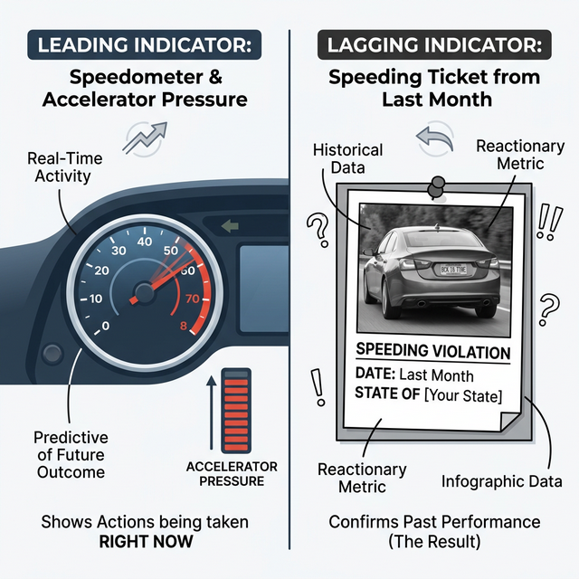
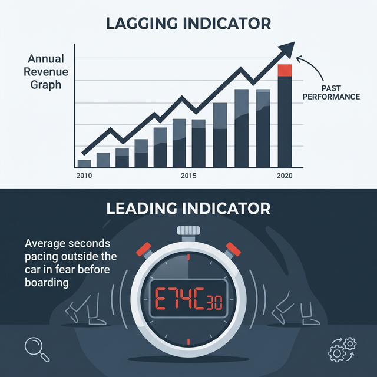

## 模块 5: 讲授三——敏捷痛点发掘与 Problem Statement (10 min)

<!-- BUDGET: 1800 chars | SLIDES: ≥4 | STATUS: done -->

> [VISUAL]
> **Slide**: w03-slide-26
> **Layout**: `Center`
> *   **Asset**: 
> **Scene**: 极度黑暗的背景上，一个闪烁着寒光的红色锋利箭头，极其暴力地刺穿了一张写满模糊抱怨字眼的废纸
> **Text**: 问题陈述 (Problem Statement)：把同理心锻造成杀戮利刃

好，经过 5-Why 的严刑拷打和极其变态的 JTBD 三维拆解，你们现在的白板和桌面上，应该已经堆满了各种充满血泪的用户故事和原始洞察。
但是，同理心如果仅仅停留在"我对用户的不幸遭遇感到十分抱歉"的这种烂好人阶段，那就没有任何商业进攻价值可言。产品经理和交互设计师根本不是心理咨询师，我们榨取这些眼泪和愤怒的唯一最终目的，是为了把泛滥的同理心变成实打实、能够指导研发写代码的**系统需求**。

为此，我们需要一个极其冷血、极具工程约束力的语言模具，把这些散漫混沌的现象，强行浇铸成一句话。这句话在硅谷的敏捷开发标准里，叫作 **Problem Statement（问题陈述）**。

**(Pause: 3s)**

> [VISUAL]
> **Slide**: w03-slide-27
> **Layout**: `Grid`
> *   **Asset**: 
> **Scene**: 像化学方程式一样严密卡扣的三个巨大拼接公式块，正在发出金属碰撞的火花
> **Text**: [极度具象的目标用户] 极其需要 [去完成某个动词任务] ，因为 [我们挖掘出了一条极其犀利的底层阻力/内心动机]

大家看屏幕，这是一个极其无情但极度好用的精益陈述公式。
千万不要像看初中填空题一样小看这个公式。绝大多数初出茅庐甚至是工作了三年的交互设计师，在面对这张纸时，甚至根本填不对这三个空。

让我们来看一个极其惨烈的死亡填空题现场：
❌ **初级设计师的灾难示范**："【经常打开我们打车软件的年轻人】非常需要【我们在首页给他做一个大号的红色叫车一键按钮】，因为【只要有了这个按钮，他们就能更快更爽地叫到车了】。"
你们闻到那种充满自嗨和无知的愚蠢味道了吗？这整句话里根本没有任何哪怕一微克的"洞察"！这个产品经理在第一空写了一堆正确的废话，第二空极其可笑地把"他自己想做的具体解决方案（大红色按钮）"提前塞进了需求里，而在最致命的第三空动机处，他只是用同义词重复了一遍第二空的废话。把它交给工程师，除了诞生一个丑陋巨大的红按钮，不会有任何化学反应。

✅ **JTBD 高手的降维示范**："【在深夜凌晨两点加班后极度疲惫、毫无防备的单身女性打工人】极其需要【一种甚至完全不需要低头看手机屏幕、不需要分辨颜色、就能绝对确认特定网约车辆到达的安全物理响应机制】，因为【在凌晨光线极度昏暗、经常有醉汉出没的 CBD 地下午夜车库里，长时间低头核对极其微小的车牌尾号会让她们感到极其恐慌，随时害怕处于身体失控被陌生人拖拽的致命危险中】。"

全场安静一下，用心去感受一下这两种文字描述方式在工程学上的云泥之别。
当一份如此极端的 Problem Statement 被打印出来、啪地一下甩在后端开发团队和 UI 视觉团队的会议桌上时。不需要任何解释，所有人脑子里的画面感瞬间就炸裂了，所有工程师的心跳都会加速。
因为他们意识到：自己接下来三个月的熬夜写出的代码，根本不是在为了什么无聊透顶的 KPI 和一个破叫车按钮；他们是在为一座黑暗地下车库里瑟瑟发抖的女孩，打造一面钢铁般的数字求生护盾！这，就是一段优秀得滴血的问题陈述，所拥有的极其可怕的跨部门号召力！

> [VISUAL]
> **Slide**: w03-slide-28
> **Layout**: Split
> *   **Asset**: 
> **Scene**: 左侧是汽车仪表盘上正在疯狂跳动的实时时速表和油门深度（先导）；右侧是用黑色相框极其讽刺地裱起来的、上个月由于超速而寄到你家的违章全景罚单照片（滞后）
> **List**: 滞后指标 (Lagging): 验证结果的法医尸检报告 | 先导指标 (Leading): 预判生死翻车的实时方向盘

> [TEACHING MOMENT]
> 极其残忍的是，仅仅写出令人热血沸腾的问题陈述是远远不够的。在残酷的敏捷商业世界里，一旦你们提出了解决方案并上线，坐在长条桌尽头的投资人和老板只会抛出一个终极死亡拷问："你怎么向我证明，由于你这次极其昂贵的洞察改版，我们公司的生命力真的变强了？" 这就强行引出了度量世界里划分生死的两条铁律。

很多大三大四在做毕业原型的同学，在最后的华丽结案汇报 PPT 里最喜欢瞎写的造假数据是："经过我们团队本次伟大的下半栏圆角交互改版，预计将强力提升公司 50% 的季度营收（Revenue）"，或者"至少降低了全平台 20% 的次月用户流失率（Churn Rate）"。
底下的专业评委听了只会在心里发出震耳欲聋的冷笑。

为什么？因为无论是整体营收，还是用户流失率，在商业数据分析引擎里，这叫**滞后指标（Lagging Indicators）**。
它们就像是你收到了那张上个月由于超速而寄到你家的电子眼罚单。当你盯着屏幕，看到流失率这条极其平滑的曲线大幅上升的那个瞬间，你的用户其实早已经在半个月前就已经在心里暗骂着、用脚投票、并且把你们的 App 彻底删除了。滞后指标，就是法医给死者开出的**尸检报告**——极其准确，但此时你就算华佗在世也根本无力回天。

真正极其恐怖的顶级交互高手，在定义解决问题的价值时，会同时死死盯住并且亲手创造出极其微小的**先导指标（Leading Indicators）**。
先导指标，相当于你汽车仪表盘上的那个精确到 0.1 秒的实时时速表和前轮的转向角度偏离值。它极其敏感地告诉你，在踩下油门的正此时此刻，你是否正在加速冲向悬崖。

> [VISUAL]
> **Slide**: w03-slide-29
> **Layout**: `Comparison`
> *   **Asset**: 
> **Scene**: 极度压抑的打车场景指标对比。上方高高在上地挂着宏大、冰冷的"年度营收曲线"（滞后无奈）；下方极其显眼地高亮显示着一个倒计时秒表"平均每次上车前在车外徘徊犹豫秒数"（先导敏捷）
> **Text**: 放弃宏大叙事，用微观行为的异动预言宏观商业的生死

我们再回到刚才那个极度震撼的"深夜打车女性害怕低头核对车牌"的洞察陈述里。
在这个项目里，如果你把成功衡量的目标大言不惭地定为"提升长期女性用户的整体软件留存率"（滞后指标），这毫无研发指导意义，开发看了只会翻白眼。
但如果你把那种强烈的恐惧感，通过算法和埋点，极其精妙地转化为一个强力的事实验证先导指标呢？
比如，我们在后台强行定义一个数据叫：**"当司机确认到达当前 GPS 坐标后，女性乘客不敢拉开车门上车，而是产生的在车外徘徊、观望、甚至向后退缩核对的平均物理秒数"**（Time to un-fear board）。

各位，见证奇迹的时刻来了：如果你们极其创新地设计出了一个根本不靠屏幕的神奇交互方案上线——比如"当司机到达时，用远光灯闪烁出仅有乘客知道的极度私密摩斯密码暗号"。并且你们在后台极其敏锐地监测到：在这个特定场景下，这批女性的"上车前极度恐惧观望时间"从以往胆战心惊的 25 秒，直接悬崖断裂般骤降到了 3 秒。
那么恭喜你，在这个极其微小、极其具体、甚至在财报上看不见的先导漏斗里，你以神明般的姿态成功地拯救了她们的恐惧。然后，不要有任何怀疑和怯懦，那个庞大的、被称为"整体女性口碑留存率"和"平台营收"的滞后商业指标，自然而然就会像多米诺骨牌一样，在下个季度的纳斯达克财报上开出最绚丽、最血腥的资本火花。

**(Pause: 3s)**

好，从那一条狭窄的认知裂缝，到冷酷的定量数据度量漏斗，大家看到了一个顶级商业洞察的绝对完整闭环。
接下来，不再有轻松靠在椅背上听故事的安逸教学了。所有人，现在起立，组建你们极其暴力的冲锋队。
