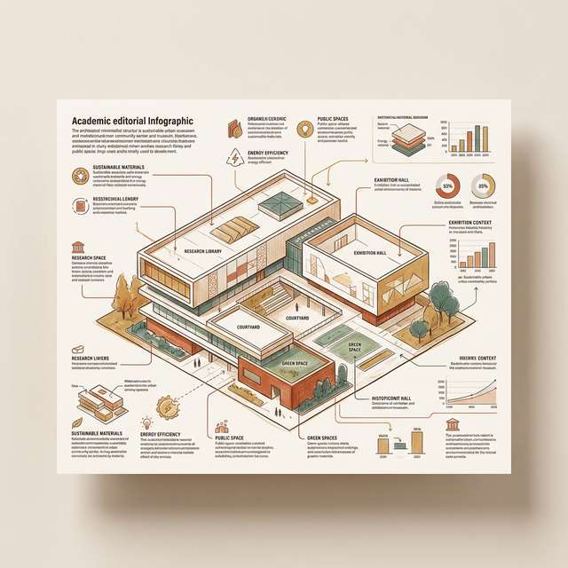
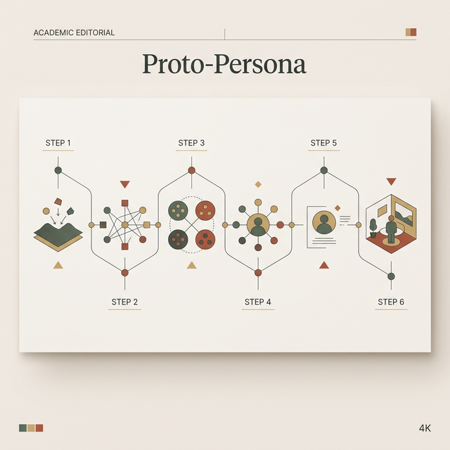
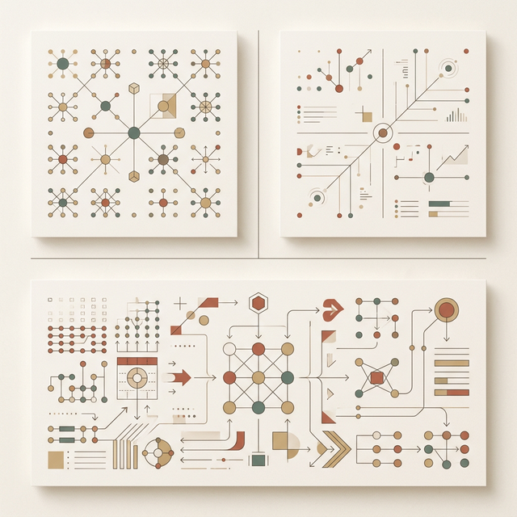
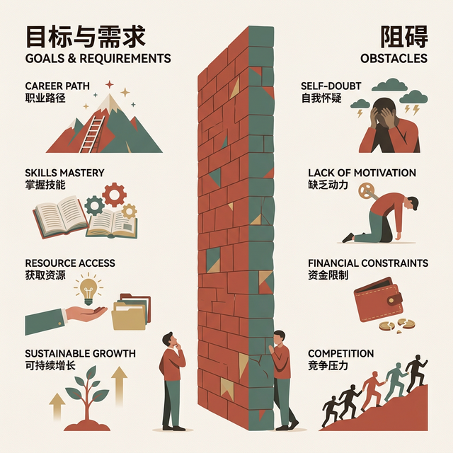

## 模块 1: 杀死重型 Persona (约 20 分钟)
<!-- BUDGET: 3600 chars | SLIDES: ≥7 | STATUS: done -->

> [VISUAL]
> **Slide**: W04-06-Persona-Death
> **Layout**: Split
> **Scene**: 左侧是一份装订精美、厚达 50 页的《年度用户画像市场调研报告》，甚至盖着金色的印章；右侧是一张画在星巴克餐巾纸上的简陋火柴人。
> *   **Asset**: 

在传统的软件开发流程中，"用户画像 (Persona)" 是一件极其神圣、昂贵且不可侵犯的物品。

它通常由专门的市场调研团队，或者花重金聘请的第三方咨询公司，耗费数月时间在全国各地开展焦点小组访谈后，装订成一本厚厚的精美报告。当你第一天入职时，这份报告会被郑重其事地交到你手上。

但这个被奉为圭臬的传统流程，存在三个致命的隐患。
第一，**太贵且太慢**。在数字时代，当你花三个月调研出一个用户模型时，市场竞争环境可能早就变了。
第二，**知识鸿沟与研发割裂**。做前端调研的人和在后台拼命写代码的人完全脱节，报告只会流于表面并且永远被扔在抽屉里落灰。
第三，**它变成了僵化神圣的“圣经准则”**。因为投入了巨资，高层倾向于将其视为绝对真理。即使系统上线后发现数据不符，也没有人敢去推翻这本僵硬的模型，只能削足适履。这是极其荒谬的行为。

> [VISUAL]
> **Slide**: W04-07-Proto-Persona-Intro
> **Layout**: `Grid`
> **Scene**: 屏幕中央出现 "Proto-Persona (原型用户画像)"，副标题标注 "先假设再验证，快速画持续改"。右侧展示一张粗糙但信息密集的手绘卡片。
> *   **Asset**: 

为了打破这种官僚主义僵局，Lean UX 提出了一种具有颠覆性的替代方案：**原型用户画像**，也就是 **Proto-Persona**。

Proto-Persona 彻底剥离了画像作为最终交付物的神圣感；相反，它直接变身为一纸被随时涂抹修改、用以全员对齐开启探索的发令枪。

它的核心精神就两句话：**先假设，再验证；快速画，持续改。** 
你们不需要昂贵的咨询公司，只需要把团队核心成员（设计师、前端开发、后端主程、产品经理）锁进会议室，对着一块白板，用你们对行业的直觉和常识，在半小时的高压冲刺内粗略捏出一个基础模型。然后再拿着这张纸片人，走出舒适区去街头开展真实的试错验证。

这种工作流不仅敏捷，它在重塑团队共识建设上更有着奇效。它的最终目的，是建立一种能够抵抗公司内耗的**统一共享理解根基 (Shared Understanding)**——当后续有任何争议时，所有人脑中都必须浮现出同一个具体而残酷的用户模型，而不是各自发散出几千种割裂的私利概念。

> [VISUAL]
> **Slide**: W04-07b-Proto-Persona-Workflow
> **Layout**: Flow
> **Scene**: 展示 Proto-Persona 的六步快速推演流程。
> **List**:
> - 疯狂脑暴
> - 上墙汇集
> - 极限瘦身
> - 行为分离
> - 模版具象化
> - 地狱拷问
> *   **Asset**: 

具体怎么操作？这是一场需要极速头脑冲洗的风暴：
1. **疯狂脑暴**：倒计时 5 分钟，独立写下各自心目中的核心受众画像标签。
2. **上墙汇集**：将所有便利贴贴上白板，展现所有潜在的人群碰撞。
3. **极限瘦身**：强行投票收敛，全员砍掉长尾角色，只保留最顶层那 3-4 个左右战局的核心画像。
4. **行为分离**：绝对不能依据传统的阶级或收入做划分，必须依据对系统诉求、数字设备掌握深浅等底层差异进行彻底切割。
5. **模版具象化**：强行落实在三栏标准模板中。
6. **地狱拷问**：各小组相互交换模型卡片，展开最苛责无情的挑刺与重修，直到模型在逻辑上完全自洽。

> [VISUAL]
> **Slide**: W04-08-Tri-Pane-Template
> **Layout**: `Flow`
> **Scene**: 展示 Proto-Persona 的经典也是极其无情不可更改的“压迫式三分区 (Tri-pane)”强制填写模板铁律要求界别区。左上方块、右上方块、下半大底区依次发光亮起并同时浮出极其加粗不可删减的高亮要求条件词干大字体。
> **List**:
> - 角色轮廓描绘与身份一词断魂代号
> - 只准填写能影响行为轨迹变局极其关键的核心行为区分大变量特征
> - 你想要什么狗屁这不重要，重要的是底层的欲求终极极大目标终极与眼前的极其现实残酷致命障碍阻挡点。
> *   **Asset**: 

如何勾勒出一个经得起推敲的 Proto-Persona 假人？
只需一张 A4 纸，折成三个区域。

**左上发端区角位：角色粗略轮廓。** 用最粗糙的笔触极简草图画出头像。这绝非单纯好玩，而是为了在冰冷的数字世界中，强制唤醒开发团队深藏的感性共情纽带。在其头像下方，用极具冲击力的大标题给它起个响亮标签，例如“重度拖延备考焦虑党 大李”，并附上一句不足十个字的核心社会身份痛境。这张毫无生气的废纸瞬间就有了灵魂。

**右上大区域：行为核心异端特征差异。** 这是大家最容易踩空掉入陷阱的死亡区域。

> [VISUAL]
> **Slide**: W04-09-Demographic-Trap
> **Layout**: Split
> **Scene**: 极尽拉踩对比。左侧是传统的“年龄、收入、婚姻状态”等人口学死板分类，标有红色❌；右侧是“单手操作偏好、暗箱隐藏能力、极限耐心阀值”等行为差异清单，标有绿色✅。
> *   **Asset**: 

这个坑，就是著名的 **Demographic Trap**（即人口统计学陷阱）。老旧的市场投流法喜欢用极度空泛的“一线城市、25-30岁、月入一万的中产单身女性”来粗划大面。但在交互底层战区，打磨毫秒操作与深层心理极速转换的极致心流体验中，这种极大的分类法是一坨无用的废铁。

在业界，有一个极其经典反证。假如按照这些冷冰冰的僵化指标：1948 年同年同月出生于英国、皆为男性、结过婚具有相似家庭架构、银行资产丰厚富可流油、并在英国拥有常居地的用户。如果不看人，你会以为这是百分百高度同质重合的高配模板人群对不对？

可是剥开看真人，他们中间的一位，是位居权力顶端主抓严肃庄重国事、举止高贵的英国王储查尔斯国王；而另一位同等匹配标签的人，则是离经叛道、满身纹身、甚至曾在演唱会徒口撕烂咬掉活蝙蝠、歇斯底里的黑暗重金属摇滚传奇主唱 Ozzy Osbourne！

如果让你为这组人开发一款全数字交互系统，你敢相信那冷冰冰的人口报表认为他们是“同属性用户”的结论吗？绝对不可能！
因此，在右上区，我们只关心能够**预测软件真实使用行为差异点**的特征。这才是指导我们界面架构的唯一硬指标。

> [PHILOSOPHY]
> **认知心理学：System 1 (直觉思维) 与 System 2 (理性思维)**
> 丹尼尔·卡尼曼 (Daniel Kahneman) 在其名著《思考，快与慢》中提出，人类拥有两套认知系统。人口统计学的抽象切片（三十岁，有房贷等），主要刻画的是受制裁的理性世界（System 2）。但在我们面对软件时的真实互动行为（比如没耐心看繁琐的提示框、本能地去点击闪烁的红色按钮），很大程度上被深嵌在直觉与固有习惯中的 System 1 所支配。行为特征区的挖掘，正是为了去描摹这只在冰山之下、主宰着绝大多数用户行动的无形巨鲨。

> [VISUAL]
> **Slide**: W04-10-Bottom-Half
> **Layout**: Split
> **Scene**: 分析下半区。左栏是“Goal / Needs (目标与需求)”，右栏是“Obstacles (阻碍)”。一堵高墙横亘在左右两栏中间。
> *   **Asset**: 

最后是**下半区：目标、需求与障碍**。

首先要区分目标与需求。**目标（Goals）**是用户最终想要到达的彼岸，往往带有强烈的情感色彩（比如：让老板觉得我很有统筹能力）。而**需求（Needs）**是他们在到达彼岸途中所缺少的手段（比如：我需要一个一键导出多维度报表的功能）。用户经常会向你索要某个“需求”，但如果你不知道他的“终极目标”，你只会变成一个无情的接盘侠。

而在目标的对立面，就是**障碍（Obstacles）**。什么生理属性、物理环境、或者系统缺陷在阻碍他？（比如：他上下班都在挤公交，系统字号太小导致颠簸时根本看不清；或者他的部门架构需要三层审批，系统却没有跨部门穿透的功能）。障碍，就是你软件设计的发力点。

> [VISUAL]
> **Slide**: W04-11-Three-Validations
> **Layout**: `Flow`
> **Scene**: 绘制一个时间轴，标出在写下一行代码之前必须跨越的三个验证关卡（存在？痛点？买单？）。
> **List**:
> - 第一关：存在性检验
> - 第二关：真实痛点检验
> - 第三关：付费行为检验
> *   **Asset**: 

在画完三分区模板后，我需要特别给大家打一剂清醒针。Jeff Gothelf 在教材中反复锤打的一条核心警告是：**我们不是用户，也就是 We Are Not Our Users**。作为交互设计专业的学生，你们处于一个极其危险的"专家诅咒"位置——你们个人对软件的容忍阈值、用智能手机的认知熟练度、以及对界面设计形态的需求弹性，远远超出了普罗大众的常规水位线。当你知道三手指滑动可以触发 iPad 的多任务管理器时，你已经是世界上非常非常少见的极端用户了。你的妈妈——我想大部分同学的妈妈都是如此——遇到这个手势时的第一反应是惊恼地抬头问你"孩子，我的屏幕怎么又乱了"。你凭与自己的共情去捏造臆到的假画像，总是会远比你以为的更乐观。而 Proto-Persona 的诞生，就是为了强迫你跳出"我用着挺好的呀"这个自我平行宇宙，去立旗注视那个真实的、疏离的、混乱的异维度用户。

记住，Proto-Persona 是一份**活文档（Living Document）**。当你把这张 A4 纸画完，它仅仅是你们团队“一厢情愿的幻觉”。在进入更深层的敏捷迭代之前，你手里的这个假人物，必须立刻去闯三关开展早期验证：

**第一关：这类用户真的存在于地球上吗？**
你们走到街上或是拉响人脉网，尝试按特征招募 5 个人。如果你发现哪怕找遍全校都凑不齐你画的这种具有特定行为模式（而不是人口统计）的人，说明什么？说明你的假设纯属虚构，**立即撕毁重新画脸，这是命令。**

**第二关：他们真的遭遇了你猜测的巨大痛点吗？**
假设你找到了这批人，通过上周学的 JTBD 访谈和观察，你绝望地发现，由于种种原因，他们对你臆想中的那个“巨大痛点”根本无感，他们有别的情景和烦恼。此时，你要果断抛弃你最初的方向，将白纸下半区全数抹掉。这是你避免浪费几个月生命的最昂贵但最值得的教训。

**第三关：在拥有致命痛点的前提下，他们会有任何购买且长期使用的行动吗？**

> [VISUAL]
> **Slide**: W04-10b-Behavioral-Check
> **Layout**: Flow
> **Scene**: 展示三关验证的漏斗图，顶部是“人口存在 (Exist)”，中间是“痛点吻合 (Pain)”，底部最窄且标红的出口是“真实行为支付 (Action)”。
> *   **Asset**: 

这一关是杀伤力最强的最终经济性检测。你不能只问"你觉得这个产品怎么样"这种空洞的观点式探询，因为人类在观点层面总是极度慰貍的。你要观察的是行为级别的信号：他有没有愿意留下真实的邮箱进入等待名单？有没有在你的简陋纸质原型上尝试去点击一个根本不存在的"立即购买"按钮？只有这种带有真实成本的行动突破，才能被视为“这个电子假人正在变得有血有肉”的硬性证据。

> [CASE STUDY]
> **天使投资人的“伪刚需”血案**
> 这绝对不是我们在课堂里的虚张声势。硅谷曾有一支闪亮的精益创业团队，计划为资深的天使投资人，定制一款硬核的商业计划书 (BP) 评估追踪平台。
>
> **前两关如履平地：** 
> 第一，全美确实有海量的活跃天使投资人。
> 第二，实地田野调查确认，他们每天看海量 BP 确实很痛苦，迫切想要摆脱低效的泥潭。
> 团队全体沸腾。以为拿到了一把通往千万级市场的刚需钥匙。
>
> **第三关折戟沉沙：**
> 就在摩拳擦掌准备搭建架构前，团队做了最后一次实战探测。
> 交互主考官面对那群苦主，抛出了终极拷问：“既然我们的系统能完美解决痛点，各位是否愿意为此支付订阅费？或者，每天哪怕多花二十分钟，去专门学习并操作这套精密系统？”
>
> 瞬间，原本满地诉苦的面孔开始闪烁其词。
> 残酷的真相浮出水面：这群人 95% 只是每年跟风投几笔钱。他们把拓展人脉当主业。痛点确实存在，但让他们跨越极高的学习门槛还要掏钱？这是个伪命题。
> 只有不到 5% 的全职专职投资人愿意买单。但这微不足道的受众存量，根本撑不起系统开发的高昂开支。
> 在真实掏钱的行动线上，这个 Proto-Persona 被当场证伪，胎死腹中。

> [TEACHING MOMENT]
> **警惕“廉价的赞同”**
> 同学们，在下周的实地验证中，你们最容易犯的错，就是把用户“口头上的感兴趣”误当作“掏钱行动的承诺”。
> 记住，**赞扬是免费的，但行为是有成本的**。当用户说“这主意听起来不错”时，那往往只是他们出于礼貌的社交防御。只有当他们愿意为你简陋的纸质原型留下真实的邮箱，或者甚至当场试图点击你那个假的购买按钮时，你白纸上的那个假人像，才真正获得了呼吸和生命。

> [TEACHING MOMENT]
> **不要让假定变成教条**
> 大家在做上述这致命三关的时候，切记心理学上的确证偏误 (Confirmation Bias)。当你亲手画出一个可爱的 Proto-Persona 时，你就像看着自己的孩子，潜意识里会极其排斥那些推翻你预设的不利证据。
> 很多实习生在做验证访谈时，一旦受访者表示“我其实不太需要这个功能”，他们就会焦急地去引导：“但是你看，加上这个是不是能帮你省两分钟？是不是挺好的？”如果你在访谈中不自觉地开始推销你的理念，而不是像一个冷血的法医一样去记录尸检报告，那么你从一开始就失败了。Proto-Persona 是为了被推翻而生的，每一条被无情推翻的假设，都是在为你们未来的开发资金护盘。

> [CASE STUDY]
> **失败的“全能差旅助手”与 Persona 崩溃**
> 曾有一个团队意图开发一款“全能差旅助手”，他们的初版 Proto-Persona 是“高频出差、对行程细节极度掌控的商务强人”。
> 但当他们拿着简陋的概念去机场拦截这种真实用户时，第二关直接把他们打入冰窟：这群人确实高频出差，但他们对行程细节**根本不想掌控**。他们极其暴躁、疲惫，只希望有一个“什么都不要问我，直接把最快的车和最近的床安排好”的傻瓜黑盒。一旦系统给出四个选项让他们挑选航司常旅客权益对冲，他们会直接关闭 App。
> 这个团队被迫在机场大厅当场撕毁了原来的白板纸，重新画出了一个“极度疲惫、极简决策、厌恶选择”的全新受众画像。如果不经历这种现场被打脸的剧痛，他们会在后端的航司权益比价算法上烧掉整整半年的开发预算。
