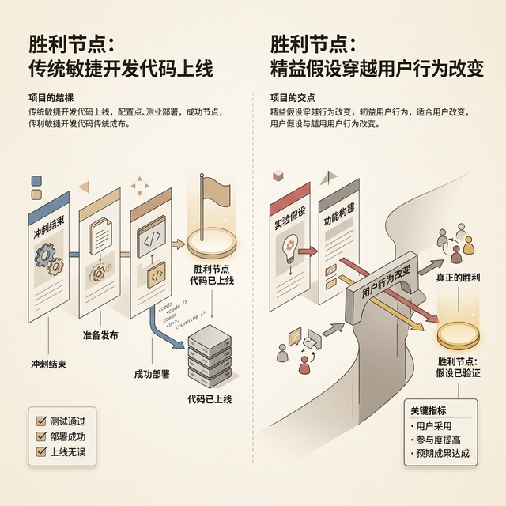

## 模块 2: 从假设到子弹——假设驱动设计 (约 20 分钟)
<!-- BUDGET: 3600 chars | SLIDES: ≥7 | STATUS: done -->

> [VISUAL]
> **Slide**: W04-13-Hypothesis-Bridge
> **Layout**: `Flow`
> **Scene**: 左侧是敏捷开发的齿轮（打磨代码），右侧是商业价值的皇冠（解决问题）。连接两者的是“假设声明 (Hypothesis Statement)”。
> *   **Asset**: 

带着从田野调查中锤炼出来的真实用户画像（Box 3）和痛点陈述（Box 1），我们终于进入了整个 Lean UX 流程的最中枢神经——Box 6：**假设 (Hypotheses)**。

在传统的软件工程学里，我们很少提到“假设”这个充满了学术科学色彩的词汇。在传统语境中，产品经理想出了一个主意，然后把它变成某种神圣不可侵犯的命令指派给你们。但是在精益设计中，我们要彻底推翻这种单向度的指挥链。

假设，就是你瞄准商业目标打出的一颗子弹。在传统软件公司里，产品经理给开发兄弟下发的通常是 PRD（产品需求文档）或敏捷用户故事。但这正是制造“大量无效功能垃圾场”的最核心元凶。我们要先认清传统敏捷开发在交互设计领域里经常踩入的一个巨大火坑。

> [VISUAL]
> **Slide**: W04-14-Agile-Trap
> **Layout**: `Comparison`
> **Scene**: 左侧展示“传统敏捷用户故事”，以代码上线、燃尽图清空作为胜利节点（Velocity driven）；右侧展示“精益假设验证”，必须穿越用户屏障直到实现切实的商业数据/行为改变才算胜利（Outcome driven）。
> *   **Asset**: 

让我们来深度剖析一个极其经典、看起来毫无破绽、且含有剧毒的**敏捷用户故事 (Agile User Story)** 模板：
“*作为一名 **系统用户**，我想拥有一个 **一键找回密码** 功能，以便于 **我忘了密码时能重新登录**。*”

这个模板在全世界的内部管理系统里、在数以万计的 Jira 看板里，被每天书写上百万次。它的缺陷到底在哪？在于它在不经意间极其阴险地篡改了你们团队的**“成功定义 (Definition of Success)”**。

大家想象这样一个场景：当开发团队接到这个“用户故事”，加班加点写完代码、跑通了所有的自动化单元测试，确保服务器遇到请求后能顺利连通邮件网关发出正确的 6 位数字验证码，并且加密匹配无误。这个时候，团队会怎么做？所有工程师会在站会上击掌相庆，Scrum Master 会把看板面上的卡片拖入 "Done" 的极乐世界里，团队开香槟庆祝：“我们的双周迭代冲刺 (Sprint) 完美燃尽了！我们的团队开发速度 (Velocity) 简直全公司第一！”

但是在 Lean UX 流派里，这种闭门造车的狂欢被称为 **Output Trap**（即“输出谬误”）。为什么说是谬误？因为在残酷的真实世界中，验证码邮件很有可能被企业防火墙误伤拦截，或者用户在手机端打开那个排版错位的找回页面时，极具反弹性格的他们在经历长达 4 步的安全问题校验时，会在第二步直接破口大骂并放弃使用你们的大系统。

发觉了吗？**你们的微小系统模块按工程设计极其完美地运行了，但你们所服务的那个客户的业务，却彻底失败并流失了。** 交付一项功能（Output），只能被视为拿到了与用户同桌较量的筹码，它是你和用户产生对话的第一场哨音，绝不能当做比赛结束的终场哨！

密码找回功能存在的唯一理由是帮助那些焦急的用户重连你们的业务网，并发生后续的产生利润或价值的动作。如果你没达到重连目标，你之前写的那些算法再精妙、代码再整洁、架构再优美，对公司而言都只是一种纯粹的成本造粪浪费。

> [VISUAL]
> **Slide**: W04-15-Hypothesis-Template
> **Layout**: `Split`
> **Scene**: 屏幕上浮现假设声明的标准四段式结构，每一行高亮关键占位符。
> **List**:
> - We believe we will achieve [this business outcome]
> - If [these personas]
> - Attain [this benefit/user outcome]
> - With [this feature or solution]
> *   **Asset**: 

所以，真正的交互工程架构师，绝不写毫无疑义必定能“完成”的僵硬指派单。我们只写随时能把大家脸打肿的、可被快速证伪评估的**假设声明 (Hypothesis Statement)**。这是精益圈最硬核的四段式防爆盾：

1. **我们相信 (We Believe)...** 将实现 **[某个具体可测的商业数据结果]**
2. **如果 (If)... [某个经过真实验证的 Proto-Persona 受众群体]**
3. **获得了 (Attain)... [这种切实的行为干预后果 或 消除了极限摩擦痛点]**
4. **通过 (With)... [团队所构想提供的某项具体功能点或交互解决方案]**

注意结构里的第一句话，千万不要写“我们决定 (We decide)”或“这必将带来 (It will lead to)”。这是对人类狂妄傲慢的一记耳光：你脑子里所有自以为精妙绝伦的功能，无论是 AI 算法还是炫酷的动画视差，本质上都只是一种**主观的下注猜测**。当你签下“我们相信”四个大字时，你就签下了一份军令状，承认自己可能全盘皆输的概率。

> [VISUAL]
> **Slide**: W04-16-Dissecting-Hypothesis
> **Layout**: `Flow`
> **Scene**: 将四段式模板的每一个括号部件，通过发光的神经束线精确连结到 Lean UX Canvas 之前完成的对应 Box 核心区 (Box 2, 3, 4, 5)。
> *   **Asset**: 

这个令人填空的四段填字游戏，绝对不是在会议室里凭空捏造玄学的。它实际上是对你前两周极其繁重的市场洞察与画布推演工作的一次“终极收网与组装连连看”：

- **[商业结果] (Box 2)**：必须是可以用统计学分析度量的数据节点。例如，“客户客服呼叫中心关于登录失败被锁的求援进线率，能够在一个季度内降低 50%”。不要写那些虚头巴脑的类似“大幅提高用户满意度”或者“创造世界上最直观流畅的 UI 交互体验”。交互界有一句名言：没有任何一行代码，能够编译“直观”这个词。没有指标锚，团队如何宣告战役胜利？
- **[目标群体] (Box 3)**：这里严禁使用“所有普通地球人”或“系统用户”这种无效词。你必须极其聚焦前置抽离出来的那个画像，是“极度欠缺数字设备操作耐心的下沉市场中老年女性”，或者“时间极度碎片化、每次登录仅停留 2 分钟的新媒体操盘手”。只有卡死对象，你的功能瞄准镜才不会出现焦段失准。
- **[用户利益] (Box 4)**：这是用户最终达成的个人心理感受突破体验。也就是你消除的那种极其要命的情境摩擦到底叫什么。
- **[解决方案] (Box 5)**：才是那个微波炉般确定的功能小点，也就是整个环节里最不重要的一环，比如“接入基于 iOS FaceID 面部的无密码生物通行密钥”。

> [TEACHING MOMENT]
> 有些自作聪明的团队会在一条假设里塞入多个实验变量。例如：“如果在主页放一个红包悬浮窗（功能A），并且同时在侧边栏加一条全员氪金排行榜（功能B），系统日活就能神奇地飙升 30%”。
> 诸位工程师请切记严谨实验科学的死律——如果你同时部署了 A 和 B 这两个重型武器上线，下个月你的数据奇迹般地涨了 25%，你在庆功宴上拿什么数据切片去跟大老板汇报分拆战果？是红包 A 带飞了全盘，还是其实排行榜 B 不仅仅没用，反而抵消了红包 A 带来的另外原本更为隐性的潜藏红利？这种一笼统全部乱上的事，由于互相干扰在统计科学上被称为 **Confounding Variable Trap**（混杂变量灾难）。我们要信奉狙击手的死规矩：一枪，只瞄准一个单一的标靶，且标靶上只能刻上唯一精确的刻度尺。

如果大家听着这些抽象词汇还是觉得如同黑箱迷雾，让我们一起来迅速拉近距焦镜头，看一个接地气的实战演练转化案例。

> [VISUAL]
> **Slide**: W04-16b-Classroom-Example
> **Layout**: Split
> **Scene**: 左侧显示杂乱焦虑的课间抢座场景和满屏幕抱怨的乱码对话框，右侧则像代码审查一样清晰地罗列出被收敛重构后的图书馆预约系统具体强力假设结构。
> *   **Asset**: 

就拿上一周实地调研中此前大家反馈最糟心、且在白板上便利贴贴得最满的“大学图书馆那套仿古世纪体验的复杂预约系统”为例。
我们在之前的痛点推演里假定，最核心的根骨痛点是: "为了能够每天在图书馆抢到那个靠北临窗且带插座的心仪自习位，用户每天早上不得不经历极其漫长、繁琐且考验手速的心跳 7 步下拉表单点击大战。如果在过程中手滑点错导致占座失败被系统锁死，将使得用户一整天陷入极大的备考情绪焦虑感"。

当我们要去动工修改这一段屎山代码时，我们决不能粗暴地下达“把系统界面重绘为美观版”。我们要怎样套入这套四段式杀器？请看：

**(1)* *我们相信* 将实现 **[在早晨 7 点服务器放号最高峰期间，将单核节点的服务器拥堵延时率阻断减少高达 40%]** —— (非常具体的商业与硬件结果)
**(2)* *如果* 能让 **[那个具有重度依赖图书馆且每天有定点自习刚需的大三高压备考机器党 (强力 Proto-Persona)]** —— (排除了那些一周只去借一本书的过客散户)
**(3)* *实现* **[减少机械的重复列表级联筛选并彻底剿灭每一步等待信息载入产生的深层断网焦虑感与无效的时间空耗]** —— (明确的人性深处心理利益感)
**(4)* *通过* 提供 **[将一个不涉及复杂底层重构的“一键顺延昨日旧座”大红按钮功能区，直接强行投放在其客户端登录后的首页第一视觉首屏内]** —— (最终那个廉价但在尖端的解决方案)。

> [CASE STUDY]
> **Spotify 的「Release Radar」假设验证**
> 让我们再看一个硅谷的巨头实战案例。曾经的全球音乐霸主 Spotify 发现，老用户在经过两年的听歌后，经常抱怨“找不到新歌听，平台推荐的永远都是那几首老歌”，导致订阅退订率在一个特定的时间节点开始上升。
> 团队并没有直接立项去花重金重构整个底层音乐大模型，也没有直接大刀阔斧去修改全站的 UI 主题。他们组内写下了一条冷酷的假设：
> *我们相信* 将实现 **[服役期超过两年的老用户月流失率下降 15%，且其周级活跃收听时长增加 20%]**
> *如果* 能让 **[那些歌单口味已经极度固化且缺乏主动找歌耐心的高频付费熟客 (Proto-Persona)]**
> *实现* **[无须任何搜索步骤，只需固定每周点开一个即时更新的专属阵地，就能获得新鲜极具针对性的探索感满足]**
> *通过* 提供 **[每周五自动生成一张结合其过往口味且囊括最新发行的「Release Radar（新歌雷达）」个性化播放列表]**
> 这条假设精确到可以用周级数据来直接验证。他们没有去开发几十种华丽的探索交互，仅仅是做了一张列表。首周测试，点击「Release Radar」的老用户粘性直接飙升，这颗子弹正中靶心，也成为了日后流媒体分发霸权上最强硬的一颗钻石。

有了上述这样一条滴水不漏而且充满冷酷机器美感推演的强力假设，你手中的那颗可怜的微距功能子弹，就立刻在迷雾战场上具备了最初级也是最硬核的基础物理制导跟踪精度。但这依然不是全盘的终结。

大家在各自小组的激情推演做完这套流程后，你们组的战术大桌面上可能产出的并不是孤零零的一条严丝合缝的声明，而是一堆极度吸睛的创意声明。当几十把枪口同时要瞄准时，这就引出了我们团队管控资源的下一个核心铁血组件。

> [VISUAL]
> **Slide**: W04-17-Table-Exercise
> **Layout**: Flow
> **Scene**: 展示教材中经常提倡的团队作战便利贴组装实体表格。将 Box 2 到 Box 5 的不同维度独立色彩图块从白板四周汇聚挪入并粘合在一个统一强大的长条网格视图中。
> *   **Asset**: 

只要当有了小组的整体方向共识以后，我们可以采用极其原始但最为有用的物理视觉统御法——经典的**便利贴矩阵行云流水填表法 (Post-it hypothesis matrix table)**。你们要在会议室的实体墙面上硬挂起一张巨大无比的横向六列结构白板纸，按照对应的“如果我们相信...”的框线，把你们之前零碎打点推演出的痛点、画像、功能点子，通过物理性连结连带地捏合粘接成一大整个巨大的横向战车长句行。
为什么纸质便利贴如此重要？因为在这个推演过程中，团队发现某条假设站不住脚时，直接一把撕下那张带胶的纸片揉碎扔进垃圾桶，其阻力极低，而如果你在一个拥有 20 个画板的 Figma 高保真原型文件里要求设计师删掉整个架构，他会和你拼命。这就是媒介即讯息的底层逻辑。当你们组经过两小时折磨，凑齐 7 到 10 行业已完成了严密结构审查的初版庞大设定清单时，先别急着碰代码，你们即将踏入下一场更加暴力的筛除炼狱场。

> [TEACHING MOMENT]
> **解剖“解决方案 (Solution)”的颗粒度**
> 在第四段 `通过...` 中，我们需要指出解决方案。但请注意颗粒度！不要写得像“通过 AI 技术”或“通过一个更好的界面”那样抽象。同时，也不要写得像代码字典一样详尽（“通过一个带有蓝色 5px 阴影的自适应按钮框”）。
> 合格的解决方案颗粒度，应该是一个**清晰的交互动因组件**。例如：“通过一个在结账流程前强制弹出的优惠券一键匹配侧边栏”。这明确了何时发生（结账前）、什么形态（侧边栏）、核心机制（一键匹配）。这才是能拿去当子弹发射的标准规格。

> [CASE STUDY]
> **Amazon Prime 的假设豪赌**
> 当年 Amazon 推出 Prime 会员制度前，内部充满了极大的争议。很多财务主管认为，免受运费会吃掉所有本就不高的零售利润。
> 但贝索斯的团队并没有去写一份几十页的业务企划案，而是拆解成了极度锐利的连环假设：
> *我们相信* 将实现 **[单客年度消费总额 (ARPU) 的显著阶跃级飞升]**
> *如果* 能让 **[那些对邮费极度敏感、且常常为了凑单而在购物车页面徘徊最终放弃支付的持家型网购高频主力军]**
> *实现* **[彻底切除了‘运费惩罚’的心理顾虑，将每一笔小额购买变得毫无心理负担]**
> *通过* 提供 **[缴纳一次性年费后，全网不限次数的两日达免邮特权服务标志]**
> 他们深知，如果验证失败，这可能是一个毁灭级的亏损漏洞。但正是这种极度清晰的、可以被严密数学模型和 A/B 切片数据所监控的假设结构，让他们敢于划定一个极小的高风险测试区去尝试大胆投放。最终，Prime 成为了零售史上的核武器。
