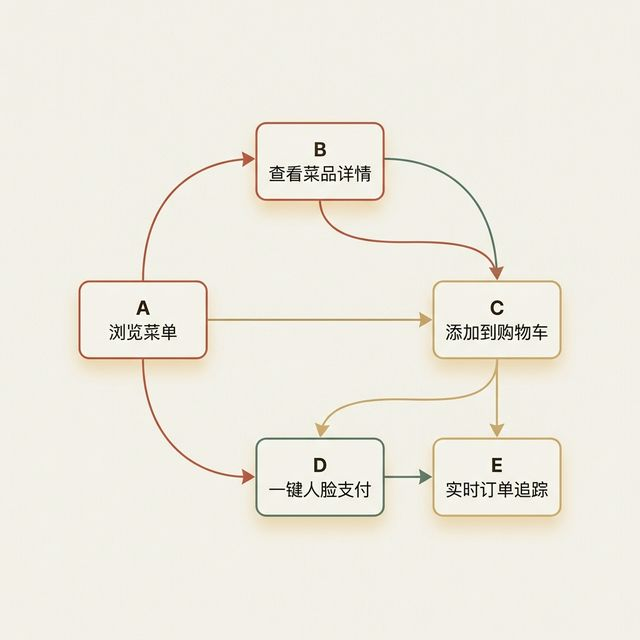
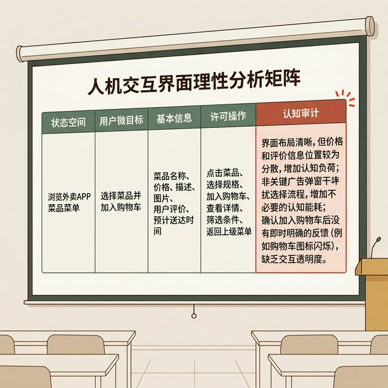
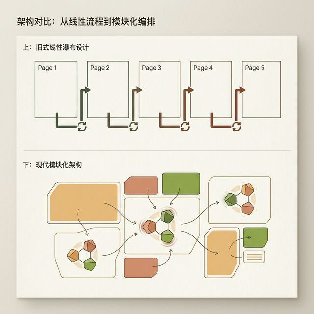

## 模块 4: 从心流到页面流——状态机拆解 (约 10 分钟)
<!-- BUDGET: 1800 chars | SLIDES: ≥4 | STATUS: done -->

> [VISUAL]
> **Slide**: M4-01-App-State-Machine
> **Layout**: `Flow`
> **Scene**: 一个极具工程感的高清状态机抽象图。展示一个外卖点餐 App 的底层核心状态流：浏览菜品 (State A) → 唤出单品详情半屏卡片 (State B) → 底部直接加入购物车 (State C) → 面容一键支付 (State D) → 订单实时履约跟踪 (State E)。每个状态不是一个“页面”，而是一个具有特定发光边界的“编排单元”，箭头代表无缝的流转。
> **Search**: `state machine diagram food delivery app user flow`
> **知识节点**: `about-face-ch11-flow`
> *   **Asset**: 

好，在此之前的三个模块，我们深入探讨了心智模型、交互透明性、编排策略以及最致命的附加税，这些都是顶层的心法和理论。现在，我们要从哲学天空降落，让双手沾满泥土。

在接下来的 实验2(Exp2) 中，你们的核心战役只有一个——**基于上周验证的 MVP 功能点，搭建出原生应用的无缝交互骨架**。到底怎么搭？从哪里画下第一笔？答案是我们在计算机科学领域极其熟悉，但在交互设计界却经常被误用的概念——**状态机拆解 (State Machine Orchestration)**。

大家请看大屏幕这幅外卖应用的状态流。如果按照传统古典的做法，设计师会把这里的每一个框理解为“一个独立的 UI 页面”，画完列表页，再去画一个庞大的详情页，然后再画一个繁琐的支付确认页。

但我们今天引入了一个全新的架构视角：这些框不再是静态的页面画布，它们是一个个动态的、充满生命力的**系统状态 (System States)**。每个状态，只代表用户在当下这一特定时刻能获取的权限、能看到的特权信息和能采取的唯一行动。箭头，则代表了触发这些状态变迁的**动作事件**。

**在交互编排的语境下，状态机有了一个极其冷酷的新定义：每一个状态，就是一个独占工作记忆的“极简编排单元”。在这个单元里，你必须且只能展示用户“当前秒级任务”所必需的工具，并把所有其他无关的噪音代码级隐藏。** 用状态机的方式去思考设计，你才会知道一个弹窗应该什么时候飞出来，什么时候又应该像鬼魅一样消失在后台。这就是上一章"少即是多"（Less is More）策略最硬核的工程变现。

---

> [VISUAL]
> **Slide**: M4-02-State-Analysis-Matrix
> **Layout**: Split
> **Scene**: 大屏幕上投射出一个极度理性的分析矩阵表格，列头为：状态空间 (State Space) / 用户微目标 (Micro-Goal) / 绝对必要信息 (Essential Info) / 允许操作集 (Allowed Actions) / 逃逸/阻断附加税检查 (Excise Audit)。表中以“列表页浏览菜品”为例，详细拆解了每一列的要求，其中最后一步的“附加税检查”红灯高亮闪烁，发出警报。
> **知识节点**: `about-face-excise-types`
> *   **Asset**: 

这是你们做高保真原型之前，必须填写的**交互状态拆解矩阵**。对于应用生命周期里的每一个微小状态，你们都必须像面对法官一样，冷静地回答这四个极其苛刻的架构问题：

1. **用户停留在这个状态的“微目标”究竟是什么？** （比如：不是“看界面”，而是“在最短时间内对比哪家店的沙拉热量最低”，或者“以最小的视线物理偏移量极其果断地确认这单外卖的实际支付金额”）
2. **为了达成这个微目标，他“绝对”需要什么信息？** （菜名、微缩图、热量卡路里标签、售价。至于具体的调料成分说明？统统不配出现在当前层级，折叠起来。）
3. **他在这一秒，迫切需要对系统做出的指控行动（操作）是什么？** （快速滚动、条件交叉筛选、直接点击“+”号盲加进购物车。）
4. **最后，也是最惨烈的拷问：这个状态转移过程中，隐藏了什么恶心的附加税？** （比如：如果为了看这张清晰的沙拉放大图，系统必须强制进行一次跨页面的大刷新，或者必须新开一个浏览器标签页，这就是最恶劣的导航附加税。我们能不能通过 JS 原地动态放大图层来彻底消除它？这绝不仅是为了单纯的前端炫技，更是为了拼死维持用户心流在这个极其逼仄的时间盒子里的绝对连贯性。）

当你们带着这种近乎变态的洁癖，逐一回答完矩阵里的四个问题，你们就不再是一个排版画图的美工，而是在做真正的**交互架构编排**。这种极其冷血且严密的逻辑思维，将彻底决定这套系统在真实世界极其复杂的网络断点与并发高压深渊下的绝对生死存亡。

> [VISUAL]
> **Slide**: M4-02b-Empty-State-Matrix
> **Layout**: `Full`
> **Scene**: 聚焦矩阵表格中一个经常被遗忘的边缘死角单元格——“空状态 (Empty State)”。展示当购物车为空时，系统如何从“傲慢地显示 0 个商品”转变为“富有同理心地提供去逛逛或者一键加购常买清单的魔法按钮”。
> **Caption**: 真正的大师手笔，往往隐藏在无人问津的“空状态”地雷区。
> *   **Asset**: 

大屏幕上聚焦的这个被标红的单元格，就是整张矩阵里最容易被懒惰的初级开发人员直接跳过的致命盲区——空状态。想象一下：你的用户满怀期待地第一次打开你精心开发的购物 App 的收藏夹页面，结果看到的是什么？如果你的团队只顾着把"有商品时"的华丽卡片列表做得天花乱坠，却对"收藏夹为空"的边界状态视而不见，用户看到的就只是一片冰冷的白屏和一行气人但毫无帮助的灰色小字："暂无收藏"。但如果你用状态矩阵的思维去逼迫自己直面这个尴尬时刻，你就会设计出一个充满同理心的空状态：一个可爱的购物袋插画、一句"来逛逛吧"的温暖邀请、甚至直接推一组基于浏览历史的"猜你喜欢"智能推荐。这不是锦上添花，这是从"让用户对着白屏发呆"到"用空状态也能创造商业转化"的认知范式跃迁。

---

> [VISUAL]
> **Slide**: M4-03-Before-After-Optimization
> **Layout**: `Flow`
> **Scene**: 两张极具冲击力的架构蓝图对比。上方是“古典未优化版”：代表老旧的线性瀑布流，用户每操作一步都必须完全刷新进入下一个页面，代表认知断层的长箭头多如牛毛。下方是“现代模块化优化版”：大量采用了全局浮动层 (Float Panels)、模态底部面板 (Bottom Sheets)、原位手风琴展开 (Accordions)。整个屏幕只有少数几次必须的跳转，绝大部分交互在当前主状态机内平滑消化，代表干扰流断裂的箭头极其稀少。
> **Search**: `user flow optimization reduce page transitions wireframe`
> **知识节点**: `about-face-orchestration-strategies`
> *   **Asset**: 

大屏幕上这组对比，是无数初创企业在生死边缘摸爬滚打后总结出来的血泪教训。

上面这个庞大臃肿的版本，就是“页面驱动思维”的产物。用户就像走迷宫里的老鼠，每吃一口奶酪，都要被迫穿过一扇厚重的大门，心流在这个过程中被彻底撞碎。

而在下面的优化版本里，主系统承载了 80% 的状态。当用户需要额外确认或者轻量查询时，我们采用底部弹栈面板、侧边滑出抽屉、或者手风琴折叠卡片。这让用户的视觉底色和空间定位感（Context）始终停留在原本的主干道上。信息顺从着用户的眼神召唤在指尖原位浮现，用完即焚、即刻消散。在这个模型下，导航附加税被系统性地降低了 60% 以上。

**先生们女士们，这就是状态机拆解的终极目的：我们的敌人不是复杂的业务需求，我们的敌人是跳出的页面跳转。我们要做的，就是用冰冷严密的矩阵，去数清楚我们的代码迫使用户承受了多少次“心流崩塌”，然后像屠夫一样，把这个数字砍到无限接近于零。**

> [LIFE CONNECT: 微信 vs 银行 App 的附加税天壤之别]

你们肯定每天都在体验这种两种截然不同的编排哲学。

打开你们的微信发一条短消息——你从聊天列表点进特定联系人，调出键盘打字，发送，然后把手机塞回口袋里。整个体验行云流水，几乎零附加税。你想过没有，为什么？因为微信在底层把这条路径的时空成本压缩到了人类肉体的绝对极限。它不需要你走一条“点击右上角新建消息 → 滚动通讯录选择联系人 → 选择发送文本类型 → 在弹出的文本框编辑 → 点击确认发送”这样教条的工程师流程。

与之形成鲜明对比的，是某些传统银行的 App。你哪怕只是想给室友转 50 块钱水电费，你得先过面容解锁，被强制看 3 秒高收益理财开屏广告，再跳过四个充斥着“转账到本人”、“转账到他人”的层级页面，最后在每一个环节系统都要像防贼一样问你一遍"系统提示：您是否确认这笔高风险操作？"。

功能是一模一样的“转账”，但由于背后的状态机编排能力有着天壤之别，导致附加税差了整整十倍。这就是普通程序员和顶尖交互架构师的身价差距所在。

今天这堂课结束以后，我希望你们能养成一个强迫症：今晚回去打开手机，随便找三个你最常用的 App，用"这属于哪种维度的附加税"这种极其苛刻的架构师眼光去重新审视它们。你会发现一个颠覆认知的真相——**那些你以前只是模糊地觉得"难用"或者“卡壳”的产品，问题往往根本不在视觉画得丑，也不在功能干瘪，而在于它们底层那糟糕透顶、布满荆棘的状态流转路径。**

---
