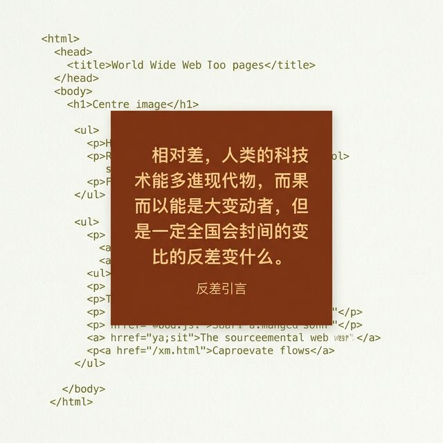
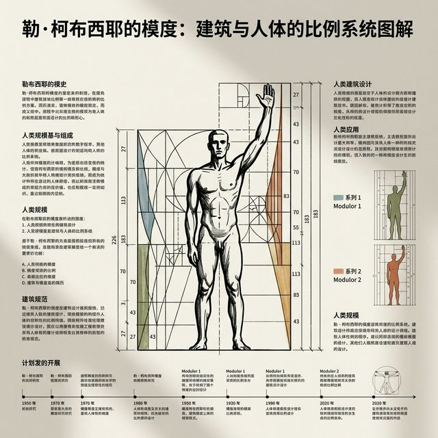
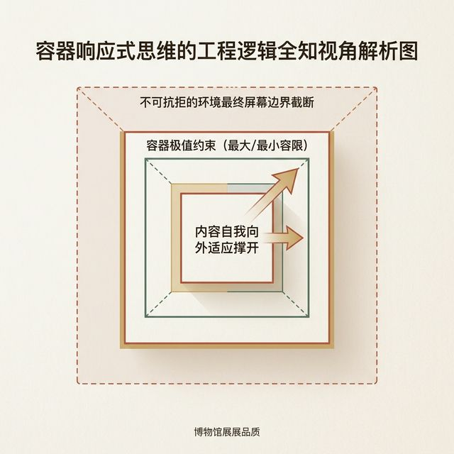

## 模块 2: 导入 — 画布思维的崩塌与响应式觉醒 (约 10 分钟)
<!-- BUDGET: 1800 chars | SLIDES: ≥4 | STATUS: done -->

> [VISUAL]
> **Slide**: M2-01
> **Layout**: `Comparison`
> **Scene**: 这是灾难现场真实例子演示。左边是美丽的、像素完美的原始设计源文件。右侧是同一个设计在被极端拉长的带鱼屏和极其窄小的折叠手机屏幕上呈现的恐怖惨状：文本段落飞出内容边框、精美的背景大图被粗暴压扁、最重要的"立即购买"大按钮一半被挤出了屏幕可视化显示窗口外面。
> **知识节点**: `dom-box-model-mental-map`
> *   **Asset**: 

在正式认识构成容器底层框架的盒子法则之前，我们先来看看如果不守工程规矩，将会落得怎样惨痛的下场。

看看屏幕上这张对比图。前几年，有一位学生做了一份毕业设计，他拿着自己在大型高分辨率显示屏上精心打磨、引以为傲的设计稿发给了导师看。在他的高端 4K 制图显示器上，这份交互原型堪称完美工艺品——排版对齐极其精美，中西文间距的留白也都做得极为考究。他认为这就是设计的终极状态了。

但在期末评审的那天，这套被硬编码强行缝合起来的本地系统，被投射到了阶梯教室那台老旧且分辨率极其拉垮的投影仪上。在那一刻，灾难瞬间降临了：
他那精心布置且锁死在右上角的"用户登录"按键，直接因为分辨率挤压而跑到了屏幕外；他那张横纵比 16:9 展示的超宽屏主视觉头图，无情地碾压了底部本来应该存在的说明文字。更要命的是，他用 Photoshop 切图导出的那些精确到像素级别的元素间距，在投影仪的低分辨率下产生了严重的亚像素混叠，文字边缘模糊得像洗过水的报纸。整个产品界面的视觉骨架，就像一座没有打稳地基的漂亮玻璃房子一样，在浏览器不同的窗口尺寸冲击下，随风摇摆并轰然倒塌。

这个悲剧在互联网设计史上并非孤例。事实上，根据大量设计团队的复盘与教训，超过三分之二的初级设计师在职业生涯的某个时刻，都曾经被这种"在我的电脑上明明好好的啊"的幻觉冲击过。问题的根源极其统一：他们没有意识到——**设计稿是在特定的物理环境中生存的，一旦离开那个温室，它的一切假设都会被无情打破**。

为什么看似完美的稿子会塌得这么彻底？

> [VISUAL]
> **Slide**: M2-02
> **Layout**: `Split`
> **Scene**: 屏幕正中显示巨大的反差引言。背景缓慢隐约浮现出 1990 年代万维网早期的、没有任何 CSS 装饰的纯净 HTML 网页源代码流。
> **Search**: `1990s HTML source code retro pure flow text`
> **Quote**: "网页从来不是打印机里吐出来的死板纸张。网页是流动的光与电。"
> *   **Asset**: 

根本原因就在于：设计师傲慢地用静止的假设，去对抗流动的物理现实。

从万维网和超文本引擎被发明诞生的那一天起，它在基因层面就注定了自己不是一页被锁死的印刷纸张。
你们回想一下最早的 HTML 结构，那个时候甚至连 CSS（层叠样式表）这种排版工具都还没有被引入。那时候只有内容段落和标题标签，文本的流动就像水一样自然流淌。后来时代演进了，终端设备爆发了，我们有了各式的电脑屏幕，有了单手操作的智能手机，有了可翻折的平板，甚至有了穿戴在手腕上的智能手表界面。

物理设备的屏幕尺寸在每天演进，操作系统的系统级字体缩放比例也在每天变动。在这张无始无终的网里，如果你依然像个旧时代的油画家一样，坚持要在一张固定长宽尺寸的绝对画布上去强行框定每一根毛发的绝对走向，那你就永远是在和浏览器的底层法则作对，永远在制造碎裂的脆弱界面。

而解决这道折磨了设计师整整二十年难题的唯一解药，叫做**响应式设计 (Responsive Design)**。

> [VISUAL]
> **Slide**: M2-03
> **Layout**: `Full`
> **Scene**: 现代建筑大师勒·柯布西耶的模度（Modulor）历史概念图解。一张极具表现力的黑白照片图示：一个人形张开巨大的手臂，旁边标记着有着连绵不绝的严密比例分割数值与多维度的空间数学网格结构图。
> **Search**: `Le Corbusier Modulor architecture proportion scale grid design standard`
> *   **Asset**: 

> [PHILOSOPHY]
如果跳出互联网看，这其实并不是数字时代才独有的难题。传统的建筑大师们早就遇到了同样的瓶颈。在这之前，建筑工人们全靠各自手里的尺子、经验甚至是直觉去垒砖头，这就导致了不同施工队负责的承重墙面根本无法实现完美拼接，楼稍微盖高一点就会因为底层的公差累积而出现极其致命的结构错位倾斜。这就像我们今天很多没有受过前端工程系统化训练的设计新手一样，在 Figma 里仅仅凭着眼缘和直觉去自由拖拽按钮位置，最后强行拼凑出来的所谓高保真原型，根本经不起真实设备终端运行时的任何拉扯。
在现代建筑史中，被尊为巨匠的勒·柯布西耶（Le Corbusier）发现了什么致命问题？他敏锐地发现：如果施工现场的每一个砖瓦工人都完全按照自己的直觉喜好去丈量尺寸、去砌墙角，那么百层高的钢筋水泥房子是绝对盖不起来的。于是，他发明了著名的"模度"（Modulor）理论，把混乱的人体生理比例抽丝剥茧，变成了一套极其极其严密的数学网格基础与工业集成的容器系统标准。
正是因为有了这套标准化的客观积木体系，我们到了今天才能够在大规模量产的工业化进程中，极为精准地向云端盖出无论在什么极端地形或风沙中都站得非常稳的高楼大厦。

如果你想在这个智能设备层出不穷、终端碎片化如宇宙星辰般的复杂年代做一份立得住脚的产品设计，你就必须停止去纯粹只画那些漂亮但一碰就碎的界面外壳。你必须跳出现有的维度，学会像建筑结构师一样去深入思考底层的受力结构。

在这个庞大的建筑结构体系里，你用鼠标设计的，再也不是诸如"一个绝对高度 300 像素宽的图片，外加在其下方紧贴着一行 20 像素的细体字"这样死板的内容拼贴。
你真正设计并输出的，是一个**充满弹性的容器边界适应规则**。

> [VISUAL]
> **Slide**: M2-04
> **Layout**: `Flow`
> **Scene**: 容器响应式思维的工程逻辑全知视角解析图。三个不断向外扩张嵌套的方块：最核心的内层块向外突破产生箭头，标注为"内容自我向外适应撑开"；中间包裹层标注为"容器极值约束（最大/最小容限）"；而最外层的庞大虚线框标注的是"不可抗拒的环境最终屏幕边界截断"。
> **Search**: `responsive design container logic scalable boundaries adaptation breakpoints`
> *   **Asset**: 

你要学着用参数大声告诉底层的前端机器甚至是负责生成的 AI 模型：
当屏幕随着用户拖拽，变得趋近无限宽的时候，容器中间的排版该如何合理分布地向外膨胀吸纳多余真空？
而当用户的物理操作空间被极限手机屏幕压缩到极其狭窄的边缘时，容器内的文案该如何优雅地自动收缩和进行换行跌落以保护主要信息不致丢失？

你要把所有这些无形的边界规则——就像给复杂的乐高积木提前打好互相咬合的凹凸接口槽位一样——通过 Figma 右侧那排精密严酷的工具栏定义下来。然后把这些接口设定，平滑且毫无二致地翻译为最高标准的底层代码参数属性进行交付。

而这一切所有奇迹发生的共同起点，都源自于浏览器物理世界里那套牢不可破的核心定律底座——也就是我们在接下来的下个核心模块里，要带大家深入剖析与解构的底层秘密武器。

---
