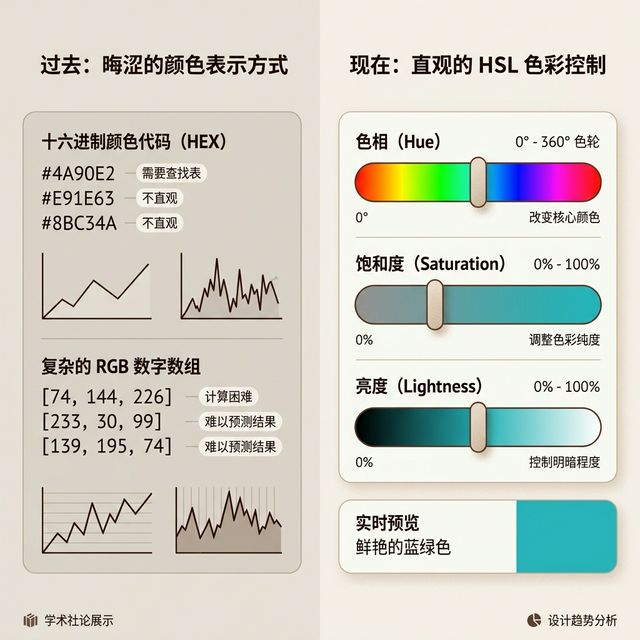
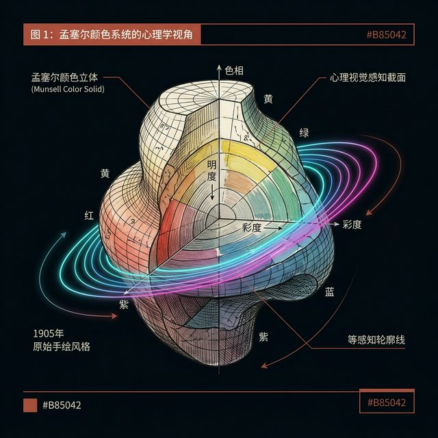
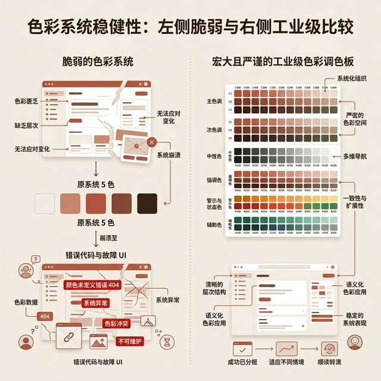
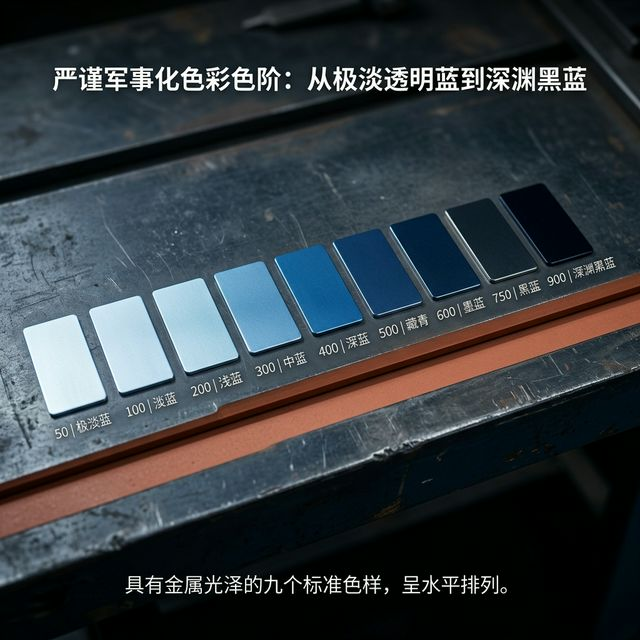
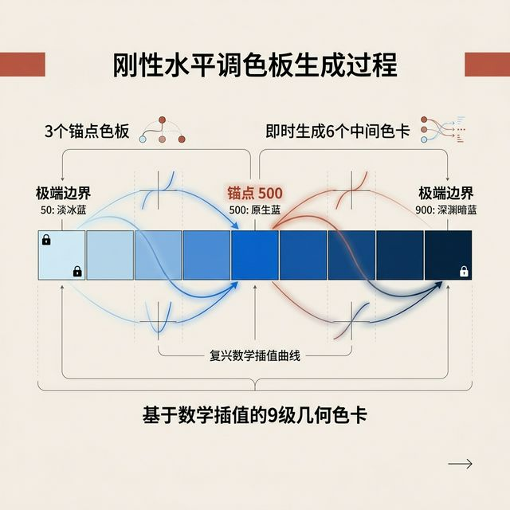

## 模块 3: HSL 色彩系统与 9 阶色板 (约 15 分钟)
<!-- BUDGET: 2700 chars | SLIDES: ≥6 | STATUS: done -->
<!-- MATERIAL_BUDGET: [Refactoring UI ch29 HSL分析] + [Cross-discipline: 1905年孟塞尔色彩系统 (Munsell color system) 物理感知空间] -->

上一讲我们彻底解决了界面的明暗、冰冷的骨架和辽阔的负空间。现在，这个由灰白线条框定的坚固水泥碉堡，终于准备好迎接整个系统中最具感性欺骗力、同时也最具致命杀伤力的终极武器了——色彩。

> [VISUAL]
> *   **Slide**: 告别 HEX 的炼金术
> *   **Layout**: `Split`
> *   **Scene**: 屏幕左侧展示一串像天书一样难以理解的 HEX 取色码（如 `#2D9CDB`）和令人作呕的底层 `RGB(45, 156, 219)` 数组；右侧则通过极其顺滑直观的三个滑块动画，分别极限拉动演示 Hue (色相)、Saturation (饱和度)、Lightness (亮度) 的分离物理控制。
> *   **Search**: `HSL vs HEX color system UI design`
> *   **List**: 
>     * HEX/RGB 是给机器阅读的机器方言
>     * HSL 是人类视觉视网膜的感性母语
>     * 像调节收音机一样直觉掌控色彩
> *   **Asset**: 

在深入讨论所有形而上的色彩感官哲学之前，我们需要先在极其肮脏的开发代码战壕里，统一我们最底层的交流语言。
很多刚刚入行、或者单纯只是偶尔跨界对全栈开发感兴趣的工程师，在给新系统草率配色时，非常喜欢去那些花里胡哨的所谓“每日配色灵感网站”上，直接无脑复制粘贴 5 个由十六进制代码 (HEX) 拼凑而成的所谓“完美爆款配色方案”。
当你盯着终端上的一个名叫 `#2D9CDB` 的干瘪色值时，你的大脑能瞬间凭空想象出，该怎样在代码里精确地把这个该死的蓝色调暗区区 10% 吗？
绝对不能，甚至没有人能做到。因为 HEX 和 RGB 系统，那是上个世纪极其恶劣地设计给冷酷的显示器发光晶体管，或者是喷墨打印机的下水管喷头去阅读的底层死板机器方言。它极其反人类、极其傲慢。
真正在一线扛枪搏杀的专业主级架构师和顶级视觉设计师，早就全面抛弃了这种玄学般的炼金术，全盘彻底拥抱了 **HSL 色彩系统**。

在这个 HSL 的极简数字宇宙里，一切看似神秘莫测的色彩，都被极其残暴且精准地解构成了三个你可以直接用手去拨动的物理参数滑块：
第一档，是掌控生死的 **Hue (色相)**。这是颜色的灵魂和国籍。从 0 到 360 度，就像一个三百六十度无死角的完整地球仪，你狠狠把滑块拨到哪，它就是红橙黄绿青蓝紫中的哪一个国家，绝不越界。
第二档，是爆发张力的 **Saturation (饱和度)**。它是整个界面的情绪释放频率和视觉肌肉密度。从 0% 的绝对冷酷禁欲灰白，一路飙升狂飙到 100% 的极致嘶吼刺眼鲜艳。
第三档，是掌控一切明暗深渊的 **Lightness (亮度)**。你可以非常霸道地把它理解为，上帝为了折磨你，往这个无辜的颜色里强行泼了多少桶极渊黑墨水或者高光白颜料。50% 是它最纯粹未受污染的本色，100% 则是彻底被高光刺瞎双眼的白板空洞，0% 则是一切物体坠入的黑洞。
有了 HSL 在手，界面的调色从此不再是痛苦不堪的盲人摸象，而是让你像一个拥有绝对控制权的顶级调音大师一样，极其精确地扼压控制每一丝微妙的情感成分。

> [PHILOSOPHY: 孟塞尔色彩系统与人类感知]
> HSL 的这种极其伟大的三维物理感官解构，并不仅仅只是当代硅谷极客和前端工程师们的专利发明。早在久远的 1905 年，人类历史上最伟大的色彩学宗师阿尔伯特·孟塞尔 (Albert Munsell) 就提出了震古烁今的“孟塞尔色彩系统”。
> 他极其不可思议且堪称天才地，将全人类几十万年来对色彩那极其主观模糊的感官体验，用数学一样严密的纪律，物理化为一个包含“色相 (Hue)、明度 (Value) 和彩度 (Chroma)”的庞大三维不规则球体模型。
> 孟塞尔名垂青史的伟大之处在于，他第一次不是从冰冷无情的物理学棱镜光谱数据出发，而是极其极其偏执地以**人类肉眼的视觉心理感知机制**为宇宙绝对核心，来霸道地构建这套规则系统。在这个被切开的球体里，鼠标指向的每一个孤独坐标点，都丝毫不差地对应着人类潜意识心理上的绝对颜色预期。

> [VISUAL]
> *   **Slide**: 孟塞尔的物理感知球体
> *   **Layout**: `Full`
> *   **Scene**: 在深邃无垠的黑色背景中，悬浮着一个 1905 年版手绘复古风格的、结构极其复杂扭曲的孟塞尔色彩三维模型空间球体。用极其刺眼的冷色调红外线高亮标注它以人类眼球心理轨迹为基准的不规则诡异切面。
> *   **Search**: `Munsell color system 3D sphere psychology value chroma hue UI`
> *   **Asset**: 

彻底理解了 HSL，我们才算真正在这个二维代码世界里拥有了被称为“造物主”的终极调节工具。但在一个动辄拥有数十万行代码构成的极其复杂庞大的真实企业级交互系统里，如果你妄想仅仅依靠网上抄来的 5 个看起来极具迷惑性漂亮的所谓“主题品牌颜色”就能打通关，那简直是无异于在极度寒冬下全副武装却只带了五颗手枪子弹。

> [VISUAL]
> *   **Slide**: 五色板的致命阵亡现场
> *   **Layout**: `Split`
> *   **Scene**: 屏幕左侧展示一个只有区区可怜 5 种配色的单薄纸糊设计系统，在遇到 Hover 悬停、Disabled 禁用态和暗黑模式一键切换的绞肉机测试时，瞬间全线崩溃疯狂报错的严重灾难代码界面；右侧则极尽震撼地展示一支由近百个极具肃杀纪律性的严密颜色方阵军团构成、如钢铁长城般的无死角全天候工业级大型色板库。
> *   **Search**: `UI design system scalable robust palette crash`
> *   **List**: 
>     * 5色板无法应对真实系统并发
>     * 系统级开发需要极端的面状火力覆盖
>     * 面向极限气候的工业原子化色彩法则
> *   **Asset**: 

因为在这个充满了各种变态场景的修罗场里，当你真实面对一个巨型数据操作终端时，你会碰到像幽灵一般的多级悬浮状态阴影按钮、被死死按住不能动弹的极度压抑按下态按钮、像灰烬一样失效报废的干瘪文字、只敢在角落里发出极其嘶哑微弱极浅警告底色的错误高亮框、以及犹如一堵极其深重的黑墙一般压迫人的巨型全屏模态层遮罩。
你手里那区区可怜的 5 个单色块？这种破铜烂铁在这种宛如绞肉机一样高强度的无情实战战场里，绝对连一分钟的地狱火都扛不住就会瞬间灰飞烟灭！
你需要建立的绝对不仅仅是一个极其孤立、在真空中纯粹漂浮的所谓“品牌蓝定海神针”，你需要的，其实是一支拥有武装到牙齿的完整数字纵深梯度、能强行应对整条战线从赤道到极地所有极端恶劣物理气候变化的“重型钢铁装甲体系兵团”。

> [VISUAL]
> *   **Slide**: 构建全天候的面状防御战线
> *   **Layout**: `Full`
> *   **Scene**: 在一张巨大冰冷散发着机油味的灰黑色硬核重金属工业作台上，像极其整齐地陈列着一排排大口径重机枪子弹夹一样，陈列出一条由极浅近乎透明蓝暴走到极度深邃窒息黑蓝、带有极其冰冷金属质感光泽的 9 个完整横向梯度的严苛数字色板装甲群（冰冷地标上一排排诸如 50 到 900 的军事编号）。
> *   **Search**: `9 step color palette UI robust system scale`
> *   **Asset**: 

在当今硅谷最顶尖极其冷血的现代工业级原子化开发严格规范里，这冷酷无情地意味着：对于你手中的每一种必须使用的核心基础色彩大族体系（比如代表着系统脊梁骨的沉稳品牌蓝、代表着生死存亡防错红线的极其危险刺目狂暴红、代表着最高权限提交成功态的极度安全呼吸绿，以及撑起整个后台宇宙暗物质纯粹背景的庞大内敛中性灰禁卫军家族），你都必须像对待精密的神级航空航天级工业零件一样，不带任何私有感情色彩地为它们量身打造并且死死打磨出一套标号从 `50` 极其陡峭残酷攀登拉升到 `900` 的 **9 阶或 10 阶武装到牙齿的全火力密集覆盖战术色板大军**。

> [VISUAL]
> *   **Slide**: 铸造 9 阶色板的生死硬核铁三角锚点
> *   **Layout**: `Flow`
> *   **Scene**: 一条没有任何生命迹象带有 9 个极寒空白方阵的进度条坑位序列。动画开始极其残暴演示：首先，最中间的 `500` 号核心神级方块被犹如万吨钢压机一样极其沉重、刺眼的直接凿入深邃的主战蓝色；紧接着，最左端濒临死亡边缘的虚弱 `50` 号极浅冰蓝和最右端深不见底如同深渊般的 `900` 号极暗虚无深渊蓝被极其暴力地直接死死两头钉死锁定在墙上，发出沉重冰冷的金属撞击声。最后，这三个主核绝对锚点之间被极其精密复杂的算法拉丝连线，剩余的 6 个空隙瞬间通过高强度的抛物线渐变函数暴力计算，像被充入高压电一样瞬间在一毫秒内被极其丝滑、毫无颗粒感地瞬间通导贯穿补齐全部爆亮。
> *   **Search**: `color palette generation steps base light dark UI bezier`
> *   **List**: 
>     * 定海神针：不惜一切代价直接强行敲定 500 号主战机甲色
>     * 锁死生死两极：强行设定 50 号天花板濒死区与 900 号无尽深渊底线
>     * 无缝内插算法补余：用极其致命丝滑的贝塞尔抛物曲线填补所有极其脆弱的中间连队过渡防线
> *   **Asset**: 

怎么在这个毫无生机的一片荒原上一砖一瓦地残酷铸造这条能够抵挡核弹级冲击波、无坚不摧坚甲战衣般恐怖的终极战术色板链条防御网？只需要开发人员坚决彻底死板执行极其冰冷无名、犹如杀人机器般精准的三步走绝对战略纪律。

第一步：极度险境中寻找不退的一线中流砥柱。在全色板最绝对正中央的安全火力核心区，极其毫不讲理地直接残暴选定出那只骨架抗压最硬朗、能够在涵盖整张业务大网绝大多数中庸平级残酷高并发场景里都极其死板死死扛压站得住脚、绝不软弱退缩的高纯度颜色，作为统御你整支军队极其核心精锐的 `500` 号主战信仰色彩（比如你的昂贵独裁 App 最初一开机那个启动页上的那一抹不容反驳的霸道强权蓝）。它不仅仅是一个普通的色标常量，它是维系贯穿整个庞大深邃家族暗黑色系的唯一工业合金骨架脊椎，是负责在最残酷的前线搏杀战场扛起整条战线绝大部分主要重型物理火力网网段绝对伤害攻击输出的主力装甲合成护卫先锋军。

第二步：死死锁死绝对极地的生死阴阳两界极限极向。毫不畏惧地向光亮得令人目眩、光芒万丈极浅极其刺瞎眼球的一端极速疯狂挺进抬升抓取，极其决绝地硬性绝对确定出那个几乎快要随时融化在全白底色真理幕墙深海里、如同纯粹微弱物理幽灵一般只能保留着极其可怜到几乎无法正常呼吸存活的极其惨绝本基色发光核心光晕的绝对 `50` 号极浅限界濒死色。然后下一秒钟立刻暴怒反转操纵杆狂调庞大沉重的下沉坠海重力，像一艘失控自杀暴雨般的核动力潜艇一样对准极其至暗无底流冷流海湾深处一头极其无情直潜，强行绝对无情确定出那个深得令人近乎发指发狂、暗沉极其令人精神扭曲压抑让你几乎完全彻底无法做到任何物理顺畅呼吸、但你必须脑海里死死严守住底线绝对不能完全沦落黑化为那恶劣无比纯黑色块坟墓的 `900` 号极其深邃压抑极限恐惧沉渊色。这两个极其决定生与死物理存亡边界的冰冷极点物理界线锚点一旦在代码图纸上被极其极重冷血无情地盖章确立绝对锁死划死，就等于直截了当地像倒下万吨纯净钢筋水泥防波堤沉降一样，为整个风雨飘摇极其脆弱可能会崩溃土崩瓦解的危险系统外围防线，硬生生地设定砸下两道极其稳固绝不可逾越、甚至根本完全无法用任何普通手段推翻重来的庞大深海厚重防撞绝对冰冷沉重隔离防暴雷区！

第三步：终极上帝视角的超精密制导无缝内插残暴极速补余。当你终于有了这三个即便是用高能物理战术破甲弹核榴弹直接近距离轰炸也绝对无法摧毁它们哪怕任何一分一小毫的绝对刚性锚点基础承重连防线阵池地基的时刻，剩余那些填平在大地干枯沟壑裂缝里的那群极度大量的诸如 `100`、`200` 或者靠近高压重力深水极高极压深海区的 `700`、`800` 号这类处于极为危险高灰色过渡脆弱状态地带连队的士兵们，你此时完全可以极其高傲且大胆放手去绝对盲信你在过去火海项目死人堆里锤炼出来的那极其神明般超级冰冷极速精确极致的第一视觉终极机器神经直觉，或者干脆更加彻底无情残暴不讲人类情感极其理智地去大规模成群机械化调用极其深奥极致高维算法优美极点的基于 HSL 等差几何参数贝塞尔多参数究极平滑全抛物数学曲线高精度在线渐变方程式编译器高级外挂算力辅助计算黑盒封装类插件工具集，去将这极其极其庞大到令人绝望无情感却要保持极高精密度极速充当炮灰战线填充物战队的大批量冷血士兵数字阵列集群兵种军团方阵库，在让你极其极其毛骨悚然战栗且绝对极度疯狂、极致丝滑且毫无由于低劣像素误差卡顿带来的断层感的高压光年视觉强效渲染下，以极速极高压光速密集极其瞬间强行无差异全面物理填充饱和满配塞死进弹匣极速强行无脑填列满编全部强制光速暴力瞬间爆满填充填满到位！

当这套几乎完全覆盖了从最微弱的 50 高光濒死极限地带，一路贯穿攀登拉升跨越直到那压迫得连光线都无法逃逸的极点深渊 900 的严苛链条 9 阶色板，在一片机器轰鸣声中彻底组装完毕交付编译时，你在未来绝大部分前端代码编写最险恶复杂的战区里，都会感到一种无比冷酷从容与极度奢侈的极致战场安全感。
---
