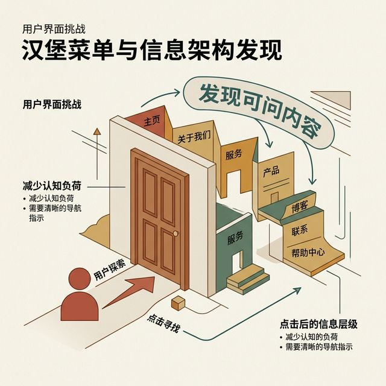
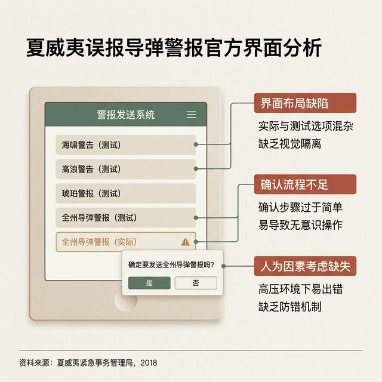
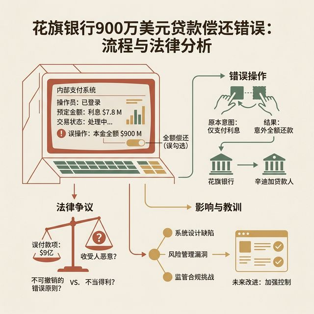
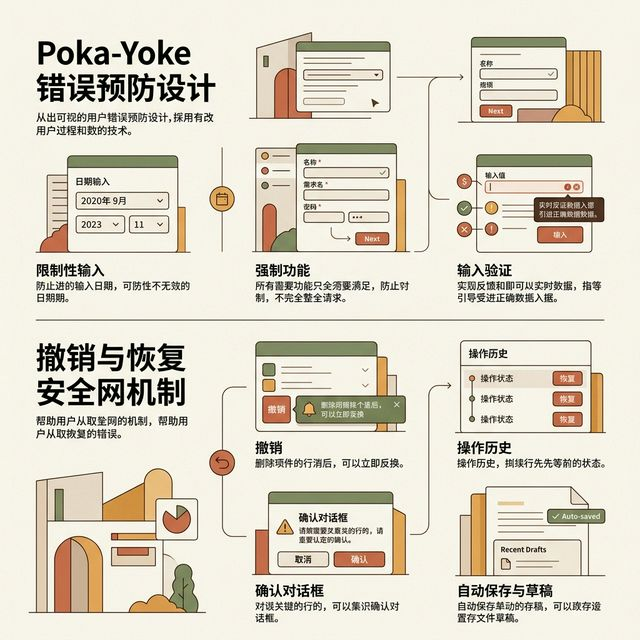
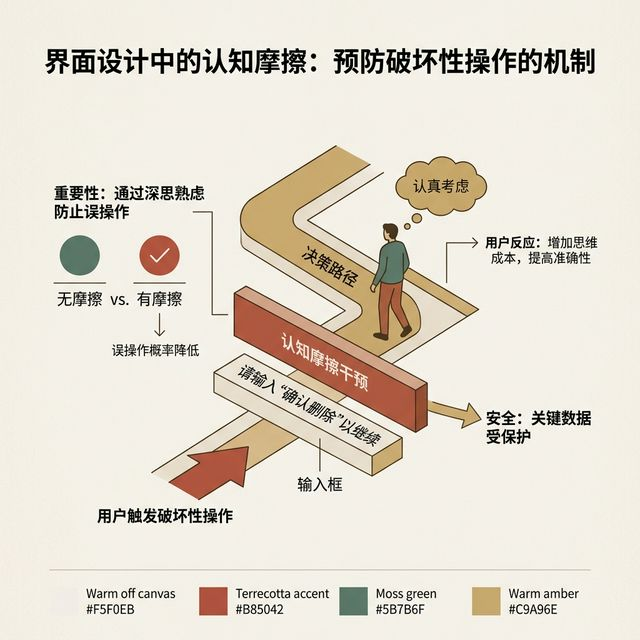
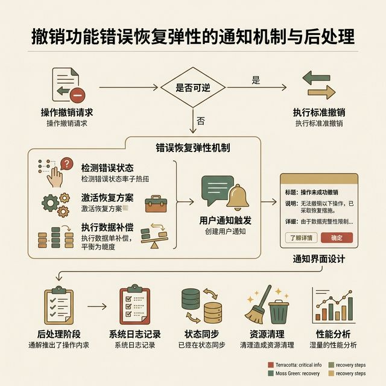

## 模块 4: 防错设计与安全网体系 (约 20 分钟)
<!-- BUDGET: 3600 chars | SLIDES: ≥7 | STATUS: done -->
<!-- MATERIAL_BUDGET: Hub×2 + 案例×2 | 估算 4200 字 | 覆盖率 110% -->

> [VISUAL]
> *   **Slide**: 失控的灾难：当系统未能在深渊前拦下用户
> *   **Layout**: `Comparison`
> *   **Scene**: 左半边是一张夏威夷导弹系统操作面板的模拟界面：满屏密密麻麻、样式完全一致的平级按钮，“测试警报”和“真实洲际导弹来袭警报”两个按钮挨在一起，没有任何防错机制。右侧是著名的花旗银行页面，一个毫无预警的打款操作导致了五亿美元的乌龙汇款损失事件。红色的警告标识笼罩全图。
> *   **Search**: `Hawaii missile false alarm UI hazard bad design examples error prevention`
> *   **List**: 
>     * 人机工程学的血泪启示录
>     * “操作失误”往往是系统设计原罪的替罪羊
>     * 防御性设计的核心：假设用户在酒醉状态下点击
> *   **Asset**: 

随着层级纵深的部署与兜底边缘预案的建设，我们的界面看起来已经具备了商业级别的严密性。然而，交互设计不仅负责解决视觉上的排列组合，它还肩负着一项极其神圣且常常直接关乎生命、财产与社会安保稳定的隐秘职责：构建防错机制，也就是 Error Prevention Systems。

> [!INFO] 理论库映射
> **核心教材**：《交互设计精髓 (About Face 4)》
> **章节关联**：`[about-face-ch15-prevent-errors]` 预防错误与情境反馈的兜底设计
> **关键延展**：防错大于挽救（Prevention > Recovery）。系统应基于“物理级防呆（Poka-Yoke）”从源头直接剥夺发生危险操作的可能性，而非仅仅依赖撤销功能。

> [CASE STUDY: 血泪交织的交互事故]
> 大多数人谈起界面设计，往往联想到美学风格或者品牌颜色。但在安全工程界，劣质的界面设计一直是一把无情的屠刀。> [VISUAL]
> *   **Slide**: 夏威夷警报的惊悚界面
> *   **Layout**: `Screenshot`
> *   **Scene**: 原封不动地贴上一张当时泄露出来的系统后台菜单截图。一整排干涸生硬、只有蓝色下划线锚点的文字链，其中“TEST missile alert”与真正的“HAWAII missile alert”毫无区分度地挨在一起。
> *   **Search**: `Hawaii missile false alarm official UI screenshot interface`
> *   **Asset**: 

在二零一八年一月那个寻常的清晨，整个夏威夷州的百万居民收到了令人毛骨悚然的本地强制推送警报：“弹道导弹正飞往夏威夷。立即寻找掩体避难。这不是演习”。整个社会陷入长达近四十多分钟的极度恐慌、交通瘫痪和通信挤兑深渊中。
>
> 事故后调查出炉的原因并不复杂。并不是防空网络遭到了高端黑客组织的劫持渗透，而仅仅是因为在应急指挥中心的监控操作后台系统中，“发送内部测试演示警报”按钮与“发布全州真实军情实况警报”按钮，被极其不负责任地并列放置在了同一个下拉菜单中。它们共享着相同的字体大小、相同的单调背景配色，并且在点击之后没有任何能够阻断灾难的二次安全校验强制屏障。操作员只不过是手抖选错了相邻的那行字符。
>
> > [VISUAL]
> *   **Slide**: 花旗九亿美元大惨剧
> *   **Layout**: `Grid`
> *   **Scene**: 犹如上个世纪九十年代的银行主机黑屏终端系统。极其混乱、没有任何视觉层级的主机文本框。因为没有二次弹窗金额拦截机制，这套古老的 UI 夺走了全美金融界的呼吸。
> *   **Search**: `Citibank 900 million loan error UI terminal screen`
> *   **Asset**: 

同样在金融界，因为审批后台操作界面晦涩难读且未设立金额安全熔断防备阀机制，花旗集团的一名审核人员不慎将本应支付几百万利息的表单，混淆成了一笔连本带利高达九亿美元的回款提前结清执行指令并按下确认。系统冷酷无情地完成了这道荒诞的指令，最终酿成了人类金融史上最为惨痛滑稽的乌龙执行案。

这些触目惊心的灾难事故反复向行业敲响警钟：在那些容错级别要求极高的关键路径上，任何将全盘责任推卸定性为“用户粗心大意导致的操作失误”的做派，都是高级系统防线建设人员和工程主管推脱自身安全系统构筑失职的不负责任说辞。真正的企业级架构理论信奉一条铁规：只有在没有阻拦机制的恶劣系统温床上，才会引发所谓的误操作。

> [VISUAL]
> *   **Slide**: 防错重于挽救：防呆法则与护卫设计
> *   **Layout**: `Split`
> *   **Scene**: 演示防呆设计的两个阶段。第一阶段是“发生后挽救”：用户删除了文件，右下角弹出一个带有“撤销功能，即 Undo”指令的浮窗气泡。第二阶段则是真正的“防错防呆设计，即 Poka-Yoke”：画面展示一张 SIM 卡或网线水晶头插槽，它们天生拥有不对称的缺角形状阻断结构，从而在物理源头级别上使得反向插拔等致命操作甚至连发生的可能性都被彻底剥夺。
> *   **Search**: `poka yoke error prevention design UX undo recovery safety net mechanism`
> *   **List**: 
>     * 防错（Prevention）永远优于恢复（Recovery）
>     * 强制功能策略：从源头剥夺犯错的物理可能性
>     * 认知验证卡口：利用交互摩擦力换取生命安全
> *   **Asset**: 

早在半个核世纪之前，现代工业生产管理学派便总结出了一套被称为“防呆制度，也就是 Poka-Yoke”的管理科学哲学。其指导核心为：系统不应该期望依靠使用者的主观细心程度来规避危险破坏操作。系统应当被直接重构。通过增设结构限制，使得那些危险动作根本缺乏执行和存在的物理空间逻辑。

在我们的防错设计与护栏守卫体系中，这种思想被精炼划分为三个进阶防卫序列拦截网：

第一序列被称为**系统前置防错机制，即 Pre-emptive Formatting**。这是最聪明的拦截法。这主要通过组件级物理屏蔽达成目标。当你进入一段只允许拨打国际长途数字号码的信息录入段落区域时，高阶产品经理会在前端调用起由纯数字和拨号符号阵列组成的数字专属虚拟软键盘模式栈。这不仅仅是缩短了用户的击键搜索流程，这更是在系统根源地带物理级别彻底剥夺了他们不小心敲击混入乱码字母或特殊非安全验证符号的任何犯罪执行可能性。

> [VISUAL]
> *   **Slide**: 摩擦力的艺术：验证拦截网兜
> *   **Layout**: `Split`
> *   **Scene**: 危险的云资源销毁操作节点面板。不是仅问“确定要删除吗”，而是强迫用户在下方极具警戒感的红色输入框中，亲手一点点键盘敲出红字验证口令 `DELETE-DATABASE-CORE` 才解锁提交按键。
> *   **Search**: `UI cognitive friction type to confirm destructive action prevention`
> *   **Asset**: 

第二序列称之为**引入有意阻隔与适度心智摩擦力，英文称为 Intentional Cognitive Friction。**。设计学中常言减少操作摩擦。但在高危决断口，这种论调是极为有害的。面对系统管理员权限变更、大额资产销毁或危险数据不可逆清零时，流畅快捷的单指滑动体验是致命的。此时我们必须违背常规的顺滑定律，布设严密的认知验证堡垒网兜。例如要求发起执行的人必须在弹出的高警界模态窗文本输入区域内，亲手逐字敲打出长达十二位的应用名称校验代码以匹配操作声明协议。这就如同给枪械加装上了需要多步骤双手协同才能扣开触发的厚重金属安全保险栓拨片结构，强迫他们的高频神经操作中枢在阻力面前刹车停转，唤醒高级理性监管防线从而对当前举动进行严肃检视。

> [VISUAL]
> *   **Slide**: 最后的温柔底线：撤销系统的哲学与降落伞机制
> *   **Layout**: `Full`
> *   **Scene**: 以全球经典邮件系统发送端为例展示操作可逆性保障大网概念图。用户一键点击发送了含有重磅附件或者错发重要客户名字邮件之后。画面右下角静静漂浮出一个黑色具有安稳力量的安全托盘通知栏：“邮件已投递。撤销功能，即 Undo”。随附一个倒计时进度条。
> *   **Search**: `Undo functionality error recovery resilience mechanism notification post-action`
> *   **Asset**: 

即便我们构建了严密的前两道防火高墙阵列区域，系统依然无法拦截一切在深度疲态或者醉酒神游状态下执意冲关的人类行为指令流失控现象。这就引出了现代安全体系的最终防线——第三序列：**系统宽容法则与容错可逆恢复机制，也就是 Reversible Forgiveness 与 System Fallback Resilience**。

在许多历史久远的架构中，系统将“执行确认，即 Confirm 行为，”视作操作流的最终终局审判裁决，一旦执行如同射出的子弹般万象俱灭不可复生。但伟大的平台架构产品将其视为可以追回的物理缓冲过渡态阶段。著名的案例便是各类现代通讯平台开发的延时滞留缓刑重组网闸大招策略——操作虽表现为立刻响应前台表象任务目标；但后台服务器发令机制却会人为截留延宕该信息数据包约几秒直至一分钟时间。

在这段生死攸关的回溯黄金宽恕安全保护窗口期内。使用者随时都能因为自己由于猛然清醒、发觉措辞不当甚至误抄收件人联络表而吓出冷汗之时。只需仅仅通过轻轻一按屏幕边缘静静驻扎等候召唤提示牌上的重置挽救悬浮逃生舱按钮指令开关口。这就宛如给跳崖者凭空变出了降落伞安全绳锁扣降落衣护垫气囊；让一笔原本无可挽救将产生重大声誉毁损破裂大灾害局面的严重车祸报表故障错运行灾情，在风平浪静波澜不惊的最轻巧动作弹指一挥平移微动之间瞬间冰雪消融悄然化解抹除于无痕未发生无伤害极低保命境地之中。

这就是防错体系所倾力铸就的无上关照大圆满境界与灵魂深处的保护神屏障安全网边界防御系统架构大图景全貌。

> [TEACHING MOMENT: 防错机制在医疗设备史上的血泪惨案]
> 当我们谈论防错机制时，必须提升到敬畏生命的高度。
> 在二十世纪八十年代，有一款名为 Therac-25 的高端医用放射性线性加速器。这款机器被广泛用于癌症患者的放射性高频放疗操作中。
> 与前代机器不同，这台机器取消了大量物理保险锁。工程方极其傲慢地将所有安全监管机制完全交给了一套晦涩难懂的软件系统界面去统一控制。
> 它的操作面板设计得极其糟糕。界面充满了令人费解的晦涩报错字符，比如“Malfunction 54”。没有任何人知道这个代码到底意味着什么。
> 更为致命的是这套交互系统极其缺乏容错校验安全防线。当操作员熟练快速地输入治疗指令时，如果前一秒输入了高强度的 X 射线模式指令，但在打字后极速的一秒钟内又按下了回退按键修改为低强度的电子束投射模式。
> 界面的显示虽然乖巧地更新为了全新的低强度安全模式。但是底层的实际物理挡板，却因为高并发的指令打架冲突，根本没有及时响应落位并拦截高能电磁光束流。
> 而在这整套荒谬的致命流程里，系统没有任何二次阻断，也没有强制操作员重新核实步骤的安全阀门闸口确认校验弹窗。它默认了操作员的快打手速是理智可靠的。
> 于是，机器冷血地被触发了。极其巨量级别的超强高危致命放射性射线流，就这样在毫无遮挡防护的情况下，直接毫不留情地击穿焚穿了无辜患者毫无防备的脆弱身体。
> 仅仅因为软件界面对于高频误操作毫无拦截与宽容验证设定机制，它引发了人类现代医疗器械史上最为悲惨的连环惨案。这起案件至今依然悬挂在各大设计最高学府的黑门耻辱柱上，作为警醒后世学徒的第一课。

> [PHILOSOPHY: 从发生后补救到物理级防呆]
> 这起血案给我们带来了极为沉痛的领悟经验。
> 指望用户在高度疲劳或心智混乱的状态下，不犯任何错误，是产品架构中最愚不可及的做法。真正顶级的工程系统，永远不会去苛求用户的熟练度。
> 防护体系被明确切分为预防和补救。补救手段比如垃圾箱和撤销功能按钮，固然非常重要。这就像你给在悬崖上失足跌落的人铺设了一层极厚的柔软绝热海绵充气保护救生气垫床盆。这极大地挽回了生命财产损失。
> 但这对于防错体系的最高段位境界而言，依然显得太过于被动了。
> 最高段位的手段是物理级别的防呆隔离系统架构，即 Poka-Yoke。

> [CASE STUDY: Git 仓库销毁的安全网构建]
> 在严肃的工程领域，防呆设计的容错可逆网兜恢复机制展现得淋漓尽致。大家非常熟悉的全球最大代码托管平台 GitHub。当你作为一个管理员，试图删除一个拥有数千名贡献者的代码仓库时，系统部署了史诗级的拦截工事。
> 这并非一个红色的取消确定弹窗能解决的。首先，它要求用户在危险区（Danger Zone）内寻找入口；点击删除后，弹出的对话框不仅带有强烈的警示边框，更关键的是——它强加了极其耗费精力的验证任务。你必须完整、正确无误、不带任何多余空格地把“这个极其复杂的拥有几十个字母的组织名与仓库路径全拼”一字不落地亲自键盘敲入输入框中。
> 如果你复制粘贴？有的系统甚至会通过前端脚本禁用右键粘贴功能。这种极为苛刻的肌肉验证环节，把用户完全从无意识的疲劳滑动操作中猛行抽离出来。这彻底阻断了因为看错标签页而误删掉整个公司命脉级代码堆栈的灾难事件。
就像你把充电插头的三角金属引脚做成大小各异极不均衡并且不对称的奇怪几何形状特征构造。
> 由于物理形态特征被锁死了。如果你想闭着眼睛把插头强行反过来倒接反方向插入绝命强电电源插座内部孔洞，那是根本完全插不进去的。
> 这是完全基于宇宙物理法则与底层代码硬编码锁死机制的阻断式隔离防御手段。因为犯错的物理先决条件和逻辑切入点在这个世界上被彻底抹除了。系统才算迎来了真正的铜墙铁壁级别无懈可击的安全。
> 在前端世界，这就意味着我们要在录入电话号码时，直接封杀禁用字母键盘的弹出指令调用权限口。从源头剿灭危险。

> [STORY TIME: 危险操作阻断关卡]
> 曾经有一个世界五百强的大型 ERP 系统管理后端服务软件。里面藏着一个极其致命的危险操作大按钮，叫做“全局数据中心重建指令”。
> 很多疲惫的员工在审核表单时，会不小心点击到那个危险区域。一旦点击，数天的财务成果灰飞烟灭。
> 为此，设计团队痛定思痛。他们没有试图改变按钮的颜色，或者仅仅弹出一个“你确定吗？”的软弱对话框。因为人们常常会凭借本能盲目极速连击确认。
> 他们采用了一种极度具有心智摩擦阻力的阻断核实关卡。当你想执行这项极危重构指令时，弹窗不仅是红色的。更是要求你必须在这个输入框内，一个字母一个字母地完整拼写出“我确认销毁全量业务记录”这几句带有点悲壮反省色彩长度惊人的安全协议文本。
> 这个耗时且充满阻力的长线打字核对动作过程，彻底终结了全公司连续数年的误触操作崩溃惨烈事故。这种看似添堵反常规实则用心良苦极度负责的高阶阻断关隘机制，才是守护一切数字文明火种延续的坚固最后堡垒围墙屏障门。
