## 模块 2: 讲授(上) — Prompt 工程与跟 AI 的精确沟通法 (约 35 分钟)
<!-- BUDGET: 6300 chars | SLIDES: ≥12 | STATUS: done -->
<!-- MATERIAL_BUDGET: prompt-engineering-ui, IDC: Speech Act Theory (J.L. Austin) -->

正如我们在上一模块结尾所说，现在我们要用一套极度结构化的语言体系与大模型对话。从绘图员变成指挥家，你需要掌握的第一门核心外语，就是结构化 Prompt 咒语。

> [VISUAL]
> **Slide**: M2-01_Haircut_Tragedy
> **Layout**: `Full`
> **Scene**: 一张极其生动、令人捧腹的理发店惨剧网络梗图。左边标着“顾客的要求：要有呼吸感、少年感、显脸小”；右边标着“理发师的最终交付：如同被狗啃过一样的精神小伙平头”。
> *   **Asset**: 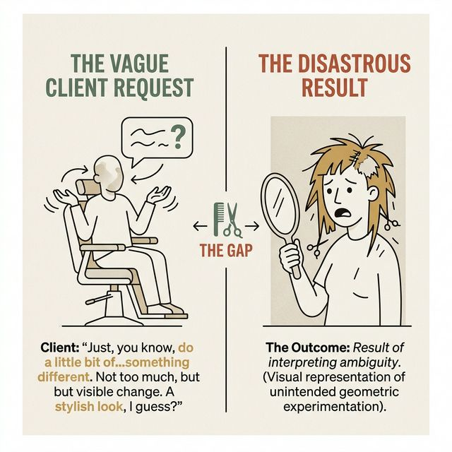
> **知识节点**: `prompt-engineering-ui`


> [LIFE CONNECT]
> **理发店的跨服沟通悲剧**
> 想象一下你周末去理发店的经历。你在椅子上坐下，随意给出一个典型失败的 Prompt：“师傅，给我随便修修，剪个有少年感的发型，别太短。”结果四十分钟后，你看着镜子里的精神西瓜头，陷入了沉默。
> 为什么？因为“少年感”是一个极其主观、且没有任何物理定量定义的模糊意象。如果你是个懂得结构化表达的聪明人，你应该给出绝对定量且具备空间约束的指令：“第一、两边推平拉高梯队；第二、顶部保留 3 厘米基础长度；第三、刘海不规则碎剪且底线不可遮盖眉毛。”听到定量参数，任何理发师都不可能发生毁灭性降级偏差。

在屏幕里跟大语言模型沟通复杂业务逻辑和界面需求，跨服沟通的灾难率比理发店还要高一百倍。
> [TEACHING MOMENT]
> **警惕“知识的诅咒”：隐性知识的黑洞**
> 为什么绝大多数交互设计师和产品经理第一次使用 Vibe Coding 都会经历惨痛的翻车？这背后有一个极其深刻的心理学现象——“知识的诅咒 (The Curse of Knowledge)”。
> 当你在脑海中构思一个“电商购物车界面”时，你其实已经预设了成百上千条极其严密的**隐性知识 (Tacit Knowledge)**：你默认悬浮的卡片必须要有柔和的阴影，你默认主次按钮必须通过实心和线框来区分层级，你甚至默认如果购物车为空，必须得有一个引导去逛逛的空态占位符。
> 但是，当你面对 AI 时，你往往只提取了最表层的**显性知识 (Explicit Knowledge)** 输送过去：“给我生成一个购物车页面”。
> 你理所当然地以为，既然它叫做“智能模型”，它就应该像你身边坐着打配合的资深前端一样，能够靠默契补全所有背景信息。大错特错！在它的算力维度里，它只接收到了这几个单纯的字符。它没有任何上下文，没有你们公司的设计规范，也没有你脑子里的审美底座。这种隐性知识的巨大断层，最终导致它只能去抓取一些毫无逻辑的预制组件，然后强行拼装交差了事。

如果你试图继续用日常白话要求“生成一个质感高级的按钮”，AI 面临这种空洞输入，只能依靠底层权重发散匹配，胡拼乱凑出一坨五颜六色、充满违和元素拼接的 UI 灾难现场。

> [CASE STUDY]
> **隐性知识断崖：当“购物车”沦为垃圾桶**
> 让我们来看一个真实的灾难案例。某初创团队的产品经理，在使用 Cursor 试图生成一个“医疗设备的耗材补给购物车”时，仅仅输入了四个字：“写个购物车”。
> 在产品经理那深达三十年的社会常识中，所谓“医疗购物车”，默认且必须具备以下隐性知识（Tacit Knowledge）：第一，它处理的是高危物品，所以必须有极其克制的灰蓝色调，绝不能用红色或花哨的渐变色；第二，它需要极高密度的信息展示，因为护士需要一眼核对耗材型号、药剂浓度和过期批次；第三，它必须有双重确认弹窗防呆设计，因为一旦买错耗材可能导致手术延期甚至医疗事故。
> 大模型能读懂这些前提吗？完全不能。大模型在接收到“购物车”这三个字的显性知识（Explicit Knowledge）后，它深层神经网络中权重最高、被训练次数最多的“购物车”数据是什么？是淘宝、是京东、是亚马逊这种充斥着消费主义狂欢的 C 端电商平台！
> 于是，三十秒后，产品经理震惊地看到了一份充满荒诞色彩的代码：页面顶部是一个巨大的、刺眼的橙红色“限时秒杀”跑马灯横幅；列表中的医疗导管被加上了“买二送一”的促销滑块；而结算按钮旁边甚至还贴心地附带了一个跳动的“分享给好友砍一刀”的社交裂变组件。
> 这就是“隐性知识断崖”最典型的表现。在这个严肃场景下，由概率统计算法匹配出来的最高权重泛化组件，变成了一场毫无专业底线的滑稽闹剧。这也印证了一个铁律：跟 AI 对话，你必须像一个偏执的律师撰写合同一样，把所有你觉得“理所当然”的东西，全部用明文的物理法则彻底锁死限界硬编码。

> [VISUAL]
> **Slide**: M2-01b_Tacit_Knowledge_Gap
> **Layout**: `Split`
> **Scene**: 左侧是人类脑海中预设的隐性知识冰山（包含审美底座、商业常识、防错规则）；右侧是大模型接收到的仅仅露出水面的三个字“购物车”。冰山之间产生巨大的断层。
> *   **Asset**: 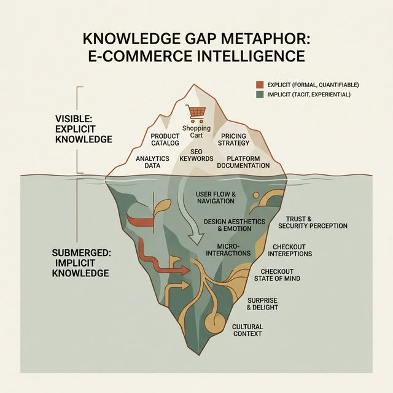
> **知识节点**: `prompt-engineering-ui`


> [VISUAL]
> **Slide**: M2-02_Speech_Act_Theory
> **Layout**: `Split`
> **Scene**: 左侧是牛津大学哲学家 J.L. 奥斯汀 (J.L. Austin) 和著作《How to Do Things with Words》；右侧是对 Prompt 指令本质的哲学解构——从描述性语言升级为创造现实的行动性语言。
> *   **Asset**: 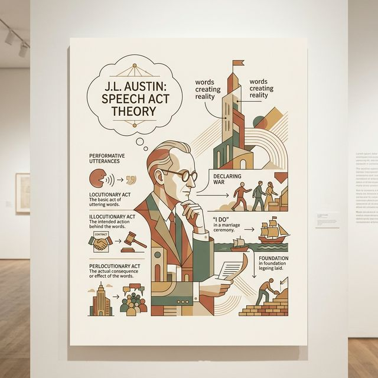
> **Search**: `John Langshaw Austin How to Do Things with Words Speech Act Theory`
> **知识节点**: `prompt-engineering-ui`

> [PHILOSOPHY]
> **跨学科降维：Prompt 的哲学本质是「言语行为」**
> 我们借用语言哲学的核武器级理论来重塑人机沟通的认知。英国哲学家 J.L. 奥斯汀在其巨著《如何以言行事》中提出了「言语行为理论 (Speech Act Theory)」。
> 奥斯汀指出，语言不仅用于“描述 (Describe)”客观事实，绝大多数时候，语言本身就是一种极具因果杀伤力的“行为 (Action)”，即“施事行为 (Illocutionary Act)”。当法官敲下法槌宣判“你有罪”，或神父在婚礼上宣告“结为夫妻”时，这句话在说出口的瞬间，**直接且强力地改变了物理与法理世界的现实状态**！
> 今天你们狂敲 Prompt 时也是如此。系统提示字眼绝不是在描述虚幻的图片，它本身就是一套系统建构执行法则。按下回车，AI 瞬间利用代码改变了前端生态的现实。指令如果松散无力，就会召唤出极度混乱的畸形代码世界。

怎么保证庞大规模指令不出差错？我们需要依靠铁血工业框架：**RCPVU 五层控制指令集**。

> [VISUAL]
> **Slide**: M2-03_RCPVU_Global_Framework
> **Layout**: `Grid`
> **Scene**: 展示 RCPVU 系统指令体系层级结构。R (Role) / C (Context) / P (Platform) / V (Visual Style) / U (UI Components)。
> *   **Asset**: 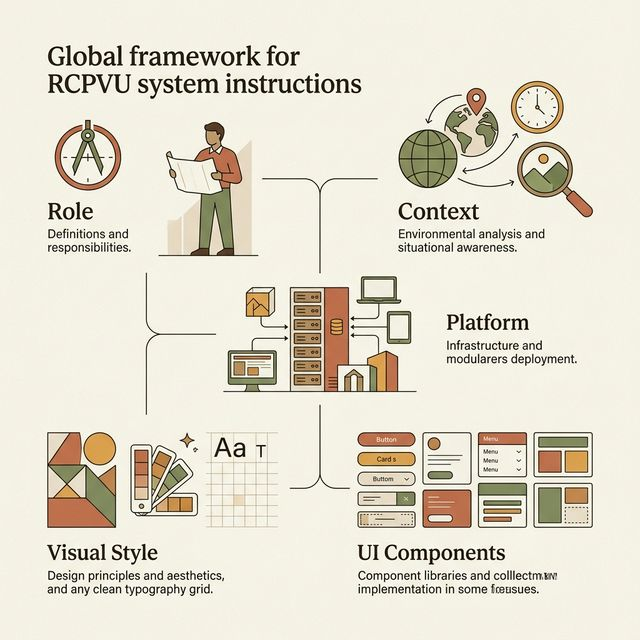
> **知识节点**: `prompt-engineering-ui`

你必须要像一个极度冷静、容不得半点沙子的偏执暴君系统架构师一样，雷打不动、按部就班地从宏观世界到微观原子世界，向 AI 下达强制性纪律：

> [VISUAL]
> **Slide**: M2-04_RCPVU_RC
> **Layout**: `Full`
> **Scene**: 放大展示 RCPVU 的前两层—— Role 与 Context 指令。
> *   **Asset**: 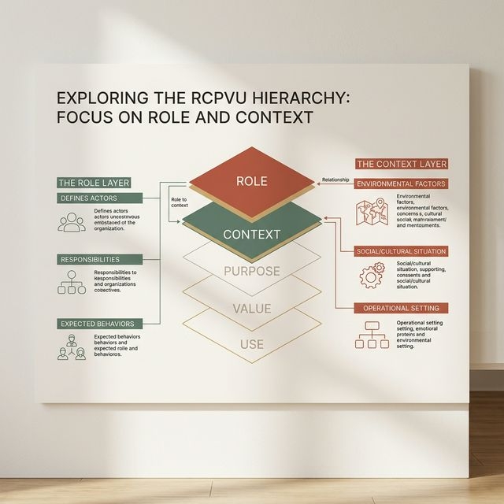
> **知识节点**: `prompt-engineering-ui`

第一层，**Role（身份劫持层）**。绝不能让 AI 保持默认助理嘴脸。起手第一句必须是洗脑覆盖：“你现在是十五年硅谷大厂经验的前端重架构工程师，代码极度严谨，绝不使用内联样式”。把你面前这张白纸模型脑中的发散知识树，果决截肢，把它的注意力（Attention）死死锁定在“高保真工程代码域”的绝对禁区。你必须以极其高傲的态度，劫持其最高人格系统。

第二层，**Context（系统逻辑设定层）**。
这是你们课程第一周到第五周一直在苦苦探索和建构的核心领域。AI 是个瞎子，它看不到你的《心智模型映射》和《目标导向路径》。你不能光说“给我做一个精美的列表”。你必须像传达顶级绝密商业情报一样宣告这套系统的骨架和呼吸频率。
看看这两个截然不同的 Context 设定，结局有着天壤之别：
- **灾难预期的 C端 Prompt**：“这是一款面向年轻人的潮流服饰电商 App，主打新奇和冲击感。不需要太多规则，放飞视觉，用大面积的破形图文和极其跳跃的不规则留白来制造氛围。” （AI 收到指令后，会立刻调动动画引擎，生成充满视差滚动和极度夸张的不规则排版页面。）
- **极其严苛的 B端 Prompt**：“这是一家面临存活转化压力的极高密度 B端金融 SaaS 系统核算工作台。用户群体是平均年龄 40 岁以上的精算师。所以，空间的极致利用、网格的绝对对齐、以及对于密集型表格数据的防误触展示，是我们绝对也是唯一的第一优先级诉求核心！请关闭一切花里胡哨的动画，使用极度克制的网格系统。”
听到了吗？这就是“定调”。没有这两百个字的 Context 纪律定调，AI 会在 B端系统里给你盲目使用极其奢侈的 C端留白和滑稽的弹性动画，瞬间摧毁这款系统的商业严肃性和信息可达性架构。

> [STORY TIME]
> **未定调的恶果：当飞行仪表盘变成娱乐大屏**
> 硅谷曾经有一家无人机初创公司，他们的业务是为农林喷洒和高压线巡检提供特种无人机监控系统。他们的实习设计师在让 v0 协助生成一套全新的无人机姿态监视屏监控端（Monitor Dashboard）时，仅仅写了：“设计一个酷炫的深色无人机操作面板，要有地图和参数表。”
> 几天后，这个由 AI 全自动生成的代码被推倒了前端环境运行。在风和日丽的办公室里，屏幕看起来像是一件来自未来的艺术品——毛玻璃材质背景、极度丝滑炫目的发光粒子线条转场，以及为了“呼吸感”而刻意缩小点击区域且间距极大的地图缩放组件。
> 但是，到了真实的户外强阳光曝晒环境，当操作员在麦田里戴着油污的手套、顶着屏幕恐怖的强光反射，试图紧急迫降一架即将失控的高速无人机时，无可挽回的灾难降临了：
> 操作员根本看不清屏幕上因为所谓追求沉浸式“高级感”而使用了极低对比度的深灰色参数文字；他戴着手套笨拙而慌乱的手指，连续六七次都无法精准点击到那个为了追求视觉隐蔽和冗余留白而收缩至仅有极小热区（Touch Target）的紧急越权接管按钮。而那个本该用于极其精细地捕捉观察高压线障碍物的超高分辨率核心航拍图传节点阵列，仅仅因为被外面包裹了一个华而不实的 3D 不变矩形反光流光效果框体限制组件，硬生生地占据了极其恐怖的内存资源并直接导致画面卡顿延迟了整整五秒之久。最终，无人机毫无悬念地一头直接轰然坠向了那处巨大的荒地，并在浓烟和火光之中彻底摔成了一堆高达三十万且无法修复抢救的悲惨焦黑废铁。
> 这是极其深重的血泪系统责任故障课。错在哪？错在人在发出指令的最初那零点几秒，由于傲慢和认知盲点，彻底遗漏和丧失了对商业核心命脉——Context 语境层（极恶劣复杂的户外强光干扰、随时高危紧急触发态、严重抗物理遮挡）的物理参数级别底座精准描述对焦锚定宣告。


> [VISUAL]
> **Slide**: M2-05_RCPVU_P
> **Layout**: `Full`
> **Scene**: 放大展示 Platform 层（技术约束）。
> *   **Asset**: 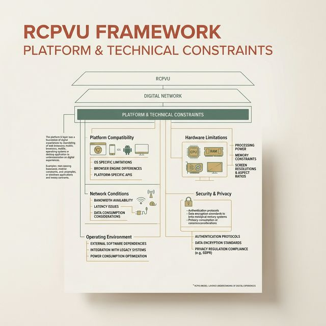
> **知识节点**: `prompt-engineering-ui`

第三层，**Platform（技术土壤层）**。在代码兵工厂，绝对不能让它去自由发挥和瞎猜技术栈！
这是决定系统能否在接下来几年内容易维护、不易崩溃的深水区。你必须以系统架构师的身份，极度精准且暴力地下发死命令：“请严格全量锁定使用 React 18 作为虚拟 DOM 骨架，配合 Tailwind CSS V3 作为全盘样式驱动底座！同时，必须且只能强制依赖于 Shadcn/ui 以及 Radix Primitives 作为无头可访问组件的底层支撑系，任何涉及到滚动和动画的逻辑只允许使用 Framer Motion！”
为什么要这么偏执？因为对于“弹窗”这样一个看似微小的组件，如果你不强势通过 Platform 约束去指定极其优秀的开源基础架构（如 Radix 的 Dialog），AI 极大的概率会用落后的手写原生层 `position: fixed` 加上极其脆弱的 `z-index` 覆盖法来交差。
这种手写弹窗在静态截图上可能看着不错，但它在工程规范上彻底破产：它不支持按键盘 ESC 键的快捷关闭，它的遮罩层无法禁止背后原生滚动条的事件穿透 (Scroll Lock 失效)，更致命的是，它根本没有为视障人士的屏幕阅读器提供任何 `aria-modal="true"` 和极其复杂的焦点陷阱环路保护 (Focus Trap)！

> [TECH NOTE]
> **深水区：开源组件骨架与无障碍防错安全网 (Focus Trap 实录)**
> 让无障碍访问基建为大局护航：在开发重度依赖键盘操作以及无障碍辅助对接的高级企业后台时，很多潜伏的危机只有资深老鸟知道。我们必须补全这个致命的常识盲点——**焦点陷阱 (Focus Trap)**。
> 当用户点开一个高悬浮警报的“严重高危不可逆警告”操作确认模态安全验证框窗体遮罩层覆盖弹窗时，如果生成系统偷工减料地使用了简单图层叠加伪装，那么问题往往极难暴露。可是，当系统熟练重度操作审计财务人员高速习惯性重重敲下键盘全区流转穿梭控制的系统内置原生热键 `Tab` 键（焦点自动位移流转切换定位捕捉抓取寻址）时，一件及其令人冷汗倒竖的悬疑破绽就会无声上演：那个系统隐形的键盘虚幻高亮焦点轮廓指示框，居然极其放肆地毫无任何阻挡防线地直接违背景深物理定律生生地一路毫无知觉地穿透了这个所谓厚重遮罩层弹窗体结构底部边界，像穿墙幽灵魅影一般直接渗透跌落到了背后被蒙版遮挡的原始原位深处页面操作控制板区之中，并且极其诡异地暗中无声锁定选中了处于极深灰色隐没区状态的一个批量资金打款静默转移下发核心按钮端口！此时如果用户毫无察觉地错误按下一个回车，甚至能够直接引发两次系统级别严重的灾难并发重发指令。
> 这就是我们为何必须用刀架在机器系统脖颈上严格指定 Platform（平台）标准底座架构的绝对且无任何商量余地的根本因果。在我们的军规里直接限定诸如 Radix UI 这些无界面基座底盘，本质不是借壳好看，而是瞬间无痛白嫖了无数最顶级老黑客通宵达旦所撰写加持的成千上万条无障碍死角保护深层代码闭环防火墙护盾，它们会在遮罩生成的极短微秒之内，极其强悍且自动将周围空气墙用代码极速锁死封闭。这构筑成了所有焦点再也无法强行翻墙越界外出而直接反弹死循环在内部囚禁的焦点囚笼，构筑了牢不可破的数据交互护栏防御阵线系统边界防护壁垒。

当你用严酷的 Platform 层下发指令时，你其实不是在写提示词，你是在一瞬间，把历经开源世界无数顶级极客锤炼过的、多达千行严密逻辑的无障碍防错安全网，以毫无接缝的“嫁接”方式，瞬间植入并移植到了你的系统体内。这就是 Platform 层的核威慑级别控制力。

> [VISUAL]
> **Slide**: M2-06_RCPVU_V_and_Tokens
> **Layout**: `Split`
> **Scene**: 左（❌业余指令）：清爽蓝色主按钮。右（✅工程法典）：主按钮底色锁定 primary-600(#2563EB)，圆角映射 radius-md(8px)，禁用态不透明度压至50%。
> *   **Asset**: 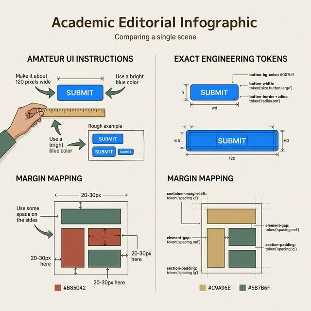
> **知识节点**: `prompt-engineering-ui`

第四层，也是决定命脉的一层，**V (Visual Style) 视觉风格纪律层**。
此阶段，可以说是彻底体现你们前两周苦战提炼出的极密高保真 Design Tokens（设计私有变量库）价值的最强决胜时刻！
你的 Design Tokens 体系，绝不仅仅是一张贴在墙上的漂亮色卡或者 Figma 设计面板里的几个样式集合。在这个新位面中，它必须进化升级为“极其强干预性的大模型可读指令字典”。
你看，哪怕是你要生成最简单的 UI 元素，你对模型的指令不再是说“做个紫色圆角大按钮”。你必须以立法者的姿态甩出一套强制性文本宪法：
```markdown
[系统强制样式定界法典字典]
当我说到“品牌警戒色” / Brand-Core-Accent 时：
- 你必须底层物理映射并且只允许输出为：`bg-[#8B5CF6]` 或使用内部代号 `bg-violet-500`。
- 不允许任何透明度衰减，除非处于“禁用态 (Disabled)”，强制要求其透明度降低至不可见的 40%，且鼠标交互指针须更替为 `cursor-not-allowed`。
当我说到“全局柔和圆角” / Global-Soft-Radius 时：
- 你必须严格调用 Tailwind 系统内的 `rounded-xl` 参数，不可越界缩放。
```
如果不向 AI 下发这本极其紧密咬合的双语对照映射词典（Mapping Table），它的底层行为就会出现严重的“认知迷茫”。它会按照它的“默认发散审美”，笨拙地强行给你写入一大段灾难性的内联样式属性集合 `style={{backgroundColor: '#8b5cf6', borderRadius: '12px'}}`。
这行看似微不足道的内联代码，就是日后搞垮整个生态的恶性架构毒瘤结节。当你极有自信地在系统后台要求全局开启“暗黑模式（Dark Mode Night Theme）”从而实施全盘降维打击瞬间，所有的标准原子类都丝滑地切入了沉浸式的黑曜石材质深色态，唯独你的紫色按钮依然极其刺眼、僵硬且无孔不入地挂在这个高颜值的暗黑页面正中央，彻底刺碎了一致性的幻觉。这就是缺乏 V 层极其铁血管控下、丧失控制权所导致的毁灭一致性的巨大数字工程悲剧。

> [VISUAL]
> **Slide**: M2-07_RCPVU_U_Components
> **Layout**: `Split`
> **Scene**: U Components 分解展示：导航头、信息阵列、控制盘。
> *   **Asset**: 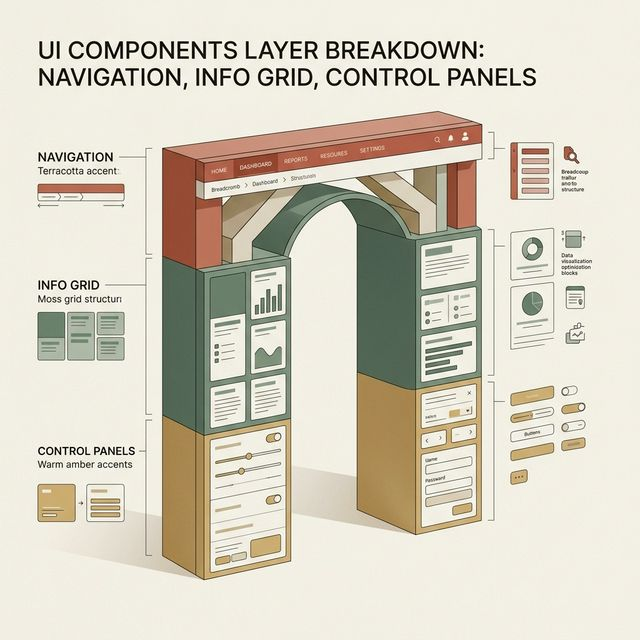
> **知识节点**: `prompt-engineering-ui`

最后一层深潜，**U（UI Components）实体构件集结册**。
带有极度防具洁癖的框架思维去告知：“于屏幕顶域满幅铺设主导大容器；左侧内嵌挂载主标志；正区铺开标准三束产品阵列卡片瀑布流”。在这极度纯净的 U 层内，抛弃感性形容词与交互行为，输出立体具备重量的物理工程拆解点位结构图指令！

> [VISUAL]
> **Slide**: M2-08_Three_Stage_Iteration_Flow
> **Layout**: `Flow`
> **Scene**: 揭示三阶段分段迭代全景推演景：Scaffold (骨架) -> Skin (皮肤) -> Interaction (交互)。
> *   **Asset**: 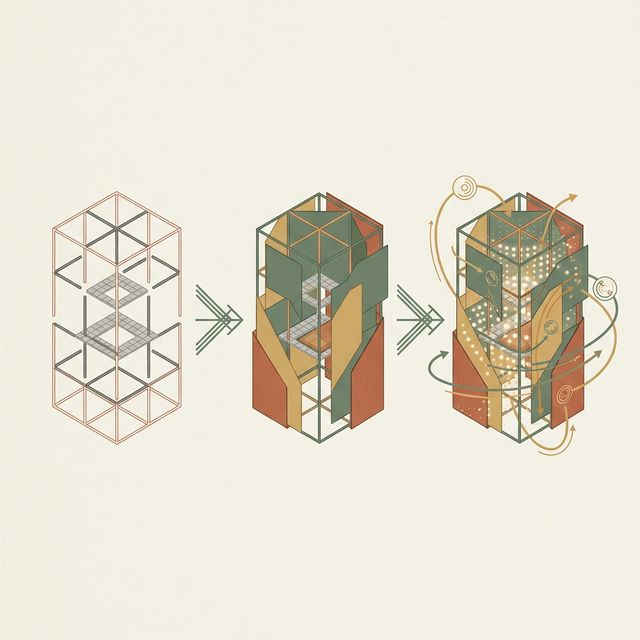
> **知识节点**: `prompt-engineering-ui`, `book-refactoring-ui`

> [STORY TIME]
> **反面教材：一波流生成的核爆惨案**
> 有些新手妄图用极其宏大几千字的混合 Prompt 完成包含架构、状态、动画所有任务的界面生成，按下回车两分钟后看似华彩极佳，但实质是“弗兰肯斯坦的怪物”。在向投资方演示遭遇随机非预期边界连击时，系统因为状态机彻底混编断裂和极度幻觉并发引发底层崩溃。这就是没有精密分段所造成的彻底坠机死难恶果代价。

想要完美降服 AI 副驾驶，别妄图单点一波流！
> [TEACHING MOMENT]
> **对抗 AI 注意力涣散的工程层解法**
> 大语言模型生成代码的翻车，其技术根源往往在于“注意力机制 (Attention Mechanism) 权重过载”。当你给出的提示词既包含了宏观三列网格布局，又涵盖了微观的紫色按钮要求，还包括了悬停时极其复杂的阴影变化时，模型的注意力权重面临撕裂。它为了去完美渲染那个高难度的紫色按钮，经常会彻底遗忘外层宏大的网格约束条件。
> 为了对抗系统的注意力涣散现象，我们需要人为实施“意图的隔离式投喂”。这就是业界资深开发者摸索出的系统性**三级精密阶梯式逼近战法**：

> [VISUAL]
> **Slide**: M2-09_Iteration_Stage_1_Scaffold
> **Layout**: `Full`
> **Scene**: 骨架期：全是一片绝对死气沉沉的黑白网格辅助线。
> *   **Asset**: 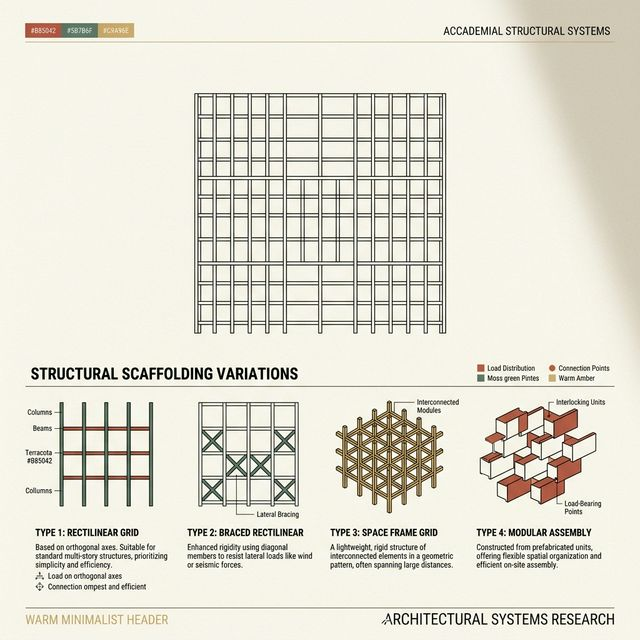
> **知识节点**: `prompt-engineering-ui`

**第一步，建立纯粹物理骨架 (Stage 1: Scaffold Build)。**
在这个拓荒期，你的心态必须转换成一位严谨的土木工程师。在此阶段，绝不要向模型提及任何色彩、虚影或情感修饰词。
你给 AI 的第一版指令应当是冰冷且具有空间坐标的：
> “系统进入 Scaffold 生成模式。当前页面是一个核心商品罗列表。
> 首先，请用原生的 `<header>` 建立顶部全局导航槽，并将其锁定为 sticky 吸顶状态。
> 其次，页面核心内容区严密拆分为 `grid-cols-3` 的标准网格系统。
> 最后，中间全部使用灰色 `bg-gray-200` 的 4:3 比例矩形占位符 (Placeholder) 来替代真实图片填充，且底部预留高对齐特征的转化引导价格标签位。”

> [LIFE CONNECT]
> **土木先行的智慧：为什么绝对不可边浇灌边刷高级漆皮？**
> 我们经常看到大量被一键生成魔法光环彻底冲昏头脑的门外汉团队，他们在极其冲动草率鲁莽的第一阶段首个发力进攻回合里，就在混杂了大量无聊堆砌辞藻的信息池中强行塞入对于色调渐变质感等极其表壳的皮肤渲染的严厉高压要求。他们自作聪明地在指令控制台满怀兴奋地敲打：“生成一套基于标准三列均分流式网格，同时保证所有的卡片边角不但拥有最极简高级圆滑灵动的磨砂透明流体圆角而且当我的系统鼠标强力滑过上面任意一块时周边必须有紫色呼吸感柔光光晕和极其丝滑的浮动！”
> 这句话简直是在挑战并公然对抗整部千锤百炼的基础工程拓扑建筑铁律常识！这种做法犹如什么？犹如极其愚蠢而绝望的施工包工头正指挥一群极其疲惫精神涣散且根本不懂系统底层地基拓扑原理逻辑的初级底层劳工队伍一边在极度高危悬空无保护网环境的钢筋架上用粗劣沙子混合作战强行暴力直接疯狂地徒手浇筑混凝土原始承重中枢柱，而另外一只手同时强迫死死拿着昂贵到发指且极其易碎的高级箔金花纹墙纸往那个依然滚烫而且布满了极度扭曲裂缝且还完全湿哒哒没任何成型结构的柱子凹凸核心表面上极其草率的生拉硬扯式的死命粘贴涂刷覆盖粉饰上。
> 为什么这是致命绝境？因为假如在极为深微处的断点重流折叠适配处出了一道哪怕最轻微最不起眼的结构暗病微隙偏差缝折——例如处于平板横流挤压极度边缘畸变临界态时商品栏目的一个细缝边缘出现了最不起眼的越界轻微排斥错位溢出——如果你披着这样一层极其花里胡哨、极其刺眼浮夸、全是厚重代码障眼法的高频过度滤镜皮肤保护色伪装时你去全库追查排故找错误！你的眼里将会塞满各种庞大的乱码光带样式干扰符号。那团在灰色原态本该一眼望到底绝对凸显无比清晰醒目立刻能定位并瞬杀修复修正纠偏的空间结构错位崩断暗伤盲从点，就这样无比隐秘且成功长长久久地瞒天过海潜伏隐蔽生存在那层精美绝伦包装纸背后那极其恶臭和空洞的地基坍塌空鼓深坑灾难之中！！

此时的画面看起来就像一座缺少粉刷的毛坯房，这恰恰是最应该呈现的纯净状态。你需要以苛刻的眼光去测试这套网格布局的抗压极限——在浏览器端不断拉扯拖拽窗口宽度，触发针对移动端、平板端的各个响应式断点 (Breakpoints)。只要地基立得稳、断点适配不产生重叠越界，你就成功越过了 Vibe Coding 最容易失败的暗礁区。

> [VISUAL]
> **Slide**: M2-10_Iteration_Stage_2_Skin
> **Layout**: `Split`
> **Scene**: 左侧是生硬灰色骨架；右侧是一场 Token 强杀覆盖执行展现血肉丰满的成品态。
> *   **Asset**: 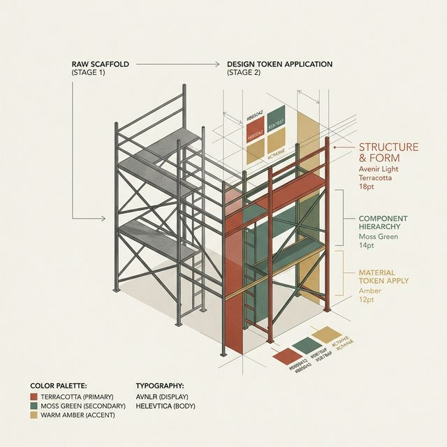
> **知识节点**: `prompt-engineering-ui`

**第二步，注入品牌系统级超级皮肤法典 (Stage 2: Token Skin Super-Injection)。**
只有确信了底层代码框架即便在不同视口分辨率下也能保持物理结构的绝对稳定，你才能启动二次生成。
现在，请隆重祭出你们团队耗费大量精力敲定的核心资产——《具有强制约束力的 Design Token 词典》。
向 AI 下达的第二道指令将全盘覆盖设计法则：
> “系统进入 Skin 皮肤渲染模式。请全盘读取并严格执行以下私有词典法则。
> 所有承担核心转化目标的按钮，必须无差别统一调用 `primary-600` 色值；
> 按钮的内嵌安全框边距，统一换防为全局标准间隙 `space-xy-4`；
> 系统全局排版字号彻底抛弃浏览器默认样式，替换为 `text-slate-800` 和无衬线 `font-inter` 字体家族。”
随着这些标准化的高维参数指令介入，那副原本灰白空洞的线框骨架，立刻产生了化学反应。它精准地继承了品牌独特的情绪基调和商业厚度，化身为一副具备高保真特性的工业级成品形态。

> [VISUAL]
> **Slide**: M2-11_Iteration_Stage_3_Interaction
> **Layout**: `Full`
> **Scene**: 光标移动至刚寂静的卡片上产生极细腻上凸位浮升，泛出阴影。
> *   **Asset**: 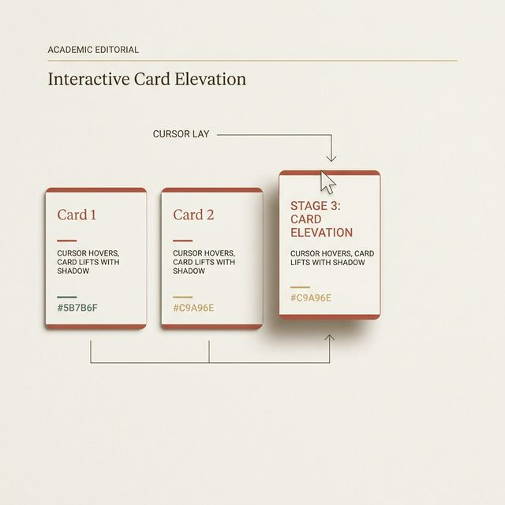
> **知识节点**: `prompt-engineering-ui`, `book-refactoring-ui`

**第三步，注入深层逻辑的微交互反馈 (Stage 3: Vitality Interaction Injection)。**
单凭静态的视觉切片无法构成完整的数字产品。你必须在最后收网阶段，调动起界面所有的微交互神经末梢反馈。
静态页面的华丽只是标本，我们需要为其赋予状态流转的生命：
> “系统启动 Interaction 注入模式。
> 要求1：当用户的指针对商品卡片发生悬停 (Hover) 动作时，卡片必须伴随 `transition-all` 属性轻盈上浮 `translate-y-[-2px]`。
> 要求2：上浮的同时，必须同步增加一层弥散阴影 `shadow-xl` 以凸显 Z 轴层级。
> 要求3：针对核心的主操作按钮，一旦捕获到点击事件处于活跃期 (Active state) 时，原本高亮的背景色必须立刻降低亮度，营造下压的触觉反馈。”
在这套分段解耦的指引下，大模型不再因信息过载而注意力迷失。它能在骨架代码上轻巧地挂载复杂的交互钩子 (Hooks) 和过渡状态类名。

这种从构建原生物理灰度骨架，到严格执行品牌专属 Token 色阶，再到编织微观行为逻辑动态反馈流的三级进阶策略，正是工程界应对大语言模型先天缺陷的最强心法结晶。它完美映射了《Refactoring UI》中倡导的硬核准则：**系统构建应当先追求结构正确性的无暇底盘，随后再去覆裹表现层与情感逻辑的血肉。**

> [PHILOSOPHY]
> **控制权的闭环：你是规则的制定者，而非规则的乞讨者**
> 这个三级阶梯式的生成策略，其深层哲学意义在于彻底重构了你和机器之间的主从关系。
> 过去很多设计师在使用 AI 生成 UI 时，心态是一种“抽盲盒式”的乞讨心态：把一堆模糊的需求扔进去，然后祈祷 AI 能施舍给你一个好看的排版。如果不好看，就再换一批形容词重新乞讨一次。
> 在 RCPVU 与三级生成法中，这种祈求被彻底抹杀。你每走一步，都在给大模型套上一层极其沉重且不可挣脱的钢铁锁链。Scaffold 锁死了空间结构，Skin 锁死了视觉基因，Interaction 锁死了行为反馈。你不再是期待它创造奇迹的被动者，而是掌握着物理生杀大权、逼迫它在这座坚不可摧的迷宫中严格按照你铺设的铁轨高效运转的绝对集权统治者。只有确立了这种剥夺其自由意志的工程控制权，我们才能将其驯化为商业级可用的超级生产力杠杆。

> [VISUAL]
> **Slide**: M2-12_Dictator_vs_Beggar
> **Layout**: `Comparison`
> **Scene**: 左侧为“乞讨者模式”：人类蒙眼盲盒抽卡，祈议 AI 吐出好代码；右侧为“系统独裁者模式”：人类用三条锁链（Scaffold、Skin、Interaction）将巨兽牢牢控制在矩阵铁轨上。
> *   **Asset**: 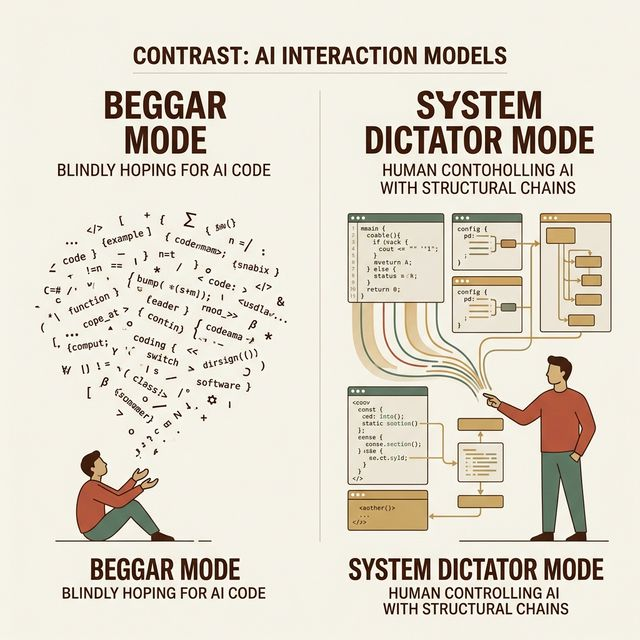
> **知识节点**: `prompt-engineering-ui`
