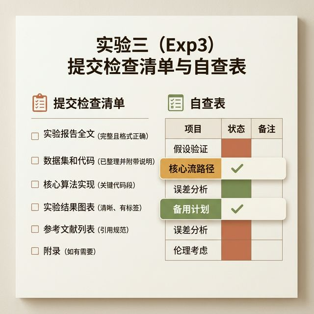

## 模块 4: 实验3(Exp3) 收尾实战准备
<!-- BUDGET: 0 chars | TYPE: activity | STATUS: exempt -->

> [VISUAL]
> *   **Slide**: `S07_Exp3_WrapUp`
> *   **Layout**: `Split`
> *   **Scene**: 实验3(Exp3) 的提交清单和自查表。重点标出"核心心流链路"和"兜底方案"。
> *   **Asset**: 
> *   **知识节点**: `ch12-prototyping`

我们的课程已接近尾声。下周，实验3(Exp3) 即将迎来正式汇报。

请各位利用今天学到的排障策略和兜底框架，重新审视你们手中的原型：

1. **核心逻辑通畅吗？** 使用 Read-Explain-Fix，把那些阻塞主流程（哪怕是主流程上的一个小分支）的代码 Bug 清理干净。
2. **保真度分布合理吗？** 再次确认你们是否采用了"垂直原型"策略，将精力集中在核心创新点，而把周边的次要页面进行降阶处理。
3. **安全网编织好了吗？** 找出全链路中"最容易出 Bug 的脆弱环节"（通常是那些逻辑复杂、组件嵌套深的地方），立刻在 Figma 中建立备用锚点。

> [ACTIVITY]
> **Type**: `Workshop`
> **Duration**: `60min`
> **Desc**: 实验3(Exp3) 状态审计与防线建设
> **执行指南**:
> 1. 学生以小组为单位，各自在设备上运行 实验3(Exp3) 最终应用。
> 2. 小组成员互相进行**极端测试**：疯狂瞎点、不按流程输入乱七八糟的数据、快速切页面。
> 3. 记录触发的"状态断裂"现象和对应的控制台报错。
> 4. 对所有出现问题的环节进行评估分流：
>    - 能快速自修的 -> 当场解决（L1）。
>    - 逻辑深度太难啃的 -> 放弃修 Bug，立刻打开 Figma，为主流程的该节点制作热补丁连线（L2）。

---

> **(Pause: 3s)**

做产品就像是走钢丝，技术故障永远存在。优秀的交互设计师不仅能画出完美的理想路径，还能优雅地铺设安全网。下周见，期待你们带着生命力的 实验3(Exp3) 汇报。
