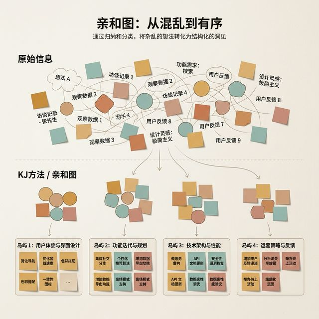
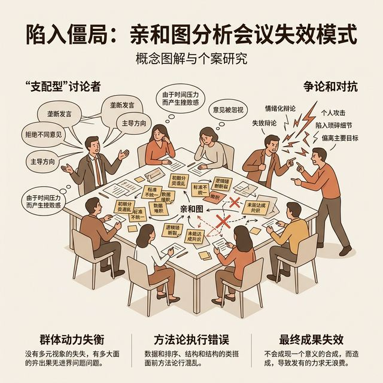
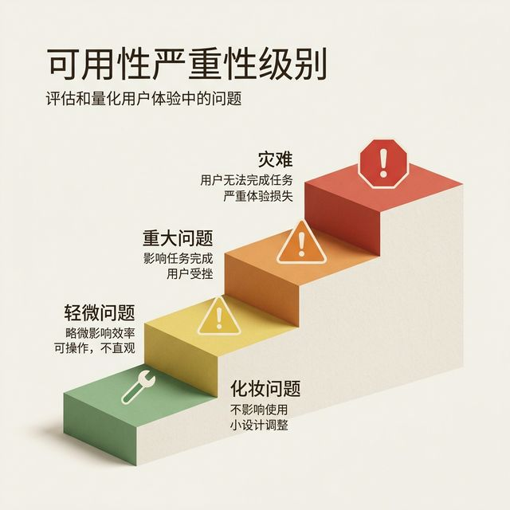
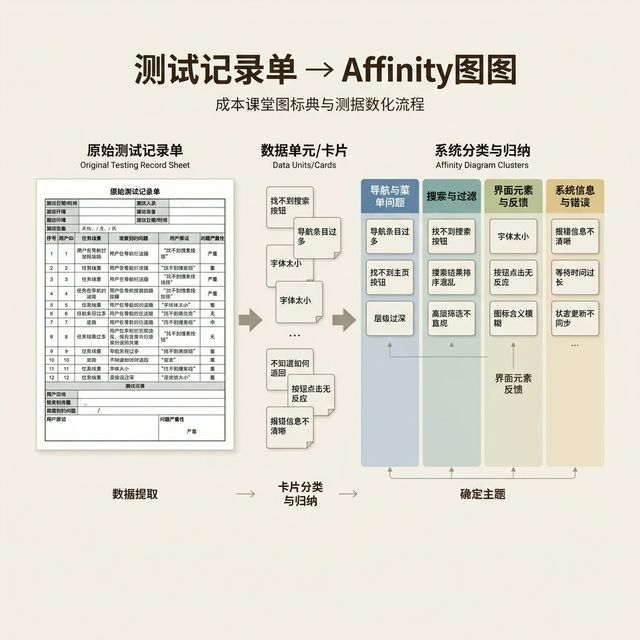
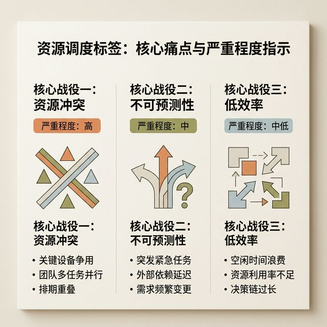

## 模块 3: 讲授(上) — 质性数据分析与严重度分级实战 (约 35 分钟)
<!-- BUDGET: 4500 chars | SLIDES: ≥8 | STATUS: done -->
<!-- MATERIAL_BUDGET: {M3: 100%} -> Hub×3，补充深度实战演练 -->

> [VISUAL]
> **Slide**: 亲和图 (Affinity Diagram) 的魔法
> **Layout**: `Full`
> **Scene**: 混乱的便签在白板上逐渐聚集成带有标题的岛屿。引出 `usability-data-analysis` 的第一步聚类。
> *   **Asset**: 

看着这些原本混乱无序的便签，在白板上像被一只无形的手推动着一样，逐渐聚拢成了几个带有明确标题特征的孤岛，这就是我们接下来要重点讲解的亲和图的归纳魔法。通过这种聚类，我们才能将散乱的抱怨转化为结构化的可用性问题节点。

> [TECH NOTE]
> **第一步：用亲和图寻找"重灾区"**

当一轮测试结束后，你和你的记录员（Note-Taker）会面对几十条甚至上百条的观察记录。
这些记录极其琐碎：
A 说："这个地址输入框好难点。"
B 说："为什么点完成之后没有提示？"
C 说："我好像点错了收货人，能在刚才那页改吗？"

各位，绝对不要对着这些单点问题一条条去改（记得我们说过的"表面修复"吗？）。我们首先要做的，是引入**亲和图 (Affinity Diagram)**，这是一种经典的质性研究归纳方法。

游戏规则很简单：
1. **拆解**：把每一个独立的问题（或完整的引用语）写在一张虚拟或实体的便利贴上。
2. **聚类**：不带任何预设的分类框架，大家盲定地把"感觉在说同一件事"的便签贴在一起。
3. **命名岛屿**：当你看到某几个便签聚拢成了一个群落，你再为这个群落命名。

> [DID YOU KNOW]
> **物理空间的魔力 vs 协作软件的陷阱**
> 
> 现在是远程协作时代，很多人喜欢直接打开 Miro 或者 FigJam 建一个虚拟白板来做亲和图。这当然很高效，也不会浪费纸张。但我依然强烈建议大家，在你们职业生涯的前几次亲和图实战中，抛弃发光的屏幕，去买两沓最便宜的黄色便利贴。
>
> 为什么？因为鼠标的拖拽是极其理性的、被束缚的高认知行为；而当五个人站立在一面巨大的白墙前，你们的视场角被彻底打开，你的余光可以捕捉到两米外的一张抱怨文案的便签，然后你的身体会自发地走过去，把它和你手里的这块颜色碎片贴在一处。这种基于人体空间移动的"具身认知（Embodied Cognition）"，能让你们对数据的感知深度提升一个量级。当你们为了争夺一块白板领地而在物理空间中互相碰撞时，那种观点的交锋是任何线上工具都无法单薄模拟的。

> [VISUAL]
> **Slide**: 行尸走肉般的群策群力：亲和图的常见死局
> **Layout**: `Split`
> **Scene**: 列出亲和图实操中的错误行为（如一个人独裁、提早分类、吵架）。
> *   **Asset**: 

正如大家在屏幕上看到的，如果组内一个人过于独裁定调，或者小组成员过早地为了预设某个分类框架而争吵不休，原本高效的亲和图就会立刻变成一场停滞且死气沉沉的闹剧，变成一种徒有其表的过场行为。

> [TECH NOTE]
> **亲和图实战的四条铁律**

刚才我们看了一个理想状态下的轻松归纳过程。但在实际的小组合作实战中，当你们整整五个人，筋疲力尽地围着一百多张密密麻麻的便签纸时，场面往往会迅速走向灾难性的失控。有的组会迅速演变成某个强势外向同学的个人"一言堂"，其他人只能默默旁观；有的组则会陷入无意义的哲学争论，甚至为了"这个便签到底该归属哪一类"这样一个细枝末节的问题，红着脸吵上整整一个多小时，导致进度完全停滞。

为了防止亲和图变成无效的过场动画，你们必须严格遵守工业界通用的**四条亲和图实战铁律**：

**铁律一：静默聚类 (Silent Sorting)**
这是所有管理学专家公认的，最违反人类直觉、但体验设计界证明最有效的一条黄金规则。在最开始的初始聚类阶段（一般是前 15 到 20 分钟左右），所有人**绝对不准说话，甚至不能用眼神施加压力**！
每个人拿到一沓记录便签，贴在墙上。然后大家同时上前，开始把相关的便签物理距离拉近。如果你看到别人把你贴的便签移走了，你**不能抗议**，你可以再把它移回来，或者找一个折中的位置。
为什么要求静默？因为它彻底消除了团队中的"声音霸权"。内向的同学和外向的同学在这一刻拥有绝对平等的物理权力。语言会产生欺骗性引导，而纯粹的静默物理空间移动则能最真实地反映每个人大脑潜意识里的心智模型相似度。

**铁律二：先聚拢，后命名 (Bottom-up, Not Top-down)**
很多新手组会犯一个致命错误：一开始就在白板顶部写上"导航问题"、"颜色问题"、"文案问题"几个大字，然后像垃圾分类一样把便签往里扔。
这**绝对不是**亲和图！这叫分类学（Taxonomy），这是一种先入为主的偏见。
亲和图的灵魂是"自下而上"（Bottom-up）。在你看到那些便签自然而然地通过聚集行为生成群落之前，你根本不应该预设任何框架。也许你以为是"导航分类的结构问题"的便签，最后和"文案描述不清"聚在了一起，形成了一个全新的岛屿："缺乏清晰的路径预期"。抛弃预设偏见，让冰冷的数据自己说话。

**铁律三：允许"孤岛"的存在 (Embrace the Loners)**
总有那么几张便签，无论你怎么费尽心思地移动，它都显得格格不入。
"我不喜欢这个绿色的背景，让我想起了股市暴跌。" ——这是一个真实的极度个人化的用户原话。
很多小组为了追求白板版面的绝对整洁，会强行把这种孤立便签塞进某个看起来稍微沾点边的岛屿中。
千万不要这么做！孤岛本身就是一种极具价值的信号。它可能是一个由于个体文化背景差异导致的极端边缘情况（Edge Case），也可能是一个被大多数人忽视的蓝海创新契机。用红色笔把它重重地圈出来，单独放在一边，或者标注为"待观察序列"（Watchlist）。保留它的独立性。

**铁律四：不以数量论英雄 (Weight ≠ Frequency)**
当你们完成一轮聚类后，可能会看到一个包含 30 张便签的巨大岛屿，和一个只有 3 张便签的微小岛屿。
很多同学会理所当然地认为，那个 30 张便签的簇就是最致命、最需要修复的头号公敌。
大错特错！包含 30 张便签的问题，可能仅仅是"这个页面的主视觉图对齐出现了几个像素的偏差"，它确实让很多具有强迫症的测试者不爽，但它并不致命（严重度仅仅是 Level 1）。而那个只有 3 张便签的微小孤岛，可能是"在支付前一秒系统彻底崩溃并清空了所有购物车数据"，虽然只有 3 个人碰巧遇到，但它是绝对毁灭性的灾难（严重度高达 Level 4）。
请牢记：亲和图只负责**挖掘和归纳定性的故障模型**，它绝不负责量化的修复优先级。优先级的生杀大权，必须交给我们在下一步要详细讲解的"审查与定级评估工具"来执行。

> [ACTIVITY]
> **Type**: `Demo`
> **Duration**: `10min`
> **Desc**: 实操：给便签命名
>
> 目标：训练从表象看本质的归纳能力。
>
> **步骤：**
> 1. 讲师在大屏上打出三张真实语录便签：
>    - "我不知道这是不是全选了"
>    - "加入购物车后怎么没反应？"
>    - "刚才那个弹窗消失得太快，我没看清写了啥。"
> 2. 讲师提问："这三个问题，如果在亲和图上聚成一组，你们会给这个组起个什么名字？"
> 3. 学生可能会说"按钮不明显"（这是表面修复思维）。
> 4. 讲师揭晓标准答案："系统状态反馈缺失（Lack of System Feedback）"。
> 5. 总结：亲和图不是用来找 Bugs 的，是用来**暴露底层心智模型断层**的。

通过这种方法，你会惊叹地发现，原来 5 个人在 10 个不同页面上遇到的 20 个不同问题，最终都指向了同一个核心设计缺陷——比如"导航层级过深"，或者"全局反馈缺失"。这就是质性归纳的力量。你找到的不再是单个的臭虫，而是隐藏在暗处的母巢。

> [VISUAL]
> **Slide**: 可用性问题的严重度量表
> **Layout**: `Split`
> **Scene**: 从轻微瑕疵到可用性灾难的四级台阶，配上对应的表情和颜色警告。
> *   **Asset**: 

请看这张分为四个层级的台阶图。从最底层的绿色轻微瑕疵，一直攀升到最顶部代表致命崩溃的红色可用性灾难级别。这就是能够帮我们理智分配研发弹药的最强武器。

> [TECH NOTE]
> **第二步：建立可用性的严重度矩阵**

找到了问题群落，接下来是决定你要投入多少弹药去修复它们。并不是所有问题都需要你通宵熬夜去改的。真实的商业环境里，研发资源永远是紧缺的。

在这里，我们必须引入**可用性严重度量表 (Usability Severity Rating)**：
- **级别 1 (Cosmetic / 微小瑕疵)**：用户迟疑了 2 秒，但自己搞定了。*（例如："这个字色有点淡，但还能看清。"）*
- **级别 2 (Minor / 次要问题)**：用户走错了路径，但最终通过撤销（Undo）或返回找回了正轨。需要增加一些认知负担，但不致命。
- **级别 3 (Major / 主要问题)**：用户极度挫败。虽然最终勉强完成，但他们发誓："以后再也不用这个破功能了。" 这会严重损害产品的留存率。
- **级别 4 (Catastrophe / 灾难问题)**：任务彻底失败，或者直接导致数据丢失、核心业务流阻断。*（例如："我刚才花了十分钟填的表单，退出去再进全没了！"）*

当你把亲和图聚类出来的群落，一一映射到这四个严重度级别上时，你就得到了一份具有极高商业操作价值的修复排期表（Backlog）。优先集火解决 3 级和 4 级的毁灭性断层。至于那些 1 级的字色调整和稍微显得不够圆滑的动画，只有在你们团队的代码完全无懈可击、进入发版前的垃圾时间时，才值得分出哪怕半个工作日去关心。

> [LIFE CONNECT]
> **用评级矩阵武装你的跨部门谈判**
>
> 你们要知道，在进入真实的研发团队后，你最大的阻力往往不是画图，而是如何说服那些极其疲惫的程序员和只看重商业指标的项目经理。当你跑过去跟开发说"这个按钮太不直观了，改一下吧"，他会用一万个理由把你怼回来："能用就行，现在没排期。"
>
> 但如果你拿着一张界限分明的评级表，用极其冷静的语调走向他："经过受控实证测试，我们在主干结算流程中发现了一个 Level 4 的致命逻辑坍塌，它导致了 30% 的新用户在最后一步产生了极度挫败的逆向撤销行为。如果不立刻阻断并修复这个缺陷，本季度的核心 GMV 转化目标将面临不可挽回的彻底流失风险。"
> 
> 相信我，当听到这句话时，整个研发部门都会立刻停下手头的工作来听你发号施令。这就是高阶交互设计师的商业权力维度——你用经过严谨清洗的真实定性反馈数据，辅以这套不可辩驳的严重度评判体系，将虚无缥缈的"美学与主观体验"，精准翻译成了产品经理和开发工程师绝对无法拒绝的"营收风险与业务盈亏"。

而这些解决 3 级和 4 级高压排雷任务的战纪，以及你运用理性逻辑体系指挥整个团队力挽狂澜重构的过程，正是你之后用来撰写那些能叩开大厂核心大门的、高级别案例展示（Case Study）的最佳燃点素材。

> [VISUAL]
> **Slide**: 深度实战：某医疗提醒 App 的亲和图阵痛
> **Layout**: `Full`
> **Scene**: 展示一个错综复杂的测试过程记录表，以及它被提取为亲和图的全过程。
> *   **Asset**: 

> [CASE STUDY]
> **当你和老奶奶坐在一起：一次真实的排障演练**

为了让大家真正掌握这段归纳逻辑，我们来看一个详尽的实战案例。

假设你们组正在研发一款面向 65 岁以上独居老人的"智能服药提醒 App"。你们信心满满地使用了市面上最流行的大字体、高对比度设计，按钮大得像块砖头。你们觉得这简直是为老龄化社会量身定制的完美工具。

然后，你们带着这个原型，去社区找了 5 位老奶奶进行了一次出声思考法测试。
以下是记录员（Note-Taker）在随后的复盘会上，抛在白板上的 5 张沾满汗水的便利贴原始数据：

*   **痛点 A (王奶奶, 68岁)**："每次它滴滴响的时候，我都会按那个写着'好'的绿框框，但我还是忘了吃药。因为它响的时候我正在厨房炒菜，手上有油，我就先按掉了，想着等下再吃，结果一炒完菜就忘了。"
*   **痛点 B (李奶奶, 72岁)**："这个界面上的'推迟 15 分钟'按钮太靠边了，我老花眼，看不太清，而且有时候按不准，常常不小心按成了旁边的'已服药'。"
*   **痛点 C (张奶奶, 67岁)**："我昨天多吃了一次降压药！因为它在下午又提醒了我一次，我看着屏幕上什么记录都没有，以为自己早上没吃，吓死我了。"
*   **痛点 D (赵奶奶, 75岁)**："它让我设置'每日三次'，但我不是按钟点吃的，我是按'早饭后、午饭后、睡觉前'吃的。它设定上午十点响，但十点我早就吃完早饭去买菜了。"
*   **痛点 E (刘奶奶, 65岁)**："那个确认吃药的按钮，点下去完全没声音，也没个带对号的图弹出来，我不知道自己到底点上了没，只好一直戳一直戳，直到屏幕卡死。"

好了，各位设计师。现在请盯着这 5 张便利贴。如果你是那种典型的菜鸟，你会怎么办？
菜鸟会启动**孤立修复模式**：
- 针对 A：把"推迟"的逻辑删掉。
- 针对 B：把"推迟 15 分钟"按钮放大，颜色变深。
- 针对 C：加个文字说明"这是最新的吃药记录"。
- 针对 D：让用户自己输入具体时间点。
- 针对 E：给按钮加个系统震动。

各位，如果你真的这么做了，你得到的将是一个缝合怪，一个补丁摞补丁的噩梦。
这就是缺乏**质性归纳**的代价。

现在，我们切换到专业工程师的**亲和图聚类 (Affinity Diagram)** 视角。
我们不要急着给解法，我们先找**心智模型断层**的母巢。

大家仔细看，痛点 A 和 C，表面上毫无关联，一个是在炒菜时点错了，一个是多吃了一次药。但如果我们将它们放在一起，它们指向了一个极度危险的底层架构问题：**"系统状态的持续可见性断裂"**。
王奶奶因为场景中断（炒菜）按掉了提醒，但系统在随后的界面里不再显示这个未完成的任务；张奶奶因为系统不支持直观的历史服药状态追溯，产生了致命的误判。这两者合并起来，我们给这个岛屿命名为：**[灾难] 跨场景状态追溯失败**。

再看痛点 B 和 E。B 是老花眼点不准，E 是点了没反馈导致系统卡死。我们把它们放在一起，命名为：**[严重] 运动控制与微交互反馈缺失**。老年人手指精确控制能力下降，不仅需要更大的热区，更需要强有力的听觉、视觉、甚至触觉的明确反馈（比如巨大的绿勾弹窗）来终止他们由于不确定而产生的疯狂连点行为。

最后看痛点 D。这完全不是界面画得好不好的问题，这是最可怕的**[致命] 概念模型与物理世界心智不匹配**。用户的心智模型是基于"生活事件"（吃完早饭）来锚定服药时间的，而你们的抽象系统是基于"绝对时间"（上午十点）来设定的。这种系统实现模型与用户心智模型的根本倒错，如果不改，这个产品就不可能被用起来。

大家看到了吗？这就叫从数据废墟中打捞真相。通过合并同类项，我们把 5 个细碎的抱怨，浓缩成了 3 个需要结构性动刀的核心战役。

> [VISUAL]
> **Slide**: 对症下药：为痛点标注严重度
> **Layout**: `Split`
> **Scene**: 引入严重度量表，对刚才的 3 个核心战役进行资源排期。
> *   **Asset**: 

结合刚才推导出的三个核心灾难模块，我们现在要把刚才严重度量表中的定级战术标签，一个个地贴在这些痛点旁侧，从而梳理出一份冷酷而高效的团队资源修复排期清单。

> [TECH NOTE]
> **排雷的优先级：严重度定级演练**

归纳完岛屿，接下来我们运用这套**漏洞分级评判工具**给它们贴上战术标签。研发资源永远不够，你必须学会残忍地排定优先级。

1. **[灾难] 跨场景状态追溯失败（痛点 A & C）**。
    - **定级：Level 4 - 可用性灾难 (Catastrophe)**。
    - **理由**：这不仅导致任务彻底失败，在医疗相关的 App 中，重复服药甚至会引发致命的医疗事故！这是悬在产品头上的达摩克利斯之剑。
    - **行动**：在发布下一个版本前**必须绝对修复**，哪怕推迟发布日期。全员扑在状态可见性的重构上。

2. **[致命] 概念模型与物理世界心智不匹配（痛点 D 早饭后 vs 上午十点）**。
    - **定级：Level 4 - 可用性灾难 (Catastrophe)**。
    - **理由**：产品根本无法融入用户的真实生活流。如果用户连时间都设不对，系统再好看也是废铁。
    - **行动**：**必须重构**。需要将设定时间的表单逻辑彻底推翻，引入以"晨起、三餐、睡前"为锚点的下拉选项系统。

3. **[严重] 运动控制与微交互反馈缺失（痛点 B & E）**。
    - **定级：Level 3 - 主要问题 (Major)**
    - **理由**：用户虽然极度挣扎，但勉强还能通过小心翼翼的操作完成任务。它增加了心智摩擦，但未造成不可逆的数据破坏。
    - **行动**：纳入本周期的核心开发待办池。放大热区，全面加入明确的微交互状态反馈（全屏绿色打钩动画配系统提示音）。

至于有没有 Level 1 (Cosmetic / 微小瑕疵) 的问题？有。比如在测试中，赵奶奶顺口提了一句："这个绿色的背景换成淡蓝色可能会好看点。"
这种问题，记在文档的最下面。只有在前面那些 Level 4 的致命大洞被堵上之后，你才可以去关心背景到底是绿色还是蓝色。

> [STORY TIME]
> **抛弃那该死的骄傲**

同学们，通过这个详尽的案例，我希望你们能深刻体会到一点：**冰冷的数据是不会骗人的，而初级设计师的骄傲是最廉价的。**

当你在原型上花费了三个星期，画了几十个精美的页面，然后被这 5 位老奶奶在半个小时内一拳击碎时，那种感觉毫无疑问是极其痛苦的。
但，正是这种推翻与重建的切肤之痛，淬炼出了一个交互设计师最核心的专业壁垒。如果你学会了用亲和图在混沌中寻找秩序，用严重度量表在恐慌中建立优先级，你就拥有了驾驭复杂业务系统的能力。你不再是一个被动执行需求的画笔，而是一个能够用数据捍卫专业准则的工程师。
