## Module 2: 前世今生——信息可视化的演进脉络 (25 分钟)
<!-- BUDGET: 3500 chars | LECTURE: 20m | ACTIVITY: 5m | SLIDES: ≥8 | STATUS: done -->

> [VISUAL]
> *   **Slide**: `S06_Evolution_Timeline`
> *   **Layout**: `Flow`
> *   **Scene**: 一幅达达主义拼贴风格的网状拓扑图（取代传统发光时间线）。暗黄色的原始洞窟壁画残片与旧式打字机的穿孔纸带交错，通过极其纤细锐利的黑色张力线束，被严密地连接到由普鲁士蓝重叠同心圆与芥末黄锐角构成的现代数据几何矩阵中。整个画面充满建构主义的非对称张力，没有任何廉价的赛博朋克光效。
> *   **Text**: "跨越万年的视觉进化：从记录生存到洞察认知"
> *   **Asset**: 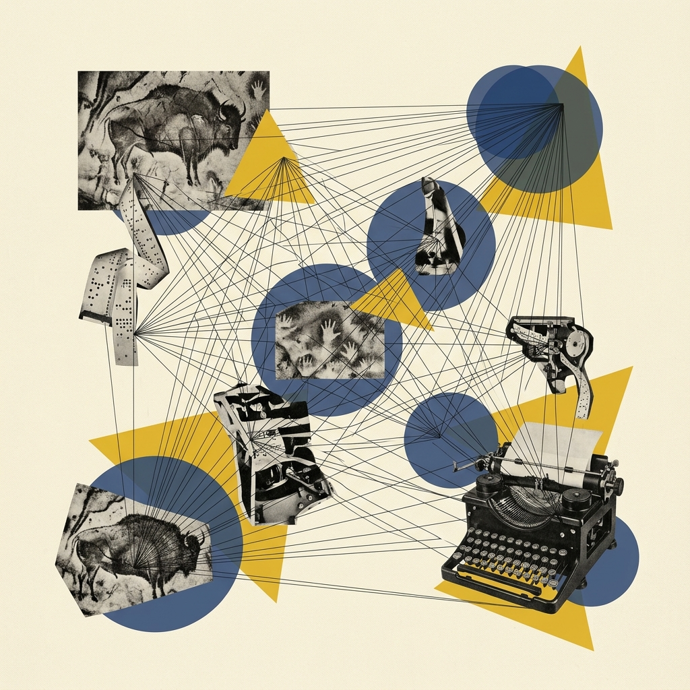

各位同学，刚才我们在上一个模块中，通过安斯库姆四重奏深刻认识到了“永远先看图”这条铁律。但这不禁让人思考：人类究竟是从什么时候开始，懂得把抽象信息画出来的呢？

信息可视化的核心，就是把抽象、复杂的信息转化为直观的视觉层级关系呈现。这听起来似乎是个非常有科技感的当代词汇，但实际上，它的发展演进几乎贯穿了整个人类的文明史。在过去，图像与文字就像一对相依为命的兄弟，难舍难分。今天，我们就一起来横向梳理一番信息可视化设计历史上的六大核心演变时代。

### 一、 远古与文字时代：信息可视化的原始通讯

> [VISUAL]
> *   **Slide**: `S07_Ancient_Recordings`
> *   **Layout**: `Split`
> *   **Scene**: 左侧昏暗火光下的洞窟壁画；右侧是早期的结绳记事与楔形文字泥板。
> *   **Text**: "原始萌芽：用视觉突破时空的通讯"
> *   **Asset**: 
>   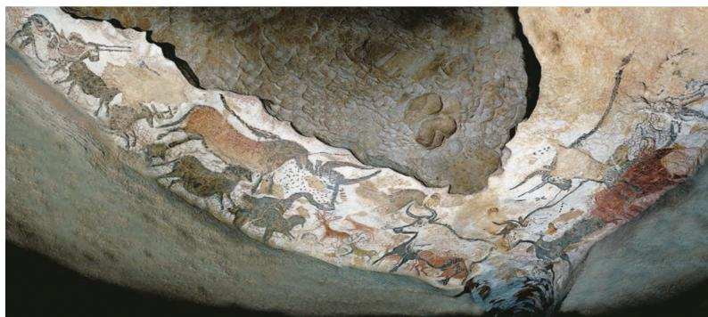

> [STORY TIME: 远古的“外置硬盘”与抽象大爆发]
> 这里我要给大家讲一个非常底层的认知革命。在没有文字的荒原时代，要想把那些攸关生死的情报传递给部落里的其他人，语言可能随风穿堂而过，但刻在石头上的画却能长久保留下来。公元前15000年的**美索不达米亚洞窟壁画**，就是由于生存需求产生的已知最早的“信息图”。这绝不是无聊时闲情逸致的涂鸦，而是在极其精准地记录周边的动物生态和生存资源分布规律。各位想象一下，面对危机四伏的大自然，这些岩石上的刻痕，实际上是大脑为了抵御肉体遗忘而强行外包出去的极早期“外置硬盘”。它是人类试图控制外部环境的第一次伟大胜利。

在这之后，人类为了摆脱时空对记忆的绝对限制，开始试图把越来越复杂的信息进行“降维压缩”。于是，**结绳记事**出现了。在很多古老文明如印加帝国中，这种被称为Quipu的结绳系统极为惊人。你们别看它只是一大堆凌乱粗糙的绳结，但它巧妙地把部落每天发生的计数清点、祭典日期、甚至隐秘的等级权力分布等极其抽象的多元社会信息，转化成了绳结的复杂数量、粗细差异与极其多样的物理编织样式。这堪称是人类文明史上一次“抽象符号化转译”能量的大爆发！

等到文字产生的前夕，公元前3800年左右，古代**伊拉克巴比伦泥板**上甚至出现了最早的微缩地图模型！古人极其聪明地用重叠的、像鱼鳞一样的半圆符号来抽象地代表起伏延绵的真实山脉。随后，无论是苏美尔的楔形文字、古埃及融合了高维宗教信仰的纸莎草图像，还是中国殷商时期用来通灵占卜、记录王朝战象运势的甲骨文的诞生，都意味着一个划时代的飞跃：高度抽象与隐喻的视觉符号语言，彻底奠定了信息可视化的最底层符号学基石！这也无可辩驳地证实了那句话——人类这个物种，生来就具有用图形去极客般拆解和表达客观世界的可怕潜能！

### 二、 地图时代：系统化的空间降维与丈量

> [PHILOSOPHY: 神权、皇权与上帝视角测绘]
> 为什么古代统治者那么痴迷于画地图？因为这是一种将未知的恐惧降维成桌面上可控沙盘的“上帝视角的绝对权力”。当你在纸面上能精准定位一座山脉、一条河流时，你在意识里就已经征服了它。

> [VISUAL]
> *   **Slide**: `S08_Map_Era_Ming`
> *   **Layout**: `Full`
> *   **Scene**: 明朝的巨无霸《大明混一图》。
> *   **Text**: "地图时代：空间降维的艺术与神权"
> *   **Asset**: 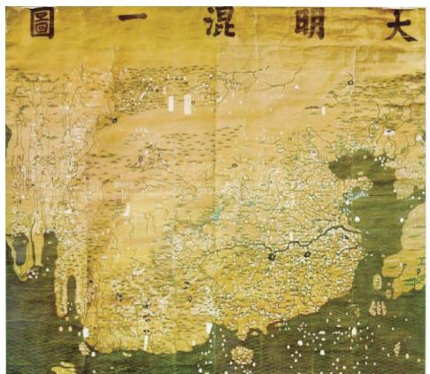

第二次跃进，也是真正意义上的信息可视化雏形，是地图时代的设计跃升。这标志着可视化进入了第一个真正的“系统化设计”阶段。从本质上说，地图是基于数学思维，强行在平面上进行的梳理和符号缩绘。

我们把目光放到中国。中国西汉出土的**马王堆汉墓古地图**，竟然极其超前地在绢帛上精准描绘了深平防区的驻军防线。到了宋明两代，依托当时发达的文明，**《九州山川实证总图》**不仅利用了雕版印刷进行大规模的信息传播，明朝画出的巨无霸**《大明混一图》**更是当时已知尺寸最大、年代最久远的世界概览地图！

> [VISUAL]
> *   **Slide**: `S08_Map_Era_Ptolemy`
> *   **Layout**: `Full`
> *   **Scene**: 意大利出版的《托勒密地图集》中的“托勒密扇子”。
> *   **Text**: "托勒密扇子地图：坐标与上帝视角的统治感"
> *   **Asset**: 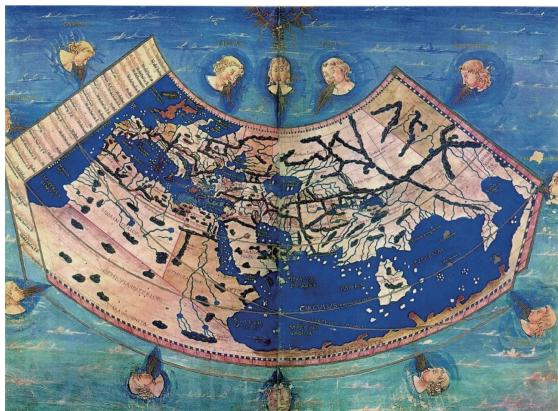

而回到西方视角的同一时期，我们能直观看到神权、科学与数学的极端碰撞。公元2世纪，古希腊的克劳狄乌斯·托勒密就极其疯狂地首创了投影法（也就是著名的**托勒密扇子地图**），他将严谨的精密制图学与鸟瞰图彻底剥离，用刻度的罗盘赋予了地图上帝视角的统治感。

> [VISUAL]
> *   **Slide**: `S08_Map_Era_Religion`
> *   **Layout**: `Full`
> *   **Scene**: 中世纪九重天宇宙观插图，由众多同心内嵌圆环组成。
> *   **Text**: "中世纪：被教会规范框定的宇宙模型"
> *   **Asset**: 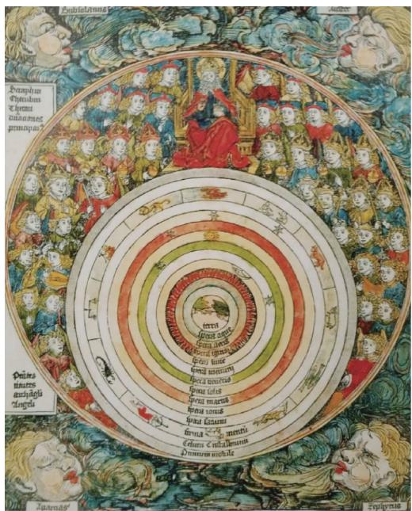

但在随后的中世纪神权统治时代，地图更是反映了当时人们被教会规范框定的宇宙观。1506年那种“九重天宇宙地图”，用一层裹着一层的圆环系统地把地球、水、太阳和天使的九层天堂包裹起来，这种极具象征意味的可视化表达，直击教徒的灵魂认知。

> [VISUAL]
> *   **Slide**: `S08_Map_Era_DaVinci`
> *   **Layout**: `Full`
> *   **Scene**: 达·芬奇的伊莫拉城镇平面草图。
> *   **Text**: "达·芬奇的降维打击：几何罗盘分割城镇"
> *   **Asset**: 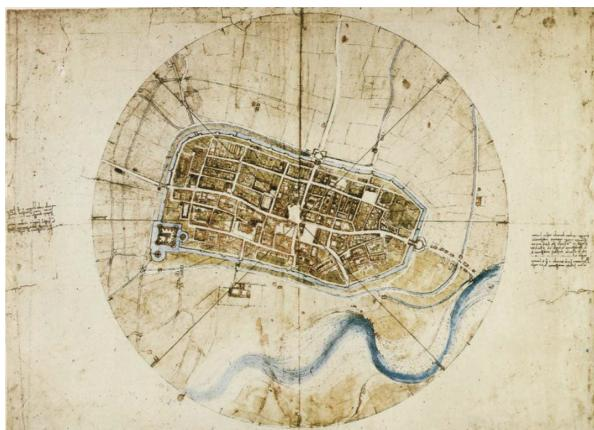

不过一旦走出中世纪的阴霾，科学的曙光再次觉醒。你们看看图上那张有着极客味道的地图：文艺复兴时期，作为跨界狂人的**达·芬奇**运用他超高阶的数学大脑，画出了著名的**伊莫拉城镇草图**。这张图简直让人头皮发麻——他直接用放射状对角线和几何罗盘坐标系统，把一个错综复杂的城镇进行了精确方位的无情等距分割！这个时候的可视化早已不是什么风花雪月的写生，而是融合了投影、坐标、比例尺缩放等硬核数学逻辑的严密设计系统，让人能够彻底超越肉眼，以神明的量尺去丈量空间。

---

进入 15 至 19 世纪，随着博物学与百科学的爆炸式发展，人类的探索野心不仅限于丈量平面的领土大小，更要解剖大自然内部的层级关系与各种制造工艺。这催生了极高信息密度的**科学插画与系统控制树**。

> [VISUAL]
> *   **Slide**: `S08b_Scientific_Humboldt`
> *   **Layout**: `Full`
> *   **Scene**: 洪堡的钦博拉索火山剖面挂图。
> *   **Text**: "百科时代的降维：洪堡与钦博拉索火山"
> *   **Asset**: 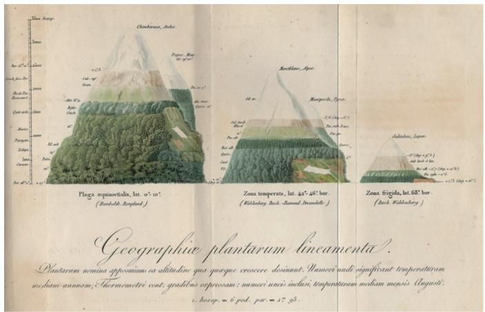

首先，我们绝对不能被西方独占专美。中国明代李时珍《本草纲目》的“目随纲举”检索模式，以及宋应星被誉为“17世纪工艺百科全书”的**《天工开物》**，用科学严谨的插图记录了农业、陶瓷、纺织等生产技术。在那漫长没有照相机的硬核手工业年代，这是针对广大不识字工匠进行信息播种的最猛烈手段。

到了西方，迎来了伟大的探险家**亚历山大·冯·洪堡（Alexander von Humboldt）**。正如你们在幻灯片中看到的那样，他在 1805 年实地考察绘制了厄瓜多尔的《钦博拉索火山植被分布图》。这绝不是一幅让人陶冶情操的风景画，而是一张极度硬核的多维横截面数据挂图！洪堡极具创见地把山体“劈开”，在垂直切面的不同等高线上，不仅标明了植被分布带，还把极其非直观的温度与气压参数全部揉合在同一个物理空间。他开创了用几何透视暴力承载多维大数据的制图先河。

> [VISUAL]
> *   **Slide**: `S08b_Scientific_Haeckel`
> *   **Layout**: `Full`
> *   **Scene**: 恩斯特·海克尔绘制的生物进化树状图。
> *   **Text**: "生命网络：复杂网络的拓扑降维"
> *   **Asset**: 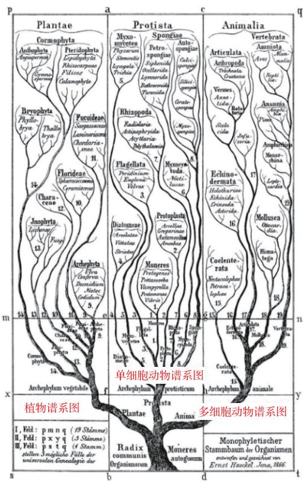

其次，看这张让人眩晕的复杂网络——德国动物学家**恩斯特·海克尔（Ernst Haeckel）设计的《生物进化树状图》**。面对着数千万年乱如麻的物种演化联系，他用一棵大树的开叉分支，完美降维。通过树状结构的控制逻辑，抽象的时间与血缘亲缘，被转化成一张严密拓扑关系结构网。诸位，请深深鞠躬，因为这就是如今你们使用的所有操作系统中“文件树目录结构”的最古老本源！甚至《自然的艺术形式》中他手绘的那些放射虫骨骼，也让我们洞见了自然界最完美的对称法则。

第四章 数据图形学前夜的闪耀：让统计数字自己发声

经历了百科全书和动植物分类的时代，我们终于跨入了近代的黄金里程碑：大数据的图表化直接呈现。在这个时期，设计师不再画山画水，他们开始让隐藏在数字背后的社会、经济与战争真相，用最刺眼的方式“脱影而出”。

这个时代群星璀璨，比如首创极具实验性的克里斯托弗·沙纳尔太阳运行图，再比如约翰·兰伯特那张像金字塔一样的色块人口分布图。但最必须被铭记的是以下这三尊大神：

> [VISUAL]
> *   **Slide**: `S09_Data_Graphics_Playfair`
> *   **Layout**: `Full`
> *   **Scene**: 普莱费尔的折线跌宕图。
> *   **Text**: "数据图形学发端：普莱费尔的线图"
> *   **Asset**: 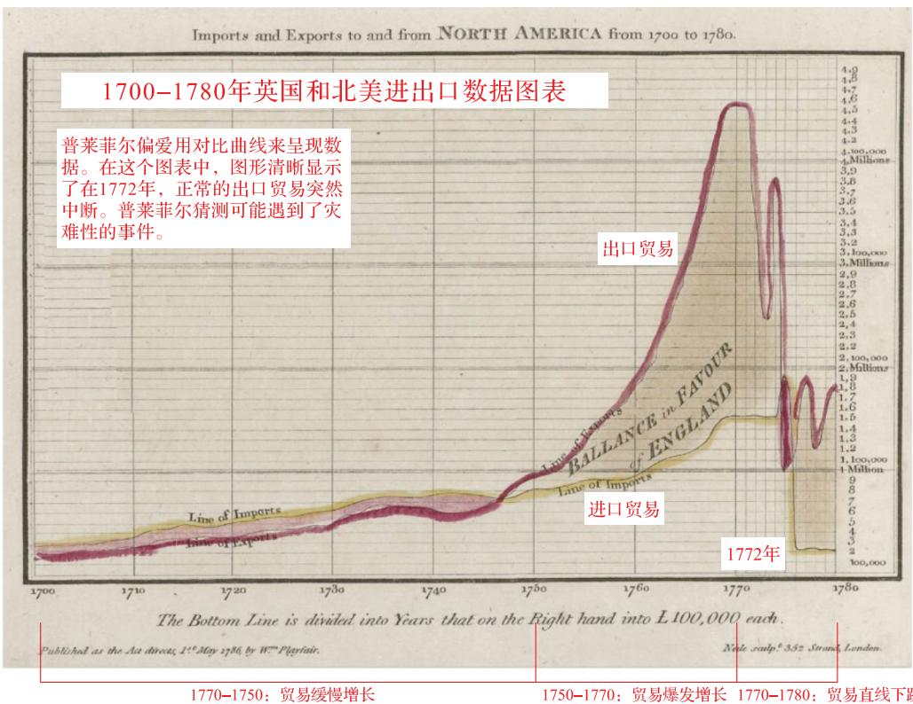

1. 现代宏观数据统计图鼻祖——**威廉·普莱费尔（William Playfair）**。在18世纪，他第一个极其天才地发明了“折线跌宕图”和切分蛋糕的“饼图（Pie Chart）”。他把多年密密麻麻的英国经济数据直接转成曲线拉升和跳水的视觉冲击力。时间不再是钟表的刻度，时间第一次变成了坐标轴上一条连绵不绝的线！

> [VISUAL]
> *   **Slide**: `S09_Data_Graphics_Nightingale`
> *   **Layout**: `Full`
> *   **Scene**: 南丁格尔由于极高视觉密度的“玫瑰图”，使用建构主义极简与高对比色彩渲染出公共卫生数据的震撼力量。
> *   **Text**: "绝望与嘲讽：南丁格尔玫瑰图中的红蓝之差"
> *   **Asset**: 

2. 然后是**南丁格尔（Florence Nightingale）带来的极坐标玫瑰图**！在这张极具视觉冲击力的图中，她用巨大刺眼的深蓝色区块代表克里米亚前线“由于糟糕预防措施引起的传染病非正常死亡大面积人数”，而用极少面积的正红色代表“火线拼刺真刀真枪牺牲的人数”。这巨大的颜色反差充满了绝望与嘲讽，这幅图绝杀说服了当时的维多利亚女王，直接促发了英国整套现代随军医疗制度的诞生，也挽救了数十万无辜性命的不必要流失。这就是可视化武器推动人类重大公共卫生改革的最著名战役。

> [VISUAL]
> *   **Slide**: `S09_Data_Graphics_Minard`
> *   **Layout**: `Full`
> *   **Scene**: 米纳德惨烈的拿破仑东征降温曲线图。重点圈出红蓝图例。
> *   **Text**: "数据图形学的巅峰：米纳德与拿破仑东征"
> *   **Asset**: 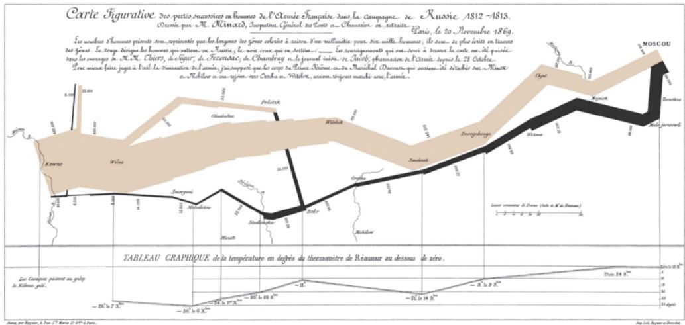

3. 最后，是**查尔斯·米纳德（Charles Minard）的拿破仑东征绝命图**。各位，它被世人以及信息学家爱德华·塔夫特尊称为“迄今为止最好、最佳且最难超越的极大统计全景图”。这绝不是虚夸的奉承词！为什么？我们来亲自解码。

> [ACTIVITY]
> *   **Type**: `QA`
> *   **Duration**: `5min`
> *   **Desc**: **变量极限解构实录：解剖米纳德的 6 维东征悲歌**
>     向学生全屏大投影展示这张米纳德东征图中法军全灭的凄惨画面。这既是一张历史地图，又是一张冰冷残酷的统计图。
>     **教师互动提问**：“各位同学，请大家仔细盯着这张看似仅仅是静态平面图纸的旧图。在没有电脑、没有高维渲染硬件的 1861 年，你们来猜一猜，米纳德到底在这几根线条里，同时塞进了几个维度的并行数据变量？”
>     **揭穿谜底答案**：整整 6 个高阶变量被死死地压平在一张纸上！大家看，线条主干从极粗的四十万人变成最后极细的一万人的那个大棕块，代表【存活军队折损人数】；起伏横平贴合在背后的无形网格代表真实【地理经纬度跨越系统】；不同路线颜色，去时棕色来时黑色，代表【撤军和进攻的阵营情绪方向】；底下突然冒出的极底冷酷参差不齐锯齿图代表【零下致命的寒流气温剧烈陡降跌落变化】；再辅以辅线节点上极小的每一个【冷酷的时间原点印记】作为引证；最后还有整个部队【行进的分支路线和汇流地点】。
>
> 真正的大师，不需要炫技的3D系统，只需要薄薄一张纸，就摧毁并彻底降维了千言万语难以言清的磅礴长史。拿破仑是不可一世的战神，但在这张图里，米纳德用数据告诉我们：打败战神拿破仑的不是俄国人，而是沿途极其可怕的饥寒交迫、疾病与不可抗拒的严冬！这就是数据的悲悯。这就是设计带来的绝对洞察力！
> 
> [!tip] 🎯 **素质锚点**：
> 在这里，技术完全退到了幕后，图表不再是冰冷的数字罗列，而是深刻展现了人类战争的残酷代价与苦难。通过这张图我们看到了**信息可视化极度强大的人文关怀与社会责任价值**——设计师不是机器，我们首先要是充满同情心的“人”。这也是我们后续课程中要求大家去挖掘社会议题、关注弱势群体数据时必须恪守的核心底线。

### 五、 新视觉语言拓展：拓扑与符号的绝对控制系统

20 世纪伴随着工业的大繁荣与跨国交通的爆发，图表界迎来了突破不同母语障碍的重大需求痛点：信息必须高度普适化、跨国界！

> [VISUAL]
> *   **Slide**: `S09b_Isotype`
> *   **Layout**: `Full`
> *   **Scene**: 粗线条小人极简 Isotype 海报。
> *   **Text**: "通用视觉语言：Isotype 与信息的极致提纯"
> *   **Asset**: 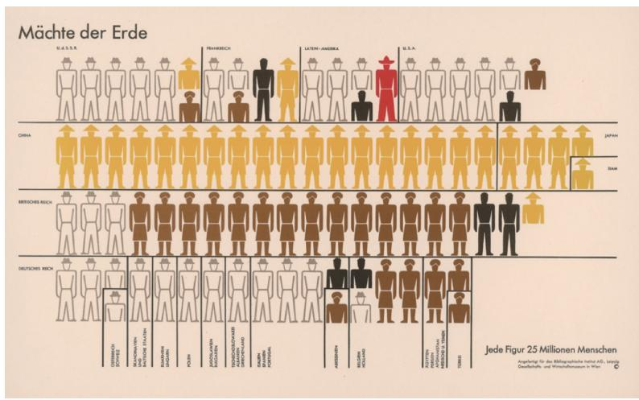

看这第一张图。1925 年，社会学家**奥托·纽拉特（Otto Neurath）**设计出了奠定今天 UI 体系基石的 **Isotype（伊索体系/通用视觉语言符号系统）**。相比过去的绘画，它极其暴力地把真实场景压缩成了无阴影的纯色轮廓小人。在后来著名的《动物们能够活多久？》图表中，他摒弃了长篇累牍的数据表，只用一排排萌态动物图标就能让人秒懂。这就是今天你在所有手机 APP 中看到的“通用 Icon”的无上祖师。它做到了极致的信息提纯。

> [VISUAL]
> *   **Slide**: `S09b_Topology_Beck`
> *   **Layout**: `Full`
> *   **Scene**: 哈里·贝克画的水平垂直 45 度交错的电路板版伦敦地铁图。
> *   **Text**: "拓扑降维法则：伦敦地铁交通地图的突破"
> *   **Asset**: 

再看这让人亲切的地图。1931 年，工程师**哈里·贝克（Harry Beck）**重绘了乱成一团的伦敦地铁大图。贝克当机立断，**彻底切断并抛弃了路线必须符合真实世界地理长短的陈规旧习**！他强行把弯曲轨道像精密电子主板一样拉直，限制在垂直、水平与 45 度对角方向。这是一个极其狂妄且伟大的创举。他死抓并显化了交通网络最核心的本质——【站点之间的拓扑穿插次序】，完全忽略真实距离。今天不管你用的是北京地铁图还是东京路线规划，乃至苹果/谷歌地图，底层全部在沿用这套逻辑：**去形留神**！

### 六、 大数据与未来互动纪元：用身体感知的海量媒介流

> [VISUAL]
> *   **Slide**: `S10_Big_Data_Interaction`
> *   **Layout**: `Center`
> *   **Scene**: 用户正站在巨大的全沉浸互动数据大屏前（比如新加坡降雨量热图与交通网叠加的荧光屏），进行沉浸式的数据控制。
> *   **Text**: "大数据叙事：从旁观者变成数据的操控者"
> *   **Asset**: 
>   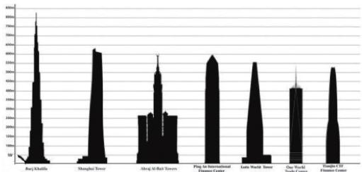

最后，千百年来被限制在静态纸张二维极限的可视化，终于在 21 世纪迎来了由超级计算彻底驱动的大数据（Big Data）大爆炸纪元。大家知道现代大数据具有非常著名的“5V”特征吗？它们分别是：Volume（数据体量巨大）、Velocity（处理速度极快且动态）、Variety（数据类型繁多且非结构化）、Value（商业价值极高但密度极低）、以及 Veracity（真实性和准确性问题）。面对这种排山倒海般的动态数据洪流，传统的用笔和尺子画折线图的方式已经直接瘫痪失效了。这就逼迫着设计师必须拿起全新的“数字魔杖”。我们怎么应对？来看看我们现在拥有的大杀器：

1. **交互式叙事与社会分析**：就像麻省理工感知实验室做的著名项目 **“居住在新加坡 (Live in Singapore)”**，它通过降雨的数据叠加出租车的载客轨迹，你可以直接在一张图上“滑动”时间轴，亲眼看着下雨时全城车辆如何涌动。这就是现代的交互！甚至像 MOMA 建筑那样的交互广告，用户可以随意点击楼宇了解其建筑设计风格，观众直接变成了数据的“操作者”和“局中人”。
2. **AI 生成与 Vibe Coding 的破局**：在未来也是大家要掌握的核心，借助零门槛的大模型自然语言，哪怕你不会写一万行代码，也能直接召唤超级引擎渲染出华美的三维互动宇宙图！图形从此跳出了死板的画板，成为了会随心意生长的数字魔法。

纵观万年来的这六大沧桑剧变，最迷人的底色始终如一：**人类在不竭发力运用最为直观洗练的视觉去反抗世界的混沌，用名叫“极其降维”与“高度复现”的重塑法则，建立上帝视角的绝对掌握感。**

这既是前世今生，那究竟是因为什么机制，让人脑对图形如此痴迷，而对文字如此抗拒？千万不要眨眼，因为接下来最硬核的底层解码战役——**大脑外挂：全视觉神经生理机制的极核拆解**马上发兵！请各位做好脑力全开的准备！

---
