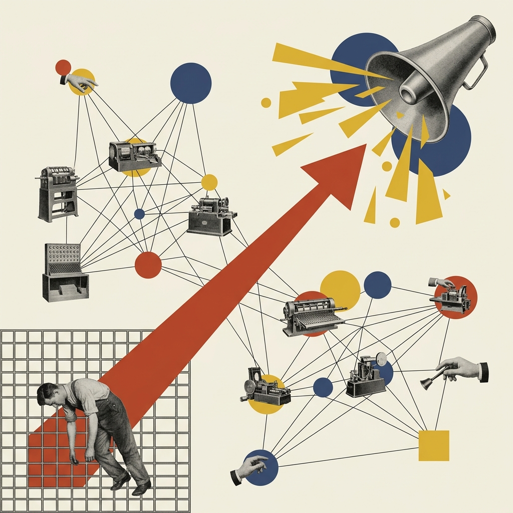
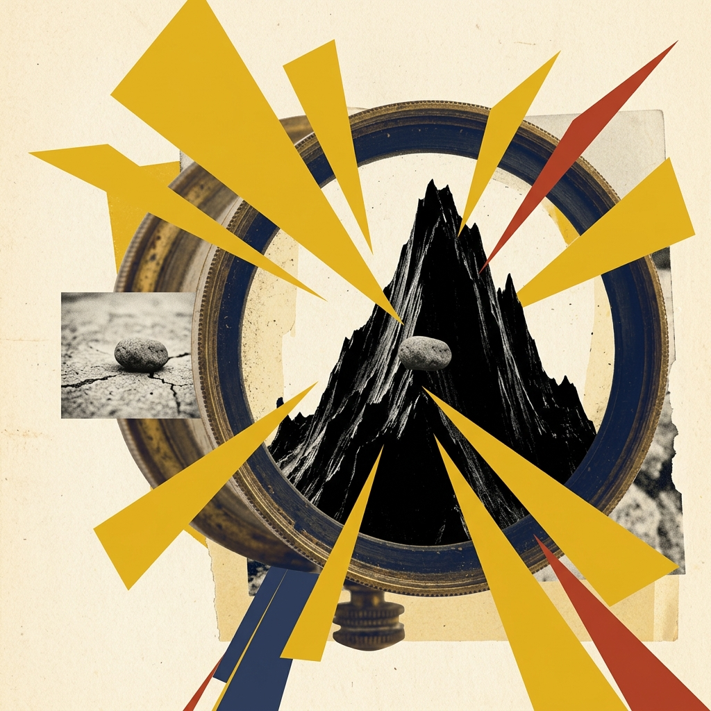
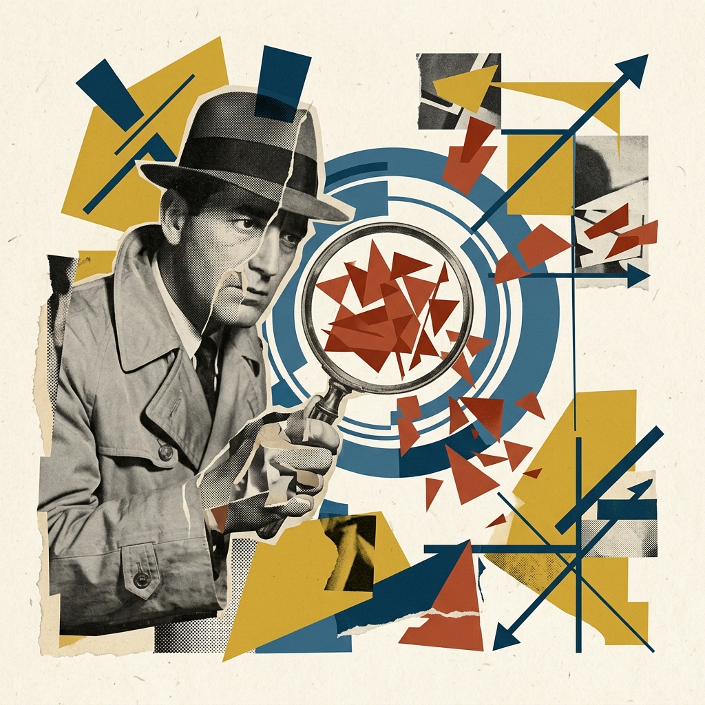

## Module 5: 范式革命——Vibe Coding 与生成的艺术 (20 分钟)
<!-- BUDGET: 3600 chars | LECTURE: 20m | ACTIVITY: 0m | SLIDES: ≥5 | STATUS: done -->

> [TEACHING MOMENT]
> 本模块是从理论过渡到实战落地的桥梁。核心逻辑：为什么做图难（设计空间太大）→ 为什么变快了（AI 极速生成扩展了空间）→ 为什么更危险了（AI 的数据失真幻觉与误导）。最后通过强任务驱动的 Activity，让学生体验并建立审查代码和图表的批判性思维。

> [VISUAL]
> *   **Slide**: `S17_Design_Space`
> *   **Layout**: `Split`
> *   **Scene**: 表现“深海寻宝”与“设计搜索空间”的折叠。将一张1920年代老式深海潜水服的复古黑白剪贴画倒置，四周被极具侵略性的锐角黄色三角形和混乱的黑色交叉射线猛烈切割（代表庞大混乱的可能空间）。向下方收缩时，潜水员被几根紧绷的黑直线牵引，落入底部一组沉稳封闭的普鲁士蓝色同心圆中，圆心禁锢着一个平庸破旧的老式贝壳或怀表剪影（妥协解）。
> *   **Text**: "深海寻宝：深不可测的设计搜索空间"
> *   **List**:
>     - "**1. 可能空间**: 浩瀚汪洋，客观存在的所有视觉可能性总和。"
>     - "**2. 知识空间**: 你的潜艇级别（受限于你目前掌握的代码能力工具，被锁死在浅海）。"
>     - "**3. 备选空间**: 氧气即将耗尽（死线逼近），你无力瞎逛，只真实去测试了 3 块礁石（候选短名单）。"
>     - "**4. 选定方案**: 最终向上交付的结果。前两块礁石（方案）报错崩了，只能被迫拿最后一块平庸贝壳交差。"
> *   **Asset**: 

[知识源: Munzner §1.11 L160-173 完全详解扩展]

同学们，前三个模块我们从生理结构讲到了心智认知。我们明白了大脑总在寻找规律的偷懒本能。现在我们要面对一个残酷的实战问题：当你拿到一份复杂的数据集，怎样才能做出一张能深刻震撼客户的商业可视化报表？

为了解释这个痛点，加拿大不列颠哥伦比亚大学的 Tamara Munzner 教授，向我们抛出了一个极具洞察力的理论——**设计搜索空间 (Design Search Space)**。

高级数据可视化之所以困难，是因为当你面对无数种图表类型、映射通道、色彩交互的组合时，你就像是面对着一片深不见底的汪洋大海。要在这个庞大的“设计搜索空间”里找到最优解，无异于**深海寻宝**。请看屏幕右侧这个极速收缩的“倒漏斗”模型：

*   **1. 可能空间 (Possible Space)**：整片太平洋，即世界上客观存在的所有视觉编码的组合总和。这片海域广袤无垠，但绝大多数区域是充满“剧毒”的海沟——比如那些严重违背人类生理直觉的糟糕组合。
*   **2. 知识空间 (Knowledge Space)**：你驾驶的“潜水艇”硬件级别，本质是指**你个人当前掌握的工具和理论边界**。如果我们掌握的技术不全面，这就犹如开着一艘劣质潜艇，庞大的可能空间瞬间对你关上了大门，下潜深度被锁死，你只能在毫无惊喜的浅海水域打转。
*   **3. 备选空间 (Considered Options)**：这不是指别人给你的建议，而是指**在死线逼近时，你实际去敲代码测试和评估的“短名单 (Shortlist)”**。你的能力范围内原本也有不少画法，但随着氧气即将耗尽（项目截止时间逼近），面对满屏报错的急迫感，你根本没时间遍历，只能匆忙游到离你最近的 3 块礁石旁试探（比如你今晚只来得及尝试写条形图、折线图和散点图 3 种方案）。
*   **4. 选定方案 (Selected Solution)**：这是**最终向上级交付的结果**。在你试探的那 3 块礁石（备选方案）里，有 2 种画法的代码死活跑不通报错了，为了明早不交白卷，你被迫抓起第 3 块礁石上那个毫无惊喜但起码没报错的普通贝壳仓皇出水——这就是你无可奈何接受的平庸妥协解。

> [PHILOSOPHY: 认知科学奠基者赫伯特·西蒙的“有限理性”]
> 这一现象，被诺贝尔奖得主、认知科学家赫伯特·西蒙 (Herbert Simon) 精准概括为**“有限理性 (Bounded Rationality)”**。西蒙指出，人类在面临决策时，我们的**信息是残缺的、大脑的认知计算能力是受限的、时间是紧迫的**。因此，人类根本无法像上帝一样遍历整个汪洋去寻找那个极致完美的“最优解 (Optimal Solution)”。相反，我们只能四处碰壁，一旦摸到一个刚好及格的方案，就会立马接受这个“满意解 (Satisficing)”。

> [VISUAL]
> *   **Slide**: `S17b_Bounded_Rationality_Philosophy`
> *   **Layout**: `Flow`
> *   **Scene**: 康定斯基与达达主义的“有限理性”重构。一侧是厚重的1920年代仰望天空的天文学家黑白剪影，被一根粗粝且充满张力的黑色横线死死压制。横线之上是海量相互切割的锐角黄色三角形（混乱的无限可能）；横线之下，几束紧绷的垂直弦线（时间紧迫下的测试）无可奈何地将视线拉扯至画幅最底端，那里只有一个沉郁死板的黑色矩形，其中拼贴着一张毫无生气的砖块老照片。
> *   **Text**: "形体心理学折射：内在探索与现实重力的妥协"
> *   **Asset**: 

同学们，明白了吗？大家过去常常做不出惊艳的图表，**从来就不是因为你的美学感知不够高级！** 而是因为你这具凡人肉身和过去极其低效的“手写代码”生产方式，从物理层面把你的探索能力彻底卡死了！

如果想打破“有限理性”的枷锁去寻觅深海真正的宝藏，唯一的办法，就是派出几百台不知疲倦的 AI 无人潜航器（也就是大模型），让它们在三十秒内并行扫描整片汪洋，捞出几十种高质量的完美方案端到你的甲板上，然后由你来做最终的主观“选美”决策。这就是我们要讲述的下一个议题——Vibe Coding 带来的范式革命。

> [VISUAL]
> *   **Slide**: `S18_Software_Evolution`
> *   **Layout**: `Flow`
> *   **Scene**: 表现软件工程的范式进化与 Vibe Coding。左下角是1920年代装配线上疲惫工人的黑白旧照，被沉闷的网格限制；一根锐利且巨大的砖红色斜向对角线如同弹弓般跨越画面，指向右上角悬浮的一把巨大复古扩音器。扩音器中喷涌出大量充满活力的芥末黄几何块和普鲁士蓝重叠圆（代表自然语言释放的生成魔力），极度不对称的构图。
> *   **Text**: "Vibe Coding：极速探索设计空间的神奇魔法"
> *   **Search**: `Software 2.0 Andrej Karpathy definition history LLM software 3.0 code shift paradigm timeline`
> *   **Asset**: 

[知识源: vibe-coding-paradigm 最新前沿调研 2025]

这正是这两年发生的颠覆性效率革命——**Vibe Coding（直觉编程）** 方法论。

这是前 OpenAI 研究员 Andrej Karpathy 提出的核心概念，它本质上是对抗“深不可测的搜索空间”的最佳武器。在过去，程序员必须“逐行控制代码的显式逻辑”；而在 Vibe Coding 的语境下，你不再需要去死记硬背枯燥的 D3.js API 或者是繁琐的 ECharts 配置项，你是通过“自然语言的意图表达（提示词）”与 AI 大模型（如 Claude Artifacts、Cursor 或 ChatGPT 数据分析）进行紧密的结对编程，只专注输出高维度的结果约束和直觉指引。

> [CASE STUDY: 传统手写 vs 直觉编程的工作流碰撞]
> 为了让大家更直观地感受这股降维打击，让我们来做一个真实的对比。假设你们期末要面对一份包含 10 万条乱码记录的“全球气温变暖地表传感器数据集”。
> 
> 如果你使用**传统手写代码（Hand-Coding）**的旧石器时代范式：
> 1.  **数据清洗与转译**：你需要花整整 3 个小时写 Python 或 JavaScript 脚本，去填补表格里的空值（Null）、对齐破损的时间戳格式。一旦碰到极具中国特色的字符乱码，你还要去技术论坛里苦苦搜索一段多达 50 行的正则表达式解决方案。
> 2.  **视觉映射与试错**：你要翻开厚厚的代码官方文档，去查阅“散点图的对数比例尺应该调用哪个函数”、“极地坐标系的轴线该如何非线性拉伸”。稍有不慎，一个逗号或括号的缺失，就会导致网页渲染全盘崩溃，满屏亮红色的 Error 报错，仅仅是排错修 Bug 又要抽干你 2 小时的精神力。
> 3.  **美学控制与微调**：为了把图表的图例改成符合色彩心理学的“冷暖发散色板（Diverging Palette）”，你需要手动吸取颜色，一个一个地敲入 HEX 十六进制代码去校验视觉宽容度。
> 整个过程支离破碎，痛苦不堪。你那用来思考创意的额叶皮层，全部被底层低级的“语法纠缠”剧烈消耗殆尽了，你根本没有多余的心智带宽去思考：**这幅图表到底在讲述什么扣人心弦的故事？**
> 
> 但在 **Vibe Coding（直觉编程）**的全新范式下，上述的锁死漏斗被立刻粉碎。
> 在新纪元里，你只需要像一个霸道、挑剔但拥有绝对话语权的美术指导一样，在聊天框里向 AI 丢出数据，并下达长镜头的直觉化指令：“这是一份全球气候数据。帮我用 Python 清洗掉所有空值。接着，生成一个极地投影的螺旋热力图架构。越热的年份用极度高饱和的砖红色，越冷的年份用深沉的普鲁士蓝。如果线条出现密集重叠，自动利用透明度（Alpha 通道）融合，让它们具有呼吸一样的通透感。”
> 就这么简单的一段“人类语言”，在短短 15 秒的读条之后，一幅复杂、震撼且可以直接交互的网页可视化成品就已经在你眼前编译完成。

过去的你，是一个在茫茫大海般的代码搜索空间里苦苦挣扎的底层画图工；而在 Vibe Coding 时代，你一跃成为了统筹全局、只为结果负责的**设计架构师**。如果觉得目前的图表氛围过于压抑或者趋势线高亮不明显，你只需要敲下一行后续修正指令：“这个感觉不对。换成高亮的情绪调色盘，并用闪烁动画把所有温升超过 2 度的异常值给我标注出来”。机器在几秒钟之内，便为你毫无怨言地生成了彻底重构的视觉变体。这极大地拓展了原本那狭窄无比的备选空间，让你的探索效率呈指数级跃迁。

然而，这艘被 AI 引擎驱动的超音速快艇，如果不加装人工审查的刹车，也会带来致命的暗礁隐患。当生成精美图表变得毫无门槛时，那些披着华丽外衣的“图表垃圾（Chartjunk）”与极其隐蔽的“数据欺骗”随之呈爆炸式泛滥。

> [VISUAL]
> *   **Slide**: `S19_The_Catch_Simons`
> *   **Layout**: `Split`
> *   **Scene**: 表现“可视化海市蜃楼”的欺骗性与荒谬冲突。画面中心是一架1920年代的老式显微镜或老旧电影镜头剪贴图，镜头外明明仅仅是一颗微小的黑白石子，但通过极为锐利的黄色爆发状三角形和扭曲的放大透镜，这颗小石子在镜头内部被荒诞且夸张地放大成了一座巍峨高耸、极具压迫感的黑色险峰。借由比例错乱来比喻 AI 生成图表时的“数据扭曲”。
> *   **Text**: "美丽谎言：AI 制造的可视化幻觉与美学毒药"
> *   **List**:
>     - "若不审查逻辑就全盘接受，那是一种盲目的自杀。" —— Simon Willison
>     - "Vibe Coding 并不是免死金牌，它将人类的责任从“执行代码”转移到了“审查逻辑”。"
> *   **Asset**: 

[知识源: vibe-coding-paradigm note 挑战与 AI 幻觉]

知名 AI 研究者 Simon Willison 曾严肃警告过这些新工作流中的剧毒陷阱：一旦你沉迷于极速生成中，对屏幕上吐出的代码和图表表现出不加验证的完全盲从，灾难的发生是必然的。因为大模型的基础训练语料库中，本身就包含了海量互联网上极其丑陋、非理性甚至是恶意扭曲的废品图表，它们甚至带着根深蒂固的**“伪美学偏见”**。

在自动化生成的浪潮中，主要有两种最为泛滥的欺骗类型：

> [CASE STUDY: 陷阱一：伪美学偏见——“赛博朋克 3D 饼图灾难”]
> 想象一下，你让大模型分析这门专业选修课历届的男女比例数据（非常简单的一个 2 行的表格）。为了让自己的期末答辩看起来酷炫、前卫，你在 Prompt (提示词) 里加了一句作死的要求：“让这张图看起来具有赛博朋克的未来科幻感，并且要专业、立体、有厚重感。”
> 
> 这是一个对 AI 灾难性的诱导指令。不出五秒钟，大模型自作主张为你生成了一个复杂无比的**发光 3D 甜甜圈图**（3D Donut Chart），并且硬生生把这个厚重的 3D 饼图在空间中倾斜了 45 度角，背景加上了繁复的霓虹深渊网格线。
> 
> 乍一看是不是很酷？绝对的《银翼杀手》式赛博朋克氛围。但是，大家仔细想一下格式塔原理和人类的视觉通道规律——**它彻底摧毁了这份数据的可读性与真相！** 我们在前面学过，人类肉眼在二维平面去分辨 3D 角度和倾斜后的面积是非常困难和极易受骗的。这种 3D 的透视拉伸变形，会导致放在立体前景部位的那个饼块（明明它背后的真实数据只有 15% 的占比），因为物理透视产生的面积膨胀，在视觉上看起来比放在后方的饼块（真实占比 30%）还要巨大得多！
> 
> 大模型的底层逻辑盲区在于：**你要求的是“赛博朋克”的 Vibe（氛围），那机器就会为了迎合你，毫不犹豫地牺牲掉“数据”的 Truth（真相）**。它不懂得爱德华·塔夫特老爷子反复强调的“数据墨水比（Data-Ink Ratio）”原则——那些花里胡哨的发光塑料边框和沉重的 3D 厚度阴影，全部都是无效的、干扰眼球的非数据墨水。这种只重感官刺激不重核心骨架的“视觉装饰（Decorative Aesthetics）”，本质上是对专业信息传递的深度污染。

除了美学偏见，更加致命的是那些在底层数学坐标上的隐蔽欺骗：

> [CASE STUDY: 陷阱二：映射日常痛点——小红书涨粉的视觉骗局 (截断坐标轴)]
> 让我们跳出复杂的代码框，来看看所有新媒体运营或社群管理同学都会经历的坑爹场景：这个月，你拼死拼活运营一个小红书账号，月底一看后台，粉丝数从月初的 10,000 人涨到了月底的 10,050 人（辛辛苦苦微涨了 50 个僵尸粉）。
> 你很不甘心，在 Vibe Coding 的辅助下，你兴冲冲地把后台这组极其平缓的数据扔给 AI 数据分析师，下达指令：“帮我画一张本月粉丝量的动态增长趋势折线图，我要放在实习转正的汇报 PPT 里，排版要震撼且有冲击力一点。”
> AI 立刻为你生成了一张色调绝美、极具向上力量的折线图。你一看，天哪，这根红色的增长曲线简直像长征火箭发射一样陡峭，几乎以 80 度的仰角直冲画面的天花板！你狂喜地把它复制进汇报文档。但稍等——为什么区区 50 个粉丝的毛毛雨增长，在画面上看起来会是一场地动山摇的现象级爆款？
> 
> 欺骗的隐秘陷阱就在 Y 轴上的那一排数字：AI 为了让图表“在视觉构图上避免大片留白、显得更紧凑饱满”，它的底层图形引擎默认偷偷执行了**“截断 Y 轴（Y-Axis Truncation）”**的危险操作。机器私自抛弃了坐标轴必须从 0 开始的公理，直接把原点截断，把 Y 轴起步的第一根水平基准线定在了 10,000。于是乎，这 50 人的微弱蚊子颤动，被无情地横向压缩并垂直拉平，硬生生地被拉扯成了一座巍峨陡峭的山峰！

这正是学术界近期正在严肃打击的大模型原生陷阱之一：**可视化海市蜃楼（Visualization Mirages）**。大语言模型像一个熟练掌握了各种画材但不辨菽麦的巨童，它并不通晓真实世界的物理常识，也不在乎透视错觉会否蒙蔽世人，它的算法权重只是倾向于在排版上满足并迎合你的感官口味。在过去，只有那些处心积虑的无良基金经理或别有用心的营销公司，才会故意去截断坐标轴或者滥用 3D 透视图来忽悠毫无防备的股民和甲方；而到了今天，AI 仅仅因为你一句随口要求“震撼一点”的提示词，就在几毫秒的时间内为你批量制造了一份满是从根本上扭曲了基线的谎言废品。

当你跨越了技术的护城河，堂而皇之地进入生成式的纪元去创造图表时，请永远牢记这门信息可视化课为你们这群设计师划下的知识底线：

**AI 确实能够轻而易举地替代你渲染出世上最华丽的外观表皮，但在它面对底层的二维空间尺度度量、人类光影心理错觉以及数据真实性的底层映射时，这台盲目的高速机器极度不可靠。如果你自己不精通视觉认知的格式塔原理与欺骗性，不亲自从数据透视的角度去审计它的“做假账行为”，强制对 AI 下达硬性约束（如：“你的坐标轴必须老老实实从原点 0 去刻画”、“绝对禁止使用含有视角欺骗的 3D 饼图”以及“给我严控多余的数据墨水”），那么，你终将被它华美但失真的表皮所反噬，最终在专家评审的答辩场上，沦为展示垃圾谎言数据的笑柄！**

所有的惨痛教训，都通告着 Vibe Coding 时代的至高哲学：**在与 AI 的人机耦合工作流中，底层逻辑与代码能力的下放（Democratization），绝不意味着你专业修养的降级或者偷懒。恰恰与之相反，它逼迫你必须进行“认知维度的向上跃迁（Cognitive Upgrade）”。** 你从一台机械敲击语法的打字机，正式晋升为这门学科的最终“审判长 (Adjudicator)”。你必须武装并拥有极度敏锐、被格式塔与数据墨水法则毒打过的肉眼，要在看到界面的头两秒钟内，像一名外科医生那样，精准地剖开 AI 那华丽无匹的像素皮囊，一眼看穿隐藏在色彩之下的逻辑断层与结构谬误。

好，坐稳了。理论的宣讲到此为止。接下来的剩余时间，关掉理论脑，打开实战脑，我们要直接进入火线对抗。

> [VISUAL]
> *   **Slide**: `S20_Vibe_Demo_Activity`
> *   **Layout**: `Center`
> *   **Scene**: 实战大工坊的沉浸式视觉冲突。一位身着古典猎装风衣的侦探（或手持老式银色放大镜的人）的复古黑白剪贴画，他的放大镜镜头犹如鹰眼般，死死对准了一簇杂乱无章、极具欺骗性的几何刺林（无数带有工业质感的砖红色三角形和黑色矩形伪装在层层叠叠的蓝色同心圆雷达波中）。整个画面充满着侦探寻找微小破绽的紧张悬疑气氛，以及一种要解构一切规则的现代对抗张力。
> *   **Text**: "【大工坊实战揭幕】：用你刚学到的 Vibe Coding 揪出 AI 的视觉谎言"
> *   **Asset**: 

