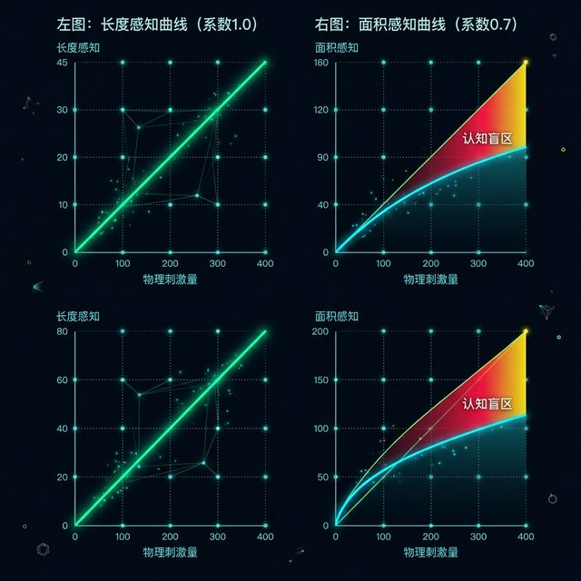
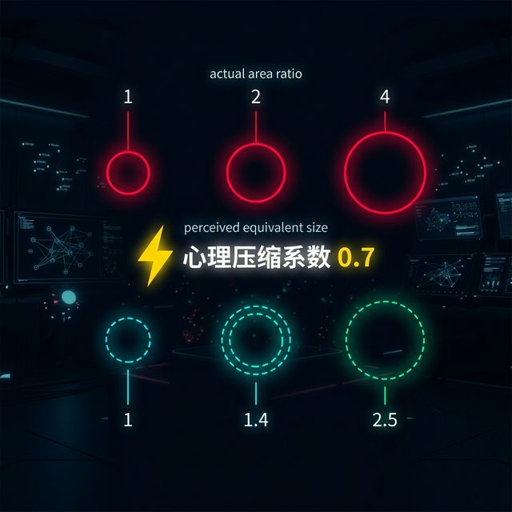
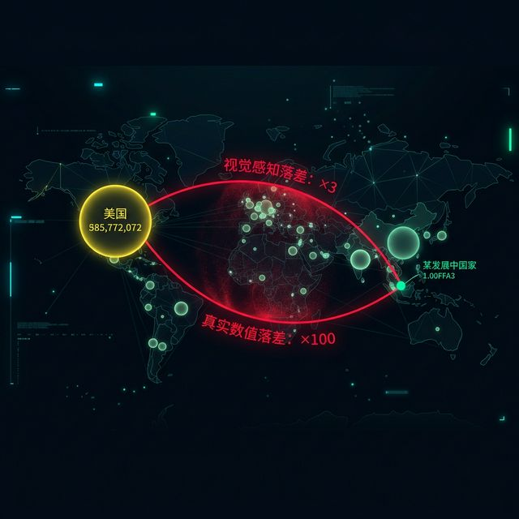
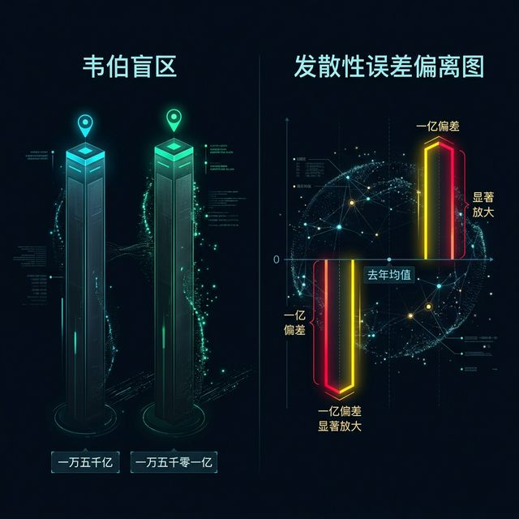
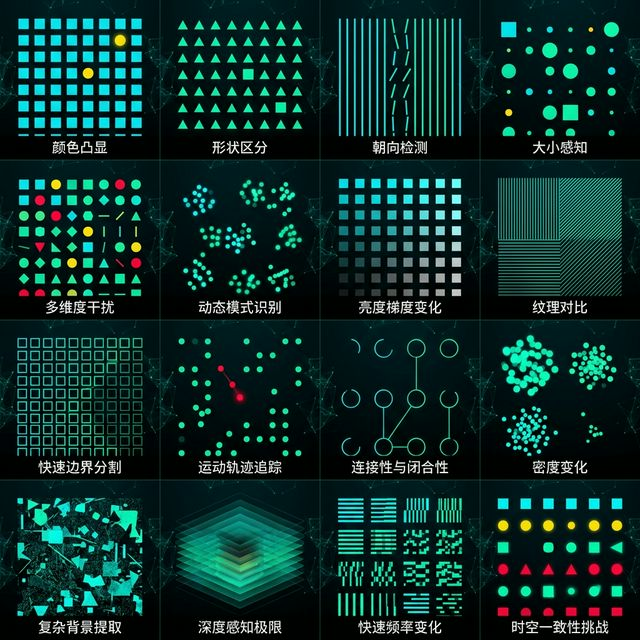
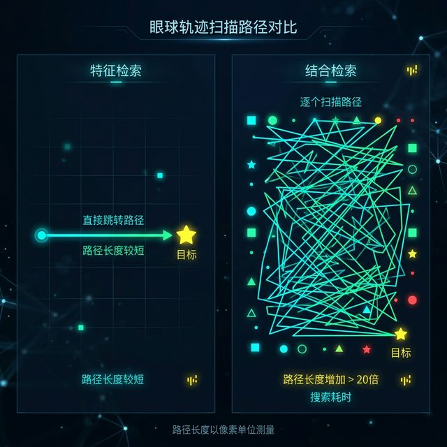
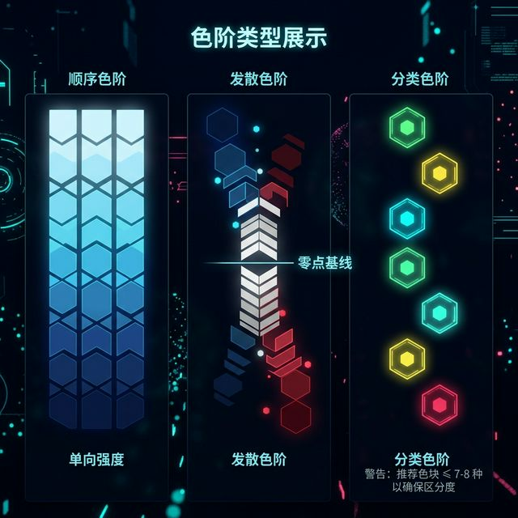
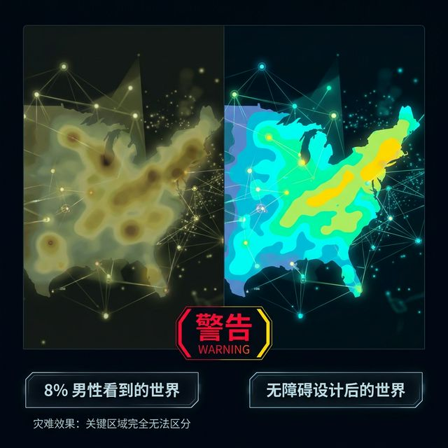
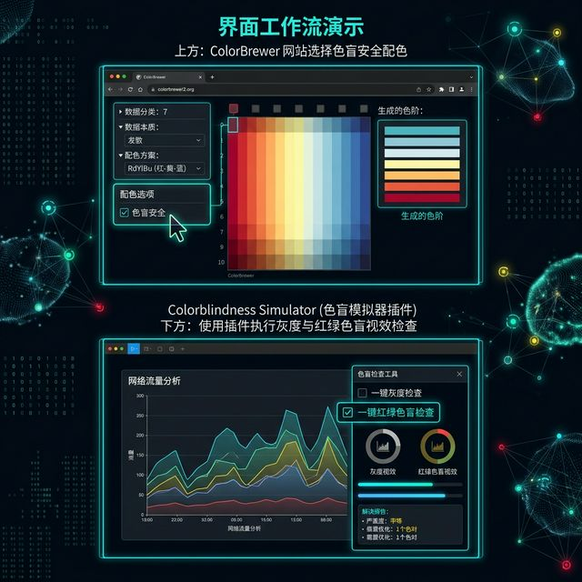

## Module 3: 视觉偏差的陷阱——心理学精度与视觉弹出 (20 分钟)
<!-- BUDGET: 5400 chars | SLIDES: ≥10 | STATUS: done -->

> [VISUAL]
> *   **Slide**: `S05_Channel_Accuracy`
> *   **Asset**: 
> *   **Layout**: `Split`
> *   **Scene**: 极尽直观的图形对比实验。左半屏：三条黑色的直线，长度分别为 1 厘米, 2 厘米, 4 厘米，呈递增阶梯；右半屏：三个红色的实体圆，面积参数由于计算被严格设定为 1, 2, 4 倍递增。
> *   **Text**: "心理物理学定律：你以为的两倍，真的是两倍吗？"

既然前面提到通道有着森严的排名，那么这个排名是谁制定的？答案是：数百万年进化出来的人类视觉系统底层的物理和心理神经法则。这也是为什么可视化设计绝不仅仅是美工排版，它是彻头彻尾的认知科学。

请大家盯着屏幕左边。如果线段 A 刚好是线段 B 的两倍长，你的视神经反馈给大脑的信号会毫不犹豫地判定：A 确实等于 2B。因为**长度通道的感知响应，完美符合真实的物理数值增长**。这在心理物理学里被称为 **Stevens 幂定律（Stevens' Power Law）** 中的线性响应。对于一维的长度，其感知系数是 1.0。

> [VISUAL]
> *   **Slide**: `S05b_Stevens_Power_Law`
> *   **Asset**: 
> *   **Layout**: `Split`
> *   **Scene**: 左图展示长度感知曲线——X轴为物理刺激量，Y轴为感知量，曲线近乎完美的45度对角线（系数1.0）；右图展示面积感知曲线——同样的坐标系，曲线明显下凹（系数0.7），两条曲线之间的阴影区域标注为"认知盲区"。
> *   **Text**: "Stevens 幂定律：长度是诚实的，面积在撒谎"

除了面积被严重压缩之外，这个定律同样向我们揭示了另一个极端：**饱和度（Saturation）的超线性放大效应**。当颜色饱和度在物理属性上仅仅增加了一丁点，人类的肉眼却会觉得它剧烈地变得极其刺眼（感知系数 n > 1.0）。这就解释了为什么当我们在图表中滥用高饱和纯色去编码微弱数值增量时，整个版面会显得突兀刺眼且极具侵略性。因此，通道不仅有阶级，它们各自的油门灵敏度还完全不一样！

但是，现在请看大屏幕右侧 S05b 中对比的这三个圆。虽然我在后台生成代码时，严格将最右边圆的面积设定为最左边小圆的纯数学 4 倍。但如果我不告诉你这个前提，只让你凭直觉扫一眼，大部分人的判断可能是："这个大圆看起来只比小圆大了一倍半多一点吧。"

这是一个极其重要的生理限制：**人类的神经系统天生会严重低估面积和体积的差异**。
根据 Stevens 定律测算，人类对面积差距的心理膨胀系数仅为 0.7 左右，而对 3D 深度体积的感知系数更是低至 0.6 以下甚至极度混沌。我们在看立体的方块或球体时，如果它实际上变大了十倍，你的大脑往往只会感觉到它变大了六倍甚至更低。

> [VISUAL]
> *   **Slide**: `S05c_Area_Volume_Illusion`
> *   **Asset**: 
> *   **Layout**: `Full`
> *   **Scene**: 三组红色实体圆的对比展示——上方标注实际面积比 1:2:4，下方用虚线圈出人脑感知的等效面积比约 1:1.4:2.5，两组数字之间用醒目的黄色闪电符号标注"心理压缩系数 0.7"。
> *   **Text**: "Stevens 定律实证：你的大脑在骗你"

这就意味着一个灾难性的隐患：如果你在制作一期有关全球各大洲财富差异的数据新闻时，轻率地选择用"金块的 3D 体积或者地理气泡占据的巨大面积"去直接映射庞大的财富差值，那么，超级富翁和底层平民在图表上的视觉断层，将会被读者的大脑自动大幅度"压缩"、甚至"和谐"。
你以为你客观地呈现了 100 倍的差距，但观众眼里体验到的痛楚可能只有 10 倍。这在具有强烈公共社会属性的纪实叙事中，由于你选用通道的随意与业余，你已经在潜意识里实施了新闻蒙蔽，这可能会带来致命的认知偏差与从业失职。

> [DID YOU KNOW: "面积即欺骗"的新闻丑闻]
> 2015 年某知名商业媒体用 3D 气泡图展示科技公司市值，苹果的气泡面积看起来仅比小米大两三倍，而实际市值差距超过 20 倍。该图被可视化社区大量截图批评，成为教科书级别的"Stevens 定律犯罪现场"。这起事件至今仍被 Munzner 和 Tufte 的学生们当作反面教材在课堂上反复鞭尸。

> [VISUAL]
> *   **Slide**: `S05d_Wealth_Bubble_Lie`
> *   **Asset**: 
> *   **Layout**: `Full`
> *   **Scene**: 一张全球财富气泡地图案例——最大气泡（代表美国）与最小气泡（代表某发展中国家）之间，用红色标注线分别标出"视觉感知落差：×3"和"真实数值落差：×100"，形成触目惊心的反差警示。
> *   **Text**: "你以为的 3 倍差距，实际是 100 倍——面积通道的认知陷阱"

既然通道的感知精度差异这么大，那么是不是我们所有数据全用位置和长度来展示就一劳永逸了？抱歉，这里还有一条如同铁律般的**可辨别性约束 (Discriminability)**。每个通道能提供给我们的“**可辨别步级极限 (Bins)**”是极其有限和苛刻的。
刚才我们提到线宽只有 3-4 步可被肉眼区分，那么大名鼎鼎的色彩**色相通道 (Hue)** 呢？在没有特定背景比对独立存在的情况下，普通人不经过专业训练最多只能毫无压力地区分大约 6 到 12 种色彩（比如区分红、橙、黄、绿、青、蓝、紫、粉）。这就是我们在做饼图或者多折线图时，类别序列一旦超过十二个，图例颜色就不可避免地开始发生严重撞车打架从而变成灾难色彩泥潭的根源。
铁律是：你企图在图表上编码表达的值的数量级，**绝对不能超过**该选定通道自身所能承受的最大步级数（Bins）。一旦发生越界，必须果断降维聚合，或者转手换别的通道！

> [TEACHING MOMENT: 韦伯定律与相对差异]
> 这里还要引入另外一位心理学家发现的**韦伯定律（Weber's Law）**：人类感知的，是两者的**相对百分比差异**，而不是**绝对数值差异**。
> 如果长城加高一米，你根本看不出来；哪怕你家天花板加高一米，你会明显觉得房子好宽敞。同样是一米，基数不同，刺激完全不同。
> 在可视化里，如果我们要拿两根分别代表一万五千亿GDP和一万五千零一亿GDP的巨大柱子做对比，由于它们自身的基数极其庞大，那微小的顶部落差将完美地隐没在韦伯定律的盲区里，肉眼根本不可辨！
> 此时作为老手，你应该立刻停止使用绝对底端对齐柱状图，果断切换为以基准线（如去年的平均水平）为零点的**发散性误差偏离图**。强行放大那一亿的落差，这是高级数据分析师破局认知的核心手段。

> [VISUAL]
> *   **Slide**: `S05e_Weber_Diverging_Bar`
> *   **Asset**: 
> *   **Layout**: `Split`
> *   **Scene**: 左半屏：两根近乎等高的巨大柱子（一万五千亿 vs 一万五千零一亿），顶部差异肉眼不可辨，上方标注"韦伯盲区"；右半屏：切换为发散性误差偏离图后，以去年均值为零点基线，那一亿的差异被显著放大为清晰可见的偏差条。
> *   **Text**: "破局韦伯盲区：用发散图放大微小差异"

大家请看大屏幕上的这个真实的业务对比动效。我们假设这两根巨大的、顶天立地的深色柱子代表的是国内两家头部互联网巨头在刚刚过去的双十一狂欢节中的总交易额（GMV）。左侧这柱子是一万五千亿，右侧那根是一万五千零一亿。
在传统的绝对值柱状图（也就是屏幕左侧这种无懈可击的、从 0 开始的完美柱形）中，这一亿的惊人厮杀与差距，由于这高达一万五千亿的巨大底座基数，使得原本极具戏剧性冲突的那百分之零点几的落差彻底隐没在了人类视网膜的识别盲区里，肉眼根本不可辨认！老板看了一眼这幅毫无差异的齐平柱子图，只会觉得大家打成了平手，波澜不惊，殊不知底下已经血流成河惨烈至极。
这就是盲区。在这个盲区下，一切所谓的视觉数据直观性都被绝对宽幅淹死了。作为老手，你怎么破局？
看右边：此时你应该立刻舍弃绝对坐标，果断将数据切分开来！将去年的平均基准 GMV 设置为水平中部的 0 点安全线，只绘制今年对比去年盈亏的相对偏离差额。瞬间，那个原本微不可察的 1 亿人民币差距，就会像一把明晃晃的红色匕首一样，被这发散图显著且无限放大为了一根极其粗壮、清晰可见并且直刺云霄的悬殊条形柱。这不仅是破局，这属于真正能够触碰到企业核心痛点脉络的高阶数据分析诊断能力。

> [VISUAL]
> *   **Slide**: `S05f_Checker_Shadow_Illusion`
> *   **Asset**: 
> *   **Layout**: `Split`
> *   **Scene**: 左侧展示经典的阴影棋盘错觉图，A格（位于亮部看似深灰色）和B格（位于阴影中看似浅灰色）分别被明显标出；右侧是用一条纯色带连接A格和B格，证明它们在色值上是绝对且完全相同的纯灰度颜色。
> *   **Text**: "相对判断的代价：色彩被环境劫持"

不仅是比较长度，**韦伯定律所揭示的这套“人类只做相对判断而不是绝对判断”的神经错觉机制，在色彩学上更为恐怖**。请看大屏幕上这幅最著名的能把大猩猩和博士生全部耍得团团转的**阴影棋盘错觉（Checker shadow illusion）**。你们眼中这截然不同的A格与B格，其实它们的RGB物理底色是处于同一色值的绝对纯灰度区块。仅仅因为旁边站着不同的明暗格子背景和那片圆柱体带来的阴影包裹覆盖，你的大脑就会对天发誓其中一个格子必然比另外一个深邃黑得多！看右边，当我们用一条纯色带把它们连接起来时，谎言不攻自破。这种"绝对色彩数值被相对视觉环境彻底劫持"的恐怖特征极端地要求我们，在运用色彩去给关键数据映射编码时，所有比较的底座或底层背景环境务必保证高度统一、纯净且极其客观！

**(Pause: 3s)**

除了对绝对参数的不敏感与相对判断带来的错觉泥潭，通道编码还有一个更深层的技术陷阱，也是初涉数字媒体与 UI 交互设计的学生最容易掉进去的诱惑深渊：为了形式感滥用叠加通道属性所导致的"终极视觉瘫痪"。

> [VISUAL]
> *   **Slide**: `S06_Visual_Popout_Failure`
> *   **Asset**: 
> *   **Layout**: `Grid`
> *   **Scene**: 展示一系列前注意处理（Pre-attentive processing）的极限压力测试演示动图。
>   - 左上：上百个蓝色实心圆点中，静静地躺着唯一一个红点。（几乎无视延迟，秒级识别）
>   - 右上：一堆蓝色方块中，混入了一颗蓝色的圆圈图形。（同样秒级识别）
>   - 左下：蓝颜色的实心圆与红颜色的方块按照随机网格大量混合分布。（开始费眼）
>   - 右下：终极挑战——在此前蓝圆+红方的乱局中，我要求你找出唯一的一颗**红色的圆形**。（认知系统崩溃瘫痪）
> *   **Text**: "**Visual Popout（视觉弹出）** 的死亡边界与结合检索陷阱"

大家还记得第一周我们讲过的人体自带的"视觉光线外接显卡"——前注意处理吗？一个红色的斑点，可以在一堆蓝色的汪洋海洋中瞬间"跳跃"出来，这叫做高度专注的 **Visual Popout（视觉弹出）**。这是一种所谓的"特征检索"，不管画面里的干扰对象是 10 个还是 10,000 个，你发现那个红点的时间几乎都是恒定的，因为它们是由你的神经系统视网膜大片区底层做全画幅无差别大规模并行计算处理出来的。

但在这个神奇的幻灯片右下角象限，安妮·特瑞斯曼 (Anne Treisman) 的特征整合理论为人类敲响了警钟。如果我想让你在一大堆复杂的蓝色的圆形、红色的方形海量杂波中，找出一个同时必须具备两个特定通道属性叠加的目标——也就是一个**红色的圆形**，会发生什么？

突然之间，你大脑里的这片"超级显卡"降级宕机了。你失去了并行计算的所有高速能力，退化到了最老式的单线程串行模式卡带式 CPU。你必须强迫你的眼球像旧扫雷兵一般挨个扫过每一个图形："恩，这个是红的，不对，是方的弃用；这个是圆的，不对，它是蓝的也弃用……"
这就叫做 **结合检索（Conjunction Search）**，这会带来海量的运算负荷暴发。

> [VISUAL]
> *   **Slide**: `S06b_Conjunction_Search_Demo`
> *   **Asset**: 
> *   **Layout**: `Full`
> *   **Scene**: 模拟眼球轨迹扫描路径的对比动线图——左侧"特征检索"模式下眼球直接跳到目标（一条直线箭头）；右侧"结合检索"模式下眼球被迫逐个扫描（密密麻麻的 Z 字形折线路径），路径长度增加了 20 倍以上。
> *   **Text**: "从闪电直击到地毯搜索——结合检索的代价"

仔细盯着屏幕，让我们彻底看清这座地狱般的视觉深渊是如何吞噬你的。
在左边的画面里，我们模拟了人类视神经追踪眼动仪在执行"特征检索"（找红点）时的行动光轨路径：那是极其凌厉干脆的一条绝对直线闪电！你的眼球根本完全连扫都不扫旁边那些密密麻麻蓝得像背景墙一样的杂波对象，瞬间直奔标靶，这就是上帝赋予我们进化出来的用来防备草丛里突然窜出的亮黄色老虎皮毛波纹的保命级神经直觉反射。
但请转过目光，看向右半屏这片被强行叠加了两个要求（找红色的、且圆形的）的重灾区。红色与形状的结合彻底炸毁了那套宝贵的反射回路。你看图上这条密密麻麻、重重叠叠、甚至在原地反复打转、犹如无头苍蝇一般曲折往返的 Z 字型搜索折线！那记录的正是测试者那极度崩溃且被迫进行逐个排雷式的人眼地毯搜索痕迹轨迹！
我们在这里看到了几十倍于此前的耗时落差，读者的耐心在这一段漫长的找寻过程中会瞬间粉碎并彻底流失。所以请记住：**Visual Popout 就像核武器按钮，它极其极其强大威力无穷，但每一次，你也必须且只能按下一枚独立不干扰的首要特征键！**不要试图用颜色、运动和形状对它进行狂轰滥炸齐射并发。

我们为什么会在视觉上"彻底宕机"？这涉及到更底层的一个关键交互评价指标——**通道的可分离性 (Separability) 与融合性 (Integrality)**。
比如你使用**位置 + 色相**（在散点图右上角画一个红色的点），这是极其优秀的**可分离通道组合**；你的大脑可以毫无障碍地将这两个属性分开读取剥离分析：“恩，这是一个利润较高（位置右上）的电子产品类别（红色）。”
但如果你使用**宽度 + 高度**呢？这就构成了一个棘手霸道的**整合融合通道对**。你的底层视神经在零点几秒内会强势暴力介入，直接把一维的宽度和一维的高度粗暴融合成为了一个直觉上的二阶面积属性：“这就是一个大块头！”你再也不可能十分顺利地从脑海中倒向逆推出它最初精确的绝对宽高明细落差比例数值了。

> [WARNING: 永远避开 RGB 融合代码陷阱]
> 提到不可分离，最大的编码灾难莫过于大家常常在 CSS 里随手敲下的那三原色 `RGB` 或 `CMYK` 十六进制值。这三个颜色基向量通道是完完全全、如胶似漆且根本无法在大脑里物理分解的！你永远不可以指望读者能从一块屏幕上的紫色像素点里，人工分离并且倒推出："哦，我看见了 30% 的红和 70% 的蓝，所以 A 商品代表利润 30% 而 B 商品代表 70%"。这就是为什么我们在定义高级系统色彩数据通道时，必须强制放弃前端计算机界所习惯使用的 `RGB/HEX` 模型，而全面切入到与人类直觉认知直接挂钩的 `HSL`（色相/饱和度/亮度）空间！

> [WARNING: 通道干扰导致的体验灾难]
> 为什么会这样？认知心理学给我们的铁律就是：**人类的视觉系统在绝大多数场景下，一次仅能毫不费力的依赖唯一一条最强显式独立通道来发起弹出效应。**
> 当你自作聪明，为了让图表"更繁华绚丽，更能展示这花钱买的报表系统的高级"，而随心所欲地同时叠加三个通道属性（比如既要求用红中黄的粗暴渐变区分品类，又要求三角矩形与圆圈映射区域重要度，还挂上了线条粗细去映射时间戳），去粗暴地轰击污染读者的视觉时，整个版面的视觉弹出机制将彻底陷入深渊死锁，任何图表阅读的效率与洞察力都将荡然无存。

所以，在这间教室里，我给到所有的未来可能统筹掌握百万级别前端设计大权的总师们的最高忠告是两个字：**克制**。如履薄冰般地冷酷克制！不要像展示商品橱窗一样把你脑海中懂的所有代码技能和 CSS 变量技巧，一股脑儿没品位地倾泻倒进一张严肃的数据图纸里。

既然提到了颜色导致的灾难大屠杀，我们必须深挖最后这部分的核心知识，那就是**颜色映射通道控制**的最恐怖雷区。

> [VISUAL]
> *   **Slide**: `S06c_Color_Section_Header`
> *   **Asset**: 
> *   **Layout**: `Center`
> *   **Scene**: 章节转场画面——深邃黑色背景上，一滴鲜红的墨水正在缓慢扩散开来，形成不规则的有机形态。画面中央以冷峻的无衬线字体写着核心议题标题。
> *   **Text**: "颜色：最危险的通道"

大家请看屏幕此刻沉浸下来的巨大转场。黑色的深渊里，一滴不可控的猩红色墨水在屏幕中央像有机生命体一般、无规则且极具侵略性地炸裂和弥漫。
如果说大小、长度和位置是我们设计师手里极其精确无比的游标卡尺和激光切割刀，那颜色……颜色就像是滴在画布上的酸液，它充满不可预知的魔力，既能拥有在一秒钟内让这幅画面焕发出摄人心神、极其震撼华美生命感官的伟岸神力，更能随时准备反噬摧毁你一切精心编排的信息层级并毁掉这个图纸的基础根基！
这就是我们在踏入数据可视化修罗地狱场时必须首先端肃起来对付它的心态：对一切能操纵并迷惑视觉感官的光影心存敬畏，尤其是——颜色。

在长驱直入开启色彩大门之前，我再最后补充一句关于大脑自动分类的**分组机制 (Grouping)** 大战。根据格式塔理论与神经机能，如果我们将分类属性的威力进行排位大决战，这之中强度最压倒性的是**包含 (Containment)** 圈定结构，其次是**连线 (Connection)** 绑缚。但在最隐性且普遍潜意识的相似性自动分组里，**空间区域位置 (Spatial Region)** 的天然无形分割能力极其野蛮地碾压了所有诸如颜色和形状等任何表面视觉标记点。这就是为什么当我们面对重构海量层级的系统分类面板数据时，我们下意识的第一直觉动作永远必须是坚决干净的在屏幕上下划出“左交互区”与“右功能域”，而不是妄图祈求用微弱的点缀颜色甚至变换按钮形状去区分统属它们！把最高最神圣的分组特权底座，永远留给无形的空间！

然而令人绝望的是不可否认现实中图表面积永远极其狭小受限。当我们空间耗尽退无可退，必须动用最危险最具杀伤性的武器来进行多维拥挤信息分流辨识逃生时，我们就无可避免地触碰到了通道雷区里绝对的暴君王者——颜色。

> [TECH NOTE: 颜色映射的色阶选择与禁忌——Ch10 核心要义]
> **知识节点**: `ch10-map-color`
> Munzner 在第十章中将颜色的使用严格剥离为三大不可跨界的色阶类型阵营，每一种背后都有着严密的逻辑与场景对应生死契约，切勿错用混用：
>
> 1. **顺序色阶（Sequential Colormaps）**：从最浅的苍白过度到深邃刺目的主色（如从淡天蓝逐渐深入到深海军蓝），这条跑道专用于去表达**从低值到相对高值的纯粹单向量化强度提升**。例如各省份人均收入热力图地图。
> 2. **发散色阶（Diverging Colormaps）**：从一个冰冷的极端色，中间安全地穿过一段完全呈现中性苍白的地带（零点基线），再一路飙升到另外一个如烈性火焰般的极端色（如经典的暗蓝→白灰→深红）。这条跑道天生专用于表达**围绕着某一确定基准零点展开的对称型盈亏或冷暖偏差数据**。比如企业的净利润正负情况或者全球年度平均气温异常指数偏移量。当你用错时意味着隐没了基线的震慑力。
> 3. **分类色阶（Categorical Colormaps）**：这批由彼此毫无亮度关联的绝对离散独立色相团拼凑成的组合（如西红柿红、天青蓝、抹茶绿、暖黄），是专用于向观众脑波发出**无内在上下左右大小强相关比较意图的标签分类归属暗示**的工具。最致命的警告：受制于短时工作记忆缓存，图例的类别数无论如何切忌不应去强推突破逾越过 7–8 种！否则哪怕是具有极高分辨精度的人类眼球也会在一大通混乱糊成一锅粥的马赛克色彩面前发昏。

> [VISUAL]
> *   **Slide**: `S06d_Three_Colormaps`
> *   **Asset**: 
> *   **Layout**: `Grid`
> *   **Scene**: 三列并排展示色阶类型：左列为顺序色阶（从淡天蓝渐变到深海军蓝，下方标注"单向强度"）；中列为发散色阶（暗蓝→白灰→深红，中间标注零点基线）；右列为分类色阶（7个离散独立色块，下方标注"≤7-8种"警告）。
> *   **Text**: "Munzner Ch10: 三大色阶不可跨界"

>
> 此外，更具有人文灾难性且经常被程序员误踩的，是**臭名昭著的“彩虹色阶 (Rainbow Colormap)”**。之所以被全体学术研究界下发联合死灰复燃封杀令，是因为在它的红黄绿青蓝靛紫自然光谱排列里，人眼天生对黄色和中间的那抹青蓝过渡区段的亮度（Luminance）与饱和度敏感捕捉度是极不均匀参差不齐的。这就极其恶劣地会人为凭空在画面中生造出一道原本在冰冷数据后台就不曾实际真实存在过的"断层切割伪边界"假象！

更重要的是，同理心也是我们对数字世界必须抱有的温柔。全球大概有近 8% 的无辜男性存在一定程度的色觉隐式感知剥夺缺陷，主要是红绿色弱（Deuteranomaly）。如果在一场关乎到国民基本避险出逃生命通道的预警指引路线可视化设计大展中，你唯一的灾情紧急预警区分高亮对比指示仅仅只是傲慢地纯靠极高饱和度的明亮红和纯鲜翠绿的色相属性区分去扛大梁隔离信息……那这庞大的千万计无声求助观众群体在这张灾难宣告画布面前，将彻底沦为被时代和代码所系统性抛弃遗忘的盲人！请务必在你的所有的顶层颜色底层框架设计里，自觉、主动且永远强制纳入调用对视障高阶无障碍极度友好且受用性广的 **ColorBrewer 专业验证调色板**解决方案。这也是我们评价专业段位操守的一把终极人性度量衡尺。

> [STORY TIME: 彩虹末日——NASA 如何弃用 Rainbow Colormap]
> 2014 年 NASA 全球气候数据发布后，科学家发现使用彩虹色阶的海温图中出现了两条"异常温度断层"。经排查证实，这些断层纯属色阶不均匀产生的视觉假象——数据本身完全平滑。此事件在学术界引发地震，直接推动了感知均匀色阶 Viridis 的诞生与推广。从此，"永远不要用彩虹"成为了数据科学界的第一戒律。

> [VISUAL]
> *   **Slide**: `S06e_Accessibility_ColorBrewer`
> *   **Asset**: 
> *   **Layout**: `Split`
> *   **Scene**: 左半屏展示同一张热力图在红绿色盲模拟滤镜下的灾难效果（关键区域完全无法区分）；右半屏展示应用 ColorBrewer 无障碍调色板后的清晰效果，两张图下方分别标注"8% 男性看到的世界"和"无障碍设计后的世界"。
> *   **Text**: "色觉缺陷不是少数人的问题——它是设计师的职业道德底线"

请大家立刻抬起头，极其严肃注视屏幕上对比最惨烈的这一组画面展示。
在左边这张被强加了模拟红绿色盲（Deuteranomaly）滤镜的全国温度气象预警热力图上，你可以看到刚才我们引以为豪的那一套极高饱和度和反差的预警红色斑块与绿野草原，如今竟然彻底堕落降维坍缩成了一片泥泞且浑浊不堪的屎黄色与土褐色的死亡废土。那些红绿撞色的强烈对比在这个多达 8% 群体的世界里完全彻底不复存在。假设此刻这张图表是在标示安全避难高地与地震灾区洪水洼地，那么我们对这千万计生命群体的引导无疑是在直接下达屠杀指引。
这就是技术从业者的血色傲慢与极度职业失职造成的人性深渊剥夺！
而现在，对比看右边。这是同一个数据源，但我们应用了由顶级地理学、认知学以及设计团队千锤百炼开发出的具有严格约束计算证明的 ColorBrewer 无障碍安全保护色梯队。在这套配色体系下，即便滤除了那些特定的极度敏感有缺陷色频波长光段，那依然残留并被巧妙放大的明度（Luminance）以及饱和度差异斜坡，稳稳当当、清清楚楚地扛起了区分灾区与安全地的视觉指引防线大旗！一目了然的深蓝与苍黄明暗界限被保留保留下来了，这不仅是专业，这更是一个手握大规模数字话语权传播系统权力的设计师悲悯众生的底线操守防线。

自从 2014 年 NASA 海温数据在彩虹色阶（Rainbow Colormap）下暴露出凭空生造出来的人为“截断式气温断裂假象”，并直接遭受到了整个学界与业界联合口诛笔伐式的无情报复封杀之后，科学界便将此类无障碍色谱验证纳入了终极标尺。

> [VISUAL]
> *   **Slide**: `S06f_ColorBrewer_Simulator_Tools`
> *   **Asset**: 
> *   **Layout**: `Grid`
> *   **Scene**: 界面工作流演示。上方展示 ColorBrewer 网站界面，鼠标正在勾选 "colorblind safe"（色盲安全）选项并生成出一组发散色阶；下方展示安装在浏览器或 Figma 中的色盲滤镜模拟器插件界面，正在对一幅图表执行一键灰度与红绿色盲视效检查。
> *   **Text**: "防雷神器：ColorBrewer 与色盲模拟器"

既然如此危机四伏，我们如何在极高压的执行交付过程中排开所有的生死暗坑？
手段极其简单且强硬粗暴，答案就在大家头顶的演示画面中。大家今后出入任何项目组的工作流里，请切记将上方的 **ColorBrewer (colorbrewer2.org)** 网站直接加入你们的底层硬性依赖工具白名单库。这是整个数据可视化界泰山北斗团队专门为了安全地图学及统计配色调试而出、并千锤百炼完全验证对各类色觉轻重度障碍人群绝对友好的神级色板调配生成库。在你构建 `Categorical` 分类或者是 `Diverging` 离散发散式阶梯选项时，勾选那个小小的 "colorblind safe"，它将直接为你锁死并划定经过层层计算的安全上限色域池，强行规避明度与感知断层漏洞，并直接输出安全对应的高级 Hex 或者 RGB 一键复制代码给你。
同时，如屏幕下方演示的，我在这里向所有人提出强制硬性要求：希望你们能在日常的操作系统、Figma 或者核心主力浏览器里永远挂载安装任意一款 "Colorblind Simulator (色盲视觉实时滤镜模拟器) " 的常态化插件。务必养成在向任何甲方或者导师交付汇报、并最终按下保存输出键之前，去主动点击一次那个灰暗的快捷切换键以检验审视全盘的残酷职业素养习惯。去直视你的得意成果，如果在褪去所有华丽斑斓伪装后的单色残绘通道里、抑或只有红绿盲冰冷光谱的残障视界中，它依然能够让人清晰明了地读出一丝捍卫底层逻辑的数据尊严时，你才配在这个圈子里骄傲地下班。

---

