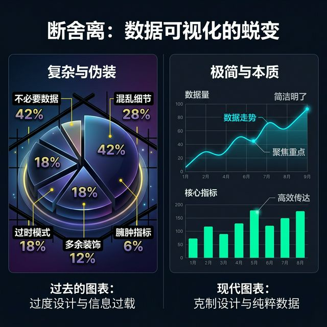
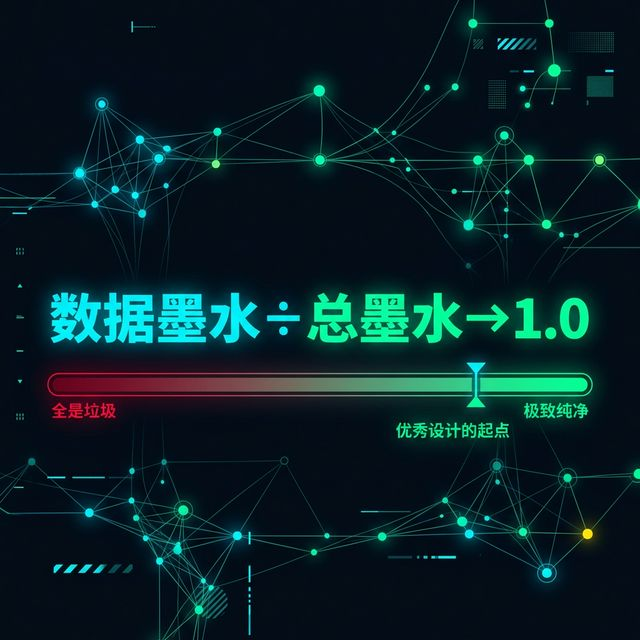
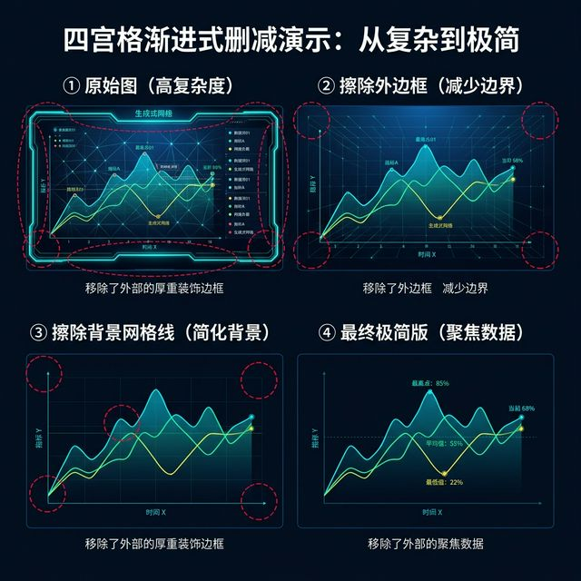
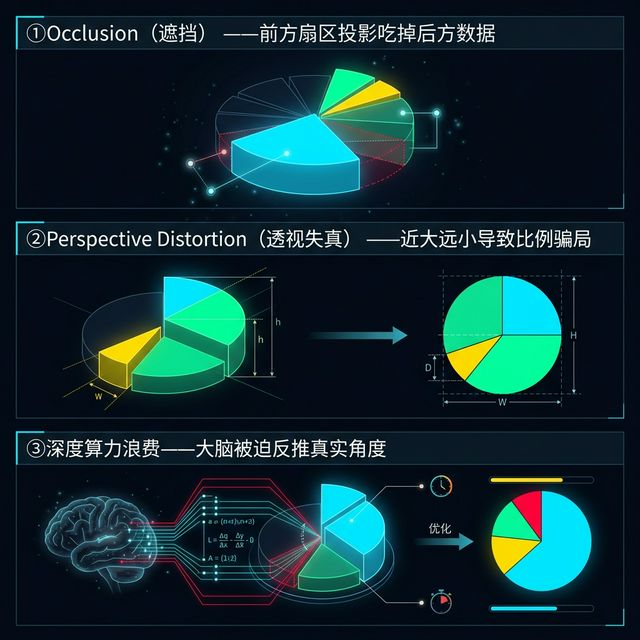
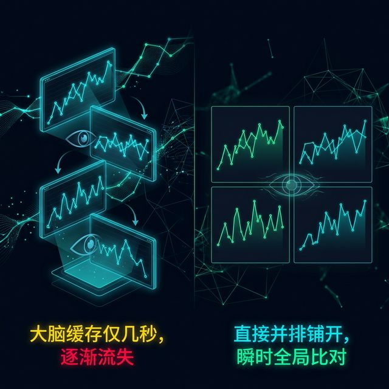

## Module 4: 删减的艺术——数据墨水与抵制伪 3D 的诱惑 (45 分钟)
<!-- BUDGET: 2700 chars | SLIDES: ≥5 | STATUS: done -->

> [VISUAL]
> *   **Slide**: `S07_Data_Ink_Ratio`
> *   **Asset**: 
> *   **Layout**: `Split`
> *   **Scene**: 呈现一幅强烈的"断舍离"式对照画面。左侧是一个带有巨大 3D 深度的厚重饼图，图表后方漂满黑色的加粗网格线，甚至刻意增加了投影光晕与华丽渐变背景。右侧则是剥离一切伪装后，用极其克制的细线及浅灰作为辅色、仅以纯色主体高亮数据走势的极简当代设计。
> *   **Text**: "黄金法则：**Data-Ink Ratio（数据墨水比）**"

信息设计界有一位无可争议的泰斗级人物，Edward Tufte（爱德华·塔夫特）。他在 1983 年撰写了《定量信息的视觉展示》这一传世经典。在其中，他提出了一个至今仍然被谷歌、苹果的数据团队奉为最高信条的概念：**Data-Ink Ratio（数据墨水比）**，它也与 `hao-ch2-design-principles` 中的大道至简的深层设计原则形成强烈共鸣。

大家请看大屏幕上的这幅极其震撼的断舍离式左右对照画面。左侧那个充斥着重度 3D 深度投影、黑粗网格式背景和渐变光晕的厚重庞然巨物，正是 Tufte 会将其毫不留情撕碎抨击的典型原罪反面教材；而相对的右侧画卷，那是一幅被无情剥离了一切虚假电子伪装、仅仅使用极简细线和纯色主体标尺来致命高亮核心数据走势的冷峻精算设计，而这，才是我们一生唯一需要去追求的终极剔透美学目标！

所以它的定义非常冷酷无情：
**图表中用于绘制核心数据的墨水总量 / 打印整张图表所耗费的总墨水总量 = 数据墨水比**。
这个除法得出的数值，应当**尽可能高**——这意味着你正在铁腕剔除一切不为数据服务的视觉噪声。但请注意，它的终极目标并非盲目追求数学极限上的理想 1.0。因为在真实的受众场景中，某些看似"非数据"的元素（如辅助参考线、关键标注、冗余色彩编码）恰恰承担着降低读者认知负荷的关键使命。Semantic Scholar 上多项认知科学实证研究已表明：**过度删减反而会增加认知负荷**，而在简单数据集中适度保留的 Chartjunk 甚至能提升信息记忆度。所以，DIR 的正确追求是：**尽可能高，但底线永远是可读性与任务完成度**。

> [VISUAL]
> *   **Slide**: `S07b_DataInk_Formula`
> *   **Asset**: 
> *   **Layout**: `Center`
> *   **Scene**: 画面中央以超大号字体展示公式 "Data Ink ÷ Total Ink → 1.0"，下方配以一条从 0 到 1 的渐变进度条，左端标注"全是垃圾"（深红），右端标注"极致纯净"（翠绿），当前指针停在约 0.85 位置，旁边标注"优秀设计的起点"。
> *   **Text**: "数据墨水比：一个公式统治所有图表"

换个更通俗的说法解释：此时此刻幻灯片上印出的每一滴墨水、屏幕上亮起的每一个数字或由于 CSS 渲染出的那哪怕一丁点的灰色像素，都必须为了且仅为了**展示数据波动本身**而服务。否则，它就是一种罪恶的视觉污染，Tufte 将之称为 **Chartjunk（图表垃圾）**。

Tufte 给出的操作规范就是**无情地删减（Erasing）**：
如果你擦掉图表上的某个装饰性元素（比如这厚黑粗壮的主坐标轴内边框、这无任何实际意义为了好看而上的背景渐变大阴影，或是那些横贯画面、每一格都显得多余的次级背景辅助线），擦除之后你发现，这份图表传达的数量大小与趋势信息并没有发生哪怕一丝一毫的折损减少——那就**果断删掉它**，不要有半点犹豫！

> [VISUAL]
> *   **Slide**: `S07c_Erasing_Steps`
> *   **Asset**: 
> *   **Layout**: `Grid`
> *   **Scene**: 四宫格渐进式删减演示：①原始图（满版装饰、厚边框、背景渐变、密集网格线）②擦除外边框 ③擦除背景网格线 ④最终极简版（仅剩纯净的数据走势线与最少量的标注文字），每一步都用红色虚线圈出被删减的元素。
> *   **Text**: "Tufte 的删减四步法：擦掉一切不传达数据的墨水"

具体来说，Tufte 在书中猛烈开火的核心 Chartjunk (图表垃圾) 有四大常客：
第一是**沉重的网格线 (Heavy Grids)**。网格线应该是且仅仅只是若有若无的背景音。但在现实的新手作品中，它们常常喧宾夺主，又粗又黑密集交织，硬生生变成了囚禁灵动数据曲线的黑色铁笼。试着把网格线全部改为 5% 透明度的浅灰点状虚线，你会发现数据立刻获得了呼吸感。
第二是**无意义的底色与填充 (Unnecessary Backgrounds)**。很多数字媒体专业的同学因为害怕画面"空"，喜欢给图表背景加上花里胡哨的浅蓝色或者极其业余的渐变灰底纹。这不仅不会增加任何一丝数据的严谨度，只会在投影仪或者打印机上残忍地稀释掉原本想要高亮的走势线对比度。
第三是**过度的边框边界 (Redundant Borders)**。为什么一个折线图外面非要像画框一样再套上四个又粗又黑的矩形边框？你的屏幕本身就已经有一个物理边框了，不要在界面内再堆砌这令人窒息的围墙。
第四是**极其多余的三维假立体效果 (Faux 3D)**。这也是接下来我们要重型炮轰的灾难区。

当然，这也是一柄带有强烈反噬效果的双刃剑。在这里我必须警告所谓的"极端极简的反面"！当我们把这套删减法则执行到走火入魔、原教旨主义的地步时，比如你为了追求所谓的"极致高级留白"，而丧心病狂地擦掉了全部的 Y 坐标轴刻度数字和所有的横向参考背景线。当这卷图画呈现在大屏幕上时，它确实变得无比极致纯粹、像一幅现代抽象艺术画，但对于稍微外行一点或急需获取精确信息来决策的读者来说，他们瞬间就彻底失去了定位数值高度的视线依靠锚点！那些起伏的折线变成了无根之水。这张图表就会彻底滑向"不知所云"的深渊。

> [TEACHING MOMENT: 必要冗余——DIR 的辩证法]
> 我们必须非常诚实地面对一个事实：Tufte 的 Data-Ink Ratio 诞生于 1983 年的印刷媒体时代，当时每一滴实体油墨都有物理成本。但在今天的交互屏幕时代，"墨水"几乎零成本，而**读者的认知带宽（Cognitive Bandwidth）才是真正最稀缺的资源**。
> 认知科学家 Bateman 等人在 2010 年的实证实验中发现：在简单数据集条件下，保留一定程度的视觉装饰（所谓的 Chartjunk）非但没有降低信息提取效率，反而显著提升了读者对数据的**长期记忆度**。瑞士苏黎世艺术大学的研究团队也指出：对关键数据点添加的冗余标注（Redundant Annotation）——虽然在纯数学意义上降低了 DIR——却能在高噪声环境下（如手机屏幕阅读、投影仪演示）为读者提供**认知锚点**，实质上加速了任务完成速度。
> 所以，我们在这间教室里建立的准则不是"DIR = 1.0 = 完美"，而是：**DIR 应尽可能高，但底线永远是可读性与受众的任务完成度。必要的冗余不是垃圾，它是为特定受众精心设计的认知辅助。**

所以在真正的工程实践设计中，我们要的是数据墨水比尽可能高的克制美德，但永远且绝对不能为了追求删减的视觉快感而盲目删减，从而导致作品彻底跌破那条名为【可读性】的及格生命底线。判断一个元素该不该删的终极标准，不是"它是否是数据本身"，而是**"删掉它之后，我的目标受众完成分析任务的速度和准确度是否受损？"**如果答案是肯定的——留下它，哪怕 Tufte 本人站在你面前也不要犹豫。

> [CASE STUDY: 3D 饼图与无根据阴影的五宗罪]
> 在所有的"低数据墨水比"犯罪现场中，尤其对于我们传媒和数字媒体背景、手里掌握强大 C4D/Blender 等 3D 软件渲染能力的同学来说，最容易掉进去的诱惑陷阱，就是盲目追求"高科技的立体炫酷"。最臭名昭著的毒瘤案例，就是所谓的商业 **3D立体加厚版饼图（3D Pie Chart）**。
> 我们来根据刚才学过的理论，历数一下胡乱运用 3D 图形的几大罪状：
> 
> 首先，第一宗罪叫**Occlusion（遮挡）**。前方处于三维空间最高点或最外延的数据滑块，它那长长的无中生有的立体厚度投影，将会严严实实地挡住并吃掉后方原本也拥有合法曝光权的细长扇区数据。数据信息就这样在你华丽的灯光下凭空蒸发了。

> [VISUAL]
> *   **Slide**: `S07d_3D_Pie_Sins`
> *   **Asset**: 
> *   **Layout**: `Split`
> *   **Scene**: 列表式展示 3D 饼图三宗罪，每条配以简洁示意图：①Occlusion（遮挡）——前方扇区投影吃掉后方数据；②Perspective Distortion（透视失真）——近大远小导致比例骗局；③深度算力浪费——大脑被迫反推真实角度。
> *   **Text**: "3D 饼图的三宗罪"
> *   **List**:
> *     - 第一宗: Occlusion（遮挡）
> *     - 第二宗: Perspective Distortion（透视失真）
> *     - 第三宗: 深度感知算力浪费

> 
> 其次第二宗罪，叫**Perspective Distortion（透视失真）**。这在学术界是大案要案！这是我们刚才在通道精度讲过的内容衍生。在带有强烈俯视视角的透视中，如果一个只占据 10% 份额的小切片凑巧被你旋转放置在了画面的最前端（离镜头最近的地方），由于厚度的加持与透视近大远小原理，它看起来的横截面积甚至比位于画面最远端但实际上拥有 30% 真实份额的巨大切片还要显得更为庞大。这在新闻媒体或者严肃的财务财报上，等同于在运用图表技巧实施明目张胆的数据造假与投资人蒙骗！
> 
> 第三，它无故消耗人类宝贵且并不怎么精准的深度感知脑算力。你逼迫你的观众把脑力浪费在反向推算透视变形前的真实扇形夹角角度上。

所以，在学术界，Munzner 教授所列的八大经验法则中，第一条铁律也是最高不可触碰的高压线便是：**No Unjustified 3D（没有正当理由，绝不使用虚假 3D）**。

除非你正在给波音客机展示真实的流体力学机翼气流摩擦分布物理地形图，否则，在处理金融、社会等本身根本不具备物理实质三维空间结构的数据体系时，在二维屏幕上试图表现纯粹的信息比较，**永远不要使用厚重的 3D 阴影来让你看起来更高大上。那不仅低效，而且业余。**

除了向虚假 3D 猛烈开火，Munzner 的八大人机交互法则中还有几根绝对金线，死死地贯穿了当代最顶级企业与科研机构的设计规范标准：

> [VISUAL]
> *   **Slide**: `S07d2_Eyes_Beat_Memory`
> *   **Asset**: 
> *   **Layout**: `Split`
> *   **Scene**: 左侧是需要不断来回翻页才能看完的四张跨屏单线趋势图，下方标注“大脑缓存仅几秒，逐渐流失”；右侧是直接并排铺开的四宫格小多图 (Small Multiples)，观者视线只需横向微小移动即可瞬间完成全局比对。
> *   **Text**: "法则二：Eyes Beat Memory（眼动战胜脑记）"

其一是大家现在在屏幕上看到的 **Eyes Beat Memory（让眼睛的微小物理平移去直接做强对比，而不是强迫大脑去痛苦记忆翻页前的美好印象）**。如果你的数据洞察报告涉及到几组极其复杂的长线时间演化趋势大比对，永远、绝对不要把它们像左侧残局那样拆分开、放在你需要让受众去不断点击翻页才能连载看完的多张离散幻灯片或者交互折叠页面上！因为人类的神经前额叶短时视觉工作记忆缓存只有极其可怜的区区几秒钟，一旦翻到不可逆转的下一页，前一页那刚刚艰难建立起的波峰波谷细节轮廓印记就会在脑海中彻底烟消云散死无对证。你必须像右侧案例一样，极度残酷地强迫自己在这同一张物理画幅巨幕屏幕内，使用高密度全局分面小多图并置 (Small Multiples / Juxtaposition) 的硬核大局观排版手段。让你的用户的眼球只需不费吹灰之力地哪怕微微左右平移滑动哪怕只有零点三秒钟，就能在这唯一的一眼之间，酣畅淋漓地看尽这天下大势里所有代表财富生命曲线的残酷交锋与无声撕咬！

> [VISUAL]
> *   **Slide**: `S07d3_Black_and_White_Test`
> *   **Asset**: 
> *   **Layout**: `Split`
> *   **Scene**: 左侧是一张绚丽刺眼但色层混乱的极高饱和度彩图；右侧是给该图执行一键去色提取后展现出的黑白灰阶图，图中原本依靠红绿色差强行区分的关键分类由于明度极其接近，在灰阶下彻底融成一团不可辨认的死灰，上方印有一个醒目的“FAIL”红色印章。
> *   **Text**: "法则三：Get It Right in BW（黑白炼狱测试）"

其二是如同屏幕上这场正在审判大戏里揭示的，极其冷酷决绝的 **Get It Right in Black and White（先用去色灰阶的刑罚去检验你那些繁杂图纸设计的生死存亡底线）**。这是一手能让所有浮华花拳绣腿无所遁形的残忍技术测试杀招。当你结束长达数小时沾沾自喜的高强度打光特效渲染、得意洋洋面对你面前电脑屏幕上那张看似绚丽斑斓、色彩过度饱和夺目至极的心血大作图纸时，请勇敢试着直接按一下右边演示里的那个一键去色纯黑白滤镜开关！把你整张浮华画卷里最后一丝华美生命血液瞬间粗暴抽干，让它立刻强行沦落退化为这片纯粹的黑白灰三色枯萎遗骸境地。如果此时，你在这片绝望黑白中惊恐万分地发现，你原本绞尽脑汁试图用红绿高亮想要突出的那一块极高优先级重点冲突区域数据，现在彻底由于底层基础明暗对比度的极度烂透与匮乏，从而直接与四周满地其它浅灰色杂音糊成一团、隐没并在背景无形虚无之中直接悄无声息地走向不可逆转的视觉死亡……那你必须低头承认：你之前所有的所有所谓绝美高级颜色渐变层级调配魔法，都只不过是在这摇摇欲坠的学术沙盘上全无任何根基支撑的虚幻假象欺世粉饰而已。图形科学真正的热血与钢铁般不可磨灭的硬核工程魂骨，它必然也要而且必须要在褪去了所有斑驳表象色彩外衣的那片至深至纯的黑与白生死炼狱深渊之底，依然能够像一座不可摧毁发着寒光之光的灯塔一样，能够毫不动摇地向每一位盲眼寻根路人傲然独立、刺眼怒放显形！这就是你对所绘刻事实的终极至高尊重。

其三是 **Function First, Form Next（功能永远优先，但这并不是借口）**。不要把这条守则当成了可以肆意提交丑陋图表的免死金牌！它的真谛是：如果你连图表的精确坐标体系和标签可读性功能都没有绝对夯实保住，在那上面去叠加任何所谓的生成艺术或是赛博朋克先锋形式感，都是一种巨大的亵渎；但在功能被钢铁般守住的坚实极简地基之上，形式的美感才是决定这幅图纸能否具有史诗般强壮生命力与传播力的隐蔽第二阶梯。两者的缺一不可，构成了专业工程师与二流画图匠的天然门槛。

其四则是极具现实工程反思意义的 **Resolution over Immersion（信息分辨率远大于沉浸感噱头）**。现在市面上充斥着狂妄的鼓吹声，声称可以用 VR 头显或者极其夸张的空间全息去观看那些悬空的数据流。但请面对现实痛点：目前那几百克的头显设备往往伴随极低的像素密度和令人眩晕的防畸变计算落差，你原本可以在 4K 乃至 8K 级别的顶级硬核数据指挥中心平面巨幕大屏上，一眼看尽几万级别的密集散点数据汪洋，而在低分辨率的沉浸式设备中，你连那根小小的针状柱子标尺数字都永远无法聚焦看清。所以，在绝对的海量数据检阅面前，平面超高清晰信息密度面板的权杖，永远凌驾于任何虚幻的三维沉浸幻觉之上。

> [DID YOU KNOW: Tufte 的"最少即最多"哲学]
> Edward Tufte 被称为"数据可视化的达芬奇"。他自费出版了四本经典著作——因为没有出版社敢赌——结果大卖超 200 万册。他的核心哲学只有六个字："Above all else, show the data." 在他位于康涅狄格州的私人领地上，他亲手设计了一座雕塑花园，其中每件作品都是"用最少的材料传达最多信息"的物理隐喻。

> [VISUAL]
> *   **Slide**: `S07e_No_Unjustified_3D`
> *   **Asset**: 
> *   **Layout**: `Split`
> *   **Scene**: Munzner 经典引言卡片——画面中央用大号无衬线字体展示 "No Unjustified 3D"，背景是一个被巨大红色叉号划掉的厚重 3D 饼图残骸，四周散落着被"删减"击碎的阴影碎片。
> *   **Text**: "Munzner 铁律第一条"

请牢牢盯着大屏右侧这张写有 "No Unjustified 3D" 箴言的绝命卡片总结符咒。这就是你们在这个极其严酷的专业图纸领域里必须要死死坚守捍卫的最底线铁幕操守。记住画面中央那个被巨大惨烈且醒目的红色叉号所无情击碎斩落的、那些原本所谓华美沉重但实际上却是极其拙劣且充斥着遮挡掩盖罪恶隐患的反面 3D 阴影残骸碎片！当你握着最高权限渲染引擎、试图为了单纯地去满足虚荣心追求炫光技术而去无脑堆砌景深透视算力时，请停下手想一想：往往仅仅是因为你的所谓美学傲慢，从而导致画卷深远背景层可能被物理吞噬或者直接强行掩盖抹除掉的那些关系到生灵财富、气候灾变甚至国家宏大决策命脉底层的关键角落微弱数据变数。数据不容撒谎，绝不允许被美学谋杀。

> [ACTIVITY]
> *   **Type**: `Workshop`
> *   **Duration**: `30min`
> *   **Desc**: **"逼迫 AI"——大模型提示词抗震压力测试。**
> 
> **执行流程与具体指导台词**：此工作坊旨在揭秘当前市面上 LLM（大语言模型）在生成代码时的常见审美陷阱与降维打击操作法。
> 1. （向全班下发一份含有噪点但具备典型特征的企业季度销售真实数据集）。
> 2. （教师大屏演示）：将课堂一分为二。**对照组**用一种极其散漫、口语化、外行客户式的 Prompt 去指挥 ChatGPT/Claude 输出 ECharts 等前端图表代码：“帮我画一张 2024 年四个季度不同产品线销售数据的统计图，要求看着高大上一点、霸气一点，最好有明显的立体感和强烈的炫酷色彩。”
> 3. （静待 10 秒钟出图，嘲讽粗陋的结果。）
> 4. **核心组**则上台，祭出本节课的王牌——"数据墨水比与通道克制"法则，展开降维打击式指令 Prompt 设计：“基于上述同一份数据，使用 ECharts 绘制一张水平的 Grouped Bar Chart（分组柱状图）。**首要强制规则：绝对断然禁止任何形式的伪 3D 效果透视映射与阴影背景投影属性**。**次要强制规划：实施极简化剔除作业**，彻底移除所有 Y 轴内横向网格刻度网格线（令 `splitLine.show: false`），去除外发光环境包围框线。整体色彩仅准予使用统一的低饱和、高明度的性冷淡灰阶（Grey scale）作为背景色底衬，而后单独挑出并将第四季度增速最猛的代表性明星产品数据长条，利用通道强制分离法，填涂为高亮警示警戒橙红色作为全画面的唯一视觉突击点核心。”
> 5. 两组各自将最终生成出的代码复制并部署在本地浏览器中运行渲染。大屏幕做左右震撼同框对比展示！
> 
> 这个大对比的实验现场结果淋漓尽致地向全场所有人展现宣判了：哪怕你手握再强的 AI 神兵利器，如果你作为最高裁决权主宰操盘手的潜意识大局观脑海深层当中，根本就未曾刻录过"极限数据墨水比删减准则"这把极其残忍且锋利的手术锯刀标尺去主动施加宏大预先干预与架构约束——那么，不管这世界底层正在提供多模态输出的大型演算模型它自称自己能有多么的聪明绝顶拟人化思维，AI 仅仅也只是在单纯凭藉着其那毫无情感的、爬取自全人类互联网长达二十年所累积下来的浩繁但审美低劣平均数据大杂烩所揉合拼贴出的所谓产出而已；它能够最后交付给你的，永远永远都只会是那些彻底缺乏当代高端工程艺术高级留白节流修养呼吸感缺失、甚至满屏充斥着坐标网格线与阴影噪点遮挡垃圾冗余堆叠的极其恶俗且低幼丑陋半成品玩具而已。
> 对我们数字媒体艺术相关设计传媒专业的全体学生同学与业界同仁们来说，刚才那半成品画卷对比尤其称得上一记极其凄厉且震耳发聩轰鸣不止的警世洪钟怒吼！是的，你们每个人的指尖现在都拥有并且掌握着极其强大至极的诸如 Blender / C4D / Unreal Engine 或者是 Houdini 全自动虚幻高阶物理漫反射节点引擎计算光影渲染级别的重型压制核武器。这种能够无限模拟甚至欺骗人类眼球真实物理法则的终极视觉表现刻画能力，如果将它降临并释放在信息量化展现这片原本干涸的领域领土上，它的的确确是一种既能让你们轻而易举降维秒推平杀那些死磕抽象数理的纯理科程序员的无上华彩美学降魔神剑；但在与此同时的硬币另一面，你们也绝不要抱有丝毫轻敌与幻想，它也必然是那时刻倒悬漂浮在你们冷酷逻辑思维主导苍穹之上、时时刻刻闪烁寒光引诱并魅惑你随时无意识去跨过雷池肆无忌惮地滑向虚假 3D 造作深海罪恶深渊边缘的那把剧毒恐怖双刃剑！因为视觉极度扩张放纵的华丽高光本身真的太容易让人麻醉，它太过容易诱使你们在纯粹追求引擎画面极限炫技堆叠多边形的迷幻过程中，由于沉溺技术快感从而选择性极强地彻底背弃并彻底迷失掩埋掉这幅画作中它最珍贵且不可被篡改替代的数据本身那一丝不挂、带着甚至有些冷酷孤傲与苍凉感的事实本真！永远！永远将 Tufte 这位一代大宗师生前的座右铭犹如精神铭印般刺青在你们脑海：去向全天下人类展示那赤裸底层的数据，且唯有数据而已！因为只有带着最高绝对冷视的批判与疯狂减法切割斩断准则去支配与运用目前地球上最为顶级狂飙的 AI 与渲染管线，你，而非冰冷的程序机器，才是这能永恒牢控这股信息数字洪流方向盘、并永远立于高维视界不败之地的极简真理绝对唯一主人君王。

---

