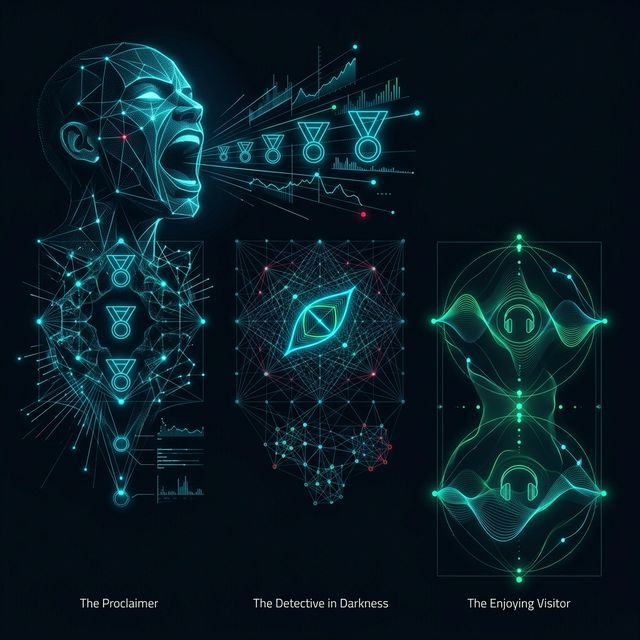
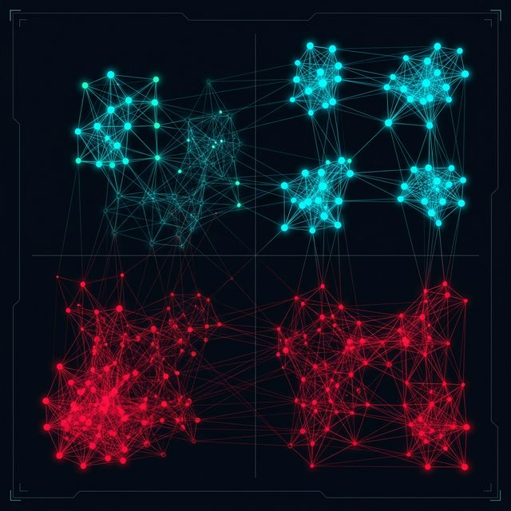
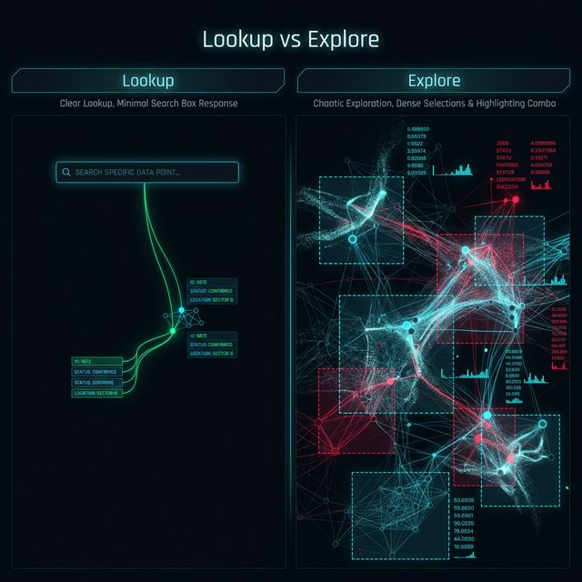
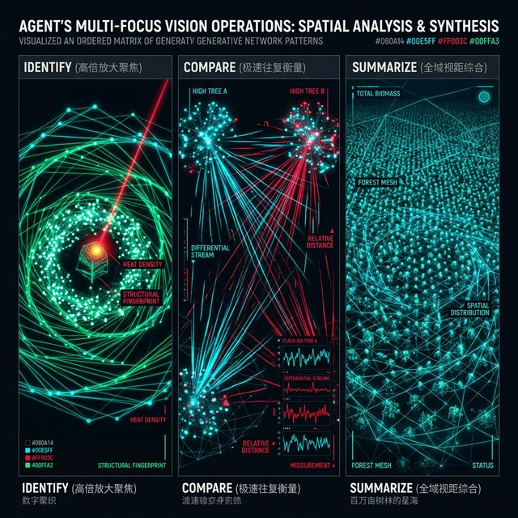

## 模块 3: Why — 意图识别与重塑魔法 (35 分钟)
<!-- BUDGET: 4000 chars | SLIDES: ≥14 | STATUS: done -->
> [!NOTE] 核心标签回溯
> [task-abstraction-framework] [data-ethics] [anti-tech-hegemony] [hao-ch4-masterworks]

在上一模块极其烧脑的数据基因测序法庭上，我们历尽万般劫难，终于剥开了数据极其伪善的拟态表层，彻底看透了组成这座庞大冰山的数字基底——无论是分类、序数、量化的阶级属性鸿沟，还是被死死锁止的特定寻址主键与承载内容值的宿命分配机制。这便是 Munzner 数据抽象框架体系的第一斩击：**What**（明确数据特性的绝对本体界定）。进入第二层 `ch03-task-abstraction` 任务抽象领域，我们需要更深理解使用者的动力。

但这远远不够。如果天真地以为只要查明了基因序列就能直接调用代码成功画图，那么你立刻会陷入另一场由于缺乏业务场景共情力而引发的空洞灾难。你画出的是一具毫无灵魂的数字骷髅，而不是一把能刺穿人类心智的利刃。

> [PHILOSOPHY] 人文锚点：信息设计师的真身是跨界翻译官
> 这个世界上最遥远的距离，不是大模型与底层代码的报错，而是“人类那充斥着隐喻、模糊与妄念的业务语言”与“计算机那犹如铁板一块、绝对理性的标量计算矩阵”之间的巨大鸿沟。大语言模型听不懂什么是“我要在图里震撼地看清今年的所有动静”，D3 绘图引擎也不在乎到底什么叫作“这批劣质退火材料的波动预警”。信息可视化架构师在这个狂飙突进的 AI 时代，其不可替代的核心身价，就是扮演那位能够身兼两界两域的终极“同声传译翻译官”！你必须极度冷酷地抽干甲方话语里的沸腾情绪水分，把那些千丝万缕的领域特定概念，降维、拆解、强行扭曲翻译成为这世界上唯独少数几种机器能够绝对理解执行的通用动词操作指令网关。

> [VISUAL]
> *   **Slide**: `S22b_The_Lost_Analyst`
> *   **Layout**: `Full`
> *   **Scene**: 一个被成千上万份完美标注了“分类、量化”属性的整洁数据表格包围的数据分析师，手握着顶级的可视化开发工具，却双眼空洞地望着屏幕，不知从何画起。
> *   **Caption**: "最悲哀的迷失：你拥有了整个世界的原材料，却不知道客户要用它造什么船。"
> *   **Asset**: 

当你完美解构了一份包含两千万条全国电商交易流水记录的长表，你的代码技能随时待命。但问题是，你到底该将其渲染成一张极其震撼绚丽、宏大壮观、用于给投资人年度峰会展示炫耀的“宇宙级全国热力高亮分布图”？还是该将它切分为极度克制、满屏皆是致密交互下钻控件阀的“异常极速跌损退货预警侦测排查面板”？

这里彻底失去了计算机客观标尺的庇护。我们踏入了人类那深不见底的、极其主观且常常自相矛盾的需求欲望深渊。

> [VISUAL]
> *   **Slide**: `S23_The_Why_Intent_Funnel`
> *   **Layout**: `Grid`
> *   **Scene**: 人类意图翻译机。左侧是甲方拍脑袋提出的极其抽象的愿望：“我要在图里震撼地看清今年的所有动静”；这愿望犹如一道高能等离子束，打入一台标着“Why 意图分流引擎”的铁盒子中，右侧输出了极端冷静死寂的计算机交互执行动作指令。
> *   **Caption**: "将凡人的狂妄愿望，极度压缩降维成底层机器界面触发的执行指令网。"
> *   **Asset**: 

这就是 Munzner 传授的第二大架构神技：基于 Why（底层意图解码驱动）的动作降维拆分法术。把那些毫无逻辑的业务废话，强效脱水逼迫压缩成计算机可以执行的三大行动分层逻辑指令网关：Analyze（高维动作解析）、Search（猎物寻址围捕模式）、以及 Query（观测反馈确认级）。任何庞杂混沌的客户诉求只要抛进这口巨大的高频压榨熔炉漏斗，都会被无情碾碎、剥离情绪，然后降维成系统底层的点击、拉伸、对比与缩放。这不但是过滤，更是对人类虚妄心智的一次绝对整形结构重铸风暴。只要你能熟练操纵这个漏斗引擎，你就能将所有感性的要求转化为理性的机器指令动作。

### 1. 第一过滤级行动判决：高维解析域，即 Analyze

你在第一回合要搞清楚的首要生死边界：使用者在注视这面可视化大屏的时候，他当下的心流处于哪种捕获消费状态位阶？面对这既成的数据，他是去享用，还是去掘金，亦或创造？

> [VISUAL]
> *   **Slide**: `S26_Analyze_Layer`
> *   **Layout**: `Grid`
> *   **Scene**: 三张面具。第一张：宣威者举着金牌大声夸耀；第二张：侦探在极度黑暗的洞窟内用放大镜搜索；第三张：游客带着耳机沉醉浅笑享受。
> *   **List**: ["宣示展示，即 Present：不容反驳的战果汇报", "幽暗发现，即 Discover：死守边界的可疑风暴捕猎", "消遣享受，即 Enjoy：零压力的情感共鸣赋予"]
> *   **Caption**: "认清分析受众所佩戴的面具：汇报者、猎手、抑或旁观的享受者。"
> *   **Asset**: 

*   **Present（宣示展示）**：当你作为调查者已经毫无保留地探明了所有的底牌结果，确定了凶手是谁，此刻你唯一的目的，就是去向世界高调且无争议地宣告胜利。
    *   **设计制约法则**：此时的图表构建理念必须秉持一种不容置疑的“极致独断力”。图表界面应当像剃刀一样，无情地剔除掉任何可能引发观众游移、猜测、或者产生纷繁复杂交互探索欲望的干扰控件。图注警示数字必须要以极其清晰、且体量硕大的字重排布，死死烙印在整个视觉画布心智的最核心中央，甚至只允许单一且具最强吸睛冲击力的主色调留存。
    *   > [CASE STUDY] 纽约时报与《彭博商业周刊》的宣判式版面
        > 比如《纽约时报》在发布总统选举最终压倒性选票结果版面时，绝不会给你提供什么“放大缩小、滑动时间轴看历史选票”的拖沓交互组件。它只会用几乎占据了屏幕三分之二、刺目到极点的大面积猩红或深海蓝单一色块，配以大如脸盆的无衬线粗体数字，像法官落下的重锤一般给这场博弈盖棺定论。这就是 Present 意图的最高展现。

*   **Discover（幽暗发现）**：这里弥漫着求生绝境的战栗感。
    *   **设计制约法则**：分析学者面对着刚刚脱敏下发的数百万条极度混杂留痕流水，犹如潜水员在深海强压盲区摸索。他们正试图极度敏锐地挖掘其内深藏不露的恶意潜伏规律。这种图表，绝不纵容哪怕一次异常峰值的漏网。画面必然充斥极度致密的预警图层。同时必须搭载海量深潜的无限互动切片与过滤控件组。
    *   > [CASE STUDY] 彭博金融数据终端（Bloomberg Terminal）的密集视场
        > 为什么金融交易员的屏幕总是密密麻麻、如同黑客帝国般挤满了令人眼花缭乱的 K 线、散点和雷达网段，毫无留白甚至有些“丑陋”？因为他们的意图是 Discover！在这里，“极简主义美学”就是谋杀财富的毒药。交易员需要在一个无边的浩瀚画布上同屏榨取所有的微弱波动信号极差！一根微小但在多个并置图表中同时发生共振的极细红线，可能正是预示着下周千万级资本做空风暴的深海大地震初波！

*   **Enjoy（消遣享受）**：这里彻底舍弃了以上两者带有的强压强目的性的战斗血腥意味。
    *   **设计制约法则**：这是放松神经的领地，设计师的职责不再是施加强压或深渊探灯，而是情感的抚慰羁绊。此时的可视化可以不择手段地大量引入高度柔化圆润的物理碰撞动效交互、平滑丝滑的曲线以及毫无攻击性的低反差柔和马卡龙渐变色阶包裹层。
    *   > [CASE STUDY] Spotify Wrapped 的年度沉浸时光长卷
        > 每年年底刷爆朋友圈的 Spotify 或网易云年度听歌音乐总结。它将你全年的几十万行枯燥播放点触日志代码流水库，转化成了一卷带着宇宙星轨、伴随微小粒子炸裂动效的时光漫游沉浸长图。在这里，你不需要去找什么异常，不需要跟谁攀比，你只是戴着耳机划动屏幕，在这柔美的视觉与数据隐喻中感受岁月时光的流逝余温。

> [VISUAL]
> *   **Slide**: `S26b_Produce_Layer`
> *   **Layout**: `Split`
> *   **Scene**: 左半边是一双眼睛仅仅停留在观看屏幕上的消费数据（Consume）；右半边则是一只机械臂猛然伸出，在屏幕图海上重重盖下大红印章，并将其抽屉式归档（Produce）。
> *   **Caption**: "从被动的视界观察者，彻底质变进化为掌握留痕主权与定义新维度的造物主引擎。"
> *   **Asset**: 

除去上述三种“消费型（Consume）”动作体系，Analyze 层级还隐藏着另一套极具攻击性的“创生型（Produce）”矩阵分类：
*   **Annotate & Record（确权标定与历史刻录）**：真正的分析闭环绝不仅仅止步于肉眼发现规律。当你在巨量网络簇丛中敏锐锁定了一个极微小的异常破局点群落时，你必须立即动用 Annotate（标注）组件，给它狠狠地打上鲜血般的警告标签圈禁地阵列，建立属于你的侦察确权阵地。随后紧接 Record（刻录）步骤，将这一瞬间极为珍贵的界面参数状态与图谱矩阵快照，强制永久打包装盒存入不可篡改的历史封印库中。这两套连环重击操作，真正将原本易逝的数字流星幻影，化为了团队协同攻坚中最为坚硬传承的实体情报炮弹。

### 2. 第二过滤级行动判决：目标围猎寻址场，即 Search

明确了心态之后，随之进入犹如深山狩猎般的物理坐标查探阶段。你要追猎的东西，你知晓它长什么样吗？你知道它在图纸上的具象出没点吗？

> [VISUAL]
> *   **Slide**: `S27_Search_Matrix`
> *   **Layout**: `Flow`
> *   **Scene**: 目标极度明确/目标特征彻底模糊 vs 位置彻底洞悉/位置完完全全遗失 的二维象限地狱矩阵。
> *   **List**: ["明确检索，即 Lookup：目标明确，坐标已知", "迷雾定位，即 Locate：目标明确，坐标丢失", "大浪淘金，即 Browse：目标模糊，锁定高地", "混沌乱猎，即 Explore：茫然无知，全域探测"]
> *   **Caption**: "猎手的四重地狱：从完全掌控猎物到盲眼闯入太初深渊。"
> *   **Asset**: 

这四种寻猎情境，定义了你在构筑大屏时必须装配的交互密度大阵：

1.  **Lookup（明确检索）**：不仅极度清晰刺杀目标的外貌，更高维全盘掌握其物理阵脚坐标。极其类似在拼音黄页里毫无阻滞地翻找特定词条起始。在这个象限，UI 层面你甚至不需要复杂的交互视图库，**仅仅需要给用户弹出一个极为干练精简的“精准文字输入搜索框”**，让他直接通过键入身份证号或书名直达画面中心点基站！
2.  **Locate（迷雾定位）**：知晓射击目标的大名，但致命的是，彻底不知道它隐遁大图平面何方角落。在几千点密集交织的股市发散图海中，全凭人力耗费心血去追踪那一柱“阿里巴巴”所属的独有绿柱位置。针对此劫，你必须布置**高对比度的状态触发悬停高亮提示器 (Hover Highlight)** 或者是能让全局底色一瞬间黯淡灰置退局、唯独让那个搜索词组猎物阵列如星辰般在夜空中爆闪跃出的**条件着色过滤器**。
3.  **Browse（大浪淘金）**：内心茫然无确切指定目标悬赏，但依凭深厚战斗经验直觉行事。只要动用火力集中扫射图线上矗立的最巅峰高塔或者是色彩最深浓的红色谷底带，必能捞到有价值的大鱼。这就要求界面务必装载**平滑无极的缩放画布 (Semantic Zooming)** 和** 支持平移拖拽的抓手底版 (Pan/Drag Canvas)**，让老练猎手能像巡河雄鹰般在这无垠像素疆域任意盘旋扫荡。
4.  **Explore（混沌探索乱猎）**：处于蒙昧的太初黑暗中。既不曾知晓猎物属性，更彻底不知目标栖息地图的何处深渊。只有面对这种最高深度的深水区迷局探险，才能授权你搬出**套索多边几何框选阵列 (Lasso Selection)**，以及**多重仪表盘极限联动交叉过滤 (Cross-Filtering)** 这种超级重火力航母复合式交互组件网络。

> [VISUAL]
> *   **Slide**: `S27b_Search_Interactions`
> *   **Layout**: `Split`
> *   **Scene**: 左侧：展现明确检索，即 Lookup 下的极简搜索框响应。右侧：展现混沌探索，即 Explore 下密密麻麻的框选、缩放、多重条件联动高亮组合技响应。
> *   **Caption**: "四种寻猎状态强制驱动出迥异的交互军火库。"
> *   **Asset**: 

> [TEACHING MOMENT] 你的朋友圈属于哪种交互火力阵？
> 让我们的思维立刻进入一场无防护的实战判定：当你在极其枯燥疲惫的高铁旅途上，随手掏出手机打开微信朋友圈页面，指尖漫无目的地滑动着那个永远看不到尽头的卡片流。此时此刻你的大脑和手眼协同机制，到底处于上述矩阵中的哪一格？
> 答案呼之欲出：这就是不折不扣、最具代表性的图文 **Browse（大浪淘金浏览模式）**！你不仅不知道下一条滑出的会是老同学的自拍还是微商的狂轰滥炸，你大概率连页面滑到了哪个精确的基岩物理刻度尺位置（坐标全无）也毫不在意。你完全是在凭着生物进化千万年沉淀下的对“奇特影像”、“暴红警告反色”、“极其长篇的吵架长文”等高频特征的经验直觉神经末梢，在这条瀑布流里去捞那极其微量能提供情绪多巴胺的多偶价值大鱼大瓜罢了！

由于这四阶难度深浅彻底错位，在 UI 控件层面你的供弹逻辑决不能有丝毫同质化。面对 Explore 的混沌地狱，你必须端出套索框选、无限视界层递缩放的超级联动武器航母阵列，以应对极高频度的大海捞针扫荡；但面对 Lookup 这种已经知晓敌营底裤阵地的情境，强推上述繁重重火力组件，不过是杀鸡用牛刀般的累赘与智商侮辱。明确追踪矩阵坐标边界，是你避免交互过度架构设计的铁血压舱阀门。

### 3. 第三过滤级落点裁决：单点行为审级，即 Query

我们不断收束漏斗，从主观愿景、寻猎坐标，最终收束到了那个视网膜真正凝视、鼠标指针真正点击微操的那个极其细微单粒子落点。

> [VISUAL]
> *   **Slide**: `S28_Query_Types`
> *   **Layout**: `Grid`
> *   **Scene**: 一名探员不断切换眼镜视界距的操作：Identify (死死用极高倍放大镜聚焦烧灼一棵孤立野草)，Compare (瞳孔极限往复在两棵高树之间剧烈狂奔衡量极差)，Summarize (视距大幅后拉覆盖整片百万亩树林的星海)。
> *   **List**: ["指认识别，即 Identify：全盘聚焦孤立点", "对抗比较，即 Compare：狂暴衡量悬殊鸿沟", "万象概览，即 Summarize：纵览全局大脉络走势"]
> *   **Caption**: "微操审判的三部曲：极微观的点射、极惨烈的对决、极其壮阔的鸟瞰全貌。"
> *   **Asset**: 

在这里，使用者的肉眼将只保留三种极限操作形态：
*   **Identify（指认识别）**：将极其狭窄的准星死死收束到全局内仅有的一个特级被观察主干上。你悄悄悬停在一个孤城的散点上查询它的气温读数。
*   **Compare（对抗比较）**：视网膜极其狂暴并快速往复在多端阵营极速跳跃，残忍探底极深悬殊差距体量鸿沟。这种情况下并列放置对齐的柱形条要远压过去逼迫大脑估算两个圆环面积差那种花里胡哨的图形排布派系表现。
*   **Summarize（万象归一概览）**：极其用力将全身后仰挣脱局域碎片牢笼，极限拉大视界域广角距扫视幅面，去鸟瞰一幅大星系离散阵图长河极宏大趋势定调底牌脉光流形貌。

> [TEACHING MOMENT] Munzner 眼中的交互防坑指南：组件匹配的暴政
> 在这里，很多初学者会犯下极度致命的错误：把所有酷炫的交互组件不分青红皂白地全部堆砌上去。但根据 Tamara Munzner 的《Visualization Analysis and Design》核心指导原则，不同粒度的 Query 必须受到极度严格的 UI 节制：
>
> 1. **Identify 的节制**：当用户的 Query 意图仅仅是指认识别某个极小点阵的读数时，哪怕你只给他加上零点五秒的渐隐动画，或是强迫他先框选再查看，都是在反人类。最高效的做法是**悬停即显（Hover-to-tooltip）**，让交互阻尼趋近于零。
> 2. **Compare 的强链接**：当用户在 Compare 两个相隔甚远的柱图时。你绝对不能靠他自己的记忆力去人肉对抗。你必须动用**跨维高亮（Cross-Highlight）**组件。一旦他点击其中一根柱子，远端的那根对照必须强制性同步爆闪发亮！
> 3. **Summarize 的空间让渡**：对于概览全局意图，任何干扰视线的小浮窗、任何微弱的鼠标悬停交互都是累赘。这里需要的只有**全局缩略小地图（Brush and Link）**，把最大面积的空间让渡给宏大的静态底图。不匹配的交互重火力，不仅榨干了浏览器的内存，更强暴了使用者的心智。

> [PHILOSOPHY] 人文锚点：技术霸权（Anti-Tech Hegemony）凝视下的无底交互深渊
> 当你在精心构筑这套极度深邃、从 Lookup 到 Explore 的交互操控漏斗时，请务必时刻保持清醒。当今硅谷的资本科技巨头们，总是极尽能事地在终端界面上，海量铺设最为极致丝滑、毫无摩擦力的“混沌探索深渊（Explore）”与“消遣沉浸流（Enjoy）”动效。
> 
> 这背后掩藏的，实则是一场精密算计到微秒的流量剥削阴谋。这就是最为骇人的“技术霸权凝视”！他们通过无底线的诱导滑动阻尼机制和瀑布流深网，去无穷无尽地诱骗你的心智。强迫你在发光的屏幕上多深陷哪怕零点一秒，从而极其贪婪地榨取全人类不可逆的专注力残渣。
> 
> 因此，你在布置交互闸门时，必须拥有反抗系统性凌霸的伦理界限底线心智：
> 当用户处于极其明确目标寻迹的 Lookup 意图时，请立即大发慈悲地甩给他最粗暴干脆的纯文字输入框！绝不可以越权滥用那些繁复叠加的炫目深坑图表墙，去硬生生将他囚禁于你为炫技而编织的数据大迷宫之中。过度设计交互，就是对使用者智力和时间的谋杀。图形不等于图表，更不等于真相。只有最克制的交互，才体现了最高级的技术悲悯。

### 4. 最被低估的战略级重器：派生创生界，即 Derive

刚才讲的 Analyze、Search、Query 都是面对既定数据做出的探测。但在 Munzner 这个意图漏斗的最偏僻角落，潜藏着一柄堪称信息可视化领域最具逆转威力的大杀器——派生（**Derive**）！

> [VISUAL]
> *   **Slide**: `S28b_Derive_Concept`
> *   **Layout**: `Split`
> *   **Scene**: 左侧：一张包含“进口”和“出口”字段的基础数据表。右侧：一道强光闪过，两列数据碰撞后产生出一列全新的耀眼荧光绿数据柱——“贸易顺逆差”。
> *   **Caption**: "当原始数据无法讲述真相时，用数学逻辑创造出属于你的第一手全新度量！"
> *   **Asset**: 

它的核心理念无比狂妄：永远不要仅仅只是画你拿到的那副底牌！如果原始数据画不出神韵，那你就应当像创世神一般，动用数学逻辑组合，在这堆原石中派生出原本不存在的全新高层次属性！直接抛弃旧图，画这新图！

> [STORY TIME] 以 Derive 派生扭转生死洪荒的两次千古极意神作
>
> 让我们立刻翻开这血淋淋的历史战报铁证。第一幕：如何呈现两个常年大宗进出贸易极富对抗摩擦超级大国横跨数十年的极其枯燥贸易货值角抵。如果由二等流庸手来做，他们只会极其死守本分地把“连年总进口额曲线”以及“总数出口额狂暴折线”并列死板画在这张图纸表里。但这种死结画法根本让人无法在毫秒间算出每隔一年的纠缠盈亏大底！而真正的派生大宗师是如何出手的？他们极为果决地在系统里直接暴力下达算算式衍生操作指令：“出口”狠狠减去“进口”！瞬间派生凭空缔造出一个这原始底稿表格上根本不存在的虚拟列——“极巨贸易顺逆净差额”。然后抛弃原稿，极其潇洒地直接渲染画出这条唯一纯粹的一根净差分大脉络曲线。瞬间，两国经济深战那此起彼落的绞杀跌宕胜负波峰巨谷，犹如被闪电劈开一般赤裸裸呈现无疑。
>
> 第二幕更为悲壮。1869 年伟人大师 Charles Minard 徒手绘制了被公认为地球上最伟大的统计图之一——《拿破仑大军 1812 东征俄罗斯陨落图》。
>
> 四十二万人的庞大军团，从法国浩荡出发。挺进莫斯科，再无尽惨烈撤回。沿途人数随气温一起暴跌溃灭。Minard 没有枯燥地罗列一张“村落折损花名册”式的数字大表。他做了一件天才的事：在地理路线图上，派生出了一条宽度随军团人数同步萎缩的流线带。
>
> 出发时，这条金带极为宽广；横渡涅曼河后开始极度收缩；抵达莫斯科时已瘦骨嶙峋；撤退归来，仅剩一万人，线带几乎随极寒一同消失于茫茫纸面。这根随时间和空间变化无情改变粗细的骇人数据带，无声控诉着一场人道灾难。
>
> 这就是派生的伟大力量。数据抽象绝对不是对残缺碎片的低头折腰。它是设计者手中最凌厉的武器——你有权创造原始图纸中不存在的生命体征维度，进而重塑历史。

> 第四幕，降维镇压超大网络死结灾厄。面对含有恐怖如五十万个交叉节点的巨型毛线球盘根错节网络，哪怕是最顶级的超级计算机渲染出图，留在人类瞳孔中的也只会是一团极其恶心丑陋的黑色“毛线球（Hairball）”遮挡泥淖。面对这种视觉死局，高阶派生大师根本不想去硬刚这个数量级。他们从拓扑学的异度空间召唤出了绝秘的评价体系：斯特劳勒数（Strahler Number）。他们不画图，而是先算这五十万个节点的层级重要性权值。剥夺甚至无情抹杀掉那四十九万五千个无关痛痒的边缘树叶极细小弱节点，只留下区区五千个真正承载着整体架构生命命脉的核心粗壮主干。一瞬间，厚重的黑色泥沼退避三舍，一棵极其骨感且傲然挺立的神经晶格树之王被极其清晰地推到了视网膜前。这就叫派生过滤的残酷神权。
>
> 第五幕：极地反转热力暗流。当你拿到一个海洋洋流或风洞测试的超巨型密集连续场基底时，如果你只会照本宣科地用颜色去映射基础流速值，那注定只能得到一张平庸且毫无生机的平坦渐变色卡。只有那些在流体力学中爬行过地狱的魔导师，才会调动数学工具逆向解构场强。他们通过极其极其剧烈的偏微分方程涡度裂变矩阵重铸法则，凭空生出旋度（Curl）、散度甚至焓等更加极致狂暴的派生属性变种。把这些二次魔改派生极值直接扔进渲染场，曾经平淡无奇的风场便瞬间幻化出了一万个微小气旋的狂暴星云阵列。在这片极其暴虐的派生深空视点中，你终于用肉眼生生抓握住了那些原点数据一辈子都无法窥探的隐秘结构宇宙法则力量。这就是最高维度 Derive 的降维碾压屠杀统治！

> [DID YOU KNOW] 派生 Derive 与预处理的数据鸿沟界线
> 有些初学者总是将其与前端框架的单纯遍历映射甚至粗浅的 Excel 公式混为一谈。绝非如此。Derive 的核心并不在于代码实现有多困难，而在于这是数据架构师脑海中第一次主动介入数据的主权宣示！
> 面对一份“进口与出口”大宽表，直接画出两条毫无交集的平行折线，是机械码农的低劣敷衍；而脑海中立刻闪过“这并不能揭示贸易战争的胜负本质”，从而立刻动用算式狂热推导出“顺逆差净额绝对值”并只画这一根净差红线，才是一位数据操盘大宗师具备的可怕商业嗅觉素养。Derive，永远是对死板原始数据集发起的一次极高智慧抗争。

> [VISUAL]
> *   **Slide**: `S29_Funnel_Combined`
> *   **Layout**: `Full`
> *   **Scene**: 三层巨大的铁制过滤重碾同轴相嵌、严密咬合运作，将高层的模糊愿望硬生生压片成了不可辩驳的计算机机械底层行动语言执行阵。
> *   **Caption**: "意图解码的连贯神权：通过三重审级，你终将获得主宰系统的终极机器语言发条。"
> *   **Asset**: 

三个层级——Analyze（意图）、Search（坐标）、Query（落点）——彼此咬合、环环相扣，共同构成了将莫糊诉求转化为精确机器指令的解码网络。这不仅是可视化设计的框架，更是一种思维方式的训练：在你正式打开任何代码编辑器之前，先在这张三级漏斗里走完一整圈。当你能清晰说出"这是一个 Present 意图下的 Locate 场景，用户的 Query 是 Compare"，你就已经完成了设计中最有价值的工作。剩下的色彩、布局、交互，不过是这个决策的自然延伸。缺少了意图定位框架，再华丽的图表也只是黑暗中射出的一支随机之箭；而有了它，每一根像素的落地都将有据可依。

> [TEACHING MOMENT] Why 框架的设计师价值
> Munzner 的 Why 框架最深刻之处，在于它逼迫你问出一个最朴素也最难回答的问题：**「用户来这里是为了做什么？」**。从 Analyze 到 Query 的三级漏斗，本质上是把每一个主观的人类愿望，都翻译成了客观的、可执行的信号术语。这是连接数据与人类智慧的最后一公里。学会了这套语言，你就拥有了与任何甲方、工程师以及 AI，平等对话的共同词汇表——无论行业、无论领域。

将这天马行空的三重行动意愿漏斗层严丝合缝地深套重卡嵌套合并合拢后，我们就彻底完成了数据意图界定战场的极终兵棋推演！你获取了把极其散漫、矛盾甲方需求，无情强制硬性转译解体拼装落定为纯净透明的“高交互高亮过滤选择点选”与“高级数值派生提纯”等底层机器代码组件块阵的逆天权杖。

但光有对底层物质粒子的洞察（What），光有高屋建瓴的读心理想（Why），依旧救不活一个充满泥淖绝望深井的项目大坑。我们最后极度欠缺乃至极其渴求的，是那套能彻底荡平表格垃圾乱象、让污泥浊水瞬间清澈化作可用活水晶源的极其强横硬核的行动纲领深层数据血肉淬火重铸大一统神谕。

全体肃立。随我拔剑，毅然跨入本堂大课最终且最致命的终极决胜战场最后一模块领域：Tidy Data 整洁数据清洗极刑大炼狱考卷篇。
