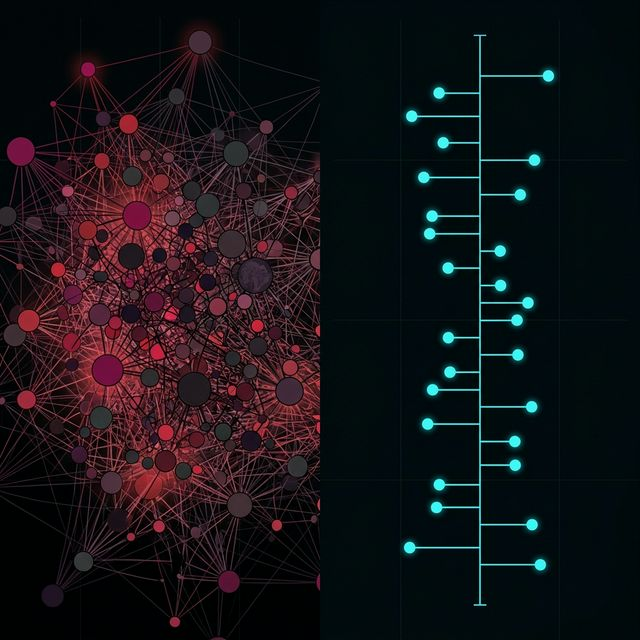
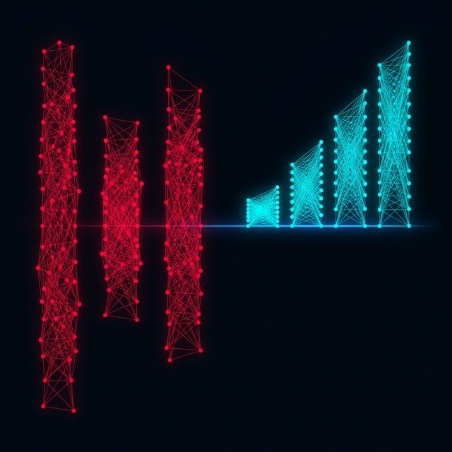
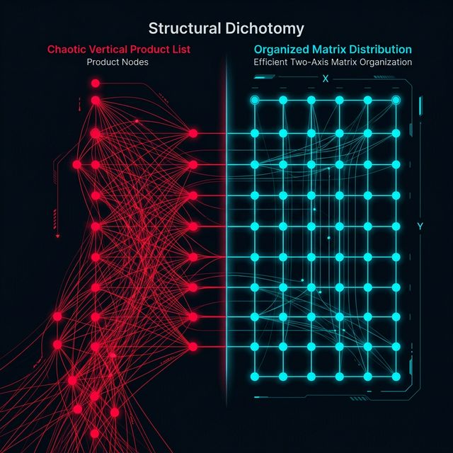
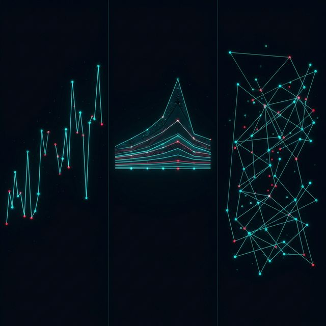
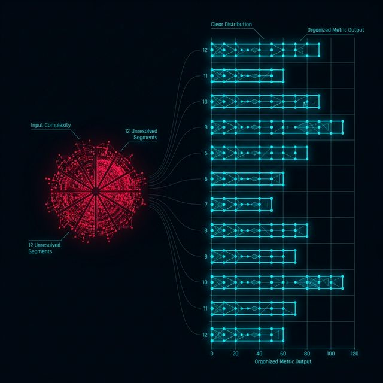
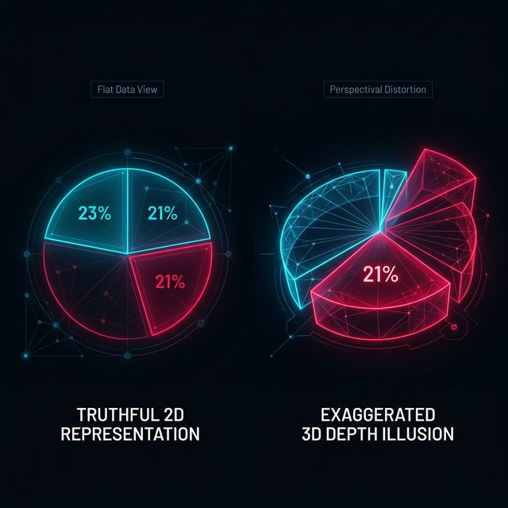
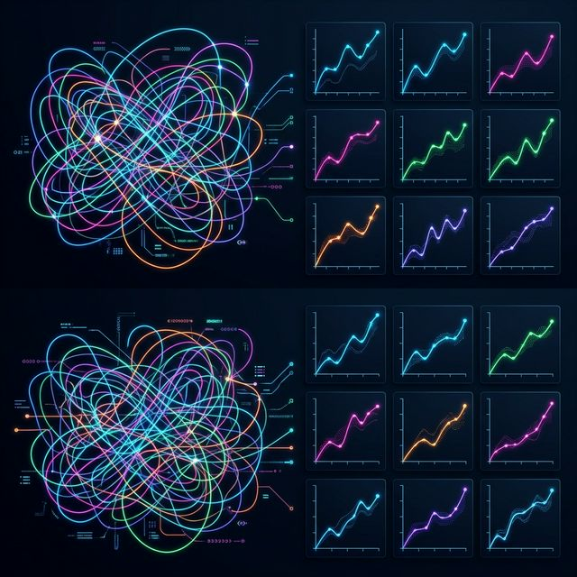
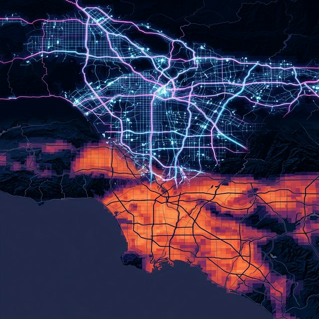

## 模块 1: 空间——最昂贵的视觉通道 (60 分钟)
<!-- BUDGET: 3600 chars | SLIDES: ≥6 | STATUS: ok -->

> [!NOTE] 教学备忘: 复习/导入
> 本模块回顾 W03 数据类型体系与 Tidy Data 原则，引出本周核心议题：如何用空间排布将整洁数据变为可视化图表。
> **知识目标 2 回链**：本周所有框架实操（ECharts/D3）的前提条件，是你手里握着一份经过 Tidy 化洗礼的整洁长表。如果你的 CSV 还保留着合并表头或宽列年份，任何框架都会在数据绑定阶段当场崩溃。请确保你已彻底内化 W03 Wickham 三原则。

> [VISUAL]
> *   **Slide**: S01_Title_W04
> *   **Asset**: 
> *   **Layout**: `Center`
> *   **Scene**: 深色背景。左侧是一个井然有序的柱状图容器（像一个个抽屉），右侧是散落一地、杂乱无章的发光粒子。
> *   **Text**: 空间：最昂贵的视觉通道

上周，我们在深海里洗净了泥沙，拿到了一份纯粹的整洁数据。那是一张标准的二维长表。里面规规矩矩地排布着变量列和观测行。

今天，我们要把这些幽暗的数字，放进明亮的世界里。可视化这个词听着宏大，但它落地的第一句话永远是：**这个像素点，我该画在哪里？**

> [PHILOSOPHY]
> 在《可视化分析与设计》一书中，Tamara Munzner 教授把第七章的标题定为：“Arrange Tables（表格数据的排布）”。
> 记住，空间，是我们人类能感知到的，最精准、最昂贵、效能最高的视觉通道。你只有两个半坐标轴可以挥霍。你怎么去分配 x 轴和 y 轴，决定了受众脑筋转弯的速度。你的每一个像素点的使用，都是在消耗这无价的空间预算。

> [VISUAL]
> *   **Slide**: S01c_Evolutionary_Space
> *   **Asset**: 
> *   **Layout**: `Grid`
> *   **Scene**: 以第一人称视角，展示茂密原始森林中，前方左右两边潜伏猛兽的剪影，底部标有测量物理距离的HUD标尺。
> *   **Text**: 人类对物理空间的进化感知

为什么要强调空间的绝对地位？因为在人类的漫长进化中，我们对物理空间的感知能力是被锤炼到了极致的。在一片森林里，人类祖先能够立刻判断出，一只猛兽距离自己有五十米还是一百米，它的位置在左边还是右边。这种在物理空间上的锚定能力，深深地刻在了我们的基因里。

所以，在所有能编码数据的视觉通道中——不论是颜色深浅、形状大小、还是纹理方向——**基于共同基线的空间位置，也就是通常所说的 Spatial Position on a Common Scale** 脱颖而出，成为了精度毫无争议的第一名。当你想传达最核心、最不容误解的数量级差异时，必须把它们交给空间。

> [VISUAL]
> *   **Slide**: S01b_Space_Is_Expensive
> *   **Asset**: 
> *   **Layout**: Split
> *   **Scene**: 左半边展示一幅色彩斑斓但没有固定坐标轴的抽象数据画，右半边展示一个黑白分明且带刻度轴的网格线散点图。
> *   **Text**: 空间预算：不可再生的二维画布

然而，这个最强大的通道，同时也是最稀缺的。
你有一块长 1920 像素，宽 1080 像素的屏幕。这就意味着你的空间通道容量是完全被锁死的。这就像是在繁华的市中心买下了一块地皮，每一寸都必须精打细算。如果你把空间浪费在了无意义的类别陈列上，或者让大量的数据拥挤在同一个狭窄的角落里互相遮挡（这种现象叫做过度绘制 Overdraw），你的图表就会面临视觉上的破产。

为了掌控这片昂贵的领地，我们需要学习表格空间排布的四步核心语法。

### 1.1 空间的四步语法：表达、分离、排序、对齐

当人类面对错综复杂的类别属性和量化属性时，究竟该如何破局？Munzner 教授给出了四个层次递进的动作：**Express（表达）**、**Separate（分离）**、**Order（排序）** 与 **Align（对齐）**。

> [VISUAL]
> *   **Slide**: S02_Express_Separate
> *   **Asset**: 
> *   **Layout**: Split
> *   **Scene**: 左侧展示一个只有纵轴数值但水平全部挤在一起的点阵；右侧动态展开，将猫、狗、兔子分别拉开到三个独立的水平区域里。
> *   **Text**: 第一步与第二步：表达与分离

我们首先要用量化数据来**Express**，也就是赋予数值以空间的长度或高度。
假设我们要绘制动物的体重均值。如果我们只把点按体重的数值放在一张图的纵向高度上，它就是一维的点阵。大家看左边，猫和狗、兔子的点都在一根柱子上重叠，根本分不清谁是谁。

这就是为什么我们需要运用第二个空间维度来拉开距离，执行分离操作，也就是通常所指的 **Separate**。我们利用水平空间的宽广，把不同的类别强行拆解、分离出来。猫站在左边的格子，狗站在中间，兔子站在右边。
分离，赋予了类型学变量喘息的空间。

> [VISUAL]
> *   **Slide**: S02b_Order_Align
> *   **Asset**: 
> *   **Layout**: Split
> *   **Scene**: 左侧是高低错落、参差不齐的三个圆柱；右侧则将它们按高度从低到高排列，并且底部严丝合缝地压在同一条水平轴上。
> *   **Text**: 第三步与第四步：排序与对齐

但这还不够。当类别被分离开之后，如果没有秩序，人的大脑就需要不断在各个独立的区域里跳跃对比。所以，我们需要执行排序操作，大家常将其称为 **Order**。基于类别某种内在的逻辑，或者直接基于体重的数值大小作降序排列，图形就立刻显出了一种引流视线的趋势。

最后，也是最具有决定性的一步：**Align**（对齐）。当我们把这些被分类的视觉元素，统统按压在同一根基准线上时，就彻底消除了相对位置比较的模糊感。所有的长度比较都站在了同一条起跑线上。

> [VISUAL]
> *   **Slide**: S02d_Jobs_Alignment
> *   **Asset**: 
> *   **Layout**: `Grid`
> *   **Scene**: 史蒂夫·乔布斯在一场经典发布会上，背后是一张巨大的、底部完全对齐的iPhone销量增长柱状图。
> *   **Text**: 乔布斯的空间语法

> [CASE STUDY] 
> 经典案例：乔布斯的发布会图表
> 在历年的苹果产品发布会上，乔布斯几乎从不使用饼图。他展示市占率、展示业绩增长时，总是偏爱巨大、清晰、底部完全对齐的水平柱状图或垂直柱状图。不仅如此，他还总是会将己方的柱子与对手的柱子，按照从小到大的逻辑执行排序工作，这就是 **Order** 效应。这种经过严密设计的对齐与表达操作，也就是 **Align** 与 **Express**，能够在短短的三秒钟内，把“我们遥遥领先”的概念烙进观众潜意识。这是空间语法的实战巅峰。

有了表达、分离、排序和对齐，一个最基础的**柱状图**就诞生了。它只用了一个空间维度去代表数值，另一个空间维度纯粹用来拉开距离。这听起来简单，却是支撑人类商业图表运转几十年的地基。

### 1.2 轴向分布策略：直线与矩阵

空间既然是有限的，那我们怎么在有限的空间里塞下尽可能多维度的信息？这就涉及到对数轴走向的选择。最常见的，就是直交坐标系下的列表排列。

> [VISUAL]
> *   **Slide**: S02c_Axis_Orientation
> *   **Asset**: 
> *   **Layout**: Split
> *   **Scene**: 左侧是一个长出屏幕外的垂直向下排列的商品列表图；右侧是将其改写为含有多列、两轴协同工作的矩阵型分布。
> *   **Text**: List vs Matrix：维度战役的进阶

前面的柱状图和折线图，都属于列表对齐，英文叫作 **List Alignment**。它们只用了一个分类属性，来对唯一的那个轴做线性切割。这种单一维度的切分非常清晰，但也非常低效。

如果现实世界极其复杂，你有两个甚至更多的分类变量呢？比如你想同时看“地区”和“产品线”这两大类别下的销售情况。
Munzner 在书中给出了第二种强大武器——**矩阵对齐，即 Matrix Alignment**。

> [VISUAL]
> *   **Slide**: S03b_Matrix_Alignment
> *   **Asset**: 
> *   **Layout**: Split
> *   **Scene**: 左侧是一个基于基因表达数据的聚类热力图；右侧是一个经典的散点图矩阵 (SPLOM)。
> *   **Text**: 当一维轴不够用时：密集恐惧的视觉盛宴

如果把两个分类变量，分别映射到二维矩阵的行和列，然后在两者的交叉单元格里，用一个颜色去表达量化的数值，这就是大名鼎鼎的**热力图，也就是西方概念里的 Heatmap**。

千万不要小看热力图。因为它用颜色的发散替代了空间的长度尺寸，它可以将数据的展示密度推到极致。在一个一千乘一千像素的屏幕上，它可以一次性塞进几万个基因表达数据点！这是宏观概览的绝对利器。基因科学家用它来做物种分类，电商分析师用它来看一周七天与一天二十四小时内，哪个时段的用户留存最惊人。

而如果我们的数据里有十几个量化维度呢？我们可以让矩阵里的每一个单元格，不再是一个颜色方块，而是一张完整的二维散点图。这就是散点图矩阵，业内常简称为 **SPLOM**。一眼望去，对角线对称的数据云海，哪里有正相关，哪里有异常离线点，全部尽收眼底。这是在高维迷宫中找相关性的最快途径。

### 1.3 折线的谎言与时序策略

> [VISUAL]
> *   **Slide**: S03c_False_Timeline
> *   **Asset**: 
> *   **Layout**: `Grid`
> *   **Scene**: 一张荒谬的折线图，横轴是互不相关的国家名称，折线在不同国家之间剧烈波动，配上一个巨大的红色问号。
> *   **Text**: 当折线连错了对象

> [STORY TIME] 为什么不要乱连线？
> 我们继续看单轴控制的柱状图。假设有些设计师觉得它太死板、太平庸了。于是他们把柱状图顶端的点连了起来，甚至去掉了柱子本身，把它改成了一张**折线图**。看起来帅气多了，起伏跌宕的，对吧？
> 但是，如果你的横轴类别是美国、中国、俄罗斯、英国和法国呢？
> 当观众看到一根从“中国”向下连接到“俄罗斯”的折线时，人们是不由自主会去解读这种斜率的：“看啊，经历了从中国到俄罗斯的剧烈下滑！” 这句话何等荒谬！这两个国家之间并没有连续互变的中间态，它们是相互独立的离散个体。

> [VISUAL]
> *   **Slide**: S03d_Line_Implies_Trend
> *   **Asset**: 
> *   **Layout**: `Grid`
> *   **Scene**: 一条从一个点流向下一个点的发光能量线，连线上有箭头，象征着时间不可逆的趋势过度。
> *   **Text**: 折线的强烈视觉暗示：趋势

这告诉我们一个铁律：**折线图，只能用于有内在连续顺序的坐标轴（比如时间流变、或是严格的序列排序）**。因为那些连接点与点的线段，在视觉上发出了一个极其强烈的暗示——“两者之间存在平滑过渡与趋势”。如果你在完全不相关、纯离散的类别上画了折线图，你就是在用伪造的视觉假象，欺骗观众的大脑。

> [VISUAL]
> *   **Slide**: S03c_Time_Series_Concept
> *   **Asset**: 
> *   **Layout**: `Grid`
> *   **Scene**: 一张从 1990 年延伸到 2024 年的全球气温攀升图表。
> *   **Text**: 时序数据：天然拥抱折线的盟军

折线天然的盟友是时序数据，也就是 **Temporal Data**——这是可视化中最常见、也最充满陷阱的数据类型。时间就像一条永不停止的河流，自带先后的强顺序属性和无限延续的连续属性。

在慕尼黑大学的时间数据处理规范中，以及 Munzner 教授讨论时序数据的第十四章里，提出了三种应对时间维度的特殊编码策略。

> [VISUAL]
> *   **Slide**: S03d_Temporal_Strategy
> *   **Asset**: 
> *   **Layout**: `Split`
> *   **Scene**: 罗列应对时序数据的三种排布阵型，配有简单的示意图标。
> *   **Text**: **List**: 应对时序数据的三大排布绝招

利用时间的特殊性构筑空间排布，我们有三种进阶打法：

1. **等距与非等距控制**：如果你的记录在某几个年份断档了，用线性的等距坐标轴会强行拉扯空间，制造错误波动的假象。此时必须明确使用非线性的时间解析比例尺，让日历天数真实地决定像素占据长度。
2. **地平线图，即 Horizon Chart**：当面临成百上千条微小股票走势线，纵向空间彻底破产时，它通过将颜色切割然后重叠面积的方法，将大山压成平地。在保留极值波动的状况下，节约了恐怖的 Y 轴纵向空间。
3. **连线散点图，也就是 Connected Scatterplot**：放弃时间作为横轴的做法。时间被降格成为了一个连线的“幽灵导演”。如果横轴是国家 GDP，纵轴是人生预期寿命，年份作为顺序把数据点连起来。你会看国家文明爬升的蜘蛛行走轨迹！

这些深奥的时间阵型，是区分初级画表工和高级可视化分析师的真正试金石。

### 1.4 饼图的原罪：极坐标的诅咒

> [VISUAL]
> *   **Slide**: S03_Pie_Vs_Bar
> *   **Asset**: 
> *   **Layout**: `Grid`
> *   **Scene**: 一张 3D 的夸张饼图，其中一块占 18%，另一块占 22%，但由于 3D 透视角度，18% 看起来比 22% 还要硕大。
> *   **Text**: 饼图的原罪与虚幻的极坐标

除了像柱状图和矩阵这种方方正正的布局排列 **Rectilinear**，我们还有另一种选择——径向布局。我们将笛卡尔坐标系的 X 和 Y 抛弃，引入极坐标的角度 **Angle** 和半径 **Radius**。

大家肯定非常熟悉这种形式，最著名的代表，就是天天出现在商业计划书里的**饼图**。

> [DID YOU KNOW] 饼图是统计学家的公敌
> 世界上最著名的统计图形先驱 Edward Tufte，曾经留下一句震惊可视化界的名言：“唯一比一个饼图更糟糕的东西，是两个饼图。” 为什么学界如此厌恶这个商界宠儿？因为径向布局极其低效。

饼图致命的弱点在于，它放弃了人类基于共同基线的“长度比对”这个最高精度通道。它转而启用了两个非常糟糕的人体感知通道：**角度通道** 和 **面积通道**。

> [VISUAL]
> *   **Slide**: S03e_Angle_Blindness
> *   **Asset**: 
> *   **Layout**: `Grid`
> *   **Scene**: 两块非常接近的披萨切片（如 21% 和 23%）并排摆放，上方是打着大红叉的放大镜指代人类视觉盲区。
> *   **Text**: 角度分辨的生理盲区

人类的眼睛对于角度的微小差异是非常迟钝的。如果两张切片，一个是 21%，一个是 23%，分布在饼图的对角两端，绝大多数人如果不看数字标签，绝大多数人根本无法判断谁占的比例更大。如果把它换成普通的水平条形图，长度上那一丁点的像素多余，任何人都能一秒看穿。

这还不算最糟的。商界非常迷恋“3D 饼图”。当我们为了看起来酷炫而强加 Z 轴深度透视时，前方倾斜出的切面显得异常膨胀。利用透视变形强行扩大占有率，这是可视化领域最卑劣的统计诈骗手法之一。

> [VISUAL]
> *   **Slide**: S03e_3D_Pie_Distortion
> *   **Asset**: 
> *   **Layout**: `Grid`
> *   **Scene**: 两张饼图的对比：一张是平面的 21% 和 23% 切片，另一张是被加上严重 3D 纵深透视后，前方 21% 切片看起来比后方 23% 切片大了一倍的夸张错觉图。
> *   **Text**: 3D 透视：可视化的合法诈骗

极坐标体系绝对不仅仅是用来制造视觉欺骗的工具，在特定的场景下，它绝不是一无是处。对于周期性的环形日历气候数据，或者如同南丁格尔玫瑰图那样去表达方向性频次信息，它有着令人惊叹的奇效。但除非你要表达极其清晰、切片不超过五个的“部分对于绝对总体的严格占比关系”，否则在严谨的数据分析中，请彻底封杀饼图，不要给混淆视听留下任何机会。

### 1.5 降维：无法绘制的高维度与视觉救赎

我们讨论了列表、讨论了矩阵。但各位，如果我们手里拿到的是一张包含员工年龄、薪水、KPI得分、性格测试分值、每天敲打键盘次数等高达三十个维度的高维数据长表。
你要怎么画？矩阵散点图？三十乘三十的网格，会小到你用显微镜，都看不清里面重叠的那个黑点。

> [VISUAL]
> *   **Slide**: S04_Dimensionality_Reduction
> *   **Asset**: 
> *   **Layout**: Split
> *   **Scene**: 左侧悬浮着一块充满晦涩多维长向量数据的魔方；右侧则将其压缩为一块平坦，但保留了聚簇性质的二维星云分布平原（类似 t-SNE 效果）。
> *   **Text**: 降维：三体世界的二向箔

高维数据面临的是“维数灾难”。由于我们人类生在三维空间，且只能看平面的二维屏幕，我们无法在大脑中想象那些多出 3 个相互垂直方向的坐标系究竟长什么样。

所以我们需要降维算法，在英文资料中它被称为 **Dimensionality Reduction**。
当我们面对高维表格排列的死局时，我们要引入诸如 **PCA 主成分分析** 或 **t-SNE/UMAP** 这样的算法。
它们的哲学非常简单粗暴但有效：把那些几十个维度里，方差最小、最平淡无奇的数据方向全部剔除。把最能代表个体差异的几十个方向，揉捏拼合成两个全新的、虚构的 “主成分轴”。

然后你就可以在这两个虚构的成分轴上，在这个被压缩后的二维空间里，把点重新撒下去。
虽然 X 轴和 Y 轴可能已经不再具有比如“血压”或者“年龄”这样具体的物理意义。但是在降维空间中，那些相互靠近的聚簇、聚集的星团，就代表着高维宇宙中真正具有相似基因的人群。

> [VISUAL]
> *   **Slide**: S04b_Reduction_Salvation
> *   **Asset**: 
> *   **Layout**: `Grid`
> *   **Scene**: 抽象线条组成的高维立体星轨，经过压缩收束在一个紧凑絢丽的平坦二维平面上。
> *   **Text**: 降维：高维数据的空间再分配

降维，是人类面对不可见数据的最后视觉救赎。通过高阶的编码策略，我们强制压缩了空间。

接下来，我们将视角从抽象的排列理论，转移到工程师手中真正在操控空间的武器上。空间排布不再犯错之后，我们需要大模型来帮我们具象化每一个像素。我们将认识这两种兵器的截然不同：一种代表配置宇宙，一种代表底层秩序。

### 1.6 空间的多面镜：分面 (Facet) 与重叠 (Superimpose)

当我们面临极为复杂的比较任务，单一的空间画布已经彻底不够用时，我们该怎么办？Munzner 在第七章之外更进一步，指出了利用空间开展比较的高阶心法。

> [VISUAL]
> *   **Slide**: S05_Facet_Small_Multiples
> *   **Asset**: 
> *   **Layout**: Grid
> *   **Scene**: 左侧是一张五颜六色的、各种线条纠缠在一起的“面条图”(Spaghetti Chart)。右侧则是将这些杂乱的线条，分别安防在十二个排列整齐的、坐标轴完全一致的微型小折线图中。
> *   **Text**: 分面 (Facet)：用小多图阵列击碎重叠灾难

第一种解决重叠灾难的绝招，叫做分面技术，也就是英文术语中的 **Facet**。在业界它有一个更著名的称呼：小标题陈列，或者叫做小多图阵列也就是 **Small Multiples**。这个概念是由数据可视化先驱 Edward Tufte 发扬光大的。

如果你把美国五十个州的折线图，全部画在同一个图里，那简直是无用的乱麻。除了最极端的线，别的什么也看不清。
但是，如果你把这五十条线，分别画在五十张名片大小的微型坐标系里。并且保证这五十张小图的 X 轴和 Y 轴量程**完全一致**。然后把这五十张小图，像九宫格一样排列在整个大屏幕上。

你不需要看清任何具体的数字，但只需一眼扫过去，你就能瞬间发现，哪个州的波动模式与其他州存在巨大的突变。这背后的认知学原理在于，人类的眼睛在扫描平行排列的、基准相同的视觉块时，对“模式异类”的捕捉速度是惊人的。

> [VISUAL]
> *   **Slide**: S06_Superimpose_Layers
> *   **Asset**: 
> *   **Layout**: `Grid`
> *   **Scene**: 以一张地形图为底层，上面叠加一层温度的热力网格，最表层再叠加一层城市道路的交通流散点。
> *   **Text**: 重叠 (Superimpose)：同位空间的图层混血

第二种绝招，叫做原位重叠，英文也就是 **Superimpose**。
这和分面把图表拆分成几十个平行时空的思路截然相反。重叠是强行在同一个 X-Y 坐标系空间内，堆叠多个不同的图层。这种手法在地理信息系统（GIS）可视化中最为普遍。

你画了一个国家的底图，这是一层。
你用深浅不同的红色板块覆盖上去，表示气温的分组，这是第二层（Choropleth Map）。
你再用发光的圆圈，代表不同城市当日的犯罪案件数量，这是第三层。

这三个层次共享着同一个经纬度坐标系。重叠的魅力在于，它能逼迫受众去寻找两个完全不同维度事物之间的“地理关联”。气温高的地方，犯罪率圈圈是不是更密集？这三个图层在同一空间内的相互交响，能够提供普通柱状图绝对无法给出的深度洞察。

> [VISUAL]
> *   **Slide**: S06b_Spatial_Concerto
> *   **Asset**: 
> *   **Layout**: `Grid`
> *   **Scene**: 多个带有不同发光颜色与材质的地理网格图层，正在三维空间中被垂直压合在一起的震撼过程。
> *   **Text**: 打破平面的诅咒：多维协奏

> [PHILOSOPHY] 空间的多维协奏
> 无论你是选择切开空间做分面阵列，还是选择挤压图层做原位重叠，你都在试图打破二维平面的天然诅咒。可视化，本质上就是一场受限于视网膜二维机制，却妄图窥探 N 维神性世界的悲壮抗争。

空间排布的语法至此已经完全展现在你们面前。
接下来，我们将视角从抽象的系统理论，转移到工程师手中真正在操控这片空间的武器上。我们将认识这两种兵器的截然不同：一种代表商业配置的极致便利，一种代表底层秩序的绝对掌控。

> [ACTIVITY]
> *   **Type**: `Practice`
> *   **Duration**: `40min`
> *   **Desc**: **空间排布的逆向工程**。
>   讲师快速闪现 5 张图表（如普通的趋势线、堆叠柱状图、气泡散点图、基因热力图）。
>   要求学员大声喊出该图表对应的底层排布核心逻辑组合（如：“这是 List Alignment + Length Encoding”，或“这是 Matrix Alignment + Color Diverging”）。通过极速抢答，将空间排布的潜意识固化。然后让学员在纸上画出现成图表的数据长表形态。
