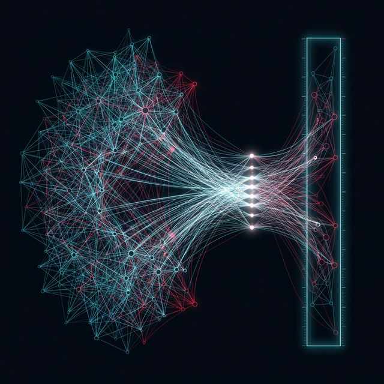
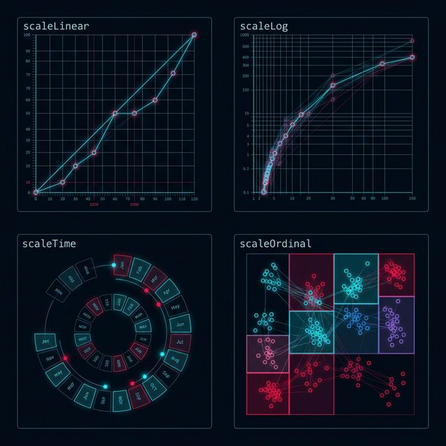
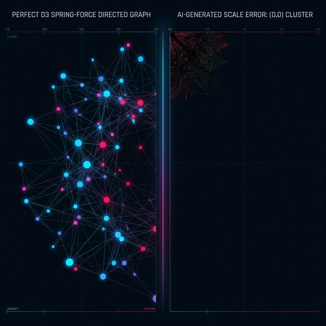

## 模块 3: 像素的绝对支配——D3.js (50 分钟)
<!-- BUDGET: 2700 chars | SLIDES: ≥4 | STATUS: ok -->

欢迎来到真正的硬核地带。欢迎来到大神的领域：**Data-Driven Documents (D3.js)**。

> [VISUAL]
> *   **Slide**: S09d_D3_Forest
> *   **Asset**: 
> *   **Layout**: `Grid`
> *   **Scene**: 一片赛博朋克风格的原始代码数据森林，一把带有细致尺寸刻度的精密手术刀插在数据树干上。
> *   **Text**: D3.js：无人之境的原始森林

如果说 ECharts 是精装修的高级餐厅，那么 D3.js 就是一片荒芜的原始森林，而你手里只有一板斧头和一堆未经处理的木材。D3 由《纽约时报》前图形编辑 Mike Bostock 创建并开源。它不提供任何现成的图表，它是一种彻底的指令式，也就是 **Imperative** 的武器。

> [VISUAL]
> *   **Slide**: S10_D3_Mechanics
> *   **Asset**: 
> *   **Layout**: `Grid`
> *   **Scene**: 一块完全空白的屏幕，和一把带有精确像素刻度的手术刀。
> *   **Text**: D3 字典里没有柱状图，只有线条、圆圈和算术。

在 ECharts 里，你只需要说 `type: 'bar'`，一根柱子就为你拔地而起。
而在 D3 里，你要画一根柱子，你得自己去算：这根柱子距离屏幕左边缘多少像素？宽度是多少个像素？如果数据是 100，它的高度又该是多少像素？颜色怎么填充？
在这里，你是上帝，你要掌管每一个像素的生死。

如果你把数据喂给 AI，让大语言模型为你写一段 D3 代码，AI 最容易在哪翻车？
答案是：坐标系、比例尺，以及 DOM 的生命周期。

### 3.1 被翻转的宇宙与 Margin 惯例

> [PHILOSOPHY] 计算机视觉的原点
> 在人类几千年的绘图历史中，无论是笛卡尔的草稿纸还是高中的数学课本，我们的 (0,0) 坐标原点永远在哪里？在左下角。Y 轴向上递增，代表着增长和生长。
> 但是对于浏览器、对于所有的屏幕发光机制来说，它的 (0,0) 原点，是屏幕的左上角！这就如同你从高空俯瞰大地，原点在西北角，Y 轴向下延伸。

> [VISUAL]
> *   **Slide**: S10b_Inverted_World
> *   **Asset**: 
> *   **Layout**: `Grid`
> *   **Scene**: 以颠倒重力法则的视角俯视大地，建筑像钟乳石一样从天空向着地面下发疯狂生长。
> *   **Text**: 违背直觉的倒置画布

对于初学者来说，这绝对是违反直觉的。如果你的数据里某个数值从 0 变成了 50，在浏览器眼里，相当于它朝屏幕的正下方坠落了 50 像素。这就是违背直觉的倒置宇宙。

> [VISUAL]
> *   **Slide**: S11_Inverted_Universe
> *   **Asset**: 
> *   **Layout**: Split
> *   **Scene**: 左侧是人类习惯的左下角原点向上生长的柱子。右侧是浏览器左上角原点，柱子像钟乳石一样从天花板倒挂下来。
> *   **Text**: 从天花板倒挂的钟乳石

如果你要求 AI 画柱状图，加上堆叠、响应式标签、悬停动效，只要它不理解翻转宇宙，不精通坐标轴的数学投射，它写出的代码就是一团无法 debug 的乱码。
这也是为什么，真正的可视化专家从不畏惧 AI，因为他们知道 AI 在哪里必然会跌倒。除了倒置宇宙，大模型最容易忘记的第二件事，是边距惯例约束，也就是大名鼎鼎的 **Margin Convention**。
SVG 可不会像 Word 文档那样自动给你留出页边距。如果你直接从 `(0,0)` 坐标开始画你的 Y 轴，你所有在坐标轴左侧的文字标签，比如“100万”、“50万”，统统会被屏幕左边缘无情地切断。

> [VISUAL]
> *   **Slide**: S11b_Margin_Cutoff
> *   **Asset**: 
> *   **Layout**: `Grid`
> *   **Scene**: 一张完全没有留白边距的可视化图表，左侧和顶部的坐标系文字标签被边缘切断了。
> *   **Text**: Margin Convention 的边缘裁切预警

> [TECH NOTE: Mike Bostock 本人的防坑设定]
> 为了解决这个问题，Bostock 亲自推行了 D3 Margin Convention。你必须在画布的最外层预留出 `top, right, bottom, left` 的安全空地。然后在内部再挖出一个 `<g>`（Group 群组）容器来进行实际的绘画。这就像你画画前，先用美纹纸把画板的四周贴起来一样。当你复查 AI 的代码时，第一眼就是要看它的画布初始化是不是严格遵守了 Margin 惯例。如果没有，立刻打回重做，否则后面的坐标轴一定会出界。

### 3.2 翻译官：比例尺 (Scale) 的魔法

人类世界的数据是极其宏大的：地球到月球有 38 万公里，某大V的粉丝有 1000 万 个。
而你的那块可怜的画布，只有 800 个像素宽、600 个像素高。

> [VISUAL]
> *   **Slide**: S12_D3_Scales
> *   **Asset**: 
> *   **Layout**: Split
> *   **Scene**: 左侧是庞大的数据空间 (Domain: 0 到 10,000,000)。右侧是狭窄的屏幕像素轴 (Range: 0 到 800)。两者之间架起一座闪躲着光芒的天桥，叫做 `scaleLinear`。
> *   **Text**: 比例尺：填平现实与屏幕的天堑

D3 解决这个落差的核心构件，是各种比例尺映射函数，也就是英文中的 **Scales**。可以说，比例尺是整个 D3 大厦中最重要的一根承重墙。

在代码中，你需要声明一个现象比例尺。它永远包含这两重属性：
- **`Domain` (定义域)**：代表着现实世界的数据范围。比如 `[0, 1000万]`。
- **`Range` (值域)**：代表着屏幕上的像素空间。比如画布的宽度 `[0, 800]` 像素。

当你在这两者之间建立起 `d3.scaleLinear()` 的映射关联后。每当你把一个真实数据，比如“500万”，丢给这个比例尺函数算一下。它就会极其精准地返回给你一个屏幕像素值 `"400"`。
这就是为什么不管多庞大的数字，都能完美塞进你那个小屏幕的数学本质。

但是，真实世界的问题从来不是这么简单。

> [VISUAL]
> *   **Slide**: S12b_Wealth_Disparity
> *   **Asset**: 
> *   **Layout**: `Grid`
> *   **Scene**: 一根直破天际的超级散点图光柱，而底部却密密麻麻无奈地挤着几万个如同灰尘般的微小目标数据。
> *   **Text**: 贫富差距尺度带来的视觉塌陷

> [CASE STUDY] 贫富悬殊的可视化灾难
> 假设你需要开发一个图表，展示各国王者的个人财富。老百姓可能几万存款，马斯克有两千多亿。
> 如果你告诉 AI 去使用默认的线性比例尺 `scaleLinear`。马斯克那根柱子会瞬间顶满整个屏幕高度，而剩下的几千万普通人的柱子，由于数值相差几百万倍，会被极度压缩成完全无法分辨的 0.001 像素，在屏幕上变成一条看不见的死线。

面对极端分化的指数级数据，怎么处理？
此时，作为发号施令的架构师，你就必须大喊一声：换武器！

> [VISUAL]
> *   **Slide**: S13_Scale_Types
> *   **Asset**: 
> *   **Layout**: `Split`
> *   **Scene**: 罗列出四种主要的比例尺类型及其用途。
> *   **Text**: **List**: 应对不同数据的比例尺弹药库

你必须要运用四种同等级的高阶比例尺，而不是死抓着线性不放：

1.  **指数/对数比例尺 (`scaleLog` / `scalePow`)**：专为镇压数量级极端分化而生。对数比例尺可以让 10、100、1000 之间的视觉跨度保持绝对相等的距离，它是展示财富差距和病毒传播曲线的致命武器。
2.  **时间比例尺 (`scaleTime`)**：如果你的 Domain 从 1 月 1 号横跨到 12 月 31 号。你不能用线性数字去切分月份，这会遇到闰年、大小月的灾难。时间比例尺底层封装了内置日历算法，能把真实的时间对象转化为像素点。
3.  **序数发散比例尺 (`scaleOrdinal`)**：如果你要给中国的 34 个省级行政区分配不同的颜色。那根本不关空间长度的事。它的 Domain 定义域是这 34 个省份的名字，而 Range 值域则是一堆类似于 `#FF0000`, `#00FF00` 这样的十六进制颜色代码池。D3 会自动发牌一样把颜色分发下去。
4.  **分段比例尺 (`scaleBand`)**：画柱状图时用来计算类别柱子的宽度及间隙的利器。

> [VISUAL]
> *   **Slide**: S13b_Scale_Scroll
> *   **Asset**: 
> *   **Layout**: `Grid`
> *   **Scene**: 一个漂浮在深邃虚空中的魔法卷轴，上面流转着 scaleTime, scaleLog, scaleBand 等高阶函数的代码铭文。
> *   **Text**: 上帝的兵器谱：D3 比例尺清单

在 Vibe Coding 的流程中，如果你手握这份比例尺清单，你就能在 AI 开始胡乱画线之前，在提示词中一语道破天机：“X 轴使用 `scaleTime` 映射日期，Y 轴强制使用 `scaleLog` 对数比例尺解决巨量差异，气泡颜色使用 `scaleOrdinal` 敲定类型映射。”

### 3.3 数据绑定的封神之作：Enter, Update, Exit

> [VISUAL]
> *   **Slide**: S13b_Data_Join_Intro
> *   **Asset**: 
> *   **Layout**: `Grid`
> *   **Scene**: 一群带有数据的发光粒子，正在与屏幕上的空壳矩形，逐个开展匹配并寻找宿主的过程。。
> *   **Text**: Data Join：数据与像素的完美咬合

如果说比例尺是 D3 的承重墙，那数据绑定机制，也就是整个学界都在讨论的 **Data Join**，就是让 D3 彻底封神的生命之源。

在早期的 jQuery 时代，如果你想要在页面上画 10 根柱子，你要写一个 `for` 循环，然后手工调用 10 次 `document.createElement('div')`。
如果过了几秒钟，后端服务器传来最新数据说：现在只剩 8 根柱子了，而且里面有两根柱子的颜色变了。
那时候的前端工程师会疯掉，他们必须去手动查找：“到底是哪两根柱子消失了？我得把它们的 DOM 节点删掉。” 这种 DOM 手工管理极为繁琐、极易引发内存泄漏。

而 D3.js 提出了一个震撼整个前端界的哲学：数据驱动文档，也即是它的全称 **Data-Driven Documents**。

D3 不再让你手动管理 DOM 的增删改查。它让你把“数据数组”和“DOM 节点”像两片齿轮一样死死咬合在一起。从此以后，DOM 节点的生死，完全由数据决定。

为了处理数据与 DOM 之间数量上产生的不匹配，Mike Bostock 设计了一个至今被奉为圭臬的“三态生命周期”。

> [VISUAL]
> *   **Slide**: S14_Data_Join_Lifecycle
> *   **Asset**: 
> *   **Layout**: `Split`
> *   **Scene**: 左侧显示数据的小球，中间是一条时间线，右侧是根据小球数量变化而自动生灭的柱形图。屏幕核心逐条罗列三大状态机制。
> *   **Text**: **List**: 数据驱动的三态轮回 (The Data Join)

在 D3 体系中，当你执行 `selectAll('rect').data(myData)` 之后，整个图表世界分化出了三个平行宇宙：

1.  **Enter（进入态·无中生有）**：
    数据比 DOM 多。例如：页面原本空空如也（0 个节点），现在传入了 10 条数据。D3 会立刻计算出差值是 10。这多出来的 10 条数据，就处于 Enter 状态。你需要做的是：顺势调用 `.append('rect')`，为其创建出 10 个崭新的空白矩形。
2.  **Update（更新态·旧貌换新颜）**：
    数据等同于现有的 DOM 节点数，或者这些旧节点被新数据覆盖了。例如：原来有 10 根柱子高度分别是 50，现在传进来的新数组变成 60。D3 会抓住这 10 个被更新的实体，你要做的就是：调用 `.transition().attr('height', d => d.value)` 让它们动画过渡到新的高度。
3.  **Exit（离开态·灰飞烟灭）**：
    DOM 节点数比数据多。例如：原本有 10 根柱子，系统发生了数据过滤，新数组只剩下 8 条。由于多出了 2 根失去对应躯壳的旧柱子，这 2 个无家可归的节点立刻进入 Exit 状态。你需要冷血地调用 `.remove()` 将它们从屏幕上彻底抹杀。

> [VISUAL]
> *   **Slide**: S14b_React_Inheritance
> *   **Asset**: 
> *   **Layout**: `Grid`
> *   **Scene**: D3 三态循环的数据流转动画慢慢重影，演化出了著名的 React 标志，象征着前端工程哲学的隐秘传承。
> *   **Text**: 伟大的哲学共见

> [STORY TIME] 历史的隐形影响
> 你可能会好奇，这几个极其枯燥的英文单词为什么伟大？由于这种声明式映射生命周期的威力实在过于显赫，几年之后，一个名叫 React 的风靡全球的前端框架横空出世，其底层 Virtual DOM 的 Diff 更新哲学，与 D3 的 `Enter/Update/Exit` 几乎如出一辙。可以说，D3 是现代前端工程化的先知。

作为大模型的驾驭者，如果你不理解这这三个步骤，一旦发生数据源更替的更新动画，你会发现你的旧柱子根本不消失，新柱子又无限压在上面。你对着 AI 框无能狂怒是毫无意义的。你只需用极其专业的口吻指出：“你遗漏了对 exit 集合的 `remove()` 处理。”

### 3.4 选择集回调：`d => d.value` 的绝对降维

> [VISUAL]
> *   **Slide**: S15_D3_Arrow_Function
> *   **Asset**: 
> *   **Layout**: `Grid`
> *   **Scene**: 一群由代码组成的密密麻麻的小人，各自抱着属于自己的一个小黑板 `d`（代表 Data），小黑板上写着自己的薪水数值。
> *   **Text**: 一切尽在匿名函数 `d => ...` 之中

在 D3 中，你在给图表设置颜色、设置高度时，从来不会写死 `height: 50` 这种东西。你会写出形如：
`.attr('height', d => yScale(d.salary))`

这个不起眼的 `d =>` 就是 D3 的神髓所在。
当你把一个有一万条 JSON 对象的数组，全部 `Join` 给了一万个散点图小球的 DOM 后。这个回调函数里的 `d`，就代表着，**正在被渲染的那个小球，所背负的专属数据**。

无论数据有一千条还是十万条，你在写这段代码时，你的视角瞬间降级坍缩到了“一个单独细胞”的显微镜视角。你想决定这颗细胞的颜色？你只需要调取属于它的专属隐性基因 `d.type` 交给比例尺去渲染即可。这是一种上帝般的批量微控。

> [VISUAL]
> *   **Slide**: S15b_Microscope_Control
> *   **Asset**: 
> *   **Layout**: `Grid`
> *   **Scene**: 极其清晰的高倍显微镜镜头下，是一个微型发光数据球体，其细胞核里流动着一串专门赋予给它的专属 JSON 数据流。
> *   **Text**: 微观视角下的绝对主宰

> [PHILOSOPHY] 机器代码与人文映射
> 许多人抱怨 D3 太底层、太难学。但正是因为底层的绝对支配力，使得任何跨越想象的艺术叙事成为可能。ECharts 的宇宙中只有标准菜单；但在 D3 的微观主宰下。你可以把人口数据变成一滴滴泪水的形状往下落，也可以将交通枢纽画成如星系般自旋的网络。
> 当你学会以像素级的精度去指使大语言模型时，你就真正挣脱了工具的囚笼，进入了可视化极度自由的创作境地。

通过理解“倒置画布”、“比例尺天桥”以及“三态循环”，你已经夺走了大厨的刀。
当你在下一次课上，面对复杂的数据结构，并企图写一段前无古人的定制时动画时，不论大模型给你生成的代码有多么晦涩冗长，你的眼底只用过滤这几样核心骨架。

> [VISUAL]
> *   **Slide**: S15c_Hackers_Animation
> *   **Asset**: 
> *   **Layout**: `Grid`
> *   **Scene**: 极客的双手在悬浮键盘上敲击，创造出一道由纯代码转化为流光溢彩且不受任何束缚的动态数据爆炸轨迹。
> *   **Text**: 挣脱大厨的工具囚笼

> [ACTIVITY]
> *   **Type**: `Practice`
> *   **Duration**: `35min`
> *   **Desc**: **D3 数据绑定生命周期推演**。
>   给出一段 D3 进入、更新、退出的骨架代码，但是故意隐去关键的 `enter().append()` 和 `exit().remove()`。讲师给出一组数据变化的过程（例如 `[10, 20]` 变为 `[20, 30, 40]` 然后变为 `[40]`）。学员需要在纸上画出每一个阶段 DOM 树上存在的节点数量，并标注哪些处于 Enter 态，哪些处于 Update 态，哪些处于 Exit 态。完成后，使用 Cursor 向大模型复述刚才的推演逻辑，要求模型将其转化为带有彩色过渡动画的真实 D3 代码并在浏览器展示。

不过，在现实操作中，大模型翻车的概率极高。当你面对一片惨白的浏览器时，如何用非暴力的方法引导 AI 查漏补缺？这就是我们最后一个模块的话题——系统级的排错哲学。

> [VISUAL]
> *   **Slide**: S15b_Agentic_Failure_Example
> *   **Asset**: 
> *   **Layout**: Split
> *   **Scene**: 左侧是完美的 D3 弹簧力导向网，右侧是 AI 生成的一坨因为比例尺跑偏而挤在左上角 (0,0) 的混乱黑团。
> *   **Text**: 大模型的常见翻车现场
