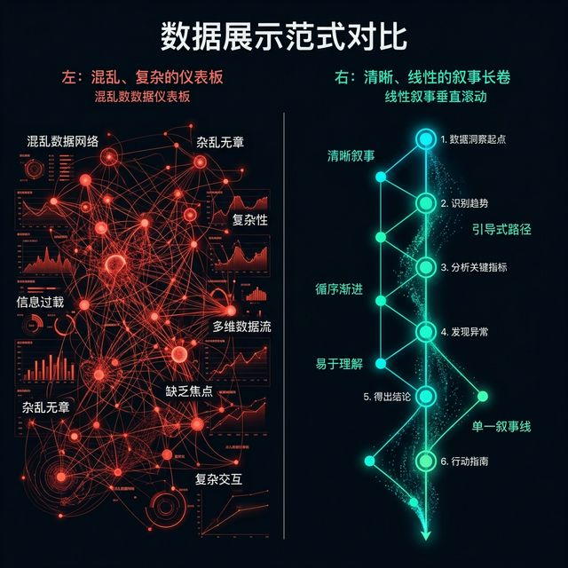
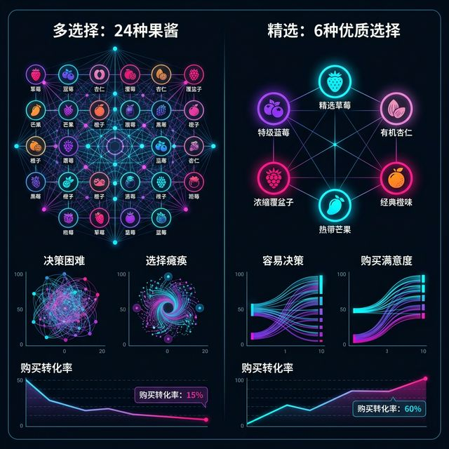
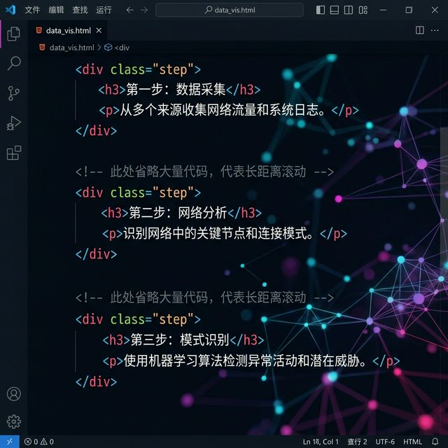
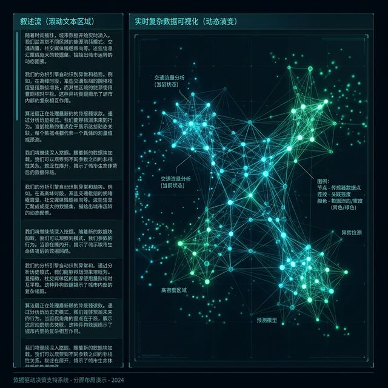
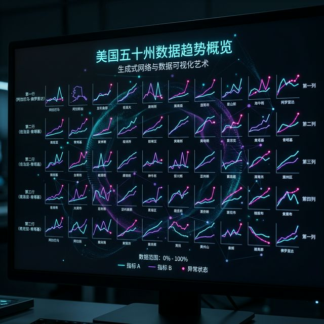
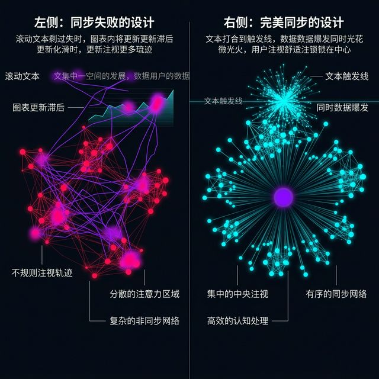
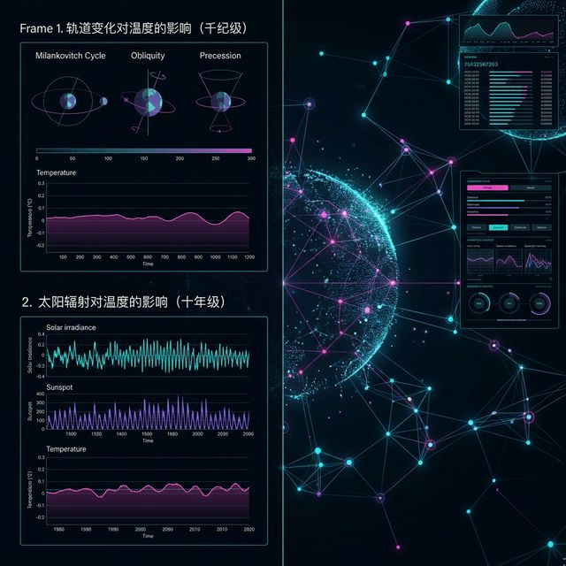
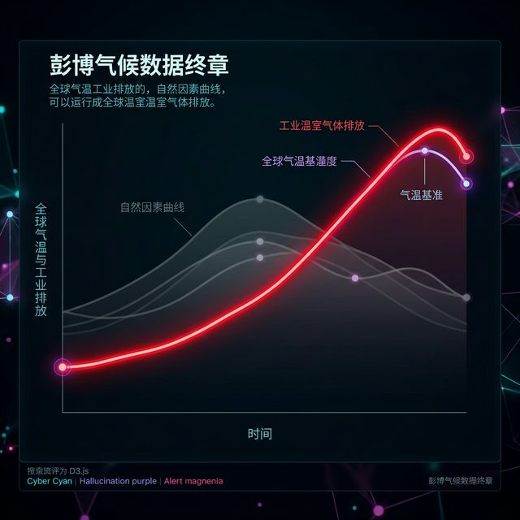

## 模块 2: 夺回叙事权——Scrollytelling 与电影级编导 (60 分钟)
<!-- BUDGET: 10800 chars | SLIDES: ≥20 | STATUS: done -->

**探索式大屏的失败与叙事权的丧失**

我们刚才讨论了改变、选择和导航。毫无疑问，这三把梭子是极为锋利的武器。但各位一定要清醒地认识到一件事：刚才我们讨论的这套逻辑，主要是给数据分析师准备的"探索式仪表盘"（Exploratory Dashboard）。

在企业内部的 BI 系统（比如 Tableau 或者 PowerBI）里，分析师的职责就是去"找异常"。你扔给他几十个带有复选框、下拉列表和日期范围选择器的庞大图表，由他自己去玩。因为他的工作就是去挖掘，他有强烈的动机和充足的耐心去面对陡峭的交互学习曲线。这也叫交互。

但这，绝对不是大众媒体与数字媒体艺术。

> [VISUAL]
> *   **Slide**: `S07_Dashboard_vs_Story`
> *   **Layout**: `Comparison`
> *   **Scene**: 左侧是典型的拥挤仪表盘，写着 "Let readers explore"; 右侧是一条有着清晰起承转合时间线的"单行道"叙事长图，写着 "Guide readers through"。
> *   **Text**: "放弃控制权，也就放弃了注意力"
> *   **Asset**: 

对于大众读者而言，他们的耐心只有 5 秒钟。如果你在一篇讲述气候变化或疫情传播的新闻主页上，给出一个有着 50 个旋钮、同时展示了十几个散点图的庞大控件，并且不提供任何解释，他们通常只看一眼就会跑掉。

在这种场景下，"赋予读者极大的自由探索权"是一句伪善的口号。不仅是伪善，更是对注意力的不负责任。这使得原本震撼的数据故事，沦为了一堆没有主心骨的数字碎片。

[PHILOSOPHY: 叙事的独裁主义]
信息架构师 Richard Saul Wurman 曾说："信息的组织方式决定了信息的意义。"
当你把所有的选项铺开，你其实并没有在传达信息，你只是在转移责任。真正的叙事高手，敢于对信息进行"独裁式的删减"。我们只提供一条或者几条精心的叙事主线，带领读者在正确的时间，看到正确的数据切面。这种"限制"，反而带来了极致的沉浸感。

> [VISUAL]
> *   **Slide**: `S07b_Paradox_of_Choice`
> *   **Layout**: `Full`
> *   **Scene**: 一张图，左边是给了用户 24 种果酱选择的超市货架（导致用户选择困难而放弃购买），右边是只给了 6 种经典口味的货架（购买率大幅上升）。
> *   **Caption**: 交互设计中的"选择悖论"（Paradox of Choice）同样适用。
> *   **Asset**: 

在行为经济学中，这被称为"选择悖论"。如果你赋予用户 50 个维度的切片筛选项，最终的结果通常是：用户一个都不选，直接关掉网页。

这就是近年来横扫《纽约时报》、《卫报》、甚至是国内一线老牌媒体最高规格式数据表达手法出现的原因：我们需要重新掌握叙事的主导权。也就是我们要讲的核心：**Scrollytelling（滚动叙事）**。

**Scrollytelling：滚轮就是你的播放键**

> [VISUAL]
> *   **Slide**: `S08_Scrollytelling_Concept`
> *   **Layout**: `Split`
> *   **Scene**: 左半边是一个巨大的向下滚动的鼠标滚轮图标；右半边是齿轮啮合的模型：鼠标向下滚动引发了下方时间轴的推移（X轴），镜头视角的拉近（Z轴），以及核心数据的变化（Y轴）。
> *   **Text**: "Scrollytelling: 滚轮就是你的播放键"
> *   **Asset**: 

滚动叙事巧妙地完美结合了 Scroll (滚动) 和 Storytelling (说故事) 两个单词。

在你们从小熟悉的传统网页中，"滚动"只是为了看下面剩下的文字。屏幕的滚动条只是一个机械的物理位移工具。你甚至可以通过空格键、PageDown 键瞬间跳跃。但在 Scrollytelling 的魔法世界中，**用户的向下滚动，是触发整个故事时间线推进的唯一引擎。**

读者在这个过程中会感到一种独特、极具迷惑性的强烈参与感。
他滑得快，如同快进，数据的变迁剧情就走得快。
他停住深思，那张包含着数十万个数据点的庞大地图，就在他眼前悬停静止。甚至有些元素还在进行细微的呼吸式动画。
当他感到不可置信，想要复盘数据时，他只需要向上回滚，整个数据宇宙的演化过程就像时间倒流般丝滑回退。

这是一种从未有过的人机交互范式：用户认为自己掌握了 100% 的播放控制权，但实际上，他们正毫无反抗地走在导演精心铺设的那条唯一、单向、且充满戏剧张力的单行道上。

> [VISUAL]
> *   **Slide**: `S08b_The_Illusion_of_Control`
> *   **Layout**: `Flow`
> *   **Scene**: 玩家在驾驶一辆过山车，过山车有一个方向盘。玩家以为自己在控制方向，但其实过山车是死死卡在铁轨上的。
> *   **Caption**: 滚动叙事的双重隐喻：你以为你在探索，其实是被引导。
> *   **Asset**: 

这种"控制错觉"（Illusion of Control）正是滚动叙事最迷人的心理学基础。读者讨厌被强制填鸭式的观看 5 分钟的微纪录片，但如果这 5 分钟的内容是由他们手指一次次拨动滚轮来"解锁"的，他们的多巴胺系统就会给出正向反馈，他们会认为这是自己"探索"出来的洞察。

[CASE STUDY: 纽约时报 "Snow Fall" 的开创性长卷]
我们必须向这项技术的祖师爷致敬。2012 年，《纽约时报》发布了一篇名为《Snow Fall: The Avalanche at Tunnel Creek》的多媒体特稿。
这是数字新闻史上的一道分水岭。这篇关于雪崩灾难的长篇报道没有采用"上一页/下一页"或者点击播放视频的俗套设计。当读者滚动鼠标时，背景中连绵的喀斯喀特山脉 3D 拓扑图会自动根据文字的进度旋转、推近；雪崩的路径会像白色的恶魔一样顺着山谷蔓延。读者根本不需要点击如何播放多媒体，阅读文字这一简单的往下滚动的行为本身，直接接管了山谷模型的物理引擎。

这篇报道不仅斩获了普利策奖，更重要的是，它直接让 "Scrollytelling" 这个概念在全行业彻底雪崩式地爆发开来。随后，包括用来解释"病毒是如何扩散的"、"中国高铁网的扩张血脉"等所有重磅长文，滚动叙事成为了全媒体世界中处理极高密度、且带有极强时空演化特征议题的最顶级重器。

**解构神迹：Scrollytelling 的三层神经架构**

那么，这种仿佛让网页拥有了自己生命的魔法，在底层是如何运转的？

当我们抛开那些炫目的视觉包装，以一个全栈数字媒体架构师的角度去剖析它时，这实际上构成了一个非常经典的、界限分明的**三层架构模型**：叙事层、触发层、渲染层。

> [VISUAL]
> *   **Slide**: `S09_Three_Layer_Architecture`
> *   **Layout**: `Flow`
> *   **Scene**: 一个三明治般的架构图。最上层是白色的文本方块（Narrative Layer）；中间是透明的、布满传感器的网格（Trigger Layer）；底层是一个庞大运转的显卡或 ECharts 引擎核心（Render Layer）。
> *   **Text**: "分解魔法：叙事、触发与渲染"
> *   **Asset**: 

**1. 叙事层 (Narrative Layer)**

这是飘拂在最表层的、供读者直接阅读的"那一块块文字解说板"。
它们就像是舞台上演员背诵的台词稿本。在 HTML 的结构里，它们通常只是一系列叠在一起的 `div` 容器，我们通常给它们起名叫 `.step`（步骤）。

> [VISUAL]
> *   **Slide**: `S09b_Narrative_Divs`
> *   **Layout**: `Split`
> *   **Scene**: 在深色主题编辑器（如 VS Code）中高亮显示的 HTML 代码片段。左侧带有数字行号，展示几个包裹着文本、带有 `class="step"` 的透明 div 容器，它们之间用夸张的空白间距（如 `margin-bottom: 100vh`）隔开，暗示了物理滚动距离的跨度。
> *   **Caption**: 叙事层本质：裹着巨大空白的文本盒子。
> *   **Asset**: 

你可以想象有十块玻璃板从上到下排布，每一块写着一句话。块与块之间通常有满屏高度的透明间距。每当你向下滑动，一段新的文本块进入这片真空，再穿过屏幕，最后从顶部离开。这无聊，本身没有任何交互能力。

**2. 触发层 (Trigger Layer)**

这是最核心、也最神秘的一层。它就像隐藏在百老汇舞台暗处的摄影滑轨与测距仪。

在过去的几年里，前端工程师为了实现滚动监听，受尽了浏览器的折磨。原生 JavaScript 中的 `window.onscroll` 事件会以每秒成百上千次的频率疯狂触发，这被称为"计算雪崩"。如果不进行繁琐的防抖（Debounce）处理，页面很快就会卡顿甚至崩溃。

> [TECH NOTE: 性能黑洞与 Intersection Observer]
> 早年监听元素是否进入视野是通过不断调用 `getBoundingClientRect()` 计算绝对坐标的，这会引发浏览器极高代价的重排。直到 HTML5 时代引入了 `Intersection Observer API`，将相交检测下放给了底层异步线程，滚动监听终于摆脱了卡顿的诅咒。

而现在，整个工业界最流行的、建立在这些底层 API 之上几乎垄断标准的"神经架构"，叫做 **GSAP 的 ScrollTrigger 插件**，或者更轻量的 **Scrollama.js**。

> [VISUAL]
> *   **Slide**: `S10_Trigger_Mechanism`
> *   **Layout**: `Split`
> *   **Scene**: 左半边是一张浏览器窗口的示意图，上面有红色的虚拟横线标记着 `start`（触发位）和 `end`；右半边是简单的一段核心 JS 代码：`ScrollTrigger.create({ trigger: ".step", onEnter: () => chart.setOption(...) })`。
> *   **Caption**: "当文本行触碰触发线，就是魔法爆裂的时刻"
> *   **Asset**: 

这是一个永远潜伏在暗中观察的监听网络。当它发现屏幕上方那根看不见的水位线，正好碰到了"第三段解说文字（`.step-3`）"时，它犹如一个专业的打板导演，瞬间向底层的图表引擎发送一条全频段开机信号："Action！执行第三幕的变化！"

**3. 渲染层 (Render Layer)**

这是位于最底层的、重型的舞台特效组。

在这里，躺着诸如 ECharts、D3 图表内核或者是 Canvas 像素绘制系统这样庞大的渲染引擎。在没有收到信号时，图表会安静地停留在它的初始状态（比如 1990 年的数据散点分布，所有的绘制管线都处于休眠省电模式）。

当触发层那个无形的导演大喊 "Action" 时，渲染层就会立刻如同被电击一般苏醒。ECharts 的 `setOption` 方法会被瞬间调用。
原本静止在 1990 年的散点地图，开始疯狂运算每一颗粒子的位移轨迹，在短短的 1.5 秒内，将所有的散点犹如被磁铁吸引一般，平滑、壮观地移动到 2020 年它们该去的坐标位置。

**(Pause: 2s)**

大家要注意这三层之间的绝妙关系：它们是**完全解耦（Decoupled）**的。
叙事层是个手无缚鸡之力的说书人；渲染层是个肌肉发达、没有自我意识的打手；而触发层，是那个脑力超群、精准发号施令的黑帮军师。这种工程界优雅的设计模式，支撑起了全部现代数字新闻的长卷辉煌。

**Pinned 固定粘性架构：空间利用的极致暴政**

刚才我们讲清了神经是怎么传递的，现在我们要讲讲肉体是怎么排布的。

几乎 90% 以上成功的 Scrollytelling 网页，都不约而同地采用了一种霸道、对屏幕空间贪婪的排版架构，我们称之为 **Pinned Architecture（固定粘性架构）**。

> [VISUAL]
> *   **Slide**: `S11_Pinned_Architecture`
> *   **Layout**: `Split`
> *   **Scene**: 一个动态 GIF 网页交互录屏演示。网页分为左右两列。不管读者怎么疯狂地上下滚动鼠标滚轮（左侧深灰色的文字解说区 `.step` 在像瀑布一样飞速上下穿梭经过），右侧占据了整整全屏 60% 主视觉宽度的那个巨大彩色数据图表（`.graphic` 容器）却纹丝不动地死死钉牢在屏幕右边！它不仅不跟着网页一起被往上卷走，反而在原地淡定地做着内部图表的数据变幻（例如散点在聚拢又散开）。
> *   **Text**: "流水的字，铁打的图"
> *   **Asset**: 

这种排版为什么被奉为神作标配？
大家回想一下你们看过的那些老旧教科书里的粗劣网页：看一段长文本，然后要艰难地用鼠标拖着滚轮往上爬十几页，就为了看一眼配图的折线长什么样。看完之后，又要拖着鼠标滚几十页回去找刚才读到哪儿了。在手机那可怜的窄小屏幕上，这种"图文分离"的反复横跳式阅读，简直就是对读者的满清十大酷刑。读者只需要在脑海里丢失 0.5 秒的短期记忆锚点，整篇深度长文的心流就会彻底崩断稀碎。

Pinned 架构不仅是设计，它是对重力与物理直觉的彻底颠覆。

通过 CSS `position: sticky`，图表区就像是被用一把五十米长的大钢钉，狠狠地从屏幕玻璃上方直接钉死了在视网膜中心。
**右边的图是被冻住了 Y 轴位移的，只允许进行 Z 轴（数据深度展现）和颜色改变的特效动画；**
**而左边的文字则是疯狂被拉扯的，它是流动的时光机。**

当这两种截然不同、极端的物理运动状态在同一个狭窄屏幕上被并置时，人类大脑会因这种视觉错位而产生一种绝妙的"时空穿梭感（Time-Warp Sensation）"。你会觉得你的鼠标滚轮不是在翻网页，而是在拨动一个巨大保险箱上的岁月刻度盘齿轮。

[CASE STUDY: Bloomberg 的"What's Warming the World?"]
大家来看彭博社的这个经典案例（播放 W05_Bloomberg.mp4）。
整个页面非常狭长。中心是一个带有全球温度上升趋势的极简折线图（被钉死了）。
当读者开始滚动，一行一行的大号黑色文字（比如："是因为太阳黑子吗？"，"是因为火山爆发吗？"）从图表底部的虚空深渊中升起，像幽灵一样飘过这根折线叠加在其上方，然后消失在顶端。
而每当一句针对原因的文字飘过屏幕正中心触发线时，被背景图钉死的折线图中就会瞬间长出另一条截然不同的黄色线（比如展示太阳辐射历史的数据线）去跟原始温度线进行比对交锋。

这种"把沉重庞大信息钉在原地作为底层大靠山，让非常轻量灵活的解说词像云彩一样从它上面快速飘过"的架构，完美解决了手机端局限的视口痛点，更是从心理学上压倒性地建立了数据在整个议题中身为"绝对不容置疑的客观真理法官"的宏大叙事权威地位。

**避免交互疲劳：小多图（Small Multiples）的呼吸空间**

然而，既然我们提到了用长图表重重大军压境，就不可以忽视另一个反面极端。

大家是不是觉得，既然 Scrollytelling 这么牛，那我们就把所有的页面都做成长达 200 个屏幕高度、带着 50 种繁杂的 ECharts 爆炸翻转动画的滚动地狱？

错了。大错特错。如果读者在十分钟内，面对的每一页往下滚都在发生翻天覆地的炫目地震变化，他们的大脑多巴胺体会迅速过载耗竭。这在 UX 领域被称为：**Interaction Fatigue（交互疲劳综合征）**。

> [VISUAL]
> *   **Slide**: `S12_Interaction_Fatigue`
> *   **Layout**: `Flow`
> *   **Scene**: 一张模拟读者心电图和注意力衰减的图表。前 3 个滚动特效，注意力达到波峰，到了第 10 个特效，注意力曲线像断崖一样跌入低谷，并配有警告图标："警惕：为了炫技而炫技，是毁灭故事最快的捷径"。
> *   **Asset**: 

如果一部电影全片两个小时全是在打碎玻璃、全是爆炸连天没有一秒钟安静对白，这就是不入流的烂片。我们需要留白。我们需要安静的呼吸节奏。

如何在这惊心动魄的数据连续滚屏拉锯战中、或者在那些拥挤且需要全景展示多个相同纬度微数据的特殊段落中，给读者的大脑提供一片可以缓慢歇息、宁静对比的视觉绿洲？

这个时候，我们请出经典可视化设计领域的祖师爷 Edward Tufte 在 40 年前提出的一个神级极简理念：**Small Multiples（小多图 / 细微多重组合图）**。

> [VISUAL]
> *   **Slide**: `S13_Small_Multiples`
> *   **Layout**: `Full`
> *   **Scene**: 屏幕上不是一个巨大复杂的动态折线图，而是由 50 个整整齐齐、大小如邮票般、排满屏幕网格阵列的极简迷你小折线图组成。每个图的 X 轴和 Y 轴比例完全一模一样，分别代表了美国 50 个大州。
> *   **Text**: "重复的力量：用空间维度替换时间维度的疲劳"
> *   **Asset**: 

什么是小多图？
与其在一个庞大的图表框架里，用 50 根缠绕交织在一起、互相打结得像一团乱麻的彩色面条线（为了展示 50 个州的新冠疫情爆发曲线），还强制读者去在旁边寻找那个眼花缭乱的图例（Legend）；
我不如直接在这个 Pinned 区域，老老实实用静态的方式，平铺画出 50 张一模一样大小的微型坐标系卡片网格。每一张卡片里只干净纯粹地画一条哪怕没有坐标轴数字的趋势走势线。

**(Pause: 2s)**

大家仔细琢磨一下这里面的降维心理学。
在刚才的乱麻图里，读者的眼球不得不在那根线和旁边的图例之间进行多达上百次的疯狂来回扫描跳跃。这会极具消耗人的工作记忆内存。
而在小多图的矩阵排布阵列前，所有的背景坐标轴环境变量全部被高度恒定统一化。读者的眼睛只需要非常放松地轻轻扫视过这 50 个邮票大小的方块格子，他们那经过上百万年进化发达用来在草原野外环境寻找异类危险源模式的神经识别视觉皮层网络，瞬间就能在 0.1 秒内自发地、不需要任何强制脑力运算负担地，直接敏锐地揪出那些形状特异、发生猛然抬升翘尾波动的那个出事州。

[TECH NOTE: 什么时候用动画滚动，什么时候用小多图铺开？]
这是一道高阶架构师必须秒答的选择题判断底线：
*   你要表达**时间维度的前后巨变、或者强烈深切的因果推演逻辑链条**？请毫不手软地祭出 Scrollytelling 长卷滚动触发，给它上强度。
*   你要表达的是**同一维度横向面上的分类项全景大比对评比、且分类项繁多（超过 8 个以上）**？立刻拔掉滚动特效的电源，老老实实给我用枯燥但一眼入魂的小多图（Small Multiples）进行平铺大军列阵。

只有当你深刻理解并且能够自由且精准地切换这两种犹如冰与火般截然相反的布局思维排布阵列方式时，你才算真正在这个名叫可视化的魔法世界里，成功夺回了从读者手中那极易流失、最被珍视却也最脆弱不堪的叙事大权！在这个权力游戏里，作为导演的你，必须是暴君更是智者。

刚才这一段，我们从底层解构了滚动的原理以及版式的暴政。但这只是停留在知道它为什么棒的阶段。接下来，我们要跨入真正痛苦也最迷人的深水区——在这三层的框架里，作为总导演的你，到底要在里面塞进什么？你怎么去写那张能够调动这一切机器的电影分镜密码书？这就是下一个极刑场挑战。

**数据交互的史前时代：从纸质图谱到 Shneiderman 准则的跃迁**

为了深刻理解 Scrollytelling 这种绝对统御架构为什么会在今天成为数字新闻与大厂数据汇报的绝对霸主，我们必须把时间拨回到数据可视化的"石器时代"。

在很长一段时间里，哪怕是到了 PC 时代早期，我们对数据的呈现依然停留在"数字化的纸张"阶段。工程师们只是用像素替换了油墨，把 Excel 里的静态折线图原封不动地搬到了网页上。这种展示方式，本质上仍然是一种"只读"（Read-only）的单向灌输。受众能够做的事情，仅仅是用眼睛去被动地扫描，大脑去痛苦地解析那些密密麻麻的图例。

直到 1996 年，人机交互领域的超级宗师 Ben Shneiderman 提出了那个至今仍被每一位交互设计师奉为圭臬的、著名的神级准则（The Visual Information-Seeking Mantra）：
**"Overview first, zoom and filter, then details-on-demand."**
（先总览，再缩放与过滤，最后按需提供细节。）

这十四个英文单词，像一道耀眼的闪电，彻底劈开了数据黑盒，开启了探索式数据分析（Exploratory Data Analysis, EDA）的黄金时代。

> [VISUAL]
> *   **Slide**: `S08c_Shneiderman_Mantra`
> *   **Layout**: `Flow`
> *   **Scene**: 一个漏斗形的视觉模型。最上方是庞大、密集的海洋般的数据云（Overview）；中间经过几道带有漏网和放大镜的屏障（Zoom & Filter）；最底部滴落下来的是几颗璀璨、带有详细参数标签的钻石（Details-on-demand）。
> *   **Text**: "寻找信息的神圣准则：Shneiderman 漏斗"
> *   **Asset**: 

在 Shneiderman 准则的指导下，各种复杂的商业智能（BI）仪表盘如雨后春笋般爆发。Tableau、Power BI 等重型武器开始统治整个企业级数据仓库。在这些专业工具里，用户被赋予了像神一样的权力。你可以随意拖拽维度、添加复杂的交叉过滤条件、随时进行上卷（Roll-up）和下钻（Drill-down）。

这是改变（Change）、选择（Select）、导航（Navigate）这三把梭子被运用到最极致的体现。在这个时期，"让用户自己去发现真相"被视为最高政治正确。

**不可忽视的深渊：自由探索的诅咒与迷失**

然而，当这些被设计给专业数据矿工使用的核武器，被不知轻重地搬运到面向普通大众的领域（比如公共卫生事件通报、全球气候变暖科普、或者是大范围的选情分析大屏）时，灾难降临了。

我们发现，大众面临着两个致命的门槛：
第一，**陡峭的学习曲线**。普通读者根本不知道那个藏在角落里的多选下拉框意味着什么，他们也不明白为什么点击了某个饼图的扇区，旁边的散点图会突然消失一半。
第二，**可怕的目标迷失（Goal Disorientation）**。在没有明确问题驱动的情况下，把一个没有受过严格统计学训练的普通人，扔进一个有着成千上万条记录、几十个维度切面的庞大数据集里，其结果必定是绝望的迷失。他们会在无意义的点击中耗尽耐心，最后什么结论也得不到。

这就像是你把一个毫无驾驶经验的新手，直接塞进了一架波音 747 的驾驶舱。你自豪地指着面前那密密麻麻、闪烁着数百个高深仪表的控制台说："看，我给了你全部的控制权，尽情探索这片蓝天吧！"
结果就是机毁人亡。

大众不仅没有"开飞机"的热情，他们甚至连阅读那长达几百页飞行手册的耐心都没有。这就残酷地引出了我们在现代可视化叙事中的最大痛点：**认知过载（Cognitive Overload）**。

[TECH NOTE: 认知负荷理论 (Cognitive Load Theory) 的审判]
在认知心理学中，人的工作记忆（Working Memory）容量是有限的，通常只能同时处理 $7 \pm 2$ 个信息块。
当一个充满了复杂交互控件的大屏强行塞入读者的视网膜时，读者的大脑需要拨出庞大的算力去理解"这个控件是如何操作的"（外在认知负荷 Extraneous Load），从而导致他们根本没有宝贵的剩余脑力去思考"这组数据到底揭示了什么深刻的社会规律"（相关认知负荷 Germane Load）。

这就是我们为什么要果断、甚至残忍地没收读者的"自由探索权"的根本原因。

当数字新闻的从业者们意识到这一痛苦的教训后，钟摆开始从"绝对的自由"猛烈地向"绝对的独裁"回摆。在这场壮阔的行业范式转移（Paradigm Shift）中，Scrollytelling 以其那独特、近乎暴君般的强制引导属性，登上了历史最高舞台。

通过 Scrollytelling，我们做到了完美的折中：
我们保留了通过代码直接渲染海量数据所带来的的视觉震撼力；但同时，我们狡猾地没收了所有的旋钮、开关和过滤器。我们用一根无形的绳索（也就是屏幕旁那根极不起眼的滚动条），牵着读者的手，精准、不容置疑地指引他们穿越这片庞大危险的数据迷宫。我们在合适的时间点，替他们按下高亮的聚光灯；我们在巧妙的转折处，替他们拉近上帝视角。

在这个过程里，你不再是一个提供工具的软件极客工程师。你是一位高超的布道者，一位掌控时间线与空间维度的电影级总导演。你通过精确安排的数据呈现节奏，一步步地瓦解读者的心理防线，最终将你想要迫切传达的核心洞见，像钢钉一样直接死死地凿进他们的思想深处。

**深入战壕：注意力工程学与彭博社神级案例拆解**

当我们明确了 Scrollytelling 那如同暴君般控制时间线的核心逻辑后，摆在我们面前的下一个陡峭的挑战是：如何让这种控制变得高级、无痕且不令人反感。

这涉及到了一个深奥的前沿交叉领域——**注意力工程学（Attention Engineering）**。

在传统的文章阅读中，读者的视线是像自由的流体一样，可以在字里行间任意跳跃、扫视的。但在 Pinned 固定粘性架构的滚动叙事中，我们残忍地在屏幕的极佳黄金分割点（通常是屏幕右侧 66% 宽广的主视觉区），钉死了一个巨大的、不间断高频动态变化的重型渲染图表。

此时，左侧流动的文字就不再是简单的说明文，它们是精妙的"引信"（Triggers）。

这要求我们对文本的撰写进行彻底的革命。你不能再用冗长、复杂的从句去描写数据。左侧的每一个文本块（`.step` 空白区块容器），必须被克制地压缩到极致。它们应该像锐利的军语指令一样简短：引出一个问号，抛出一个事实，或者发出一个极具煽动性的惊叹。

更为关键的是文字与图形变化的精准的**毫秒级空间同步率**。

> [VISUAL]
> *   **Slide**: `S11b_Sync_Precision`
> *   **Layout**: `Flow`
> *   **Scene**: 一张精密的视线追踪热力图（Eye-tracking Heatmap）对比。左侧是不及格的设计，文字经过很久了，图表才慢吞吞变化，用户的视线焦躁地在乱窜；右侧是顶级大厂的杰作，文字只要刚触碰到触发基准线（Trigger Hook），右侧的数据爆点就精准地同频如礼花般炸开，用户的视线舒服地被牢牢吸附在屏幕中央。
> *   **Caption**: "节奏的魔法：偏差半秒，就会彻底摧毁信任"
> *   **Asset**: 

[CASE STUDY: Bloomberg 的"What's Warming the World?" 深度解剖]
没有任何案例比彭博社（Bloomberg）的专栏《What's Warming the World?》更能完美地诠释这套注意力工程学法则。

大家来看屏幕上的大屏片段（播放 W05_Bloomberg_DeepAnalayis.mp4）。

开篇直接切入主题。页面载入时，首屏是一张展示自 1880 年以来全球观测温度变化的折线图。这条呈上升趋势的折线作为基准线（Baseline），通过 CSS `position: sticky` 属性被稳定地固定在页面正中心。

当读者向下滚动页面，第一行大字从下方浮现："Is it the Earth's orbit?"（是因为地球轨道偏差吗？）

> [VISUAL]
> *   **Slide**: `S11e_Bloomberg_Orbit_Sun`
> *   **Layout**: `Split`
> *   **Scene**: 彭博社案例截图。背景固定着真实的全球升温基准线。动画演示轨道变化与太阳辐射变化对应的温度影响曲线生发过程，呈现平缓的趋势。
> *   **Text**: "用数据驳斥直觉：当变量随滚动剥落"
> *   **Asset**: 

当这行文字越过屏幕中线（即触达 Threshold 触发线）的一瞬间，图表中立刻生发变动。一条代表地球轨道周期影响的平缓辅助线被绘制出来。通过强烈的视觉重叠对比，读者的大脑在极短时间内就能得出结论：轨道变化并非变暖元凶。无需过多文字辟谣，数据图形本身完成了自证。

紧接着，随着页面进一步滚动，第二行质问浮现："Is it the Sun?"（是因为太阳辐射吗？）
随即，第二条波动的黄色曲线被添加至视图中。它同样与那条不断攀升的真实温度基准线存在巨大偏差。

读者在这种"设问文本触碰触发线 -> 图表自动延展出新数据线 -> 形成排除法结论"的快节奏循环中，被牢牢卷入了数据的推演逻辑里。

> [VISUAL]
> *   **Slide**: `S11c_The_Grand_Finale`
> *   **Layout**: `Full`
> *   **Scene**: Bloomberg 案例的最终全屏截图。前期所有自然因素指标线均褪色为灰色底纹；代表工业温室气体排放的深红色粗实折线与真实温度基准线高度重合，直至画面最高点。
> *   **Text**: "真理的最后一击：高维数据现身绝杀"
> *   **Asset**: 

当读者的手指滚动到底部，人类温室气体排放的数据线才最终压轴出场。它与真实的温度上升基线形成了惊人的重合。此时，冗长的宣讲不再被需要。科学怀疑论在确凿的数据重叠视觉面前不攻自破。

这就是架构师的叙事编排手腕。它利用人类面对悬念的预期感，通过多次重复排除法的长卷铺垫叠加。最终在结尾处，利用最具压倒性的数据重叠完成论证的绝杀闭环。

**总结**：在这个案例中，Scrollytelling 不再仅仅控制图形的转换。它升华为把控受众心理预期、建立逻辑深度的现代数字媒体互动架构。

[PRACTICE: 拆解澎湃新闻"中国高铁网"]
为了确保掌握这种降维分析能力，我们将解剖刀伸向国内的案例：澎湃新闻的《中国高铁网的扩张》。
这部作品在架构上做了一个本地化变异：全屏背景贴图与浮动字幕（Full-background with Floating Captions）。

请大家打开 PPT 的第 12 页，或者扫描案例二维码。进行两分钟的快速沉浸式体验。
(在此期间走动，观察学生的屏幕)
好，时间到。现在收起手机。

请问在这个案例里，什么是被"钉死"（Pinned）的？什么是"流动"（Flowing）的？

大部分同学能答出：背景的中国地图是被固定的，而屏幕下方黑色拟态的文本解说框是随着界面滚动的。
这足够了吗？作为架构师，你们更要看到**时间坐标轴的倒挂**。

在传统图表中，时间通常映射于 X 轴。但这篇报道将时间（1998-2020）与"随着滚动条下拉的百分比"进行了物理绑定。
地图框架静止，但随着时间推移，高铁线路矢量动画如网络般在版图上蔓延。其播放进度帧（Playhead），是直接读取了当前滚动到达文章总长度百分比的 DOM 参数。

这意味着：只要大拇指停在一个特定高度，中国高铁在建设期间的某一个瞬间就被定格在了地图上。滚动动作赋予了读者控制时间流逝的互动错觉。拉拽滚轮的力度越深，基础设施建设的推进在视觉上就显得越有张力。

这就是 Scrollytelling 真正的吸引力所在。它将枯燥的宏观数据演化，转化为由读者亲手驱动播放的感官体验。这种将技术和心理深度结合的能力，是交互设计的关键考核点。

要想规划出每一帧都贴合认知的剧本，我们需要将视野从宏观概念拉回工程切面。这引出了下一个关卡：视听语言在数据维度的降维映射。

**微观对决：Scrollytelling 滚动叙事 vs Stepper 步进器的体验鸿沟**

在工业界，常有疑问："如果都是分步展示内容，为什么不直接使用带有『上一页/下一页』按钮的 Stepper 步进器组件？它的代码实现更为简单，无需引入复杂的滚动监听库。"

这是一个直击架构选型灵魂的拷问。

> [VISUAL]
> *   **Slide**: `S11d_Scroll_vs_Click`
> *   **Layout**: `Comparison`
> *   **Scene**: 体验对比图。左侧是一个带有点击圆点的传统网页轮播图（Stepper），旁配数据指标：包含明显交互阻尼，流失率较高。右侧为丝滑的纵向滚动轨道，配文：无缝衔接引发潜意识滚动，阅读停留时长与完成度均获提升。
> *   **Text**: "摩擦力的鸿沟：点击制造决断，滚动延续呼吸"
> *   **Asset**: 

要回答这个问题，我们需要理解不同输入设备在物理触发时带来的心理预期差异。

**首先是『摩擦力（Friction）』的区别。**
点击（Click / Tap）代表着明确的主动决策，它具有相当高的交互门槛。当读者看到并准备按下一个"Next"按钮时，大脑会本能地发起一次安全评估机制：这是否会造成界面跳转、是否会遭遇干扰信息。这种对结果位置预期不明所引发的审视，被称为交互体验中的『阻尼系数』；它在不经意间消耗了用户的耐心。

而『滚动（Scroll）』则是现代数字化生存中最为本能、且阻抗最低的操作。它的试错成本极低。由于滚动通常仅移动当前视口的局部，潜意识里它仍发生在“同一个安全沙盒”中。哪怕对下一屏内容预期不高，手指顺势的一滑也仅是一瞬的成本。

**其次是『控制连贯性（Continuity of Control）』的微观差异。**
步进器（Stepper）是一种离散态（Discrete）控制模块。从上一幕切换至下一幕时会存在突兀的断层。在这个物理间隙中，人类视觉缓存被刷新，原先的因果逻辑链条面临重新搭建的负担。

> [VISUAL]
> *   **Slide**: `S11f_Continuity_Of_State`
> *   **Layout**: `Flow`
> *   **Scene**: 状态连续性图示。连续的曲线坐标变换动效，强调读者大脑是如何在一整段无断点的补帧动画中建立因果关联的。
> *   **Asset**: 

相对而言，滚动叙事构筑的是高度紧密的连续态（Continuous）控制流。比如在彭博社案例里的趋势比较线，并非直接闪现到屏幕。它的轨迹绘制，受控于用户转动滚轮的精确进度——像拉开帷罩般徐徐展开。读者甚至可以通过回滚鼠标来回溯变量增加的过程。

两者的核心区别在于：
使用传统的 Stepper 点击器，你向读者提供的是结果状态的终极断片，这是一种强制呈现的结果告知模式。
而使用 Scrollytelling 长卷滚动系统，则是将读者亲自浸入事件演化的动态演进过程中（The Living Process of Becoming）。

当系统架构在面对核心数据表达时，如果选择了中断心流的点击式组件，是对叙事表现力的削减。在重要数据展示的战区，应尽全力去维护读者的连续认知心流。

---

> [TEACHING MOMENT]
> 当我们在讨论滚动监听时，你们认为浏览器是如何知道元素进入视口的？是通过不断计算坐标，还是有更底层的机制？

**底层揭秘：Intersection Observer 革命**
在早期前端开发中，滚动监听依赖于 `window.addEventListener('scroll')`。这是一种同步触发的事件，当用户快速滚动时，浏览器主线程会被密集的坐标计算任务淹没，导致严重的掉帧（Jank）。
为了解决这一性能瓶颈，W3C 引入了 `Intersection Observer API`。这是一种极其优雅的异步观察者模式。它将元素可见性的计算直接交给了浏览器的底层渲染引擎（而非 JavaScript 主线程）。

> [CASE STUDY]
> 请大家打开并运行示例代码仓库中的 `03_intersection_demo`。
> 尝试快速滚动页面，并打开 Chrome DevTools 的 Performance 面板。观察主线程的 CPU 占用率，对比旧版 `onscroll` 实现，体会原生 API 的性能降维打击。

`Intersection Observer` 不仅仅报告元素的出现，它还可以通过 `threshold` 参数配置触发的比例阵列。比如设定 `threshold: [0, 0.5, 1]`，意味着当元素刚进入视口、进入一半、完全进入时，都会精准触发一次回调。这就是我们能够在 Scrollytelling 中实现毫秒级精准对齐的硬件级保障。

**状态机架构：GSAP ScrollTrigger 与数据状态同步**
当我们拥有了高性能的视口监听后，下一步就是将滚动位置与数据图表的状态机（State Machine）进行绑定。GSAP（GreenSock Animation Platform）的 `ScrollTrigger` 插件是目前数据新闻界的工业标准。

> [VISUAL]
> *   **Slide**: `S11g_ScrollTrigger_StateMachine`
> *   **Layout**: `Split`
> *   **Scene**: 左侧显示 ScrollTrigger 的核心配置参数（trigger, start, end, scrub, toggleActions），右侧对应一个动态 ECharts 实例，随着左侧参数的高亮，右侧展现对应的滚动响应模式。
> *   **Text**: "工业标准：将 DOM 滚动深度映射为动画播放进度"
> *   **Asset**: 

在复杂的数据变迁中，图表通常具有多个确定的中间状态（Keyframes）。通过 `ScrollTrigger`，我们可以定义一个跨越多个视口高度的通用时间轴（Timeline），并将各个状态的数据变更挂载到时间轴的特定进度点上。当用户向下滚动时，图表会平滑过渡到下一个特征点；当用户向上回滚时，图表状态亦能精准回滚。这种不可逆时间在屏幕空间上的双向映射，是构建大型数据长卷的基石。

> [TEACHING MOMENT]
> 如果我们在滚动事件中直接调用 `chart.setOption` 进行全量重新渲染，会有什么后果？

正确答案是：这会直接抹杀所有的过渡动画。在 Scrollytelling 中，改变数据应当是一个增量更新（Incremental Update）的过程。我们需要深刻理解数据引擎对于差异（Diff）的处理机制，只传递变更的数据维度，让底层引擎自动计算路径并加上适当的缓动函数。

> [CASE STUDY]
> 小组讨论：如果我们要在一个固定的地图底板上，通过滚动分别展示 2020、2021、2022 年的数据层。你们会采用多图层叠加然后切换透明度的方法，还是采用单图层直接更改数据源的方法？为什么？

[CASE STUDY]
> 让我们来审视著名的新闻页面性能灾难——纽约时报的《Snow Fall》的早期版本。虽然它创造了 Scrollytelling 的神话，但在最初上线时，由于过度使用了非 GPU 加速的 DOM 属性（如基于 CPU 计算的 padding 或 margin 进行位移），导致许多低性能用户的浏览器直接崩溃。这是一项视觉上的胜利，却是工程架构上的败笔。

**性能守护：渲染流水线与硬件加速**
在构筑长卷时，架构师必须深刻理解浏览器的关键渲染路径（Critical Rendering Path）。为了保证滚动动画的丝滑（锁定 60 fps），我们必须严格遵循“仅仅修改能够触发 GPU 硬件加速的属性”这一原则。具体而言，绝对不要在滚动事件中改变引发页面重排（Reflow）的 CSS 属性（如 width、height、top、left）。
相反，应当强制使用 `transform: translate()` 和 `opacity`。现代前端引擎对这两个属性有特殊的优化层（复合层级 Compositing），允许它们跳过极其消耗算力的重排与重绘（Repaint）阶段，直接由显卡完成渲染计算。

[PRACTICE]
> 请团队的工程负责人检查代码仓库中图层位移的 CSS 规则。如果发现你的项目中仍在使用 `left` 和 `top` 进行位置动画，请立即全部重构为 `transform`。这是确保你的宏大叙事不在用户面前卡成 PPT 的底线规约。

在此基础上，架构师还要考虑各种设备和浏览器的兼容性差异，建立优雅降级（Graceful Degradation）的版本。当用户的系统不支持复杂的 WebGL 渲染时，应当自动回滚到静态的、性能开销极小的轻量化图表版本，确保任何受众都能无障碍地获取核心知识。这才是真正健壮的高可用数据工程。
