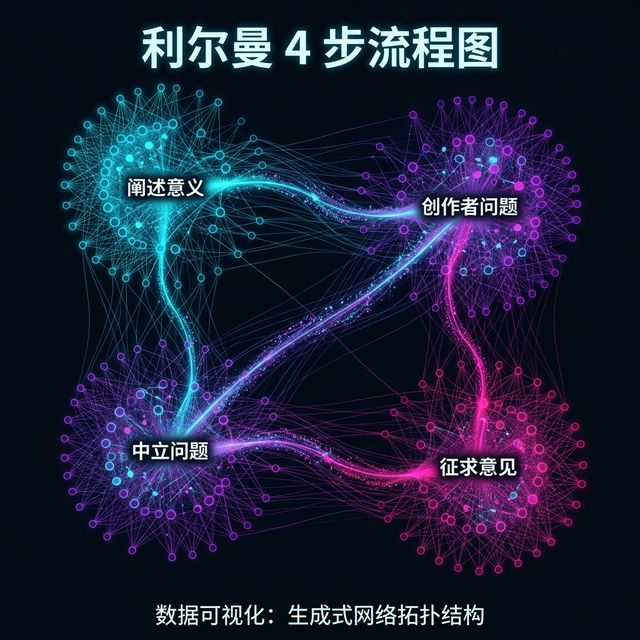

## 模块 5: 最终审判与反哺 (约 80 分钟)
<!-- BUDGET: 0 chars | SLIDES: ≥0 | STATUS: done -->

> [!NOTE]
> 本模块为纯 ACTIVITY 模块，涵盖三个实践环节：Vercel 部署上线实战、Peer Critique 互评大会和课程结业总结。讲授内容极简，仅含活动导入语和结课寄语。

> [VISUAL]
> *   **Slide**: `S05_Section_Finale`
> *   **Layout**: `Center`
> *   **Scene**: 一个舞台般的空间，多个数据可视化作品的光影投射在墙壁上。中央一个聚光灯缓缓亮起，照亮一个展示台，象征着作品即将接受公众的审视与评判。
> *   **Text**: "Module 5：最终审判与反哺"
> *   **Asset**: 

各位同学，此刻我们来到了这门课程最后的、也是最具仪式感的环节。在接下来的八十分钟里，你们首先要完成作品的最终上线部署，然后将接受来自同伴的专业评审，最后分享你们在整个 Vibe Coding 旅程中最关键的一条 Prompt 洞察。

> [TEACHING MOMENT]
> 八周前，我们从一个问题开始：为什么需要可视化？八周后，你们用自己的作品回答了这个问题。可视化不是让数据变得"好看"，而是让数据变得"可被感知"。技术栈会更新换代，AI 工具会不断迭代，但有一件事永远不会改变：人类需要看到抽象数字背后的人性故事。你们今天部署上线的每一件作品，都是这个信念的一次实践。

> [ACTIVITY]
> *   **Type**: `Workshop`
> *   **Duration**: `20min`
> *   **Desc**: Vercel 部署上线实战
> 
> **任务说明**：
> 1. 确认项目文件通过 Module 4 的**六项部署前自检清单**
> 2. 选择 GitHub Pages 或 Vercel 完成部署
>    - GitHub Pages: Settings → Pages → Source: main
>    - Vercel: Import → 选择仓库 → Deploy
> 3. 获取公网 URL 后，在**手机和电脑**上分别打开验证
> 4. 完善 `README.md`：声明数据来源、技术栈、团队分工和公网链接
> 5. 将公网 URL 提交至课程共享文档（教师提供链接）
> 
> **教师巡场重点**：检查常见部署错误（路径问题、数据文件遗漏、中文文件名）。

> [VISUAL]
> *   **Slide**: `S05a_Critique_Framework`
> *   **Layout**: `Flow`
> *   **Scene**: Lerman 四步流程图：陈述意义、创作者提问、中性提问、许可意见。
> *   **Text**: "Peer Critique 四步法 (Liz Lerman)"
> *   **List**: "① 陈述意义：'我感受到了……'\n② 创作者提问：'你觉得这里的节奏如何？'\n③ 中性提问：'你选择这个色阶考虑了什么？'\n④ 许可意见：'我可以就 XX 给建议吗？'"
> *   **Asset**: 

接下来，请大家注视大屏幕上的评审雷达与流程框架。这套流程将保证我们的专业交流不会滑向人身攻击，而是建设性地提升每组项目的设计逻辑。准备好你的观察。

> [ACTIVITY]
> *   **Type**: `Discussion`
> *   **Duration**: `40min`
> *   **Desc**: Peer Critique 互评大会
> 
> **评审规则**：
> 采用 **Liz Lerman 四步 Critical Response Process**：
> 
> **Step 1: 陈述意义 (2 分钟/组)**
> - 每位评审者描述作品给自己留下的印象和感受
> - 示例：「我从这个作品中感受到了数据背后城市化进程的紧迫感」
> 
> **Step 2: 创作者提问 (2 分钟/组)**
> - 创作团队就自己不确定的部分向评审者提问
> - 示例：「你觉得滚动到第三段时的数据切换节奏是否太快？」
> 
> **Step 3: 中性提问 (2 分钟/组)**
> - 评审者用不带判断的问题引导讨论
> - 示例：「你在选择这个色阶时考虑了哪些因素？」（而非「这个配色很丑」）
> 
> **Step 4: 许可意见 (2 分钟/组)**
> - 需先征得同意：「我可以就交互逻辑方面给一个建议吗？」
> - 获得许可后给出具体、可操作的改进意见
> 
> **五维评价打分**（每维 1-5 分）：
> 
> | 维度 | 关键问题 |
> |:---|:---|
> | **数据故事** | 作品想传达什么洞察？叙事线是否清晰？ |
> | **数据抽象** | 数据来源可靠吗？数据处理是否合理？ |
> | **视觉编码** | 标记/通道选择是否有效？是否存在误导？ |
> | **交互设计** | 交互是否支撑了叙事推进？是否有死角？ |
> | **艺术封装** | 排版/字体/留白是否提升了整体质感？ |
> 
> **组织方式**：每组展示 3 分钟 + 评审 5 分钟，共约 5 组轮转。
> 
> **教师角色**：主持节奏，确保 Critique 不滑向攻击或空洞赞美。

> [ACTIVITY]
> *   **Type**: `Discussion`
> *   **Duration**: `10min`
> *   **Desc**: Best Prompt 洞察大会
> 
> **规则**：
> 1. 每组推选一条在 Vibe Coding 过程中**最关键的 Prompt**
> 2. 分享时必须回答三个问题：
>    - 这条 Prompt 为什么有效？
>    - 它如何帮助 AI 理解了你的意图？
>    - 这条 Prompt 反映了你对问题本质的什么理解？
> 3. 全班投票选出 **"Best Final Killer Prompt"**
> 
> > 分享 Best Prompt 的目的不是炫技，而是**元认知的外化**：你对问题的理解越深，你给 AI 的指令就越精准。

> [VISUAL]
> *   **Slide**: `S05b_Course_Finale`
> *   **Layout**: `CTA`
> *   **Scene**: 散发光晕的结课主题文字浮现于星云深空背景中。
> *   **Text**: "大音希声——让数据讲述人类最深沉的故事"
> *   **Asset**: 

最后，我为你们能够坚持到这门硬核课程的收官战感到骄傲。愿你们在今后的数字艺术征途中，始终对人性饱含悲悯，对技术保持审慎。各位再见！

> [ACTIVITY]
> *   **Type**: `QA`
> *   **Duration**: `10min`
> *   **Desc**: 课程结业总结与答疑
> 
> **教师结语要点**：
> 1. 回顾八周的成长弧线：从认知觉醒到全链路交付
> 2. 强调核心理念：技术是手段，情感共鸣才是目的
> 3. 鼓励持续输出：部署只是开始，作品集是终身的积累
> 4. 提醒课后任务：完善 README、提交 Best Prompt 分析报告
> 5. 开放答疑
