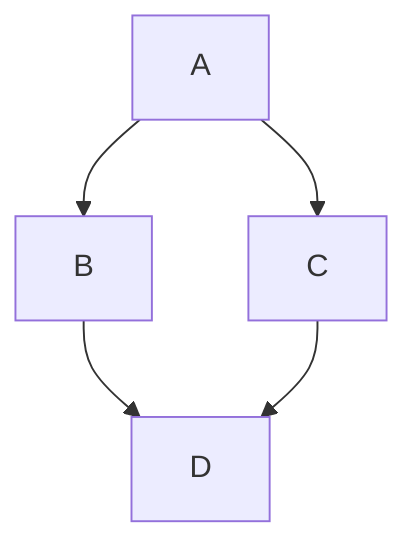

## Week 1
### Section 1
> [VISUAL]
> **Layout**: Code
> **Headline**: A Sample Code Block

```js
function test() {
  console.log("Hello, world!");
}
```
This is a speech about the code.

### Section 2
> [VISUAL]
> **Layout**: Diagram
> **Headline**: A Sample Diagram


This is a speech about the diagram.
