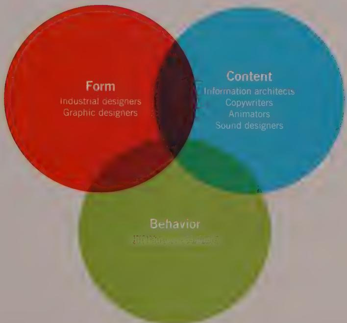

# INTRODUCTION TO THE FOURTH EDITION

This book is about interaction design—the practice of designing interactive digital products, environments, systems, and services. Like most design disciplines, interaction design is concerned with form. However, first and foremost, interaction design focuses on something that traditional design disciplines do not often explore: the design of behavior.

Most design affects human behavior: Architecture is concerned with how people use physical space, and graphic design often attempts to motivate or facilitate a response. But now, with the ubiquity of silicon-enabled products—from computers to cars and phones to appliances—we routinely create products that exhibit complex behavior.

Take a product as basic as an oven. Before the digital age, it was quite simple to operate an oven: You simply turned a single knob to the correct position. There was one position for off, and each point along which the knob could turn resulted in a unique temperature. Every time the knob was turned to a given position, the exact same thing happened. You could call this a "behavior," but it is certainly a simple one.

Compare this to modern ovens with microprocessors, LCD screens, and embedded operating systems. They are endowed with buttons labeled with non-cooking-related terms such as Start, Cancel, and Program, as well as the perhaps more expected Bake and Broil. What happens when you press any one of these buttons is much less predictable than what happened when you turned the knob on your old gas range. In fact, the outcome of pressing one of these buttons often depends on the oven's operational state, as well as the sequence of buttons you press before pressing the last one. This is what we mean by complex behavior.

This emergence of products with complex behavior has given rise to a new discipline. Interaction design borrows theory and technique from traditional design, usability, and engineering disciplines. But it is greater than the sum of its parts, with its own unique

methods and practices. And to be clear, interaction design is very much a design discipline, quite different from science and engineering. Although it employs an analytical approach when required, interaction design is also very much about synthesis and imagining things as they might be, not necessarily as they currently are.

Interaction design is an inherently humanistic enterprise. It is concerned most significantly with satisfying the needs and desires of the people who will interact with a product or service. These goals and needs can best be understood as narratives—logical and emotional progressions over time. In response to these user narratives, digital products must express behavioral narratives of their own, appropriately responding not only at the levels of logic and data entry and presentation, but also at a more human level.

In this book we describe a particular approach to interaction design that we call the Goal-Directed Design method. We've found that when designers focus on people's goals—the reasons why they use a product in the first place—as well as their expectations, attitudes, and aptitudes, they can devise solutions that people find both powerful and pleasurable to use.

As even the most casual observer of developments in technology must have noticed, interactive products quickly can become complex. Although a mechanical device may be capable of a dozen visible states, a digital product may be capable of thousands of different states (if not more!). This complexity can be a nightmare for users and designers alike. To tame this complexity, we rely on a systematic and rational approach. This doesn't mean that we don't also value and encourage inventiveness and creativity. On the contrary, we find that a methodical approach helps us clearly identify opportunities for revolutionary thinking and provides a way to assess the effectiveness of our ideas.

According to Gestalt Theory, people perceive a thing not as a set of individual features and attributes, but as a unified whole in a relationship with its surroundings. As a result, it is impossible to effectively design an interactive product by decomposing it into a list of atomic requirements and coming up with a design solution for each. Even a relatively simple product must be considered in totality and in light of its context in the world. Again, we've found that a methodical approach helps provide the holistic perspective necessary to create products that people find useful and engaging.

# A Brief History of Interaction Design

In the late 1970s and early 1980s, a dedicated and visionary set of researchers, engineers, and designers in the San Francisco Bay area were busy inventing how people would interact with computers in the future. At Xerox Parc, SRI, and eventually Apple Computer, people had begun discussing what it meant to create useful and usable "human interfaces" to digital products. In the mid-1980s, two industrial designers, Bill Moggridge

and Bill Verplank, were working on the first laptop computer, the GRiD Compass. They coined the term interaction design for what they were doing. But it would be another 10 years before other designers rediscovered this term and brought it into mainstream use.

When About Face was first published in August 1995, the landscape of interaction design was still a frontier wilderness. A small cadre of people brave enough to hold the title user interface designer operated in the shadow of software engineering, rather like the tiny, quick-witted mammals that lurked in the shadows of hulking tyrannosaurs. "Software design," as the first edition of About Face called it, was poorly understood and underappreciated. When it was practiced at all, it was usually practiced by developers. A handful of uneasy technical writers, trainers, and product support people, along with a rising number of practitioners from another nascent field—usability—realized that something needed to change.

The amazing growth and popularity of the web drove that change, seemingly overnight. Suddenly, the phrase "ease of use" was on everyone's lips. Traditional design professionals, who had dabbled in digital product design during the short-lived popularity of "multimedia" in the early '90s, leapt to the web en masse. Seemingly new design titles sprang up like weeds: information designer, information architect, user experience strategist, interaction designer. For the first time, C-level executive positions were established to focus on creating user-centered products and services, such as chief experience officer. Universities scrambled to offer programs to train designers in these disciplines. Meanwhile, usability and human-factors practitioners also rose in stature and are now recognized as advocates for better-designed products.

Although the web knocked back interaction design idioms by more than a decade, it inarguably placed user requirements on the radar of the corporate world permanently. After the second edition of About Face was published in 2003, the user experience of digital products became front-page news in the likes of Time and BusinessWeek. And institutions such as Harvard Business School and Stanford recognized the need to train the next generation of MBAs and technologists to incorporate design thinking into their business and development plans. People are tired of new technology for its own sake. Consumers are sending a clear message that they want good technology: technology that is designed to provide a compelling and effective user experience.

In August 2003, five months after the second edition of About Face proclaimed the existence of a new design discipline called interaction design, Bruce "Tog" Tognazzini made an impassioned plea to the nascent community to create a nonprofit professional organization. A mailing list and steering committee were founded shortly thereafter by Challis Hodge, David Malouf, Rick Cecil, and Jim Jarrett.

In September 2005, IxDA, the Interaction Design Association (www. ixda.org), was incorporated. In February 2008, less than a year after the publication of the third edition of About

Face, IxDA hosted its first international design conference, Interaction08, in Savannah, Georgia. In 2012, IxDA presented its first annual Interaction Awards for outstanding designs submitted from all over the world. IxDA currently has over 70,000 members living in more than 20 countries. We're pleased to say that interaction design has truly come into its own as both a design discipline and a profession.

# IxD and User Experience

The first edition of About Face described a discipline called software design and equated it with another discipline called user interface design. Of these two terms, user interface design has enjoyed more longevity. We still use it occasionally in this book, specifically to connote the layout of widgets on a screen. However, this book discusses a discipline broader than the design of user interfaces. In the world of digital technology, form, function, content, and behavior are so inextricably linked that many of the challenges of designing an interactive product go right to the heart of what a digital product is and does.

As we've discussed, interaction designers have borrowed practices from more-established design disciplines but also have evolved beyond them. Industrial designers have attempted to address the design of digital products. But like their counterparts in graphic design, their focus traditionally has been on the design of static form, not the design of interactivity, or form that changes and reacts to input over time. These disciplines do not have a language with which to discuss the design of rich, dynamic behavior and changing user interfaces.

A term that has gained particular popularity in the last decade is user experience (UX) design. Many people have advocated for the use of this term as an umbrella under which several different design and usability disciplines collaborate to create products, systems, and services. This is a laudable goal with great appeal, but it does not in itself directly address the core concern of interaction design as discussed in this book: how to specifically design the behavior of complex interactive systems. It's useful to consider the similarities and synergies between creating a customer experience at a physical store and creating one with an interactive product. However, we believe specific methods are appropriate for designing for the world of bits.

We also wonder whether it is truly possible to design an experience. Designers of all stripes hope to manage and influence people's experiences, but this is done by carefully manipulating the variables intrinsic to the medium at hand. A graphic designer creating a poster arranges fonts, photos, and illustrations to help create an experience; a furniture designer working on a chair uses materials and construction techniques to help create an experience; an interior designer uses layout, lighting, materials, and even sound to help create an experience.

Extending this thinking into the world of digital products, we find it useful to think that we influence people's experiences by designing the mechanisms for interacting with a product. Therefore, we have chosen Moggridge's term interaction design (now abbreviated by many in the industry as IxD) to denote the kind of design this book describes.

Of course, often a design project requires careful attention to the orchestration of a number of design disciplines to achieve an appropriate user experience, as shown in Figure 1. It is in these situations that we feel the term user experience design is most applicable.

  
Figure 1: User experience (UX) design has three overlapping concerns: form, behavior, and content. Interaction design focuses on the design of behavior but also is concerned with how that behavior relates to form and content. Similarly, information architecture focuses on the structure of content but also is concerned with behaviors that provide access to content and how the content is presented to the user. Industrial design and graphic design are concerned with the form of products and services but also must ensure that their form supports use, which requires attention to behavior and content.

# What This Book Is and What It Is Not

In this book, we attempt to give you effective and practical tools for interaction design. These tools consist of principles, patterns, and processes. Design principles encompass broad ideas about the practice of design, as well as rules and hints about how to best use specific user interface and interaction design idioms. Design patterns describe sets

of interaction design idioms that are common ways to address specific user requirements and design concerns. Design processes describe how to understand and define user requirements, how to then translate those requirements into the framework of a design, and finally how to best apply design principles and patterns to specific contexts.

Although books are available that discuss design principles and design patterns, few books discuss design processes, and even fewer discuss all three of these tools and how they work together to create effective designs. Our goal was to create a book that unites all three of these tools. While helping you design more effective and useful dialog boxes and menus, this book also helps you understand how users comprehend and interact with your digital product. In addition, it helps you understand how to use this knowledge to drive your design.

Integrating design principles, processes, and patterns is the key to designing effective product interactions and interfaces. There is no such thing as an objectively good user interface. Quality depends on the context: who the user is, what she is doing, and what her motivations are. Applying a set of one-size-fits-all principles makes user interface creation easier, but it doesn't necessarily make the end result better. If you want to create good design solutions, there is no avoiding the hard work of really understanding the people who will actually interact with your product. Only then is it useful to have at your command a toolbox of principles and patterns to apply in specific situations. We hope this book will both encourage you to deepen your understanding of your product's users and teach you how to translate that understanding into superior product designs.

This book does not attempt to present a style guide or set of interface standards. In fact, you'll learn in Chapter 17 about the limitations of such tools. That said, we hope that the process and principles described in this book are compatible companions to the style guide of your choice. Style guides are good at answering what but generally are weak at answering why. This book attempts to address these unanswered questions.

This book discusses four main steps to designing interactive systems: researching the domain, understanding the users and their requirements, defining a solution's framework, and filling in the design details. Many practitioners would add a fifth step: validation—testing a solution's effectiveness with users. This is part of a discipline widely known as usability.

Although this is an important and worthwhile component to many interaction design initiatives, it is a discipline and practice in its own right. We briefly discuss design validation and usability testing in Chapter 5. We also urge you to refer to the significant and ever-growing body of usability literature for more detailed information about conducting and analyzing usability tests.

# How This Book Is Structured

This book is organized in a way that presents its ideas in an easy-to-use reference structure. The book is divided into three parts:

- Part I introduces and describes the Goal-Directed Design process in detail, as well as building design teams and integrating with project teams.   
- Part II deals with high-level interaction design principles that can be applied to any interaction design problem on almost any platform.   
- Part III covers lower-level and platform-specific interface design principles and idioms for mobile, desktop, the web, and more.

# Changes Since the Third Edition

In June 2007, just two months after the third edition of About Face was published, Apple changed the digital landscape forever with the introduction of the iPhone and iOS. In 2010 Apple followed with the first commercially successful tablet computer, the iPad. These touch-based, sensor-laden products and the competitors that followed in their footsteps have added an entirely new lexicon of idioms and design patterns to the language of interaction. This fourth edition of About Face addresses these and other modern interaction idioms directly.

This new edition retains what still holds true, updates things that have changed, and provides new material reflecting how the industry has changed in the last seven years. It also addresses new concepts we have developed in our practices to address the changing times.

Here are some highlights of the major changes you will find in this edition of About Face:

- The book has been reorganized and streamlined to present its ideas in a more concise and easy-to-use structure and sequence. Some chapters have been rearranged for better flow, others have been merged, a few have been condensed, and several new chapters have been added.   
Terminology and examples have been updated to reflect the current state of the art in the industry. The text as a whole has been thoroughly edited to improve clarity and readability.   
- Part I describes the Goal-Directed Design process in additional detail and more accurately reflects the most current practices at Cooper. It also includes additional information on building a design team and integrating with development and project teams.   
- Part II has been significantly reorganized to more clearly present its concepts and principles, and includes newly updated information on integrating visual design.

Part III has been extensively rewritten, updated, and extended to reflect new mobile and touch-based platforms and interaction idioms. It also offers more detailed coverage of web interactions and interactions on other types of devices and systems. We hope you will find that these additions and changes make About Face a more relevant and useful reference than ever before.

# Examples Used in This Book

This book is about designing all kinds of interactive digital products. However, because interaction design has its roots in software for desktop computers, and the vast majority of today's PCs run Microsoft Windows, there is certainly a bias in the focus of our discussions of desktop software. Similarly, the first focus of many developers of native mobile apps is iOS, so the bulk of our mobile examples are from this platform.

Having said that, most of the material in this book transcends platform. It is equally applicable across platforms—Mac OS, Windows, iOS, Android, and others. The majority of the material is relevant even for more divergent platforms such as kiosks, embedded systems, 10-foot interfaces, and the like.

A number of the desktop examples in this book are from the Microsoft Office suite and from Adobe Photoshop and Illustrator. We have tried to stick with examples from these mainstream applications for two reasons. First, you're likely to be at least somewhat familiar with the examples. Second, it's important to show that the user interface design of even the most finely honed products can be significantly improved with a goaldirected approach. This edition also contains many new examples from mobile apps and the web, as well as several more-exotic applications.

A few examples in this new edition come from now-moribund software or OS versions. These examples illustrate particular points that we felt were useful enough to retain in this edition. The vast majority of examples are from contemporary software and OS releases.

# Who Should Read This Book

While the subject matter is broadly aimed at students and practitioners of interaction design, anyone concerned about users interacting with digital technology will gain insights from reading this book. Developers, designers of all stripes involved with digital product design, usability professionals, and project managers will all find something useful in this book. If you've read earlier editions of About Face or The Inmates

Are Running the Asylum (Sams, 2004), you will find new and updated information about design methods and principles here.

We hope this book informs you and intrigues you. Most of all, we hope it makes you think about the design of digital products in new ways. The practice of interaction design is constantly evolving, and it is new and varied enough to generate a wide variety of opinions on the subject. If you have an interesting opinion, or if you just want to talk, we'd be happy to hear from you. E-mail us at alan@cooper.com, rmreimann@gmail.com, davcron@gmail.com, or chrisnoessel@gmail.com.

