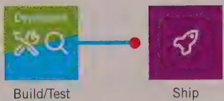
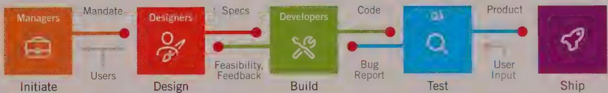
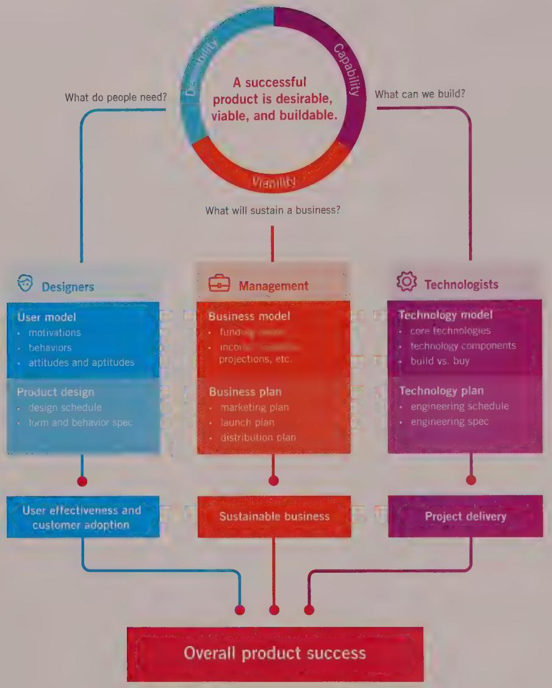

# A DESIGN PROCESS FOR DIGITAL PRODUCTS

This book has a simple premise: If we design and develop digital products in such a way that the people who use them can easily achieve their goals, they will be satisfied, effective, and happy. They will gladly pay for our products—and recommend that others do the same. Assuming that we can do so in a cost-effective manner, this will translate into business success.

On the surface, this premise seems obvious: Make people happy, and your products will be a success. Why, then, are so many digital products so difficult and unpleasant to use? Why aren't we all happy and successful when we use them? Why, despite the steady march of faster, cheaper, and more accessible technology, are we still so often frustrated?

The answer, in short, is the absence of design as a fundamental and equal part of the product planning and development process.

Design, according to industrial designer Victor Papanek, is the conscious and intuitive effort to impose meaningful order. We propose a somewhat more detailed definition of human-oriented design activities:

- Understanding the desires, needs, motivations, and contexts of people using products   
- Understanding business, technical, and domain opportunities, requirements, and constraints

- Using this knowledge as a foundation for plans to create products whose form, content, and behavior are useful, usable, and desirable, as well as economically viable and technically feasible

This definition is useful for many design disciplines, although the precise focus on form, content, and behavior varies depending on what is being designed. For example, an informational website may require particular attention to content, whereas the design of a simple TV remote control may be concerned primarily with form. As discussed in the Introduction, interactive digital products are uniquely imbued with complex behavior.

When performed using the appropriate methods, design can, and does, provide the missing human connection in technological products. But most current approaches to the design of digital products don't work as advertised.

# The Consequences of Poor Product Behavior

In the nearly 20 years since the publication of the first edition of About Face, software and interactive digital products have greatly improved. Many companies have begun to focus on serving people's needs with their products and are spending the time and money needed to support the design process. However, many more still fail to do so—at their peril. As long as businesses continue to focus solely on technology and market data while shortchanging design, they will continue to create the kind of products we've all grown to despise.

The following sections describe a few of the consequences of creating products that lack appropriate design and thus ignore users' needs and desires. How many of your digital products exhibit some of these characteristics?

# Digital products are rude

Digital products often blame users for making mistakes that are not their fault, or should not be. Error messages like the one shown in Figure 1-1 pop up like weeds, announcing that the user has failed yet again. These messages also demand that the user acknowledge his failure by confirming it: OK.

Digital products and software frequently interrogate users, peppering them with a string of terse questions that they are neither inclined nor prepared to answer: "Where did you hide that file?" Patronizing questions like "Are you sure?" and "Did you really want to delete that file, or did you have some other reason for pressing the Delete key?" are equally irritating and demeaning.

  
Figure 1-1: Thanks for sharing. Why didn't the application notify the library? Why did it want to notify the library? Why is it telling us? And what are we OKing, anyway? It is not OK that the application failed!

Our software-enabled products also fail to act with a basic level of decency. They forget information we tell them and don't do a very good job of anticipating our needs. Even the iPhone—generally the baseline for good user experience on a digital device—doesn't anticipate that someone might not want to be pestered with a random phone call when he is in the middle of a business meeting that is sitting right there in the iPhone's own calendar. Why can't it quietly put a call that isn't from a family member into voicemail?

# Digital products require people to think like computers

Digital products regularly assume that people are technology literate. For example, in Microsoft Word, if a user wants to rename a document she is editing, she must know that she must either close the document or use the "Save As..." menu command (and remember to delete the file with the old name). These behaviors are inconsistent with how a normal person thinks about renaming something; rather, they require that a person change her thinking to be more like the way a computer works.

Digital products are also often obscure, hiding meaning, intentions, and actions from users. Applications often express themselves in incomprehensible jargon that cannot be fathomed by normal users ("What is your SSID?") and are sometimes incomprehensible even to experts ("Please specify IRQ").

# Digital products have sloppy habits

If a 10-year-old boy behaved like some software apps or devices, he'd be sent to his room without supper. These products forget to shut the refrigerator door, leave their shoes in the middle of the floor, and can't remember what you told them only five minutes earlier. For example, if you save a Microsoft Word document, print it, and then try to close it, the application again asks you if you want to save it! Evidently the act of printing caused the application to think the document had changed, even though it did not. Sorry, Mom, I didn't hear you.

Software often requires us to step out of the main flow of tasks to perform functions that shouldn't require separate interfaces and extra navigation to access. Dangerous commands, however, are often presented right up front where users can accidentally trigger them. Dropbox, for example, sandwiches Delete between Download and Rename on its

context menus, practically inviting people to lose the work they've uploaded to the cloud for safekeeping.

Furthermore, the appearance of software—especially business and technical applications—can be complex and confusing, making navigation and comprehension unnecessarily difficult.

# Digital products require humans to do the heavy lifting

Computers and their silicon-enabled brethren are purported to be labor-saving devices. But every time we go out into the field to watch real people doing their jobs with the assistance of technology, we are struck by how much work they are forced to do simply to manage the proper operation of software. This work can be anything from manually copying (or, worse, retyping) values from one window into another, to attempting (often futilely) to paste data between applications that otherwise don't speak to each other, to the ubiquitous clicking and pushing and pulling of windows and widgets around the screen to access hidden functionality that people use every day to do their job.

The evidence is everywhere that digital products have a lot of explaining to do when it comes to their poor behavior.

# Why Digital Products Fail

Most digital products emerge from the development process like a sci-fi monster emerging from a bubbling tank. Instead of planning and executing with a focus on satisfying the needs of the people who use their products, companies end up creating solutions that—while technically advanced—are difficult to use and control. Like mad scientists, they fail because they have not imbued their creations with sufficient humanity.

Why is this? What is it about the technology industry as a whole that makes it so inept at designing the interactive parts of digital products? What is so broken about the current process of creating software-enabled products that it results in such a mess?

There are four main reasons why this is the case:

- Misplaced priorities on the part of both product management and development teams   
- Ignorance about real users of the product and what their baseline needs are for success   
- Conflicts of interest when development teams are charged with both designing and building the user experience   
- Lack of a design process that permits knowledge about user needs to be gathered, analyzed, and used to drive the development of the end experience

# Misplaced priorities

Digital products come into the world subject to the push and pull of two often-opposing camps—marketers and developers. While marketers are adept at understanding and quantifying a marketplace opportunity, and at introducing and positioning a product within that market, their input into the product design process is often limited to lists of requirements. These requirements often have little to do with what users actually need or desire and have more to do with chasing the competition, managing IT resources with to-do lists, and making guesses based on market surveys—what people say they'll buy. (Contrary to what you might suspect, few users can clearly articulate their needs. When asked direct questions about the products they use, most tend to focus on low-level tasks or workarounds to product flaws. And, what they think they'll buy doesn't tell you much about how—or if—they will use it.)

Unfortunately, reducing an interactive product to a list of a hundred features doesn't lend itself to the kind of graceful orchestration that is required to make complex technology useful. Adding "easy to use" as a checklist item does nothing to improve the situation.

Developers, on the other hand, often have no shortage of input into the product's final form and behavior. Because they are in charge of construction, they decide exactly what gets built. And they too have a different set of imperatives than the product's eventual audience. Good developers are focused on solving challenging technical problems, following good engineering practices, and meeting deadlines. They often are given incomplete, myopic, confusing, and sometimes contradictory instructions and are forced to make significant decisions about the user experience with little time or knowledge of how people will actually use their creations.

Thus, the people who are most often responsible for creating our digital products rarely take into account the users' goals, needs, or motivations. At the same time, they tend to be highly reactive to market trends and technical constraints. This can't help but result in products that lack a coherent user experience. We'll soon see why goals are so important in addressing this issue.

The results of poor product vision are, unfortunately, digital products that irritate rather than please, reduce rather than increase productivity, and fail to meet user needs. Figure 1-2 shows the evolution of the development process and where, if at all, design has historically fit in. Most of digital product development is stuck in the first, second, or third step of this evolution, where design either plays no real role or becomes a surface-level patch on shoddy interactions—"lipstick on the pig," as one of our clients called it. The core activities in the design process, as we will soon discuss, should precede coding and testing to ensure that products truly meet users' needs.

  
Figure 1-2: The evolution of the software development process. The first diagram depicts the early days of the software industry, when smart developers dreamed up products and then built and tested them. Inevitably, professional managers were brought in to help facilitate the process by translating market opportunities into product requirements. As depicted in the third diagram, the industry matured, and testing became a discipline in its own right. With the popularization of the graphical user interface (GUI), graphic designers were brought in to create icons and other visual elements. The final diagram shows the Goal-Directed approach to software development, where decisions about a product's capabilities, form, and behavior are made before the expensive and challenging construction phase.

# Ignorance about real users

It's an unfortunate truth that the digital technology industry doesn't have a good understanding of what it takes to make users happy. In fact, most technology products get built without much understanding of users. We might know what market segment our users are in, how much money they make, how they like to spend their weekends, and what sorts of cars they buy. We might even have a vague idea of what kind of jobs they have and some of the major tasks they regularly perform. But does any of this tell us how to make them happy? Does it tell us how they will actually use the product we're

building? Does it tell us why they are doing whatever it is they might need our product for, why they might want to choose our product over our competitors, or how we can make sure they do? No, it does not.

However, we should not give up hope. It is possible to understand our users well enough to make excellent products they will love. We'll see how to address the issue of understanding users and their behaviors with products in Chapters 2 and 3.

# Conflicts of interest

A third problem affects the ability of vendors and manufacturers to make users happy. The world of digital product development has an important conflict of interest: The people who build the products—developers—are often also the people who design them. They are also, quite understandably, the people who usually have the final say on what does and doesn't get built. Thus, developers often are required to choose between ease of coding and ease of use. Because developers' performance is typically judged by their ability to code efficiently and meet incredibly tight deadlines, it isn't difficult to figure out what direction most software-enabled products take. Just as we would never permit the prosecutor in a legal trial to also adjudicate the case, we should make sure that the people designing a product are not the same people building it. Even with appropriate skills and the best intentions, it simply isn't possible for a developer (or anyone, for that matter) to advocate effectively for the user, the business, and the technology all at the same time.

We'll see how to address the issue of building design teams and fitting them into the planning and development process in Chapter 6.

# Lack of a design process

The last reason the digital product industry isn't cranking out successful, well-designed products is that it has no reliable process for doing so. Or, to be more accurate, it doesn't have a complete process for doing so. Engineering departments follow—or should follow—rigorous engineering methods that ensure the feasibility and quality of the technology. Similarly, marketing, sales, and other business units follow their own well-established methods for ensuring the commercial viability of new products. What's left out is a repeatable, predictable, and analytical process for ensuring desirability: transforming an understanding of users into products that meet their professional, personal, and emotional needs.

In the worst case, decisions about what a digital product will do and how it will communicate with users are simply a by-product of its construction. Developers, deep in their thoughts of algorithms and code, end up "designing" product behaviors in the same way

that miners end up "designing" a landscape filled with cavernous pits and piles of rubble. In unenlightened development organizations, the digital product interaction design process alternates between the accidental and the nonexistent.

Sometimes organizations do adopt a design process, but it isn't quite up to the task. Many companies embrace the notion that integrating customers (or their theoretical proxies, domain experts) directly into the development process can solve human interface design problems. Although this has the salutary effect of sharing the responsibility for design with the user, it ignores a serious methodological flaw: confusing domain knowledge with design knowledge.

Customers, although they might be able to articulate the problems with an interaction, often cannot visualize the solutions to those problems. Design is a specialized skill, just like software development. Developers would never ask users to help them code; design problems should be treated no differently. In addition, customers who purchase a product may not be the same people who use it from day to day, a subtle but important distinction. Finally, experts in a domain may not be able to easily place themselves in the shoes of less-expert users when defining tasks and flows. Interestingly, the two professions that seem to most frequently confuse domain knowledge with design knowledge when building information systems—law and medicine—have notoriously difficult-to-use products. Coincidence? Probably not.

Of course, designers should indeed get feedback on their proposed solutions, both from users and the product team. But hearing about the problems is much more useful to designers—and better for the product—than taking proposed solutions from users at face value. In interpreting feedback, the following analogy is useful: Imagine a patient who visits his doctor with acute stomach pain. "Doctor," he says, "it really hurts. I think it's my appendix. You've got to take it out as soon as possible." A responsible physician wouldn't perform surgery based solely on a patient request, even an earnest one. The patient can describe the symptoms, but it takes the doctor's professional knowledge to make the correct diagnosis and prescribe the treatment.

# Planning and Designing Product Behavior

The planning of complex digital products, especially ones that interact directly with humans, requires a significant upfront effort by professional designers, just as the planning of complex physical structures that interact with humans requires a significant upfront effort by professional architects. In the case of architects, that planning involves understanding how the humans occupying the structure live and work, and designing spaces to support and facilitate those behaviors. In the case of digital products, the planning involves understanding how the humans using the product live and work, and designing product behavior and form that support and facilitate the human behaviors. Architecture is an old

well-established field. The design of product and system behavior—interaction design—is quite new, and only in recent years has it begun to come of age as a discipline. And this new design has fundamentally changed how products succeed in the marketplace.

In the early days of industrial manufacturing, engineering and marketing processes alone were sufficient to produce desirable products: It didn't take much more than good engineering and reasonable pricing to produce a hammer, diesel engine, or tube of toothpaste that people would readily purchase. As time progressed, manufacturers of consumer products realized that they needed to differentiate their products from functionally identical products made by competitors, so design was introduced as a means to increase user desire for a product. Graphic designers were employed to create more effective packaging and advertising, and industrial designers were engaged to create more comfortable, useful, and exciting forms.

The conscious inclusion of design heralded the ascendance of the modern triad of product development concerns identified by Larry Keeley of the Doblin Group: capability, viability, and desirability (see Figure 1-3). If any of these three foundations is weak, a product is unlikely to stand the test of time.

Now enter the general-purpose computer, the first machine capable of almost limitless behavior via software programming. The interesting thing about this complex behavior, or interactivity, is that it completely alters the nature of the products it touches. Interactivity is compelling to humans—so compelling that the other aspects of an interactive product become marginal. Who pays attention to the black PC tower that sits under your desk? It is the screen, keyboard, and mouse to which users pay attention. With touch-screen devices like the iPad and its brethren, the only apparent hardware is the interactive surface. Yet the behaviors of software and other digital products, which should receive the majority of design attention, all too frequently receive no attention.

The traditions of design that corporations have relied on to provide the critical pillar of desirability for products don't provide much guidance in the world of interactivity. Design of behavior is a different kind of problem that requires greater knowledge of context, not just rules of visual composition and brand. It requires an understanding of the user's relationship with the product from before purchase to end of life. Most important is the understanding of how the user wants to use the product, in what ways, and to what ends.

Interaction design isn't merely a matter of aesthetic choice; rather, it is based on an understanding of users and cognitive principles. This is good news, because it makes the design of behavior quite amenable to a repeatable process of analysis and synthesis. It doesn't mean that the design of behavior can be automated, any more than the design of form or content can be automated, but it does mean that a systematic approach is possible. Rules of form and aesthetics mustn't be discarded, of course. They must work in harmony with the larger concern of achieving user goals via appropriately designed behaviors.

  
Figure 1-3: Building successful digital products. Three major processes need to be followed in tandem to create successful technology products. This book addresses the first and foremost issue: how to create a product people will desire.

You can apply this to companies that have struggled to find the balance:

# Apple

Apple has emphasized desirability but has made many business blunders. Nevertheless, it is sustained by the loyalty created by its attention to user experience.

# Microsoft

Microsoft is one of the best run businesses ever, but it has not been able to create highly desirable products. This provides an opening for competition.

# Novell

Novell emphasized technology and gave little attention to desirability. This made it vulnerable to competition.

This book presents a set of methods to address this new kind of behavior-oriented design, providing a complete process for understanding users' goals, needs, and motivations: Goal-Directed Design. To understand the process of Goal-Directed Design, we first need to understand the nature of user goals, the mental models from which they arise, and how they are the key to designing appropriate interactive behavior.

# Recognizing User Goals

So what are user goals? How can we identify them? How do we know that they are real goals, rather than tasks users are forced to perform by poorly designed tools or business processes? Are they the same for all users? Do they change over time? We'll try to answer those questions in the remainder of this chapter.

Users' goals are often quite different from what we might guess them to be. For example, we might think that an accounting clerk's goal is to process invoices efficiently. This is probably not true. Efficient invoice processing is more likely the goal of the clerk's employer. The clerk probably concentrates on goals like appearing competent at his job and keeping himself engaged with his work while performing routine and repetitive tasks—although he may not verbally (or even consciously) acknowledge this.

Regardless of the work we do and the tasks we must accomplish, most of us share these simple, personal goals. Even if we have higher aspirations, they are still more personal than work-related: winning a promotion, learning more about our field, or setting a good example for others, for instance.

Products designed and built to achieve business goals alone will eventually fail; users' personal goals need to be addressed. When the design meets the user's personal goals, business goals are achieved far more effectively, for reasons we'll explore in more detail in later chapters.

If you examine most commercially available software, websites, and digital products, you will find that their user interfaces fail to meet user goals with alarming frequency. They routinely:

Make users feel stupid.   
Cause users to make big mistakes.   
- Require too much effort to operate effectively.   
- Don't provide an engaging or enjoyable experience.

Most of the same software is equally poor at achieving its business purpose. Invoices don't get processed all that well. Customers don't get serviced on time. Decisions don't get properly supported. This is no coincidence.

The companies that develop these products have the wrong priorities. Most focus far too narrowly on implementation issues, which distract them from users' needs.

Even when businesses become sensitive to their users, they are often powerless to change their products. The conventional development process assumes that the user interface should be addressed after coding begins—sometimes even after it ends. But just as you cannot effectively design a building after construction begins, you cannot easily make an application serve users' goals as soon as a significant and inflexible code base is in place.

Finally, when companies do focus on the users, they tend to pay too much attention to the tasks users engage in and not enough attention to their goals in performing those tasks. Software can be technologically superb and perform each business task with diligence, yet still be a critical and commercial failure. We can't ignore technology or tasks, but they play only a part in a larger schema that includes designing to meet user goals.

# Goals versus tasks and activities

Goals are not the same as tasks or activities. A goal is an expectation of an end condition, whereas both activities and tasks are intermediate steps (at different levels of organization) that help someone to reach a goal or set of goals.

Donald Norman1 describes a hierarchy in which activities are composed of tasks, which in turn are composed of actions, which are themselves composed of operations. Using this scheme, Norman advocates Activity-Centered Design (ACD), which focuses first and foremost on understanding activities. He claims humans adapt to the tools at hand and that understanding the activities people perform with a set of tools can more favorably influence the design of those tools. The foundation of Norman's thinking comes from Activity Theory, a Soviet-era Russian theory of psychology that emphasizes understanding who people are by understanding how they interact with the world. In recent years this theory has been adapted to the study of human-computer interaction, most notably by Bonnie Nardi.2

Norman concludes, correctly, that the traditional task-based focus of digital product design has yielded inadequate results. Many developers and usability professionals still approach interface design by asking what the tasks are. Although this may get the job done, it won't produce much more than an incremental improvement: It won't provide a solution that differentiates your product in the market, and very often it won't really satisfy the user.

While Norman's ACD takes some important steps in the right direction by highlighting the importance of the user's context, we do not believe it goes quite far enough. A method like ACD can be very useful in properly breaking down the "what" of user behaviors, but it really doesn't address the first question any designer should ask: Why is a user performing an activity, task, action, or operation in the first place? Goals motivate people to perform activities; understanding goals allows you to understand your users' expectations and aspirations, which in turn can help you decide which activities are truly relevant to your design. Task and activity analysis is useful at the detail level, but only after user goals have been analyzed. Asking, "What are the user's goals?" lets you understand the meaning of activities to your users and thus create more appropriate and satisfactory designs.

If you're still unsure about the difference between goals and activities or tasks, there is an easy way to tell the difference between them. Since goals are driven by human motivations, they change very slowly—if at all—over time. Activities and tasks are much more transient, because they are based almost entirely on whatever technology is at hand. For example, when someone travels from St. Louis to San Francisco, his goals are likely to include traveling quickly, comfortably, and safely. In 1850, a settler wishing to travel quickly and comfortably would have made the journey in a covered wagon; in the interest of safety, he would have brought along his trusty rifle. Today, a businessman traveling from St. Louis to San Francisco makes the journey in a jet and, in the interest of safety, he is required to leave his firearms at home. The goals of the settler and businessman remain unchanged, but their activities and tasks have changed so completely with the changes in technology that they are, in some respects, in direct opposition.

Design based solely on understanding activities or tasks runs the risk of trapping the design in a model imposed by an outmoded technology, or using a model that meets a corporation's goals without meeting the users' goals. Looking through the lens of goals allows you to leverage available technology to eliminate irrelevant tasks and to dramatically streamline activities. Understanding users' goals can help designers eliminate the tasks and activities that better technology renders unnecessary for humans to perform.

# Designing to meet goals in context

Many designers assume that making user interfaces and product interactions easier to learn should always be a design target. Ease of learning is an important guideline, but in reality, the design target really depends on the context—who the users are, what they are doing, and their goals. You simply can't create good design by following rules disconnected from the goals and needs of the users of your product.

Consider an automated call-distribution system. The people who use this product are paid based on how many calls they handle. Their most important concern is not ease of learning, but the efficiency with which they can route calls, and the rapidity with which

those calls can be completed. Ease of learning is also important, however, because it affects employees' happiness and, ultimately, turnover rate, so both ease and throughput should be considered in the design. But there is no doubt that throughput is the dominant demand placed on the system by the users, so, if necessary, ease of learning should take a backseat. An application that walks the user through the call-routing process step by step each time merely frustrates him after he's learned the ropes.

On the other hand, if the product in question is a kiosk in a corporate lobby helping visitors find their way around, ease of use for first-time users is clearly a major goal.

A general guideline of interaction design that seems to apply particularly well to productivity tools is that good design makes users more effective. This guideline takes into account the universal human goal of not looking stupid, along with more particular goals of business throughput and ease of use that are relevant in most business situations.

It is up to you as a designer to determine how you can make the users of your product more effective. Software that enables users to perform their tasks without addressing their goals rarely helps them be truly effective. If the task is to enter 5,000 names and addresses into a database, a smoothly functioning data-entry application won't satisfy the user nearly as much as an automated system that extracts the names from the invoicing system.

Although it is the user's job to focus on her tasks, the designer's job is to look beyond the task to identify who the most important users are, and then to determine what their goals might be and why.

# Implementation Models and Mental Models

The computer industry still makes use of the term computer literacy. Pundits talk about how some people have it and some don't, how those who have it will succeed in the information economy, and how those who lack it will inevitably fall between the socioeconomic cracks. Computer literacy, however, is really a euphemism for forcing human beings to stretch their thinking to understand the inner workings of application logic, rather than having software-enabled products stretch to meet people's usual ways of thinking.

Let's explore what's really going on when people try to use digital products, and what the role of design is in translating coded functions into an understandable and pleasurable experience for users.

# Implementation models

Any machine has a mechanism for accomplishing its purpose. A motion picture projector, for example, uses a complicated sequence of intricately moving parts to create its illusion. It shines a very bright light through a translucent, miniature image for a fraction of a second. It then blocks the light for a split second while it moves another miniature image into place. Then it unblocks the light again for another moment. It repeats this process with a new image 24 times per second. Software-enabled products don't have mechanisms in the sense of moving parts; these are replaced with algorithms and modules of code that communicate with each other. The representation of how a machine or application actually works has been called the system model by Donald Norman and others; we prefer the term implementation model because it describes the details of how an application is implemented in code.

It is much easier to design software that reflects its implementation model. From the developer's perspective, it's perfectly logical to provide a button for every function, a field for every data input, a page for every transaction step, and a dialog box for every code module. But while this adequately reflects the infrastructure of engineering efforts, it does little to provide coherent mechanisms for a user to achieve his goals. In the end, what is produced alienates and confuses the user, rather like the ubiquitous external ductwork in the dystopian setting of Terry Gilliam's movie *Brazil* (which is full of wonderful tongue-in-cheek examples of miserable interfaces).

# Mental models

From the moviegoer's point of view, it is easy to forget the nuance of sprocket holes and light interrupters while watching an absorbing drama. Many moviegoers, in fact, have little idea how the projector works, or how this differs from the way a television works. The viewer imagines that the projector merely throws a picture that moves onto the big screen. This is his mental model, or conceptual model.

People don't need to know all the details of how a complex mechanism actually works in order to use it, so they create a cognitive shorthand for explaining it. This explanation is powerful enough to cover their interactions with it but doesn't necessarily reflect its actual inner mechanics. For example, many people imagine that, when they plug in their vacuum cleaner and blender, the electricity flows like water from the wall into the appliances through the little black tube of the electrical cord. This mental model is perfectly adequate for using household appliances. The fact that the implementation model of household electricity involves nothing resembling a fluid traveling through a tube and that there is a reversal of electrical potential 120 times per second is irrelevant to the user, although the power company needs to know the details.

In the digital world, however, the differences between a user's mental model and the implementation model are often quite distinct. We tend to ignore the fact that our cell phone doesn't work like a landline phone; instead, it is actually a radio transceiver that might swap connections between a half-dozen different cellular base antennas in the course of a two-minute call. Knowing this doesn't help us understand how to use the phone.

The discrepancy between implementation and mental models is particularly stark in the case of software applications, where the complexity of implementation can make it nearly impossible for the user to see the mechanistic connections between his actions and the application's reactions. When we use a computer to digitally edit sound or create video special effects like morphing, we are bereft of analogy to the mechanical world, so our mental models are necessarily different from the implementation model. Even if the connections were visible, they would remain inscrutable to most people.

# Striving toward perfection: represented models

Software (and any digital product that relies on software) has a behavioral face it shows to the world that is created by the developer or designer. This representation is not necessarily an accurate description of what is really going on inside the computer, although unfortunately, it frequently is. This ability to represent the computer's functioning independent of its true actions is far more pronounced in software than in any other medium. It allows a clever designer to hide some of the more unsavory facts of how the software really gets the job done. This disconnection between what is implemented and what is offered as explanation gives rise to a third model in the digital world, the designer's represented model—how the designer chooses to represent an application's functioning to the user. Donald Norman calls this the designer's model.

In the world of software, an application's represented model can (and often should) be quite different from an application's actual processing structure. For example, an operating system can make a network file server look as though it were a local disk. The model does not represent the fact that the physical disk drive may be miles away. This concept of the represented model has no widespread counterpart in the mechanical world. Figure 1-4 shows the relationship between the three models.

The closer the represented model comes to the user's mental model, the easier he will find the application to use and understand. Generally, offering a represented model that follows the implementation model too closely significantly reduces the user's ability to learn and use the application. This occurs because the user's mental model of his tasks usually differs from the software's implementation model.

  
Implementation Model reflects technology

  
worse

  
Mental Model   
reflects user's vision   
Figure 1-4: A comparison of the implementation model, mental model, and represented model. The way engineers must build software is often a given, dictated by various technical and business constraints. The model for how the software actually works is called the implementation model. The way users perceive the jobs they need to do and how the application helps them do so is their mental model of interaction with the software. It is based on their own ideas of how they do their jobs and how computers might work. The way designers choose to represent the working of the application to the user is called the represented model. Unlike the other two models, it is an aspect of software over which designers have great control. One of the designer's most important goals should be to make the represented model match a user's mental model as closely as possible. Therefore, it is critical that designers understand in detail how their target users think about the work they do with the software.

We tend to form mental models that are simpler than reality. So, if we create represented models that are simpler than the implementation model, we help the user achieve better understanding. In software, we imagine that a spreadsheet scrolls new cells into view when we click the scrollbar. Nothing of the sort actually happens. There is no sheet of cells out there, but a tightly packed data structure of values, with various pointers between them, from which the application synthesizes a new image to display in real time.

One of the most significant ways in which computers can assist human beings is presenting complex data and operations in a simple, easily understandable form. As a result, user interfaces that are consistent with users' mental models are vastly superior to those that are merely reflections of the implementation model.

