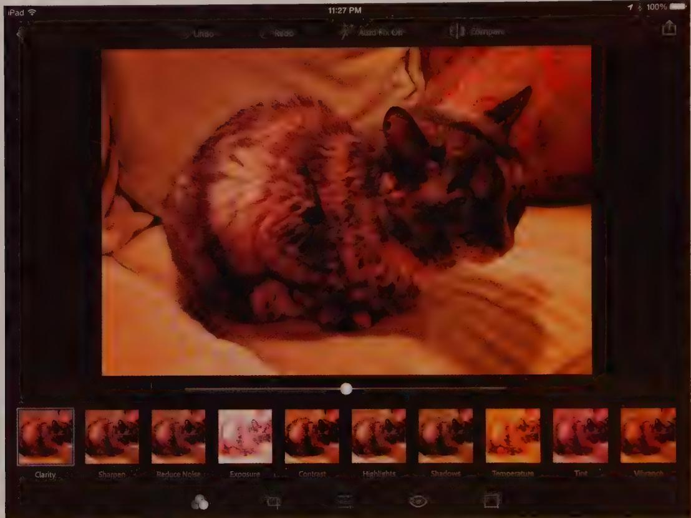
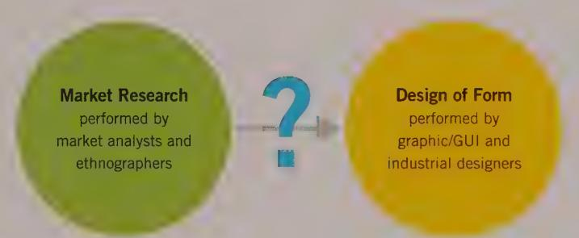
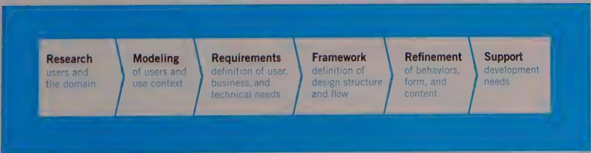

# DESIGN PRINCIPLE

User interfaces should be based on user mental models rather than implementation models.

In Adobe Photoshop Express on the iPad, users can adjust a set of ten different visual filters, including noise, contrast, exposure, and tint. Instead of offering numeric fields or many banks of controls for entering filter values—the implementation model—the interface instead shows a set of thumbnail images of the edited photo, each with a different filter applied (see Figure 1-5). A user can tap the image that best represents the desired result, and can tweak it with a single large slider. The interface more closely follows his

mental model, because the user—likely an amateur photographer—is thinking in terms of how his photo looks, not in terms of abstract numbers.

  
Figure 1-5: Adobe Photoshop Express for iPad has a great example of software design to match user mental models. The interface shows a set of thumbnail images of the photo being edited. A user can tap the thumbnail that best represents the desired setting, which can then be tweaked using the single large slider below the photo. The interface follows mental models of photographers who are after a particular look, not a set of abstract numeric values.

If the represented model for software closely follows users' mental models, it eliminates needless complexity from the user interface by providing a cognitive framework that makes it evident to the user how his goals and needs can be met.

DESIGN PRINCIPLE

Goal-directed interactions reflect user mental models.

So, now we know that a missing link prevents the majority of digital products from being truly successful. A design process translates the implementation of features into intuitive and desirable product behaviors that match how people think about performing

<!-- Chunk 1 End -->

<!-- Chunk 2 Start -->

tasks toward achieving their goals. But how do we actually do it? How do we know what our users' goals are and what mental models they have of their activities and tasks?

The Goal-Directed Design process, which we describe in the remainder of this chapter and in the remainder of Part I, provides a structure for determining the answers to these questions—a structure by which solutions based on this information can be systematically achieved.

# An Overview of Goal-Directed Design

Most technology-focused companies don't have an adequate process for product design, if they have a process at all. But even the more enlightened organizations—those that can boast of an established process—come up against some critical issues that result from traditional ways of approaching the problems of research and design.

In recent years, the business community has come to recognize that user research is necessary to create good products, but the proper nature of that research is still in question in many organizations. Quantitative market research and market segmentation are quite useful for selling products but fall short of providing critical information about how people actually use products—especially products with complex behaviors. (See Chapter 2 for a more in-depth discussion of this topic.) A second problem occurs after the results have been analyzed: Most traditional methods don't provide a means of translating research results into design solutions. A hundred pages of user survey data don't easily translate into a set of product requirements. They say even less about how those requirements should be expressed in terms of a meaningful and appropriate interface structure. Design remains a black box: "A miracle happens here..." This gap between research results and the ultimate design solution is the result of a process that doesn't connect the dots from user to final product. We'll soon see how to address this problem with Goal-Directed methods.

# Bridging the gap

As we have briefly discussed, the role of design in the development process needs to change. We need to start thinking about design in new ways and start thinking differently about how product decisions are made.

# Design as product definition

Design has, unfortunately, become a limiting term in the technology industry. For many developers and managers, the word stands for what happens in the third process diagram shown in Figure 1-2: a visual facelift of the implementation model. But design, when

properly deployed (as in the fourth process diagram shown in Figure 1-2), both identifies user requirements and defines a detailed plan for the behavior and appearance of products. In other words, design provides true product definition, based on user goals, business needs, and technology constraints.

# Designers as researchers

If design is to become product definition, designers need to take on a broader role than that assumed in traditional practice, particularly when the object in question is complex, interactive systems.

One of the problems with the current development process is that roles in the process are overspecialized: Researchers perform research, and designers perform design (see Figure 1-6). The results of user and market research are analyzed by the usability and market researchers and then thrown over the transom to designers or developers. What is missing in this model is a systematic means of translating and synthesizing the research into design solutions. One of the ways to address this problem is for designers to learn to be researchers.

  
Figure 1-6: A problematic design process. Traditionally, research and design have been separated, with each activity handled by specialists. Research has, until recently, referred primarily to market research, and design is too often limited to visual design or skin-deep industrial design. More recently, user research has expanded to include qualitative, ethnographic data. Yet, without including designers in the research process, the connection between research data and design solutions remains tenuous at best.

There is a compelling reason to involve designers in the research process. One of the most powerful tools designers offer is empathy: the ability to feel what others are feeling. The direct and extensive exposure to users that proper user research entails immersed designers in the users' world and gets them thinking about users long before they propose solutions. One of the most dangerous practices in product development is isolating designers from the users, because doing so eliminates empathic knowledge.

Additionally, it is often difficult for pure researchers to know what user information is really important from a design perspective. Involving designers directly in research addresses both issues.

In the authors' practice, designers are trained in the research techniques described in Chapter 2 and perform their research without further support or collaboration. This is a satisfactory solution, provided that your team has the time and resources to train your designers fully in these techniques. If not, a cross-disciplinary team of designers and dedicated user researchers is appropriate.

Although research practiced by designers takes us part of the way to Goal-Directed Design solutions, a translation gap still exists between research results and design details. The puzzle is missing several pieces, as we will discuss next.

# Between research and blueprint: Models, requirements, and frameworks

Few design methods in common use today incorporate a means of effectively and systematically translating the knowledge gathered during research into a detailed design specification. Part of the reason for this has already been identified: Designers have historically been out of the research loop and have had to rely on third-person accounts of user behaviors and desires.

The other reason, however, is that few methods capture user behaviors in a manner that appropriately directs the definition of a product. Rather than providing information about user goals, most methods provide information at the task level. This type of information is useful for defining layout, work flow, and translation of functions into interface controls. But it's less useful for defining the basic framework of what a product is, what it does, and how it should meet the user's broad needs.

Instead, we need an explicit, systematic process to bridge the gap between research and design for defining user models, establishing design requirements, and translating those into a high-level interaction framework (see Figure 1-7). Goal-Directed Design seeks to bridge the gap that currently exists in the digital product development process—the gap between user research and design—through a combination of new techniques and known methods brought together in more effective ways.

  
Figure 1-7: The Goal-Directed Design process

# A process overview

Goal-Directed Design combines techniques of ethnography, stakeholder interviews, market research, detailed user models, scenario-based design, and a core set of interaction principles and patterns. It provides solutions that meet users' needs and goals while also addressing business/organizational and technical imperatives. This process can be roughly divided into six phases: Research, Modeling, Requirements Definition, Framework Definition, Refinement, and Support (see Figure 1-7). These phases follow the five component activities of interaction design identified by Gillian Crampton Smith and Philip Tabor—understanding, abstracting, structuring, representing, and detailing—with a greater emphasis on modeling user behaviors and defining system behaviors.

The remainder of this chapter provides a high-level view of the six phases of Goal-Directed Design, and Chapters 2 through 6 provide a more detailed discussion of the methods involved in each of these phases. Figure 1-8 shows a more detailed diagram of the process, including key collaboration points and design concerns.

