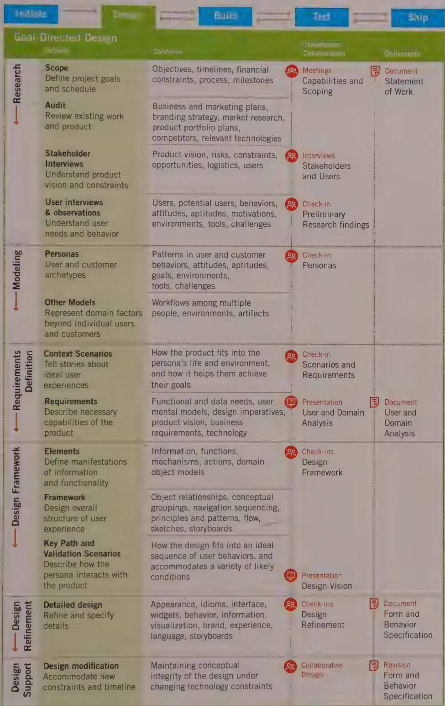

# Research

The Research phase employs ethnographic field study techniques (observation and contextual interviews) to provide qualitative data about potential and/or actual users of the product. It also includes competitive product audits as well as reviews of market research, technology white papers, and brand strategy. It also includes one-on-one interviews with stakeholders, developers, subject matter experts (SMEs), and technology experts as suits the particular domain.

One of the principal outcomes of field observation and user interviews is an emergent set of behavior patterns—identifiable behaviors that help categorize modes of use of a potential or existing product. These patterns suggest goals and motivations (specific and general desired outcomes of using the product). In business and technical domains, these behavior patterns tend to map into professional roles; for consumer products, they tend to correspond to lifestyle choices. Behavior patterns and the goals associated with them drive the creation of personas in the Modeling phase. Market research helps select and filter valid personas that fit business models. Stakeholder interviews, literature reviews, and product audits deepen the designers' understanding of the domain and elucidate business goals, brand attributes, and technical constraints that the design must support.

Chapter 2 provides a more detailed discussion of Goal-Directed research techniques.

  
Figure 1-8: A more detailed look at the Goal-Directed Design process

