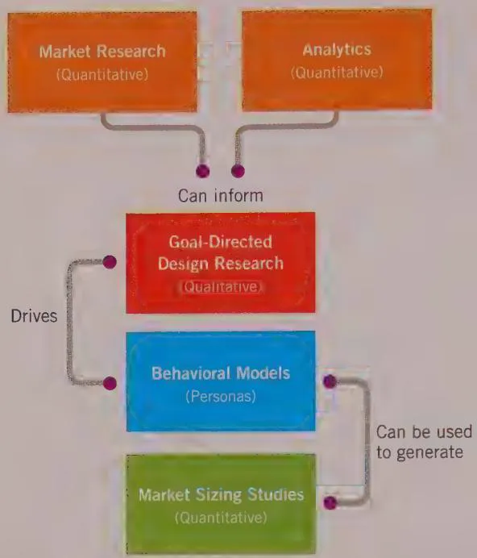
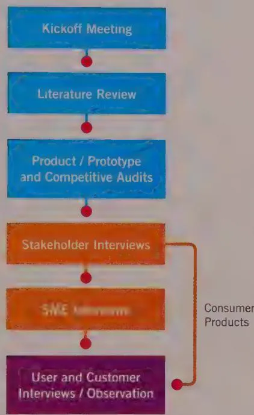

# UNDERSTANDING THE PROBLEM: DESIGN RESEARCH

The outcome of any design effort ultimately must be judged by how successfully it meets the needs of both the product's users and the organization that commissioned it. No matter how skillful or creative the designer, if she does not have clear and detailed knowledge of the users she is designing for, the problem's constraints, and the business or organizational goals that are driving the design, she will have little chance of success.

Insight into these topics can't easily be achieved by sifting through the numbers and graphs that come from quantitative studies such as market surveys (although these can be critical for answering other kinds of questions). Rather, this kind of behavioral and organizational knowledge can best be gathered via qualitative research techniques. There are many types of qualitative research, each of which can play an important role in understanding a product's design landscape. In this chapter, we'll focus on the specific qualitative research techniques that support the design methods we'll cover in later chapters. We'll also discuss how qualitative research techniques can enrich and be enriched by certain quantitative techniques. At the end of the chapter, we'll briefly cover some supplemental qualitative techniques and the research contexts for which they are appropriate.

# Qualitative versus Quantitative Data in Design Research

"Research" is a term that most people associate with science and objectivity. This association isn't incorrect, but it causes many people to believe that the only valid research is the kind that yields (supposedly) objective results: quantitative data. It is a common perspective in business and engineering that numbers represent truth. But numbers—especially statistics describing human activities—are subject to interpretation and can be manipulated just as easily as textual data.

Data gathered by the hard sciences like physics is simply different from that gathered about human activities. Electrons don't have moods that vary from minute to minute. The tight controls physicists place on their experiments to isolate observed behaviors are next to impossible in the social sciences. Any attempt to reduce human behavior to statistics is likely to overlook important nuances, which can make a huge difference in the design of products. Quantitative research can only answer questions about "how much" or "how many" along a few reductive axes. Qualitative research can tell you what, how, and why in rich detail that reflects the complexities of real human situations.

Social scientists have long realized that human behaviors are too complex and subject to too many variables to rely solely on quantitative data to understand them. Design and usability practitioners, borrowing techniques from anthropology and other social sciences, have developed many qualitative methods for gathering useful data on user behaviors to a more pragmatic end: to help create products that better serve user needs.

# Benefits of qualitative methods

Qualitative research helps us understand a product's domain, context, and constraints in different, more useful ways than quantitative research does. It also helps us identify patterns of behavior among a product's users and potential users much more quickly and easily than would be possible with quantitative approaches. In particular, qualitative research helps us understand the following:

- Behaviors, attitudes, and aptitudes of potential and existing product users   
- Technical, business, and environmental contexts—the domain—of the product to be designed

Vocabulary and other social aspects of the domain in question   
- How existing products are used

Qualitative research can also help the progress of design projects:

- It gives the design team credibility and authority, because design decisions can be traced to research results.   
- It gives the team a common understanding of domain issues and user concerns.   
- It empowers management to make more informed decisions about product design issues that would otherwise be based on guesswork or personal preference.

It's our experience that, in comparison, qualitative methods tend to be faster, less expensive, and more likely to provide useful answers to important questions that lead to superior design:

- How does the product fit into the broader context of people's lives?   
- What goals motivate people to use the product, and what basic tasks help people accomplish these goals?   
- What experiences do people find compelling? How do these relate to the product being designed?   
- What problems do people encounter with their current ways of doing things?

The value of qualitative studies is not limited to helping support the design process. In our experience, spending the time to deeply understand the user population can provide valuable business insights that are not revealed through traditional market research.

For example, a client once asked us to perform a user study for an entry-level consumer video-editing product for Windows users. An established developer of video-editing and -authoring software, the client had used traditional market research techniques to identify a significant business opportunity in developing a product for people who owned a digital video camera and a computer but hadn't yet connected the two.

In the field, we conducted interviews with a dozen users in the target market. Our first discovery was not surprising: The people who did the most videography and had the strongest desire to share edited versions of their videos were parents. The second discovery, however, was startling: Of the 12 people whose homes we visited, only one person

had successfully connected his video camera to his computer—and he had asked the IT guy at work to do it. One of the necessary preconditions of the product's success was that people should be able to transfer videos to their computer for editing. But at the time the project was commissioned, it was extremely difficult to make a FireWire or videocapture card function properly on an Intel-based PC.

As a result of four days of research, we were able to help our client decide to put the product on hold. This decision likely saved them a considerable amount of money.

# Strengths and limitations of quantitative methods

The marketing profession has taken much of the guesswork out of determining what motivates people to buy. One of the most powerful tools for doing so is market segmentation. Data from focus groups and market surveys is used to group potential customers by demographic criteria such as age, gender, amount of education, and home zip code. This helps determine what types of consumers will be most receptive to a particular product or marketing message. More-sophisticated consumer data may also include psychographics and behavioral variables, including attitudes, lifestyle, values, ideology, risk aversion, and decision-making patterns. Classification systems such as SRI's VALS segmentation and Jonathan Robbins's geodemographic PRIZM clusters can better clarify the data by predicting consumers' purchasing power, motivation to buy, self-orientation, and resources.

However, understanding if somebody wants to buy something is not the same thing as understanding what he or she might want to do with it after buying it. Market segmentation is a great tool for identifying and quantifying a market opportunity, but it's an ineffective tool for defining a product that will capitalize on that opportunity.

Similarly, quantitative measures such as web analytics and other attempts to numerically describe human behavior may certainly provide insightful answers to the what (or, at least, the how much) of the equation. But without a robust body of primary qualitative research that provides answers to the why of those behaviors, such statistical data may simply raise more questions than it answers.

# Quantitative research can help direct design research

Qualitative research is almost always the most effective means for gathering the behavioral knowledge that will help designers define and design products for users. However, quantitative data is not without its uses within the context of design research.

For example, market-modeling techniques can accurately forecast marketplace acceptance of products and services. As such, they are invaluable for assessing a product's viability. They can therefore be powerful tools for convincing executives to build a product. After all, if you know X people might buy a product or service for Y dollars, it is easier to evaluate the potential return on investment. Because market research can identify and quantify the business opportunity, it is often the necessary starting point for funding a design initiative.

In addition, designers planning to interview and observe users can refer to market research (when it exists) to help select interview targets. Particularly in the case of consumer products and services, demographic attributes such as lifestyle choice and stage of life more strongly influence user behaviors. We'll discuss the differences between market segmentation models and user models (persons) in more detail in Chapter 3.

Similarly, web and other usage data analytics are an excellent way to identify design problems that may be in need of solutions. If users are lingering in an area of your website or are not visiting any other areas, that is critical information to have before a redesign. But it will likely take qualitative research to help determine the root cause of such statistically gathered behaviors and thus derive the potential solutions. And, of course, analytics are useful only when you have an existing product to run them on.

# User research can inform market research

Qualitative research is almost always the tool of choice for characterizing user behaviors and latent needs. But there is one type of information, often seen as critical by business stakeholders, that qualitative research can't get you by itself: market sizing of the behavioral models. This is an ideal place to employ quantitative techniques (such as surveys) to fill in this missing information.

Once your users have been successfully represented by behavioral models (persons, which you'll read more about in Chapter 3), you can construct a survey. It will distinguish these different user types and capture traditional market demographic data that can then be correlated to the behavioral data. When this is successful, it can help determine—especially for consumer products—which user types should be prioritized when designing features and the overall product experience. We'll discuss this kind of persona-based market sizing a bit more in Chapter 3.

Figure 2-1 shows the relationship between various types of quantitative research and the qualitative Goal-Directed Design research techniques discussed in this chapter.

  
Figure 2-1: The relationship between quantitative research and qualitative, Goal-Directed design research

# Goal-Directed Design Research

Social science and usability texts are full of methods and techniques for conducting qualitative research; we encourage you to explore this literature. In this chapter, we focus on techniques that have been proven effective in our practice over the last decade. Occasionally we draw attention to similar techniques practiced in the design and usability fields at large. We avoid getting bogged down in theory, instead presenting these techniques in a succinct and pragmatic manner.

We have found the following qualitative research activities to be most useful in our Goal-Directed design practice (in rough order of execution):

Kickoff meeting   
Literature review   
Product/prototype and competitive audits   
Stakeholder interviews

- Subject matter expert (SME) interviews   
- User and customer interviews   
- User observation/ethnographic field studies

  
Figure 2-2 shows these activities.   
Figure 2-2: An overview of the Goal-Directed design research process

# Kickoff meeting

Although the project kickoff meeting isn't strictly a research activity, it contains an important component of research: It is an opportunity for designers to ask initial key questions of some of the most important stakeholders gathered at the meeting:

What is the product?   
Who will/does use it?   
What do your users need most?   
- Which customers and users are the most important to the business?

- What challenges do the design team and the business face moving forward?   
Who do you see as your biggest competitors? Why?   
- What internal and external literature should we look at to familiarize ourselves with the product and/or business and technical domain?

Although these questions may seem basic, they give the design team insight into not only the product itself, but also into how stakeholders think about their product, their users, and the design problem ahead. They will likely provide important clues about how to structure stakeholder and user interviews later in the process and will provide pointers to understanding the product domain. (This is particularly important if that domain is narrow or technical.)

# Literature review

Prior to or in parallel with stakeholder interviews, the design team should review any literature pertaining to the product or its domain. This can and should include the following types of documents:

- Internal documents including product marketing plans, brand strategy, market research studies, user surveys, technology specifications and white papers, competitive research, usability studies and metrics, customer support data such as call center statistics or transcripts, and user forum archives   
- Industry reports such as business and technical journal articles   
- Web searches for related and competing products, news items, independent user forums, blog posts, and social media discussion topics

The design team should collect this literature and use it as a basis for developing questions to ask stakeholders and SMEs. Later they can use it to supply additional domain knowledge and vocabulary and to check against compiled user data.

# Product/prototype and competitive audits

Prior to or in parallel with stakeholder and SME interviews, it is helpful for the design team to examine any existing version or prototype of the product, as well as its chief competitors. Doing so gives the design team a sense of the state of the art and provides fuel for questions during these interviews. Ideally, the design team should engage in an informal or expert review (sometimes also called a heuristic review) of both the current design (if any) and competitive product interfaces. They should compare each against interaction and visual design principles (such as those found later in this book). This procedure both familiarizes the team with the strengths and limitations of what is currently available to users and provides a general idea of the product's current functional scope.

# Stakeholder interviews

Research for any new product design should start with an understanding of the business and technical context surrounding the product. In almost all cases, the reason a product is being designed (or redesigned) is to achieve one or several specific business outcomes (most commonly, to make money). It is the designers' obligation to develop solutions without ever losing sight of these business goals. Therefore, it is critical that the design team begin its work by understanding the opportunities and constraints that are behind the design brief.

As Donald Schon so aptly puts it, "design is a conversation with materials." This means that, for a designer to craft an appropriate solution, he must understand the capabilities and limitations of the "materials" that will be used to construct the product, whether they be lines of code or extruded plastic. The best way to begin this understanding is by talking to the people responsible for managing and building the product.

Generally speaking, a stakeholder is anyone with authority and/or responsibility for the product being designed. More specifically, stakeholders are key members of the organization commissioning the design work. Typically they include executives, managers, and representative contributors from development, sales, product management, marketing, customer support, design, and usability. They may also include similar people from other organizations in business partnerships with the commissioning organization.

Interviews with stakeholders should occur before user research begins. Stakeholder discussions often inform how user research is conducted.

It is most effective to interview each stakeholder in isolation, rather than in a larger, cross-departmental group. A one-on-one setting promotes candor on the part of the stakeholder and ensures that individual views are not lost in a crowd. (One of the most interesting things you can discover in such interviews is the extent to which everyone in a product team shares—or doesn't share—a common vision.) Interviews need not last longer than about an hour. Follow-up meetings may be needed if a particular stakeholder is identified as an exceptionally valuable source of information.

Certain types of information are important to gather from stakeholders:

- Preliminary product vision—As in the fable of the blind men and the elephant, you may find that each business department has a slightly different and slightly incomplete perspective on the product to be designed. Part of the design approach therefore must involve harmonizing these perspectives with those of users and customers. If there is a serious disconnect in vision among stakeholders, that situation is a yellow flag to monitor and follow up on early in the process.

- Budget and schedule—Discussions on this topic often provide a reality check on the scope of the design effort and give management a decision point if user research indicates that a greater (or lesser) scope is required.   
- Technical constraints and opportunities—Another important determinant of design scope is a firm understanding of what is technically feasible given budget, time, and technology constraints. It is also often the case that a product is being developed to capitalize on a new technology. Understanding the opportunities underlying this technology can help shape the product's direction.   
- Business drivers—It is important for the design team to understand what the business is trying to accomplish. This again leads to a decision point, should user research indicate a conflict between business and user needs. The design must, as much as possible, create a win-win situation for users, customers, and providers of the product.   
Stakeholders' perceptions of their users—Stakeholders who have relationships with users (such as customer support representatives) may have important insights that will help you formulate your user research plan. You may also find that there are significant disconnects between some stakeholders' perceptions of their users and what you discover in your research. This information can become an important discussion point with management later in the process.

Understanding these issues and their impact on design solutions helps you as a designer better develop a successful product. Regardless of how desirable your designs are to customers and users, if you don't consider the viability and feasibility of the proposed solution, it's unlikely that the product will thrive.

Discussing these topics is also important to developing a common language and understanding among the design, management, and engineering teams. As a designer, your job is to develop a vision that the entire team believes in. If you don't take the time to understand everyone's perspective, it's unlikely that they will feel that proposed solutions reflect their priorities. Because these people have the responsibility and authority to deliver the product to the real world, they are guaranteed to have important knowledge and opinions. If you don't ask for it upfront, it is likely to be forced on you later, often in the form of a critique of your proposed solutions.

Keep in mind that although perspectives gathered from stakeholders are obviously important, you shouldn't accept them at face value. As you will later discover in user interviews, some people may express problems by trying to propose solutions. It's the designer's job to read between the lines of these suggestions, root out the real problems, and propose solutions appropriate to both the business and the users.

# Subject matter expert (SME) interviews

Early in a design project, it is often invaluable to identify and meet with several subject matter experts (SMEs)—authorities on the domain within which the product will operate. This is of critical importance in domains that are highly complex or very technical, or for which legal considerations exist. (The healthcare domain touches all three of these points.)

Many SMEs were users of the product or its predecessors at one time and may now be trainers, managers, or consultants. Often they are experts hired by stakeholders, rather than stakeholders themselves. Similar to stakeholders, SMEs can provide valuable perspectives on a product and its users. But designers should be careful to recognize that SMEs represent a somewhat skewed perspective because often, by necessity, they are invested in their understanding of the product/domain as it currently exists. This in-depth knowledge of product quirks and domain limitations can be at once a boon and a hindrance to innovative design.

Here are some other points to consider about using SMEs:

- SMEs are often expert users. Their long experience with a product or its domain means that they may have grown accustomed to current interactions. They may also lean toward expert controls rather than interactions designed for perpetual intermediates. (To understand the importance of this consideration, see Chapter 10.) SMEs often are not current users of the product and may have more of a management perspective.   
- SMEs are knowledgeable, but they aren't designers. They may have many ideas on how to improve a product. Some of these may be valid and valuable, but the most useful pieces of information to glean from these suggestions are the causative problems that lead to their proposed solutions. As with users, when you encounter a proposed solution, ask how it would help you or the user.   
- SMEs are necessary in complex or specialized domains. If you are designing for a technical domain such as medical, scientific, or financial services, you will likely need some guidance from SMEs, unless you are one yourself. Use SMEs to gather information on industry best practices and complex regulations. SME knowledge of user roles and characteristics is critical for planning user research in complex domains.   
- You will want access to SMEs throughout the design process. If your product domain requires the use of SMEs, you will need to bring them in at different stages of the design to help perform reality checks on design details. Make sure that you secure this access in your early interviews.

# Customer interviews

It is easy to confuse users with customers. With consumer products, customers are often the same as users, but in corporate or technical domains, users and customers rarely describe the same sets of people. Although both groups should be interviewed, each has its own perspective on the product that needs to be factored quite differently into an eventual design.

Customers of a product are those who decide to purchase it. For consumer products, customers frequently are also users of the product. For products aimed at children or teens, the customers are parents or other adult supervisors of children. In the case of most enterprise, medical, or technical products, the customer is someone very different from the user—often an executive or IT manager—with distinct goals and needs. It's important to understand customers and satisfy their goals to make a product viable. It is also important to realize that customers seldom actually use the product themselves, and when they do, they use it quite differently from how their users do.

When interviewing customers, you will want to understand the following:

Their goals in purchasing the product   
Their frustrations with current solutions   
Their decision process for purchasing a product of the type you're designing   
Their role in installing, maintaining, and managing the product   
- Domain-related issues and vocabulary

Like SMEs, customers may have many opinions about how to improve the product's design. It is important to analyze these suggestions, as in the case of SMEs, to determine what issues or problems underlie the ideas offered, because better, more integrated solutions may become evident later in the design process.

# User interviews

Users of a product should be the main focus of the design effort. They are the people who personally use the product to accomplish a goal (not their managers or support team). If you are redesigning or refining an existing product, it is important to speak to both current and potential users. These are people who do not currently use the product but who are good candidates for using it in the future because they have needs that the product can meet and are in the target market for the product. Interviewing both current and potential users illuminates the effect that experience with the current version of a product may have on how the user behaves and thinks about things.

Here is some information we are interested in learning from users:

- The context of how the product (or analogous system, if no current product exists) fits into their lives or work flow: when, why, and how the product is or will be used   
- Domain knowledge from a user perspective: What do users need to know to do their jobs?   
- Current tasks and activities: both those the current product is required to accomplish and those it doesn't support   
- Goals and motivations for using their product   
- Mental model: how users think about their jobs and activities, as well as what expectations users have about the product   
- Problems and frustrations with current products (or an analogous system if no current product exists)

# User observation

Most people are incapable of accurately assessing their own behaviors, $^2$ especially when these behaviors are removed from the context of people's activities. It is also true that out of fear of seeming dumb, incompetent, or impolite, many people may avoid talking about software behaviors that they find problematic or incomprehensible.

It then follows that interviews performed outside the context of the situations the designer hopes to understand will yield less-complete and less-accurate data. You can talk to users about how they think they behave, or you can observe their behavior firsthand. The latter route provides superior results.

Perhaps the most effective technique for gathering qualitative user data combines interviewing and observation, allowing the designers to ask clarifying questions and direct inquiries about situations and behaviors they observe in real time.

Many usability professionals use technological aides such as audio or video recorders to capture what users say and do. Interviewers must take care not to make these technologies too obtrusive; otherwise, the users will be distracted and behave differently than they would when not being recorded. In our practice, we've found that a notebook and a digital camera allow us to capture everything we need without compromising the honest exchange of information. Typically, we don't bring out the camera until we feel that we've established a good rapport with the interview subject. Then we use it to capture elements and artifacts in the environment that are difficult to jot down in our notes. Video, when used with care, can sometimes be a powerful rhetorical tool for achieving stakeholder buy-in to contentious or surprising research results. Video may also prove useful in situations where note-taking is difficult, such as in a moving car.

For consumer products, it can be hard to get a true picture of people's behaviors, especially if they will be using the product outside or in public. For these kinds of projects, a man-on-the-street approach to user observation can be effective. Using this approach, the design team casually observes product-related behaviors of people in public spaces. This type of technique is useful for understanding brick-and-mortar commerce-related behaviors that may translate into online behaviors, mobile-related behaviors of all sorts, or behaviors associated with specialized types of environments, such as theme parks and museums.

# Interviewing and Observing Users

Drawing on years of design research in practice, we believe that a combination of observation and one-on-one interviews is the most effective and efficient tool in a designer's arsenal for gathering qualitative data about users and their goals. The technique of ethnographic interviews is a combination of immersive observation and directed interview techniques.

Hugh Beyer and Karen Holtzblatt pioneered an ethnographic interviewing technique they call contextual inquiry. Their method has, for good reason, rapidly gained traction in the industry and provides a sound basis for qualitative user research. It is described in detail in the first four chapters of their book, Contextual Design (Morgan Kaufmann, 1998). Contextual inquiry methods closely parallel the methods described here, but with some subtle and important differences.

# Contextual inquiry

Contextual inquiry, according to Beyer and Holtzblatt, is based on a master-apprentice model of learning: observing and asking questions of the user as if she is the master craftsman, and the interviewer the new apprentice. Beyer and Holtzblatt also enumerate four basic principles of engaging in ethnographic interviews:

- Context—Rather than interviewing the user in a clean white room, it is important to interact with and observe the user in her normal work environment, or whatever physical context is appropriate for the product. Observing users as they perform activities and questioning them in their own environments, filled with the artifacts they use each day, can bring to light the all-important details of their behaviors.   
- Partnership—The interview and observation should take the tone of a collaborative exploration with the user, alternating between observation of work and discussion of its structure and details.   
- Interpretation—Much of the designer's work is reading between the lines of facts gathered about users' behaviors, their environment, and what they say. The designer

must take these facts together as a whole and analyze them to uncover the design implications. Interviewers must be careful, however, to avoid assumptions based on their own interpretation of the facts without verifying these assumptions with users.

- Focus—Rather than coming to interviews with a set questionnaire or letting the interview wander aimlessly, the designer needs to subtly direct the interview so as to capture data relevant to design issues.

# Improving on contextual inquiry

Contextual inquiry forms a solid theoretical foundation for qualitative research, but as a specific method it has some limitations and inefficiencies. The following process improvements, in our experience, result in a more highly leveraged research phase that better sets the stage for successful design:

- Shorten the interview process. Contextual inquiry assumes full-day interviews with users. The authors have found that interviews as short as one hour can be sufficient to gather the necessary user data, provided that a sufficient number of interviews (about six well-selected users for each hypothesized role or type) are scheduled. It is much easier and more effective to find a diverse set of users who will consent to an hour with a designer than it is to find users who will agree to spend an entire day.   
- Use smaller design teams. Contextual inquiry assumes a large design team that conducts multiple interviews in parallel, followed by debriefing sessions in which the full team participates. We've found that it is more effective to conduct interviews sequentially with the same designers in each interview. This allows the design team to remain small (two or three designers). But even more importantly, it means that the entire team interacts with all the interviewed users directly, allowing the members to most effectively analyze and synthesize the user data.   
- Identify goals first. Contextual inquiry feeds a design process that is fundamentally task-focused. We propose that ethnographic interviews identify and prioritize user goals before determining the tasks that relate to these goals.   
- Look beyond business contexts. The vocabulary of contextual inquiry assumes a business product and a corporate environment. Ethnographic interviews are also possible in consumer domains, although the focus of questioning is somewhat different, as discussed next.

# Preparing for ethnographic interviews

Ethnography is a term borrowed from anthropology; it means the systematic and immersive study of human cultures. In anthropology, ethnographic researchers spend years living in the cultures they study and record. Ethnographic interviews take the spirit of

this type of research and apply it on a micro level. Rather than trying to understand behaviors and social rituals of an entire culture, the goal is to understand the behaviors and rituals of people interacting with individual products.

# Identifying candidates

Because the designers must capture an entire range of user behaviors regarding a product, it is critical that the designers identify an appropriately diverse sample of users and user types when planning a series of interviews. Based on information gleaned from stakeholders, SMEs, and literature reviews, designers need to create a hypothesis that serves as a starting point in determining what sorts of users and potential users to interview.

# The persona hypothesis

We label this starting point the persona hypothesis, because it is the first step toward identifying and synthesizing personas—the behavioral user models we will discuss in detail in the next chapter. The persona hypothesis should be based on likely behavior patterns and the factors that differentiate these patterns, not purely on demographics. It is often the case with consumer products that demographics are used as screening criteria to select interview subjects. But even in this case, they should serve as a proxy for a hypothesized behavior pattern.

The nature of a product's domain makes a significant difference in how a personal hypothesis is constructed. Business users are often quite different from consumer users in their behavior patterns and motivations, and different techniques are used to build the persona hypothesis in each case.

The persona hypothesis is a first try at defining the different kinds of users (and sometimes customers) for a product. The hypothesis is the basis for initial interview planning; as interviews proceed, new interviews may be required if the data indicates the existence of user types not originally identified.

The persona hypothesis attempts to address, at a high level, these three questions:

What different sorts of people might use this product?   
- How might their needs and behaviors vary?   
- What ranges of behavior and types of environments need to be explored?

# Roles in business and consumer domains

For business products, roles—common sets of tasks and information needs related to distinct classes of users—provide an important initial organizing principle. For example, for an office phone system, we might find these rough roles:

People who make and receive calls from their desks   
People who travel a lot and need to access the phone system remotely   
- Receptionists who answer the phone for many people   
People who technically administer the phone system

In business and technical contexts, roles often map roughly to job descriptions. Therefore, it is relatively easy to get a reasonable first cut of user types to interview by understanding the kinds of jobs held by users (or potential users) of the system.

Unlike business users, consumers don't have concrete job descriptions, and their use of products may cross multiple contexts. Therefore, it often isn't meaningful to use roles as an organizing principle for the persona hypothesis for a consumer product. Rather, it is often the case that you will see the most significant patterns emerge from users' attitudes and aptitudes, lifestyle choices, or stage of life, all of which can influence their behaviors.

# Behavioral and demographic variables

In addition to roles, a persona hypothesis should be based on variables that help differentiate between various kinds of users based on their needs and behaviors. This is often the most useful way to distinguish between different types of users (and it forms the basis for the persona-creation process described in the next chapter). Despite the fact that these variables can be difficult to fully anticipate without research, they often become the basis of the persona hypothesis for consumer products. For example, for an online store, we might identify several ranges of behavior concerning shopping:

Frequency of shopping (from frequent to infrequent)   
- Desire to shop (from loves to shop to hates to shop)   
Motivation to shop (from bargain hunting to searching for just the right item)

Although consumer user types can often be roughly defined by the combination of behavioral variables they map to, behavioral variables are also important for identifying types of business and technical users. People within a single business-role definition may have different needs and motivations. Behavioral variables can capture this, although often not until user data has been gathered.

Given the difficulty in accurately anticipating behavioral variables before user data is gathered, another helpful approach in building a persona hypothesis is making use of demographic variables. When planning your interviews, you can use market research to identify ages, locations, gender, and incomes of the target markets for the product. Interviewees should be distributed across these demographic ranges in the hope of interviewing a sufficiently diverse group of people to identify the significant behavior patterns.

# Domain expertise versus technical expertise

One important type of behavioral distinction is the difference between technical expertise (knowledge of digital technology) and domain expertise (knowledge of a specialized subject area pertaining to a product). Different users will have varying amounts of technical expertise. Similarly, some users of a product may be less expert in their knowledge of the product's domain (for example, accounting knowledge in the case of a general ledger application). Thus, depending on who the design target of the product is, domain support may be a necessary part of the product's design, as well as technical ease of use. A relatively naive user will likely never be able to use more than a small subset of a domain-specific product's functions without domain support provided in the interface. If naive users are part of the target market for a domain-specific product, care must be taken to support domain-naive behaviors.

# Environmental considerations

A final consideration, especially in the case of business products, is the cultural differences between organizations in which the users are employed. At small companies, for example, workers tend to have a broader set of responsibilities and more interpersonal contact. Huge companies often have multiple layers of bureaucracy, and their workers tend to be highly specialized. Here are some examples of these environmental variables:

Company size (from small to multinational)   
Company location (North America, Europe, Asia, and so on)   
- Industry/sector (electronics manufacturing, consumer packaged goods, and so on)   
IT presence (from ad hoc to draconian)   
Security level (from lax to tight)

Like behavioral variables, these may be difficult to identify without some domain research, because patterns vary significantly by industry and geographic region.

# Putting together a plan

After you have created a persona hypothesis, complete with potential roles and behavioral, demographic, and environmental variables, you need to create an interview plan that can be communicated to the person in charge of coordinating and scheduling the interviews.

In our practice, we've observed that, for enterprise or professional products, each presumed behavioral pattern requires about a half-dozen interviews to verify or refute (occasionally more if a domain is particularly complex). What this means in practice is that each identified role, behavioral variable, demographic variable, and environmental variable identified in the persona hypothesis should be explored in four to six interviews (or occasionally more, as mentioned earlier).

However, these interviews can overlap. Suppose we believe that use of an enterprise product may differ by geographic location, industry, and company size. Research at a single small electronics manufacturer in Taiwan would allow us to cover several variables at once. By being clever about mapping variables to interviewee-screening profiles, you can keep the interviews to a manageable number.

Consumer products typically have much more variation in behavior, so more interviews typically are required to really delineate the differences. A good rule of thumb is to double the numbers just discussed: 8 to 12 interviews for each user type postulated in the persona hypothesis. As before, a complex consumer product may occasionally require even more interviews to accurately capture the range of behaviors and motivations. Something to keep in mind with consumer products is that lifestyle choices and life stages (single, married, young children, older children, empty nest) can multiply the interviews for certain kinds of products.

# Conducting ethnographic interviews

After the persona hypothesis has been formulated and an interview plan has been derived from it, you are ready to interview—assuming you get access to interviewees! While formulating the interview plan, designers should work closely with project stakeholders who have access to users. Stakeholder involvement generally is the best way to make interviews happen, especially for business and technical products.

For enterprise or technical products, it is often straightforward to work with stakeholders to help you get in touch with a robust set of interviewees. This can be more challenging for consumer products (especially if the company you are working with doesn't currently have a good relationship with its users).

If stakeholders can't help you get in touch with users, you can contact a market or usability research firm that specializes in finding people for surveys and focus groups. These firms are useful for reaching consumers with diverse demographics. The difficulty with this approach is that it can sometimes be challenging to find interviewees who will permit you to interview them in their homes or places of work.

As a last alternative for consumer products, designers can recruit friends and relatives. This makes it easier to observe the interviewees in a natural environment but also is quite limiting as far as diversity of demographic and behavioral variables are concerned.

# Interview teams and timing

The authors favor a team of two designers per interview. The moderator drives the interview and takes light notes, and the facilitator takes detailed notes and looks for any holes in the questioning. These roles can switch halfway through the interview if the team agrees. One hour per user interviewed is often sufficient, except in the case of complex domains such as medical, scientific, and financial services. These may require more time to fully understand what the user is trying to accomplish. Be sure to budget travel time between interview sites. This is especially true of consumer interviews in residential neighborhoods, or interviews that involve "shadowing" users as they interact with a (usually mobile) product while moving from place to place. Teams should try to limit interviews to six per day. This will give them adequate time for debriefing and strategizing between interviews and will keep the interviewers from getting fatigued.

# Phases of ethnographic interviews

A complete set of ethnographic interviews for a project can be grouped into three distinct, chronological phases. The approach of the interviews in each successive phase is subtly different from the previous one, reflecting the growing knowledge of user behaviors that results from each additional interview. Focus tends to be broad at the start, aimed at gross structural and goal-oriented issues, and more narrow for interviews at the end of the cycle, zooming in on specific functions and task-oriented issues.

- Early interviews are exploratory in nature and focus on gathering domain knowledge from the user's point of view. Broad, open-ended questions are common, with a lesser degree of drilldown into details.   
- Middle interviews are where designers begin to see patterns of use and ask open-ended and clarifying questions to help connect the dots. Questions in general are more focused on domain specifics, now that the designers have absorbed the domain's basic rules, structures, and vocabularies.

- Late interviews confirm previously observed patterns, further clarifying user roles and behaviors and making fine adjustments to assumptions about task and information needs. More closed-ended questions are used, tying up loose ends in the data.

After you have an idea who your interviewees will be, it can be useful to work with stakeholders to schedule individuals most appropriate for each phase in the interview cycle. For example, in a complex, technical domain it is often a good idea to perform early interviews with more patient and articulate interview subjects. In some cases, you may also want to loop back and interview this particularly knowledgeable and articulate subject again at the end of the interview cycle to address any topics you were unaware of during your initial interview.

# Basic methods

The basic methods of ethnographic interviewing are simple, straightforward, and very low-tech. Although the nuances of interviewing subjects take some time to master, any practitioner should, if he or she follows these suggestions, be rewarded with a wealth of useful qualitative data:

- Interview where the interaction happens.   
- Avoid a fixed set of questions.   
Assume the role of an apprentice, not an expert.   
- Use open-ended and closed-ended questions to direct the discussion.   
Focus on goals first and tasks second.   
- Avoid making the user a designer.   
- Avoid discussing technology.   
Encourage storytelling.   
- Ask for a show-and-tell.   
- Avoid leading questions.

We describe each of these methods in more detail in the following sections.

# Interview where the interaction happens

Following the first principle of contextual inquiry, it is of critical importance that subjects be interviewed in the places where they actually use the products. Not only does this allow the interviewers to witness the product being used, but it also gives the interview

team access to the environment in which the interaction occurs. This can give you tremendous insight into product constraints and user needs and goals.

Observe the environment closely: It is likely to be crawling with clues about tasks the interviewee might not have mentioned. Notice, for example, the kind of information he needs (papers on his desk or adhesive notes on his screen border), inadequate systems (cheat sheets and user manuals), the frequency and priority of tasks (inbox and outbox), and the kind of work flows he follows (memos, charts, calendars). Don't snoop without permission, but if you see something that looks interesting, ask your interviewee to discuss it.

# Avoid a fixed set of questions

If you approach ethnographic interviews with a fixed questionnaire, you not only run the risk of alienating the interview subject, but you also can cause the interviewers to miss out on a wealth of valuable user data. The entire premise of ethnographic interviews (and contextual inquiry) is that we as interviewers don't know enough about the domain to presuppose the questions that need asking. We must learn what is important from the people we talk to. That said, it's certainly useful to have types of questions in mind. Depending on the domain, it may also be useful to have a standardized set of topics you want to be sure to cover during your interview. This list of topics may evolve over the course of your interviews, but it will help you ensure that you gather enough details from each interview that you can recognize significant behavior patterns.

Here are some goal-oriented questions to consider:

- Goals—What makes a good day? A bad day?   
Opportunity-What activities currently waste your time?   
- Priorities—What is most important to you?   
Information-What helps you make decisions?

Another useful type of question is the system-oriented question:

- Function—What are the most common things you do with the product?   
Frequency-What parts of the product do you use most?   
- Preference—What are your favorite aspects of the product? What drives you crazy?   
- Failure—How do you work around problems?   
- Expertise—What shortcuts do you employ?

For business products, work flow-oriented questions can be helpful:

- Process—What did you do when you first came in today? What did you do after that?   
- Occurrence and recurrence—How often do you do this? What things do you do weekly or monthly, but not every day?   
- Exception—What constitutes a typical day? What would be an unusual event?

To better understand user motivations, you can employ attitude-oriented questions:

- Aspiration—What do you see yourself doing five years from now?   
- Avoidance—What would you prefer not to do? What do you procrastinate on?   
- Motivation—What do you enjoy most about your job (or lifestyle)? What do you always tackle first?

# Assume the role of an apprentice, not an expert

During your interviews, you want to shed your expert designer or consultant cap and take on the role of the apprentice. Your goal is to omnivorously and nonjudgmentally absorb everything your interviewees want to tell you and to encourage them to actively engage in detailed, thoughtful explanations. Don't be afraid to ask naive questions. They put people at ease, and you'd be surprised how often seemingly silly questions end up pushing past assumptions and lead to real insights. Be a sympathetic and receptive listener, and you'll find that people will be willing to share almost any kind of information with you.

# Use open-ended and closed-ended questions to direct the discussion

As Kim Goodwin discusses in her excellent book, Designing for the Digital Age (Wiley, 2009), the use of open-ended and closed-end questions allows interviewers to help keep user interviews productive and on the right track.

Open-ended questions encourage detailed responses from the interviewee. Use these types of questions to elicit more detail about a topic on which you need to gather more information. Typical open-ended questions begin with "Why," "How," or "What."

Closed-ended questions encourage a brief response. Use closed-ended questions to shut down a line of inquiry or to get an interviewee back on track if he has begun to take the interview in an unproductive direction. Closed-ended questions generally expect a yes or no answer and typically begin with "Did you," "Do you," or "Would you."

After an interviewee answers your closed-ended question, usually a natural pause in the conversation occurs. Then you can redirect the discussion to a new line of questioning using a new open-ended question.

# Focus on goals first and tasks second

Unlike contextual inquiry and the majority of other qualitative research methods, the first priority of ethnographic interviewing is understanding the why of users. You need to know what motivates the behaviors of individuals in different roles and how they hope to ultimately accomplish this goal, not the what of the tasks they perform. Understanding the tasks is important, and the tasks must be recorded diligently. But these tasks will ultimately be restructured to better match user goals in the final design.

# Avoid making the user a designer

Guide the interviewee toward examining problems and away from expressing solutions. Most of the time, those solutions reflect the interview subject's personal priorities. Although they sound good to him, they tend to be shortsighted and idiosyncratic. They also lack the balance and refinement that an interaction designer can bring to a solution based on adequate research and years of experience. That said, a proposed design solution can be a useful jumping-off point to discuss a user's goals and the problems he encounters with the current systems. If a user blurts out an interesting idea, ask, "What problem would that solve for you?" or "Why would that be a good solution?"

# Avoid discussing technology

Just as you don't want to treat the user like a designer, you also don't want to treat him like a software engineer. Discussing technology is meaningless without first understanding the purpose underlying any technical decisions. In the case of technical or scientific products, where technology is always an issue, distinguish between domain-related technology and product-related technology, and steer away from the latter. If an interview subject insists on talking about how the product should be implemented, return to his goals and motivations by asking, "How would that help you?"

# Encourage storytelling

Far more useful than asking users for design advice is encouraging them to tell specific stories about their experiences with a product (whether an old version of the one you're redesigning, or an analogous product or process). Ask them how they use it, what they think of it, who else they interact with when using it, where they go with it, and so forth. Detailed stories of this kind usually are the best way to understand how users relate to

and interact with products. Encourage stories that deal with typical cases and also more exceptional ones.

# Ask for a show-and-tell

After you have a good idea of the flow and structure of a user's activities and interactions, and you have exhausted other questions, it is often useful to ask the interviewee for a show-and-tell or grand tour of artifacts related to the design problem. These can be domain-related artifacts, software interfaces, paper systems, tours of the work environment, or ideally all of these. Be sure not to just record the artifacts themselves (digital or video cameras are handy at this stage); also pay attention to how the interviewee describes them. Be sure to ask plenty of clarifying questions as well.

As you look to capture artifacts from the user's environment, be on particular lookout for signs of unmet needs or failures in the existing design. For example, in one of our past projects, we were engaged to redesign the software interface as an expensive piece of scientific equipment. As we interviewed users—who were primarily chemists—we observed that next to every machine we looked at was a notebook filled with details of every experiment run on that machine: which scientist did it, what it was about, and when it was run. It turned out that although the equipment recorded detailed results for each experiment, it recorded no other information about the experiment other than a sequential ID number. If the paper notebook were lost, the experimental results would be nearly useless, because the ID number meant nothing to the users. This was clearly an unmet user need!

# Avoid leading questions

One important thing to avoid in interviews is the use of leading questions. Just as in a courtroom, where lawyers can, by virtue of their authority, bias witnesses by suggesting answers to them, designers can inadvertently bias interview subjects by implicitly (or explicitly) suggesting solutions or opinions about behaviors. Here are some examples of leading questions:

Would feature X help you?   
- You like X, don't you?   
- Do you think you'd use feature X if it were available?   
- Does X seem like a good idea to you?

# After the interviews

After each interview, teams compare notes and discuss any particularly interesting trends observed or specific points brought up in the most recent interview. If they have the time, they should also look back at old notes to see whether unanswered questions from other interviews and research have been answered properly. This information should be used to strategize about the approach to take in subsequent interviews.

After the interview process is finished, the design team should make a pass through all the notes, marking or highlighting trends and patterns in the data. This is very useful for the next step of creating personas from the cumulative research. This marking, when it also involves organizing the marked responses into topic groups, is called coding by serious ethnographers. Although that level of organization usually is overkill, it may be useful in particularly complex or nuanced domains.

If it is helpful, the team can create a binder of the notes, review any video recordings, and print artifact images to place in the binder or on a public surface, such as a wall, where they are all visible simultaneously. This will be useful in later design phases.

# Other Types of Qualitative Research

The majority of this chapter has focused on the qualitative research techniques we employ to construct the robust user and domain models described in the next chapter. Design and usability professionals incorporate many other forms of research, ranging from detailed task analysis to focus groups and usability tests. While these activities may indeed contribute to the creation of useful and desirable products, we have found that the Goal-Directed approach described earlier in this chapter provides the most value to the process of digital product design. Put simply, the Goal-Directed approach helps answer questions about the product at both the big-picture and functional-detail level with a relatively small amount of effort and expense. No other research technique we're aware of can claim this.

If you're interested in exploring alternative design research techniques, Observing the User Experience (Morgan Kaufmann, 2012) by Elizabeth Goodman, Mike Kuniavsky, and Andrea Moed is an excellent resource. It describes a wide range of user research methods that can be used at many points in the design and development process.

In the remainder of this chapter, we'll discuss a few of the more prominent of these research methods and how they can fit into the overall design and development effort.

# Focus groups

Marketing organizations are particularly fond of gathering user data via focus groups. Representative users, usually chosen to match previously identified demographic segments of the target market, are gathered in a room and asked a structured set of questions and provided a structured set of choices. Often the meeting is recorded on audio or video media for later reference. Focus groups are a standard technique in traditional product marketing. They are also quite useful for gauging initial reactions to a product's form—its visual appearance or industrial design. Focus groups can also gather reactions to a product that the respondents have been using for some time.

Although focus groups may appear to provide the requisite user contact, the method is in many ways inappropriate as an interaction design tool. Focus groups excel at eliciting information about products that people own or are willing (or unwilling) to purchase, but they are weak at gathering data about what people actually do with those products, or how and why they do it. Also, because they are a group activity, focus groups tend to end up at consensus. The majority or loudest opinion often becomes the group opinion. This is counterproductive for an interaction design process, where designers must understand all the different patterns of behavior a product must address. Focus groups tend to stifle exactly the diversity of behavior and opinion that interaction designers must accommodate.

# Usability testing

Usability testing (also known, somewhat unfortunately, as "user testing") is a collection of techniques used to measure characteristics of a user's interaction with a product. The goal usually is to assess that product's usability. Typically, usability testing is focused on measuring how well users can complete specific, standardized tasks, as well as what problems they encounter in doing so. Results often reveal areas where users have problems understanding and using the product, as well as places where users are more likely to be successful.

Usability testing requires a fairly complete and coherent design artifact to test against. Whether you are testing production software, a clickable prototype, or even a paper prototype, the point of the test is to validate a product design. This means that the appropriate place for usability testing is quite late in the design cycle, after there is a coherent concept and sufficient detail to generate such prototypes. We discuss evaluative usability testing as part of design refinement in Chapter 5.

A case could be made for usability testing at the beginning of a redesign effort. The technique is certainly capable of finding opportunities for improvement in such a project. However, we find that we can better assess product inadequacies through our qualitative

studies. Perhaps the budget is limited in a way that allows usability testing only once in a product design initiative. If so, we find much more value in performing the tests after we have a candidate solution, as a means of testing the specific elements of the new design.

# Card sorting

Popularized by information architects, card sorting is a technique to understand how users organize information and concepts. Although the technique has a number of variations, it is typically performed by asking users to sort a deck of cards, each containing a piece of functionality or information related to the product or website. The tricky part is analyzing the results, either by looking for trends or using statistical analysis to uncover patterns and correlations.

While this can be a valuable tool to uncover one aspect of a user's mental model, the technique assumes that the subject has refined organizational skills and that how he sorts a group of abstract topics will correlate to how he will end up wanting to use your product. In our experience, this is not always the case.

One way to overcome these potential challenges is to ask the users to sequence the cards based on the completion of tasks that the product is being designed to support. Another way to enhance the value of a card sort study is to debrief the subject afterwards to understand any organizational principles he has employed in his sort (again, attempting to understand his mental model).

Ultimately, we believe that properly conducted open-ended interviews can explore these aspects of the user's mental model more effectively. By asking the right questions and paying close attention to how a subject explains his activities and the domain, you can decipher how he mentally associates different bits of functionality and information.

# Task analysis

Task analysis refers to a number of techniques that involve using either questionnaires or open-ended interviews to develop a detailed understanding of how people currently perform specific tasks. Such a study is concerned with the following:

- Why the user is performing the task (that is, the underlying goal)   
The frequency and importance of the task   
Cues—what initiates or prompts the execution of the task   
- Dependencies—what must be in place to perform the task, as well as what is dependent on the completion of the task   
People who are involved, and their roles and responsibilities

- Specific actions that are performed   
- Decisions that are made   
Information that is used to support decisions   
What goes wrong—errors and exception cases   
- How errors and exceptions are corrected

Once the questionnaires are compiled or the interviews are completed, tasks are formally decomposed and analyzed. Typically they are incorporated into a flowchart or similar diagram that communicates the relationships between actions and often the relationships between people and processes.

We've found that this type of inquiry should be incorporated into ethnographic user interviews. Furthermore, as we'll discuss in the next chapter, the analysis activities are a useful part of our modeling activities. Task analysis is a critical way of understanding how users currently do something, as well as identifying pain points and opportunities for improvement. However, task analysis does little to illuminate users' goals. How people do things today is often a product of the obsolete systems and organizations they are forced to interact with. How people do things often bears little resemblance to how they would like to do things or how they can be most effective.

# Research Is Critical to Good Design

User research is the critical foundation on which your designs are built. Take the time to plan your user research and match the appropriate technique to the appropriate place in your development cycle. Your product will benefit, and you'll avoid wasting time and resources. Putting a product to the test in a lab to see whether it passes or fails may provide a lot of data, but not necessarily a lot of value. Using ethnographic interviews at the beginning of the process allows you, as a designer, to truly understand your users, their needs, and their motivations. Once you have a solid design concept based on qualitative user research and the models that research feeds, your usability testing will become an even more efficient tool for judging the effectiveness of design choices you have made. Goal-Directed design research allows you to do the heavy lifting early in the process.

# Notes

1. Schon, D. and Bennett, J., 1996   
2. Pinker, 1999

$\left( {0 < x}\right) t + x < p - 1 < 1.$

