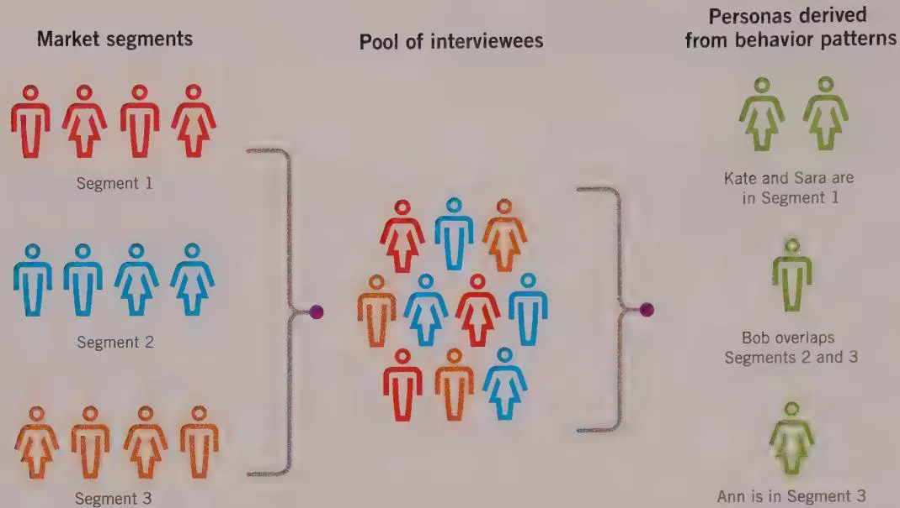
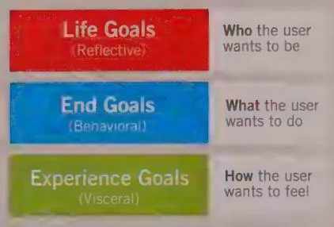
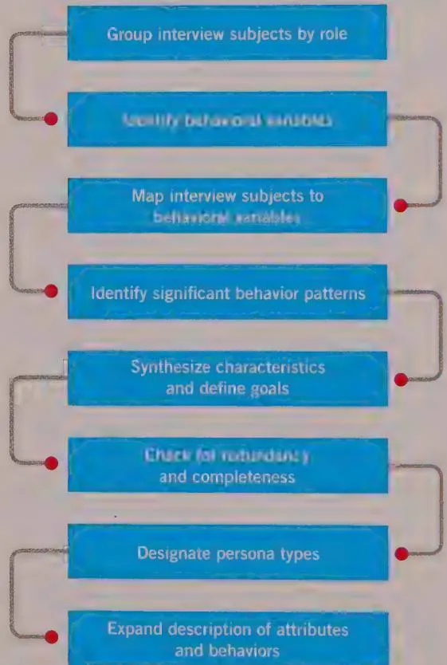
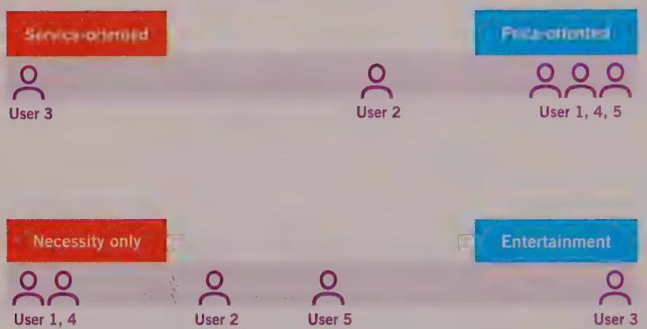

# MODELING USERS: PERSONAS AND GOALS

Once you have spent some time out in the field investigating your users' lives, motivations, and environs, the question naturally arises: How do you use all this great research data to forge a successful product design? You have notebooks full of conversations and observations, and it is very likely that each person you spoke to was slightly different from the others. It is hard to imagine digging through hundreds of pages of notes every time you need to make a design decision. Even if you had the time to do so, it isn't entirely obvious how these notes should inform your thinking. How do you make sense of them and prioritize?

We solve this problem by applying the powerful concept of a model.

# Why Model?

Models are used in the natural and social sciences to represent complex phenomena with a useful abstraction. Good models emphasize the salient features of the structures and relationships they represent and de-emphasize the less significant details. Because we are designing for users, it is important that we can understand and visualize the salient aspects of their relationships with each other, what they want, with their social and physical environments, and, of course, with the products we hope to design.

Thus, much as economists create models to describe the behavior of markets, and physicists create models to describe the behavior of subatomic particles, we have found that using our research to create descriptive models of users is a uniquely powerful tool for interaction design. We call these user models personas.

Personas provide us with a precise way of thinking and communicating about how groups of users behave, how they think, what they want to accomplish, and why. Personas are not real people, but they are assembled from the behaviors and motivations of the many actual users we encounter in our research. In other words, personas are composite archetypes based on behavior patterns uncovered during the course of our research, which we formalize for the purpose of informing the product design. By using personas, we can develop an understanding of our users' goals in specific contexts—a critical tool for ideating and validating design concepts.

Persons, like many powerful tools, are simple in concept but must be applied with considerable nuance and sophistication. It is not enough to whip up a couple of user profiles based on stereotypes and generalizations, nor is it particularly useful to attach a stock photograph to a job title and call it a "persona." For personas to be effective tools for design, considerable rigor and finesse must be applied during the process of identifying the significant and meaningful patterns in user behavior and determining how these behaviors translate into archetypes that accurately represent the appropriate cross section of users.

Although other useful models can serve as tools for the interaction designer, such as work flow models and physical models, we've found that personas are the most effective and fundamental of these tools. Also, it is often possible to incorporate the best of these other modeling techniques into the structure of your personas.

This chapter focuses primarily on personas and their goals. Other models are considered briefly at the end of the chapter.

# The Power of Personas

To create a product that must satisfy a diverse audience of users, logic might tell you to make its functionality as broad as possible to accommodate the most people. This logic, however, is flawed. The best way to successfully accommodate a variety of users is to design for specific types of individuals with specific needs.

When you broadly and arbitrarily extend a product's functionality to include many constituencies, you increase the cognitive load and navigational overhead for all users. Facilities that may please some users will likely interfere with the satisfaction of others, as shown in Figure 3-1.

  
Figure 3-1: If you try to design an automobile that pleases every possible driver, you end up with a car with every possible feature that pleases nobody. Software today is too often designed to please too many users, resulting in low user satisfaction. Figure 3-2 provides an alternative approach.

  
Alessandro's goals

- Go fast   
- Have fun

  
Marge's goals

- Be safe   
- Be comfortable

  
Dale's goals

- Haul big loads   
- Be reliable

  
Figure 3-2: By designing different cars for different people with different specific goals, we can create designs that other people with needs similar to our target drivers also find satisfying. The same holds true for the design of digital products and software.

The key to this approach is to first choose the right individuals to design for—users whose needs best represent the needs of a larger set of key constituents (see Figure 3-2). Then you prioritize these individuals so that the needs of the most important users are met without compromising our ability to meet the needs of secondary users. Personas provide a powerful tool for communicating about different types of users and their needs and then deciding which users are the most important to target in the design of form and behavior.

# Strengths of personas as a design tool

The persona is a powerful, multipurpose design tool that helps overcome several problems that plague the development of digital products. Personas help designers do the following:

- Determine what a product should do and how it should behave. Persona goals and tasks provide the foundation for the design effort.   
- Communicate with stakeholders, developers, and other designers. Personas provide a common language for discussing design decisions and also help keep the design centered on users at every step in the process.   
- Build consensus and commitment to the design. With a common language comes a common understanding. Personas reduce the need for elaborate diagrammatic models; it's easier to understand the many nuances of user behavior through the narrative structures that personas employ. Put simply, because personas resemble real people, they're easier to relate to than feature lists and flowcharts.   
- Measure the design's effectiveness. Design choices can be tested on a persona in the same way that they can be shown to a real user during the formative process. Although this doesn't replace the need to test with real users, it provides a powerful reality-check tool for designers trying to solve design problems. This allows design iteration to occur rapidly and inexpensively at the whiteboard, and it results in a far stronger design baseline when it's time to test with actual people.   
- Contribute to other product-related efforts such as marketing and sales plans. The authors have seen personas repurposed across their clients' organizations, informing marketing campaigns, organizational structure, customer support centers, and other strategic planning activities. Business units outside of product development want sophisticated knowledge of a product's users and typically view personas with great interest.

# Design pitfalls that personas help avoid

Persons also can resolve three design issues that arise during product development:

The elastic user   
Self-referential design   
- Edge cases

# The elastic user

Although satisfying the users of our products is our goal, the term user causes trouble when applied to specific design problems and contexts. Its imprecision makes it dangerous as a design tool, because every person on a product team has his own conceptions of who the user is and what the user needs. When it's time to make product decisions, this "user" becomes elastic, conveniently bending and stretching to fit the opinions and presuppositions of whoever is talking.

If the product development team finds it convenient to use a confusing tree control containing nested, hierarchical folders to provide access to information, they might define the user as a computer-literate "power user." Other times, when it is more convenient to step through a difficult process with a wizard, they define the user as an unsophisticated first-time user. Designing for the elastic user gives a product team license to build what it pleases, while still apparently serving "the user." Of course, our goal should be to design products that appropriately meet the needs of real users. Real users—and the personas representing them—are not elastic, but instead have specific requirements based on their goals, abilities, and contexts.

Even focusing on user roles or job titles rather than specific archetypes can introduce unproductive elasticity to the focus of design activities. For example, in designing clinical products, it might be tempting to lump together all nurses as having similar needs. However, if you have any experience in a hospital, you know that trauma nurses, pediatric intensive-care nurses, and operating room nurses are quite different from each other, each with their own attitudes, aptitudes, needs, and motivations. Nurses new to the role look at their work differently than nurses who are veteran to the job. A lack of precision about the user can lead to a lack of clarity about how the product should behave.

# Self-referential design

Self-referential design occurs when designers or developers project their own goals, motivations, skills, and mental models onto a product's design. Many "cool" product designs fall into this category. The audience doesn't extend beyond people like the designer. This is fine for a narrow range of products but is inappropriate for most others. Similarly, developers apply self-referential design when they create implementation-model products. They understand perfectly how the data is structured and how software works and are comfortable with such products. Few non-developers would concur.

# Edge cases

Another syndrome that personas help prevent is designing for edge cases—situations that might happen but that usually won't for most people. Typically, edge cases must be designed and programmed for, but they should never be the design focus. Personas provide

a reality check for the design. We can ask, "Will Julie want to perform this operation very often? Will she ever?" With this knowledge, we can prioritize functions with great clarity.

# Why Personas Are Effective

Persons are user models that are represented as specific, individual human beings. As we've discussed, they are not actual people but are synthesized directly from research and observations of real people. One of the reasons personas are so successful as user models is that they are personifications: They engage the empathy of the design and development team around the users' goals.

Empathy is critical for the designers, who will be making their decisions about design frameworks and details based on the persona's cognitive and emotional dimensions, as typified by the persona's goals. (We will discuss the important connections between goals, behaviors, and personas later in this chapter.) However, the power of empathy should not be discounted for other team members. Not only do personas help make our design solutions better at serving real user needs, but they also make these solutions more compelling to stakeholders. When personas have been carefully and appropriately crafted, stakeholders and engineers begin to think about them as if they are real human beings and become much more interested in creating a product that will give this person a satisfying experience.

We're all aware of the power of fictional characters in books, movies, and television programs to engage viewers. Jonathan Grudin and John Pruitt have discussed how this can relate to interaction design. They also note the power of Method acting as a tool that actors use to understand and portray realistic characters. In fact, the process of creating personas from user observation, and then imagining and developing scenarios from the perspective of these personas, is in many ways analogous to Method acting. Our colleague Jonathan Korman used to call the Goal-Directed use of personas the Stanislavski Method of interaction design.

# Personas are based on research

Persons, like any models, should be based on real-world observation. As discussed in the preceding chapter, the primary source of data used to synthesize personas should be in-context interviews borrowing from ethnographic techniques, contextual inquiry, or other similar dialogues with and observation of actual and potential users. The quality of the data gathered following the process (outlined in Chapter 2) impacts the efficacy of personas in clarifying and directing design activities. Other data can support and supplement the creation of personas (listed in rough order of effectiveness):

- Interviews with users outside of their use contexts   
Information about users supplied by stakeholders and subject matter experts (SMEs)

Market research data such as focus groups and surveys   
Market-segmentation models   
Data gathered from literature reviews and previous studies

However, none of this supplemental data can take the place of direct user interviews and observation. Almost every aspect of a well-developed persona can be traced back to sets of user statements or behaviors.

# Personas represent types of users of a specific product

Although personas are depicted as specific individuals, because they function as archetypes, they represent a class or type of user of a specific interactive product. A persona encapsulates a distinct set of behavior patterns regarding the use of a particular product (or analogous activities if a product does not yet exist). You identify these behaviors by analyzing interview data. They are supported by supplemental data (qualitative or quantitative) as appropriate. These patterns, along with specific motivations or goals, define our personas. Personas are also occasionally called composite user archetypes because personas are, in a sense, composites assembled by grouping related usage patterns observed across individuals in similar roles during the Research phase.3

# Personas used across multiple products

Organizations with more than one product often want to reuse the same personas. However, to be effective, personas must be context-specific: They should focus on the behaviors and goals related to the specific domain of a particular product. Personas, because they are constructed from specific observations of users interacting in specific contexts, cannot easily be reused across products, even when those products form a closely linked suite.

For a set of personas to be an effective design tool for multiple products, the personas must be based on research concerning the usage contexts for all these products. In addition to broadening the scope of the research, an even larger challenge is to identify manageable and coherent sets of behavior patterns across all the contexts. You shouldn't assume that just because two users exhibit similar behaviors in regard to one product, those two users would behave similarly with respect to a different product.

As the focus expands to encompass more and more products, it becomes increasingly difficult to create a concise and coherent set of personas that represents the diversity of real-world users. We've found that, in most cases, personas should be researched and developed individually for different products.

# Archetypes versus stereotypes

Don't confuse persona archetypes with stereotypes. Stereotypes are, in most respects, the antithesis of well-developed personas. Stereotypes usually are the result of designer or product team biases and assumptions, rather than factual data. Personas developed by drawing on inadequate research (or synthesized with insufficient empathy and sensitivity to interview subjects) run the risk of degrading to caricatures. Personas must be developed and treated with dignity and respect for the people they represent. If the designer doesn't respect his personas, nobody else will either.

Persons sometimes bring issues of social and political consciousness to the forefront. Because personas provide a precise design target and also serve as a communication tool for the development team, the designer must choose particular demographic characteristics with care. Ideally, persona demographics should be a composite reflection of what researchers have observed in the interview population, modulated by broader market research. Personas should be typical and believable, but not stereotypical. If the data is inconclusive or the characteristic is unimportant to the design or its acceptance, we prefer to err on the side of gender, ethnic, age, and geographic diversity.

# Personas explore ranges of behavior

The target market for a product describes demographics as well as lifestyles and sometimes job roles. What it does not describe are the ranges of different behaviors exhibited by members of that target market regarding the product and related situations. Ranges are distinct from averages: Personas do not seek to establish an average user; they express exemplary or definitive behaviors within these identified ranges.

Because products must accommodate ranges of user behavior, attitudes, and aptitudes, designers must identify a persona set associated with any given product. Multiple personas carve ranges of behavior into discrete clusters. Different personas represent different correlated behavior patterns. You arrive at these correlations by analyzing research data. This process of identifying behaviors is discussed in greater detail later in this chapter.

# Personas have motivations

All humans have motivations that drive their behaviors; some are obvious, but many are subtle. It is critical that personas capture these motivations in the form of goals. The goals we enumerate for our personas (discussed at length later in this chapter) are shorthand for motivations that not only point to specific usage patterns but also provide a reason why those behaviors exist. Understanding why a user performs certain tasks

gives designers great power to improve or even eliminate tasks yet still accomplish the same goals. We can't overemphasize how important goals are for personas. In fact, we would go so far as to say that if your user model doesn't have any goals, what you have is not a persona.

# Personas can represent relevant nonusers

The users and potential users of a product should always be an interaction designer's primary concern. However, sometimes it is useful to represent the needs and goals of people who do not use the product but nevertheless must be considered in the design process. For example, it is commonly the case with enterprise software (and children's toys) that the person who purchases the product is not the same person who uses it. In these cases, it may be useful to create one or more customer personas, distinct from the set of user personas. Of course, these should also be based on behavior patterns observed through ethnographic research, just as user personas are.

Similarly, for many medical products, patients do not interact directly with the user interface, but they have motivations and objectives that may be very different from those of the clinician using the product. Creating a served persona to represent patients' needs can be useful in these cases. We discuss served and customer personas in greater depth later in this chapter.

Nearly all networked software products have to take into account potential pranksters and malicious hackers. And sometimes for political reasons you need to embody a persona for whom the product specifically does not intend to serve. Each of these types of nonusers can be embodied in an anti-persona to have on hand in strategy, security, and design discussions.

# Personas are more appropriate design tools than other user models

Many other user models are commonly employed in the design of interactive products, including user roles, user profiles, and market segments. These are similar to personas in that they seek to describe users and their relationship to a product. However, personas and the methods by which they are created and employed as a design tool differ significantly from these other user models in several key ways.

# User roles

A user role or role model, as defined by Larry Constantine, is an abstraction—a defined relationship between a class of users and their problems, including needs, interests,

expectations, and patterns of behavior. $^{6}$ Agile development processes similarly reduce its users to their role. $^{7}$ As abstractions (generally taking the form of a list of attributes), they are not imagined as people and typically do not attempt to convey broader human motivations and contexts.

Holtzblatt and Beyer's use of roles in consolidated flow and cultural, physical, and sequence models is similar. It attempts to abstract various attributes and relationships from the people possessing them.[8]

We find these methods limiting for several reasons:

- It is more difficult to clearly communicate human behaviors and relationships in the abstract, isolated from the people who possess them. The human power of empathy cannot easily be brought to bear on abstract classes of people.   
- Both methods focus myopically on tasks almost exclusively and neglect the use of goals as an organizing principle for design thinking and synthesis.   
- Holtzblatt and Beyer's consolidated models, although useful and encyclopedic in scope, are difficult to bring together as a coherent tool for developing, communicating, and measuring design decisions.

Persons address each of these problems. Well-developed personas describe the same types of behaviors and relationships that user roles do, but they express them in terms of goals and examples in narrative. This makes it possible for designers and stakeholders to understand the implications of design decisions in human terms. Describing a persona's goals provides context and structure for tasks, incorporating how culture and work flow influence behavior.

In addition, focusing on user roles rather than on more complex behavior patterns can oversimplify important distinctions and similarities between users. It is possible to create a persona that represents the needs of several user roles. (For example, when a mobile phone is designed, a traveling salesperson might also represent the needs of a busy executive who's always on the road.) It is also possible that there are several people in the same role who think and act differently. (Perhaps a procurement planner in the chemical industry thinks about her job very differently from a procurement planner in the consumer electronics industry.) In consumer domains, roles are next to useless. If you're designing a website for a car company, "car buyer" is meaningless as a design tool. Different people approach the task in very different ways.

In general, personas provide a more holistic model of users and their contexts, whereas many other models seek to be more reductive. Personas can certainly be used in

<!-- Chunk 2 End -->

<!-- Chunk 3 Start -->

combination with these other modeling techniques. As we'll discuss at the end of the chapter, some other models make extremely useful complements to personas.

# Personas versus user profiles

Many usability practitioners use the terms persona and user profile synonymously. There is no problem with this if the profile is synthesized from first-hand ethnographic data and encapsulates the depth of information the authors have described. Unfortunately, all too often, the authors have seen user profiles that reflect Webster's definition of profile as a "brief biographical sketch." In other words, user profiles often consist of a name and picture attached to a short, mostly demographic description, along with a short paragraph of information unrelated to the design task at hand, for example, describing the kind of car this person drives, how many kids he has, where he lives, and what he does for a living. This kind of user profile is likely to be based on a stereotype. Although we give our personas names, and sometimes even cars and family members, these are employed sparingly. Supporting fictive detail plays only a minor part in persona creation. It is used just enough to make the persona come to life in the minds of the designers and product team.

# Personas versus market segments

Marketing professionals may be familiar with a process similar to persona development because it shares some process similarities with market definition. The main difference between market segments and design personas is that the former are based on demographics, distribution channels, and purchasing behavior, whereas the latter are based on usage behavior and goals. The two are not the same and don't serve the same purpose. Marketing personas shed light on the sales process, whereas design personas shed light on the product definition and development process.

However, market segments play a role in persona development. They can help determine the demographic range within which to frame the persona hypothesis (see Chapter 2). Personas are segmented along ranges of usage behavior, not demographics or buying behavior, so there is seldom a one-to-one mapping of market segments to personas. Rather, market segments can act as an initial filter to limit the scope of interviews to people within target markets (see Figure 3-3). Also, we typically use the prioritization of personas as a way to make strategic product definition decisions (see the discussion of persona types later in this chapter). These decisions should incorporate market intelligence; understanding the relationship between user personas and market segments can be an important consideration here.

  
Figure 3-3: Personas versus market segments. Market segments can be used in the Research phase to limit the range of personas to target markets. However, there is seldom a one-to-one mapping between market segments and personas.

# Understanding Goals

If personas provide the context for sets of observed behaviors, goals are the drivers behind those behaviors. User goals serve as a lens through which designers must consider a product's functions. The product's function and behavior must address goals via tasks—typically, as few tasks as necessary. Remember, tasks are only a means to an end; goals are that end.

# Goals motivate usage patterns

People's or personas' goals motivate them to behave as they do. Thus, goals don't just provide an answer to why and how personas want to use a product. They also can serve as shorthand in the designer's mind for the sometimes complex behaviors in which a persona engages and, therefore, for their tasks as well.

# Goals should be inferred from qualitative data

You usually can't ask a person what his goals are directly. Either he'll be unable to articulate them, or he'll be inaccurate or even imperfectly honest. People simply are unprepared to answer such self-reflective questions accurately. Therefore, designers and researchers need to carefully reconstruct goals from observed behaviors, answers to

other questions, nonverbal cues, and clues from the environment, such as the titles of books on shelves. One of the most critical tasks in the modeling of personas is identifying goals and expressing them succinctly: Each goal should be expressed as a simple sentence.

# User goals and cognitive processing

Don Norman's book *Emotional Design* (Basic Books, 2005) introduced the idea that product design should address three different levels of cognitive and emotional processing: visceral, behavioral, and reflective. Norman's ideas, based on years of cognitive research, provide an articulated structure for modeling user responses to product and brand and a rational context for many intuitions long held by professional designers:

- Visceral is the most immediate level of processing. Here we react to a product's visual and other sensory aspects that we can perceive before significant interaction occurs. Visceral processing helps us make rapid decisions about what is good, bad, safe, or dangerous. This is one of the most exciting types of human behavior, and one of the most challenging to effectively support with digital products. Malcolm Gladwell explores this level of cognitive processing in his book Blink (Little, Brown and Company, 2005). For an even more in-depth study of intuitive decision making, see Gary Klein's Sources of Power (MIT Press, 1998) or Hare Brain, Tortoise Mind by Guy Claxton (Ecco, 1999).   
- Behavioral is the middle level of processing. It lets us manage simple, everyday behaviors. According to Norman, these constitute the majority of human activity. Norman states—and rightly so—that historically, interaction design and usability practices have nearly exclusively addressed this level of cognitive processing. Behavioral processing can enhance or inhibit both lower-level visceral reactions and higher-level reflective responses. Conversely, both visceral and reflective processing can enhance or inhibit behavioral processing.   
- **Reflective** is the least immediate level of processing. It involves conscious consideration and reflection on past experiences. Reflective processing can enhance or inhibit behavioral processing but has no direct access to visceral reactions. This level of cognitive processing is accessible only via memory, not through direct interaction or perception. The most interesting aspect of reflective processing as it relates to design is that, through reflection, we can integrate our experiences with designed artifacts into our broader life experiences and, over time, associate meaning and value with the artifacts themselves.

# Designing for visceral response

Designing for the visceral level means designing what the senses initially perceive, before any deeper involvement with a product or artifact occurs. For most of us, that means

designing visual appearance and motion, although sound can also play a role—think of the distinctive Mac power-up chord. People designing devices may design for tactile sensations as well.

A misconception often arises when visceral-level design is discussed: that designing for visceral response is about designing beautiful things. Battlefield software and radiation-therapy systems are just two examples where designing for beauty may not be the proper focus. Visceral design is actually about designing for affect—that is, eliciting the appropriate psychological or emotional response for a particular context—rather than for aesthetics alone. Beauty—and the feelings of transcendence and pleasure it evokes—is really only a small part of the possible affective design palette. For example, an MP3 player and an online banking system require very different affects. We can learn a great deal about affect from architecture, the cinema and stage, and industrial design.

However, in the world of consumer products and services, attractive user interfaces are typically appropriate. Interestingly, usability researchers have demonstrated that users initially judge attractive interfaces to be more usable, and that this belief often persists long after a user has gained sufficient experience with an interface to have direct evidence to the contrary.[9] Perhaps the reason for this is that users, encouraged by perceived ease of use, make a greater effort to learn what may be a challenging interface and are then unwilling to consider their investment ill spent. For the scrupulous designer, this means that, when a user interface promises ease of use at the visceral level—or whatever else the visceral promise of an interaction may be—it should then be sure to deliver on that promise at the behavioral level.

# Designing for behavior

Designing for the behavioral level means designing product behaviors that complement the user's own behaviors, implicit assumptions, and mental models. Of the three levels of design Norman contemplates, behavioral design is perhaps the most familiar to interaction designers and usability professionals.

One intriguing aspect of Norman's three-level model as it relates to design is his assertion that behavioral processing, uniquely among his three levels, has direct influence on and is influenced directly by both of the other two levels of processing. This would seem to imply that the day-to-day behavioral aspects of interaction design should be the primary focus of our design efforts, with visceral and reflective considerations playing a supporting role. Getting behavior design right—assuming that we also pay adequate attention to the other levels—provides our greatest opportunity to positively influence how users construct their experience with products.

Not following this line of reasoning can cause users' initial impressions to be out of sync with reality. Also, it is difficult to imagine designing for reflective meaning in memory

without a solid purpose and set of behaviors in place for the here and now. The user experience of a product or artifact, therefore, should ideally harmonize elements of visceral design and reflective design with a focus on behavioral design.

# Designing for reflection

Reflective processing—and, particularly, what it means for design—is perhaps the most challenging aspect of the three levels of processing that Norman discusses. What is clear is that designing for the reflective level means designing to build long-term product relationships. What is unclear is the best way to ensure success—if that's even possible—at the reflective level. Does chance drive success here—being in the right place at the right time—or can premeditated design play a part in making it happen?

In describing reflective design, Norman uses several high-concept designs for commodity products as examples, such as impractically configured teapots and the striking Phillipe Starck juicer that graces the cover of his book. It is easy to see how such products—whose value and purpose are, in essence, the aesthetic statements they make—could appeal strongly to people's reflective desire for uniqueness or cultural sophistication that perhaps may come from an artistic or stylish self-image.

It is more difficult to see how products that also serve a truly useful purpose need to balance the stylistic and the elegant with the functional. The Apple iPhone comes very close to achieving this balance. Its direct manipulation touch interface merges almost seamlessly with its sleek industrial design. Its reflective potential is also significant, because of the powerful emotional connection people experience with their personal communications and their music (the iPhone is, of course, also an iPod). It's a winning combination that no single competitor has been able to challenge.

Few products become iconic in people's lives in the way that, say, the Sony Walkman or the iPhone has. Clearly some products stand little chance of ever becoming symbolic in people's lives—like Ethernet routers, for instance—no matter how wonderful they look or how well they behave. However, when the design of a product or service addresses users' goals and motivations—possibly going beyond the product's primary purpose, yet somehow connected to it via personal or cultural associations—the opportunity to create reflective meaning is greatly enhanced.

# The three types of user goals

In Emotional Design, Norman presents his three-level theory of cognitive processing and discusses its potential importance to design. However, Norman does not suggest a method for systematically integrating his model of cognition and affect into the practice of design or user research. In our practice, we've found that the key to doing so lies

in properly delineating and modeling three specific types of user goals as part of each persona's definition.[10]

Three types of user goals correspond to Norman's visceral, behavioral, and reflective processing levels (see Figure 3-4):

Experience goals   
End goals   
Life goals

  
Figure 3-4: The three types of user goals

# Experience goals

Experience goals are simple, universal, and personal. Paradoxically, this makes them difficult for many people to talk about, especially in the context of impersonal business. Experience goals express how someone wants to feel while using a product, or the quality of his or her interaction with the product. These goals provide focus for a product's visual and aural characteristics, its interactive feel—such as animated transitions, latency, touch response, and a button's snap ratio (clickiness)—its physical design, and its microinteractions. These goals also offer insights into persona motivations that express themselves at the visceral level:

Feel smart and in control   
Have fun   
Feel reassured about security and sensitivity   
Feel cool or hip or relaxed   
- Remain focused and alert

When products make users feel stupid or uncomfortable, it's unpleasant, and their effectiveness and enjoyment plummets, regardless of their other goals. Their level of resentment also increases. If they experience enough of this type of treatment, users will be primed to subvert the system. Any product that egregiously violates experience goals will ultimately fail, regardless of how well it purports to achieve other goals.

Interaction, visual, and industrial designers must translate persona experience goals into form, behavior, motion, and auditory elements that communicate the proper feel, affect, emotion, and tone. Visual language studies, as well as mood or inspiration boards, which attempt to establish visual themes based on persona attitudes and behaviors, are a useful tool for defining personas' tonal expectations.

# End goals

End goals represent the user's motivation for performing the tasks associated with using a specific product. When you pick up a cell phone or open a document with a word processor, you likely have an outcome in mind. A product or service can help accomplish such goals directly or indirectly. These goals are the focus of a product's interaction design and information architecture and the functional aspects of industrial design. Because behavioral processing influences both visceral and reflective responses, end goals should be among the most significant factors in determining the overall product experience. End goals must be met for users to think that a product is worth their time and money.

Here are some examples of end goals:

- Be aware of problems before they become critical.   
- Stay connected with friends and family.   
Clear my to-do list by 5:00 p.m. every day.   
Find music that I'll love.   
Get the best deal.

Interaction designers must use end goals as the foundation for a product's behaviors, tasks, look, and feel. Context or day-in-the-life scenarios and cognitive walkthroughs are effective tools for exploring users' goals and mental models, which, in turn, facilitate appropriate behavioral design.

# Life goals

Life goals represent the user's personal aspirations that typically go beyond the context of the product being designed. These goals represent deep drives and motivations that

help explain why the user is trying to accomplish the end goals he seeks to accomplish. Life goals describe a persona's long-term desires, motivations, and self-image attributes, which cause the persona to connect with a product. These goals are the focus of a product's overall design, strategy, and branding:

Live the good life.   
- Succeed in my ambitions to...   
- Be a connoisseur of...   
- Be attractive, popular, and respected by my peers.

Interaction designers must translate life goals into high-level system capabilities, formal design concepts, and brand strategy. Mood boards and context scenarios can be helpful in exploring different aspects of product concepts, and broad ethnographic research and cultural modeling are critical for discovering users' behavior patterns and deeper motivations. Life goals rarely figure directly into the design of an interface's specific elements or behaviors. However, they are very much worth keeping in mind. A product that the user discovers will take him closer to his life goals, not just his end goals, will win him over more decisively than any marketing campaign. Addressing users' life goals makes the difference (assuming that other goals are also met) between a satisfied user and a fanatically loyal user.

# User goals are user motivations

In summary, it's important to remember that understanding personas is more about understanding motivations and goals than it is about understanding specific tasks or demographics. Linking persona goals with Norman's model, top-level user motivations include the following:

- Experience goals, which are related to visceral processing: how the user wants to feel   
- End goals, which are related to behavior: what the user wants to do   
- Life goals, which are related to reflection: who the user wants to be

Using personas, goals, and scenarios (as you'll learn in upcoming chapters) provides the key to unlocking the power of visceral, behavioral, and reflective design and bringing these together into a harmonious whole. While some of our best designers seem to understand and act on these aspects of design almost intuitively, consciously designing for all levels of human cognition and emotion offers tremendous potential for creating more satisfying and affective user experiences.

# Nonuser goals

User goals are not the only type of goals that designers need to take into account. Customer goals, business goals, and technical goals are all nonuser goals. Typically, these goals must be acknowledged and considered, but they do not form the basis of the design direction. Although these goals do need to be addressed, they must not be addressed at the user's expense.

# Customer goals

Customers, as already discussed, have different goals than users. The exact nature of these goals varies quite a bit between consumer and enterprise products. Consumer customers often are parents, relatives, or friends who often have concerns about the safety and happiness of the people for whom they are purchasing the product. Enterprise customers typically are IT managers or procurement specialists, and they often have concerns about security, ease of maintenance, ease of customization, and price. Customer personas also may have their own life, experience, and especially end goals in relation to the product if they use it in any capacity. Customer goals should never trump end goals but need to be considered within the overall design.

# Business and organizational goals

Businesses and other organizations have their own requirements for products, services, and systems, which you also should model and consider when devising design solutions. The goals of businesses, where users and customers work, are captured in user and customer personas, as well as organizational "personas" (discussed later in this chapter). It is important to identify the business goals of the organization commissioning the design and developing and selling (or otherwise distributing) the product early in the design process. Clearly, these organizations are hoping to accomplish something with the product (which is why they are willing to spend money and effort on design and development).

Business goals include the following:

- Increase profit.   
- Increase market share.   
- Retain customers.   
- Defeat the competition.   
Use resources more efficiently.   
Offer more products or services.   
- Keep its IP secure.

You may find yourself designing on behalf of an organization that is not necessarily a business, such as a museum, nonprofit, or school (although many such organizations are run as businesses these days). These organizations also have goals that must be considered, such as the following:

Educate the public.   
- Raise enough money to cover overhead.

# Technical goals

Most of the software-based products we use every day are created with technical goals in mind. Many of these goals ease the task of software creation, maintenance, scalability, and extensibility, which are developers' goals. Unfortunately meeting these goals often comes at the expense of user goals. Technical goals include the following:

- Run in a variety of browsers.   
- Safeguard data integrity.   
- Increase application execution efficiency.   
- Use a particular development language or library.   
- Maintain consistency across platforms.

Technical goals in particular are essential to the development staff. It is important to stress early in the education process that these goals must ultimately serve user and business goals. Technical goals are not terribly meaningful to a product's success unless they are derived from the need to meet other, more human-oriented goals. It might be a software company's task to use new technology, but it is rarely the user's goal for them to do so. In most cases, users don't care if their job is accomplished with hierarchical databases, relational databases, object-oriented databases, flat-file systems, or black magic. What we care about is getting our job done swiftly, effectively, and with a modicum of ease and dignity.

# Successful products meet user goals first

"Good design" has meaning only for someone who uses a product for a particular purpose. You cannot have purposes without people. The two are inseparable. This is why personas are such an important tool in the process of designing behavior: They represent specific people with specific purposes or goals.

The most important purposes or goals to consider when designing a product are the goals of the individuals who actually use the product, not necessarily the goals of its purchasers or its developers. A real person, not a corporation or even an IT manager,

interacts with your product. Therefore, you must regard her personal goals as more significant than those of the corporation that employs her, the IT manager who supports her, or the developer who builds for her. Your users will do their best to achieve their employer's business goals, while at the same time looking after their own personal goals. The user's most important goal is always to retain her human dignity and not feel stupid.

We can reliably say that we make the user feel stupid if we let her make big mistakes, keep her from getting an adequate amount of work done, or bore her.

DESIGN PRINCIPLE

Don't make the user feel stupid.

This is probably the most important interaction design guideline. This book examines numerous ways in which existing software makes the user feel stupid, and we explore ways to avoid that trap.

The essence of good interaction design is devising interactions that achieve the goals of the manufacturer or service provider and its partners while supporting user goals.

# Constructing Personas

As previously discussed, personas are derived from qualitative research—especially the behavioral patterns observed during interviews with and observations of a product's users and potential users (and sometimes customers). Gaps in this data are filled by supplemental research and data provided by SMEs, stakeholders, quantitative research, and other available literature. Our goal in constructing a set of personas is to represent the diversity of observed motivations, behaviors, attitudes, aptitudes, constraints, mental models, work or activity flows, environments, and frustrations with current products or systems.

Creating believable and useful personas requires an equal measure of detailed analysis and creative synthesis. A standardized process aids both of these activities significantly. The process described in this section is the result of an evolution in practice over the span of hundreds of interaction design projects, developed by industry veterans Robert Reimann, Kim Goodwin, and Lane Halley during their tenure at Cooper.

There are a number of effective methods for identifying behavior patterns in research and turning these into useful user archetypes. We've found the transparency and rigor of this process to be an ideal way for designers new to personas to learn how to properly

construct personas. It also helps experienced designers to stay focused on actual behavior patterns, especially in consumer domains. Figure 3-5 shows the principle steps:

1 Group interview subjects by role.   
2 Identify behavioral variables.   
3 Map interview subjects to behavioral variables.   
4 Identify significant behavior patterns.   
5 Synthesize characteristics and define goals.   
6 Check for completeness and redundancy.   
7 Designate persona types.   
8 Expand the description of attributes and behaviors.

  
Figure 3-5: Overview of the persona creation process

# Step 1: Group interview subjects by role

After you have completed your research and performed a cursory organization of the data, group your interviewees according to their roles. For enterprise applications, roles

are easy to delineate, because they usually map to job roles or descriptions. Consumer products have more subtle role divisions, including family roles, attitudes or approaches to relevant activities, or interests and aptitudes regarding lifestyle choices.

# Step 2: Identify behavioral variables

Once you've grouped your interviewees by role, list the distinct aspects of observed behavior for each role as a set of behavioral variables. Demographic variables such as age or geographic location may sometimes seem to affect behavior. But be wary of focusing on demographics, because behavioral variables will be far more useful in developing effective user archetypes.

Generally, we see the most important distinction between behavior patterns emerge by focusing on the following types of variables:

- Activities—What the user does; frequency and volume   
Attitudes—How the user thinks about the product domain and technology   
- Aptitudes—What education and training the user has; ability to learn   
Motivations—Why the user is engaged in the product domain   
Skills-User abilities related to the product domain and technology

Although the number of variables will differ from project to project, it is typical to find 15 to 30 variables per role.

These variables may be very similar to those you identified as part of your persona hypothesis. Compare behaviors identified in the data to the assumptions made in the persona hypothesis. Were the possible roles that you identified truly distinct? Were the behavioral variables (see Chapter 2) you identified valid? Were there additional, unanticipated ones, or ones you anticipated that weren't supported by data?

List the complete set of behavioral variables observed. If your data is at variance with your assumptions, you need to add, subtract, or modify the roles and behaviors you anticipated. If the variance is significant enough, you may consider additional interviews to cover any gaps in the new behavioral ranges you've discovered.

# Step 3: Map interview subjects to behavioral variables

After you are satisfied that you have identified the set of significant behavioral variables exhibited by your interview subjects, the next step is to map each interviewee against each variable. Some of these variables will represent a continuous range of behavior,

such as confidence in using technology. Others will represent multiple discrete choices, such as using a digital camera versus using a film camera.

Mapping the interviewee to a precise point in the range isn't as critical as identifying the placement of interviewees in relationship to each other. In other words, it doesn't matter if an interviewee falls at precisely 45 or 50 percent on the scale. There's often no good way to measure this precisely; you must rely on your gut feeling based on your observations of the subject. The desired outcome of this step is to accurately represent how multiple subjects cluster with respect to each significant variable, as shown in Figure 3-6.

  
Figure 3-6: Mapping interview subjects to behavioral variables. This example is from an online store. Interview subjects are mapped across each behavioral axis. Precision of the absolute position of an individual subject on an axis is less important than its relative position to other subjects. Clusters of subjects across multiple axes indicate significant behavior patterns.

# Step 4: Identify significant behavior patterns

After you have mapped your interview subjects, look for clusters of subjects that occur across multiple ranges or variables. A set of subjects who cluster in six to eight different variables will likely represent a significant behavior pattern that will form the basis of a persona. Some specialized roles may exhibit only one significant pattern, but typically you will find two or even three such patterns.

For a pattern to be valid, there must be a logical or causative connection between the clustered behaviors, not just a spurious correlation. For example, there is clearly a logical connection if data shows that people who regularly purchase CDs also like to download MP3 files. But there is probably no logical connection if the data shows that interviewees who frequently purchase CDs online are also vegetarians.

# Step 5: Synthesize characteristics and define goals

We derive a persona's goals and other attributes from their behaviors. These behaviors are synthesized from what was observed/identified in the research process as representing meaningful, typical use of the product over a period of time that adequately captures the relevant set of user actions. We call this a "day in the life," but the period of time really depends on the product or service being used and exactly what the persona does with it. Executive personas, for example, often have particular behaviors associated with quarterly and yearly earnings reports. Consumers often have behaviors particular to their culture's holidays that should be investigated.

For each significant behavior pattern you identify, you must synthesize details from your data. These details should include the following at a minimum:

The behaviors themselves (activities and the motivations behind them)   
The use environment(s)   
- Frustrations and pain points related to the behavior using current solutions   
Demographics associated with the behavior   
Skills, experience, or abilities relating to the behavior   
Attitudes and emotions associated with the behavior   
- Relevant interactions with other people, products, or services   
Alternate or competing ways of doing the same thing, especially analog techniques

At this point, brief bullet points describing the behavior's characteristics are sufficient. Stick to observed behaviors as much as possible. A description or two that sharpens the personalities of your personas can help bring them to life. However, too much fictional biography, especially if it includes quirky details, is a distraction and makes your personas distracting. Remember that you are creating a design tool, not a character sketch for a novel. Only concrete data can support the design and business decisions your team will ultimately make.

One fictional detail at this stage is important: the personas' first and last name. The name should evoke the type of person the persona is without tending toward distracting uniqueness, caricature, or stereotype. We use a number of techniques to help create persona names, but a standard go-to is the app and site http://random-name-generator.info/. You can also, at this time, add some demographic information such as age, geographic location, relative income (if appropriate), and job title. This information primarily helps you visualize the persona better as you assemble the behavioral details. From this point on, you should refer to the persona by his or her name.

# Defining goals

Goals are the most critical detail to synthesize from your interviews and observations of behaviors. Goals are best derived by analyzing the behavior patterns comprising each persona. By identifying the logical connections between each cluster of interviewees' behaviors, you can begin to infer the goals that lead to those behaviors. You can infer goals both by observing actions (what interview subjects in each persona cluster are trying to accomplish and why) and by analyzing subject responses to goal-oriented interview questions (see Chapter 2).

To be effective as design tools, goals must always relate directly, in some way, to the product being designed. Typically, the majority of useful goals for a persona are end goals. You can expect most personas to have three to five end goals associated with them. Life goals are most useful for personas of consumer-oriented products, but they can also make sense for enterprise personas in transient job roles. Zero or one life goal is appropriate for most personas. General experience goals such as "Don't feel stupid" and "Don't waste time" can be taken as implicit for almost any persona. Occasionally, a specific domain may dictate the need for more specific experience goals; zero to two experience goals is appropriate for most personas.

# Personas and social relationships

It sometimes makes sense for a product's set of personas to be part of the same family or team within an organization and to have interpersonal or social relationships with each other.

When considering whether it makes sense for personas to have business or social relationships, think about these two points:

- Whether you observed any behavioral variations in your interview subjects related to variations in company size, industry, or family/social dynamic (In this case, you'll want to make sure that your persona set represents this diversity by being situated in at least a couple of different businesses or social settings.)   
- If it is critical to illustrate workflow or social interactions between coworkers or members of a family or social group

If you create personas that work for the same company or that have social relationships with each other, you might run into difficulties if you need to express a significant goal that doesn't belong with the pre-established relationship. A single social relationship between your set of personas is easier to define than several different, unrelated social relationships between individual personas and minor players outside the persona set. However, it can be much better to put the initial effort into developing

diverse personas than to risk the temptation of bending more diverse scenarios to fit a single social dynamic.

# Step 6: Check for completeness and redundancy

At this point, your personas should be starting to come to life. You should check your mappings and personas' characteristics and goals to see if any important gaps need filling. This again may point to the need to perform additional research to find particular behaviors that are missing from your behavioral axes. You might also want to check your notes to see if you need to add any political personas to satisfy stakeholder assumptions or requests. We've occasionally had to add personas with identical goals but different locales to satisfy branches of the client organization in those locales, that their constituents' voices were heard and are represented in the design.

If you find that two personas seem to vary only by demographics, you may choose to eliminate one of the redundant personas or tweak your personas' characteristics to make them more distinct. Each persona should vary from all the others in at least one significant behavior. If you've done a good job of mapping, this shouldn't be an issue.

By making sure that your persona set is complete and that each persona is meaningfully distinct, you ensure that your personas sufficiently represent the diversity of behaviors and needs in the real world. You also ensure that you have as compact a design target as possible, which reduces work when you begin designing interactions.

# Step 7: Designate persona types

By now, your personas should feel very much like a set of real people you know. The next part of persona construction is a key step in the process of turning your qualitative research into a powerful set of design tools.

Design requires a target—the audience upon whom the design is focused. The more specific the target, the better. Trying to create a design solution that simultaneously serves the needs of even three or four personas can be an overwhelming task.

What we must do then is prioritize our personas to determine which should be the primary design target. The goal is to find a single persona from the set whose needs and goals can be completely and happily satisfied by a single interface without disenfranchising any of the other personas. We accomplish this through a process of designating persona types. There are six types of personas, and they are typically designated in roughly the order listed here:

Primary   
Secondary   
Supplemental   
- Customer   
Served   
Negative

We discuss each of these persona types and their significance from a design perspective in the following sections.

# Primary personas

Primary personas are the main target of interface design. A product can have only one primary persona per interface, but it is possible for some products (especially enterprise products) to have multiple distinct interfaces, each targeted at a distinct primary persona. For example, a healthcare information system might have separate clinical and financial interfaces, each targeted at a different persona. It should be noted that we use the term interface in an abstract sense here. In some cases, two separate interfaces might be two separate applications that act on the same data. In other cases, the two interfaces might simply be two different sets of functionality served to two different users based on their role or customization.

A primary persona will not be satisfied by a design targeted at any other persona in the set. However, if the primary persona is the target, all other personas will not, at least, be dissatisfied. (As you'll see, we will then figure out how to satisfy these other personas without disturbing the primary.)

