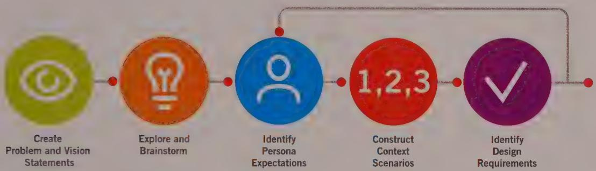

# SETTING THE VISION: SCENARIOS AND DESIGN REQUIREMENTS

In the two previous chapters, we talked about how to gather qualitative information about users and create models using that information. By carefully analyzing user research and synthesis of personas and other models, we create a clear picture of our users and their respective goals, as well as their current situation. This brings us, then, to the crux of the whole method: how we use this understanding of people to create design solutions that satisfy and inspire users, while simultaneously addressing business goals and technical constraints.

# Bridging the Research-Design Gap

Product teams often encounter a serious hurdle soon after they begin a new project. Things start out great. They gather a bunch of research data—or, more typically, hire someone to gather it for them—be it market research, user research, or competitive product research. Or perhaps they dispense with research, and brainstorm and collect a set of ideas that seem particularly cool or useful.

Conducting research certainly yields insights about users, and having brainstorming sessions is fun and gets the team inspired. But when it's time to make detailed design

and development decisions, the team rapidly realizes that they are missing a critical link between the research and the actual product design. Without a compass pointing the way through the research, without an organizing principle that highlights features and functions that are relevant to real users and describes how they all fit together into a coherent product that satisfies both user and business needs, no clear solution is in sight.

This chapter describes the first half of a process for bridging this research-design gap. It employs personas as the main characters in a set of techniques that rapidly arrive at design solutions in an iterative, repeatable, and testable fashion. This process has four major activities:

- Developing stories or scenarios as a means of imagining ideal user interactions   
- Using those scenarios to extract design requirements   
- Using these requirements in turn to define the product's fundamental interaction framework   
- Filling in that framework with ever-increasing amounts of design details

The glue that holds this process together, the compass in the wilderness of research data and potential product features, is narrative: using personas to create stories that point to user satisfaction.

# Scenarios: Narrative as a Design Tool

Narrative, or storytelling, is one of the oldest human activities. Much has been written about the power of narrative to communicate ideas. However, narrative is also one of our most powerful creative methods. From a very young age, we are accustomed to using stories to think about possibilities, and this is an incredibly effective way to imagine a new and better future for our users. Imagining a story about a person using our product leverages our creativity to a greater power than when we just imagine a better form factor or configuration of screen elements. Furthermore, because of the intrinsically social aspect of narrative, it is a very effective and compelling way to share good ideas among team members and stakeholders. Ultimately, experiences designed around narrative tend to be more comprehensible and engaging for users because they are structured around a story.

Evidence of the effectiveness of narrative as a design tool is all around us. The famous Disney Imagineers would be lost without the modern-day myths they use as the foundation for the experiences they build. The experiences we create for digital products have their own (perhaps more grounded) narratives from which interactions can be built.

Much has been written about this idea. Brenda Laurel explored the concept of structuring interaction around dramatic principles in her book Computers as Theatre, in which she urges us to "...focus on designing the action. The design of objects, environments, and characters is all subsidiary to this central goal." John Rheinfrank and Shelley Evenson also talk about the power of "stories of the future" for developing conceptually complex interactive systems, and John Carroll has created a substantial body of work about scenario-based design, which we discuss later in this chapter.

Narrative also lends itself to effective visual depictions of interactive products. Interaction design is first and foremost the design of behavior that occurs over time. Therefore, a narrative structure combined with the support of fast and flexible visualization tools (such as the humble whiteboard) is perfectly suited for motivating, envisioning, representing, and validating interaction concepts.

Interaction design narratives are quite similar to the comic-book-like sequences called storyboards that are used in the motion picture industry. They share two significant characteristics: plot and brevity. Just as storyboards breathe life into a movie script, design solutions should be created and rendered to follow a plot—a story. Putting too much detail into the storyboards simply wastes time and money and has a tendency to tie us to suboptimal ideas simply because drawing them consumes significant resources (leaving less time for concept- and behavior-level refinement).

In the earliest phases of the process, we focus only on the "plot points," which allows us to be fluid as we explore design concepts. Because they are enough to convey the action and the potential experience, many millions of Hollywood dollars have been invested on the basis of simple pencil sketches or line drawings. By focusing on the narrative, we can quickly and flexibly arrive at a high-level design solution without getting bogged down by the inertia and expense inherent in high-production-value renderings. (However, such renderings are certainly appropriate once a working design framework is in place.)

# Scenarios versus use cases and user stories

Scenarios and use cases are both methods of describing the user's interaction with a system. However, they serve very different functions. Goal-Directed scenarios are an iterative means of defining a product's behavior from the standpoint of specific users (persons). This includes not only the system's functionality, but the priority of functions and how those functions are expressed in terms of what the user sees and how she interacts with the system.

Use cases, on the other hand, are a technique based on exhaustive descriptions of the system's functional requirements, often of a transactional nature, focusing on low-level user action and accompanying system response. The system's precise behavior—exactly how the system responds—typically is not part of a conventional or concrete use case; many

assumptions about the form and behavior of the system to be designed remain implicit. Use cases permit a complete cataloging of user tasks for different classes of users but say little or nothing about how these tasks are presented to the user or how they should be prioritized in the interface. In our experience, the biggest shortcoming of traditional use cases as a basis for interaction design is their tendency to treat all possible user interactions as equally likely and important. This is indicative of their origin in software engineering rather than interaction design. They may be useful in identifying edge cases and for determining that a product is functionally complete, but they should be deployed only in the later stages of design validation.

User stories are used in agile programming methods, but typically they aren't actual stories or narratives. Rather, they are short sentences phrased like this: "As a user, I would like to log in to my online banking account." Typically this is followed by another couple of sentences briefly describing the necessary interface to accomplish the interaction. User stories are much more like informally phrased requirements than they are like scenarios; they don't describe the user's entire flow at a big-picture level or describe what the user's end goal is. Both of these are critical for stripping away unnecessary interactions and targeting what users really need (see Chapter 12 for more on this topic).

Scenarios are more akin to *epics* as described by agile methods. Like scenarios, epics do not describe task-level interactions, but rather broader and more far-reaching clusters of interactions that are intended to meet user goals. Epics focus more on function and presentation of user interfaces and interactions than they do on user behaviors. But in terms of scope and appropriate level of granularity, they have much more in common with scenarios than user stories do.

# Scenario-based design

In the 1990s, substantial work was done by the HCI (human-computer interaction) community around the idea of use-oriented software design. From this work came the concept of the scenario, commonly used to describe a method of design problem solving by concretization: using a specific story to both construct and illustrate design solutions. These concepts are discussed by John M. Carroll in his book Making Use:

Scenarios are paradoxically concrete but rough, tangible but flexible ... they implicitly encourage "what-if?" thinking among all parties. They permit the articulation of design possibilities without undermining innovation ... Scenarios compel attention to the use that will be made of the design product. They can describe situations at many levels of detail, for many different purposes, helping to coordinate various aspects of the design project.[5]

Carroll's use of scenario-based design describes how users accomplish tasks. It consists of an environmental setting and includes agents or actors who are abstracted stand-ins for users, with role-based names such as Accountant or Programmer.

Although Carroll certainly understands the power and importance of scenarios in the design process, we've found two shortcomings with scenarios as he approaches them:

- Carroll's concept of the actor as an abstracted, role-oriented model is insufficiently concrete to provide understanding of or empathy with users. It is impossible to design appropriate behaviors for a system without understanding its users in detail.   
- Carroll's scenarios jump too quickly to the elaboration of tasks without considering the user's goals and motivations that drive and filter these tasks. Although Carroll does briefly discuss goals, he refers only to goals of the scenario. These goals are circularly defined as the completion of specific tasks. In our experience, user goals must be considered before user tasks can be identified and prioritized. Without addressing the motivation of human behavior, high-level product definition can be difficult and misguided.

The missing ingredient in Carroll's scenario-based design methods is the use of personas. A persona is a tangible representation of the user that acts as a believable agent in the setting of a scenario. In addition to reflecting current behavior patterns and motivations, personas let you explore how user motivations should influence and prioritize tasks in the future. Because personas model goals and not simply tasks, the scope of the problems addressed by scenarios can be broadened to include those related to product definition. They help answer the questions "What should this product do?" and "How should this product look and behave?"

# Persona-based scenarios

Persona-based scenarios are concise narrative descriptions of one or more personas using a product or service to achieve specific goals. They allow us to start our designs from a story describing an ideal experience from the persona's perspective, focusing on people and how they think and behave, rather than on technology or business goals.

Scenarios can capture the nonverbal dialog between the user and a product, environment, or system over time, as well as the structure and behavior of interactive functions. Goals serve as a filter for tasks and as a guide for structuring the display of information and controls during the iterative process of constructing the scenarios.

Scenario content and context are derived from information gathered during the Research phase and analyzed during the Modeling phase. Designers perform a type of role play in creating these scenarios, walking the personas through their future interactions with

the product or service, $^{7}$ almost similar to actors performing improvisation. This process leads to real-time synthesis of structure and behavior—typically at a whiteboard or on tablets—and later informs the detailed look and feel. Finally, personas and scenarios are used to test the validity of design ideas and assumptions throughout the process.

# Three types of scenarios

The Goal-Directed Design method employs three types of persona-based scenarios at different points in the design process, each with a successively more interface-specific focus. The first—the context scenario—is used to explore, at a high level, how the product can best serve the needs of the personas. The context scenarios are created before any design sketching is performed. They are written from the persona's perspective, focusing on human activities, perceptions, and desires. It is when developing this kind of scenario that the designer has the most leverage to imagine an ideal user experience. More details about creating this type of scenario can be found in the section "Step 4: Construct context scenarios."

Once the design team has defined the product's functional and data elements and developed a Design Framework (as described in Chapter 5), a context scenario is revised. It becomes a key path scenario by more specifically describing user interactions with the product and by introducing the design's vocabulary. These scenarios focus on the most significant user interactions, always paying attention to how a persona uses the product to achieve its goals. Key path scenarios are iteratively refined along with the design as more and more detail is developed.

Throughout this process, the design team uses validation scenarios to test the design solution in a variety of situations. These scenarios tend to be less detailed and typically take the form of a number of what-if questions about the proposed solutions. Chapter 5 covers development and use of key path and validation scenarios.

# Design Requirements: The "What" of Interaction

The Requirements Definition phase determines the what of the design: what information and capabilities our personas require to accomplish their goals. It is critical to define and agree on the what before we move on to the next question: how the product looks, behaves, operates, and feels. Conflating these two questions can be one of the biggest pitfalls in the design of an interactive product. Many designers are tempted to jump right into detailed design and render possible solutions. Regardless of how creative and skillful you are, we urge you not to do this. It runs the risk of leading to a never-ending cycle of iteration. Proposing a solution without clearly defining and agreeing on the problem

leaves you without a clear, objective method of evaluating the design's fitness. This in turn can lead to "I like" versus "you like" subjective differences within the product team and stakeholders, with no easy way to converge to consensus.

In lieu of such a method, you, your stakeholders, and your clients are likely to resort to taste and gut instinct, which have a notoriously low success rate with something as complex as an interactive product.

In other creative fields, the importance of defining the what first is well understood. Graphic novelists don't start with inking and coloring; they explore their characters and then outline and storyboard, roughly sketching both the narrative and form. That is exactly what we will do as we define our digital concepts.

DESIGN PRINCIPLE

Define what the product will do before you design how the product will do it.

# Design requirements aren't features

It's important to note that our concept of a "requirement" here is different from how the term is commonly used (and, we believe, misused) in the industry. In many product-development organizations, "requirement" has become synonymous with "feature" or "function." There is clearly a relationship between requirements and functions (which we leverage as a key part of our design process, as you will see in the next chapter). But we suggest that you think of design requirements as being synonymous with needs. Put another way, at this point, you want to rigorously define the human and business needs your product must satisfy.

# Design requirements aren't specifications

Another industry use of the term "requirements" refers to a laundry list of capabilities generated, typically by product managers. These marketing requirements documents (MRDs) or product requirements documents (PRDs) are, when well executed, an attempt to describe the what of a product, but there are a few pitfalls. First, these lists are often only loosely connected to any kind of user research and quite frequently are generated without any serious exploration of user needs. Although the what described in these documents might (if you're lucky) reflect a coherent product, there's little guarantee that it will be a product the users find desirable.

Second, many MRDs and PRDs fall into the trap of confusing the what of the product with the how. Detailed descriptions of interfaces, such as "There should be a menu containing...," presuppose a solution that may be inappropriate for the user or his work flow.

Mandating solutions before the design process is a recipe for trouble, because it can easily lead to clunky and disjointed interactions and products.

For example, think about designing a data analytics tool to help an executive better understand the state of his business. If you jump right to the how without understanding the what, you might assume that the tool's output should be reports. It would be easy to come to this conclusion. If you performed user research, you probably would have noticed that reports are a widespread and accepted solution. However, if you imagine some scenarios and analyze your users' actual requirements, you might realize that your executive actually needs a way to recognize exceptional situations before opportunities are missed or problems arise. He or she also needs a way to understand emerging trends in the data. From here, it isn't difficult to see that static, flat reports are hardly the best way to meet these needs. With such a solution, your executive has to do the hard work of scrutinizing several of these reports to find the significant data underlying such exceptions and trends. Much better solutions might include data-driven exception reporting or real-time trend monitors.

The final problem with this kind of requirements document is that in itself it is of little use to either business stakeholders or developers. Without a way for them to visualize the contents of these lists—to see a design that reflects what the lists describe—neither stakeholders nor developers will have an easy time making decisions based on what is described.

# Design requirements are strategic

In figuring out the best way to meet particular human needs by starting with requirements rather than solutions, interaction designers have an extraordinary amount of leverage to create powerful and compelling products. Separating problem and solution is an approach that provides maximum flexibility in the face of changing technological constraints and rising opportunities. By clearly defining user needs, designers can work with technologists to find the best viable and feasible solutions without compromising the product's ability to help people achieve their goals. Working in this manner, the product definition is not at risk when the implementation runs into problems. Also, it becomes possible to plan long-term technology development so that it can provide increasingly sophisticated ways of meeting user needs.

# Design requirements come from multiple sources

We've already talked about personas and scenarios as a primary source of design requirements. While that may be the most important part of the requirements equation, other requirements also factor into the design. Business needs and constraints, as well as technical and legal constraints, typically are gathered during interviews with the

product's business and technical stakeholders. The next sections offer a more elaborate list of requirements.

# The Requirements Definition Process

The translation of robust models into design solutions consists of two major phases. The Requirements Definition, shown in Figure 4-1, answers the broad questions about what a product is and what it should do. The Framework Definition answers questions about how a product behaves and how it is structured to meet user goals.

  
Figure 4-1: An overview of the Requirements Definition process

In this section, we'll discuss the Requirements Definition in detail. The Framework Definition is covered in Chapter 5. The methods described here are based on the persona-based scenario methodology developed by Robert Reimann, Kim Goodwin, Lane Halley, David Cronin, and Wayne Greenwood, and refined over the last decade by design practitioners at Cooper.

The Requirements Definition process consists of the following five steps (which are described in detail in the remainder of this chapter):

1 Create problem and vision statements   
2 Explore/brainstorm   
3 Identify persona expectations   
Construct context scenarios   
5 Identify design requirements

Although these steps proceed in roughly chronological order, they represent an iterative process. Designers can expect to cycle through Steps 3 through 5 several times until the requirements are stable. This is a necessary part of the process and shouldn't be short-circuited. A detailed description of each of these steps follows.

# Step 1: Create problem and vision statements

Before beginning the process of ideation, it's important for designers to have a clear mandate for moving forward. While the Goal-Directed method aims to define products and services via personas, scenarios, and design requirements, it is often useful at this point to define in what direction these scenarios and requirements should be headed. We already have a sense of which users we're targeting and what their goals are, but lacking a clear product mandate, there is still considerable room for confusion. Problem and vision statements provide just such a mandate and are extremely helpful in building consensus among stakeholders before the design process moves forward.

At a high level, the problem statement defines the purpose of the design initiative. A design problem statement should concisely reflect a situation that needs changing, for both the personas and the business providing the product to the personas. Often a cause-and-effect relationship exists between business concerns and persona concerns. For example:

Company $X$ 's customer satisfaction ratings are low. Market share has diminished by 10 percent over the past year because users have inadequate tools to perform tasks $X$ , $Y$ , and $Z$ that would help them meet their goal of $G$ .

Connecting business issues to usability issues is critical to drive stakeholders' buy-in to design efforts and to frame the design effort in terms of both user and business goals.

The vision statement is an inversion of the problem statement that serves as a high-level design objective or mandate. In the vision statement, you lead with the user's needs, and you transition from those to how the design vision meets business goals. Here's a sample template for the preceding example's product redesign (similar wording works for new products as well):

The new design of Product $X$ will help users achieve $G$ by allowing them to do $X$ , $Y$ , and $Z$ with greater [accuracy, efficiency, and so on], and without problems $A$ , $B$ , and $C$ that they currently experience. This will dramatically improve Company $X$ 's customer satisfaction ratings and lead to increased market share.

The content of both the problem and vision statements should come directly from research and user models. User goals and needs should be derived from the primary and secondary personas, and business goals should be extracted from stakeholder interviews.

Problem and vision statements are useful when you are redesigning an existing product. They also are useful for new-technology products or products being designed for unexplored market niches. With these tasks, formulating user goals and frustrations into

A problem and vision statements helps establish team consensus and focus attention on the priorities of design activity to follow.

# Step 2: Explore and brainstorm

At the early stages of the Requirements Definition, exploration, or brainstorming, assumes a somewhat ironic purpose. At this point in the project, we have been researching and modeling users and the domain for days or even months, and it is almost impossible to avoid having developed some preconceptions about what the solution looks like. However, ideally we'd like to create context scenarios without these prejudices, and instead really focus on how our personas would likely want to engage with the product. We brainstorm at this stage to get these ideas out of our heads so that we can record them and thereby "let them go" for the time being.

The primary purpose here is to eliminate as much preconception as possible. Doing so allows designers to be open-minded and flexible as they use their imagination to construct scenarios and to use their analytical skills to derive requirements from these scenarios. A side benefit of brainstorming at this point in the process is that it switches your brain into "solution mode." Much of the work performed in the Research and Modeling phases is analytical in nature, and it takes a different mindset to come up with inventive designs.

Exploration, as the term suggests, should be unconstrained and uncritical. Air all the wacky ideas you've been considering (plus some you haven't), and be prepared to record them and file them for safekeeping until much later in the process. You don't know if any of them will be useful in the end, but you might find the germ of something wonderful that will fit into the design framework you later create.

It's also useful to cherry-pick some exploratory concepts to share with stakeholders or clients as a means to discover their true appetite for creative solutions and time horizons. If the stakeholders say they want "blue-sky thinking," you can use carefully selected exploratory concepts to test your blue-sky ideas and watch their reactions. If the discussion seems negative, you know to calibrate your thinking a bit more conservatively as you move forward with your scenarios.

Karen Holtzblatt and Hugh Beyer describe a facilitated method for brainstorming that can be useful for getting an exploration session started, especially if your team includes stakeholders, clients, or even developers who are eager to get started thinking about solutions.

Don't spend too much time on the brainstorming step. A few hours for simple projects to a couple of days for a project of significant scope or complexity should be more than sufficient for you and your teammates to get all those crazy ideas out of your systems. If

you find your ideas getting repetitious, or the popcorn stops popping, that's a good time to stop.

# Step 3: Identify persona expectations

As we discussed in Chapter 1, a person's mental model is her own internal representation of reality—how she thinks about or explains something to herself. Mental models are deeply ingrained, are almost subliminal in terms of a person's self-awareness of them, and are frequently the result of a lifetime of cumulative experiences. People's expectations about a product and how it works are highly informed by their mental model.

It is therefore important that the represented model of our interfaces—how the design behaves and presents itself—should match what we understand about users' mental models as much as possible. The represented model should not reflect the implementation model—how the product is actually constructed internally.

To accomplish this, we formally record these expectations. They are an important source of design requirements. For each primary and secondary persona, we identify the following:

- Attitudes, experiences, aspirations, and other social, cultural, environmental, and cognitive factors that influence the persona's expectations   
- General expectations and desires the persona may have about the experience of using the product   
- Behaviors the persona will expect or want from the product   
- How that persona thinks about basic elements or units of data (For example, in an e-mail application, the basic elements of data might be messages and people.)

Your persona descriptions may contain enough information to answer these questions directly; however, your research data will remain a rich resource. Use it to analyze how interview subjects define and describe objects and actions that are part of their usage patterns, along with the language and grammar they use. Here are some things to look for:

What do the interview subjects mention first?   
- Which action words (verbs) do they use? What nouns?   
- Which intermediate steps, tasks, or objects in a process don't they mention? (Hint: These might not be terribly important to how they think about things.)

# Step 4: Construct context scenarios

All scenarios are stories about people and their activities, but context scenarios are the most storylike of the three types we employ.

A context scenario tells the story of a particular user persona, with various motivations, needs, and goals, using the future version of your product in the way that is most typical for that persona. It describes the broad context in which that persona's usage patterns are exhibited. It includes environmental and organizational (in the case of enterprise systems) considerations. $^{10}$ A successful context scenario captures all of these attributes and addresses them in the extrapolated work flow narrative you create.

As we've discussed, this is where design begins. As you develop context scenarios, you should focus on how the product you are designing can best help your personas achieve their goals. Context scenarios establish the primary touch points that each primary and secondary persona has with the system (and possibly with other personas) over the course of a day or some other meaningful length of time.

Context scenarios should be broad and relatively shallow in scope. They should not describe product or interaction detail but rather should focus on high-level actions from the user's perspective. It is important to map out the big picture first so that we can systematically identify design requirements. Only then can we design appropriate interactions and interfaces.

Context scenarios address questions such as the following:

- In what setting(s) will the product be used?   
- Will it be used for extended amounts of time?   
Is the persona frequently interrupted?   
- Do several people use a single workstation or device?   
- With what other products will it be used?   
What primary activities does the persona need to perform to meet her goals?   
What is the expected end result of using the product?   
- How much complexity is permissible, based on persona skill and frequency of use?

Context scenarios should not represent product behaviors as they currently are. These scenarios represent the brave new world of Goal-Directed products, so, especially in the initial phases, focus on addressing the personas' goals. Don't yet worry about exactly how things will get accomplished. Initially you should treat the design as a bit of a magic black box.

In most cases, more than one context scenario is necessary. This is true especially when there are multiple primary personas, but sometimes even a single primary persona may have two or more distinct contexts of use.

Context scenarios are also entirely textual. We are not yet discussing form, only the behaviors of the user and the system. This discussion is best accomplished as a textual narrative, saving the "how" for later refinement steps.

# A sample context scenario

The following is the first iteration of a context scenario for a primary persona for a personal digital assistant (PDA) type phone, including both the device and its service. Our persona is Vivien Strong, a real-estate agent in Indianapolis, whose goals are to balance work and home life, close the deal, and make each client feel like he or she is her only client.

Here is Vivien's context scenario:

While getting ready in the morning, Vivien uses her phone to check her e-mail. Because it has a relatively large screen and quick connection time, it's more convenient than booting up a computer as she rushes to make her daughter, Alice, a sandwich for school.   
2 Vivien sees an e-mail from her newest client, Frank, who wants to look at a house this afternoon. The device has his contact info, so she can call him with a simple action right from the e-mail.   
3 While on the phone with Frank, Vivien switches to speakerphone so she can view the screen while talking. She looks at her appointments to see when she's free. When she creates a new appointment, the phone automatically makes it an appointment with Frank, because it knows with whom she is talking. She quickly enters the address of the property into the appointment as she finishes her conversation.   
4 After sending Alice to school, Vivien heads into the real-estate office to gather some papers for another appointment. Her phone has already updated her Outlook appointments, so the rest of the office knows where she'll be in the afternoon.   
5 The day goes by quickly, and eventually Vivien is running a bit late. As she heads toward the property she'll be showing Frank, the phone alerts her that her appointment is in 15 minutes. When she flips open the phone, she sees not only the appointment, but also a list of all documents related to Frank, including e-mails, memos, phone messages, and call logs to Frank's number. Vivien initiates a call, and the phone automatically connects to Frank because it knows her appointment with him is soon. She lets him know she'll be there in 20 minutes.

6 Vivien knows the address of the property but is unsure exactly where it is. She pulls over and taps the address she put into the appointment. The phone downloads directions along with a thumbnail map showing her location relative to the destination.   
7 Vivien gets to the property on time and starts showing it to Frank. She hears the phone ring from her purse. Normally while she is in an appointment, the phone automatically goes to voicemail, but Alice has a code she can press to get through. The phone knows it's Alice calling, so it uses a distinctive ringtone.   
8 Vivien takes the call. Alice missed the bus and needs to be picked up. Vivien calls her husband to see if he can do it. She gets his voicemail; he must be out of service range. She tells him she's with a client and asks if he can get Alice. Five minutes later the phone sounds a brief tone. Vivien recognizes it as her husband's; she sees he's sent her an instant message: "I'll get Alice; good luck on the deal!"

Notice how the scenario remains at a fairly high level, without getting too specific about interfaces or technologies. It's important to create scenarios that are within the realm of technical possibility, but at this stage the details of reality are unimportant. We want to leave the door open for truly novel solutions, and it's always possible to scale back; we are ultimately trying to describe an optimal, yet still feasible, experience. Also notice how the activities in the scenario tie back to Vivien's goals and try to eliminate as many tasks as possible.

# Pretending it's magic

A powerful tool in the early stages of developing scenarios is to pretend the interface is magic. If your persona has goals and the product has magic powers to meet them, how simple could the interaction be? This kind of thinking is useful in helping designers think outside the box. Magic solutions obviously won't suffice, but figuring out creative ways to technically accomplish interactions that are as close to magic solutions as possible (from the personas' perspective) is the essence of great interaction design. Products that meet goals with a minimum of hassle and intrusion seem almost magical to users. Some of the interactions in the preceding scenario may seem a bit magical, but all are possible with technology available today. It's the goal-directed behavior, not the technology alone, that provides the magic.

DESIGN PRINCIPLE

In the early stages of design, pretend the interface is magic.

# Step 5: Identify design requirements

After you are satisfied with an initial draft of your context scenario, you can analyze it to extract the personas' needs or design requirements. These design requirements can be thought of as consisting of objects, actions, and contexts.[11] And remember, as we've discussed, we prefer not to think of requirements as identical to features or tasks. Thus, a requirement from the preceding scenario might read as follows:

Call (action) a person (object) directly from an appointment (context).

If you are comfortable extracting needs in this format, it works quite well. Otherwise, you may find it helpful to separate them into data, functional, and contextual requirements, as described in the following sections.

# Data requirements

Personas' data needs are the objects and information that must be represented in the system. Using the semantics just described, it is often useful to think of data requirements as the objects and adjectives related to those objects. Common examples include accounts, people, addresses, documents, messages, songs, and images, as well as attributes of those, such as status, dates, size, creator, and subject.

# Functional requirements

Functional needs are the operations or actions that need to be performed on the system's objects and that typically are translated into interface controls. These can be thought of as the product's actions. Functional needs also define places or containers where objects or information in the interface must be displayed. (These clearly are not actions in and of themselves but usually are suggested by actions.)

# Contextual requirements

Contextual requirements describe relationships or dependencies between sets of objects in the system. This can include which objects in the system need to be displayed together to make sense for work flow or to meet specific persona goals. (For example, when choosing items for purchase, a summed list of items already selected for purchase should probably be visible.) Other contextual requirements may include considerations regarding the physical environment the product will be used in (an office, on the go, in harsh conditions) and the skills and capabilities of the personas using the product.

# Other requirements

After you've gone through the exercise of pretending it's magic, it's important to get a firm idea of the realistic requirements of the business and technology you are designing for. (But we hope that designers have some influence over technology choices when the choice directly affects user goals.)

- Business requirements can include stakeholder priorities, development timelines, budgetary and resource constraints, regulations and legal considerations, pricing structures, and business models.   
- Brand and experience requirements reflect attributes of the experience you want users and customers to associate with your product, company, or organization.   
- Technical requirements can include weight, size, form factor, display, power constraints, and software platform choices.   
- Customer and partner requirements can include ease of installation, maintenance, configuration, support costs, and licensing agreements.

Having followed Steps 1 through 5, you should now have a rough, creative overview of how the product will address user goals in the form of context scenarios, as well as a reductive list of needs and requirements extracted from your research, user models, and the scenarios. These design requirements not only provide a design and development direction but also provide a scope of work to communicate to stakeholders. Any new design requirements after this point must necessarily change the scope of work.

Now you are ready to delve deeper into the details of your product's behaviors and begin to consider how the product and its functions will be represented. You are ready to define the framework of the interaction.

# Notes

1. Laurel, 2013   
2. Rheinfrank and Evenson, 1996   
3. Wirfs-Brock, 1993   
4. Constantine and Lockwood, 1999   
5.Carrolli,2001   
6. Buxton, 1990   
7. Verplank, et al., 1993   
8.Newman and Lamming,1995   
9.Holtzblatt and Beyer,1998   
10. Kuutti, 1995   
11.Shneiderman,1998

