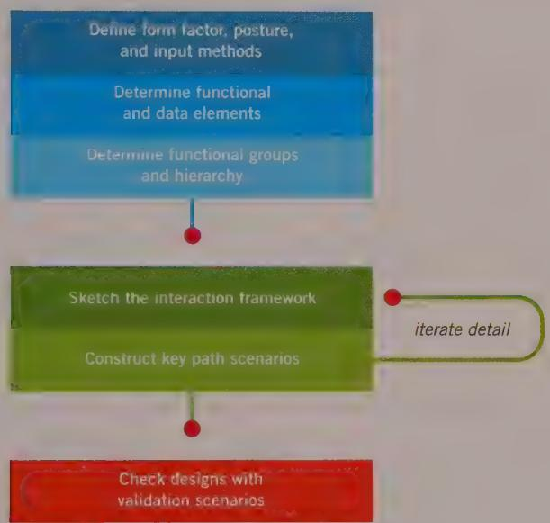

# DESIGNING THE PRODUCT: FRAMEWORK AND REFINEMENT

In the preceding chapter, we talked about the first part of the design process: developing scenarios to imagine ideal user interactions and then defining requirements from these scenarios and other sources. Now we're finally ready to design.

# Creating the Design Framework

Rather than jump into the nuts and bolts right away, we want to stay at a high level and concern ourselves with the overall structure of the user interface and associated behaviors. We call this phase of the Goal-Directed process the Design Framework. If we were designing a house, at this point we'd be concerned with what rooms the house should have, where they should be positioned, and roughly how big they should be. We would not be worried about the precise measurements of each room or things like the doorknobs, faucets, and countertops.

The Design Framework defines the overall structure of the users' experience. This includes the underlying organizing principles and the arrangement of functional elements on the screen, work flows, interactive behaviors and the visual and form languages used to express information, functionality, and brand identity. In our experience,

form and behavior must be designed in concert; the Design Framework is made up of an interaction framework, a visual design framework, and sometimes an industrial design framework. At this phase in a project, interaction designers use scenarios and requirements to create rough sketches of screens and behaviors that make up the interaction framework. Concurrently, visual designers use visual language studies to develop a visual design framework that is commonly expressed as a detailed rendering of a single screen archetype.

Other specialists on the team may be working on frameworks of their own. Industrial designers execute form language studies to work toward a rough physical model and industrial design framework. Service designers build models of the information exchange for each touch point in a service framework. Each of these processes is addressed in this chapter.

When it comes to the design of complex behaviors and interactions, we've found that focusing too early on pixel pushing, widget design, and specific interactions can get in the way of effectively designing a comprehensive framework in which all the product's behaviors can fit. Instead we should take a top-down approach, concerning ourselves first with the big picture and rendering our solutions without specific detail in a low-fidelity manner. Doing so can ensure that we and our stakeholders focus initially on the fundamentals: serving the personas' goals and requirements.

Revision is a fact of life in design. Typically, the process of representing and presenting design solutions helps designers and stakeholders refine their vision and understanding of how the product can best serve human needs. The trick, then, is to render the solution in only enough detail to provoke engaged consideration, without spending too much time or effort elaborating details that are certain to be modified or abandoned. We've found that sketch-like storyboards of context and screens, accompanied by narrative in the form of scenarios, are a highly effective way to explore and discuss design solutions without creating undue overhead and inertia.

Research about the usability of architectural renderings supports this notion. A study of people's reactions to different types of CAD images found that pencil-like sketches encouraged discourse about a proposed design and also increased understanding of the renderings as representing work in progress. $^{1}$ Carolyn Snyder covers this concept at length in *Paper Prototyping* (Morgan Kaufmann, 2003), where she discusses the value of such low-fidelity presentation techniques in gathering user feedback. While we believe that usability testing and user feedback are often most constructive during design refinement, sometimes they are useful as early as the Framework phase. (More discussion of usability testing can be found later in this chapter.)

<!-- Chunk 3 End -->

<!-- Chunk 4 Start -->

# Defining the interaction framework

The interaction framework defines not only the high-level structure of screen layouts but also the product's flow, behavior, and organization. The following six steps describe the process of defining the interaction framework (see Figure 5-1):

1 Define form factor, posture, and input methods.   
2 Define functional and data elements.   
3 Determine functional groups and hierarchy.   
4 Sketch the interaction framework.   
Construct key path scenarios.   
6 Check designs with validation scenarios.

  
Figure 5-1: The Framework Definition process

Even though we've broken the process into numerically sequenced steps, typically this is not a linear effort. Rather, it occurs in iterative loops. In particular, Steps 3 through 5 may be switched, depending on the designer's thought process (more on this later). The six steps are described in the following sections.

# Step 1: Define form factor, posture, and input methods

The first step in creating a framework is to define the form factor of the product you'll be designing. Is it a web application that will be viewed on a high-resolution computer screen? Is it a phone that must be small, light, low-resolution, and visible in both bright

sunlight and the dark? Is it a kiosk that must be rugged to withstand a public environment while accommodating thousands of distracted novice users? What constraints does each of these form factors imply for any design? Each has clear implications for the product's design, and answering this question sets the stage for all subsequent design efforts. If the answer isn't obvious, look to your personas and scenarios to better understand the ideal usage context and environment. Where a product requires the design of both hardware and software, these decisions also involve industrial design considerations. Later in the chapter we discuss how to coordinate interaction design with industrial design.

As you define the form, you should also define the product's basic posture and determine the system's input method(s). A product's posture is related to how much attention the user will devote to interacting with the product and how the product's behaviors respond to the kind of attention the user will devote to it. This decision should be based on usage contexts and environments, as described in your context scenarios (see Chapter 4). We discuss the concept of posture in greater depth in Chapter 9.

The input method is how users will interact with the product. This is driven by the form factor and posture, as well as by your personas' attitudes, aptitudes, and preferences. Choices include keyboard, mouse, keypad, thumb-board, touchscreen, voice, game controller, remote control, dedicated hardware buttons, and many other possibilities. Decide which combination is appropriate for your primary and secondary personas. If you need to use a combination of input methods (such as the common website or desktop application that relies on both mouse and keyboard input), decide on the product's primary input method.

# Step 2: Define functional and data elements

Functional and data elements represent functionality and information that are revealed to the user in the interface. These are the concrete manifestations of the functional and data requirements identified during the Requirements Definition phase, as described in Chapter 4. Whereas the requirements were purposely described in general terms, from the personas' perspective, functional and data elements are described in the language of user-interface representations. It is important to note that each element must be defined in response to specific requirements defined earlier. This is how we ensure that every aspect of the product we are designing has a clear purpose that can be traced back to a usage scenario or business goal.

Data elements typically are the fundamental subjects of interactive products. These objects—such as photos, e-mail messages, customer records, or orders—are the basic units to be referred to, responded to, and acted on by the people using the product. Ideally they should fit with the personas' mental models. At this point, it is critical to comprehensively catalog the data objects, because the product's functionality is commonly defined in relation to them. We are also concerned with the objects' significant

attributes, such as the sender of an e-mail message or the date a photo was taken. But it is less important to be comprehensive about the attributes at this point, as long as you have an idea whether the personas care about a few attributes or a lot. It can be helpful at this point to involve your team's software architect, who can use this Goal-Directed data model to create a more formal data object model for later use by developers. We'll discuss development touch points more in Chapter 6.

It's useful to consider the relationships between data elements. Sometimes a data object may contain other data objects; other times there may be a more associative relationship between objects. Examples of such relationships include a photo within an album, a song within a playlist, or an individual bill within a customer record. These relationships can be documented as simply as creating indented bulleted lists. For more complex relationships, more elaborate "box and arrow" diagrams may be appropriate.

Functional elements are the operations that can be done to the data elements and their representations in the interface. Generally speaking, they include tools to act on and ways to visually and structurally manage data elements. The translation of functional requirements into functional elements is where we start making the design concrete. While the context scenario is the vehicle to imagine the overall experience we will create for our users, this is where we begin to make that experience real.

It is common for a single requirement to necessitate multiple interface elements. For example, Vivien, our persona for a smartphone from Chapter 4, needs to be able to call her contacts. The following functional elements meet that need:

Voice activation (voice data associated with the contact)   
- Assignable quick-dial buttons   
- Selecting a contact from a list   
- Selecting a contact from an e-mail header, appointment, or memo   
- Auto-assigning a call button in the appropriate context (for example, for an upcoming appointment)

Again, it is imperative to return to context scenarios, persona goals, and mental models to ensure that your solutions are appropriate for the situation at hand. This is also where design principles and patterns begin to become a useful way to arrive at effective solutions without reinventing the wheel. You also must exercise your creativity and design judgment here. In response to any identified user requirement, typically a number of solutions are possible. Ask yourself which of the possible solutions is most likely to do the following:

- Accomplish user goals most efficiently.   
Best fit your design principles.

- Fit within technology or cost parameters.   
- Possibly differentiate the interaction from the competition.   
Best fit other requirements.

# Pretend the product is human

As you saw in Chapter 4, pretending that a tool, product, or system is magic is a powerful way to imagine the ideal user experience to be reflected in concept-level context scenarios. In the same way, pretending that the system is human is a powerful way to structure interaction-level details. This simple principle is discussed in detail in Chapter 8. In a nutshell, interactions with a digital system should be similar in tone and helpfulness to interactions with a polite, considerate human. As you determine the interactions and behavior along with the functional elements and groupings, you should ask yourself these questions: What would a helpful human do? What would a thoughtful, considerate interaction feel like? Does the product treat the primary persona humanely? How can the software offer helpful information without getting in the way? How can it minimize the persona's effort in reaching his goals?

For example, a mobile phone that behaves like a considerate person knows that, after you've completed a call with a number that isn't in your contacts, you may want to save the number. Therefore, the phone provides an easy and obvious way to do so. An inconsiderate phone forces you to scribble the number on the back of your hand as you go into your contacts to create a new entry.

# Apply principles and patterns

Critical to translating requirements into functional elements (as well as grouping these elements and exploring detailed behavior in scenarios and storyboards) is applying general interaction principles and specific interaction patterns. These tools leverage years of interaction design experience of designers working on similar problems. Neglecting to take advantage of such knowledge means wasting time on problems whose solutions are well known. Additionally, deviating from standard design patterns can create a product where the users must learn every interaction idiom from scratch, rather than recognizing behaviors from other products and leveraging their own experience. (We discuss the idea of design patterns in Chapter 7.) Of course, sometimes it is appropriate to invent new solutions to common problems. But as we discuss further in Chapter 17, you should obey standards unless you have a good reason not to.

Scenarios provide an inherently top-down approach to interaction design. They iterate through successively more detailed design structures, from main screens down to tiny subplanes or dialogs. Principles and patterns add a more bottom-up approach to balance the process. Principles and patterns can be used to organize elements at all levels of the

design. Chapter 7 discusses the uses and types of principles and patterns in detail. Part II of this book provides a wealth of useful interaction principles appropriate to this step in the process.

# Step 3: Determine functional groups and hierarchy

After you have a good list of top-level functional and data elements, you can begin to group them into functional units and determine their hierarchy. Because these elements facilitate specific tasks, the idea is to group elements to best facilitate the persona's flow (see Chapter 11) both within a task and between related tasks. Here are some issues to consider:

- Which elements need a large amount of screen real estate, and which do not?   
- Which elements are containers for other elements?   
- How should containers be arranged to optimize flow?   
- Which elements are used together, and which are not?   
In what sequence will a set of related elements be used?   
- What data elements would be useful for the persona to know or reference at each decision?   
What interaction patterns and principles apply?   
How do the personas' mental models affect organization?

At this point it's important to organize data and functions into top-level container elements, such as screens, frames, and panes. These groupings may change somewhat as the design evolves (particularly as you sketch the interface), but it's still useful to provisionally sort elements into groups. This will speed up the process of creating initial sketches. Again, indented lists or simple Venn diagrams are appropriate at this point for documenting these relationships.

Consider which primary screens or states (which we'll call views) the product requires. Initial context scenarios give you a feel for what these might be. If you know that the user has several end goals where data and functionality don't overlap, it might be reasonable to define separate views to address them. On the other hand, if you see a cluster of related needs (for example, to make an appointment, or to review nearby restaurants, or if your persona needs to see a calendar and contacts), you might consider defining a view that incorporates all these.

When grouping functional and data elements, consider how they should be arranged given the product's platform, posture, screen size, form factor, and input methods. Containers for objects that must be compared or used together should be adjacent. Objects representing steps in a process should, in general, be adjacent and ordered sequentially.

Using detailed interaction design principles and patterns is extremely helpful at this juncture. Part III of this book provides many principles that can be of assistance at this stage of organization.

# Step 4: Sketch the interaction framework

Now we're ready to sketch the interface. This visualization of the interface should be simple at first. Around the studio, we often call this the rectangles phase. Our sketches start by subdividing each view into rough rectangular areas corresponding to panes, control components (such as toolbars), and other top-level containers, as shown in Figure 5-2. Label the rectangles, and illustrate and describe how one grouping or element affects others. Draw arrows from one set of rectangles to others to represent flows or state changes.

  
Figure 5-2: An early framework sketch from designs Cooper created for Cross Country TravCorps, an online portal for traveling nurses. Framework sketches should be simple, starting with rectangles, names, and brief descriptions of relationships between functional areas. Details can be visually hinted at to give an idea of the contents, but don't fall into the trap of designing detail at this stage.

You may want to sketch different ways of fitting together top-level containers in the interface. This visualization of the interface should be simple at first: boxes representing each functional group and/or container with names and descriptions of the relationships between the different areas (see Figure 5-2).

Be sure to look at the entire top-level framework first. Don't become distracted by the details of a particular area of the interface (although imagining what goes into each container will help you decide how to arrange elements and allocate real estate). You will have plenty of time to explore the design at the widget level later. Trying to do so too soon may risk creating a lack of coherence in the design as you move forward. At this high-level "rectangle phase," it's easy to explore a variety of ways to present information and functionality and to perform radical reorganizations if necessary. It's often useful to try several arrangements, running through validation scenarios (see the later section describing Step 6), before landing on the best solution. Spending too much time and effort on intricate details early in the design process discourages designers from changing course to what might be a superior solution. It's easier to discard your work and try another approach when you don't have a lot of effort invested.

Sketching the framework is an iterative process that is best performed with a small, collaborative group. This group includes one or two interaction designers (or ideally an interaction designer and a "design communicator"—someone who thinks in terms of the design narrative) and a visual or industrial designer.

We've found a few tool choices that work well during the sketching phase. Working at a whiteboard promotes collaboration and discussion—and, of course, everything is easy to erase and redraw. A digital camera provides a quick and easy means to capture ideas for later reference.

In recent years we've also grown fond of using tablet computers with OneNote connected to a shared monitor for our initial sketches. Whatever tool you use, it needs to be fast, collaborative, visible to everyone on the team, and easy to iterate and share.

Once the sketches reach a reasonable level of detail, it becomes useful to start rendering in a computer-based tool. Each tool has its strengths and weaknesses, but those commonly used to render high-level interface sketches currently include Adobe Fireworks, Adobe Illustrator, Microsoft Visio, Microsoft PowerPoint, Axure, and Omni Group's OmniGraffle. The key is to find the tool that is most comfortable for you so that you can work quickly, roughly, and at a high level. We've found it useful to render drawings in a visual style that suggests the sketchiness of the proposed solutions. (Recall that rough sketches tend to do a better job of promoting discourse about design.) It is also critical to be able to easily render several related, sequential screen states to depict the product's behavior in the key path scenario. (The "states" construct in Fireworks makes it a particularly good tool for doing this.)

# Step 5: Construct key path scenarios

A key path scenario describes how the persona interacts with the product, using the vocabulary of the interaction framework. These scenarios depict the primary pathways through the interface that the persona takes with the greatest frequency, often on a daily basis. For example, in an e-mail application, key path activities include viewing and composing mail, not configuring a new mail server.

These scenarios typically evolve from the context scenarios, but here we specifically describe the persona's interaction with the various functional and data elements that make up the interaction framework. As we add more and more detail to the interaction framework, we iterate the key path scenarios to reflect this detail in greater specificity around user actions and product responses.

Unlike the goal-oriented context scenarios, key path scenarios are more task-oriented, focusing on task details broadly described and hinted at in the context scenarios. (In this way they are similar to Agile use cases.) This doesn't mean that we can ignore goals. Goals and persona needs are the constant measuring stick throughout the design process, used to trim unnecessary tasks and streamline necessary ones. However, key path scenarios must describe in detail the behavior of each major interaction and provide a walkthrough of each major pathway.

# Storyboarding

By using a sequence of low-fidelity sketches accompanied by the narrative of the key path scenario, you can richly portray how a proposed design solution helps personas accomplish their goals, as shown in Figure 5-3. This technique of Storyboarding is borrowed from filmmaking and cartooning, where a similar process is used to plan and evaluate ideas without having to deal with the cost and labor of shooting actual film. Each interaction between the user and the product can be portrayed on one or more frames or slides. Advancing through them provides a reality check of the interactions' coherence and flow.

# Process variations and iteration

Because creative human activities are rarely a sequential, linear process, the steps in the Framework phase shouldn't be thought of as a simple sequence. It is common to move back and forth between steps and to iterate the whole process several times until you have a solid design solution. Depending on how you think, you have a couple of different ways to approach Steps 3 through 5. You may find that one works better for you than another.

  
Figure 5-3: A more evolved Framework rendering from the Cross Country TravCorps job search web application

Verbal thinkers may want to use the scenario to drive the process and approach Steps 3 through 5 in the following sequence:

Key path scenarios   
2 Work out the groupings verbally   
3 Sketch

Visual thinkers may find that starting from the illustration will help them make sense of the other parts of the process. They may find this easier:

Sketch   
Key path scenarios   
3 See if your groupings work with the scenarios.

# Step 6: Check designs with validation scenarios

After you have storyboarded your key path scenarios and adjusted the interaction framework until the scenario flows smoothly and you're confident that you're headed in the right direction, it is time to shift focus to less frequent or less important interactions. These validation scenarios typically are not developed in as much detail as key path scenarios. Rather, this phase consists of asking a series of what-if questions. The goal is to poke holes in the design and adjust it as needed (or throw it out and start over). You should address three major categories of validation scenarios, in the following order:

- Alternative scenarios are alternative or less-traveled interactions that split off from key pathways at some point along the persona's decision tree. These could include commonly encountered exceptions, less frequently used tools and views, and variations or additional scenarios based on the goals and needs of secondary personas. Returning to our smartphone scenario from Chapter 4, an example of a key path variant would be if Vivien decided to respond to Frank by e-mail in Step 2 instead of calling him.

- Necessary-use scenarios include actions that must be performed, but only infrequently. Purging databases, upgrading a device, configuring, and making other exceptional requests might fall into this category. Necessary-use interactions demand pedagogy because they are seldom encountered: Users may forget how to access the function or how to perform tasks related to it. However, this rare use means that users won't require parallel interaction idioms such as keyboard equivalents—nor do such functions need to be user-customizable. An example of a necessary-use scenario for the design of a smartphone is if the phone was sold secondhand, requiring the removal of all personal information associated with the original owner.

- Edge-case use scenarios, as the name implies, describe atypical situations that the product must nevertheless be able to handle, albeit infrequently. Developers focus on edge cases because they often represent sources of system instability and bugs and typically require significant attention and effort. Edge cases should never be the focus of the design effort. Designers can't ignore edge-case functions and situations, but the interaction needed for them is of much lower priority and usually is buried deep in the interface. Although the code may succeed or fail on its capability to successfully handle edge cases, the product will succeed or fail on its capability to successfully handle daily use and necessary cases. Returning again to Vivien's smartphone (in Chapter 4), an example of an edge-case scenario would be if Vivien tried to add two different contacts who have the same name. This is not something she is likely to do, but it is something the phone should handle if she does.

# Defining the visual design framework

As the interaction framework establishes an overall structure for product behavior, and for the form as it relates to behavior, a parallel process focused on the visual and industrial design is also necessary to prepare for detailed design unless you're working with a

well-established visual style. This process follows a trajectory similar to the interaction framework, in that the solution is first considered at a high level and then narrows to an increasingly granular focus. Chapter 17 provides further details on the integration of visual design and interaction design.

The visual design framework typically follows this process:

1 Develop experience attributes.   
2 Develop visual language studies.   
Apply the chosen visual style to the screen archetype.

# Step 1: Develop experience attributes

The first step in defining a visual design framework to choose a set of three to five adjectives that will be used to help define the tone, voice, and brand promise of the product. (There is a strategy discussion to have if these attributes don't fit the persona's goals and interests.) This set of descriptive keywords are collectively called experience attributes.

Visual designers usually lead the development of experience attributes, as interaction designers are more accustomed to thinking about product behavior than brand. It's often a good idea to involve stakeholders in this process, or at least to get their input at the onset. The process used at Cooper for generating experience attributes is as follows:

1 Gather any existing brand guidelines. Familiarize yourself with them. If the company has clear brand guidelines built around one product—the product you're designing—much of your work may have already been done for you.   
2 Gather together examples of strongly branded products, interfaces, objects, and services. Including multiple examples from particular domains will help stakeholders think about their differences. If we include images of cars, for instance, we might include examples from BMW, Toyota, Ferrari, and Tesla.   
3 Work with stakeholders to identify direct and indirect competition. Gather examples of these products and services' products and interfaces to include in your examples.   
4 Pull relevant terms mentioned by interviewees in the course of your qualitative research. Pay particular attention to any pain points mentioned. For instance, if many mention that a competitor or the existing version of the product is hard to use or "unintuitive," you may want to discuss whether "friendly," "easy," or "understandable" should be an attribute.   
5 With the brand guidelines, example products, competition, and user notes on display to reference, have a discussion with stakeholders about the sub-brand of the product you're designing. We often ask stakeholders to vote for and against examples by

placing red or green stickers on them, and then discuss any clear winners, losers, or controversial examples.

6 From the outcomes of this discussion, identify the minimum number of adjectives that define and distinguish the product.   
If any of the words have multiple meanings, document the exact sense intended. "Sharp," for instance, could refer to precision and sleekness, or it could mean intelligence and wit.   
8 Consider competitors. If your set of attributes does not distinguish the brand from competitors, refine them until they do. Also make sure that individual attributes are aspirational. "Smart" is good. "Brilliant" is better.   
9 Check back with the stakeholders (and especially any marketers) on your proposed attribute set to discuss and finalize them before moving forward.

# Step 2: Develop visual language studies

The next step is to explore a variety of visual treatments through visual language studies, as shown in Figure 5-4. These studies are based on the experience attributes and include color, type, and widget treatments. They also include the overall dimensionality and any "material" properties of the interface (for example, does it feel like glass or paper?).

These studies should show these aspects abstractly and independent of the interaction design, because our goal is to assess the overall tone and suitability for general interactions. We also want to avoid possibly distracting our stakeholders with highly rendered versions of rough interaction designs.

Visual language studies should relate to the personas' experience goals, as well as to any experience or brand keywords that were developed in the Requirements Definition phase (see Chapter 4). Commonly, a company's brand guidelines form a good starting point for this activity. But it should be noted that brand guidelines rarely consider the interactive experience and may not account for the differences in multiple software products. "Brand guidelines" commonly consist of a document explaining how a company's brand identity should be conveyed visually and textually.

Substantial work is often required to translate a style guide for marketing collateral into a meaningful look and feel for an interactive product or website. It's also important to consider environmental factors and persona aptitudes when devising visual styles. Screens that must be visible under bright lights or from a distance require high contrast and more saturated colors. The elderly and other sight-impaired users require larger and more readable typefaces.

  
Figure 5-4: Visual language studies are used to explore a variety of visual styles abstractly and somewhat independent of the interaction design. This is useful because it allows us to have initial discussions about visual language without getting hung up on interaction design details. Of course, eventually visual design and interaction design must be conducted in lockstep.

We typically show between three and five different approaches during our initial review with stakeholders, most often using each one to optimize a particular experience attribute. This is a little different from our approach to interaction design, in which a product usually has one optimal behavioral framework. Visually, several different styles all can be consistent with experience keywords and goals. Using experience attributes to develop these approaches helps move stakeholders away from personal tastes and biases by providing a vocabulary for an experience that is in sync with the brand's meaning.

It is often useful to develop one or two extreme options that push the look and feel a bit too far in one direction. Doing this makes it easier to differentiate between the various approaches and helps stakeholders choose an appropriate direction. You will have ample opportunity later in the process to tame a particularly extreme visual style. That said, all the choices you present to your stakeholders should be reasonable and appropriate. It's almost an unwritten rule that if there's one direction you don't want your client or stakeholders to choose, that's the one they're guaranteed to like.

Once you've developed a good spectrum of visual language studies reflecting personal experience goals, brand guidelines, and experience keywords, it's time to present them to stakeholders for feedback. It's important to contextualize them in terms of these goals and keywords and to describe the rationale for each direction and its relative merits. We ask stakeholders to first give us their initial emotional reaction and then talk through things in a more rational fashion. By the end of this presentation, we usually have consensus to move forward with some aspects of several of the visual styles. It is common to iterate the visual language studies before moving on to the next step.

# Step 3: Apply the chosen visual style to the screen archetype

The final step is to apply one or two selected visual styles to key screens. We typically coordinate our visual and interaction design efforts so that this step is performed close to the end of the interaction framework. At that point the design has begun to stabilize, and sufficient specific detail reflects the visual style. This further refines the visual style so that it reflects key behaviors and information. By making the design more concrete, you can better assess the feasibility of the proposed solution without the overhead of updating numerous screens for each minor change. Additionally, it's easier to elicit feedback from stakeholders.

# Defining the industrial design framework

We develop the industrial design framework in much the same manner as the visual design framework. But because the form factor and input method have significant implications for both the industrial and interaction design, it's useful to collaborate early on to identify relevant issues.

The industrial design framework typically follows this process:

1 Collaborate with interaction designers about form factor and input methods.   
2 Develop rough prototypes.   
3 Develop form language studies.

# Step 1: Collaborate with interaction designers about form factor and input methods

If the product you are designing relies on custom hardware (as with a cell phone or medical device), it is important for interaction designers and industrial designers to agree on a general physical form and input methods. While the course of the design framework will certainly help refine the design, decisions need to be made at this point. These decisions include the product's general size and shape; the screen size (if any); the number and general orientation of hard and soft buttons; and whether the product has a touch or multitouch screen, keyboard, voice recognition, motion/position tracking, and so on. This collaboration typically starts with a couple of days at the whiteboard and a condensed set of scenarios.

Important things to consider when making these decisions include persona experience goals (see Chapter 3), attitudes, aptitudes, and environmental factors, as well as brand and experience keywords, market research, manufacturing costs, and pricing targets. Because the cost of a hinge can make or break the margin on hardware, and because internal components (such as a battery) can have a tremendous impact on form, an early sanity check with mechanical and electrical engineers is critical.

There is only one user experience, and it comes from the combination of the physical form and the product's interactive behavior. The two must be designed in concert and, according to the adage of Modern architecture, form should follow function. The demands of interaction must guide the industrial design, but concerns about fabrication and cost will also impact the possibilities available to interaction design.

