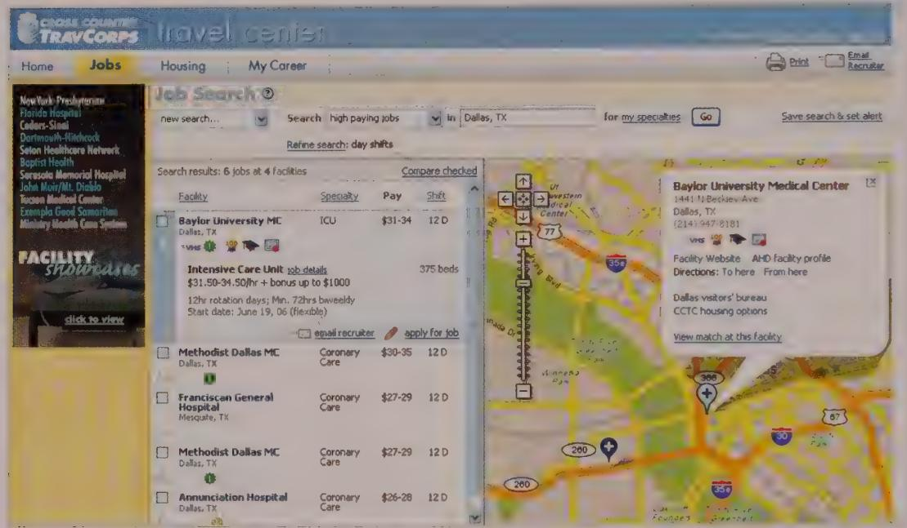

# DESIGN PRINCIPLE

There is only one user experience: Form and behavior must be designed in concert.

# Step 2: Develop rough prototypes

It is often the case that even after the overall form and input methods are defined, the industrial designer still can take a variety of approaches. For example, when we've designed office phones and medical devices, it's often been asked whether the screen angle should be fixed or if it should be adjustable and, if so, how that will be accomplished. Industrial designers sketch and create rough prototypes from foam board and other materials. In many cases, we'll show several to stakeholders because each one has different cost and ergonomic considerations.

# Step 3: Develop form language studies

In a fashion similar to the visual language studies described earlier, the next step is to explore a variety of physical styles. Unlike the visual language studies, these are not abstract composites. Instead, they represent various looks applied to the specific form factors and input mechanisms determined in Steps 1 and 2. These studies include shape, dimensionality, materials, color, and finish.

As with visual style studies, form language studies should be informed by persona goals, attitudes, aptitudes, experience keywords, environmental factors, and manufacturing and pricing constraints. Typically these studies require several rounds of iteration to find a feasible and desirable solution.

# Defining the service design framework

Because service design often affects organizations' business models, the service design framework may be conducted before other areas of design.

The service design framework typically follows this process:

1 Describe customer journeys.   
2 Create a service blueprint.   
3 Create experience prototypes.

The book *Service Design* by Polane, Løvlie, and Reason (Rosenfeld Media, 2013) contains a much more thorough treatment of this subject, with examples.

# Step 1: Describe customer journeys

Similar to the context scenarios of interaction design, customer journeys describe an individual persona's use of a service as a descriptive narrative, from first exposure to final transaction. Different journeys stress different aspects of the service, accounting for different personas' goals. Each customer journey also provides an opportunity for the designer to take personas through secondary paths where the service helps them recover from a nuanced problem.

# Step 2: Create a service blueprint

A service blueprint is the service's "big picture." It describes the collection of touch points by which the persona uses the service, such as a mobile site or a storefront. It also

describes the "backstage" processes by which service is delivered, such as the interface used by a customer service representative handling a phone call.

Early blueprints were flowcharts that described the connections between touch points. More recent trends draw these as swimlane diagrams that place the user at the top, the service organization at the bottom, and its channels—like marketing, sales, and customer service—across the page.

A horizontal "line of visibility" on the blueprint often distinguishes onstage and backstage touch points.

Some designers may prefer to begin with the service blueprint instead of the customer journeys. While each influences the other and is iterated across the project, the authors believe it is usually best (unless this is an update to an existing, mature service) to start with the customers via their design proxies—persons. Starting with the customer experience may help identify unexpected touch points in the service map that may otherwise be ignored.

# Step 3: Create experience prototypes

Although the exhaustive design of a particular channel may most properly belong to interaction or visual designers, service designers illustrate a persona's individual experience (and the continuity between touch points) through experience prototypes. They almost certainly include mock-ups of key touch points like mobile apps and websites, but they can include much more. Often these are created as short video scenes that illustrate the experience kinematically.

These prototypes take many forms at many different degrees of fidelity, from simple interviews with potential customers focused on mock-ups to full-scale pilots of the prospective service.

# Refining the Form and Behavior

When a solid, stable framework definition is reached, designers see the remaining pieces of the design begin to fall smoothly into place: Each iteration of the key path scenarios adds detail that strengthens the product's overall coherence and flow. At this stage, a transition is made into the Refinement phase, where the design is translated into a final, concrete form.

In this phase, principles and patterns remain important in giving the design a fine formal and behavioral finish. Parts II and III of this book provide useful principles for the

Refinement phase. It is also critical for the programming team to be intimately involved throughout the Refinement phase. Now that the design has a solid conceptual and behavioral basis, developer input is critical to creating a finished design that can and will be built, while remaining true to concept.

The Refinement phase is marked by the translation of the sketched storyboards into full-resolution screens that depict the user interface at the pixel level, as shown in Figure 5-5.

  
Figure 5-5: Full-resolution bitmap screens for Cross Country TravCorps based on the Framework illustration from Figure 5-3. Note that minor changes to the layout naturally result from the realities of pixels and screen resolution. Visual and interaction designers need to work together closely at this stage to ensure that visual changes to the design continue to reinforce appropriate product behaviors and meet the goals of the primary personas.

The basic process of design refinement follows the same steps we used to develop the design framework, this time at deeper and deeper levels of detail. (Of course, it isn't necessary to revisit the form factor and input methods unless an unexpected cost or manufacturing issue crops up with the hardware.) After following Steps 2 through 6 at the view and pane levels, while incorporating the increasingly refined visual and industrial designs, use scenarios to motivate and address the product's more granular components.

During this phase, you should address every primary view and dialog possible. Throughout the refinement phase, visual designers should develop and maintain a visual style guide. Developers use this guide to apply visual design elements consistently when they create low-priority parts of the interface that the designers typically don't have the time

and resources to complete themselves. At the same time, industrial designers work with mechanical engineers to finalize components and assembly.

While the end product of the design process can be any one of a variety of outputs, we often create a printable Form and Behavior Specification. This document includes screen renderings with callouts sufficiently detailed for a developer to code from, as well as detailed storyboards to illustrate behaviors over time. It can also be valuable to produce an interactive prototype in HTML or Flash that can augment your documentation to better illustrate complex interactions. However, keep in mind that prototypes alone are rarely sufficient to communicate underlying patterns, principles, and rationale, which are vital concepts to communicate to developers. Regardless of your choice of design deliverable, your team should continue to work closely with the construction team throughout implementation. Vigilance is required to ensure that the design vision is faithfully and accurately translated from the design document into a final product.

# Validating and Testing the Design

In the course of an interaction design project, it's often desirable to evaluate how well you've hit the mark by going beyond your personas and validation scenarios to put your solutions in front of actual users. You should do this after the solution is detailed enough to give users something concrete to respond to, and with enough time allotted to make alterations to the design based on your findings.

In our experience, user feedback sessions and usability tests are good at identifying major problems with the interaction framework and at refining things like button labels and activity order and priority. They're also essential for fine-tuning such behaviors as how quickly a screen scrolls in response to turning a hardware knob. Unfortunately, it's difficult to craft a test that assesses anything beyond first-time ease of learning. There are a number of techniques for evaluating a product's usability for intermediate or expert users, but this can be quite time-consuming and is imprecise at best.

You have a variety of ways to validate your design with users. You can hold informal feedback sessions where you explain your ideas and drawings and see what the user thinks. Or you can give a more rigorous usability test, in which users are asked to complete a predetermined set of tasks. Each approach has advantages. The more informal style can be done spontaneously and requires less preparation. The downside to this approach is that the designer can unintentionally "lead the witness" by explaining things in a persuasive manner. In general, we've found this approach to be acceptable for a technical audience that can imagine how a few drawings might represent a product interface. It can be a useful alternative to usability testing when the design team doesn't have time to prepare for formal usability testing.

Given sufficient time, more formal usability testing has some advantages. Usability tests determine how well a design allows users to accomplish their tasks. If the test's scope is sufficiently broad, it can also tell you how well the design helps users reach their end goals.

To be clear, usability testing is, at its core, a means to evaluate, not create. It is not an alternative to interaction design, and it will never be the source of that great idea that makes a compelling product. Rather, it is a method to assess the effectiveness of ideas you've already had and to smooth over the rough edges.

Usability testing is also not the same as user research. For some practitioners, "tests" can include research activities such as interviews, task analyses, and even creative "participatory design" exercises. This conflates a variety of needs and steps in the design process into a single activity.

User research must occur before ideation; user feedback and usability testing must follow it. In fact, when project constraints force us to choose between ethnographic research and usability testing, we find that time spent on research gives us much more leverage to create a compelling product. Likewise, given limited days and dollars, we've found that spending time on design provides more value to the product design process than testing. It's much more important to spend time making considered design decisions based on a solid research foundation than to test a half-baked design created without the benefit of clear, compelling models of the target users and their goals and needs.

# What to test

Because the findings of usability testing are often quantitative, usability research is especially useful in comparing specific design variants to choose the most effective solution. Customer feedback gathered from usability testing is most useful when you need to validate or refine particular interaction mechanisms or the form and expression of specific design elements.

Usability testing is especially effective at validating the following:

- Naming—Do section/button labels make sense? Do certain words resonate better than others?   
- Organization—Is information grouped into meaningful categories? Are items located in the places customers might look for them?   
- First-time use and discoverability—Are common items easy for new users to find? Are instructions clear? Are instructions necessary?   
- Effectiveness—Can customers efficiently complete specific tasks? Are they making missteps? Where? How often?

It is also worth noting that usability testing, by its nature, focuses on assessing a product's first-time use. It is often quite difficult (and always laborious) to measure how effective a solution is on its 50th use—in other words, for the most common target: the perpetual intermediate user. This is quite a conundrum when you are optimizing a design for intermediate or expert users. One technique for accomplishing this is using a diary study, in which subjects keep diaries detailing their interactions with the product. Elizabeth Goodman, et al, provide a good explanation of this technique in Observing the User Experience (Morgan Kaufmann, 2012).

When performing usability testing, be sure that what you are testing can actually be measured, that the test is administered correctly, that the results will be useful in correcting design issues, and that the resources necessary to fix the problems observed in a usability study are available.

# When to test: Summative and formative evaluations

In his 1993 book Usability Engineering (Morgan Kaufmann, 2012), Jakob Nielsen distinguishes between summative evaluations, which are tests of completed products, and formative evaluations, conducted during design as part of an iterative process. This is an important distinction.

Summative evaluations are used in product comparisons, to identify problems prior to a redesign, and to investigate the causes of product returns and requests for training and support. Summative studies generally are conducted and thoroughly documented by professional third-party evaluators. In some cases, particularly in competitive product comparisons, summative studies are designed to yield quantitative data that can be tested for statistical significance.

Unfortunately, summative evaluations are often used as part of the quality assurance process near the end of the development process. At this point, it's usually too late to make meaningful design changes. Design should be evaluated before the coding begins (or at least early enough that you have time to change the implementation as designs are adjusted). However, if you need to convince stakeholders or developers that the current product does have a usability problem, nothing beats watching real users struggle through basic tasks.

Formative evaluations do just this. These quick, qualitative tests are conducted during the design process, generally during the Refinement phase. When effectively devised and moderated, a formative evaluation opens a window to the user's mind, allowing the designers to see how (and, with interviews, why) their target audience responds to the information and tools they've provided to help them accomplish their tasks.

Although summative evaluations have their uses, they are product- and application-management activities conducted to inform product life cycle planning. They can be useful "disaster checks" during development, but the costs of changes at this point—in time, money, and morale—can be high.

# Conducting formative usability tests

There are a wide variety of perspectives on how to conduct and interpret usability tests. Unfortunately, we've found that many of these approaches either presume to replace active design decision making or are overly quantitative, resulting in nonactionable data about things like "time to task." A good reference for usability testing methods that we've found to be compatible with Goal-Directed interaction design methods is Carolyn Snyder's Paper Prototyping (Morgan Kaufmann, 2003). It doesn't discuss every testing method or the relationship between testing and design, but it covers the fundamentals well and provides some relatively easy techniques for usability testing.

In brief, we've found the following to be essential components of successful formative usability tests:

- Test late enough in the process that there is a substantially concrete design to test, and early enough to allow adjustments in the design and implementation.   
- Test tasks and aspects of the user experience appropriate to the product at hand.   
Recruit participants from the target population, using your personas as a guide.   
- Ask participants to perform explicitly defined tasks while thinking aloud.   
- Have participants interact directly with a low-tech prototype (except when testing specialized hardware where a paper prototype can't reflect nuanced interactions).   
Moderate the sessions to identify issues and explore their causes.   
- Minimize bias by using a moderator who has not previously been involved in the project.   
Focus on participant behaviors and their rationale.   
- Debrief observers after tests are conducted to identify the reasons behind observed issues.   
- Involve designers throughout the study process.

# Designer involvement in usability studies

Misunderstanding between an uninformed designer and the user is a common cause of usability problems. Personas help designers understand their users' goals, needs, and points of view, creating a foundation for effective communication. A usability study, by

opening another window on the user's mind, allows designers to see how their verbal, visual, and behavioral messages are received. They also learn what users intend when interacting with the designed affordances and constraints.

Designers (or, more broadly, design decision makers) are the primary consumers of usability study findings. Although few designers can moderate a session with sufficient neutrality, their involvement in the study planning, direct observation of study sessions, and participation in the analysis and problem-solving sessions are critical to a study's success. We've found it important to involve designers in the following ways:

- Planning the study to focus on important questions about the design   
- Using personas and their attributes to define recruiting criteria   
Using scenarios to develop user tasks   
- Observing the test sessions   
Collaboratively analyzing study findings

# Notes

1. Schumann et al., 1996   
2. Cooper, 1999   
3.Shneiderman.1998

__________

__________

