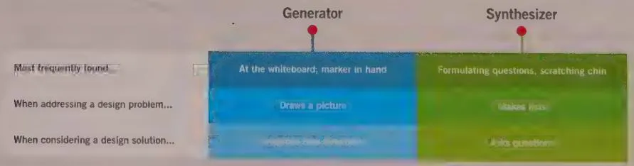
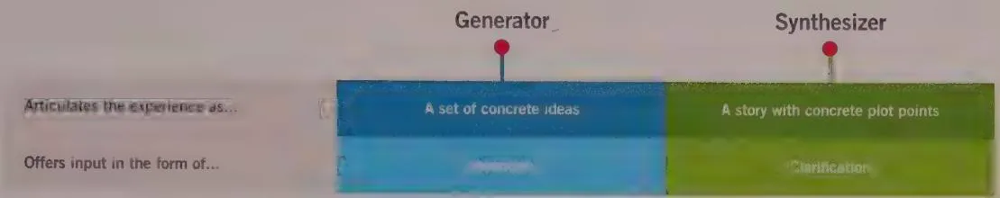
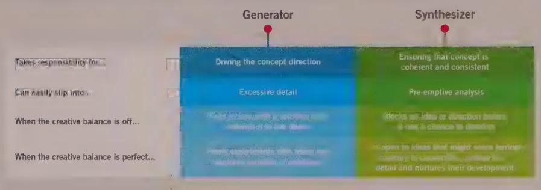
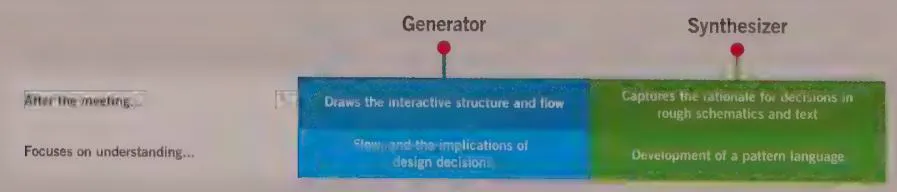

# CREATIVE TEAMWORK

In the Introduction to this book, we described the Goal-Directed method as consisting of three p's: principles, patterns, and processes. However, there's a fourth "p" worth mentioning—practices. This book mostly concerns itself with the first three, but in this chapter we'd like to share a few thoughts about the practice of Goal-Directed design and how design teams integrate into the larger product team.

In design and business, teams are common, but rarely are they successful or productive. The finer points of teamwork are not commonly taught or communicated. Teams require meeting time and discussion, and they add layers of communication. These are not inherently disadvantages, but when teamwork is not undertaken with care, its outcomes can be mere compromises. Team members can be too polite to dismiss others' ideas or too stubborn to let go of their own.

If you've ever worked on a highly productive team, you know that working together can produce outcomes that would be very hard, and sometimes impossible, for a single individual. In software and service development, we need teammates to ensure that the appropriate problems are addressed, ideas flow, solutions are effectively evaluated, and dead ends are quickly recognized. Well-functioning teams can actually make the product development process more efficient and its outcomes more effective for users.

This chapter discusses strategies for working together, complementary approaches to product development, and tactics for assembling teams across an organization. Some of the most interesting and important design problems are too big to solve alone—and too often, going it alone also can be rather lonely.

# Small, Focused Teams

The following discussion addresses the team concept at two levels:

- Core teams are small and focused. Often they are arranged around a specific kind of expertise, such as engineering know-how, creativity, marketing savvy, or business leadership. But they could also be small, cross-functional teams in a startup or a small-scale product organization.   
- Extended teams are large and sometimes geographically distributed. These can include stakeholders, whose work depends on the results of the project but who aren't responsible for the design itself. In almost any product development effort, the extended product team includes separate core teams for (at least) marketing, design, and engineering.

Even in large-scale product organizations, most of the actual work is done within the context of the core teams; therefore, this chapter covers techniques that can improve work within small teams. Whether that team is cross-functional or focused on a specific aspect of product development, the strategies in this chapter can help organize teamwork around a set of simple practices. These practices can help ensure that ideas flow, work is efficient, and critiques are timely.

# Thinking Better, Together

Small teams continually prioritize and address items on their work list. Some are minor; some merely seem minor; all must be prioritized and considered at their proper depth. Effective functional or cross-functional teams do more than "divide and conquer" when confronting the never-ending queue; they harness the sparky, sometimes chaotic, energies of their members in a collaborative effort that we'll call "thought partnership."

You can think of a thought partner as an intellectual complement—a collaborator who shares your goals but who comes at problems from a different angle, with a different set of skills. In *Thinking, Fast and Slow*, author Daniel Kahneman describes his partnership in his academic work with Amos Tversky in a way that looks to us like good thought partnership:

The pleasure we found in working together made us exceptionally patient; it is much easier to strive for perfection when you are never bored. Both Amos and I were critical and argumentative ... but during the years of the collaboration, neither of us ever rejected out of hand anything the other said.1

How did thought partnership evolve? In the early days of Cooper's consulting practice, one of the meeting rooms came to be known as The Yelling Room. (The name was evidence that simply hiring like-minded people didn't always guarantee harmony around the whiteboard.) In those days, it was common for designers to campaign, loudly, for their design ideas. The spirit was collaborative and feisty, but the output was often unclear. "What did we decide, again?" "Whose idea won?" "What do we need to tackle now?"

Over time, a new collaboration strategy emerged. One designer was given responsibility for marshaling the conversation, and the other focused on ideating and exploring. In our practice today, we've applied a much deeper definition and distinction to each of the two approaches:

- Generation—In a generation-based approach, invention is undertaken boundlessly, and outcomes are most successful when people have space to generate freely, think laterally, and explore openly.   
- Synthesis—In a synthesis-based approach, invention is most fruitful when it is guided and focused, and outcomes are assured only when they've addressed the user need.

Teams that blend these approaches make quick progress through complicated problems. Whatever role you play in the product development process, you can use the following practices to find a teammate who will help you do your best thinking.

# Generators and synthesizers

In our hiring process at Cooper, we seek to identify individuals who will make powerful thought partners, and we specifically try to find designers with complementary skills and dispositions. We call these roles "Generator" and "Synthesizer." We've found that these two styles of creativity strike a powerful balance when we tackle complicated design problems. Generators and Synthesizers share responsibility for delighting users with simple solutions, and they have different responsibilities during the process. In the best cases, they allow their partners to fully inhabit the creative roles they're most comfortable playing.

Generation and synthesis live on the same spectrum of creativity, as shown in Figure 6-1. Most designers sit on one side of the spectrum, favoring either synthetic or generative skills. A strong Generator typically needs a partner of equal strength in synthesis to strike a healthy balance. When working alone, strong Generators may zoom in too quickly on an incomplete solution or spend too much time casting about in the muddiness of a brainstorm. They need a Synthesizer to help make decisions at the right level at the right times and to keep the design moving forward.

  
Figure 6-1: Generation and synthesis form a creative spectrum.

Synthesizers initiate dialog within their teams. Instead of proposing new ideas and solutions, Synthesizers ask questions to locate the intent and value within ideas that have already been proposed. As the conversations proceed, Synthesizers seek clarity, expose gaps, and draw connections. When working alone, strong Synthesizers can struggle to move beyond list-making and scenario thinking. They need a Generator to pull ideas into concrete, connected form.

The dialog between these two balances inspires ideation with evaluation and sense-making. It lays the foundation for a powerful partnership in confronting complex interaction problems. A generated idea can emerge as a vague or inspired idea, and capable synthesis can quickly reveal its inherent value or ensure that dead ends and darlings are quickly recognized and dispatched.

The following sections outline the qualities, characteristics, and interplay between the roles. Use the comparisons as a way to find your own creative disposition and to describe the kind of person who could bring out the best in you.

In a typical design meeting, the distinction between roles often manifests itself from the first moment, as shown in Figure 6-2. Who instinctively reaches for the marker and heads to the whiteboard when confronted with a design problem?

  
Figure 6-2: Generators and synthesizers complement each other.

Each role tends to inhabit a specific physical and mental space during design meetings. Successful Generators tend to grab the marker to visualize ideas, as shown in Figure 6-3. Synthesizers tend to organize, listing the qualities of a good solution or refreshing their understanding of the problem, the user's goals, and the usage context.

  
Figure 6-3: Generators and synthesizers approach design problems from different angles.

Generators tend to be relentlessly concrete thinkers, whereas the best Synthesizers lead with storytelling and prompting.

Here's a sample discussion from an imaginary project:

Generator: I have an idea for adding something new to the list. (Begins drawing the screen on the whiteboard.) It's a gesture. When you're in the main list, you pull down, and you start to see the control for adding a new thing. It's just an empty field.

Synthesizer: Great. It might feel sort of hidden, though. In Jeff's scenario, he only adds a new thing every few weeks, right?

Generator: Yeah, true. He might forget it's there.

Synthesizer: I like the idea of keeping the focus on information rather than UI widgets, though.

Generator: Hmmm. How about we show the field with the help text "Add a new thing" when this main screen loads, and then the screen snaps up to cover it? So you see it, but then you focus on the list.

Synthesizer: I like it. It might get annoying if it happens a bunch of times in the same session, but I think we can come up with some rules.

As a design meeting progresses, the Generator and Synthesizer work together to explore solutions and develop ideas. The Synthesizer should help shape the discussion, gently tightening the depth of field. The conversation usually begins with a wide-angle discussion of the problem and from there drills ever tighter into the details of a solution.

As shown in Figure 6-4, creative minds often disagree, especially when they're coming at the problem from different directions. Early on in a creative partnership, trust must be established. Generators must take the lead in concept direction. This means that Synthesizers must cede both the literal and figurative whiteboard marker. At the same time, Generators must trust Synthesizers to steer the discussion, to keep from getting mired in details, and to reframe the problem when necessary. This means that Generators must feel comfortable with introducing newly formed ideas and not feel threatened when their partner evaluates and critiques these ideas. Most ideas are bad, after all, and a primary goal in a thought partnership is to identify an idea's quality or promise early on and dispense with the craft.

  
Figure 6-4: Generators and synthesizers have different responsibilities, strengths, and pitfalls.

In the detailed design phase, the team often spends the morning working together and then separates to document details, as shown in Figure 6-5. The Generator typically opens a drawing tool and begins capturing decisions in the form of drawings. The Synthesizer captures decisions, either in schematics that help explain the flow or in text that explains the rationale. The details that the team documents can be communicated in a variety of ways, depending on the team's size and needs. In our practice, we favor frequent, lightweight, informal notes over formal documentation milestones.

  
Figure 6-5: Generators and synthesizers perform different tasks away from the whiteboard.

# Getting started with thought partnership

If you want to establish thought partnership in your practice, you could begin by creating Generator or Synthesizer roles and then finding people to fill them. You could also start leaner, finding small ways to apply elements of the practice that are appropriate to your work. It can take a while to determine what kind of partnership you need, but you can start with simple steps.

# Finding a partner who generates

Before you begin, clarify the problem you want to solve.   
- Appeal to the generative capabilities of a colleague or friend: "I need someone to help kick-start some ideas."   
- If things don't work at first in the meeting, walk up to the board and draw a bad idea. If your partner is a good Generator, he or she will leap up and begin building on the bad idea or offer a counterproposal.

# Finding a partner who synthesizes

Before you begin, make sure you're designing for a higher-level "story" or scenario. This will help give your partner a rubric from which to work during the meeting.   
- Appeal to your partner's evaluative capabilities: "Can you help me figure out whether this idea is any good?"   
- If things don't immediately go well in the meeting, work on the story. Make sure you're both clear on what the user is doing and why.

# Switching roles on the fly

Establish ground rules at the beginning of your partnership. Synthesizers should probe and guide; Generators should explore and ideate. You can swap roles within a meeting, but it's a good idea to make this switch explicit. When a Synthesizer comes up with a great idea, he must resist the urge to wrest the marker away from the Generator. Instead, he can simply offer to switch roles: "Mind if I generate for a bit?"

# Getting unstuck (the 15-minute rule)

Small groups of creative people sometimes hit a wall. Ideas won't flow; conversations swirl or get mired in detail. In our practice, we encourage teams to bring in another designer if the discussion doesn't advance for 15 minutes. The core team should brief this outsider on simple contextual details: the user, the scenario, and the ideas under

consideration. The outsider should, in turn, probe the designers for rationale: Why is this good? How does this help? Almost invariably, this simple conversation helps lift the designers out of the details and move beyond the impasse in a matter of minutes.

# Rightsizing core teams

If two are good, three must be better, four would be amazing, and ten could bend space and time. Right? Organizations large and small fall victim to an additive urge when building teams. In our experience, teams are most effective when the members have clear roles and when the teams are small and nimble. This is why we have applied the moniker "core team" to the unit responsible for getting work done.

In Scaling Up Excellence, Stanford business professors Robert Sutton and Huggy Rao cite numerous examples in which bigger teams actually produce worse outcomes; they call this phenomenon "The Problem of More":

Employees in bigger teams gave others less support and help because it was harder to maintain so many social relationships and to coordinate with more people ... The key challenges are how to add rules, tools and people without creating [bloat].2

In our practice at Cooper, we steer clear of bloat by insisting on four things: small teams, clear roles, tight decision-making loops, and minimal "work about work." That last phrase describes any activities that are not directly tied to making progress on the core objectives of product development: coming up with great ideas and shipping great products. Status e-mails and quick, noncritical check-ins are examples of "small" tasks that can accumulate and end up requiring significant effort and coordination. If you're reading this book while you're in a nonessential meeting, you're sinking in the quicksand of "work about work."

By localizing decision-making and being proactive about planning milestones and check-ins, we carve out space for a small set of creative teammates to flourish. In specific numeric terms, our rule of thumb for the right-sized core team to focus on an individual problem is no more than four, and no fewer than two. A minimum of two enables rapid evaluation and iteration. Teams with more than four members have too much overhead, too many people to please, and too much opportunity to lose momentum.

Finally, remember that a small team can be nimble only when roles are clear, responsibility for success is shared, and abilities are complementary. The following sections discuss the various participants in teams large and small and provide some tips for getting the most out of them.

# Working Across Design Disciplines

The Synthesis-Generation model can be applied to any professionals engaged in creative discussion. In our practice, it provides structure when any two individual designers are collaborating—visual designer and interaction designer, two interaction designers, designer and developer, interaction designer and creative lead. While the practice of user experience design has become more established, practitioners often find themselves in new collaborative situations with creative professionals from many backgrounds. This model can be usefully applied in many core team situations, with participants from various disciplines.

Over a product's lifetime, designers across disciplines must do more than merely communicate. Interaction designers must coordinate and cooperate with visual and industrial designers, staging decision-making so that each discipline is equipped with the material it needs to work most effectively. The following sections offer a framework for understanding the distinct responsibilities of each discipline, along with a summary of how the disciplines can work together effectively.

# Interaction design

Interaction designers are responsible for understanding and specifying how the product should behave. This work overlaps with the work of both visual and industrial designers in a couple of important ways. When designing physical products, interaction designers must work with industrial designers early on to specify the requirements for physical inputs and to understand the behavioral impacts of the mechanisms behind them. Interaction designers cross paths with visual designers throughout the project. In our practice, their collaboration begins early, as visual designers guide discussions of the brand and emotive aspects of the experience in discussions with users and the extended team.

# Visual interface design

In our practice, we've come to recognize that visual interface design is a critical and distinct discipline that must be conducted in concert with interaction design and—when appropriate—industrial design. It has great power to influence a product's effectiveness and appeal. But for this potential to be fully realized, visual design must not be an afterthought—it isn't a "coat of paint." It should be regarded as one of the essential tools for satisfying user and business needs.

Visual interface designers' work emphasizes the organizational aspects of the design and how visual cues and affordances communicate behavior to users. These designers must work closely with interaction designers to understand the priority of information, flow, and functionality in the interface and to identify and strike the right emotive tones.

Visual interface designers focus on how to match the interface's visual structure to the logical structure of both the users' mental models and the application's behaviors. They are also concerned with communicating application states to users (such as read-only versus editable) and with cognitive issues surrounding user perception of functions (layout, visual hierarchy, figure-ground issues, and so on).

Visual interface designers must have command of basic visual properties—color, typography, form, and composition—and must know how these can be used to effectively convey affordances, information hierarchy, and mood. Visual interface designers should be aware of brand psychology, know the history of graphic design, and be familiar with current trends. They must know accessibility principles and the science of human perception. Visual interface designers also need a fundamental understanding of interface conventions, standards, and common idioms. (Read more about Goal-Directed visual interface design in Chapter 17.)

# Graphic design

Until the last 20 years or so, the discipline of graphic design was dominated by the medium of printed ink, as applied to packaging, advertising, environmental graphics, and document design. These traditional practices were not developed to address the demands of pixel-based output. However, the discipline has evolved considerably in the last two decades, and graphic design has become rigorous and eloquent in its approach to digital, screen-based media.

Talented, digitally fluent graphic designers excel at providing rich, aesthetically pleasing, exciting interfaces. They can create beautiful and appropriate surfaces for the interface that establish a mood or connection to a corporate brand. For them, design is often first about the tone, style, and framework that communicate a brand experience, secondarily about legibility and readability of information, and finally about communicating behavior through affordances (see Chapter 13).

# Visual information design

Visual information design is concerned with the visualization of data, content, and navigation, rather than interactive functions. It is distinguished from information design in that it is less concerned with the content's editorial and information architecture issues, focusing instead on the graphical presentation. This skill set is particularly important in designing data-intensive applications, where users spend much of their time with complex content.

The primary goal of visual information design is to present data in a way that promotes understanding. This is accomplished by controlling the information hierarchy through

the use of visual properties such as typography, color, shape, position, and scale, as well as how these attributes change over time. It can also include microinteractions with information displays that expose details or connections to additional information. Common applications of visual information design include charts, graphs, sparklines, and other means of displaying quantitative information. Edward Tufte has written several seminal books that cover this topic in detail, including The Visual Display of Quantitative Information (Graphic Press, 1993).

# Industrial design

When designing a convergent product, industrial designers must define the form of the physical product, embodying the brand with shape and material. For the purposes of interaction design, they specify physical input mechanisms. Interaction designers can perform research into the users' overall needs and the device's goals as a whole. Industrial designers lay the groundwork for their concepts with competitive analysis and materials research. The input mechanisms should not be specified before the desired interaction paradigms are known. Interaction iterations of the software's primary elements should be conducted in parallel with industrial design concepts so that the outcomes of each can inform subsequent phases. Throughout, interaction designers benefit from the materials expertise and ergonomic acumen of industrial designers, and the industrial designers benefit from the holistic experience vision created by the interaction designers.

Much like the difference in skills between graphic designers and visual interface and information designers, a similar split occurs among the ranks of industrial designers. Some are more adept at creating arresting and appropriate forms for objects, and others emphasize logical and ergonomic mapping of physical controls in a manner that matches user goals and communicates device behaviors. The increase in software-enabled devices that use rich visual displays demands a concerted effort on the part of interaction designers, visual interface designers, and industrial designers to produce complete and effective solutions.

The interplay of these roles involves much more subtlety, and many great resources explore this topic in detail. Kim Goodwin's book, Designing for the Digital Age (Wiley, 2011), offers practical techniques and tips for defining roles and establishing thought partnership in the context of a design project.

# The Extended Team

The preceding discussion covered practices that allow great design to happen among a small core team. But for design to transform into a shipping product, the design must

enter the minds and hearts of many more people. Will the rest of the extended team understand its value? Will they indulge it long enough to give it the kind of critique that makes it better? Even if it survives early whiteboard sessions, will it survive a presentation to the product owner? If the product owner gets behind it, will it be understood, implemented, and extended effectively by the production engineers?

The following discussion is intended to outline a few simple strategies for integrating design in large-scale product-focused teams. It's not intended to be a comprehensive accounting of the best practices in product or service design and development. Very few ideas are truly great. This is why you need timely, candid feedback from capable collaborators, both among your core team and across the extended product team. This section discusses the frequent major participants within product teams. Emphasis is placed on how and when to collaborate with them so that your ideas get the kinds of critiques they need, at the appropriate time.

# Areas of responsibility and authority

Designers are never the sole participants in creating a great interactive experience. Within digital product organizations, the expertise of engineers, marketers, and business stakeholders must be interwoven with the work of design in a product's creation and evolution. The following list describes a division of responsibilities, balanced by an equal division of authority among those different disciplines:

- Design is responsible for users' goals for the product. Many organizations currently do not hold any specific person, or team, responsible for goals. To carry out this responsibility, designers must have the authority to decide how the product will look, feel, and behave. They also need access to information. They must observe and speak to potential users about their needs, to engineers about technological opportunities and constraints, to marketing about opportunities and requirements, and to management about the kind of product to which the organization will commit and the results they expect.   
- Usability is responsible for validating that users respond to the design as intended and that the overall experience and detailed interactions have the desired effect—being useful, usable, and desirable. To be effective, usability should be independent from but collaborative with the design group, and both usability and design should report to a decision-maker who can weigh the results from an informed and objective standpoint, and has the authority to have any necessary corrections to the design or implementation enforced. Usability's strength is in identifying problems, while design's strength is in identifying solutions. Collaboration works best when this division of labor is maintained.   
- Engineering is responsible for construction. This means that they must have authority over the raw materials and construction processes—development platforms

and libraries, for example—along with the relative difficulty ratings and cost of the items in their backlog. The engineering and design teams must stay in touch when those items are being prioritized. Designers must review and react to the implementation of form and behaviors, and both teams must evaluate the success or failure of the overall experience as it is developed and tested. Designers should rely on engineers to provide guidance on technical constraints and opportunities, as well as the feasibility of proposed design solutions.

- Marketing is responsible for defining the market opportunity as a set of customer needs, preferences, and motivations. This team also eventually must convince customers to purchase the product. To do this, the marketing team must have the authority to advocate for the most lucrative, or beneficial, customer segments. Its members must provide guidance in targeting design research with the appropriate users, and the team must have access to the outcomes of that design research. (It's worth noting that, as we discuss in Chapter 3, customers and users are often different people with different needs.)

- Business leads are responsible for defining the business opportunity, because they're also accountable for the product's profitability. This group must drive decision-making around where opportunities for differentiation exist, and what features and functions must be prioritized across the extended team. To make those decisions, business leads need to receive clear information from the other groups: design's research and product definition, marketing's research and sales projections, and engineering's estimations of the time and cost to create the product.

Collaboration among these teams best happens in two venues: at frequent, informal working meetings where new ideas are explored, evaluated, and elaborated on; and at checkpoints that correspond to the end of each phase in established processes. Working meetings are particularly important for engineers once the design has begun to gel, and they are critical for marketing in the project's early and late stages.

As the product vision evolves, each team must continually seek to address its core concern:

- Designers—What are the simplest, most coherent, most delight-inspiring mechanisms for crafting the experience?   
- Usability professionals—Does the design deliver on its promise of usefulness, usability, and desirability? Do users really use the product as assumed in the design?   
- Engineers—How do we deliver the experience in a way that is fast, robust, scalable, and extendable?   
- Marketers—How can we inspire adoption?   
- Business leaders—Where is the most evident overlap of product function and market need?

When team members focus on those questions and ensure that they're prioritized appropriately, extended team interactions are clear and direct.

# Collaborating with agile developers

Designers imagine and specify the right experience: a form that delights users, an experience that feels right, behaviors that fit use. Developers offer a corollary: The right experience should be built in the right way. We once believed that all design work should be completed before coding begins, but we've come to learn that this is neither desirable nor practical. Clear benefits arise from methodically testing and proving the feasibility of design hypotheses along the way.

Agile development methods arose as a response to the very real drawbacks of "waterfall" methods, which are characterized by years-long development timelines, hundred-page requirements documents, processes with various "gates" to ensure "quality," and dozens of participants. Agile methods seek to optimize time and energy, reduce waste, and ensure that concepts actually deliver value to users. They encourage many of the same principles discussed early in this chapter—small teams, focused work, and frequent discussion. Yet although they have evolved the practice of software development, agile methods also complicate—and, in some cases, short-circuit—design work.

This section discusses ways to ensure that the work of designers informs and shapes the development of products developed with agile methods. Let's first understand a couple of fundamental perspectives on agile methods:

- Business stakeholders tend to love the idea of agile development because it sounds economical and efficient. Yet business stakeholders often don't realize until much later that building fast means thinking fast, and fast thinking requires a solid foundation of assumptions and expected outcomes. If no underlying foundation or shared vision exists for what should be built and tested, agile work is aimless and, contrary to promises, wastes time.   
- Developers tend to love agile methods because such methods support more of what they love (coding) and less of what they don't (sitting in meetings, interpreting requirements documents). When misapplied, however, this way of working can result in heads-down sprinting toward hazily specified destinations, resulting in just as many frustrating dead ends as classic waterfall methods.

In our experience, agile development is highly successful when core product elements are clearly rendered, widely understood, and implemented so that they can be tested well. Thus, we have found that the primary elements of an experience should be planned, visualized, and discussed before they are built. Even in a highly iterative process, informed planning should precede construction. You must think before you do. This is a much

messier reality than the neat sequential compartmentalization of design and construction, but it can initiate a productive dialog between designers, developers, and business decision-makers.

The remainder of this section covers a couple of simple questions at a high level:

What does design mean in an agile context?   
- How should designers adapt their practice in fast-paced, agile ways?

# The work of designers on an agile team

Interaction designers seek simplicity and cohesion, knowing that cohesive solutions won't appear fully formed on day one. They emerge over time, hewing to the spirit of Antoine de Saint-Exupéry's oft-cited design aphorism: "...Perfection is attained not when there is no longer anything to add, but when there is no longer anything to take away."5 Waterfall methods are friendlier to this way of working, because they provide time for ideas to develop and for their flaws to be revealed and removed. Agile methods value speed and focus on small iterations, but they reward designers with a chance to understand how users interpret design in progress.

In agile contexts, designers must prioritize and visualize; they can bring clarity and concreteness to desired outcomes and facilitate conversations around what elements must be developed to achieve them. This sounds similar to the work of design in many other contexts, but there are two important differences:

- There can be tension, or outright disagreement, in how the experience is defined when people work in agile teams. Designers must be able to define the critical elements of the user experience while working in concert with developers who may reveal constraints on or obstacles to that definition.   
- Designers must think differently about the inputs to, and outcomes of, their practice. Agile development allows for feedback from users early on and often. This is an opportunity, and designers should appreciate it as such.

Designers rarely get a chance to fully visualize and perfect a user experience vision in an agile environment. But they must advocate for goal-directedness in the definition of the product and in the prioritizing of items in development.

# Defining the user experience on agile teams

At the beginning of a collaborative effort with agile developers, designers will want to quickly assess how much of the experience has already been defined, specified, or implied.

This definition could be explicit—in the form of a wireframe created by a lead architect or business stakeholder—or implicit, in the form of shared assumptions about how it will work, the implementation technologies used, and so on. Designers should expect to shape the primary elements of the user experience—layout and navigational metaphors, the information architecture, transitions and animations that establish a sense of polish. Therefore, it's important to reckon with predetermined implications and constraints.

On the best agile teams, the designers specify the foundation of the experience while the developers lay the non-user-facing technical foundation. In less-optimal cases, designers need to move quickly to confront assumed specifications, especially those that prematurely determine an important aspect of the experience. These conversations can be difficult, but the whole point of user experience design is to express the product hypothesis through the user interface.

In our practice, agile developers can be capable thought partners at this stage. Talented developers think deeply about the infrastructure and connective tissue of interactive products, and they bring a healthy perspective on where the true engineering complications lie. In the best cases, they provide useful direction toward the right level to apply design and ensure that the work of design is useful and readily implemented. In the worst cases, neither developers nor designers understand the value of the others' expertise.

Doing valuable work on an agile team is much like doing it in other contexts. It always comes down to articulating users' goals, context, and flows; visualizing and iterating the desired experience; and prompting, gathering, and interpreting frequent user feedback. On agile teams, designers must be able to quickly determine where the biggest user experience challenges lie and to ensure that related elements flows are defined before development begins.

For case studies in the collaboration of user experience designers and agile developers, read the Smashing Magazine article Lean UX: Getting Out of the Deliverables Business by Jeff Gothelf and Josh Seiden. It's a fine primer on the ways in which user experience design can be applied in specific agile development contexts.

# Incorporating user feedback

For designers, the most valuable by-product of agile processes is feedback on the user experience—and lots of it. This feedback can be highly useful, as long as it is prompted, gathered, and interpreted appropriately. When you're a designer, it's critical to determine what you want to learn about the user experience during each release of new features or functions.

Feedback in an agile context is fast-paced but familiar. Early on, the prompts should be directed toward understanding whether the fundamental user hypothesis is correct. Do

the expected users derive the expected value? How well do the primary elements serve them? It's also important to look for what is working, independent of what you hoped would work. What are people using? Why?

As development continues, feedback can be more focused: Do the primary elements flow well? How are they accessed? What isn't used? Where do users stumble? What surprises users?

# Establishing a Creative Culture

Establishing teams is essential, but a team full of capable people doesn't guarantee good output. Great teams emerge and develop because they're placed in environments—physical and virtual—that nourish them. In our experience, the team's cultural and social dynamics are as important as clarity around roles. Does the team enjoy working together? Do they have fun together? Do they have compatible schedules? Interests? Ways of working? Senses of humor?

Renowned record producer Steve Albini once laid out his expectations in a letter to a band before they entered the recording studio:

I have worked on hundreds of records, and I have seen a direct correlation between the quality of the end result and the mood of the band throughout the process. If the record takes a long time, and everyone gets bummed and scrutinizes every step... the end result is seldom flattering. $^4$

A famous recording studio doesn't guarantee a good record, nor does a great producer. These ingredients are important, but those investments are wasted if the session is unproductive. Process can provide structure, but the ideas themselves need light and life to emerge and develop. Creating a positive, productive organizational culture is a topic that is too big to fully explore in this space, but it's too important to omit. Here is some of the raw material of an organizational culture; consider how you can use these elements to promote the cultural oxygen required to fuel the spark of creativity:

- Environmental serendipity—Creative organizations can go overboard with environmental design, but there's a method in what may seem like madness: Casual interactions with people, artifacts, or architectural moments set the tone for creativity. Small environmental surprises—a bold color, a new texture, an interesting surface—offer external encouragement for sparky ideation.   
- Small workspaces—An ideal workroom announces itself as a place that is friendly to creativity, providing surfaces and tools for sketching, along with room to move around. Nothing kills momentum more often than distraction, so a workroom should block out

as much of the outside world as possible. A door is the typical architectural method of achieving this goal, but doors can be rare in open floor plan workplaces. Find a corner, erect barriers, and keep out the rest of the world as you dive deep into a problem.

- A collaborative code of conduct—The team should agree on how they'll work together. Clarity and trust in one another's roles, responsibilities, and work habits are essential. Small rituals are the foundation of good teamwork. Meeting start times, durations, breaks, and agendas can seem inconsequential, but small problems can accumulate. Focus must be established together, so turn off your phone and close your laptop. Like a growing pile of dirty dishes in the kitchen sink, minor inattentions can easily overwhelm good intentions. Do your dishes, hold your teammates accountable, and get to work.   
- Space for positive digression—Digressions can seem egregious until they deliver you to unexpected insight. When a team is pressed for time, a digression can feel wasteful and sap energy. Teams who are open to digression tend to have more wide-ranging discussions and arrive at more interesting and more carefully considered solutions. The moral: Leave some time to stray.

Paying attention to the social dynamic is critical throughout the lifetime of the partnership. When there's conflict within the team, progress slows, quality decreases, and the end result flatters no one. For a design team, a solution of poor quality should be the ultimate bummer.

# Identifying Skill Levels in Designers

Designers' skills must meet the scale or depth of a design problem. Craftspeople get bored with simple problems; apprentices may end up with subtle, sophisticated problems that their skills can't match. In both cases, the product suffers, and the reputation of the design organization can take a hit. Design leaders must ensure that problems are right-sized to the abilities of the designers in their practices. This requires a keen sense of a problem's location, size, and impact before the design work even begins.

Here's a quick guide to how we think about the levels of experience and the skills required at each level:

- Apprentices are early career designers who must be matched with mentors to guide their skill development. It can take considerable time and effort to develop the design judgment that allows apprentices to reliably provide solid, sound ideas that truly fit the task of the design problem. In the process of developing these skills, apprentices must be allowed to stretch to solve problems beyond their skill levels, but they need strong support and guidance from senior teammates while doing so.

- Craftsmen—With time, designers achieve more and more independence as they master their craft. This allows them to take a leadership role within a core team and drive a creative vision every day. Many designers spend their entire career at this level, especially if they're less inclined to take on the responsibilities of organizational leadership.   
- Leaders possess high levels of design craft, along with the willingness and aptitude to provide organizational leadership. In large-scale product companies, a design leader is essential in providing guidance and structure for the design team, advocating for budget and authority, scoping and prioritizing projects, promoting the cause of design, and hiring designers.

Progressing up the ladder of design skill comes down to developing design judgment. How quickly can a designer recognize the fitness of a solution to its task? And how reliably can she guide a team toward a better solution or a deeper understanding of the problem? Leaders must supplement hard skills in design judgment with mentorship skills and organizational savvy. Not every designer aspires to develop these capabilities, and "leadership" is by no means the only, or most optimal, endpoint for highly talented craftsmen.

# Collaboration Is the Key

There is no recipe for creative vision or good design judgment. Even when you believe you have the right concept, it takes considerable hard work, diligence, and skill to execute it well. One of the most challenging and chaotic but ultimately rewarding aspects of this hard work is collaborating with the rest of the product and business team. The vertigo caused by these struggles and challenges has motivated us to take a methodical approach.

We have found that designers should be able to collaborate with all the other people on the project team whose work impacts the overall user experience. Depending on the project, this may include design strategists, user and market researchers, user documentation writers, packaging designers, and possibly even store and point-of-sale designers. The point of this collaboration is to ensure that all aspects of the user experience are in harmony. They shouldn't work at cross purposes or use different design languages that could ultimately confuse the user or muddy the product's message.

Ultimately, the successful delivery of a product that meets people's needs requires the careful coordination of the efforts of a large number of people. We've found that to be effective, designers must ultimately assume considerable responsibility for orchestrating a fine balance between the numerous forces pushing and pulling on a product. We

hope that the tools described in this chapter will help you create great digital products that truly satisfy your users and customers.

# Notes

1. Kahneman, 2011, p 5   
2. Sutton and Rao, 2014   
3. http://www.smashingmagazine.com/2011/03/07/lean-ux-getting-out-of-the-deliverables-business/   
4. http://dontpaniconline.com/magazine/music/steve-albinis-letter-to-nirvana-before-he-produced-in-utero   
5. Saint-Exupéry, 2002

# Designing Behavior and Form

CH 7 A Basis for Good Product Behavior   
CH 8 Digital Etiquette   
CH 9 Platform and Posture   
CH 10 Orchestration and Flow   
CH 11 Optimizing for Intermediates   
CH 12 Reducing Work and Eliminating Excise   
CH 13 Metaphors, Idioms, and Affordances   
CH 14 Rethinking Data Discovery, Storage, and Retrieval   
CH 15 Preventing Errors and Informing Decisions   
CH 16 Designing for Different Needs   
CH 17 Integrating Visual Design

