# PLATFORM AND POSTURE

As you might recall from Chapter 5, the first question to answer as you begin to design the interaction framework of a digital product is "What platform and posture are appropriate?"

A product's platform can be thought of as the combination of hardware and software that enables the product to function—in terms of both user interactions and the product's internal operations.

A product's posture is its behavioral stance—how it presents itself to users. Posture is a way of talking about how much attention the user devotes to interacting with the product, and how the product's behaviors respond to the kind of attention the user devotes to it. This decision must be based on an understanding of likely usage contexts and environments.

# Product Platforms

You're no doubt familiar with many of the most common platforms for interactive products:

Desktop software   
- Websites and web applications   
- Mobile devices such as phones, tablets, and digital cameras

Kiosks   
In-vehicle systems   
Home entertainment systems such as game consoles, TV set-top boxes, and stereo/home theater systems   
Professional devices such as medical and scientific instruments

Looking at this list, you may notice that "platform" is not a precisely defined concept. Rather, it is shorthand used to describe a number of important product features, such as the physical form, display size and resolution, input methods, network connectivity, operating system, and database capabilities.

Each of these factors has a significant impact on how the product can be designed, built, and used. Choosing the right platform is a balancing act. You must find the sweet spot that best supports the needs and context of your personas but also fits within the business constraints, objectives, and technological capabilities of your company or client.

In many organizations, platform decisions, particularly those regarding hardware, unfortunately are still made well in advance of the interaction designer's involvement. It is important to inform management that platform choices will be much more effective if they are made after interaction designers complete their work.

DESIGN PRINCIPLE

Decisions about technical platforms are best made in concert with interaction design efforts.

# Product Postures

Most people have a predominant behavioral stance that fits their working role on the job. The soldier is wary and alert; the toll collector is bored and disinterested; the actor is flamboyant and larger than life; the service representative is upbeat and helpful. Products, too, have a predominant manner of presenting themselves to users.

Platform and posture are closely related: Different hardware platforms are conducive to different behavioral stances. A social networking application running on a smartphone clearly must accommodate a different kind of user attention and level of interaction than, say, a page layout application running on a large-display desktop computer.

Software applications may be bold or timid, colorful or drab, but they should be that way for a specific set of goal-directed reasons. The presentation of an application affects how users relate to it, and this relationship influences the product's usability (and

desirability). Apps whose appearance and behavior conflict with their purpose will seem jarring or inappropriate.

A product's look and behavior should also reflect how it is used, rather than the personal taste of designers, developers, or stakeholders. From the perspective of posture, look and feel is not solely a brand or an aesthetic choice; it is a behavioral choice. Your application's posture is part of its behavioral foundation, and whatever aesthetic choices you make should be in harmony with this posture.

The posture of your interface dictates many important guidelines for the rest of the design, but posture is not monolithic: Just as you present yourself to others in somewhat different ways depending on the social context, some products may exhibit characteristics of a number of different postures in different usage contexts. For instance, when reading e-mail on a smartphone during a train ride, the user may devote concentrated attention to interactions with the device (and expect a commensurate experience). However, the same user will have significantly less attention to devote if she is using it to look up an address while running to a meeting.

Similarly, while a word processor is optimized for concentrated, devoted, and frequent user attention, some of its tools, like the table construction tool, are used only briefly and infrequently. In cases like this, it is worthwhile both to define the predominant posture for the product as a whole and to consider the posture of individual features and usage contexts.

In the remainder of this chapter we discuss appropriate postures and other design considerations for several key platforms, including desktop software, websites and web applications, mobile handheld and tablet devices, and other embedded devices.

# Postures for the Desktop

We use the term "the desktop" as a catchall phrase referring to applications that run on modern desktop or laptop computers. Generally speaking, interaction design has its roots in desktop software. While historically, designers have grappled with issues related to complex behaviors on a variety of technical platforms, desktop and laptop computers have brought these complex behaviors into the mainstream. In more recent history, web applications, mobile devices, and digital appliances of many kinds have expanded both the repertoire of behaviors and their mainstream reach; we'll talk more about these later in this chapter.

Desktop applications express themselves in three categories of posture: sovereign, transient, and daemonic. Because each describes a different set of behavioral attributes, each also describes a different type of user interaction. More importantly, these categories

give the designer a point of departure for designing an interface. A sovereign-posture application, for example, won't feel right unless it behaves in a "sovereign" way.

# Sovereign posture

Applications that monopolize users' attention for long, continuous periods of time are called sovereign-posture applications. Sovereign applications offer a large set of related functions and features, and users tend to keep them up and running continuously, occupying the full screen. Good examples of this type of application are word processors, spreadsheets, and e-mail applications. Many job-specific applications are also sovereign applications because they are often deployed on the screen for long periods of time, and interaction with them can be deep and complex.

Users working with sovereign applications often find themselves in a state of flow. Sovereign applications are usually used maximized (we'll talk more about window states in Chapter 18). For example, it is hard to imagine using Microsoft Outlook in a 3-by-4-inch window. That size is inconvenient for Outlook's main job: allowing you to create and view e-mail and appointments (see Figure 9-1). A sovereign product dominates the user's workflow as his primary tool.

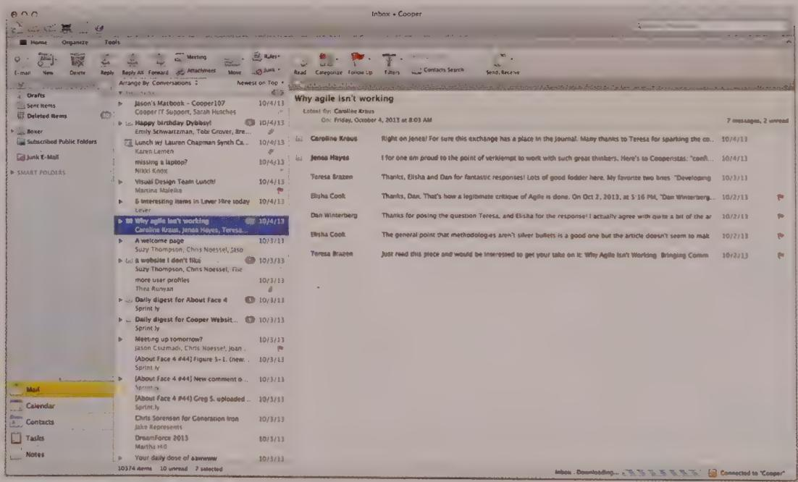  
Figure 9-1: Microsoft Outlook is a classic example of a sovereign-posture application. It stays onscreen, interacting with the user for long, uninterrupted periods, and with its multiple adjacent panes for navigation and supporting information, it begs to take up the full screen.

# Target intermediate users

Because people typically devote time and attention to using sovereign applications, they often have a vested interest in progressing up the learning curve to become intermediate users, which we'll discuss in detail in Chapter 11. Each user spends time as a novice, but only a short period of time relative to the amount of time he will eventually spend using the product. Certainly a new user has to get over the initial learning curve. But seen from the perspective of the entire relationship between the user and the product, the time he spends getting acquainted with the application is small.

From the designer's point of view, this often means that the application should be optimized for use by intermediates and not be aimed primarily at beginners (or experts). Sacrificing speed and power in favor of a clumsier but easier-to-learn idiom is out of place here, as is providing only sophisticated power tools. Of course, if you can offer easier or more powerful idioms without compromising the interaction for intermediate users, that is often best. In any case, the sort of user you're optimizing for is determined by your choice of primary persona and your understanding of his or her attitudes, aptitudes, and use contexts.

Between first-time users and intermediate users, many people use sovereign applications only occasionally. These infrequent users cannot be ignored. However, the success of a sovereign application is still dependent on its intermediate, frequent users until someone else satisfies both them and inexperienced users. WordStar, an early word processing application, is a good example. It dominated the word processing marketplace in the late '70s and early '80s because it served its intermediate users exceedingly well, even though it was extremely difficult for infrequent and first-time users. WordStar Corporation thrived until its competition offered the same power for intermediate users while simultaneously making the application much less painful for infrequent users. WordStar, unable to keep up with the competition, rapidly dwindled to insignificance.

# Be generous with screen real estate

Because the user's interaction with a sovereign application dominates his session at the computer, the application shouldn't be afraid to take up as much screen real estate as possible. No other application will be competing with yours (beyond the occasional transient notification and communication apps), so don't waste space, but also don't be shy about taking what you need to do the job. If you need four toolbars to cover the bases, use four toolbars. In an application of a different posture, four toolbars may be overly complex, but the sovereign posture has a defensible claim on the pixels.

In most instances, sovereign applications run maximized. In the absence of explicit instructions from the user, your sovereign application should default to maximized or full-screen presentation. The application needs to be fully resizable and must work well in other screen configurations, but the interface should be optimized for full-screen use, instead of the less common cases.

DESIGN PRINCIPLE

Optimize sovereign applications for full-screen use.

# Use a minimal visual style

Because users will stare at a sovereign application for long periods, you should take care to mute the colors and texture of the visual presentation. Keep the color palette narrow and conservative. Big colorful controls may look really cool to newcomers, but they seem garish after a couple of weeks of daily use. Tiny dots or accents of color will have more effect in the long run than big splashes, and they enable you to pack controls and information more tightly than you otherwise could.

DESIGN PRINCIPLE

Sovereign interfaces should feature a conservative visual style.

The user will stare at the same palettes, menus, and toolbars for many hours, gaining an innate sense of where things are from sheer familiarity. This gives you, the designer, freedom to do more with fewer pixels. Toolbars and their controls can be smaller than normal. Auxiliary controls such as screen splitters, rulers, and scrollbars can be smaller and more closely spaced.

# Provide rich visual feedback

Sovereign applications are a great platform for creating an environment rich in visual feedback for users. You can productively add extra bits of information to the interface. A status bar at the bottom of the screen, the ends of the space normally occupied by scrollbars, the title bar, and other dusty corners of the product's visible components can be filled with visual indications of the application's status, the data's status, the system's state, and hints for more productive user actions. However, while enriching the visual feedback, you must be careful not to create an interface that is hopelessly cluttered.

The first-time user won't even notice such artifacts, let alone understand them, because of the subtle way they are shown on the screen. After a period of steady use, however, he will begin to see them, wonder about their meaning, and experimentally explore them. At this point, the user will be willing to expend a little effort to learn more. If you provide an easy means for him to find out what the artifacts are, he will become not only a better user but also a more satisfied user. His power over the application will grow with his understanding. Adding such richness to the interface is like adding a variety of ingredients to soup stock—it enhances the entire meal. We discuss this idea of rich visual modeless feedback in Chapter 15.

# Support rich input

Sovereign applications similarly benefit from rich input. Every frequently used aspect of the application should be controllable in several ways. Direct manipulation, keyboard mnemonics, and keyboard accelerators are all appropriate (see Chapter 18). You can make more aggressive demands on the user's fine motor skills with direct-manipulation idioms. Sensitive areas on the screen can be just a couple of pixels across, because you can assume that the user is established comfortably in his chair, arm positioned in a stable way on his desk, rolling the mouse firmly across a resilient mouse pad.

DESIGN PRINCIPLE

Sovereign applications should exploit rich input.

Go ahead and use the corners and edges of the application's window for controls. In a jet cockpit, the most frequently used controls are situated directly in front of the pilot. Those needed only occasionally or in an emergency are found on the armrests, overhead, and side panels. In Word for Mac, Microsoft has put the most frequently used functions at the top of the window, as shown in Figure 9-2. Microsoft also put visually dislocating functions on small controls near the bottom of the screen. These controls change the appearance of the entire visual display—Draft View, Outline View, Publishing layout View, Print Layout View, Notebook Layout View, and Focus View. Neophytes do not often use them and, if accidentally triggered, they can be confusing. Placing them near the bottom of the screen makes them almost invisible to new users. Their segregated positioning subtly and silently indicates that they should be used with caution. More experienced users, with more confidence in their understanding of and control over the application, will begin to notice these controls and wonder about their purpose. They can experimentally select them when they feel fully prepared for the consequences. This is an accurate and useful mapping of control placement to usage.

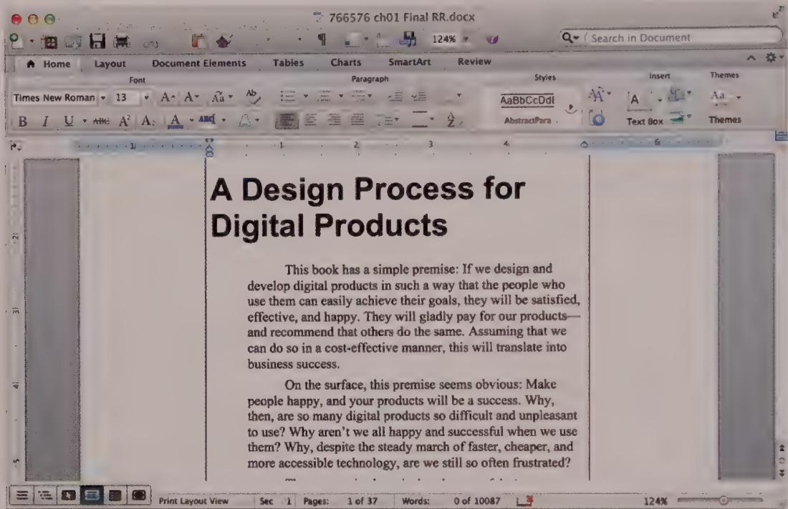  
Figure 9-2: Microsoft Word has placed controls at both the top and bottom of the application. The controls at the bottom are used to change views and are appropriately segregated because they can cause significant visual dislocation.

# Design for documents

The dictum that sovereign applications should fill the screen is also true of document windows within the application itself. Child windows containing documents should always be maximized inside the application unless the user explicitly instructs otherwise, or the user needs to simultaneously work in several documents to accomplish a specific task.

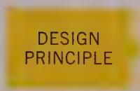

Maximize document views within sovereign applications.

Many sovereign applications are also document-centric. In other words, their primary functions involve creating and viewing documents containing rich data. This makes it easy to believe that the two are always correlated, but this is not the case. If an application

manipulates a document but performs only a single, simple function, such as scanning an image, it isn't a sovereign application and shouldn't exhibit sovereign behavior. Such single-function applications have a posture of their own—the transient posture.

# Transient posture

A product with a transient posture comes and goes, presenting a single function with a constrained set of accompanying controls. The application is invoked when needed, appears, performs its job, and then quickly leaves, letting the user continue her normal activities, usually with a sovereign application.

The defining characteristic of a transient application is its temporary nature. Because it doesn't stay on the screen for extended periods of time, users don't get the chance to become very familiar with it. Consequently, the product's user interface should be obvious and helpful, presenting its controls clearly and boldly with no possibility of confusion or mistakes. The interface must spell out what it does. This is not the place for artistic-but-ambiguous images and icons. It is the place for big buttons with precise legends spelled out in a large, easy-to-read typeface.

DESIGN PRINCIPLE

Transient applications must be simple, clear, and to the point.

Although a transient application can certainly operate alone on your desktop, it usually acts in a supporting role to a sovereign application. For example, calling up Files Explorer in Windows to locate and open a file while editing another with Word is a typical transient scenario. So is setting your speaker volume. Because the transient application borrows space at the expense of the sovereign, it must respect the sovereign by not taking up more space onscreen than is absolutely necessary.

In cases when the entire computer system is fulfilling a transient role in the real world, it is not necessarily appropriate to minimize the use of pixels and visual attention. Examples of this include process monitors in a fabrication environment, or digital imaging systems in an operating room. Here, the entire computer screen is referred to in a transient manner, while the user is engaged in a sovereign mechanical activity. In these cases, it is still critical for information to be obvious and easily understood from across the room. This clearly requires a bolder use of color and a more generous allotment of real estate, as shown in Figure 9-3.

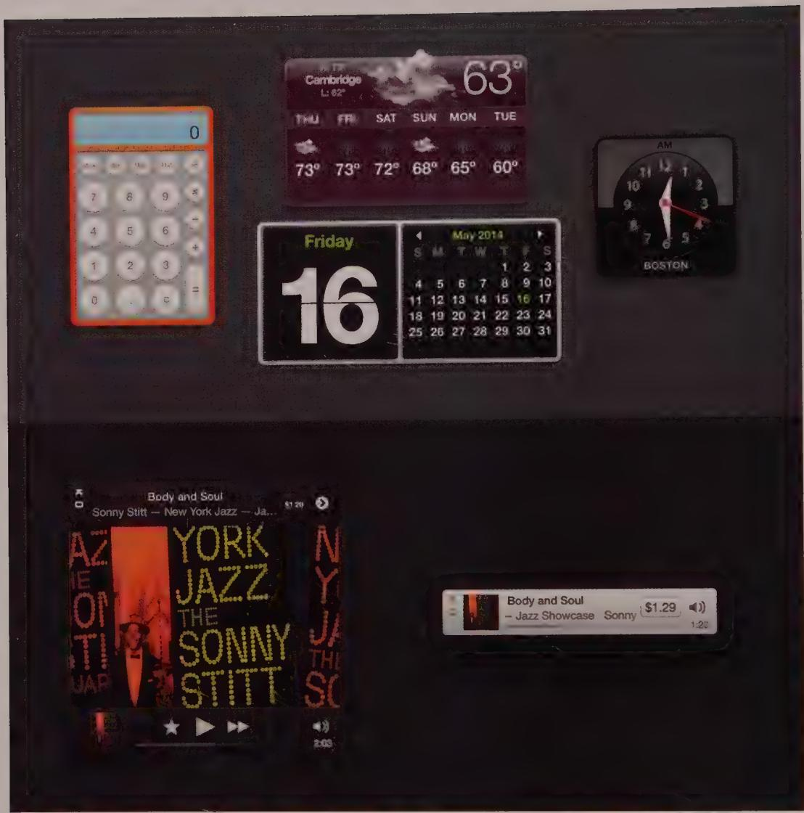  
Figure 9-3: OS X Dashboard widgets and the iTunes Miniplayer are good examples of transient applications. They are referred to or interacted with briefly before the user's attention turns to an activity in a sovereign application. The use of rich dimensional rendering gives them an appropriate amount of visual gravity.

# Make it bright and clear

Although a transient application must conserve the total amount of screen real estate it consumes, the controls on its surface can be proportionally larger than those on a sovereign application. More forceful visual design on a sovereign application would pall within a few weeks, but the transient application isn't onscreen long enough for it to bother the user. On the contrary, bolder graphics help users to orient themselves more quickly when the application pops up.

Transient applications should have instructions built into their surface. The user may see the application only once a month and will likely forget the meanings and implications of the choices presented. Instead of having a button labeled "Setup," it's better to make the button large enough so that it can be labeled "Set up user preferences." The verb/object construction results in a more easily comprehensible interface, and the results of clicking the button are more predictable. Likewise, nothing should be abbreviated on a transient application, and feedback should be direct and explicit to avoid confusion. For example, the user should be easily able to understand that the printer is busy, or that a piece of recently recorded audio is 5 seconds long.

# Keep it simple

After the user summons a transient application, all the information and facilities he needs should be right there on the surface of the application's single window. Keep the user's attention on that window. Don't force him into supporting subwindows or dialog boxes to take care of the application's main function. If you find yourself adding a dialog box or second view to a transient application, that's a key sign that your design needs a review.

DESIGN PRINCIPLE

Transient applications should be limited to a single window and view.

Transient applications are not the place for tiny scrollbars and fussy mouse interactions. Keep demands on the user's fine motor skills to a minimum. Simple pushbuttons for simple functions are good. Direct manipulation can also be effective, but anything that can be directly manipulated must be discoverable and big enough to interact with easily. You can provide keyboard shortcuts, but they must be simple, and all important functions should also be visible on the interface.

Of course, rare exceptions to the monothematic nature of transient applications sometimes occur. If a transient application performs more than just a single function, the interface should communicate this visually and unambiguously and provide immediate access to all functions without the addition of windows or dialogs. One such application is the Art Directors Toolkit by Code Line Communications, shown in Figure 9-4. It performs a number of different calculator-like functions useful to users of graphic design applications.

Keep in mind that a transient application will likely be called on to help manage some aspect of a sovereign application (as shown in Figure 9-4). This means that the transient application, as it is positioned on top of the sovereign, may obscure the very information that it is chartered to work on. This implies that the transient application must be movable, which means it must have a title bar or other obvious affordance for dragging.

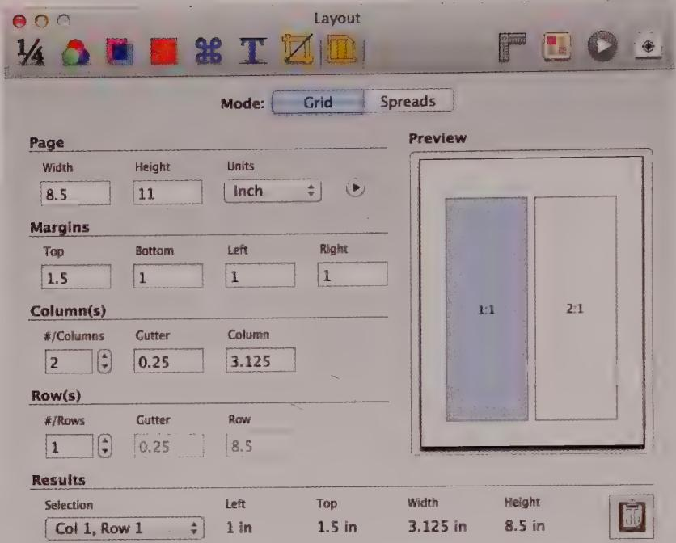  
Figure 9-4: Art Directors Toolkit by Code Line Communications is a transient application. It provides a number of discrete functions such as calculating dimensions of a layout grid. These functions are designed to support the use of a sovereign layout application such as Adobe InDesign. The many functions are organized into tabs and are directly accessible at all times.

It is vital to keep the amount of management overhead as low as possible with transient applications. All the user wants to do is perform a specific function or get a certain piece of information, and then move on. It is unreasonable to force the user to add nonproductive window-management tasks to this interaction.

# Remember user choices

The most appropriate way to help users with both transient and sovereign apps is to give the applications a memory. If a transient application remembers where it was the last time it was used, that same size and placement probably will be appropriate next time, too. These settings will almost always be more suitable than any default setting might happen to be. Whatever shape and position the user left the application in should be the shape and position the application reappears in when it is next summoned. Of course, this holds true for its logical settings, too.

No doubt you have already realized that most dialog boxes behave very much like transient applications. Therefore, the preceding guidelines for transient applications apply equally well to the design of dialog boxes. (Chapter 21 covers dialogs in more detail.)

# Daemonic posture

Applications that normally do not interact with the user are daemonic-posture applications. These applications serve quietly and invisibly in the background, performing vital tasks without the need for human intervention. A printer driver and network connection are excellent examples.

As you might expect, any discussion of the user interface of daemonic applications is necessarily short. Whereas a transient application controls the execution of a function, daemonic applications usually manage processes. Your heartbeat isn't a function that must be consciously controlled; rather, it is a process that proceeds autonomously in the background. Like the processes that regulate your heartbeat, daemonic applications generally remain invisible, competently performing their process as long as your computer is turned on. Unlike your heart, however, daemonic applications must occasionally be installed and removed, and, also occasionally, they must be adjusted to deal with changing circumstances. It is at these times that a daemon talks to the user (or vice versa). Without exception, the interaction between the user and a daemonic application is transient in nature, and all the imperatives of transient application design hold true here also.

The principles of transient design that are concerned with keeping users informed of an application's purpose and of the scope and meaning of the available choices become even more critical with daemonic applications. In many cases, users are unaware of the existence of the daemonic application. If you recognize that, it becomes obvious that reports about status from that application can be disconcerting if not presented with great attention to clarity. Because many of these applications perform esoteric functions—such as printer drivers—the messages from them must not confuse users or lead to misunderstandings.

A question that is often taken for granted with applications of other postures becomes very significant with daemonic applications: If the application normally is invisible, how should the user interface be summoned on those rare occasions when it is needed? Windows 8 Desktop represents these daemons with icons on the right side of the taskbar. (OS X does something similar on the right side of the menu bar.) Putting icons onscreen

when they are almost never needed leads to useless visual clutter. Daemonic icons should be employed persistently only if they provide continuous and useful status information. Microsoft solved this problem by hiding daemonic icons that are not actively being used to report status or access functionality in a pop-up menu, as shown in Figure 9-5.

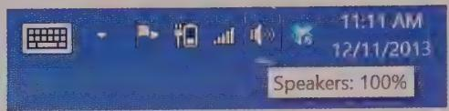  
Figure 9-5: The status area of the taskbar in Windows 8. The speaker icon provides modeless visual status information, because the icon changes if the speaker's volume is low or muted. Hovering over the icon provides more information and clicking or right-clicking it provides access to the volume and other audio controls. To the right of the speaker icon, the Dropbox icon modelessly indicates that Dropbox is automaticallyyncing its desktop folder.

Both Mac OS and Windows also employ control panels as an effective approach to configure daemonic applications. These user-activated transient applications give users a consistent place to go to configure daemons. It is also important to provide direct, inline access to daemonic applications anytime an issue with them prevents someone from accomplishing what he aims to. (Of course, the standard disclaimer apply: Don't interrupt users unnecessarily.) For example, if a taskbar icon indicates a problem with a printer, clicking that icon should provide a mechanism to troubleshoot and rectify the problem.

# Postures for the Web

The advent of the World Wide Web was initially both a boon and a curse for interaction designers. For perhaps the first time since the invention of graphical user interfaces, corporate decision makers began to understand and adopt the language of user-centered design. On the other hand, the limitations and challenges of web interactivity, which were the natural results of its historical evolution, set back interaction design by nearly a decade. However, since the publication of the third edition of this book, the web has become a much friendlier place for the kind of rich interactions (such as drag and drop or gestures) that were long possible only in native desktop applications.

Today's websites can be grouped into three basic categories that in a way recapitulate the development of web technology: informational websites, transactional websites, and web applications. Each of these types has its own postural considerations. As with many of the categorizations we offer in this book, the lines between them can be indistinct.

Think of them as representing a spectrum on which any website or web application can be located.

# Informational website posture

Web browsers were originally conceived of as a way to view shared and linked documents without the need for cumbersome data transfer utilities like File Transfer Protocol (FTP), Gopher, and Archie. The early web was made up of sequential or hierarchical sets of these documents (web pages), collectively called websites. In essence, these were places for users to go to get information. In this book we call these informational websites to distinguish them from the more interactive web-delivered services that came later. From an interaction standpoint, informational websites consist of a navigation model to take users from one page to another, as well as a search facility to provide more goal-directed location of specific pages.

Although informational websites hark back to the early web of the 1990s, plenty of them still exist, in the form of personal sites, corporate marketing and support sites, and information-centric intranets. Wikipedia is the number 5 site in the world, and is an informational website. In such sites, the dominant design concerns are the visual look and feel, layout, navigational elements, and site structure (information architecture). Findability, a term coined by Peter Morville, is an apt way to describe the biggest design issue for informational websites in a nutshell: the ease of finding specific information held within them.

# Balancing sovereign and transient

Sites that are purely informational, that require no complex transactions beyond navigating from page to page and limited searching, must balance two forces: the need to display a reasonable density of useful information, and the need to allow first-time and infrequent users to learn and navigate the site easily. This implies a tension between sovereign and transient attributes in informational sites. Which stance is more dominant depends largely on who the target personas are and what their behavior patterns are when they use the site: Are they infrequent or one-time users, or are they repeat users who will return weekly or daily to view content?

The frequency with which content is updated on a site influences this behavior in some respects: Informational sites with real-time information naturally will attract repeat users more than a site updated once a month. Infrequently updated sites may be used more for occasional reference (assuming that the information is not too topical) rather than for heavy repeat use and thus should be given more of a transient stance than a sovereign one. What's more, the site can configure itself into a more sovereign posture by paying attention to how often a particular user visits.

# Sovereign attributes

Detailed information display is best accomplished by assuming a sovereign stance. By assuming full-screen use, designers can take advantage of all the space available to clearly present the information as well as navigational tools and wayfinding cues to keep users oriented.

The only fly in the ointment of sovereign stance for the web is choosing which full-screen resolution is appropriate. (To a lesser degree, this is an issue for desktop applications, although it is easier for creators of desktop software to dictate the appropriate display.) Web designers need to decide early on what resolution they will optimize the screen designs for. You can use a "responsive" approach to flexibly display content in a variety of browser window sizes, with interfaces that can even scale smoothly between the many variants of mobile and desktop screen size. However, your designs should be optimized for the most common display sizes used by your primary (and sometimes secondary) persona. Quantitative research is helpful in determining this: Among people similar to your personas, how many are still using $800 \times 600$ -pixel displays?

# Transient attributes

The less frequently your primary personas access the site, the more transient a stance the site needs to take. In an informational site, this manifests itself in terms of ease and clarity of navigation and orientation.

Because users might bookmark sites that they use infrequently for reference, you should make it possible for them to bookmark any page of information so that they can reliably return to it later.

Users likely will visit sites that are updated weekly to monthly only intermittently, so navigation on such sites must be particularly clear. It's beneficial if these sites can retain information about past user actions via cookies or server-side methods and present information that is organized based on what interested the user previously. This can help less-frequent users find what they need with minimal navigation. (This assumes that the user is likely to return to the same content on each visit to the site.)

Mobile web access may also point toward a transient posture. Mobile users are likely multitasking and have limited time and cognitive resources to get the information they seek. Mobile versions of your site need to streamline navigation and eliminate verbiage, allowing users to rapidly find what they are looking for. Responsive techniques allow a website to be rendered for desktop or handheld screens, but you must take great care with the navigation and information flow.

<!-- Chunk 5 End -->

<!-- Chunk 6 Start -->

# Transactional website posture

More and more websites go beyond simple clicking and searching to offer transactional functionality that allows users to accomplish something beyond acquiring information. Classic examples of transactional websites are online storefronts and financial services sites, as shown in Figure 9-6.

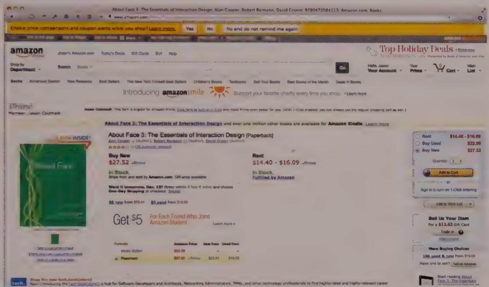  
Figure 9-6: Amazon is the classic example of a transactional e-commerce website. It was one of the first, and most successful, of its kind.

These typically are structured in a hierarchical page-based manner, similar to an informational website, but in addition to informational content, the pages contain functional elements with complex behaviors. In the case of the online store, these functional elements include the shopping cart, the checkout features, and the ability to save a user profile. Some shopping sites have more sophisticated and interactive tools as well, such as "configurators," which allow users to customize or choose options related to their purchases.

Transactional sites must, like informational sites, strike a balance between sovereign and transient stances. In fact, many transactional sites have a significant informational aspect. For example, online shoppers like to research and compare products or investments. During these activities, users are likely to devote significant attention to a single site. But in some cases, such as comparison shopping, they are also likely to bounce among several sites. For these types of sites, navigational clarity is very important, as are access to supporting information and efficient transactions.

Search engines like Google search and Bing are a special kind of transactional site designed to provide navigation to other websites, as well as access to aggregated news and information from a variety of sources. Performing a search and navigating to resulting sites is a transient activity, but the information aggregation aspects of a portal like Yahoo! sometimes require a more sovereign stance.

The transient aspects of users' experiences with transactional sites make it especially important that users not be forced to navigate more than necessary. It may be tempting to break information and functions into several pages to reduce load time and visual complexity (both of which are good objectives). But also consider the potential for confusion and click fatigue on the part of your audience. Jared Spool's usability firm, User Interface Engineering, conducted a landmark usability study in 2001 of user perception of page load times for e-commerce sites. The results confirmed that user perception of load time is more closely correlated to whether the user can achieve his or her goals than to actual page load times.1

Designing transactional websites requires attention to information architecture for content and page organization and attention to interaction design for the creation of appropriate behaviors for the more functional elements. Visual design must serve both of these ends. It also must effectively communicate key brand attributes. This is often particularly important considering the commercial nature of most transactional sites.

# Web application posture

Web applications are heavily interactive and exhibit complex behaviors in much the same way that robust desktop applications do. While some web applications maintain a page-based navigation model, these pages are more analogous to views than they are to web documents. A few of these applications are still bound by the archaic server query/response model, which requires users to manually "submit" each state change. However, technology now supports robust asynchronous communication with the server and local data caching. This allows an application delivered through a browser to behave in much the same way as a networked desktop application.

Here are some examples of web applications:

- Enterprise software, ranging from old-school SAP interfaces duplicated in a browser to contemporary collaborative tools such as Salesforce.com and 37signals' Basecamp   
- Personal publishing and sharing tools, including blogging software such as WordPress, photo-sharing software such as Flickr, and, cloud storage such as Dropbox   
- Productivity tools such as Zoho Docs and the Google Docs suite   
- Social software, such as Facebook and Google+   
Web-based streaming media apps such as Hulu, Pandora, and Rdio

Web applications like these are presented to users very much like desktop applications that happen to run inside a browser window. There's little penalty for this, as long as the interactions are carefully designed to reflect the technology constraints (since even rich web interactions still don't always match the capabilities of desktop apps). These applications can act as replacements for sovereign desktop apps, but they also can be employed for infrequently used functionality for which the user may not want to go to the trouble of installing a dedicated executable.

It can be challenging to design and deliver sophisticated interactions that work across a number of different browsers and browser versions. Nonetheless, the web platform is an excellent means of delivering tools that enable and facilitate collaboration. In addition, it can be of significant value to allow people to effortlessly access the same data and functionality from the cloud, one of the core strengths of web applications.

# Sovereign web applications

Web applications, much like desktop applications, can have sovereign or transient posture. But because we use the term to refer to products with complex and sophisticated functionality, by definition they tend toward sovereign posture.

Sovereign web applications strive to deliver information and functionality in a manner that best supports more-complex human activities. Often this requires a rich and interactive user interface. A good example of such a web application is Proto.io, shown in Figure 9-7. This online interactive prototyping service offers tasks such as drag-and-drop assembly of prototypes using a library of interactive objects and behavior specification tools, in-place editing for text labels, and other direct manipulation tools. Other examples of sovereign web applications include enterprise software and engineering tools, such as Jira, delivered through a browser.

Unlike page-oriented informational and transactional websites, the design of sovereign web applications is best approached in the same manner as desktop applications. Designers also need a clear understanding of the medium's technical limitations and what the development organization can reasonably accomplish on time and within budget. Like sovereign desktop applications, most sovereign web applications should be full-screen applications, densely populated with controls and data objects. They also should make use of specialized panes or other screen regions to group related functions and objects. Users should have the feeling that they are in an environment, not that they are navigating from page to page or place to place. Redrawing and re-rendering information should be minimized (as opposed to the behavior on websites, where almost any action requires a full redraw).

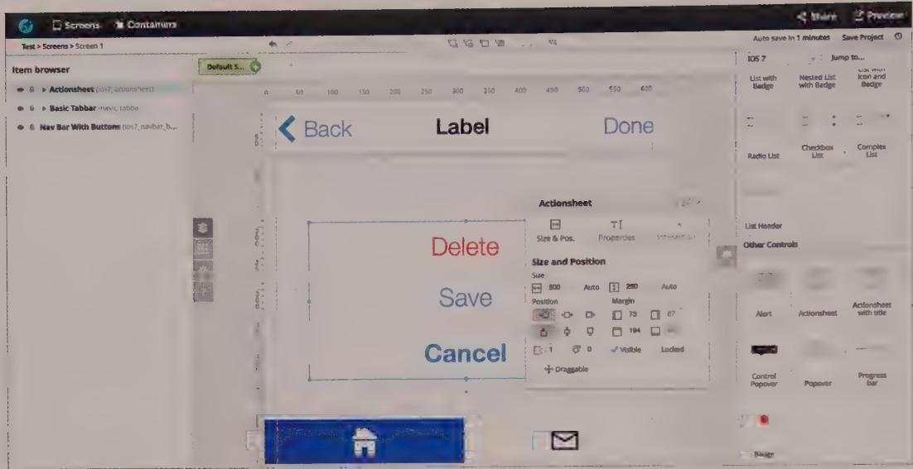  
Figure 9-7: Proto.io's web-based interactive prototyping environment is as rich and refined as many desktop authoring environments, featuring drag-and-drop assembly and direct manipulation of all interactive objects.

Treating sovereign web applications as desktop applications rather than as collections of web pages has a benefit. It allows designers to break out of the constraints of page-oriented models of browser interaction to address the complex behaviors that these client-server applications require. Websites are effective places to get information you need, just as elevators are effective places to get to a particular floor in a building. But you don't try to do actual work in elevators. Similarly, users are not served by being forced to attempt to do real, interaction-rich transactional work using page-based websites accessed through a browser.

# Transient web applications

Delivering enterprise functionality through a browser-based user interface has one particular advantage. If done correctly, it can give users better access to occasionally used information and functionality without requiring them to install every tool they may need on their computers. Whether it is a routine task that is performed only once a year to file taxes or the occasional generation of an ad hoc report, transient web applications aim to accomplish just this.

When designing transient web applications, as with all transient applications, it is critical to provide clear orientation and navigation. Also keep in mind that one user's transient application may be another user's sovereign application. Think hard about how compatible the two users' needs are. An enterprise web application often serves a wide range of personas and requires multiple user interfaces accessing the same set of information.

# Postures for Mobile Devices

Since the publication of the third edition of About Face, a sea change in the world of personal computing has occurred. New and exceptionally powerful mobile devices with high-resolution displays and capacitive multi-touch input technology have become the mainstream platform of choice, converging functionality and integrating into people's lives like no interactive devices before them. Constraints of form factor, new and gestural forms of input, and dynamic, on-the-go use contexts all provide unique challenges for designers and unique considerations for application posture.

# Smartphone and handheld posture

Handheld devices present special challenges for interaction designers. Because they are designed specifically for mobile use, these devices must be small, lightweight, economical in power consumption, ruggedly built, and easy to hold and manipulate in busy, distracting situations. Especially for handhelds, close collaboration among interaction designers, industrial designers, developers, and mechanical engineers is a real necessity. Of particular concern are size and clarity of display, ease of input and control, and sensitivity to context.

Functionally and posturally speaking, handheld devices have gone through a steep evolutionary curve in the past decade. Prior to the iPhone, handheld devices were characterized by small, low-resolution screens with input and navigational mechanisms that can be categorized as awkward at best. Even the best in class of these devices, the Palm Treo (the direct descendant of the groundbreaking Palm Pilot), suffered from a small, low-resolution, and rudimentary (by current standards) touchscreen. It also only moderately successfully integrated hardware navigation and touch input controls. Such devices also had rudimentary and cumbersome ecosystems for updating or adding applications to the device. This tended to result in their use being limited primarily to their default app suite.

However, that all changed with the introduction of the iPhone and Android smartphones, which together heralded the dawn of a new era of standalone on-the-go computing.

# Satellite posture

In the early days of PDAs, media players, and phone-enabled communicators, handheld devices were best designed as satellites of desktop computer systems. Palm and early Windows Mobile devices both succeeded best as portable extensions of the desktop geared primarily toward accessing and viewing information and providing only lightweight input and editing features. These devices were optimized for viewing (or playing) data loaded from desktop systems, and they included a means ofSyncing handheld

data with desktop data. As cloud storage and services have become mainstream, these devices have replaced wired desktopSyncing with wireless cloudsyncing.

Satellite posture, then, emphasizes retrieving and viewing data. It uses as much of the limited screen real estate available on the device as possible to faithfully display content authored on or loaded from the desktop. Controls are limited to navigating and viewing data or documents. Some devices with satellite posture may have an onscreen keyboard, but these usually are small and are designed for brief and infrequent use.

Satellite posture is less common these days than convergence handheld devices. Since the advent of the iPhone and its competitors, these have become tiny, full-fledged computers in their own right. However, satellite posture is still the model for dedicated content-oriented devices such as digital cameras, highly portable dedicated e-readers like the e-ink Kindles (see Figure 9-8), and what remains of the dedicated digital audio and video player market, such as the iPod Nano. Applications on convergence devices that are focused on content navigation and/or playback may adopt what is essentially a satellite posture.

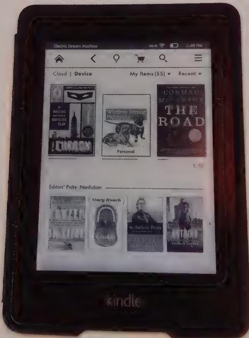  
Figure 9-8: Amazon's Kindle is a good example of a satellite posture device. It is used almost exclusively to view content (e-books) that has been purchased andynced from the cloud. Previous-generation satellite posture devices relied onyncing to a desktop computer to retrieve their data. The Kindle was one of the first to provide directyncing with a cloud service.

One new development for satellite devices is the advent of wearable computing. Wristwatch and eyeglass format devices typically pair with a standalone convergence device via Bluetooth or other wireless connections, and provide notifications and other contextual information via small touchscreens or heads-up displays and voice commands. These devices take a highly transient posture, providing just enough information and possible actions to be relevant in the moment. The Samsung Gear smart watch and Google Glass are excellent examples of this new and rapidly evolving breed of satellite posture devices (see Figure 9-9).

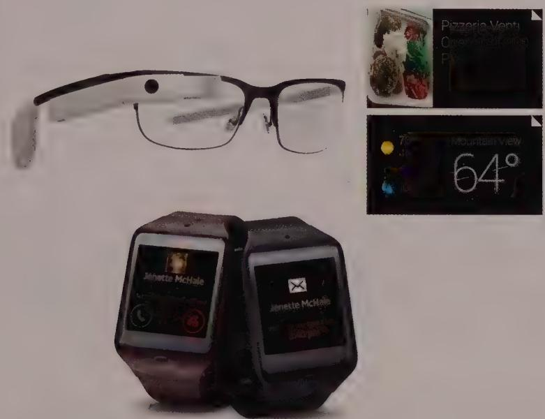  
Figure 9-9: The new frontier of wearable computing is represented by a new generation of satellite devices, such as the Samsung Gear smart watch and Google Glass. These devices provide succinct information and the minimum set of options necessary to support activity in a completely on-the-go context.

# Standalone posture

Beyond its innovations in gestural computing, the iPhone almost singlehandedly transformed cellular smartphones into handheld general-purpose computing devices. The iPhone's large, ultra-high-resolution screen with multi-touch input resulted in a new posture for handheld apps, which we'll call standalone posture.

Standalone posture applications share some attributes with both sovereign and transient applications. Like sovereign applications, they are full-screen and sport functions accessible via menus (often through a left or right swipe gesture) and toolbars placed along the top or bottom of the screen. Also like sovereign applications, standalone

applications can include transient, modal, dialog-like screens or pop-ups, most of which should be used to configure settings or confirm destructive actions.

Like transient applications, standalone handheld applications make relatively little use of comparatively larger controls and text, due to limitations with legibility and finger-based input on multi-touch screens. Standalone apps for handhelds, like transient apps, need to be self-explanatory. The on-the-go nature of handheld app usage means that most people will use a wide variety of apps for relatively brief sessions over any given period of time. People may bounce between e-mail, instant messaging, social media, weather, news, phone, shopping, and media playback apps over only a few hours—or even minutes.

The telephone apps in modern smartphones also behave transiently. Users place their call as quickly as possible and then abandon the interface in favor of the conversation (and, on phone carriers that support it, other apps while the call takes place). The best interface for a phone is arguably nonvisual, especially when used in an automobile. Voice activation such as that offered by Apple's Siri service or Google's Android OS is perfect for placing a call; the more transient the phone's interface, the better.

# Tablet device posture

After Apple transformed the smartphone from clumsy satellite device to standalone handheld computer/convergence media device, it successfully applied the same multitouch and high-resolution display technology to the larger page-sized tablet form factor. The larger-format (more than 9 inches) high-resolution tablets such as the iPad have more than enough real estate to support true sovereign-posture apps, though the limitations of hand inputs have their own real-estate challenges. Keynote for iPad is able to support desktop-style presentation authoring on a touchscreen tablet, as shown in Figure 9-10.

Seven-inch tablets, especially those with a 16-by-9 aspect ratio, such as the Google Nexus 7 and the Amazon Kindle Fire HD, live in an awkward dimensional space between smaller handheld form factors and larger tablets. List-oriented views are uncomfortably wide, while grid views with more than two rows or columns (depending on orientation) seem cramped. Designers should be sure not to treat 7-inch tablets like oversized phones when designing their layout.

Specific platform issues aside, tablets for the most part enforce the sovereign quality of their apps; the popular tablet operating systems permit only full-screen applications. These sovereign apps often have scrollable or zoomable main content views, with top, bottom, or side toolbars or palettes. They are similar to their desktop brethren in concept but are more sparse and simplified in execution, as shown in Figure 9-11.

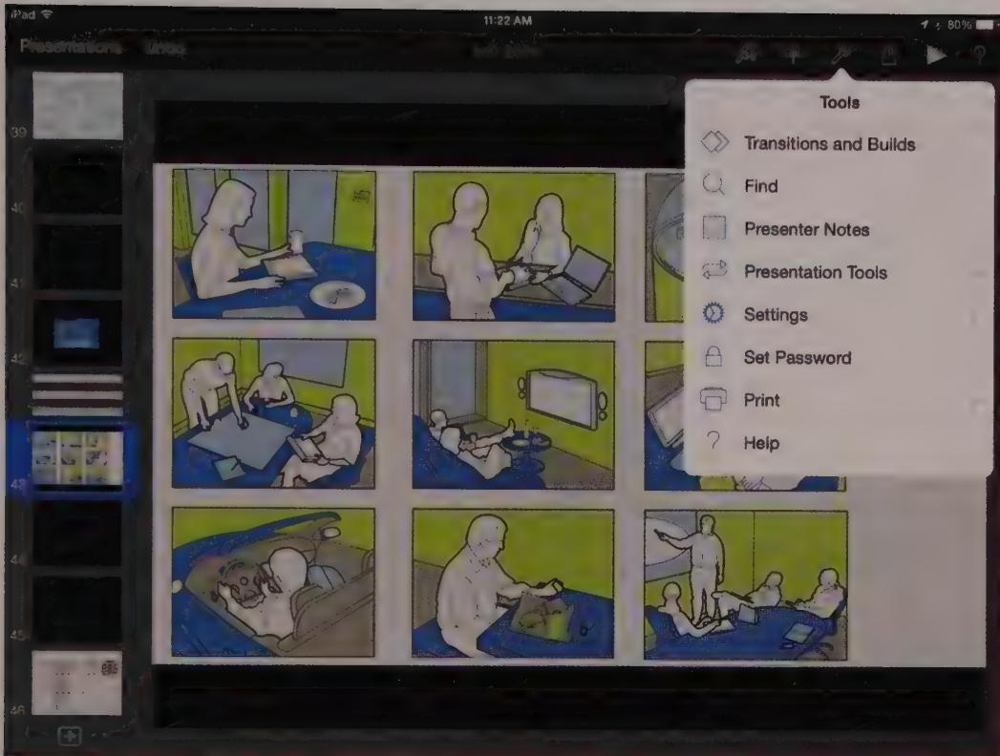  
Figure 9-10: Keynote for iPad is a sovereign-posture, iOS version of Apple's presentation software for the Mac. It has functions equivalent to its desktop cousin.

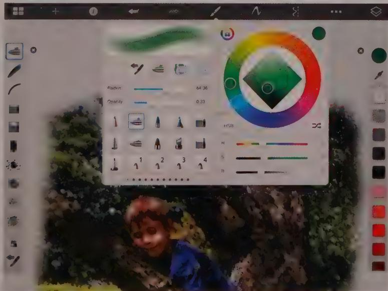  
Figure 9-11: Adobe Sketchbook Pro is a drawing and painting app on the iPad. It supports a zoomable main drawing area, along with a top toolbar, and hideable tool palettes on the left and right.

Android tablets support the concept of widgets—transient-posture micro-apps that access the functionality of an installed sovereign app without bringing it into the foreground. Users may position these widgets on a special home screen for easy access to things like weather, stock reports, or music playback controls. Windows Surface, shown in Figure 9-12, has a similar concept called tiles. They can contain active content from an installed sovereign app, but not controls, providing similar transient-posture access to content only.

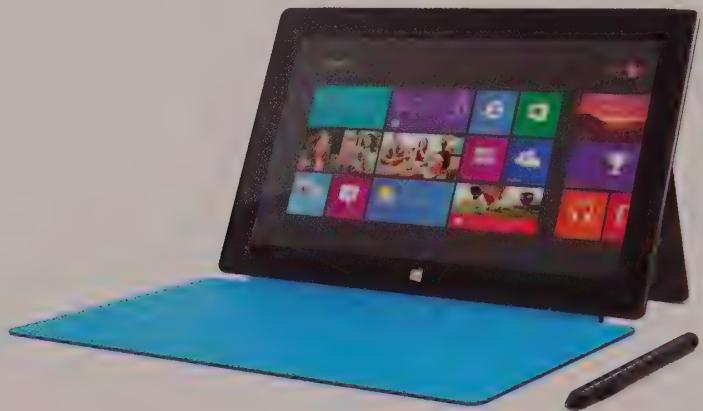  
Figure 9-12: Windows Surface supports tiles containing dynamic content.

# Postures for Other Platforms

Unlike software running on a computer, which has the luxury of being fairly immersive if need be, interaction design for mobile and public contexts requires special attention to creating an experience that coexists with the noise and activity of the real world happening all around the product. Kiosks and other embedded systems, such as TVs, household appliances, automobile dashboards, cameras, ATMs, and laboratory equipment, are unique platforms with their own opportunities and limitations. Without careful consideration, adding digital smarts to devices and appliances runs the risk that they will behave more like desktop computers than like the products your users expect and desire.

# Kiosk posture

Kiosks are interactive systems at a specific location available for use by the public. Kiosks exist for wayfinding in malls, purchasing tickets on public transportation, checking-in at airports, self-checkout in grocery stores, and even ordering meals at some take-out restaurants. The large, full-screen nature of kiosks would appear to bias them toward sovereign posture, but there are several reasons why the situation is not quite that simple. First, users of kiosks often are first-time users (with some obvious exceptions, such as ATM users and users of ticket machines for public transport) and usually are not daily users. Second, most people do not spend a significant amount of time in front of a kiosk:

They perform a simple transaction or search, get the information they need, and move on. Third, most kiosks employ either touchscreens or bezel buttons to the side of the display, and neither of these input mechanisms supports the high data density you would expect of a sovereign application. Fourth, kiosk users rarely are comfortably seated in front of an optimally placed monitor. Instead, they stand in a public place with bright light and many distractions. These user behaviors and constraints should bias most kiosks toward transient posture, with simple navigation; large, colorful, engaging interfaces with clear affordances for controls; and clear mappings between hardware controls (if any) and their corresponding software functions. As in the design of handhelds, floating windows and dialogs should be avoided; any such information or behavior is best integrated into a single, full screen (as in sovereign-posture applications). Kiosks thus tread an interesting middle ground between the two most common desktop postures.

Because transactional kiosks often guide users through a process or set of information screen by screen, contextual orientation and navigation are more important than global navigation. Rather than helping users understand where they are in the system, help them understand where they are in their process. It's also important for transactional kiosks to provide escape hatches that allow users to cancel transactions and start over at any point.

DESIGN PRINCIPLE

Kiosks should be optimized for first-time use.

Educational and entertainment kiosks vary somewhat from the strict transient posture required of more transactional kiosks. In this case, exploring the kiosk environment is more important than completing single transactions or searches. In this case, more data density and more complex interactions and visual transitions sometimes can be introduced to positive effect. But the limitations of the input mechanisms need to be respected, lest the user lose the ability to successfully navigate the interface.

# "Ten-foot" interface posture

Ten-foot, i.e. television and console gaming, interfaces offer an interesting posture variant. In some ways, they resemble the satellite posture of content browsing mobile touch-screen applications. For instance, as in multi-touch mobile UIs, navigation typically is both horizontal and vertical, with content options organized into grids, and with filtering and navigation options frequently available at the top or left. The primary difference is, of course, that the touchscreen's direct swipe and tap gestures are replaced with the five-way D-pad interaction of an infrared or Bluetooth remote control.

In one respect this is a big difference: It introduces the need for a current-focus item. Current focus needs to be obvious in a ten-foot UI so that the user always knows where he is and where he can go next.

The PlayStation 4 is a good example of how 10-foot UIs can use a layout similar to tablet UIs. Large buttons and simple left-right or up-down navigation, with at most 2 columns is the norm (see Figure 9-13). Seeing this screen out of context, you might believe it was from a multi-touch app.

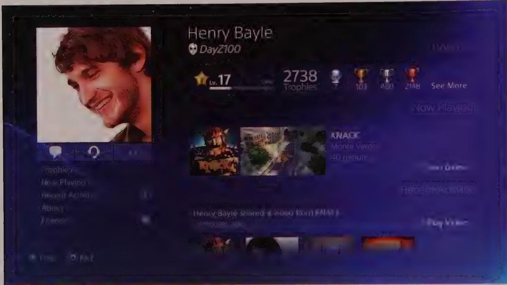  
Figure 9-13: The PlayStation 4 UI bears more than a passing resemblance to a touchscreen tablet app, and for good reason. Despite the differences in input mechanism, navigation is rather similar between 10-foot UIs and many content-browsing multi-touch tablet apps.

# Automotive interface posture

Automotive interfaces resemble kiosks in terms of posture. Typically they are touchscreens, but frequently they include hardware bezel buttons that encircle the screen area and thus are almost predisposed to transient interactions. Unlike kiosks, users are seated, but similar to kiosks, users typically attempt one relatively simple transaction at a time if they are also driving. Automotive interfaces, of course, have the additional constraint that they must be of minimal distraction to the driver, since keeping control of the vehicle and avoiding harm are always the primary tasks. The transaction with the system is secondary at best. At the same time, the same system should be available for focused use by a passenger if one is present.

For entertainment, HVAC control, and settings changes, automotive interfaces are transient in the way we would expect: large controls and simple screens. But navigation interfaces may take more of a sovereign stance. The interface will persist for the duration of the trip, which could be hours or even days. (Most navigation systems remember their state even if the car has been turned off to get gas or parked overnight at a hotel along the route.) Also, relatively complex information must be displayed.

Automotive navigation interfaces focus on rich, dynamic content. Map and current route information take center stage. A host of ancillary information is located in the periphery of the screen, such as the road's name, the time, the arrival time, the distance to the destination, the distance to the next turn, and the direction of the next turn. Although this kind of information hierarchy is more typical of a sovereign-posture interface, it must in the case of an automotive system be designed more like a transient UI: clear, simple, and readable at a glance.

An impressive and beautiful—but perhaps a bit worrisome—exception to the typical automotive interface is the Tesla Model S infotainment interface, shown in Figure 9-14. It sports a single 17-inch multi-touch screen with adjustable panes for simultaneous navigation, entertainment, and HVAC controls. The interface resembles a tablet's interactive posture much more than it does a kiosk's. Perhaps this is the wave of the future. If so, we hope new cars will also include active accident avoidance systems to counteract any driver distraction that might occur as a result of such large and information-rich interactive displays on the dashboard.

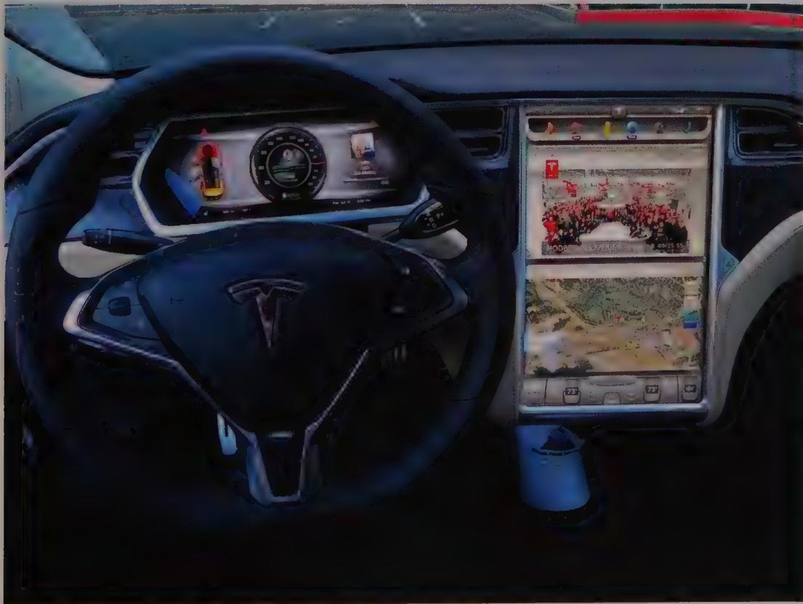  
Figure 9-14: The Tesla Model S infotainment interface is impressive in both its size and level of interactivity. Its 17-inch multi-touch screen allows navigation, entertainment, and HVAC functions to be displayed simultaneously. This system bears more of a postural resemblance to a tablet than to a kiosk, as is more typical for automotive info systems.

# Smart appliance posture

Most appliances have simple displays and rely heavily on hardware buttons and dials to manipulate the appliance's state. In some cases, however, "smart" appliances (notably, washers and dryers) most often sport color LCD touchscreens allowing rich output and direct input, as shown in Figure 9-15.

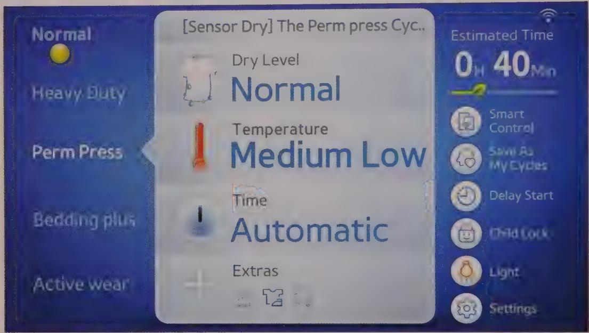  
Figure 9-15: This Samsung washing machine has a well-designed color touchscreen display, with a clear and simple navigational structure.

Appliance interfaces usually are transient-posture interfaces. Users of these interfaces seldom are technology-savvy and therefore should be presented with the most simple and straightforward interface possible. These users are also accustomed to hardware controls. Unless an unprecedented ease of use can be achieved with a touchscreen, dials and buttons (with appropriate tactile, audible, and visual feedback via a view-only display or even hardware lamps) may be a better choice. Many appliance makers make the mistake of putting dozens of new—and unwanted—features into their new, digital models. Instead of making things easier, that "simple" LCD touchscreen becomes a confusing array of unworkable controls.

Another reason for a transient stance in appliance interfaces is that users of appliances need to accomplish something very specific. Like users of transactional kiosks, they are uninterested in exploring the interface or getting additional information. They simply want to put the washer on normal cycle or cook their food.

One aspect of appliance design demands a different posture. Status information indicating what cycle the washer is on or what the DVR is set to record should be presented as a daemonic icon, providing minimal status quietly in a corner. If more than minimal status is required, an auxiliary posture for this information becomes appropriate.

# Give Your Apps Good Posture

In conclusion, it's important to remember that the top-level patterns of posture and platform should be among the first decisions to be made in the design of an interactive product. In our experience, many poorly designed products suffer from the failure to make these decisions consciously at any point. Rather than diving directly into the details, take a step back and consider what technical platform and behavioral posture will best meet the needs of your users and business. Also consider the possible implications of these decisions on detailed interactions.

Notes

1. Perfetti and Landesman, 2001

