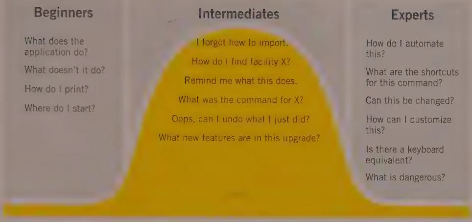

# OPTIMIZING FOR INTERMEDIATES

Most users of technology know all too well that buying a new digital appliance or downloading a new software app often means several days of frustration while learning a new interface. On the other hand, many experienced users of digital products may find themselves frustrated because that product treats them like beginners. It seems impossible to find the right balance between catering to the needs of the first-timer and the needs of the expert.

One of the eternal conundrums of digital product development is how to address the needs of both beginning users and expert users with a single, coherent interface.

Left to their own devices, developers typically create interactions suitable for experts. Developers are by necessity experts on the features they build, and they tend to consider the presentation of each function in the interface as having equal weight. (From a coding and debugging standpoint, they are all of approximately equal weight, because they all need to operate bug-free.)

Marketing departments, on the other hand, typically demand interactions suitable only for beginners. They spend much of their time demonstrating and selling their product to people unfamiliar with it, so over time they get a biased view of user behavior and feature priority. They demand that the training wheels get bolted on. Both of these approaches lead to a frustrating experience for the majority of users, who are neither beginners nor experts.

Some developers and designers try to have it both ways, choosing to segregate these two experiences by creating wizards for beginners and burying critical functionality for experts deep in nested menus or multilayered dialog boxes. Many nonbeginners don't want to deal with the extra time and effort associated with moving step by step through a wizard each time they access a feature. But the leap from there to knowing what esoteric command to select from a set of lengthy menus is like jumping off a cliff into a shark-infested moat of implementation-model design.

DESIGN PRINCIPLE

Don't weld on training wheels.

What, then, is the answer? The solution to this predicament lies in a different understanding of how users master new concepts and tasks.

# Perpetual Intermediates

Most users, for most of the time they are using a product, are neither beginners nor experts; instead, they are intermediates.

The experience level of people performing an activity tends, like most population distributions, to follow the classic statistical bell curve (see Figure 10-1). For almost any activity requiring knowledge or skill, if we graph the number of people against skill level, a relatively small number of beginners are on the left side, a few experts are on the right, and the majority—intermediate users—are in the center.

Statistics don't tell the whole story, however. The bell curve is a snapshot of many users across time. Although most intermediates tend to stay in that category, the beginners do not remain beginners for very long. The difficulty of maintaining a high level of expertise also means that experts come and go rapidly, but beginners change even more rapidly. Both beginners and experts tend over time to gravitate toward intermediacy.

Although everybody spends some minimum time as a beginner, nobody remains in that state for long. People don't like to be incompetent, and beginners, by definition, are learning to be competent. Conversely, learning and improving are rewarding, so beginners become intermediates very quickly—or they drop out. All skiers, for example, spend time as beginners, but those who find they don't rapidly progress beyond more-falling-than-skiing quickly abandon the sport. The rest soon move off the bunny slopes onto the regular runs. Only a few ever make it onto the double black diamond runs for experts.

  
Figure 10-1: The demands that users place on digital products vary considerably with their experience.

DESIGN PRINCIPLE

Nobody wants to remain a beginner.

Most occupants of the beginner end of the curve either migrate to the center bulge of intermediates or drop off the graph and find some product or activity in which they can migrate into intermediacy. Most users thus remain in a perpetual state of adequacy, striving for fluency, with their skills ebbing and flowing like the tides, depending on how frequently they use the product. Larry Constantine first identified the importance of designing for intermediates, and in his book Software for Use (Addison-Wesley, 1999), he calls such users improving intermediates. We prefer the term perpetual intermediates, because although beginners quickly improve to become intermediates, they seldom go on to become experts.

DESIGN PRINCIPLE

Optimize for intermediates.

Most users in this middle state would like to learn more about the product but usually don't have the time. Occasionally, the opportunity or need to do so arises. Sometimes these intermediates use the product extensively for weeks at a time to complete a big project. During this time, they learn new things about the product. Their knowledge grows beyond its previous boundaries.

Other times, however, they do not use the product for months at a time and forget significant portions of what they knew. When they return to the product, they are not beginners, but they need reminders to jog their memory.

Given that most users are intermediates, how do we design products that meet their needs but don't leave beginners or advanced users out in the cold?

# Inflecting the Interface

Many popular ski resorts have a gentle slope for learning and a few expert runs to really challenge the serious skier. But if the resort wants to stay in business, it will cater to the perpetual intermediate skier without scaring off the beginner or insulting the expert. The beginner must find it easy to graduate into the world of intermediacy, and the expert must not find his vertical runs obstructed by aids for cautious or conservative intermediates.

A well-balanced user interface should take the same approach. It doesn't cater to beginners or to experts, but rather devotes the bulk of its efforts to satisfying perpetual intermediates. At the same time, it provides mechanisms so that both of its smaller constituencies can be effective. We can accomplish the same in our digital products via a process of inflection.

Reflecting an interface means organizing it to minimize typical navigation within the interface. In practice, this means placing the most frequently desired functions and controls in the most immediate and convenient locations, such as toolbars or palettes. Less frequently used functions are pushed deeper into the interface, where users won't stumble over them. Advanced features that are less often used but have a big payoff for users can be safely tucked away in menus, dialog boxes, or drawers, where they can be accessed only when needed.

