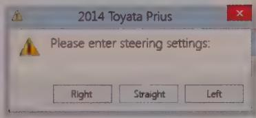
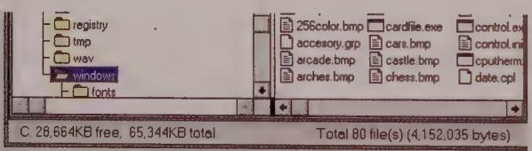
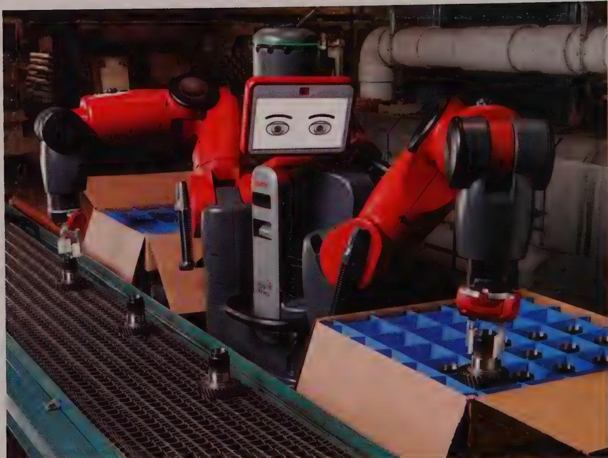

# Orchestration

To a novelist, there is no such thing as a "good" sentence in isolation from the story being told. No rules govern how sentences should be constructed to be transparent. It all depends on what the protagonist is doing, or what effect the author wants to create. The writer knows not to insert an obscure word in a particularly quiet and sensitive passage, lest it sound like a sour note in a string quartet. The same goes for software. The interaction designer must train himself to hear sour notes in the orchestration of software interaction. It is vital that all the elements in an interface work together coherently toward a single goal. When an application's communication with a person is well orchestrated, it becomes almost invisible.

Webster defines orchestration as "harmonious organization," a reasonable phrase for what we should expect from interactive products. Harmonious organization doesn't yield to fixed rules. You can't create guidelines like "Four buttons on a thumb-driven mobile menu is good" and "Six buttons on a thumb-driven mobile menu is too many." Yet it is easy to see that a thumb-driven menu with 35 buttons wouldn't work. The major difficulty with such analysis is that it treats the problem in vitro. It doesn't take into account the problem being solved; it doesn't take into account what a person is doing at the time or what he is trying to accomplish.

# Harmonious Interactions

Although no universal rules define a harmonious interaction (just as no universal rules define a harmonious interval in music), we've found the following strategies to be effective for designing interactions that go with the user's flow:

- Follow users' mental models.   
Less is more.   
- Let users direct rather than discuss.   
- Provide choices rather than ask questions.   
- Keep necessary tools close at hand.   
- Provide modeless feedback.   
Design for the probable but anticipate the possible.   
Contextualize information.   
Reflect object and application status.   
- Avoid unnecessary reporting.   
- Avoid blank slates.   
- Differentiate between command and configuration.   
- Hide the ejector seat levers.   
- Optimize for responsiveness but accommodate latency.

# Follow users' mental models

We introduced the concept of user mental models in Chapter 1. Different people have different mental models of a given activity or process, but they rarely imagine them in terms of the detailed mechanics of how computers function. Each user naturally forms a mental image of how the software performs its task. The mind looks for some pattern of cause and effect to gain insight into the machine's behavior.

For example, in a hospital information system, the physicians and nurses have a mental model of patient information that derives from how they think about patients and treatment. It therefore makes the most sense to find patient information by using patient names as an index. Each physician has certain patients, so it makes additional sense to filter the patients in the clinical interface so that each physician can choose from a list of his or her own patients, organized alphabetically by name. On the other hand, in the hospital's business office, the clerks there are worried about overdue bills. They don't initially think about these bills in terms of who or what the bill is for, but rather in terms of how late the bill is (and perhaps how big it is). Thus, for the business office interface,

it makes sense to sort first by time overdue and perhaps by amount due, with patient names as a secondary organizational principle.

# Less is more

For many things, more is better. In the world of interaction design, the contrary is usually true. We should constantly strive to reduce the number of elements in user interfaces without reducing the capabilities of the products we are creating and without increasing the effort it takes to use them. To do this, we must do more with less; this is where careful orchestration becomes important. We must coordinate and control the product's power without letting the interface become a gaggle of screens and widgets, covered with a scattering of unrelated and rarely used controls.

It is common for user interfaces of professional and business software to be complex but not very powerful. Products like this typically segregate functionality into silos and allow the user to perform a single task without providing access to related tasks. When the first edition of this book was published in 1995, this problem was ubiquitous. Something as common as a Save dialog in a Windows application failed to allow users to also rename or delete the files they were looking at. The users had to go to a different place to accomplish these very similar tasks, ultimately requiring applications and operating systems to provide more interface. Thankfully, contemporary operating systems are much better at this sort of thing. Because they have started to offer appropriate functionality based on the user's context, users are less often required to shuffle off to various places in the interface to accomplish simple and common tasks.

However, we have a rather long way to go. In the enterprise software we see, each function or feature is often housed in a separate dialog or window, with little consideration for how people must use these functions together to accomplish something. It is not uncommon for a user to use one menu command to open a window to find a bit of information, copy that information to the clipboard, and then use a different menu command for a different window, merely to paste that bit of information into a field. Not only is this procedure inegant and crude, but it is also error-prone and fails to capitalize on a productive division of labor between humans and machines. Typically, products don't end up this way on purpose. They have been built either in an ad hoc manner over years or by several disconnected teams in different organizational silos.

Motorola's once popular Razr V3 flip-phone was an example of this problem. Although the phone's industrial design was deservedly award-winning for its elegance, the software was inherited from a previous generation of Motorola phones and appeared to have been developed by multiple teams who didn't coordinate their efforts. For example, the phone's address book used a different text-entry interface than its calendar application. Each software team must have devised a separate solution, resulting in two interfaces doing the job that one should have done. This was both a waste of development resources

and a source of confusion and friction for Motorola's users. A year after the V3 reached the height of its popularity, the iPhone, with its modern, well-considered user interface arrived, and the V3 and all their flip-phone brethren were soon history. Tight integration of the complete hardware and software experience finally won the day.

Mullet and Sano's classic Designing Visual Interfaces (Prentice Hall, 1994) includes a useful discussion of the idea of elegance, which can be thought of as a novel, simple, economical, and graceful way of solving a design problem. Because the software inside an interactive product is typically complex, it becomes all the more important to value elegance and simplicity; these attributes are crucial for technology to effectively serve human needs.

A minimalist approach to product design is inextricably tied to a clear understanding of purpose—what the user of a product is trying to accomplish using the tool. Without this sense of purpose, interactive products are just a disorganized jumble of technological capabilities. A model example where a strong sense of purpose has driven a minimal user interface is the classic Google search interface, shown in Figure 11-1. It consists of a text field, two buttons (Google Search, which takes the user to a list of results, and I'm Feeling Lucky, which takes the user directly to the top result), the Google logotype, and a couple of links to the broader universe of Google functionality. Another good example of a minimal user interface is the iPod Shuffle. By carefully defining an appropriate set of features to meet a specific set of user needs, Apple created a highly usable product with one switch and five buttons (and no screen!). Still another example is iA Writer, an incredibly simple iOS text editor app. It doesn't have much of a user interface other than an area in which to write text. The text is saved automatically, eliminating the need to interact with files.

  
Figure 11-1: The celebrated Google search interface is a classic example of minimalist interface design, where every screen element is purposeful and direct.

It's worth noting that the quest for simplicity can be taken too far; reduction is a balancing act that requires a good understanding of users' mental models. The iPod Shuffle's

interface, an example of elegance and economy in design, is also at odds with some users' expectations. If you come from the world of CD players, or even the high-resolution screens of most other digital audio players, it probably feels a bit weird to use the iPod's Play/Pause toggle to shut off the device and the Menu button to turn it on. This is a classic case of visual simplicity leading to cognitive complexity. In this situation, these idioms are simple enough to learn easily, and the consequences of getting it wrong are fairly small, so the product's overall success hasn't been affected much.

Stick to "less is more" to keep out of your users' way and keeping them in flow.

# Let users direct rather than discuss

Some developers might imagine that the ideal user interface is a two-way conversation between human and machine. However, most people don't see it that way. Most people would rather interact with the software in the same way they interact with, say, their cars. They open the door and get in when they want to go somewhere. They step on the accelerator when they want the car to move forward and the brake when it's time to stop. They turn the wheel when they want the car to turn.

This ideal interaction is not a dialogue—it's more like using a tool. When a carpenter hits nails, he doesn't discuss the nail with the hammer; he directs the hammer onto the nail. In a car, the driver gives the car direction when he wants to change the car's behavior. The driver expects direct feedback from the car and its environment in terms appropriate to the device: the view out the windshield, the readings on the various gauges on the dashboard, the sound of rushing air and tires on pavement, and the feel of lateral g-forces and vibration from the road. The carpenter expects similar feedback: the feel of the nail sinking, the sound of steel striking steel, and the shifting weight as the hammer recoils.

The driver certainly doesn't expect the car to interrogate him with a dialog box, nor would a carpenter appreciate the dialog shown in Figure 11-2 if it appeared on his hammer.

  
Figure 11-2: Nobody wants to be scolded, particularly by a machine. If we guide our machines in a dunderheaded way, we expect to get a dunderheaded response. Sure, they can protect us from fatal errors, but scolding isn't the same thing as protecting.

One of the reasons interactive products often aggravate people is that they don't act enough like cars or hammers. Instead, they have the temerity to try to engage us in a dialogue—to inform us of our shortcomings and to demand answers. From the user's point of view, the roles are reversed: The person should do the demanding, and the software should do the answering. One of the most important ways of letting the users direct the action in an interface is direct manipulation. We'll discuss this at length in Chapter 13.

# Provide choices rather than ask questions

Dialog boxes (confirmation dialogs in particular) ask questions. Toolbars and palettes offer choices. The confirmation dialog stops the proceedings, demands an answer, and doesn't leave until it gets what it wants. Toolbars and palettes, on the other hand, are always there, quietly and politely offering their wares like a well-appointed store, giving you the luxury of selecting what you want with just a flick of your finger.

Choices are important, but there is a difference between being free to make choices based on presented information and being interrogated by the application in modal fashion. Users would much rather direct their software the way they direct their automobiles down the street. Automobiles offer drivers sophisticated choices without once issuing a dialog box. Imagine the situation shown in Figure 11-3.

  
Figure 11-3: Imagine if you had to steer your car by clicking buttons on a dialog box! This dialog box gives you some idea of how normal people feel about the dialog boxes in your software.

Not only is directly manipulating a steering wheel a more appropriate idiom for communicating with your car, but it also puts you in the superior position, directing your car where it should go. Modeless choices help give users the feeling of control and mastery they want when using digital products.

# Keep necessary tools close at hand

Most desktop applications are too complex for one mode of interaction to cover all their features. Consequently, many applications offer users a palette of tools. These tools are actually different modes of behavior that the product enters. Offering tools is a compromise with complexity, but we can still do a lot to make tool selection and manipulation

easy and to prevent it from disturbing flow. Mainly, we must ensure that information about tools and application state is clear and present and that transitions between tools are quick and simple.

Tools should be close at hand, commonly on palettes or toolbars for beginner and intermediate users and accessible by keyboard command for expert users. This way, the user can see them easily and can select them with a single click or keystroke. If the user must divert his attention from the application to search out a tool, his concentration will be broken. It's as if he had to get up from his desk and wander down the hall to find a pencil. Also, he should never have to put tools away.

# Provide modeless feedback

When users of an interactive product manipulate tools and data, it's usually important to clearly present the status and effect of these manipulations. This information must be easy to see and understand without obscuring or interfering with the user's actions. Feedback of progress is one of the key elements of flow.

An application has several ways to present information or feedback to users. One egregious way done on the desktop is to pop up a dialog box. This technique is modal: It puts the application into a special state that must be dealt with before it can return to its normal state and before the person can continue with her task. A better way to inform users is with modeless feedback.

Feedback is modeless whenever information for users is built into the structures of the interface and doesn't stop the normal flow of activities and interaction. In Microsoft Word 2010, shown in Figure 11-4, you can see what page you are on, what section you are in, how many pages are in the current document, and what position the cursor is in—modelessly. You just have to look at the left navigation pane and status bar at the bottom of the screen. You don't have to go out of your way to ask for that information.

Another good example is the iOS notification center, which displays a brief heads up alert when an app that isn't currently active on the screen has an important event to report, such as an upcoming appointment. The message stays at the top of the screen for a few seconds, and then disappears, and tapping it while it is displayed takes you to the notifying app.

Jet fighters have a heads-up display, or HUD, that superimposes the readings of critical instrumentation onto the forward view of the cockpit's windscreen. The pilot doesn't even have to use peripheral vision; she can read vital gauges while keeping her eyes on the opposing fighter. Applications can use the edges of the display screen to show users

information about activity in the main work area. Many drawing applications, such as Adobe Photoshop, already provide ruler guides, thumbnail maps, and other modeless feedback in the periphery of their windows. We further discuss rich modeless feedback in Chapter 15.

  
Figure 11-4: In Word 2010, Microsoft lets you see what page you are on, the number of total pages, and the number of words in the document displayed modelessly on the lower-left edge of the window. Clicking on the word count opens the Word Count dialog, which provides more detailed information.

# Design for the probable but anticipate the possible

Superfluous interaction, usually in the form of a dialog box, often slips into a user interface. This is often the result of an application being faced with a choice— developers tend to resolve choices from the standpoint of logic, and this carries over to their software design. To a logician, if a proposition is true 999,999 times out of a million and is false one time, the proposition is false—that's how Boolean logic works. However, to the rest of us, the proposition is overwhelmingly true. The proposition has a possibility of being false, but the probability of its being false is minuscule to the point of irrelevancy. One of the most potent methods for better orchestrating your user interfaces is segregating the possible from the probable.

Developers tend to view possibilities as being the same as probabilities. For example, the user can decide to end the application and save his work, or end the application and discard the document he has been working on for the last six hours. Either of these choices is possible. The probability that this person will discard his work is at least a thousand to one against, yet the typical application always includes a dialog box asking the user if he wants to save his changes, like the one shown in Figure 11-5.

This dialog box is inappropriate and unnecessary. How often do you choose to abandon changes you make to a document? This dialog is tantamount to your spouse telling you not to spill soup on your shirt every time you eat. We'll discuss the implications of removing this dialog in Chapter 14.

  
Figure 11-5: This is easily the most unnecessary dialog box in the world of GUI. Of course we want to save our work! It is the normal state of events. Not saving it would be out of the ordinary and would be worthy of a dialog, but not this.

Developers are judged by their ability to create software that handles the many possible, but improbable, conditions that crop up inside complex logical systems. This doesn't mean, however, that they should render that readiness to handle offbeat possibilities directly into a user interface. This sort of thing runs counter to a user's expectations and interrupts their flow by asking them to accommodate the possibility. Dialogs, controls, and options that are used a hundred times a day should not sit side by side with dialogs, controls, and options that are used once a year or never.

You might get hit by a bus, but you probably will get to work safely this morning. You don't stay home out of fear of the killer bus, so don't let what might possibly happen alter how you treat what almost certainly will happen in your interface.

# Contextualize information

How an application chooses to represent information is another thing that can confuse or overwhelm normal humans. One area frequently abused is the representation of quantitative, or numeric, information. If an application needs to show the amount of free space on disk, it could do what the ancient Windows 3.0 File Manager did: give you the exact number of free bytes, as shown in Figure 11-6.

  
Figure 11-6: The old Windows 3.0 File Manager took great pains to report the exact number of bytes used by files on the disk. Did this precision help us understand if we needed to clear space on the disk? Wouldn't a visual representation that showed disk usage in a proportional manner be more meaningful? Luckily, Windows now employs bar and pie charts to indicate disk usage.

In the lower-left corner, the application tells us the number of free bytes and the total number of bytes on the disk. These numbers are hard to read and interpret. With billions of bytes of disk storage, it ceases to be important to us just how many hundreds are left, yet the display rigorously shows us down to the kilobyte. But even while the application is telling us the state of our disk with precision, it is failing to communicate. What we really need to know is whether the disk is getting full, or whether we can add a new 20 MB application and still have sufficient working room. These raw numbers, precise as they are, do little to help us make sense of the facts, and pull us out of flow as we try and figure out what's really happening.

Visual information design expert Edward Tufte says that quantitative presentation should answer the question "Compared to what?" Knowing precisely how many bytes are free on your hard disk is less useful than knowing that it is 22 percent of the disk's total capacity. Another Tufte dictum is "Show the data (visually)," rather than simply telling about it textually or numerically.

A bar or pie chart showing the used and unused portions would make it much easier to comprehend the scale and proportion of hard disk use. The numbers shouldn't go away entirely, but they should be relegated to the status of labels on the display and not be the display. They should also be shown with more reasonable and consistent precision. The meaning of the information could be shown visually; the numbers would merely add support. Today, this is exactly what is shown in Windows Explorer. Unfortunately, this useful info is shown in only one place, rather than as a persistent status indicator at the bottom of all Explorer windows. And, unfortunately, the problem persists in lots of other applications.

# Reflect object and application status

When someone is asleep, he usually looks asleep. When someone is awake, he looks awake. When someone is busy, he looks busy: His eyes are focused on his work, and his body language is closed and preoccupied. When someone is unoccupied, he looks unoccupied: His body is open and moving; his eyes are willing to make contact. People not only expect this kind of subtle feedback from each other, they also depend on it to maintain social order.

These sorts of cues are important enough that they became a core part of the user interface of Baxter, a two-armed stationary industrial robot created by Rethink Robotics (see Figure 11-7), whose founder, Rodney Brooks, also invented the Roomba vacuuming robot. Baxter is designed to work alongside humans on a light manufacturing line. It features a large, face-like screen with cartoonish animated eyes that can look in a direction before reaching the destination. It reports system status via simple and universal facial expressions.

  
Figure 11-7: Baxter is a two-armed industrial robot designed to work alongside humans in a light manufacturing production line. It communicates status using facial expressions.

While they probably should not be anthropomorphized as fully as Baxter, our day-to-day software applications and devices should provide similar clues. When an application is asleep, it should look asleep. When an application is awake, it should look awake. When it's busy, it should look busy. When the product is engaged in some significant internal action like performing a complex calculation and connecting to a database, it should be obvious to us that it won't be quite as responsive as usual. When the app is sending a large file, we should see a modeless progress bar. This lets the user plan their next steps accordingly.

Similarly, the status of user interface objects should be apparent to users. Most e-mail applications do a good job of making it obvious which messages have not been read and which have been responded to or forwarded. Let's take this concept a step further. Wouldn't it be great if, when you were looking at events in the day or week views of Microsoft Outlook or Google Calendar, you could tell how many people had agreed to attend and how many hadn't responded yet (either right inline or via ToolTip) without drilling down into the details?

Application and object state is best communicated using forms of rich modeless feedback, briefly discussed earlier in this chapter. More detailed examples of rich modeless feedback may be found in Chapter 15.

# Avoid unnecessary reporting

Some applications are quick to keep users apprised of the details of their progress even though the user has no idea what to make of this information. Applications pop up notifications telling us that connections have been made, that records have been posted, that users have logged on, that transactions were recorded, that data has been transferred, and other useless factoids. To software engineers, these messages are equivalent to the humming of the machinery: They indicate that all is well. In fact, they probably were used while debugging the application. To a normal person, however, these reports can feel like eerie lights beyond the horizon, screams in the night, or unattended objects flying about the room.

For users, it is disconcerting and distracting to know all the details of what is happening under normal conditions. Nontechnical people may be alarmed to hear that the database has been modified, for example. It is better for the application to simply do what has to be done, issue reassuring (and modeless) visual or auditory feedback when all is well, and not burden users with the trivia of how it was accomplished. It is important that we not stop the proceedings to report normalcy. If you must use them, reserve notifications for events that are outside the normal course of events. If your users benefit from knowing things are running smoothly, use some more ambient signal.

