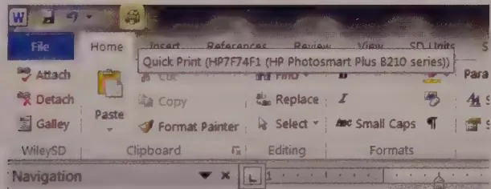
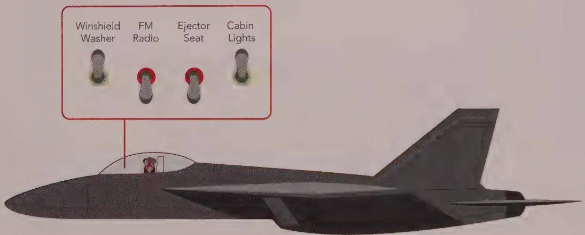
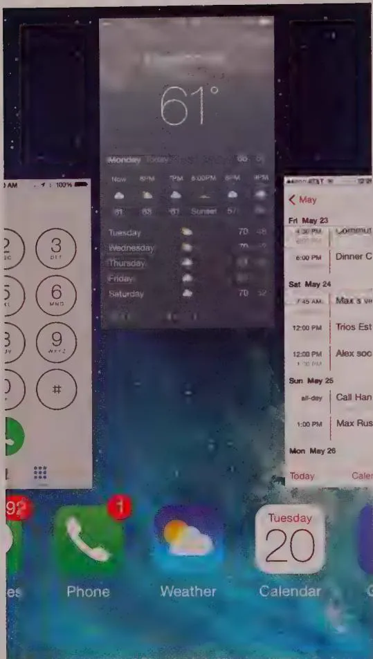

# DESIGN PRINCIPLE

Don't use dialogs to report normalcy.

By the same token, don't stop the proceedings and bother the user with minor problems. If the application is having trouble creating a connection to a server, don't put up a dialog box to report it. Instead, build a status indicator into the application so that the problem is clear to the interested user but is unobtrusive to someone who is busy elsewhere.

# Avoid blank slates

The key to orchestrating a user interaction is to take a goal-directed approach. You must ask yourself whether a particular interaction moves a person effectively and confidently toward his goal. Timid applications are reluctant to carry out any forward motion without someone's directing them in advance. But most people would rather see the application take a "good enough" first step and then manually tweak it to what is desired. This way, the application moves the person closer to his goal.

It's easy to assume nothing about what your users want, instead asking a bunch of questions up front to help determine what they want. How many applications have you seen that start by asking a bunch of questions upfront? Or that punt every decision to a litany of user options? But normal people—rather than "expert users"—sometimes are incapable of or uncomfortable with explaining what they want to do to an interactive product, especially in advance. They would much rather see what the application thinks is right and then manipulate that to make it exactly right. In most cases, your application can make a fairly correct assumption based on the designer's estimation, past experience with this user, or by reference to most other users.

For example, when you create a new document in PowerPoint, on the PC, the application creates a blank document with preset attributes rather than opening a dialog that asks you to specify every detail. Omnigraffle on the Mac does a less adequate job, asking you to choose the base style for a new presentation each time you create one. Both applications could do better by remembering frequently and recently used styles or templates and making those the defaults for new documents.

Just because we use the word think in conjunction with an interactive product doesn't mean that the software needs to be particularly intelligent (in the human sense) and must try to determine the right thing to do by reasoning. Instead, the software should simply do something that has a probability of being correct. Then it should provide the user with powerful tools for shaping that first attempt, instead of merely giving the user a blank slate and challenging him to have at it. This way, the application doesn't ask for permission to act, but rather for forgiveness after the fact.

Ask for forgiveness, not permission.

For most users, a blank slate is a difficult starting point. It's much easier to begin where someone else has left off. They can easily fine-tune an approximation provided by the application into precisely what he wants with less risk of exposure and mental effort than he would have by drafting it from nothing. As we discussed in Chapter 8, endowing your application with a good memory is the best way to accomplish this.

# Differentiate between command and configuration

Another problem crops up frequently whenever users invoke functions with many parameters. The problem comes from the lack of differentiation between a function and the configuration of that function. If you ask an application to perform a function by itself, the application should simply do it using a reasonable default or its last configuration. It should not interrogate you about precise configuration details each time it is

used. To express different or more precise demands to the application, you would launch the configuration interface for that function.

For example, when you ask many applications to print a document, they respond by launching a complex dialog box demanding that you specify how many copies to print; what the paper orientation is; what paper feeder to use; what margins to set; whether the output should be in monochrome or color; what scale at which to print; whether to use PostScript fonts or native fonts; whether to print the current page, the current selection, or the entire document; and whether to print to a file and, if so, what to name that file. All these options are useful, but all we want is to print the document, and that is all we thought we asked for.

More reasonable designs have one command to print and another command for print setup. The print command issues a dialog but just goes ahead and prints, using either previous settings or standard settings. The print setup function offers all those choices about paper and copies and fonts. Some applications allow the user to go directly from the configure dialog to printing, or vice-versa.

  
Figure 11-8: The Quick Print control in Microsoft Word offers immediate printing without a dialog box.

The Quick Print control in Microsoft Word offers immediate printing without a dialog box (although unfortunately it is very small and hidden by default—see Figure 11-8). This is perfect for many people, but for those with multiple printers or printers on a network, it may offer too little information. The user may want to see which printer is selected before he either clicks the control or summons the dialog to change it first. This is a good candidate for some simple modeless output placed on a toolbar or status bar. (It is currently provided in the control's ToolTip in the Windows version, which is good, but the feedback could be better still.) Word's print setup user interface (which also includes a Print button) is called Print and is available as a menu item on the File tab of Word's ribbon control (more about that in Chapter 18).

There is a big difference between configuring and invoking a function. The former may include the latter, but the latter shouldn't include the former. Generally speaking, a user invokes a command ten times for every one time he configures it. It is better to make the

user ask explicitly for configuration one time in ten than it is to make the user reject the configuration interface nine times in ten.

Thus, most desktop applications have a reasonable rule of thumb: Put immediate access to functions on buttons in toolbars, and put access to function-configuration user interfaces in menus. The configuration tools are better for learning and tinkering, whereas the buttons provide immediate and simple action.

# Hide the ejector seat levers

In the cockpit of every fighter jet is a brightly colored lever that, when pulled, fires a small rocket engine under the pilot's seat (see Figure 11-9). This blows the pilot, still in his seat, out of the aircraft so that he can then parachute safely to Earth. Ejector seat levers can be used only once, and their consequences are significant and irreversible.

  
Figure 11-9: Ejector seat levers have catastrophic results. One minute, the pilot is safely ensconced in his jet, and the next he is tumbling end over end in the wild blue yonder, while his jet goes on without him. The ejector seat is necessary for the pilot's safety, but a lot of design work has gone into ensuring that it never gets fired inadvertently. Allowing an unsuspecting user to configure an application by changing permanent objects is comparable to firing the ejector seat by accident. Hide those ejector seat levers!

Just as a jet fighter needs an ejector seat lever, complex desktop applications need configuration facilities. Applications must have ejector seat levers so that users can occasionally move persistent objects (see Chapter 12) in the interface, or dramatically (sometimes irreversibly) alter the application's function, behavior, or content. The one thing that must never happen is accidental deployment of the ejector seat (see Figure 11-9). The interface design must ensure that the user can never inadvertently fire the ejector seat when all he wants to do is make a minor adjustment to the application.

Ejector seat levers come in two basic varieties: those that cause a significant visual dislocation (large changes in the layout of tools and work areas) in the application, and those that perform an irreversible action. Both of these functions should be hidden from inexperienced users. Of the two, the latter variety is by far the more dangerous. In the former, the user may be surprised and dismayed at what happens next, but she can at least back out of it with some work. In the latter case, she and her colleagues are likely to be stuck with the consequences.

If you keep in mind principles of flow and orchestration, your software can keep users engaged at maximum productivity for extended periods of time. Productive users are happy users, and customers with productive, happy users are the goal of almost any digital product manufacturer. In the next chapter, we further discuss ways to enhance user productivity by eliminating barriers to use that arise as a result of implementation-model thinking.

# Optimize for responsiveness but accommodate latency

An application can become slow or unresponsive when it performs a large amount of data processing or when it waits on remote devices like servers, printers, and networks. Nothing is more disturbing to the user's sense of flow than staring at the screen, waiting for the computer to respond. It's critical to design your interfaces so that they are sufficiently responsive. All the lush visual style in the world won't impress anyone if the interface moves like molasses because the device is maxed out redrawing the screen.

This is one arena where collaboration with developers is quite important. Depending on the platform and technical environment, different interactions can be quite "expensive" from a latency perspective. You should advocate for implementation choices that provide the user with appropriately rich interactions with as little latency as possible. You also should design solutions to accommodate choices that have been made and cannot be revisited. When latency is unavoidable, it's important to clearly communicate the situation to users and allow them to cancel the operation causing the latency and ideally perform other work while they are waiting.

If your application executes potentially time-consuming tasks, make sure that it occasionally checks to see if someone is still out there madly clicking the mouse and whimpering, "No, no, I didn't mean to reorganize the entire database. That will take 4.3 million years!"

In a number of studies dating back to the late 1960s, it's generally been found that users' perception of response times can be roughly categorized into several buckets:

- Up to 0.1 seconds, users perceive the system's response as instantaneous. They feel that they are directly manipulating the user interface and data.

- Up to about 1 second, users feel that the system is responsive. Users will likely notice a delay, but it is small enough for their thought processes to stay uninterrupted.   
- Up to about 10 seconds, users clearly notice that the system is slow, and their mind is likely to wander, but they can keep some amount of attention on the application. Providing a progress bar is critical here.   
- After about 10 seconds, you will lose your users' attention. They will wander off and get a cup of coffee or switch to a different application. Ideally, processes that take this long should be conducted offline or in the background, allowing users to continue with other work. In any case, status and progress should be clearly communicated, including estimated time remaining. A cancel mechanism is critical.

# Motion, Timing, and Transitions

The first computing device to use motion and animated transitions as core elements of the user experience was the Apple Macintosh. Mac windows sprang open from dragable app and folder icons and collapsed back into them when closed. Menus dropped open when clicked and rolled up again when the mouse button was released. The Switcher facility in early Mac OS allowed you to change the current open application by clicking a control in the menu bar. The control caused the current app's screen to slide horizontally out of view to the left. Another open app's screen slid in from the right like a carousel. (Amusingly, this carousel-like app transition has reappeared on the iPad as an optional four-fingered left/right swipe gesture.)

In later versions of Mac OS and Windows, more animated transitions were added. Dialogs no longer simply appeared; they slid or popped into place. Expandable drawers, palettes, and panels became common idioms, especially in professional software.

However, it was not until the advent of the iPhone that the use of motion and animated transitions became an integral and critical part of the digital product experience. In concert with multitouch gestures, animated transitions allow mobile apps to appear so responsive and immersive that you almost forget that what is being flicked, pinched, twirled, and swiped onscreen is really just pixels providing an illusion of physicality.

Motion is a powerful mechanism for expressing and illustrating the relationships between objects. This mechanism has been particularly successful on mobile devices, where the form factor limits what can be shown onscreen. Animated transitions help users create a strong mental model of how what is presented in one view is related to what was presented in the previous view. It's often used to good effect on the web as well, helping create a spatial aspect to navigation and state transitions.

Although it's tempting to do otherwise, motion and animation must always be used sparingly and judiciously. Not only is an overabundance of motion potentially confusing and irritating, but it also can make some people ill. This fact was reported after the release of Apple's iOS 7, possibly due to its new and somewhat overzealous parallax and app zoom-out/zoom-in animations.

The overarching goal of motion and animated transitions in interaction should be to support and enhance the user's state of flow. As Dan Saffer discusses in his excellent book, Microinteractions (O'Reilly, 2013), animations and transitions should help achieve the following:2

Focus user attention in the appropriate place.   
Show relationships between objects and their actions.   
- Maintain context during transitions between views or object states.   
- Provide the perception of progression or activity (such as through progress bars and spinners).   
- Create a virtual space that helps guide users from state to state and function to function.   
- Encourage immersion and further engagement.

Furthermore, designers should strive for these qualities when creating interactions involving motion and animation:3

- Short, sweet, and responsive—Animations should not slow down interactions (and thus interrupt flow). They should last only as long as it takes to accomplish one or more of the goals just listed, and in any case less than a second to retain a feeling of responsiveness.   
- Simple, meaningful, and appropriate—In iOS7, Apple changed how you “kill” a running app. Previously, you tapped and held the app icon in the multitasking tray, waited for an X icon to appear on it, tapped it, and then pressed the home button to exit a mode. (This was almost the same action you took to delete the app from the product.) Now, you flick a representation of the app's last screen away from you, causing it to scoot off the top of the screen. This is much simpler and more satisfying, and it is appropriate to the function it triggers. (Sadly, it is equally undiscoverable, as shown in Figure 11-10.)   
- Natural and smooth—Animated transitions, especially those providing feedback to gestural interfaces, should feel almost like real physical interactions, mimicking (if not modeling) motion attributes such as inertia, elasticity, and gravity.

  
Figure 11-10: In iOS7, to kill an app, you flick a representation of the app's last screen away from you. This is much simpler and more satisfying than the old method—tapping and holding the app icon to put it into a "delete mode."

Motion is most successful when it has a rhythmic quality, in which the timing helps the user anticipate what will be shown next. Changes in timing can be used to cue users about changes in context, state, or mode. This visual feedback can also be reinforced by the use of sounds. Sounds can help direct user interaction (the "tap" of a button in iOS), express the effect of user interaction (the clicking as the selection changes in the PlayStation 3's main horizontal menu), or reinforce a transition (a whoosh that accompanies a swipe gesture).

# The Ideal of Effortlessness

Creating a successful product requires more than delivering useful functionality. You must also consider how different functional elements are orchestrated to enable users to achieve a sense of flow as they go about their business. The best user interfaces often don't leave users in awe of their beauty, but rather are hardly even noticed because they can be used effortlessly.

Understanding the importance of flow, orchestrating your interface to maximize it, and making judicious use of motion and transitions to ease the user from one state or mode to another can give your apps the aura of effortlessness that helps make them seem to work like magic.

Notes

1. Miller, 1968   
2. Saffer, 2012   
3. Haase and Guy, 2010

$\left( {0 < x}\right) t + x < p - 1 < 1.$

$\therefore m - 1 \neq  0$ ; $\therefore$ 当 $m < \frac{3}{2}$ 且 $m \neq  1$ 时方程有两个不等实数根

$\therefore m - 1 \neq  0$ ; $\therefore$ 当 $m < \frac{3}{2}$ 且 $m \neq  1$ 时方程有两个不等实数根

<!-- Chunk 6 End -->

<!-- Chunk 7 Start -->

