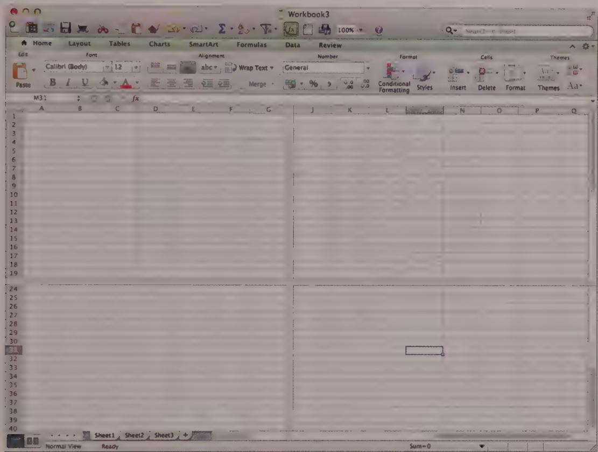
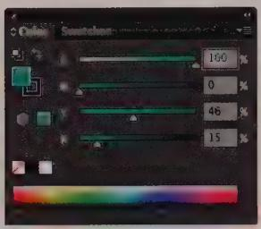
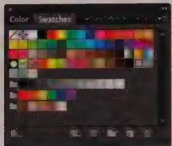
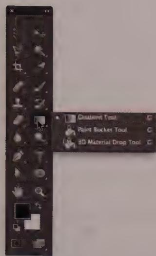
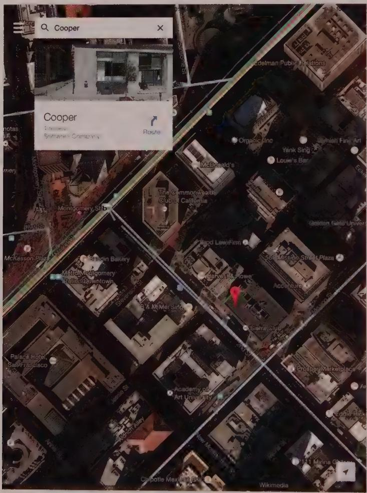
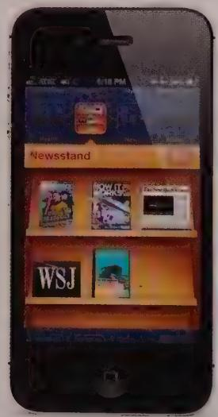
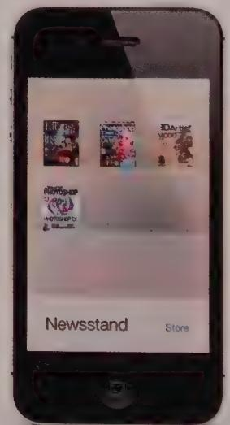
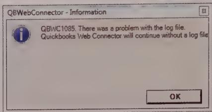
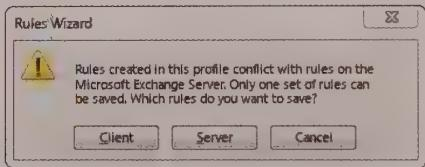
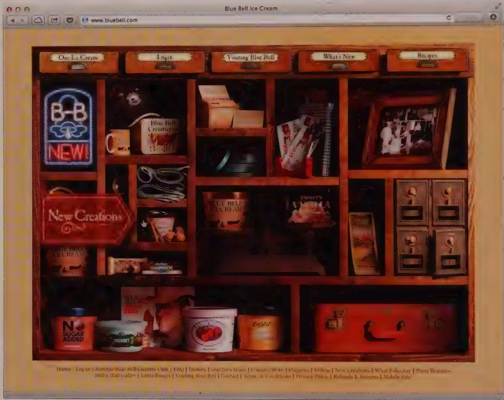

# REDUCING WORK AND ELIMINATING EXCISE

Digital products too often contain interactions that are top-heavy, requiring unnecessary work for users. Interacting with an interface always involves some work on the part of the user. The goal of designers (or at least one of the more important ones) is to minimize that work, while at the same time enabling users to achieve their goals. If designers and developers don't pay careful attention to the human actions required to operate their technology, the result can be a taxing experience for the users. They will struggle to relate their mental models of the activities they want to perform to the product interface that has been engineered.

Users perform four types of work when interacting with digital products:

Cognitive work—Comprehending product behaviors, as well as text and organizational structures   
- Memory work—Recalling product behaviors, commands, passwords, names and locations of data objects and controls, and other relationships between objects   
- Visual work—Figuring out where the eye should start on the screen, finding one object among many, decoding layouts, and differentiating among visually coded interface elements (such as list items with different colors)   
- Physical work—Keystrokes, mouse movements, gestures (click, drag, double-click), switching between input modes, and number of clicks required to navigate

When implementation-model thinking is applied to digital products, these four types of work are seldom minimized for users—quite the opposite, in fact. The result is software that, in effect, charges its users a tax, or excise, of cognitive and physical effort every time it is used.

In the physical world, mandatory tasks that don't immediately satisfy our goals are sometimes unavoidable. For example, when we get up late on a workday and need to get to the office quickly, we must open the garage door, get in the car, start the motor, back out, and close the garage door before we even begin the forward motion that will take us to our destination. These actions support the physicality of the automobile rather than getting us to the destination faster.

If we had Star Trek transporters instead, we'd dial up our destination and teleport there instantaneously—no garages, no motors, no traffic lights. Digital products, much like our fictional transporter, don't necessarily need to have the same kind of roadblocks that stand in the way of our goals in the physical world. But implementation-model design often makes it seem that way to users.

# Goal-Directed Tasks versus Excise Tasks

Any large task, such as driving to the office, involves many smaller tasks. Some of these tasks work directly toward achieving the goal; these are tasks like steering down the road toward your office. Excise tasks, on the other hand, don't contribute directly to reaching the goal, but instead represent extra work that satisfies either the needs of our tools or those of outside agents as we try to achieve our objectives.

In this example, the excise tasks are pretty clear. Opening the garage door is something we do for the car, not for us, and it doesn't move us toward our destination the way the accelerator pedal and steering wheel do. Stopping at red lights is something imposed on us by our society that, again, doesn't help us achieve our true goal. (In this case, it does help us achieve a related goal of arriving safely at our office.) A tune-up helps keep the car running well, but it doesn't get us anywhere quickly while we're doing it.

Software, too, has a pretty clear dividing line between goal-directed tasks and excise tasks. Like automobiles, some software excise tasks are trivial, and performing them is no great hardship. On the other hand, other software excise tasks are as obnoxious as fixing a flat tire. Installation leaps to mind here, as do such excise tasks as configuring networks and backing up files.

# Types of Excise

The problem with excise tasks is that the effort we expend doing them doesn't go directly toward accomplishing our goals. Where we can eliminate excise tasks, we make people more effective and productive, ultimately creating better usability and a better user experience.

DESIGN PRINCIPLE

Eliminate excise wherever possible.

The existence of excise in user interfaces is a primary cause of user dissatisfaction with software-enabled products. It behooves every designer and product manager to be on the lookout for interaction excise in all its forms and to take the time and energy to see that it is eliminated from their products.

# Navigational excise

Navigation through the functions or features of a digital product is largely excise. Except in the case of games where the goal is to navigate successfully through a maze of obstacles, the work that users are forced to do to get around in software and on websites is seldom aligned with their needs, goals, and desires. (However, well-designed navigation can be an effective way to instruct users about what is available to them, which is better aligned with their goals.)

Unnecessary or difficult navigation is a major frustration to users. In fact, in our opinion, poorly designed navigation presents one of the largest and most common problems in the usability of interactive products—mobile, desktop, web, or otherwise. It is also the place where the developer's implementation model typically is made most apparent to users.

Navigation through software occurs at multiple levels:

- Across multiple windows, views, or pages   
- Across multiple panes or frames within a window, view, or page   
- Across tools, commands, or menus   
- Within information displayed in a pane or frame (such as scrolling, panning, zooming, following links)

We find it useful to think in terms of a broad definition of navigation: any action that takes the user to a new part of the interface or that requires him or her to locate objects, tools, or data elsewhere in the system. When we start thinking about such actions as navigation, it becomes clear that they are excise and therefore should be minimized or, if possible, eliminated. The following sections discuss each of these types of navigation in more detail.

# Navigation across multiple screens, views, or pages

Moving across multiple application views or pages is perhaps the most disorienting kind of navigation for users. It involves a gross shifting of attention that disrupts the user's flow and forces him into a new context. The act of navigating to another window also often means that the contents of the original window are partly or completely obscured. On the desktop, it means that the user needs to worry about window management, an excise task that further disrupts his flow. If users must constantly shuttle between windows to achieve their goals, their disorientation and frustration levels will rise, they will become distracted from the task at hand, and their effectiveness and productivity will drop.

If the number of windows is large enough, the user will become sufficiently disoriented that he may experience navigational trauma: He gets lost in the interface. Sovereign posture applications (discussed in Chapter 9) can avoid this problem by placing all main interactions in a single primary view, which may contain multiple independent panes.

# Navigation between panes

Windows or views can contain multiple panes—adjacent to each other and separated by splitters (see Chapter 20) or stacked on top of each other and denoted by tabs. Adjacent panes can solve many navigation problems, because they provide useful supporting functions, links, or data on the screen in close reach of the primary work or display area. This reduces navigation to almost nil. If objects can be dragged between panes, those panes should be adjacent.

Problems arise when adjacent supporting panes become too numerous or are not placed on the screen in a way that matches users' work flows. Too many adjacent panes result in visual clutter and confusion: Users do not know where to go to find what they need. Also, crowding forces scrolling—another navigational hit. Navigation within the single screen thus becomes a problem. Some web portals, trying to be everything to everyone, have such navigational problems.

In some cases, depending on user work flows, tabbed panes can be appropriate. Tabbed panes bring with them a level of navigational excise and potential for user disorientation.

because they obscure what was on the screen before the user navigated to them. However, this idiom is appropriate for the main work area when multiple documents or independent views of a document are required (such as in Microsoft Excel; see Figure 12-1).

  
Figure 12-1: Microsoft Excel makes use of tabbed panes (visible in the lower left) to let users navigate between related worksheets. Excel also makes use of splitters to provide adjacent panes for viewing multiple, distant parts of a single spreadsheet without constant scrolling. Both these idioms help reduce navigational excise for Excel users.

Some developers use tabs to break complex product capabilities into smaller chunks. They reason that using these capabilities will somehow become easier if the functionality is cut into bite-sized pieces. Actually, putting parts of a single facility onto separate panes increases excise and decreases users' understanding and orientation.

The use of tabbed screen areas is a space-saving mechanism and is sometimes necessary to fit all the required information and functions into a limited space. (Settings dialogs are a classic example. We don't think anyone is interested in seeing all the settings for a sophisticated application laid bare in a single view.) In most cases, though, the use of tabs creates significant navigational excise. It is rarely possible to accurately describe the contents of a tab with a succinct label (though in a pinch, rich visual modeless feedback

on tabs can help—see Chapter 15). Therefore, users must click through each tab to find the tool or piece of information they are looking for.

Tabbed panes can be appropriate when there are multiple supporting panes for a primary work area that are not used at the same time. The support panes can be stacked, and the user can choose the pane suitable for his current tasks, which is only a click away. A classic example involves the color mixer and swatches area in Adobe Illustrator, as shown in Figure 12-2. These two tools are mutually exclusive ways of selecting a drawing color, and users typically know which is appropriate for a given task.

  
Figure 12-2: Tabbed palettes in Adobe Illustrator allow users to switch between the mixer and swatches, which provide alternative mechanisms for picking a color.

# Navigation between tools and menus

Another important and overlooked form of navigation results from a user's need to use different tools, palettes, and functions. Spatial organization of these within a pane or window is critical to minimizing extraneous mouse movements that, at best, could result in user annoyance and fatigue and, at worst, could result in repetitive stress injury. Tools that are used frequently and in conjunction with each other should be grouped spatially and also should be immediately available. Menus require more navigational effort on the part of users because their contents are not visible prior to clicking. Frequently used functions should be provided in toolbars, palettes, or the equivalent. Menu use should be reserved for infrequently accessed commands. (We discuss organizing controls again later in this chapter, and we discuss toolbars in depth in Chapter 18.)

Adobe Photoshop exhibits some undesirable behaviors in how it forces users to navigate between palette controls. For example, the Paint Bucket tool and the Gradient tool each occupy the same location on the tool palette. You must select between them by clicking and holding the visible control, which opens a menu, as shown in Figure 12-3. However, both are fill tools, and if both are used frequently, it would be better to place each of them on the palette next to each other to avoid that frequent, flow-disrupting tool navigation.

  
Figure 12-3: In Adobe Photoshop, the Paint Bucket tool is hidden in a combo icon button (see Chapter 21) on its tool palette. Even though users make frequent use of both the Gradient tool and the Paint Bucket tool, they are forced to access this menu anytime they need to switch between these tools.

# Navigation of information

Information, or the content of panes or windows, can be navigated using several methods: scrolling (panning), linking (jumping), and zooming. The first two methods are common: Scrolling is ubiquitous in most software, and linking is ubiquitous on the web (although increasingly, linking idioms are being adopted in non-web applications). Zooming is used primarily to visualize 3D and detailed 2D data.

Scrolling is often a necessity, but the need for it should be minimized when possible. Often there is a trade-off between paging and scrolling information: You should understand your users' mental models and work flows to determine what is best for them.

In 2D visualization and drawing applications, vertical and horizontal scrolling are common. These kinds of interfaces benefit from a thumbnail map to ease navigation. We'll discuss this technique as well as other visual signposts later in this chapter.

Linking is the critical navigational paradigm of the web. Because it is a visually dislocating activity, extra care must be taken to provide visual and textual cues that help orient users.

Zooming and panning are navigational tools for exploring 2D and 3D information. These methods are appropriate when creating 2D or 3D drawings and models or for exploring

representations of real-world 2D and 3D environments (architectural walkthroughs, or topographic maps, for example). They can fall short when they are used to examine arbitrary or abstract data presented in more than two dimensions. Some information visualization tools use zoom to mean "Display more attribute details about objects"—a logical rather than spatial zoom. As the view of the object enlarges, attributes (often textual) appear superimposed over its graphical representation. This technique works great when the attributes in question are tightly associated with spatial data, such as that employed in Google Maps (see Figure 12-4). But for abstract data spaces, this kind of interaction is almost always better served through an adjacent supporting pane that displays the properties of selected objects in a more standard, readable form.

  
Figure 12-4: The Google Maps app makes excellent use of a combination of spatial and logical zoom. As the user physically zooms in by spreading his fingers apart on the map, location details such as transit lines, traffic congestion, street names, and places of business also come into view. Zoom usually works best when applied to concrete rather than abstract data spaces, such as maps.

Panning and zooming, especially when paired, create navigational difficulties for users. Although this situation is improving due to the prevalence of online maps and easy to grasp gestural interfaces, it is still possible for people to get lost using virtual spaces. Humans are not used to moving in unconstrained 3D environments, and they have difficulty perceiving 3D properly when it is projected on a 2D screen. (See Chapter 18 for more on 3D manipulation.)

# Skeuomorphic excise

We are experiencing an incredible transformation from the age of industrial, mechanical artifacts to an age of digital, information objects. It is only natural for us, then, to try to draw on the models and forms of an earlier era that we are comfortable with and use them in this new, less certain one. As the history of the industrial revolution shows, the fruits of new technology can often only be expressed at first with the language of an earlier technology. For example, we called railroad engines iron horses and automobiles horseless carriages. Unfortunately, this imagery and language color our thinking more than we might admit.

Naturally, we tend to use old-style mechanical representations in our new digital environments, a practice called skeuomorphism. Sometimes this appropriation of the old is valid because the function is identical, even if the underlying technology is different. For example, when we translate the process of typing with a typewriter into doing word processing on a computer, we are using a mechanical representation of a common task. Typewriters used little metal tabs to rapidly move the carriage several spaces until it came to rest on a particular column. The process, as a natural outgrowth of the technology, was called tabbing or setting tabs. Word processors also have tabs because their function is the same; whether you are working on paper rolled around a platen or on images on a video screen, you need to rapidly slew to a particular margin offset.

More often, however, mechanical representations shouldn't be translated verbatim into the digital world. We encounter problems when we bring our familiar mechanical artifacts into software. These representations result in excise and unnecessarily limit interactions that could be far more efficient than those allowed for by the old models.

Mechanical procedures are usually easier to perform by hand than they are with digital products. Consider a simple contact list. If it is faithfully rendered onscreen like a little bound book, it will be much more complex, inconvenient, and difficult to use than the physical address book. The physical address book, for example, stores names in alphabetical order by last name. But what if you want to find someone by her first name? The mechanical artifact doesn't help you: You have to scan the pages manually. The faithfully replicated digital version wouldn't search by first name either. The difference is that,

on the computer screen, you lose many subtle visual and tangible cues offered by the paper-based book (bent page corners, penciled-in notes). Meanwhile, scrollbars, swipe-to-delete, and navigational drilldowns are harder to use, harder to visualize, and harder to understand than simply flipping pages.

Designers paint themselves into a corner when they rely on slavishly skeuomorphic metaphors. Visual metaphors such as desktops with telephones, copy machines, staplers, and fax machines—or file cabinets with folders in drawers—may make it easy to understand the relationships between interface elements and behaviors. But after users learn these fundamentals, managing the metaphor becomes an exercise in excise. (For more discussion on the limitations of visual metaphors, see Chapter 13.)

Screen real estate consumed by skeuomorphic representations is also excessive, particularly in sovereign posture applications, where maximizing screen space for content rather than UI chrome is of primary importance. The little telephone that so charmingly told us how to dial on that first day long ago is now just a barrier to quick communication.

It's all too easy to fall into the trap of skeuomorphic excise in the name of user friendliness. Apple's iOS veered uncomfortably in the direction of skeuomorphism for versions 4, 5, and 6, but it seems to have finally snapped out of it in iOS 7, as shown in Figure 12-5.

  
Figure 12-5: In iOS 6 (left), Apple indulged in some excesses of skeuomorphism that seem to have been purged in iOS 7 (right).

# Modal excise

The previous chapter introduced the concept of flow, whereby a person enters a highly productive mental state by working in harmony with her tools. Flow is a natural state, and people enter it without much prodding. It takes some effort to break into flow after someone has achieved it. Interruptions like a ringing telephone will do it, as will a modal error message or confirmation dialog. Some interruptions are unavoidable, but interrupting the user's flow for no good reason is stopping the proceedings with idiocy and is one of the most disruptive forms of excise.

DESIGN PRINCIPLE

Don't stop the proceedings with idiocy.

Poorly designed software makes assertions that no self-respecting individual would ever make. It states unequivocally, for example, that a file doesn't exist merely because the software is too stupid to look for the file in the right place, and then it implicitly blames you for losing it! An application cheerfully executes an impossible query that hangs up your system until you decide to reboot. Users view such software behavior as idiocy, and with just cause.

# Errors, notifiers, and confirmation messages

There are probably no more prevalent excuse elements than error message and confirmation message dialogs. These are so ubiquitous that eradicating them takes a lot of work. In Chapter 15, we discuss these issues at length, but for now, suffice it to say that they are high in excise and should be eliminated from your applications whenever possible.

The typical modal error message is unnecessary. It either tells the user something he doesn't care about or demands that he fix a situation that the application can and should usually fix just as well. Figure 12-6 shows an error message box displayed by Adobe Illustrator 6 when the user tries to save a document. We're not exactly sure what it's trying to tell us, but it sounds dire.

The message stops an already annoying and time-consuming procedure, making it take even longer. A user cannot fetch a cup of coffee after telling the application to save his artwork, because he might return only to see the function incomplete and the application mindlessly holding up the process. We discuss how to eliminate these sorts of error messages in Chapter 21.

  
Figure 12-6: This ugly, useless error message box stops the proceedings with idiocy. You can't verify or identify what it tells you, and it gives you no options for responding other than to admit your own culpability by clicking OK. This message comes up only when the application is saving—when you have entrusted it to do something simple and straightforward. The application can't even save a file without help, and it won't tell you what help it needs!

Figure 12-7 shows another frustrating example, this time from Microsoft Outlook.

  
Figure 12-7: Here is a horrible confirmation box that stops the proceedings with idiocy. If the application is smart enough to detect the difference, why can't it correct the problem itself? The options the dialog offers are scary. It is telling you that you can explode one of two boxes: One contains garbage, and the other contains the family dog—but the application won't say which is which. And if you click Cancel, what does that mean? Will it still explode your dog?

This dialog is asking you to make an irreversible and potentially costly decision based on no information whatsoever! If the dialog occurs just after you changed some rules, doesn't it stand to reason that you want to keep them? And if you don't, wouldn't you like a bit more information, such as exactly what rules are in conflict and which of them are the more recently created? You also don't have a clear idea what happens when you click Cancel. Are you canceling the dialog and leaving the rules mismatched? Are you discarding recent changes that led to the mismatch? The kind of fear and uncertainty that this poorly designed interaction arouses in users is completely unnecessary. We discuss how to improve this kind of situation in Chapter 21.

# Making users ask permission

Back in the days of command lines and character-based menus, interfaces indirectly offered services to users. If you wanted to change an item, such as your address, first you had to ask the application for permission to do so. The application would then display a screen where you could change your address. Asking permission is pure excise, and unfortunately things haven't changed much. If you want to change one of your saved addresses on Amazon.com, you have to click a button and go to a different page. If you want to change a displayed value, you should be able to change it right there. You shouldn't have to ask permission or go to a different room.

DESIGN PRINCIPLE

Don't make users ask permission.

As in the preceding example, many applications have one place where the values (such as filenames, numeric values, and selected options) are displayed for output and another place where user input to them is accepted. This follows the implementation model, which treats input and output as different processes. A user's mental model, however, doesn't recognize a difference. He thinks, "There is the number. I'll just click it and enter a new value." If the application can't accommodate this impulse, it is needlessly inserting excise into the interface. If the user can modify options, he should be able to do so right where the application displays them.

DESIGN PRINCIPLE

Allow input wherever you have output.

The opposite of asking permission can be useful in certain circumstances. Rather than asking the application to launch a dialog, the user tells a dialog to go away and not return. In this way, the user can make an unhelpful dialog stop badgering him, even though the application mistakenly thinks it is helping. Microsoft Windows now makes heavy use of this idiom. (If a beginner inadvertently dismisses a dialog and can't figure out how to get it back, he may benefit from another easy-to-identify safety-net idiom in a prominent place—a Help menu item saying "Bring back all dismissed dialogs," for example.)

# Stylistic excise

Users must perform visual work to decode onscreen information, such as finding a single item in a list, figuring out where to begin reading on a screen, or determining which elements on a screen are clickable and which are merely decoration.

A significant source of visual work is the use of overly stylized graphics and interface elements (see Figure 12-8). Visual style can certainly create mood and reinforce brand, but it shouldn't do so at the expense of utility and usability by forcing users to decode visual elements to understand which represent controls and critical information and which are merely ornamental. The use of visual style, at least in apps geared toward productivity rather than entertainment, should support the clear communication of information and interface behavior.

  
Figure 12-8: The home page of Blue Bell Creameries provides a good example of visual excise. Text is highly stylized and doesn't follow a layout grid. It's difficult for users to differentiate between décor and navigational elements. This requires users to do visual work to interact with the site. This isn't always a bad thing—just the right amount of the right kind of work can be a source of entertainment (as with games and puzzles).

For more discussion on striking the right balance to create effective visual interface designs, see Chapter 17.

# Excise Is Contextual

One man's (or persona's) goal-directed task may be another's excise task in a different context. In general, a function or action is excise if it is forced on the user rather than made available at his discretion. An example of this kind of function is window management. The only way to determine whether a function or behavior such as this is excise is by comparing it to personas' goals. If a significant persona needs to see two applications at a time on the screen to compare or transfer information, the ability to configure the main windows of the applications so that they share the screen space is not excise. If your personas don't have this specific goal or need, the work required to configure the main window of either application is excise.

Excise may also vary by software posture (see Chapter 9). Users of transient posture applications often require some instruction to use the product effectively. Allocating screen real estate to this effort typically does not contribute to excise in the same way as it does in sovereign posture applications. Transient posture applications aren't used frequently, so their users need more assistance understanding what the application does and remembering how to control it. For sovereign posture applications, however, the slightest excise becomes agonizing over time.

However, some types of actions are almost always excise and should be eliminated under all circumstances. These include most hardware-management tasks that the software could handle itself (if a few more design and engineering cycles were spent on it). Any demands for such information should be struck from user interfaces and replaced with more silently intelligent application behavior behind the scenes.

