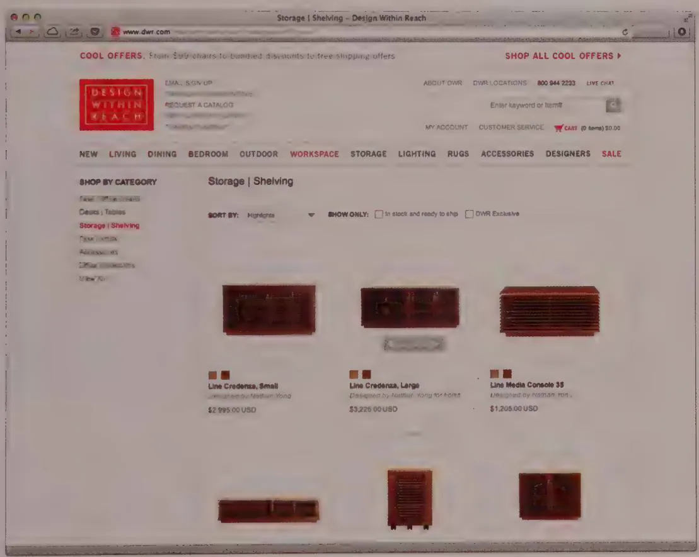
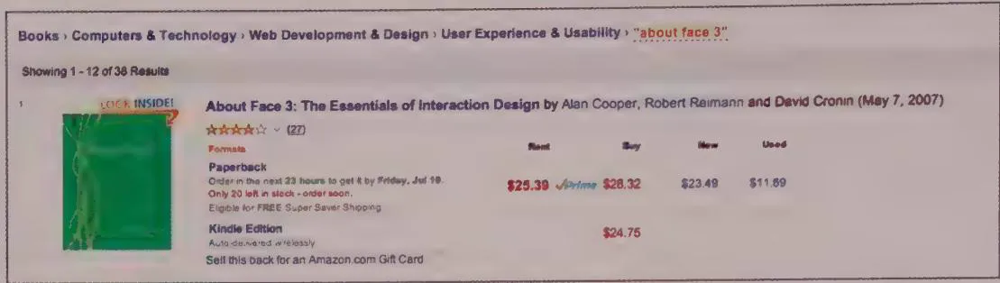
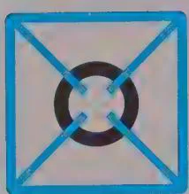
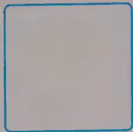
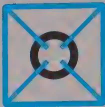
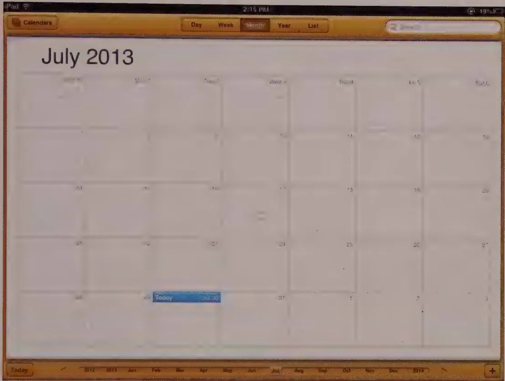
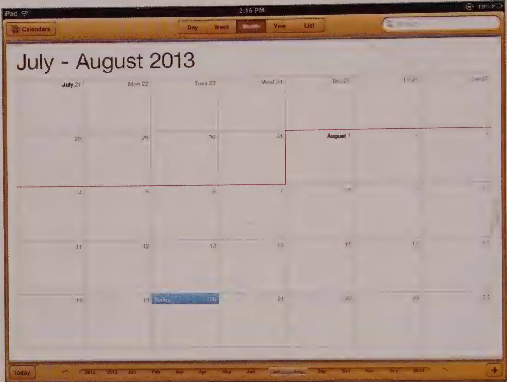

# Eliminating Excise

Navigational excise is easily the most prevalent type of excise found in digital products and thus is one of the best places to start eliminating it. There are many ways to begin improving (eliminating, reducing, or speeding up) navigation in your applications, websites, and devices. Here are the most effective:

- Reduce the number of places to go.   
- Provide signposts.   
- Provide overviews.   
- Properly map controls to functions.   
- Avoid hierarchies.   
- Don't replicate mechanical models.

We'll discuss these in detail next.

# Reduce the number of places to go

The most effective method of improving navigation sounds quite obvious: Reduce the number of places to which one must navigate. These "places" include modes, forms, dialogs, pages, windows, and screens. If the number of modes, pages, or screens is kept to a minimum, people's ability to stay oriented increases dramatically. In terms of the four types of navigation presented earlier, this directive means you should do the following:

- Keep the number of windows and views to a minimum. One full-screen window with two or three views is best for many users. Keep dialogs, especially modeless dialogs, to a minimum. Applications, websites, or mobile apps with dozens of distinct types of pages, screens, or forms are difficult to navigate.   
- Limit the number of adjacent panes in your interface to the minimum number needed for users to achieve their goals. In sovereign posture applications, three panes is a good thing to shoot for, but there are no absolutes here—in fact, many applications require more. On web pages, anything more than two navigation areas and one content area begins to get busy. On tablet apps, two panes is typical.   
- Limit the number of controls to as few as your users really need to meet their goals. Having a good grasp of your users via personas will enable you to avoid functions and controls that your users don't really want or need and that, therefore, only get in their way.   
- Minimize scrolling when possible. This means giving supporting panes enough room to display information so that they don't require constant scrolling. Default views of 2D and 3D diagrams and scenes should be such that the user can orient himself without too much panning. Zooming is the most difficult type of navigation for most users (though more straightforward in mobile apps using pinch gestures), so its use should be discretionary, not a requirement.

Many online stores present confusing navigation because the designers have tried to serve everyone with one generic site. If a user buys books but never music from a site, access to the music portion of the site could be deemphasized in the main screen for that user. This makes more room for that user to buy books, and the navigation becomes simpler. Conversely, if he visits his account page frequently, his version of the site should prominently display his account button (or tab).

# Provide signposts

In addition to reducing the number of navigable places, another way to enhance users' ability to find their way around is by providing better points of reference—signposts. In the same way that sailors navigate by reference to shorelines or stars, users navigate by reference to persistent objects placed in a user interface.

Persistent objects, in a desktop world, always include the application's windows. Each application most likely has a main, top-level window. The salient features of that window are also considered persistent objects: menu bars, toolbars, and other palettes or visual features like status bars and rulers. Generally, each window of the interface has a distinctive look that will soon become recognizable.

On the web, similar rules apply. Well-designed websites make careful use of persistent objects that remain constant throughout the shopping experience, especially the top-level navigation bar along the top of the page. Not only do these areas provide clear navigational options, but their consistent presence and layout also help orient customers (see Figure 12-9).

  
Figure 12-9: The Design Within Reach website makes use of many persistent areas on the majority of its pages, such as the links and search field along the top and the browse tools on the side. These not only help users figure out where they can go but also help keep them oriented.

In devices, similar rules apply to screens, but hardware controls themselves can take on the role of signposts—even more so when they offer visual or tactile feedback about their state. Radio buttons that, for example, light when selected, even a needle's position on a dial, can provide navigational information if integrated appropriately with the software.

Depending on the application, the contents of the application's main window may also be easily recognizable (especially with kiosks and small-screen devices). Some applications may offer a few different views of their data, so the overall aspect of their screens changes depending on the view chosen. A desktop application's distinctive look, however, usually comes from its unique combination of menus, palettes, and toolbars. This means that menus and toolbars must be considered aids to navigation. You don't need a lot of signposts to navigate successfully; they just need to be visible. Needless to say, signposts can't aid navigation if they are removed, so it is best if they are permanent fixtures of the interface (some iOS browsers break this rule slightly by allowing controls to scroll up as the user moves down the page; however, they immediately scroll back down when the user reverses direction—a clever means of bringing controls back into focus as soon as they are needed).

Making each page on a website look just like every other one may maintain visual consistency, but it can, if carried too far, be disorienting. You should use common elements consistently on each page, but by making different rooms look distinctive, you will help orient your users better.

# Menu

The most prominent permanent object in a desktop application is the main window and its title and menu bars. Part of the benefit of the menu comes from its reliability and consistency. Unexpected changes to an application's menus can deeply reduce users' trust in them. This is true for menu items as well as for individual menus.

# Toolbars

If the application has a toolbar, it should also be considered a recognizable signpost. Because toolbars are idioms for perpetual intermediates rather than for beginners, the strictures against changing menu items don't apply quite as strongly to individual toolbar controls. Removing the toolbar itself is certainly a dislocating change to a persistent object. Although the ability to do so should exist, it shouldn't be offered casually, and users should be protected from accidentally triggering it. Some applications put a control on the toolbar that makes the toolbar disappear! This is a completely inappropriate ejector seat lever.

# Other interface signposts

Tool palettes and fixed areas of the screen where data is displayed or edited should also be considered persistent objects that add to the interface's navigational ease. Judicious use of white space and legible fonts is important so that these signposts remain clearly evident and distinctive.

# Provide overviews

Overviews serve a purpose similar to signposts in an interface: They help orient users. The difference is that overviews help orient users within the content rather than within the application as a whole. Because of this, the overview area should itself be persistent; its content is dependent on the data being navigated.

Overviews can be graphical or textual, depending on the nature of the content. An excellent example of a graphical overview is the aptly named Navigator palette in Adobe Photoshop, shown in Figure 12-10.

  
Figure 12-10: On the left, Adobe makes use of an excellent overview idiom in Photoshop: the Navigator palette, which provides a thumbnail view of a large image with an outlined box that represents the portion of the image currently visible in the main display. Not only does the palette provide navigational context, but it can be used to pan and zoom the main display as well. A similar idiom is employed on the right in the Google Finance charting tool, in which the small graph on the bottom provides a big-picture view and context for the zoomed-in view on top.

In the web world, the most common form of overview area is textual: the ubiquitous breadcrumb display (see Figure 12-11). Again, most breadcrumbs provide a navigational aid as well as a navigational control: Not only do they show where in the data structure a visitor is, but they also give him or her tools to move to different nodes in the structure in the form of links. This idiom has lost some popularity as websites have moved from being strictly hierarchical organizations to more associative organizations, which don't lend themselves as neatly to breadcrumbs.

  
Figure 12-11: A typical breadcrumb display from Amazon.com. Users see where they've been and can click anywhere in the breadcrumb trail to navigate to that link.

A final interesting example of an overview tool is the annotated scrollbar, which is most useful for scrolling through text. They make clever use of the linear nature of both scrollbars and textual information to provide location information about the locations of selections, highlights, and potentially many other attributes of formatted or unformatted text. Hints about the locations of these items appear in the "track" that the thumb of the scrollbar moves in, at the appropriate location. When the thumb is over the annotation, the annotated feature of the text is visible in the display. Microsoft Word uses a variation of the annotated scrollbar; it shows the page number and nearest header in a ToolTip that remains active during the scroll, as shown in Figure 12-12.

  
Figure 12-12: An annotated scrollbar from Microsoft Word provides useful context for the user as he or she navigates through a document.

# Properly map controls to functions

Mapping describes the relationship between a control, the thing it affects, and the intended result. Poor mapping is evident when a control does not relate visually, spatially, or symbolically to the object it affects. Poor mapping requires users to stop and think about the relationship, breaking flow. Poor mapping of controls to functions increases the cognitive load for users and can result in potentially serious user errors.

Donald Norman provides an excellent example of mapping problems from the non-digital world in The Design of Everyday Things (Basic Books, 2002). Almost anyone who cooks has run into the annoyance of a stovetop whose burner knobs do not map appropriately to the burners they control. The typical stovetop, such as the one shown in Figure 12-13, features four burners arranged in a flat square with a burner in each corner. However, the knobs that operate those burners are laid out in a straight line on the front of the unit.

  
Figure 12-13: A stovetop with poor physical mapping of controls. Does the knob on the far left control the left-front or left-rear burner? Users must figure out the mapping anew each time they use the stovetop.

In this case, we have a physical mapping problem. The result of using the control is reasonably clear: A burner will heat up when you turn a knob. However, the target of the control—which burner will get warm—is unclear. Does twisting the leftmost knob turn on the left-front burner, or does it turn on the left-rear burner? Users must find out by trial and error or by referring to the tiny icons next to the knobs. The unnaturalness of the mapping compels users to figure out this relationship anew every time they use the stove. This cognitive work may become habituated over time, but it still exists, making users prone to error if they are rushed or distracted (as people often are while preparing meals). In the best-case scenario, users feel stupid because they've twisted the wrong knob, and their food doesn't get hot until they notice the error. In the worst-case scenario, they might accidentally burn themselves or set fire to the kitchen.

The solution requires moving the stovetop knobs so that they better suggest which burners they control. The knobs don't have to be laid out in exactly the same pattern as the burners, but they should be positioned so that the target of each knob is clear. The stovetop shown in Figure 12-14 is a good example of an effective mapping of controls.

In this layout, it's clear that the upper-left knob controls the upper-left burner. The placement of each knob visually suggests which burner it will turn on. Norman calls this more intuitive layout "natural mapping."

Figure 12-15 shows another example of poor mapping—of a different type. In this case, it is the logical mapping of concepts to actions that is unclear.

  
Figure 12-14: Clear spatial mapping. On this stovetop, it is clear which knob maps to which burner, because the spatial arrangement of knobs clearly associates each knob with a burner.

  
Figure 12-15: An example of a logical mapping problem. If the user wants to see the most recent items first, does she choose Ascending or Descending? These terms don't map well to how users conceive of time.

This website uses a pair of drop-down menus to sort a list of search results by date. The selection in the first drop-down determines the choices present in the second. When Re-sort results by: Date Placed is selected in the first menu, the second drop-down presents the options Ascending and Descending.

Unlike the poorly mapped stovetop knobs, the target of this control is clear—the dropdown menu selections affect the list below them. However, the result of using the control is unclear: Which sort order will the user get if she chooses Ascending?

The terms chosen to communicate the date-sorting options make it unclear what users should choose if they want to see the most recent items first in the list. Ascending and Descending do not map well to most users' mental model of time. People don't think of dates as ascending or descending; rather, they think of dates and events as being recent or ancient. A quick fix to this problem is to change the wording of the options to Most recent first and Oldest first, as shown in Figure 12-16.

  
Figure 12-16: Clear, logical mapping. "Most recent" and "Oldest" are terms that users can easily map to time-based sorting.

Whether you make appliances, mobile apps, desktop applications, or websites, your product may have mapping problems. Mapping is an area where attention to detail pays off. You can measurably improve a product by seeking out and fixing mapping problems, even if you have very little time to make changes. The result is a product that is easier to understand and more pleasurable to use.

# Avoid hierarchies

Hierarchies are one of the developer's most durable tools. Much of the data inside applications, along with much of the code that manipulates it, is in hierarchical form. For this reason, many developers present hierarchies (the implementation model) in user interfaces. Early menus, as we've seen, were hierarchical. But abstract hierarchies are very difficult for users to successfully navigate, except where they're based on user mental models and the categories are truly mutually exclusive. This truth is often difficult for developers to grasp because they themselves are so comfortable with hierarchies.

Most humans are familiar with hierarchies in their business and family relationships, but hierarchies are not natural concepts for most people when it comes to storing and retrieving arbitrary information. Most mechanical storage systems are simple, composed of either a single sequence of stored objects (like a bookshelf) or a series of sequences, one level deep (like a file cabinet). This method of organizing things into a single layer of groups is extremely common and can be found everywhere in your home and office. Because it never exceeds a single level of nesting, we call this storage paradigm monocline grouping.

Developers are comfortable with nested systems, in which an instance of an object is stored in another instance of the same object. Most other humans have a difficult time with this idea. In the mechanical world, complex storage systems, by necessity, use different mechanical form factors at each level. In a file cabinet, you never see folders inside folders or file drawers inside file drawers. Even the dissimilar nesting of folder-inside-drawer-inside-cabinet rarely exceeds two levels of nesting. In the current desktop metaphor used by most window systems, you can nest folder within folder ad infinitum. It's no wonder most computer neophytes get confused when confronted with this paradigm.

Most people store their papers (and other items) in a series of stacks or piles based on some common characteristic: The Acme papers go here; the Project M papers go there; personal stuff goes in the drawer. Donald Norman (1994) calls this a pile cabinet. Only inside computers do people put the Project M documents inside the Active Clients folder, which in turn is stored inside the Clients folder, stored inside the Business folder.

Computer science gives us hierarchical structures as tools to solve the very real problems of managing massive quantities of data. But when this implementation model is reflected in the represented model presented to users (as discussed in Chapter 1), they get confused, because it conflicts with their mental model of storage systems. Monocline grouping is the mental model people typically bring to software. Monocline grouping is so dominant outside the computer that interaction designers violate this model at their peril.

Monocline grouping is an inadequate system for physically managing the large quantities of data commonly found on computers, but that doesn't mean it isn't useful as a represented model. The solution to this conundrum is to render the structure as the user imagines it—as monocline grouping—but to provide the search and access tools that only a deep hierarchical organization can offer. In other words, rather than forcing users to navigate deep, complex tree structures, give them tools to bring appropriate information to themselves. We'll discuss some design solutions that help make this happen in Chapter 14.

# Don't replicate Mechanical-Age models

As already discussed, skeuomorphic excise—resulting from an unreflective replication of Mechanical-Age actions in digital interfaces—adds excise, navigational and otherwise.

It makes sense to spend some time rethinking products and features that are translated from the pre-digital world. How can the new, digital version be streamlined and adapted to take full advantage of the digital environment? How can excise be eliminated and smarts brought to bear?

Take the desk calendar. In the non-digital world, calendars are made of paper and are usually divided into a one-month-per-page format. This is a reasonable compromise based on the size of paper, file folders, briefcases, and desk drawers.

Digital products with representations of calendars are quite common, and they almost always display one month at a time. Even if they can show more than one month, as Outlook does, they almost always display days in discrete one-month chunks. Why?

Paper calendars show a single month because they are limited by the size of the paper, and a month is a convenient breaking point. High-resolution digital displays are not so constrained, but most designers copy the mechanical artifact faithfully, as shown in Figure 12-17.

  
Figure 12-17: The ubiquitous calendar is so familiar that we rarely stop to apply Information-Age sensibilities to its design on the screen. Calendars were originally designed to fit on stacked sheets of paper, not interactive digital displays. How would you redesign a digital calendar? Which of its aspects are artifacts of its old, Mechanical-Age platform?

On an interactive screen, the calendar could easily be a continuously scrolling sequence of days, weeks, or months, as shown in Figure 12-18. Scheduling something from August 28 to September 4 would be simple if weeks were contiguous instead of broken up by the arbitrary monthly division.

Similarly, the grid pattern in digital calendars is almost universally a fixed size. Why can't the width of columns of days or the height of rows of weeks be adjustable like a spreadsheet? Certainly you'd want to adjust the sizes of your weekends to reflect their relative importance in relation to your weekdays. If you're a businessperson, your working-week calendar would demand more space than a vacation week. The adjustable grid interface idiom is well known—every spreadsheet in the world uses it—but the mechanical representations of calendars are so firmly entrenched that we rarely see apps that deviate from them.

  
Figure 12-18: Scrolling is a familiar task to computer users. Why not replace the page-oriented calendar with a scrolling one to make it better? This perpetual calendar can do everything the old one can, and it also solves the mechanical-representation problem of scheduling across monthly boundaries. Don't drag old limitations onto new platforms out of habit. What other improvements can you think of?

The designer of the software shown in Figure 12-17 probably thought of calendars as canonical objects that couldn't be altered from the familiar. Surprisingly, most time-management software handles time internally—in its implementation model—as a continuum, and renders it as discrete months only in its user interface—its represented model!

Some might argue that the one-month-per-page calendar is better because it is easily recognizable and familiar to users. However, the new digital model isn't all that different from the old paper model, except that it permits the users to do something they couldn't easily do before—schedule across monthly boundaries. People don't find it difficult to adapt to new representations if they offer a significant improvement.

Apple flubbed an opportunity to take this approach with their redesigned iOS7 Calendar app. It features a continuous vertically scrolling calendar in month view... but the designers chose to line break at month boundaries, and didn't support a drag gesture to specify a multi-day event. So close, and yet so far.

Paper-style calendars in mobile devices and desktops are mute testimony to how our Mechanical-Age modes of thinking influence our designs. If we don't inform our assumptions about product use with an analysis of user goals, we will end up building excise-ridden software that remains in the Mechanical Age. Better software is based on Information-Age thinking.

# Other Common Excise Traps

You should be vigilant in finding and rooting out each small item of excise in your interface. These myriad little extra unnecessary steps can add up to a lot of extra work for users. This list should help you spot excise transgressions:

- Don't force users to go to another window to perform a function that affects the current window.   
- Don't force users to remember where they put things in the hierarchical file system.   
- Don't force users to resize windows unnecessarily. When a child window pops up on the screen, the application should size it appropriately for its contents. Don't make it big and empty or so small that it requires constant scrolling.   
- Don't force users to move windows. If there is open space on the desktop, put the application there instead of directly over some other already open application.   
- Don't force users to reenter their personal settings. If the user has ever set a font, color, indentation, or sound, make sure that she doesn't have to do so again unless she wants a change.   
- Don't force users to fill in fields to satisfy some arbitrary measure of completeness. If the user wants to omit some details from the transaction entry screen, don't force him to enter them. Assume that he has a good reason for not doing so. In most instances, the completeness of the database isn't worth badgering users over.   
- Don't force users to ask permission. This is frequently a symptom of not allowing input in the same place as output.   
- Don't ask users to confirm their actions. This requires a robust Undo facility.   
- Don't let the user's actions result in an error.

Excise represents the most common and most pernicious barriers to usability and user satisfaction in digital products. Don't let it rear its ugly head in your designs or applications!

