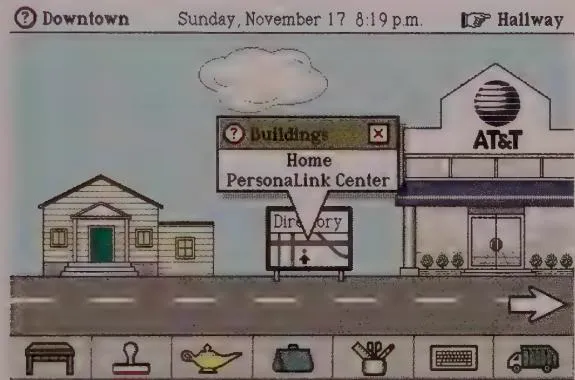

# METAPHORS, IDIOMS, AND AFFORDANCES

When the first edition of this book was published, interface designers often spoke of finding the right visual and behavioral metaphors on which to base their interface designs. In that decade or two following the introduction of the Apple Macintosh, it was widely believed that filling interfaces with visual representations of familiar objects from the real world would give users a pipeline to easy learning. As a result, designers created interfaces resembling offices filled with desks, file cabinets, telephones, and address books, or pads of paper, or a street with signs and buildings.

With the advent of Android, Windows Phone, and iOS 7, we have officially passed into a post-metaphorical era of interaction design. Gone are the skeuomorphisms and overwrought visual metaphors from the early days of desktop software and handheld devices. Modern device user interfaces (UIs) (and, increasingly, desktop UIs as well) are properly content- and data-centric, minimizing the cognitive footprint of UI controls almost to a fault.

This recent shift away from metaphor was long overdue, and for good reason: Strict adherence to metaphors ties interfaces unnecessarily tightly to the workings of the physical world. One of the most fantastic things about digital products is that the working model presented to users need not be bound by the limitations of physics or the inherent clumsiness of mechanical systems and 3D real-world objects mapped to 2D control surfaces.

User interfaces based on metaphors have a host of other problems as well. There aren't enough good metaphors to go around, they don't scale well, and the users' ability to recognize them is often questionable, especially across cultural boundaries. Metaphors, especially physical and spatial metaphors, have a limited place in the design of most digital products. In this chapter, we discuss the reasons for this, as well as the modern replacements for design based on metaphors.

# Interface Paradigms

The three dominant paradigms in the conceptual and visual design of user interfaces are implementation-centric, metaphoric, and idiomatic. The implementation-centric interfaces are based on understanding how things actually work under the hood—a difficult proposition. Metaphoric interfaces are based on intuiting how things work—a risky method. Idiomatic interfaces, however, are based on learning how to accomplish things—a natural, human process.

Historically, the field of interaction design has progressed from a heavy focus on technology (implementation), to an equally heavy focus on metaphor, and, most recently, to a more idiomatic focus. Although many examples of all three types of interface paradigms still are in use today, the most modern, information-centric interface designs in common use on computers, phones, tablets, and other devices are primarily idiomatic in nature.

# Implementation-centric interfaces

Implementation-centric user interfaces are still widespread, especially in enterprise, medical, and scientific software. Implementation-centric software shows us, without any hint of shame, precisely how it is built. There is one button per function and one dialog per module of code, and the commands and processes precisely echo the internal data structures and algorithms. The side effect of this is that we must first learn how the software works internally to successfully understand and use the interface. Following the implementation-centric paradigm means user-interface design that is based exclusively on the implementation model.

Clearly, implementation-centric interfaces are the easiest to build. Every time a developer writes a function, he slaps on a bit of user interface to test that function. It's easy to debug, and when something doesn't behave properly, it's easy to troubleshoot. Furthermore, engineers like to know how things work, so the implementation-centric paradigm is very satisfying to them. Engineers prefer to see the virtual gears and levers and valves because this helps them understand what is going on inside the machine. But those artifacts needlessly complicate things for users. Engineers may want to understand the inner workings, but most users don't have either the time or desire. They'd much rather be successful than knowledgeable, a preference that is often hard for engineers to understand.

A close relative of the implementation-centric interface worth mentioning is the "orgchart-centric" interface. This is a common situation in which a product or, most typically, a website is not organized according to how users are likely to think about information. Instead, it is organized by which part of the company or organization owns whatever piece of information the user is looking to access. Such a site typically has a tab or area for each corporate division, and there is a lack of cohesion between these areas. Usually there is no coordinated design between intracorporate fiefdoms in these situations. Similar to the implementation-centric product interface, an org-chart-centric website requires users to understand how a corporation is structured so that they can find the information they are interested in, and that information is often unavailable to those same users.

# Metaphoric interfaces

Metaphoric interfaces rely on the real-world connections users make between the visual cues in an interface and its function. Since there was less of a need to learn the mechanics of the software, metaphoric interfaces were a step forward from implementation-centric interfaces. However, the power and utility of heavily metaphoric interfaces were, at least for a time, inflated to unrealistic proportions.

When we talk about a metaphor in the context of user interface and interaction design, we really mean a visual metaphor that signals a function: a picture used to represent the purpose or attributes of a thing. Users recognize the metaphor's imagery. By extension, it is presumed that they can understand the purpose of the thing. Metaphors can range from tiny icons on toolbar buttons to the entire screen on some applications—from a tiny pair of scissors on a button, indicating Cut, to a full-size checkbook in Quicken.

# Instinct, intuition, and learning

In the computer industry, and particularly in the user-interface design community, the word intuitive is often used to mean easy to use or easy to understand. This term has become closely associated with metaphorical interfaces.

We do understand metaphors intuitively, but what does that really mean? Webster's Dictionary defines intuition like this:

in-tu-i-tion | in-tü- i-shən| n 1 : quick and ready insight 2 a : immediate apprehension or cognition b : knowledge or conviction gained by intuition c : the power or faculty of attaining to direct knowledge or cognition without evident rational thought and inference

This definition doesn't say much about how we intuit something. In reality, no magical quality of "intuitiveness" makes things easy to use. Instead, there are concrete reasons why people grasp some interfaces and not others.

Certain sounds, smells, and images make us respond without any previous conscious learning. When a child encounters an angry dog, she instinctively knows that bared teeth signal danger, even without any previous learning. Instinct is a hardwired response that involves no conscious thought.

Examples of instinct in human-computer interaction include how we are startled by unexpected changes in the image on our computer screen, how we find our eyes drawn to a flashing advertisement on a web page, and how we react to sudden noises from our computer or the haptic vibrations of our video-game controller.

Intuition, unlike instinct, works by inference, in which we see connections between disparate subjects and learn from these similarities while not being distracted by their differences. We grasp the meaning of the metaphoric elements of an interface because we mentally connect them with other things we have previously learned in the world.

You intuit how to use a wastebasket icon, for example, because you once learned how a real wastebasket works, thereby preparing your mind to make the connection years later. You didn't intuit how to use the original wastebasket. It was just an easy thing to learn.

Metaphorical interfaces are an efficient way to take advantage of the awesome power of the human mind to make inferences. However, this approach also depends on the idiosyncratic minds of users, which may not have the requisite language, learned experiences, or inferential power necessary to make those connections. Furthermore, metaphorical approaches to interface design have other serious problems, as we shall soon see.

# The tyranny of the global metaphor

The most significant problem with metaphors is that they tie our interfaces to Mechanical Age artifacts. An extreme example of this was Magic Cap, the operating system for a handheld communicator. It was introduced by a company called General Magic, founded by Macintosh software gurus Andy Hertzfeld and Bill Atkinson. It was ahead of its time in overall concept, with its remarkably usable touchscreen keyboard and address book nearly 15 years before the iPhone.

Unfortunately, it relied on metaphors for almost every aspect of its interface. You accessed your messages from an inbox or a notebook on a desk. You walked (virtually) down a hallway lined with doors representing secondary functions. You went outside to

access third-party services, which, as shown in Figure 13-1, were represented by buildings on a street. You entered a building to configure a service, and so on.

Relying heavily on a metaphor such as this means that you can intuit the software's basic functions. But the downside is that, after you understand its function, the metaphor adds significantly to the overhead of navigation. You must go back out onto the street to configure another service. You must go down the hallway and into the game room to play Solitaire. This may be normal in the physical world, but there is no reason for it in the world of software. Why not abandon this slavish devotion to metaphor and give the user easy access to functions? It turns out that a General Magic developer later created a bookmarking shortcut facility as a kludgy add-on, but alas, it was too little, too late.

  
Figure 13-1: The Magic Cap interface from General Magic was used in products from Sony and Motorola in the mid-1990s. It is a tour de force of metaphoric design. All the navigation in the interface, and most other interactions as well, were subordinated to the maintenance of spatial and physical metaphors. It was probably fun to design but was not particularly convenient to use after you became an intermediate. This was a shame, because some of the lower-level, nonmetaphoric data-entry interactions were quite sophisticated, well designed, and ahead of their time.

General Magic's interface relied on what is called a global metaphor. This is a single, overarching metaphor that provides a framework for all the other metaphors in the system. It might work for a video game, but much less so for anything where efficiency is a concern.

The hidden problem of global metaphors is the mistaken belief that other lower-level metaphors consistent with them enjoy cognitive benefits by association. It's impossible to resist stretching the metaphor beyond simple function recognition: That software

telephone also lets us dial with buttons just like those on our desktop telephone. We see software that has an address book of phone numbers just like those in our pocket and purse. Wouldn't it be better to go beyond these confining, Industrial Age technologies and deliver some of the computer's real power? Why shouldn't our communications software allow multiple connections or make connections by organization or affiliation, or just hide the use of phone numbers?

Alexander Graham Bell would have been ecstatic if he could have created a phone that let you call your friends just by pointing to pictures of them. He couldn't do so because he was restricted by the dreary realities of electrical circuits and Bakelite moldings. On the other hand, today we have the luxury of rendering our communications interfaces in any way we please. Showing pictures of our friends is completely reasonable. In fact, it's what modern phone interfaces like the iPhone do.

For another example of the problematic nature of extending metaphors, we need look no further than the file system and its folder metaphor. As a mechanism for organizing documents, it is quite easy to learn and understand because of its similarity to a physical file folder in a file cabinet. Unfortunately, as is the case with most metaphoric user interfaces, it functions a bit differently than its real-world analog, which has the potential to create cognitive friction on the part of users. For example, in the world of paper, no one nests folders 10 layers deep. This fact makes it difficult for novice computer users to come to terms with the navigational structures of an operating system.

Implementing this mechanism also has limiting consequences. In the world of paper, it is impossible for a document to be located in two different places in a filing cabinet. As a result, filing is executed with a single organization scheme (such as alphabetically by name or numerically by account number). Our digital products are not intrinsically bound by such limitations. But blind adherence to an interface metaphor has drastically limited our ability to file a single document according to multiple organization schemes.

