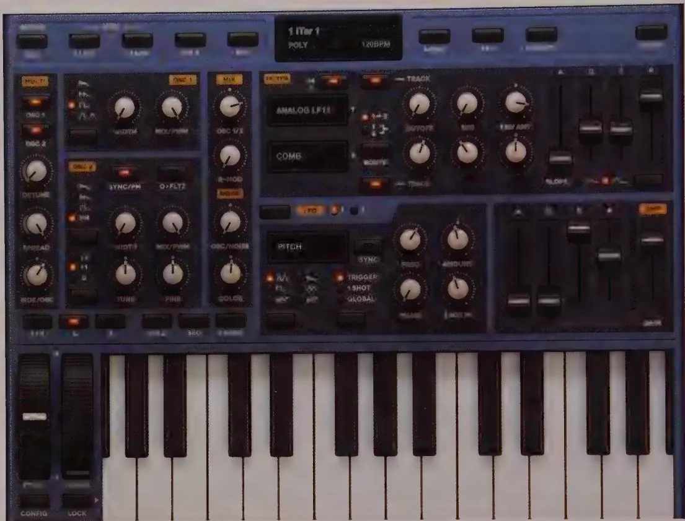
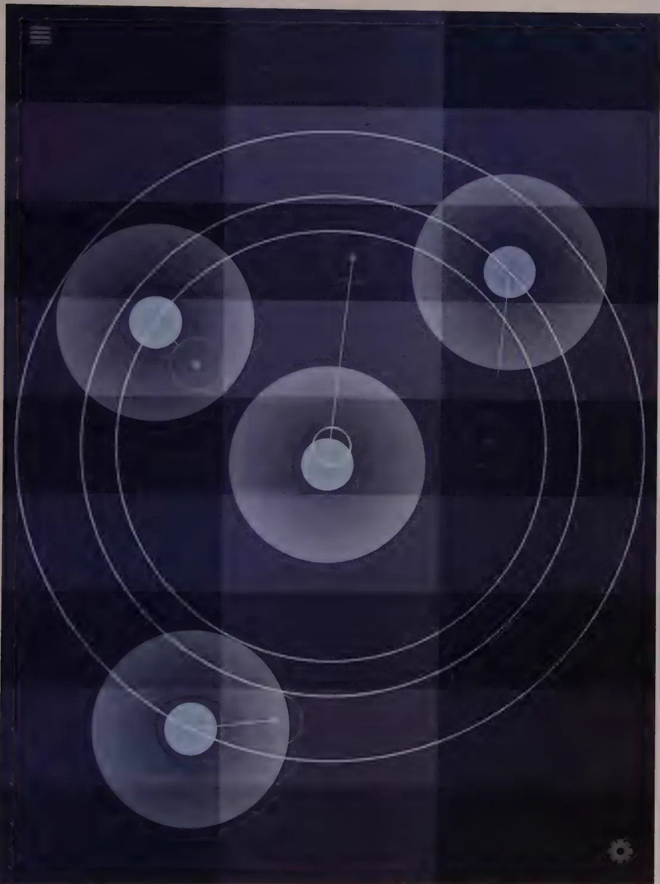
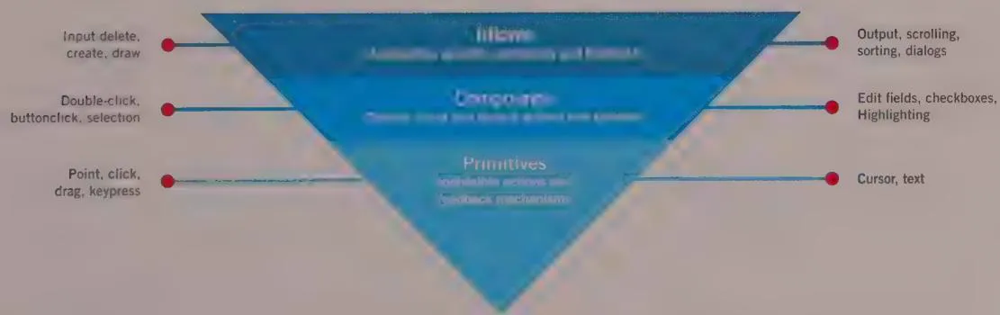
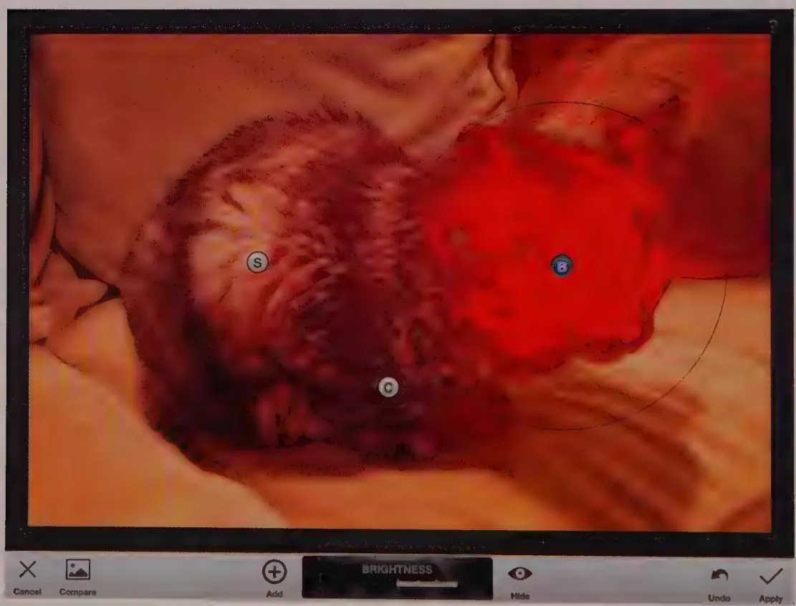
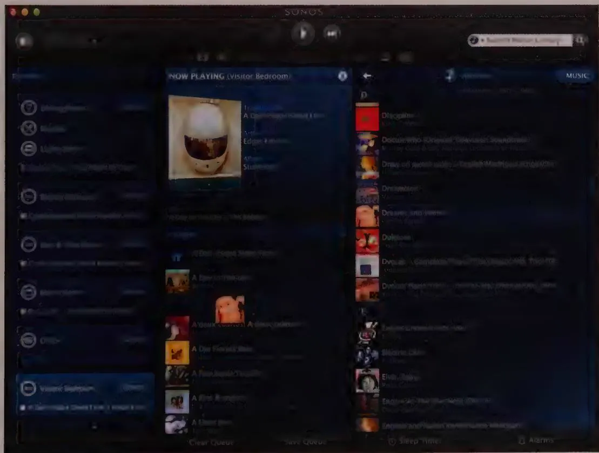
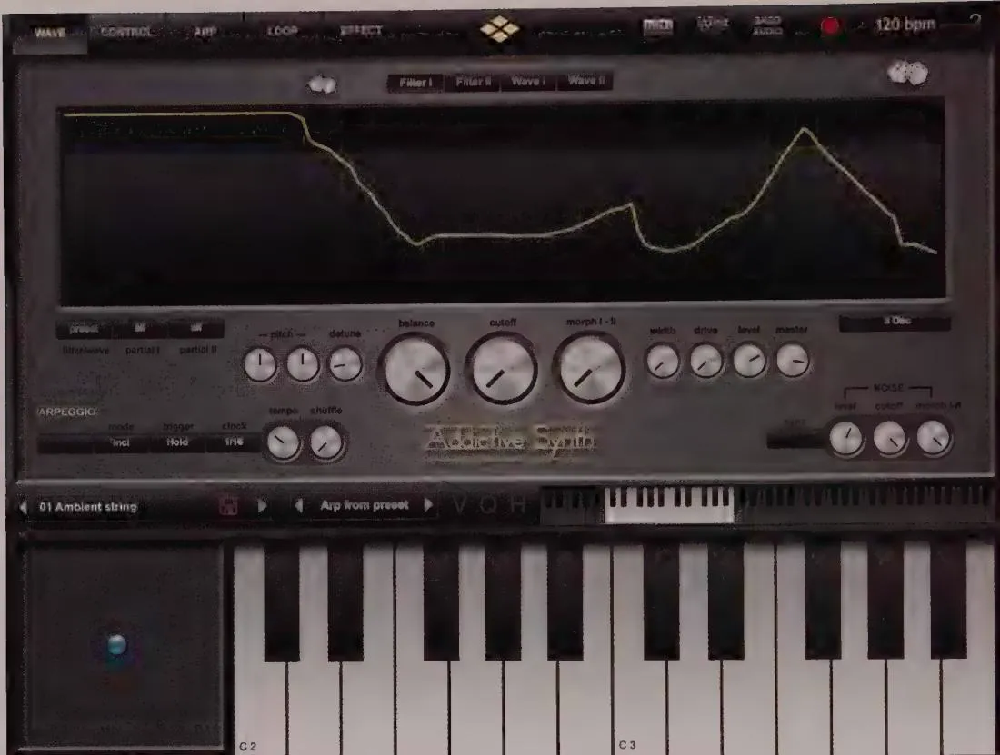
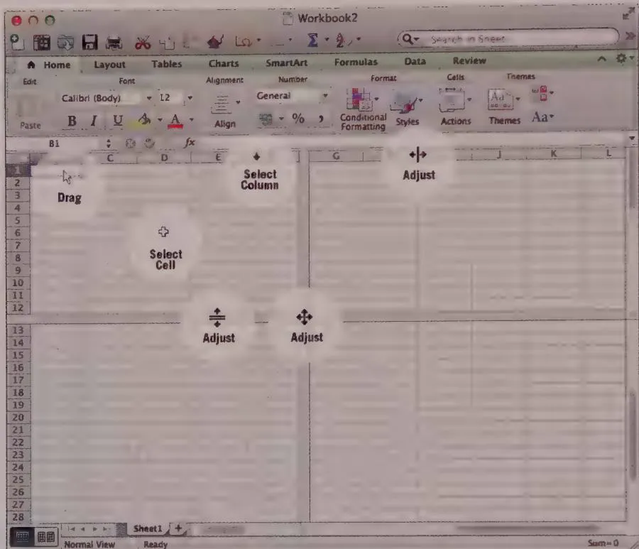

# DESIGN PRINCIPLE

Never bend your interface to fit a metaphor.

As Brenda Laurel described in Computers as Theatre (Addison-Wesley, 2013), "Interface metaphors rumble along like Rube Goldberg machines, patched and wired together every time they break, they are so encrusted with the artifacts of repair that we can no longer interpret them or recognize their referents." Of all the misconceptions to emerge from Xerox PARC, the desirability of global metaphors is perhaps the most debilitating and unfortunate.

# Other limitations of metaphors

Metaphors have many other limitations when applied to modern Information Age systems. For one thing, metaphors don't scale very well. A metaphor that works well for a simple process in a simple application often fails to work well as that process grows in size or complexity. Large desktop file icons as a means of accessing and manipulating files were a good idea when computers had floppy drives or 20 MB hard drives with only a couple of hundred files. But in these days of terabyte hard drives and tens of thousands of files, file icons become too clumsy to use effectively by themselves as a means for moving files around.

Next, while it may be easy to discover visual metaphors for physical objects like printers and documents, it can be difficult or impossible to find metaphors for processes, relationships, services, and transformations—the most frequent uses of software. It can be daunting to find a useful visual metaphor for changing channels, purchasing an item, finding a reference, setting a format, changing a photograph's resolution, or performing statistical analysis. Yet these operations are the types of processes we use software to perform most frequently.

Metaphors also rely on associations perceived in similar ways by both the designer and the user. If the user doesn't have the same cultural background as the designer, metaphors can fail. Even in the same or similar cultures, significant misunderstandings can occur. Does a picture of an airplane in an airline app mean "Check flight arrival information" or "Make a reservation"?

Finally, although a metaphor is easier for first-time users to understand, it exacts a tremendous cost after they become intermediates. By reflecting the physical world of mechanisms, most metaphors firmly nail our conceptual feet to the ground, forever limiting the power of our software. It is almost always better to design idiomatically, using metaphors only when a truly appropriate and powerful one falls in our lap.

# Exceptions to the rule

Although metaphorical and skeuomorphic user interfaces should, generally speaking, be avoided, there are always exceptions to the rule. Video games often employ diegetic interfaces to keep players in the game world. Simulation software, such as flight simulators, intentionally use controls resembling their real-world counterparts. Another genre of software that makes heavy use of metaphoric interfaces is music creation software. While simulating piano keys, drum pads, synthesizer knobs and sliders, or even the frets and strings of a guitar may seem a bit silly in a mouse-driven desktop interface, it feels quite different on a multitouch iPad screen. There the expressiveness of a virtual instrument can begin to match the expressiveness of a real-world one, as shown in Figure 13-2.

  
Figure 13-2: Sunrizer is an iPad synthesizer that closely resembles its hardware brethren. On a touchscreen, simulated knobs and sliders make sense if your users are accustomed to hardware user interfaces, since the interaction with them is so similar to the real-world interactions. However, the creators of Sunrizer have not become slaves to the global metaphor, but have rather improved on the real world as only a digital interface can. Swiping left or right on the keyboard slides higher or lower octave keys into view, effectively removing the limitations of screen width.

On the other hand, digital musical instruments don't require the use of metaphor to be successful or expressive. TC-11 is an iPad synthesizer that uses an abstract, idiomatic interface that is both unique and extremely expressive, as shown in Figure 13-3.

As people increasingly make use of multi-touch displays in place of hardware-controlled gadgets, tools, and instruments, it's reasonable to expect that real-world metaphors will eventually fade and be supplanted by idiomatic interfaces more optimized to expressive gestures. We'll discuss what it means to create idiomatic interfaces in the next section.

  
Figure 13-3: TC-11 takes a completely different approach to creating an expressive digital instrument. It sports a unique, abstract, and completely idiomatic user interface in which the user must learn by exploring the tonal and visual effects created by touching and gesturing. It even includes a sophisticated patch editor for building new sounds and interactions.

# Idiomatic interfaces

Idiomatic design, what Ted Nelson has called "the design of principles," is based on how we learn and use idioms—figures of speech like "beat around the bush" and "cool." Idiomatic user interfaces solve the problems of the previous two interface types by focusing not on technical knowledge or intuition of function, but rather on the learning of simple, non-metaphorical visual and behavioral idioms to accomplish goals and tasks.

Idiomatic expressions don't provoke associative connections like metaphors do. There is no bush, and nobody is beating anything. Idiomatically speaking, something can be both cool and hot and be equally desirable. We understand the idiom simply because we have learned it and because it is distinctive, not because it makes subliminal connections in our minds. Yet we all can rapidly memorize and use such idioms: We do so almost without realizing it.

If you cannot intuit an idiom, neither can you reason it out. Our language is filled with idioms that, if you haven't been taught them, make no sense. If someone says "Uncle Joe kicked the bucket," you know what he means even though no bucket or kicking is involved. You can't figure it out by thinking through the various permutations of smacking pails with your feet. You can learn the meaning of this expression only from context in something you read or by being explicitly taught it. You remember this obscure connection between buckets, kicking, and dying only because humans are good at remembering things like this.

The human mind has a truly amazing capacity to learn and remember large numbers of idioms quickly and easily, without relying on comparisons to known situations or an understanding of how or why they work. This is a necessity, because most idioms don't have metaphoric meaning, and the stories behind most others were lost ages ago.

# Graphical interfaces are largely idiomatic

It turns out that most of the elements of intuitive graphical interfaces are actually visual idioms. Windows, title bars, close boxes, screen splitters, hyperlinks, and drop-downs are things we learn idiomatically rather than intuit metaphorically. OS X's use of a trash can to unmount an external FireWire disk before removing it is purely idiomatic (and many designers consider it a poor idiom), despite the visual metaphor of the trash can.

The mouse input devices used by most personal computers are not metaphoric of anything, but rather are learned idiomatically. Nothing about the mouse's physical appearance indicates its purpose or use, nor is it comparable to anything else in our experience, so learning it is not intuitive. (Even the name "mouse" is rather unhelpful in that regard.)

In a scene from the movie Star Trek IV: The Voyage Home, Scotty (one of the best engineers from the 23rd century) comes to 20th-century Earth and tries to use a computer.

He picks up the mouse, holds it to his mouth, and speaks into it. This scene is funny and believable: The mouse has no visual affordance that it is a pointing device. However, as soon as you slide the mouse around on your desktop, you see a visual symbol, the cursor, move around on the computer screen in the same way. Move the mouse left, and the cursor moves left; move the mouse forward, and the cursor moves up. As you first use the mouse, you immediately get the sensation that the mouse and cursor are connected. This sensation is extremely easy to learn and equally hard to forget. That is idiomatic learning.

Modern multi-touch user interfaces, seen on most smartphones and tablets, also are idiomatic. (Although touching objects on the screen to activate them is intuitive, the gestural idioms must all be learned.) This is becoming even more true as the skeuomorphisms once popularized by Apple have increasingly been replaced with flatter and graphically simpler layouts and controls. Touch gestures, when designed correctly, can be learned even more easily than mouse movements. This is because you have more direct ability to manipulate objects on-screen with your fingers rather than via the virtual proxy of a mouse cursor.

Ironically, many of the familiar graphical UI elements that have been historically thought of as metaphoric are actually idiomatic. Artifacts like resizeable windows and endlessly nested file folders are not really metaphoric, because they have no parallel in the real world. They derive their strength only from their easy idiomatic learnability.

# Good idioms must be learned only once

We are inclined to think that learning interfaces is hard because of our conditioning based on experience with implementation-centric software. These interfaces are very hard to learn because you need to understand how the software works internally to use them effectively. Most of what we know we learn without understanding: things like faces, social interactions, attitudes, melodies, brand names, the arrangement of rooms and furniture in our house and office. We don't understand why someone's face is composed the way it is, but we know that face. We recognize it because we have looked at it and have automatically (and easily) memorized it.

All idioms must be learned; good idioms need to be learned only once.

The key observation about idioms is that although they must be learned, they are very easy to learn, and good ones need to be learned only once. It is quite easy to learn idioms like "neat" or "politically correct" or "the lights are on but nobody's home" or "in a pickle" or "take the red-eye" or "grunge." The human mind can pick up idioms like these from a single hearing. It is similarly easy to learn idioms like radio buttons, close boxes, dropdown menus, and combo boxes.

# Branding and idioms

Marketing and advertising professionals understand well the idea of taking a simple action or symbol and imbuing it with meaning. After all, synthesizing idioms is the essence of product branding, in which a company takes a product or company name and imbues it with a desired meaning. The example of an idiomatic symbol shown in Figure 13-4 illustrates its power.

  
Figure 13-4: This idiomatic symbol has been imbued with meaning from its use, rather than by any connection to other objects. For anyone who grew up in the 1950s and 1960s, this otherwise meaningless symbol has the power to evoke fear because it represents nuclear radiation. Visual idioms, such as the American flag, can be just as powerful as metaphors, if not more so. The power comes from how we use them and what we associate with them, rather than from any innate connection to real-world objects.

# Building Idioms

When graphical user interfaces were invented, they were so clearly superior that many observers credited their success to the interfaces' graphical nature. This was a natural, but incorrect, assumption. The first graphical UIs, such as the original Mac OS, were better primarily because the graphical nature of their interfaces required a restriction of the range of vocabulary by which the user interacted with the system. In particular, the input they could accept from the user went from an unrestricted command line to

a tightly restricted set of mouse-based actions. In a command-line interface, users can enter any combination of characters in the language—a virtually infinite number. For a user's entry to be correct, he needs to know exactly what the application expects. He must remember the letters and symbols with exacting precision. The sequence can be important. Sometimes even capitalization matters.

In modern desktop UIs, users can point to images or words on the screen with the mouse cursor. Most of these choices migrated from the users' heads to the screen, eliminating any need to memorize them. Using the mouse buttons, users can click, double-click, or click and drag. The keyboard is used for data entry, but typically not for command entry or navigation. The number of atomic elements in users' input vocabulary has dropped from dozens to just three. This is true even though the range of tasks that can be performed by modern software apps isn't any more restricted than that of command-line systems.

The more atomic elements an interaction vocabulary has, the more time-consuming and difficult the learning process is. Restricting the number of elements in our interaction vocabulary reduces its expressiveness at the atomic level. However, more-complex interactions can easily be built from the atomic ones, much like letters can be combined to form words, and words to form sentences.

A properly formed interaction vocabulary can be represented by an inverted pyramid. All easy-to-learn communications systems obey the pattern shown in Figure 13-5. The bottom layer contains primitives, the atomic elements of which everything in the language is composed. In modern desktop graphical UIs, these primitives consist of positioning the mouse, clicking, and tapping a key on the keyboard. In touch-gesture systems they consist of tapping and dragging.

  
Figure 13-5: One of the primary reasons that graphical UIs are easy to use is that they enforce a restricted interaction vocabulary that builds complex idioms from a very small set of primitives: pointing, clicking, and dragging. These primitives can build a larger set of simple compounds. These in turn can be assembled into a wide variety of complex, domain-specific idioms, all of which are based on the same small set of easily learned actions.

The middle layer contains compounds. These are more complex constructs created by combining one or more of the primitives. They include simple visual objects such as text display; actions such as double-clicking, dragging, swiping, and pinching; and manipulable objects like buttons, check boxes in a form, links, and resize handles.

The uppermost layer contains idioms. Idioms combine and structure compounds using domain knowledge of the problem under consideration: information related to the user's work patterns and goals, not specifically to the computerized solution. The set of idioms opens the vocabulary to information about the particular problem the application is trying to address. In a graphical UI, it includes things like labeled buttons and fields, navigation bars, list boxes, icons, and even groups of fields and controls, or entire panes and dialogs.

Any language that does not follow this form will be very hard to learn. Many effective communications systems outside the computer world use similar vocabularies. Street signs in the U.S. follow a simple pattern of shapes and colors: Yellow triangles are cautionary, red octagons are imperatives, and green rectangles are informative.

# Manual Affordances

In his seminal book *The Design of Everyday Things* (Basic Books, 2002), Donald Norman gives us the term *affordance*, which he defines as "the perceived and actual properties of the thing, primarily those fundamental properties that determine just how the thing could possibly be used."

This concept is essential to the practice of interface design. But for our purposes, the definition omits a key connection: How do we know what those properties offer us? If you look at something and understand how to use it--you comprehend its affordances--you must be using some method to make the mental connection.

Therefore, we propose altering Norman's definition by omitting the phrase "and actual." When we do this, affordance becomes a purely cognitive concept, referring to what we think the object can do rather than what it actually can do. If a pushbutton is placed next to the front door of a residence, its affordances are 100 percent doorbell. If, when we push it, it causes a trapdoor to open and we fall into it, it turns out that it wasn't a doorbell, but that doesn't change its affordance as one.

So how do we know it's a doorbell? Because we have learned about doorbells, door etiquette, and pushbuttons from our complex and lengthy socialization process. We have learned about this class of pushable objects by being exposed to electrical and electronic devices in our environs and because—years ago—we stood on doorsteps with our parents, learning how to approach another person's home.

But another force is at work here too. If we see a pushbutton in an unlikely place such as the hood of a car, we cannot imagine what its purpose is, but we do recognize it as a pushable object. How do we know this? Undoubtedly, we recognize it because of our tool-manipulating instincts. When we see round, slightly concave, finger-sized objects within reach, we develop an urge to push them. (You can easily observe this behavior in any two-year-old.) We see objects that are long and rounded, and we wrap our fingers around them and grasp them like handles. This is what Norman is getting at with his term affordance. For clarity, however, we'll rename this instinctive understanding of how objects are manipulated with our hands manual affordance. When artifacts are clearly shaped to fit our hands or body, we recognize that they can be manipulated directly and require no written instructions. In fact, this act of understanding how to use a tool based on the relationship of its shape to our hands is a clear example of intuiting an interface.

Norman discusses at length how manual affordances are much more compelling than written instructions. A typical example he uses is a door that must be pushed open using a metal bar for a handle. The bar is just the right shape and height and is in the right position to be grasped by the human hand. The door's manual affordances scream, "Pull me!" No matter how often someone uses this diabolical door, he will always attempt to pull it open, because the affordances are strong enough to drown out any number of signs affixed to the door saying Push.

There are only a few manual affordances. We grip handle-shaped things with our hands; if they are small, we pinch or push them with our fingers. We pull along lines and turn around axes. We push flat plates with our hands or fingers. If they are on the floor, we push them with our feet. We rotate round things, using our fingers for small things—like dials—and both hands on larger things, like steering wheels. Such manual affordances are the basis for much of our visual user interface design.

The design of widgets for older operating system interfaces like Windows 7 and OS X relied on shading, highlighting, and shadows to make screen images appear more dimensional. These so-called skeuomorphic clues have fallen out of fashion with Android Kitkat, Windows 8, and OS Mavericks, but where they appear they offer virtual manual affordances in the form of button-like images that say "push me" or "slide me" to our tool-manipulating brains. Recent trends in flattened, visually minimal user interfaces threaten ease of use by removing these virtual manual affordances in the service of visual simplification.

# Semantics of manual affordances

What's missing from an unadorned, virtual manual affordance is any idea of what function it performs. We can see that it looks like a button, but how do we know what it will accomplish when we press it? Unlike mechanical objects, you can't figure out a virtual lever's function just by tracing its connections to other mechanisms. Software can't be

casually inspected in this manner. Instead, we must rely on either supplementary text and images or, most often, our previous learning and experience. The Windows 7 scrollbar's affordance clearly shows that it can be manipulated. But the only things about it that tells us what it does are the arrows (frequently missing in mobile apps), which hint at its directionality. To know that a scrollbar controls our position in a document, we either have to be taught or learn through experimentation.

Controls must have text or iconic labels on them to make sense. If the answer isn't suggested by the control, we can only learn what it does by one of two methods: experimentation or training. We either read about it somewhere, ask someone, or try it and see what happens. We get no help from our instinct or intuition. We can only rely on the empirical.

# Fulfilling expectations of affordances

In the real world, an object does what it does as a result of its physical form and its connections with other physical objects. A saw can cut wood because its serrations are sharp, its blade is flat, and it has a handle. A knob can open a door because it is connected to a latch. However, in the digital world, an object does what it does because a developer imbued it with the power to do something. We can discover a great deal about how a saw or a knob works by physical inspection, and we can't easily be fooled by what we see. On a computer screen, though, we can see a raised three-dimensional rectangle that clearly wants to be pushed like a button, but this doesn't necessarily mean that it should be pushed. It could do almost anything. We can be fooled because there is no natural connection—as there is in the real world—between what we see on the screen and what lies behind it. In other words, we may not know how to work a saw, and we may even be frustrated by our inability to manipulate it effectively, but we will never be fooled by it. It makes no representations that it doesn't live up to. On computer screens, false impressions are very easy to create inadvertently.

When we render a button on the screen, we are making a contract with the user that that button will change visually when she pushes it: It will appear to be actuated when tapped or when the user clicks while the mouse cursor hovers over it. Furthermore, the contract states that the button will perform some reasonable work that is accurately described by its legend. This may sound obvious, but it is astonishing how many applications offer bait-and-switch manual affordances. This is relatively rare for pushbuttons but is all too common for other controls, especially on websites where the lack of affordances can make it difficult to differentiate between controls, content, and ornamentation. Make sure that your application delivers on the expectations it sets via the use of manual affordances.

# Direct Manipulation and Pliancy

Modern graphical user interfaces are founded on the concept of direct manipulation of graphical objects on the screen: buttons, sliders, menus, and other function controls, as well as icons and other representations of data objects. The ability to select and modify objects on the screen is fundamental to the interfaces we design today. But what is direct manipulation, exactly?

In 1974, Ben Shneiderman coined the term "direct manipulation" to describe an interface design strategy consisting of three important components:

- Visual representation of the data objects that an application is concerned with   
- Visible and gestural mechanisms for acting on these objects (as opposed to free-form text commands)   
- Immediately visible results of these actions

It's worth noting that two of his three points concern the visual feedback the application offers to users. It might be more accurate to call it "visual manipulation" because of the importance of what users see during the process. Virtual manual affordances and rich visual feedback are both key elements in the design of direct manipulation interfaces.

Rich visual feedback is the key to successful direct manipulation.

Interactions that are not implemented with adequate visual feedback will fail to effectively create the experience of direct manipulation.

# Uses of direct manipulation

Using direct manipulation, we can point to what we want. If we want to move an object from A to B, we click or tap it and drag it there. As a general rule, the better, more flow-inducing interfaces are those with plentiful and sophisticated direct manipulation idioms.

Authoring tools do this pretty well. For example, most word processors let you set tabs and indentations by dragging a marker on a ruler. Someone can say, in effect, "Here is where I want the paragraph to start." The application then calculates that this is precisely 1.347 inches from the left margin instead of forcing the user to enter 1.347 in some text box somewhere.

Similarly, most art and design tools (such as Adobe's Creative Suite) provide a high degree of direct manipulation of objects (although many parameters of the click-and-type variety remain). Google's Snapseed photo editor is a great example of a consumer-focused multi-touch app that employs direct manipulation to good effect. Gestures control image processing parameters for digital photo editing instead of cumbersome sliders or numeric text fields.

Figure 13-6 shows how multiple control points can be placed or selected by tapping. These points can be moved by dragging; and pinching on the currently selected point adjusts the diameter of the applied filter, with feedback to the user in the form of a circle and red tint to show the extent of the filter's application. Swiping horizontally controls the intensity of the filter, tracked both by the green meter surrounding the point, and the numeric scale at the bottom of the screen. Vertical swiping selects between brightness, contrast, and saturation. While this is a lot of functionality to build into gestures, it becomes second nature after a few uses due to the rich visual modeless feedback and fluidity with which images can be adjusted.

  
Figure 13-6: Google's Snapseed photo editor for the iPad uses gestural controls to position and manipulate visual effects parameters via tapping, pinching, twirling, and swiping. Numeric feedback is provided in addition to real-time previewing, but no textual numeric entry is required or, in fact, even allowed—not that it is missed.

The principle of direct manipulation applies in a variety of situations. When items in a list need to be reordered, the user may want them ordered alphabetically, but he also may want them in order of personal preference—something no algorithm can offer. A user should be able to drag the items into the desired order directly, without an algorithm's interfering with this fundamental operation.

Drag and drop can also save the user from tiresome and repetitive use of dialogs and menus. In the Sonos Desktop Controller, shown in Figure 13-7, users can drag songs directly to any location in the current play queue or instead drag them to any speaker in the house for immediate playback. They don't have to open a menu and choose options.

You seldom see direct manipulation interfaces for entering complex numeric data. Usually you're given numeric entry fields or sliders. A great example of direct manipulation of graphically presented numeric data is the Addictive Synth app for the iPad, shown in Figure 13-8. It allows you to sketch waveforms and effect parameters for a music synthesizer with your finger and then play the results immediately on the onscreen piano keyboard.

  
Figure 13-7: The Sonos Desktop Controller lets you drag songs and albums from search-and-browse results to anywhere in the playback queue, to the Now Playing area for immediate playback, or to any room in the house. You do so with a single drag-and-drop gesture. Tablet versions of the app also allow similar direct manipulation of music.

  
Figure 13-8: Addictive Synth is an iPad music synthesizer that allows users to draw their own waveforms and audio effects curves with their finger and then hear the results in real time. There's a reason for the app's name: The experience is immersive and satisfying.

Direct manipulation is simple, straightforward, easy to use, and easy to remember. However, as we have discussed, direct-manipulation idioms—like most other idioms—must first be learned. Luckily, because the visible and direct nature of these interactions bears a close resemblance to interactions with objects in the physical world, learning the idioms usually is easy. After you learn them, you seldom forget them.

# Direct manipulation isn't always appropriate

Apple's Human Interface Style Guide has this to say about direct manipulation: "Users want to feel that they are in charge of the computer's activities." iOS user interfaces make it clear that Apple believes in direct manipulation as a fundamental tenet of interaction design. On the other hand, user-centered design expert Don Norman (2002) says, "Direct manipulation, first-person systems have their drawbacks. Although they are often easy to use, fun, and entertaining, it is often difficult to do a really good job with them. They require the user to do the task directly, and the user may not be very good at it." Whom should we believe?

The answer, of course, is both. Direct manipulation is a powerful tool, but it can require skill development for users to become effective at complex tasks (such as designing an airplane using a CAD system). Many direct-manipulation idioms, even relatively mundane ones, require motor coordination and a sense of purpose. For example, even moving files between folders in Windows Explorer can be a complicated task requiring dexterity and foresight. Keep these challenges in mind as you design direct-manipulation idioms. Some amount of direct manipulation is usually a good thing, but depending on your personas' skills and usage contexts, it's also possible to go overboard. You should always consider what your personas need to manipulate manually, and what the application can assist them with, either via guides and hints or automatically.

# Pliancy and hinting

Returning to Norman's concept of affordance, it's critical to visually communicate to users how interface elements can be directly manipulated. We use the term pliant to refer to objects or screen areas that react to input and that the user can manipulate. For example, a button control is pliant because it can be "pushed" by a finger or a mouse cursor. Any object that can be dragged is pliant, and every cell in a spreadsheet and every character in a word processor document is pliant.

In most cases, the fact that an object is pliant should be communicated visually to users. The only situation where this isn't true is when you are concerned with presenting rich, complex functionality solely to expert users with no concern about their ability to learn and use the application. In these cases, the screen real estate and visual attention that would otherwise be devoted to communicating pliancy may be more appropriately used elsewhere. Do not make the decision to take this route lightly.

Visually communicate pliancy whenever possible.

There are three basic ways to communicate—or hint at—the pliancy of an object to users:

- Create static visual affordances as part of the object itself.   
- Dynamically change the object's visual affordances in reaction to change in input focus or other system events.   
- In the case of desktop pointer-driven interfaces, change the cursor's visual affordance as it passes over and interacts with the object.

# Static hinting

Static hinting is when an object's pliancy is communicated by the static rendering of the object itself. For example, the faux three-dimensional sculpting of a button control is static visual hinting because it provides (virtual) manual affordance for pushing.

For complex desktop interfaces with a lot of objects and controls, static object hinting can sometimes require an impractical number of rendered screen elements. If everything has a three-dimensional feel to provide affordance, your interface can start to look like a sculpture garden. Dynamic hinting, as we'll discuss in a minute, provides a solution to this problem.

However, static hinting is well-suited for mobile user interfaces. Typically fewer objects are on the screen at any given time, and they must, by necessity, be large enough to manipulate with fingers, leaving ample room for the necessary visual cues of affordance.

Ironically, the current trend in mobile UIs is toward flattening and visually simplifying elements to the point where text, flat monochrome icons, and rectilinear flat buttons and cards are the only visual elements available. This creates many challenges for designers, both from a standpoint of creating visual hierarchy and for indicating pliancy and affordance. The end result is that mobile interfaces are becoming more difficult to learn, even as they are becoming visually simpler.

# Dynamic hinting

Dynamic hinting is most often used in desktop user interfaces. It works like this: When the cursor passes over a pliant object, the object temporarily changes its appearance, as shown in Figure 13-9. This action occurs before any mouse buttons are clicked and is triggered by cursor flyover only. It is commonly called a "rollover." A good example of this is the behavior of icon buttons (see Chapter 21) on toolbars: Although it has no persistent button-like affordance, passing the cursor over any single icon button causes the affordance to appear. The result is a powerful hint that the control has the behavior of a button, and eliminating the persistent affordance dramatically reduces visual clutter on the toolbar.

  
Figure 13-9: The buttons on the left are an example of static visual hinting: Their "clickability" is suggested by the dimensional rendering. The toolbar icon buttons on the right demonstrate dynamic visual hinting: While the Bold toggle doesn't appear to be a button at first glance, passing the mouse cursor over it causes it to change, thereby creating affordance.

<!-- Chunk 7 End -->

<!-- Chunk 8 Start -->

Alas, touchscreen devices have no real equivalent to dynamic object hinting; designers and users must make do with whatever static hinting at pliancy is available to them.

# Pliant response hinting

Desktop pliant response hinting should occur if the mouse cursor is clicked but not released or while a finger is pressed on a control. The control must show that it is poised to undergo a state change (more on this in Chapter 18). This action is important and is often neglected by developers who create their own controls.

A pushbutton needs to change from a visually raised state to a visually indented state; a check box should highlight its box but not show a check just yet. Pliant response is an important feedback mechanism for any control that either invokes an action or changes its state. It lets the user know that some action is forthcoming if she releases the mouse button. Pliant response is also an important part of the cancel mechanism. When the user clicks a button, that button responds by becoming indented. If the user moves the mouse or his finger away from the button while still holding it down, the onscreen button returns to its quiescent, raised state. If the user then releases the mouse button or lifts his finger, the onscreen button is not activated (consistent with the lack of pliant response).

# Cursor hinting

Cursor hinting is another desktop pliancy hinting approach. It communicates pliancy by changing the cursor's appearance as it passes over an object or screen area. For example, when the cursor passes over a window's frame, the cursor changes to a double-headed arrow showing the axis in which the window edge can be stretched. This is the only visual affordance indicating that the frame can be stretched.

Cursor hinting should first and foremost make it clear to users that an otherwise unadorned object is pliant. It is also often useful to indicate what type of direct-manipulation action is possible with an object (such as in the window frame example just mentioned).

Generally speaking, controls should offer static or dynamic visual hinting, whereas pliant (manipulable) data more frequently should offer cursor hinting. For example, it is difficult to make dense tabular data visually hint at pliancy without disturbing its clear representation, so cursor hinting is the most effective method. Some controls are small and difficult for users to spot as readily as a button, and cursor hinting is vital for the success of such controls. The column dividers and screen splitters in Microsoft Excel are good examples, as shown in Figure 13-10.

  
Figure 13-10: Excel uses cursor hinting to highlight several controls that are not obviously pliant by themselves. You can set column width and row height by dragging the short vertical lines between each pair of columns or rows. The cursor changes to a two-headed horizontal arrow that both hints at the pliancy and indicates the permissible drag direction. The same is true for the screen-splitter controls. When the mouse is over an unselected editable cell, it shows the plus cursor, and when it is over a selected cell, it shows the drag cursor.

Again, touchscreen users and designers are out of luck with using this kind of pliancy hinting. As we'll discuss in more detail in Chapter 19, other strategies must be employed in the design of touchscreen apps to ensure that users know what objects they can manipulate, when they can do so, and what actions and gestures are supported.

# Escape the Grip of Metaphor

As you build your app, you may be tempted to look backwards to comfortable visual metaphors in which to immerse your users. Avoid that temptation. Reserve global visual metaphors for those few, special contexts where the metaphor is truly an integral part of the experience. Don't use metaphors as a crutch to support rapid learnability or short-term comfort.

Instead, create memorable and appropriate idioms that make your users more effective and efficient, that are imbued with rich pliant feedback, and that allow users to focus on the content and functionality of your app rather than the confines of outmoded Mechanical Age metaphors and interactions. You'll be doing them a favor as they become the intermediate users they—and you—ultimately hope they will be.

