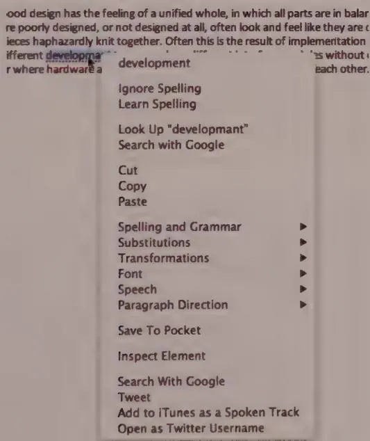
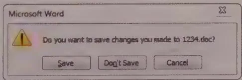
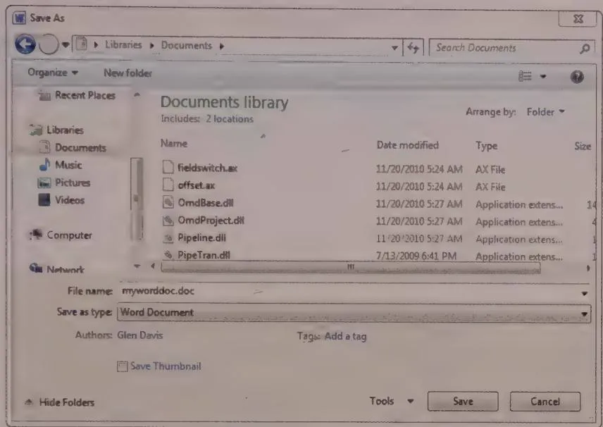
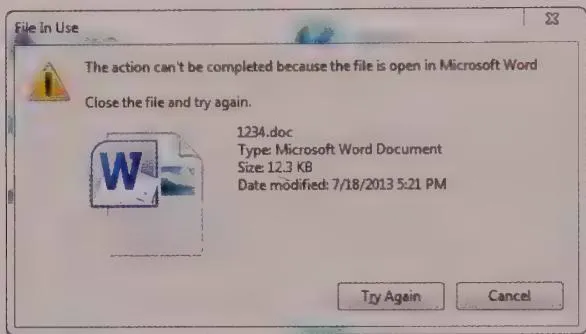

# Rethinking Data Entry

In Chapter 8, we discussed how interactive products should be designed to behave like considerate and intelligent people. One of the ways in which products are least capable in this regard is when the user is required to enter data. Some unfortunate artifacts of implementation-model thinking prevent people from working in the way they find most natural. In this chapter, we'll discuss problems with existing ways of dealing with data entry and some possible strategies for making this process more focused on human needs and less focused on the needs of the database.

# Data integrity versus data immunity

One of the most critical requirements for properly functioning software is clean data. As the aphorism says, "garbage in, garbage out." As a result, developers typically operate according to a simple imperative regarding data entry and data processing: Never allow tainted, unclean data to touch an application. Developers thus erect barriers in user interfaces so that bad data can never enter the system and compromise what is commonly called data integrity.

The imperative of data integrity posits that a world of chaotic information is out there, and before any of it gets inside the computer, it must be filtered and cleaned up. The software must maintain a vigilant watch for bad data, like a customs official at a border crossing. All data is validated at its point of entry. Anything on the outside is assumed to be suspect, and after it has run the gauntlet and been allowed inside, it is assumed to be pristine. The advantage is that once data is inside the database, the code doesn't have to bother with successive, repetitive checks of its validity or appropriateness.

The problem with this approach is that it places the needs of the database before those of its users, subjecting them to the equivalent of a shakedown every time they enter a

scrap of data into the system. You don't come across this problem often with most mobile or personal productivity software: PowerPoint doesn't know or care if you've formatted your presentation correctly. But as soon as you deal with a large corporation—whether you are a clerk performing data entry for an enterprise management system or a web surfer buying DVDs online—you come face to face with the border patrol.

People who fill out lots of forms every day as part of their job know that data typically isn't provided to them in the pristine form that their software demands. It is often incomplete and sometimes wrong. Furthermore, they may break from a form's strict demands to expedite this data processing to make their customers happy. But when confronted with a system that is entirely inflexible in such matters, these people must either grind to a halt or find some way to subvert the system to get things done. If the software recognized these facts of human existence and addressed them directly with an appropriate user interface, everyone would benefit.

Efficiency aside, this problem has a more insidious aspect: When software shakes down data at the point of entry, it makes a clear statement that the user is insignificant and the application is omnipotent—that the user works for the good of the application, not vice versa. Clearly, this is not the kind of world we want to create with our technological inventions. We want people to feel empowered and to make it clear that computers work for us. We must return to the ideal division of digital labor: The computer does the work, and the human makes the decisions.

Happily, there's more than one way to protect software from bad data. Instead of keeping it out of the system, the developer needs to make the system immune to inconsistencies and gaps in the information. This method involves creating much smarter, more sophisticated applications that can handle all permutations of data, giving the application a kind of data immunity.

To implement this concept of data immunity, our applications must be built to look before they leap and to ask for help when they need it. Most software blindly performs arithmetic on numbers without actually examining them first. The application assumes that a number field must contain a number, because data integrity tells it so. If the user enters the word "nine" instead of the number "9," the application barfs. But a human reading the form wouldn't even blink. If the application simply looked at the data before it acted, it would see that a simple math function wouldn't do the trick.

We must design our applications to believe that the user will enter what he means to enter, and if he wants to correct things, he will do so without paranoid insistence. But applications can look elsewhere in the computer for assistance. Is there a module that knows how to make numeric sense of alphabetic text? Is there a history of corrections that might shed some light on a user's intent?

If all else fails, an application must add annotations to the data so that when—and if—the user examines the problem, he finds accurate and complete notes that describe what happened and what steps the application took.

Yes, if the user enters "asdf" instead of "9.38," the application will be unable to achieve satisfactory results. But stopping the application to resolve this right now also is unsatisfactory; the entry process is just as important as the end report. If a user interface is designed correctly, the application provides visual feedback when the user enters "asdf," so it's very unlikely that the user will enter hundreds of bad records. Generally, users act stupidly only when applications treat them stupidly.

When the user enters incorrect data, it is often close to being correct; applications should be designed to provide as much assistance as possible in correcting the situation. For example, if the user erroneously enters "TZ" for a two-letter state code, and also enters "Dallas" for a city name, it doesn't take a lot of intelligence or computational resources to figure out how to correct the problem.

# Handling missing data

It is clearly counter to users' goals—and to the system's utility—if crucial data is omitted. The data-entry clerk who fails to key in something as important as an invoice amount creates a real problem. However, it isn't necessarily appropriate for the application to stop the clerk and point out this failure. Think of your application as being like a car. Your users won't take kindly to having the steering wheel lock up because the car discovered it was low on windshield-washer fluid.

Instead, applications should provide more flexibility. Users may not immediately have access to data for all the required fields, and their workflow may be such that they first enter all the information they have on hand and then return when they have the information needed to fill in the other fields. Of course, we still want our users to be aware of any required fields that are missing information, but we can communicate this to them through rich modeless feedback, rather than stopping everything to let them know something they may be well aware of.

Take the example of a purchasing clerk keying invoices into a system. Our clerk does this for a living and has spent thousands of hours using the application. He has a sixth sense for what is happening on the screen and wants to know if he has entered bad data. He will be most effective if the application notifies him of data-entry errors by using subtle visual and audible cues.

The application should also help him: Data items, such as part numbers, that must be valid shouldn't be entered into free text fields, but instead should be entered via type-ahead (auto-completion) fields or bounded controls such as drop-downs. Addresses and

phone numbers should be entered more naturally into smart text fields that can parse the data. The application should provide unobtrusive modeless feedback on the status of the clerk's work. This will enable him to take control of the situation and will ultimately require less policing by the application.

Most of our information-processing systems do tolerate missing information. A missing name, code, number, or price can almost always be reconstructed from other data in the record. If not, the data can always be reconstructed by asking the various parties involved in the transaction. The cost is high, but not as high as the cost of lost productivity or technical support centers. Our information-processing systems can work just fine with missing data. Some developers who build these systems may not like all the extra work involved in dealing with missing data, so they invoke data integrity as an unbreakable law. As a result, thousands of clerks must interact with rigid, overbearing software under the false rubric of keeping databases from crashing.

It is obviously counterproductive to treat workers like idiots to protect against those few who are. It lowers everyone's productivity; encourages rapid, expensive, and error-causing turnover; and decreases morale, which increases the unintentional error rate of the clerks who want to do well. It is a self-fulfilling prophecy to assume that your information workers are untrustworthy.

The stereotypical role of the data-entry clerk mindlessly keypunching from stacks of paper forms while sitting in a boiler room among hundreds of identical clerks doing identical jobs is rapidly evaporating. The task of data entry is becoming less a mass-production job and more a productivity job—one performed by intelligent, capable professionals and, with the popularization of e-commerce, directly by customers. In other words, the population interacting with data-entry software is increasingly less tolerant of being treated like unambiguous, uneducated, unintelligent peons. Users won't tolerate stupid software that insults them, not when they can push a button and surf for another few seconds until they find another vendor that presents an interface that treats them with respect.

# Data entry and fudgeability

If a system is too rigid, it can't model real-world behaviors. A system that rejects the reality of its users is not helpful, even if the net result is that all its fields are valid. Which is more important, the database or the business it is trying to support? The people who manage the database and create the data-entry applications that feed it often serve only the CPU. This is a significant conflict of interest that good interaction design can help resolve.

Fudgeability can be difficult to build into a computer system because it demands a considerably more capable interface. Our clerk cannot move a document to the top of the queue unless the queue, the document, and its position in the queue can be easily seen. The tools for pulling a document out of the electronic stack and placing it on the

top must also be present and obvious in their functions. Fudgeability also requires facilities to hold records in suspense, but an Undo facility has similar requirements. A more significant problem is that fudging allows possible abuse.

The best strategy to avoid abuse is using the computer's ability to record the user's actions for later examination, if warranted. The principle is simple: Let users do what they want, but keep detailed records of those actions so that full accountability and recovery is possible.

# Auditing versus editing

Many developers believe it is their duty to inform users when they make errors entering data. It is certainly an application's duty to inform other applications when they make an error, but this rule shouldn't necessarily extend to users. The customer is always right, so an application must accept what the user tells it, regardless of what it does or doesn't know. This is similar to the concept of data immunity, because whatever the user enters should be acceptable, regardless of how incorrect the application believes it to be.

This doesn't mean that the application can throw up its hands and say, "All right, he doesn't want a life preserver, so I'll just let him drown." Just because the application must act as though the user is always right doesn't mean that a user actually is always right. Humans often make mistakes, and your users are no exception. User errors may not be your application's fault, but they are its responsibility. How will it fix them?

DESIGN PRINCIPLE

An error may not be your application's fault, but it is its responsibility.

Applications can provide warnings—as long as they don't stop the proceedings with idiocy. But if the user chooses to do something suspect, the application can do nothing but accept that fact and work to protect the user from harm. Like a faithful guide, it must follow its client into the jungle, making sure to bring along a rope and plenty of water.

Warnings should clearly and modelessly tell users what they have done, much as the speedometer silently reports our speed violations. It is unreasonable, however, for the application to stop the proceedings, just as it is not right for the speedometer to cut the gas when we edge above 65 miles per hour. Instead of an error dialog, for example, data-entry fields can highlight any user input the application evaluates as suspect.

When the user does something that the application thinks is wrong, the best way to protect him (unless disaster is imminent) is to make it clear that there may be a problem. This should be done in an unobtrusive way that ultimately relies on the user's intelligence to figure out the best solution. If the application jumps in and tries to fix it, it may

be wrong and end up subverting the user's intent. Furthermore, this approach fails to give the user the benefit of learning from the situation, ultimately compromising his ability to avoid the situation in the future. Our applications should, however, remember each of the user's actions and ensure that each action can be cleanly reversed, that no collateral information is lost, and that the user can figure out where the application thinks the problems might be. Essentially, we maintain a clear audit trail of his actions. Thus the principle "Audit, don't edit."

Audit, don't edit.

Microsoft Word has an excellent example of auditing, as well as a nasty counterexample. This excellent example is how it handles real-time spell checking. As you type, red wavy underlines identify words that the application doesn't recognize, as shown in Figure 14-1. Right-clicking these words pops up a menu of alternatives you can choose from. But you don't have to change anything, and you are not interrupted by dialogs or other forms of modal idiocy.

  
Figure 14-1: Microsoft Word's automatic spell checker audits misspelled words with a wavy red underline, giving users modeless feedback. Right-clicking an underlined word pops up a menu of possible alternatives to choose from. This design idiom has been widely copied by both desktop and mobile apps.

Word's AutoCorrect feature, on the other hand, can be a bit disturbing at first. As you type, it silently changes words it thinks are misspelled. It turns out that this feature is incredibly useful for fixing minor typos as you go. However, the corrections leave no obvious audit trail, so the user often doesn't realize that what he typed has been changed. It would be better if Word could provide some kind of mark that indicates it has made a correction on the off chance that it has miscorrected something. (This possibility becomes much more likely if, for instance, you are writing a technical paper heavy in specialized terminology and acronyms.)

More irksome is Word's AutoFormat feature, which tries to interpret user behaviors like use of asterisks and numbers in text to automatically format numbered lists and other paragraph formats. When this works, it seems magical. But frequently the application does the wrong thing, and once it does so, there is not always a straightforward way to undo the action. AutoFormat tries to be just a bit too smart; it should really leave the thinking to humans. Luckily, this feature can be turned off, and Word provides a special in-place menu that allows users to adjust AutoFormat assumptions.

In the real world, humans accept partially and incorrectly filled-in documents from each other all the time. We make a note to fix the problems later, and we usually do. If we forget, we fix the omission when we eventually discover it. Even if we never fix it, we somehow survive. It's certainly reasonable to use software to improve the efficiency of our data collection efforts, and in many cases it is consistent with human goals to do so. (No one wants to enter the wrong shipping address for an expensive online purchase.) However, our applications can be designed to better accommodate how humans think about such things. The technical goal of data integrity should not be our users' problem to solve.

# Rethinking Data Storage

In our experience, people find computer file systems—the facilities that store application and data files on disk—difficult to use and understand. This is one of the most critical components of computers, and errors here have significant consequences. The difference between main memory and longer-term storage is unclear to most people. Unfortunately, how we've historically designed software forces users—even your mom—to know the difference and to think about their documents in terms of how a computer is constructed.

The popularization of web applications and other database-driven software has been a great opportunity to abandon this baggage of computer file system implementation-models, thinking. As mentioned before, Google has led the charge with cloud-based web apps that auto-save, sparing users the worry and confusion.

Mobile operating systems like iOS try to address the problem of storage by tightly associating documents with the application that created them. You need to open the application to access the set of documents you created using it. Documents are saved automatically and also are retrieved from within the application. This makes things a lot simpler, once you get used to the app-centric paradigm—until you need to work on your document with a different application. iOS breaks this tight association rule with only a few document types—photos, for example—and then you are back to hunting for the one you need in a set of containers.

# The problems with data storage

The roots of the interaction problems with data storage lie, as you'd expect, in implementation models. Technically speaking, every running app really exists in two places at once: in memory and on disk (or flash storage on mobile devices). The same is true of every open file. For the time being, this is a necessary state of affairs. Our technology has different mechanisms for accessing data in a responsive way (dynamic RAM memory) and storing that data for future use (disks/flash memory). However, this is not what most people think is going on. Most of our mental models (aside from developers) are of a single document that we are directly creating and making changes to. Unfortunately, most software presents us with a confusing representation of the implementation model of data storage.

# Saving changes

When a Save Changes dialog like the one shown in Figure 14-2 opens, users suppress a twinge of fear and confusion and click the Save button out of habit. A dialog that is always answered the same way is redundant and should be eliminated.

  
Figure 14-2: This is the question Word asks when you close a file after you have edited it. This dialog is a result of the developer's inflicting the implementation model of the disk file system on the hapless user. This dialog is so unexpected by new users that they often choose Don't Save inadvertently.

The application launches the Save Changes dialog when the user requests Close or Quit because that is when it has to reconcile the differences between the copy of the

document in memory and the copy on the disk. But in most cases, querying the user is simply unnecessary: A yes can be assumed.

The Save Changes dialog is based on a poor assumption: that saving and not saving are equally probable behaviors. The dialog gives equal weight to these two options even though the Save button is clicked orders of magnitude more frequently than the Don't Save button. As we discussed in Chapter 11, this is a case of confusing possibility and probability. The user might occasionally say Don't Save, but the user almost always will say Save. Mom is thinking, "If I didn't want those changes, why would I have closed the document with them in there?" To her, the question is absurd.

In reality, many applications need not concern themselves with document or file management. Apple's iPhoto and iTunes both provide rich and easy-to-use functionality that allows a typical user to ignore the fact that a file even exists. In iTunes, a playlist can be created, modified, shared, put onto an iPod, and persist for years, despite the fact that the user has never explicitly saved it. Similarly, in iPhoto, image files are sucked out of a camera into the application and can be organized, shown, e-mailed, and printed, all without users ever thinking about the file system. And mobile devices running iOS and Android have largely eliminated the concept of explicit saving.

# Closing documents without saving

If you've been using computers for a long time, you've been conditioned to think that the document Close function is the appropriate way to abandon unwanted changes if you make an error or are simply noodles around. This is incorrect; the proper time to reject changes is when the changes are made. We even have a well-established idiom to support this: the Undo function. What's missing is a good way to perform a session-level undo (such as the Revert function, which only a few applications, like Adobe Photoshop, support) without resorting to closing the document without saving.

Experienced users also learn to use the Save Changes dialog for similar purposes. Since there is no easy way to undo massive changes in most documents, we (mis)use the Save Changes dialog by choosing Don't Save. If you discover yourself making big changes to the wrong file, you use this dialog as a kind of escape valve to return things to the status quo. This is handy, but it's also a hack: As we just mentioned, you have more discoverable ways to address these problems.

# Save As

When you save a document for the first time or choose the Save As command from the File menu, many applications display the Save As dialog, shown in Figure 14-3.

  
Figure 14-3: The Save As dialog provides two functions: It lets you name your file, and it lets you place it in a directory you choose. Users, however, don't have a clear concept of saving, so the title of the dialog does not match their mental models of the function. Furthermore, if a dialog allows you to name and place a document, you might expect it would allow you to rename and replace it as well. Unfortunately, our expectations are confounded by poor design.

Functionally, this dialog offers two things: It lets users name a file, and it lets them choose which directory to place it in. Both of these functions demand that users have intimate knowledge of the file system and a fair amount of foresight into how they'll need to retrieve the file later. Users must know how to formulate an acceptable and memorable filename and understand the hierarchical file directory. Many users who master the name portion give up on trying to understand the directory tree. They put their documents on their Desktop or in the directory that the application chooses as the default. Occasionally, some action causes the application to forget its default directory, and these users must call in an expert to find their files.

The Save As dialog needs to decide what its purpose truly is. If it is to name and place files, it does a very poor job. After the user has named and placed a file for the first time, he cannot change its name or directory without creating a new document—at least not with this dialog, which purports to offer naming and placing functions. Nor can he do so with any other tool in the application itself. In fact, in Windows 7, he can rename other files using this dialog, but not the ones he is currently working on. Huh? Beginners are out of luck, but experienced users learn the hard way that they can close the document, launch Windows Explorer, rename the file, return to the application, summon the Open dialog from the File menu, and reopen the document.

Forcing the user to go to Explorer to rename the document is a minor hardship, but therein lies a hidden trap. The bait is that Windows easily supports several applications running simultaneously. Attracted by this feature, the user tries to rename the file in the Explorer without first closing the document in the application. This very reasonable action triggers the trap, and the steel jaws clamp down hard on his leg. He is rebuffed with the rude error message box shown in Figure 14-4. Trying to rename an open file is a sharing violation, and the operating system rejects it with a patronizing error message.

  
Figure 14-4: If the user attempts to rename a file using Explorer while Word is still editing it, Explorer is too stupid to get around the problem. It is also too rude to be nice about it and puts up this patronizing error message. Rebuffed by both the editing application and the OS, a new user might conclude that a document cannot be renamed.

The innocent user is merely trying to rename his document, and he finds himself lost in operating system arcana. Ironically, the one entity that has both the authority and the responsibility to change the document's name while it is still open—the application itself—refuses to even try.

# Archiving

There is no explicit function for making a copy of, or archiving, a document. Users must accomplish this with the Save As dialog, and doing so is as clear as mud. If the user has already saved the file as "Alpha," she must explicitly call up the Save As dialog and change the name. Alpha is closed and put away on disk, and New Alpha is left open for editing. This action makes very little sense from a single-document viewpoint of the world, and it also presents a nasty trap for the user.

Here is a completely reasonable scenario that leads to trouble: Suppose our user has been editing Alpha for the last 20 minutes and now wants to make an archival copy of it on disk so that she can make some big but experimental changes to the original. She calls up the Save As dialog and changes the filename to "New Alpha." The application puts away Alpha on disk, leaving her to edit New Alpha. But Alpha was never saved, so

it gets written to disk without any of the changes she made in the last 20 minutes! Those changes only exist in the New Alpha copy that is currently in memory—in the application. As she begins cutting and pasting in New Alpha, trusting that her handiwork is backed up by Alpha, she is actually modifying the sole copy of this information.

Everybody knows that you can use a hammer to drive a screw or pliers to bash in a nail, but any skilled craftsperson knows that using the wrong tool for the job will eventually catch up with you. The tool will break or the work will be ruined. The Save As dialog is the wrong tool for making and managing copies, and it is the user who will eventually have to pick up the pieces.

# Fixing data storage: a unified file model

Properly designed software should treat a document as a single thing, never as a copy on disk and a copy in memory. In this unified file model, users should never be forced to confront the computer's internal mechanisms. It is the file system's job to manage writing data between the disks and memory.

The established standard suite of file management for most applications includes Open, Save, and Close commands, and the related Save As, Save Changes, and Open dialogs. Collectively, these dialogs, as we've shown, are confusing for some tasks and are completely incapable of performing other tasks. The following sections describe a different approach to document management that better supports most users' mental models. The user may need to perform several goal-directed tasks on a document; each one should have its own corresponding function:

Automatic save   
Creating a copy   
Naming and renaming   
$\bullet$ Placing and repositioning in the file system   
- Specifying the file type   
Reversing changes   
Discarding all changes   
Creating a version   
Communicating status

# Automatic save

One of the most important functions every computer user must learn is how to save a document. Invoking this function means taking whatever changes the user has made to the copy in computer memory and writing them to the disk copy of the document. In

the unified model, we abolish all user interface recognition of the two copies, so the Save function disappears from the mainstream interface. That doesn't mean it disappears from the application; it is still a necessary operation.

