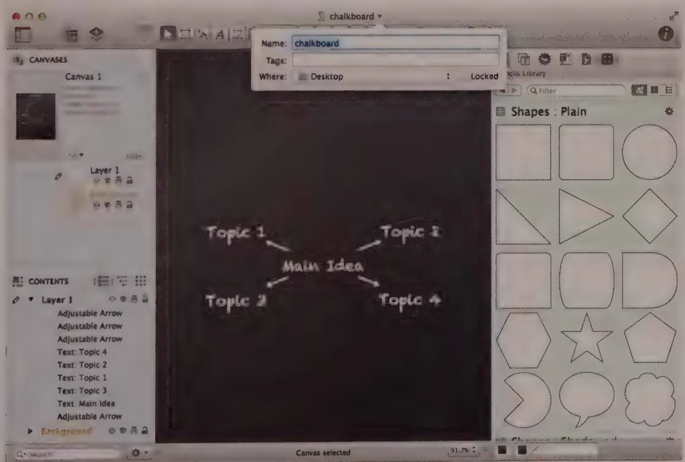
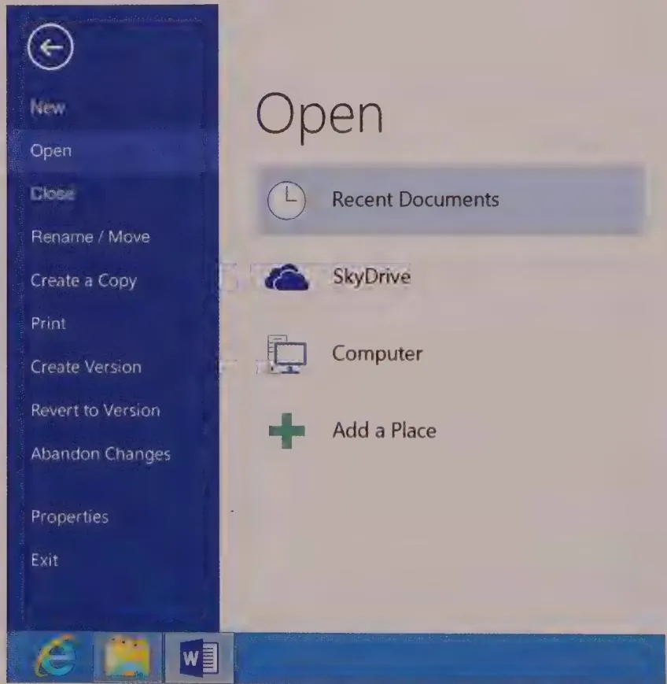

# DESIGN PRINCIPLE

Save documents and settings automatically.

Applications should automatically save documents. For starters, when the user is done with a document and requests the Close function, the application should go ahead and write the changes to disk without stopping to ask for confirmation with the Save Changes dialog.

In a perfect world, this would be sufficient, but computers and software can crash, power can fail, and other unpredictable, catastrophic events can conspire to erase your work. If the power fails before you save, all your changes are lost as the memory containing them scrambles. The original copy on disk will be all right, but hours of work can still be lost. To prevent this from happening, the application must also save the document at intervals during the user's session. Ideally, the application will save every single change as soon as the user makes it—in other words, after each keystroke. For most applications, this is feasible. Another approach is to keep track of small changes in memory and write them to the disk at reasonable intervals.

It's important that this automatic save function does not affect the responsiveness of the user interface. Saving should be either a background process or performed when the user has stopped interacting with the application. Nobody types continuously. Everybody stops to gather his thoughts, or flip a page, or take a sip of coffee. All the application needs to do is wait until the user stops typing for a couple of seconds and then save.

Automatic save will be adequate for almost everybody. However, people who have been using computers for a long time are so paranoid about crashes and data loss that they habitually press Ctrl+S after every paragraph, and sometimes after every sentence. Applications serving these users should have manual save controls, but users should not be required to invoke manual saves.

# Creating a copy

There should be an explicit function called Create a Copy. The copy will be identical to the original, but it won't be tied to the original in any way. That is, subsequent changes to the original will have no effect on the copy. The new copy of a file named "Alpha" should automatically be given a name with a standard form like "Alpha Copy." If an existing document already has that name, the new copy should be named "Alpha Copy 2." The

copy should be placed in the same directory as the original. A nice option might be to add a time or date stamp at the end of the filename.

It is tempting to envision a dialog that accompanies this command, but there should be no such interruption. The application should take its action quietly, efficiently, and sensibly, without badgering the user with silly dialogs like "Are you sure you want to make a copy?" In the user's mind it is a simple command. If there are any anomalies, the application should make a constructive decision on its own authority.

# Naming and renaming

In most applications, when you save a document for the first time, you can choose a name for it. But almost no application lets you rename that file. Sure, you can Save As under another name, but that just makes another file under the new name, leaving the old file untouched under the old name.

The document's name should be shown on the application's title bar. If the user decides to rename the document, he should be able to click the title to edit it in place. What could be simpler and more direct than that? Omnigraffle on OS X is one of the few applications supporting Rename as described here (see Figure 14-5).

  
Figure 14-5: Omnigraffle on OS X supports Rename. Clicking on the name of the file in the title bar of the document window opens a pop-up that lets you both rename and move the file.

# Placing and positioning in the file system

Most often when someone uses an application to edit a document, that document already exists. Documents are typically opened rather than created from scratch. This means that their position in the file system is already established. Although we think of establishing the home directory for a document at the moment of creation or when we first save it, neither of these events is meaningful outside of the implementation model. The new file should be put somewhere reasonable where the user can find it again (such as the Desktop).

DESIGN PRINCIPLE

Put files where users can find them.

The specific appropriate location should depend on your users and the posture of the product you are designing. For complex sovereign applications that most people use daily, it is sometimes appropriate to define an application-specific document location. But for transient applications or sovereign applications that are used less frequently, don't hide your users' files in your own special corner of the file system.

If the user wants to place the document somewhere else, he can request this function from the menu. A Move dialog would then appear with the current document highlighted. In this dialog (an appropriately named relative of the Save As dialog), the user could move the file to any location. The application thus would place all files automatically, and this dialog would be used only to move them elsewhere.

# Specifying the file type

At the bottom of the current Save As dialog, shown in Figure 14-3, a combo box allows the user to specify a file type. This function should not be located here. When the type is tied to the act of saving, additional, unnecessary complexity is added to saving. In Word, if the user innocently changes the type, both the save function and any subsequent close action are accompanied by a frightening and unexpected confirmation box. Overriding a file's type is a relatively rare occurrence. Saving a file is a common occurrence. These two functions should not be combined.

From the user's point of view, the document's type—rich text, plain text, or Word, for example—is a characteristic of the document rather than of the disk file. Specifying the type shouldn't be associated with the act of saving the file to disk. It belongs more properly in a Document Properties dialog, accessible near the display of the document's

filename. This dialog should have significant cautions built into its interface to make it clear to the user that the function could involve significant data loss.

In the case of some drawing applications, where saving image files as multiple types is desirable, an Export dialog (which most drawing applications already support) is appropriate for this function.

# Reversing changes

If the user inadvertently makes changes to the document that must be reversed, a tool already exists for correcting these actions: Undo (see Chapter 15 for more on Undo behaviors). The file system should not be called in as a surrogate for Undo. The file system may be the mechanism that supports the function, but that doesn't mean it should be rendered to users in those terms. The concept of going directly to the file system to undo changes undermines the Undo function.

The version function, described in the section after the next one, shows how a file-centric division of Undo can be implemented so that it works well with the unified file model.

# Discarding all changes

While it's not the most common of tasks, we certainly want to allow the user to discard all the changes she has made after opening or creating a document, so this action should be explicitly supported. Rather than forcing the user to understand the file system to achieve her goal, a simple Discard Changes function on the main menu would suffice. A similarly useful way to express this concept is Revert to Version, which is based on a version system described in the next section. Because Discard Changes involves significant data loss, the user should be protected with clear warning signs. Making this function undoable also would be relatively easy to implement and highly desirable.

# Creating a version

Creating a version is very similar to using the Copy command. The difference is that this copy is managed by the application and presented to users as the single document instance after it is made. It should also be clear to users that they can return to the state of the document at each point that a version was made. Users should be able to see a list of versions along with various statistics about them, like the time each was recorded and its size or length. With a click, the user can select a version. By doing so, he also immediately selects it as the active document. The document that was current at the time of the version selection will be created as a version itself. Also, since disk space is hardly a

scarce resource these days, it makes sense to create versions regularly, in case it doesn't occur to your users.

# A new File menu

Our new File menu now looks like the one shown in Figure 14-6. It functions as follows:

New and Open work as before.   
- Close closes the document without a dialog or any other fuss after automatically saving changes.   
- Rename/Move brings up a dialog that lets the user rename the current file or move it to another directory.

  
Figure 14-6: The revised File menu now better reflects the user's mental model, rather than the developer's implementation model. There is only one file, and the user owns it. If she wants, she can make tracked or one-off copies of it, rename it, discard any changes she's made, or change the file type. She no longer needs to understand or worry about the copy in RAM versus the copy on disk.

- Create a Copy creates a new file that is a copy of the current document.   
- Print collects all printer-related controls in a single dialog.   
- Create Version is similar to Copy, except that the application manages these copies by a way of a dialog summoned by the Revert to Version menu item.   
- Abandon Changes discards all changes made to the document since it was opened or created.   
Properties opens a dialog that lets the user change the document's type.   
- Exit behaves as it does now, closing the document and the application.

# A new name for the File menu

Now that we are presenting a unified model of storage instead of the bifurcated implementation model of disk and RAM, we no longer need to call the leftmost application menu the File menu—a reflection of the implementation model, not the user's model. There are two reasonable alternatives.

We could label the menu according to the type of documents the application processes. For example, a spreadsheet application might label its leftmost menu Sheet. An invoicing application might label it Invoice.

Alternatively, we could give the leftmost menu a more generic label, such as Document. This is a reasonable choice for applications like word processors, spreadsheets, and drawing applications, but it may be less appropriate for more specialized niche applications.

Conversely, the few applications that do represent the contents of disks as files—generally operating system shells and utilities—should have a File menu because they are addressing files as files.

# Communicating status

If the file system needs to show the user a file that cannot be changed because it is in use by another application, the file system should indicate this to the user. Showing the filename in red or with a special symbol next to it, along with a ToolTip explaining the situation, would be sufficient. A new user might still get an error message, as in Figure 14-4, but at least some visual and textual clues would show the reason the error cropped up.

Not only are there two copies of all data files in the current model, but when they are running, there also are two copies of all applications. When the user goes to the Windows taskbar's Start menu and launches his word processor, a button corresponding to Word appears on the taskbar. But if he returns to the Start menu, Word is still there! From the

user's point of view, he has pulled his hammer out of his toolbox only to find that a hammer is still in there.

This should probably not be changed; after all, one of the strengths of the computer is its capability to have multiple copies of software running simultaneously. But the software should help users understand this unintuitive action. The Start menu could, for example, make some reference to the already running application.

# Time for a change

If you're a developer, you might be squirming a little in your seat. You might be thinking we are treading on holy ground: A pristine copy on disk is critical, and we'd better not advocate getting rid of it. Relax! There is nothing terribly wrong with the implementation of our file systems. We simply need to hide its existence from users. We can still offer users all the advantages of that extra copy on disk without exploding their mental model.

If we remake the file system's represented model according to users' mental models, we can achieve several significant advantages. First, all users will become more effective. If they aren't forced to spend effort and mental energy managing their computer's file system, they'll be more focused on the task at hand. And, of course, they won't have to redo hours of work lost to a mistake in the complex chess game of versioning in contemporary operating systems.

Second, we can teach Mom how to really use computers well. We won't have to answer her pointed questions about the interface's inexplicable behavior. We can show her applications and explain how they allow her to work on the document. Upon completion, she can store the document on the disk as though it were a journal on a shelf. Our sensible explanation won't be interrupted by that Save Changes? dialog. Mom represents the mass market of digital product consumers, who may own and use computers and other devices but who don't like them, trust them, or use them effectively.

The last advantage is that interaction designers won't have to incorporate clumsy file system awareness into their products. We can structure the commands in our applications according to users' goals instead of the operating system's needs.

There will certainly be an initial cost as experienced users get used to the new idioms, but it will be far less than you might suppose. This is because these power users have already shown their ability and tolerance by learning the implementation model. For them, learning the better model will be no problem, and there will be no loss of functionality. The advantages for new users will be immediate and significant. We computer professionals forget how tall the mountain is after we've climbed it, but every day newcomers approach the base of this Everest of computer literacy and are severely discouraged.

Anything we can do to lower the heights they must scale will make a big difference, and this step will tame some of the most perilous peaks.

# Rethinking Data Retrieval

One of the most amazing aspects of the modern world is the sheer quantity of information and media we can access within our applications, on our laptops and mobile devices, and via networks and the Internet. But accompanying the boundless possibilities of infinite data access is a difficult design problem: How do we make it easy for people to find what they're looking for and, more importantly, find what they need?

Luckily, great strides have been made in this area by Google, with its various search engines, and Apple, with its highly effective Spotlight functionality in OS X (more on these later). But although these solutions point to some effective interactions, they really just scratch the surface. Google search may be very useful for finding textual, image, or video content on the web, but that doesn't necessarily mean that the same interaction patterns are appropriate for a more targeted retrieval scenario.

As with almost every other problem in interaction design, we've found that crafting an appropriate solution must start with a good understanding of users' mental models and usage contexts. With this information, we can structure storage and retrieval systems that accommodate specific purposes. This chapter discusses methods of data retrieval from an interaction standpoint and presents some human-centered approaches to the problem of finding useful information.

# Storage versus retrieval

A storage system is a method of safely keeping things in a repository. It is composed of a container and the tools necessary to put objects in and take them back out again. A retrieval system is a method of finding things in a repository according to some associated value, such as name, position, or some other attribute of the contents.

In the physical world, storing and retrieving are inextricably linked; putting an item on a shelf (storing it) also gives us the means to find it later (retrieving it). In the digital world, the only thing linking these two concepts is our faulty thinking. Computers enable remarkably sophisticated retrieval techniques—if only we can break our thinking out of its traditional box.

Digital storage and retrieval mechanisms have traditionally been based on the concept of "Folders" or "directories." It's certainly true that the folder metaphor has provided a useful way to approach a computer's storage and retrieval systems (much as

one would approach them for a physical object). But as we discussed in Chapter 13, the metaphoric nature of this interaction pattern is limiting. Ultimately, the sole use of folders or directories as a retrieval mechanism requires that users know where an item has been stored in order to locate it. This is unfortunate, since digital systems can give us significantly better methods of finding information than those physically possible using mechanical systems. But before we talk about how to improve retrieval, let's briefly discuss how it works.

# Retrieval in the physical world

We can own a book or hammer without giving it a name or permanent place of residence in our house. A book can be identified by characteristics other than a name—a color or shape, for example. However, after we accumulate a large number of items that we need to find and use, it helps to be a bit more organized.

# Retrieval by location

It is important that our books and hammers have a proper place, because that is how we find them when we need them. We can't just whistle and expect them to find us; we must know where they are and then go there and fetch them. In the physical world, the actual location of a thing is the means of finding it. Remembering where we put something—its address—is vital to both finding it and putting it away so it can be found again. When we want to find a spoon, for example, we go to the place where we keep our spoons. We don't find the spoon by referring to any inherent characteristic of the spoon itself. Similarly, when we look for a book, we either go to where we left the book, or we guess that it is stored with other books. We don't find the book by association. That is, we don't find the book by referring to its contents.

In this model, the storage system is the same as the retrieval system: Both are based on remembering locations. They are coupled storage and retrieval systems.

