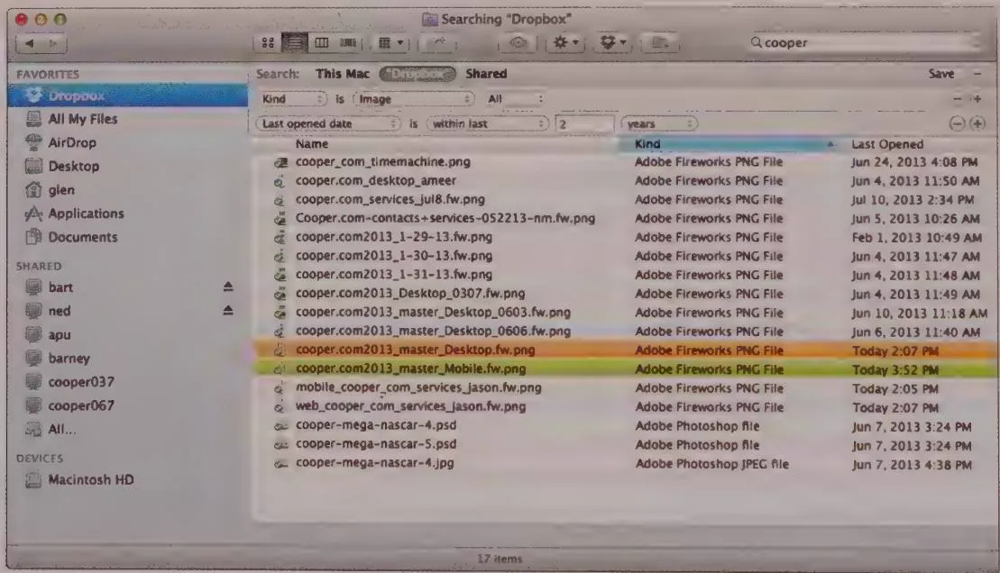
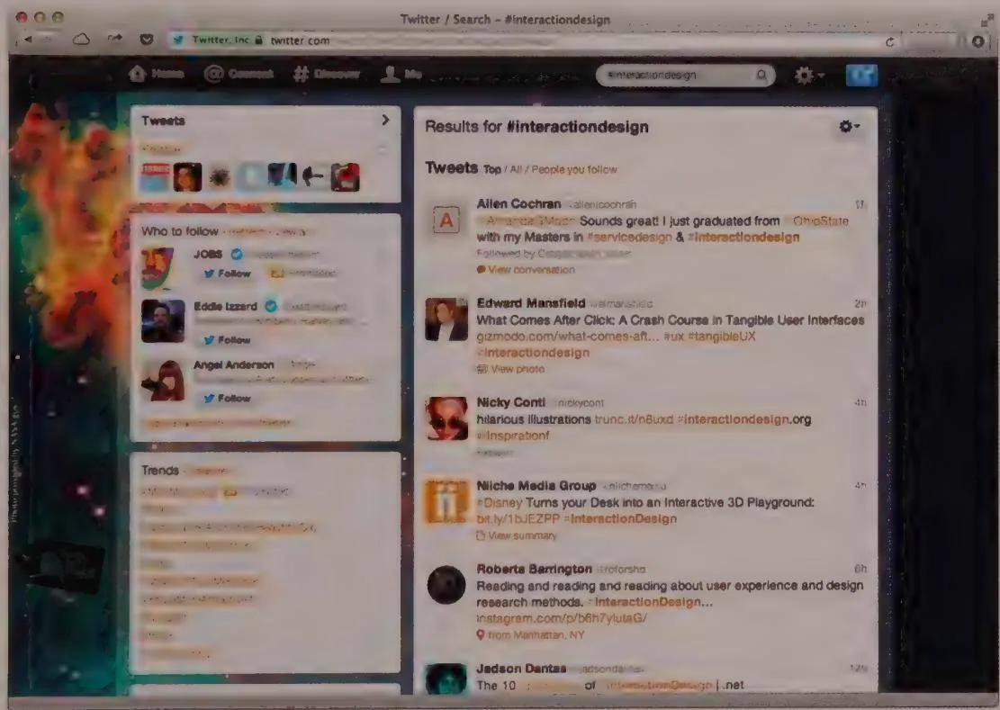
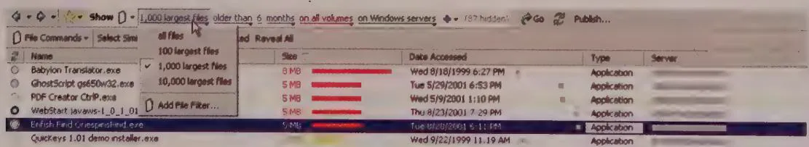

# Indexed retrieval

Retrieval by location sounds pretty good, but it has a flaw: It's limited in scale by human memory. Although it works for the books, hammers, and spoons in your house, it doesn't work for all the volumes stored in the Library of Congress, for example.

In the world of books and paper on library shelves, we make use of a classification system to help us find things. Using the Dewey Decimal System (or its international offshoot, the Universal Decimal Classification system), every book is assigned a unique "call number" based on its subject. Books are then arranged numerically (and then alphabetically by author's last name), resulting in a library organized by subject.

The only remaining issue is how to discover the number for a given book. Certainly nobody could be expected to remember every number. The solution is an index, or a collection of records that allows you to find an item's location by looking up an attribute of the item, such as its name.

Traditional library card catalogs provide lookup by three attributes: author, subject, and title. When the book is entered into the library system and assigned a number, three index cards are created for the book, including all particulars and the Dewey Decimal number. Each card is headed by the author's name, subject, or title. These cards are then placed in their respective indices in alphabetical order. When you want to find a book, you look it up in one of the indices and find its number. You then find the row of shelves that contains books with numbers in the same range as your target by examining signs. You search those particular shelves, narrowing your view by the lexical order of the numbers until you find the one you want.

You physically retrieve the book by participating in the system of storage, but you logically find the book you want by participating in a system of retrieval. The shelves and numbers are the storage system. The card indices are the retrieval system. You identify the desired book with one and fetch it with the other. In a typical university or professional library, customers are not allowed into the stacks. As a customer, you identify the book you want by using only the retrieval system. The librarian then fetches the book for you by participating only in the storage system. The book's unique number is the bridge between these two interdependent systems. In the physical world, both the retrieval system and the storage system may be labor-intensive. Particularly in older, noncomputerized libraries, they are both inflexible. Adding a fourth index based on acquisition date, for example, would be prohibitively difficult for the library.

# Retrieval in the digital world

Unlike in the physical world of books, stacks, and cards, it's not very hard to add an index in the computer. Ironically, in a system where easily implementing dynamic, associative retrieval mechanisms is at last possible, we often don't implement any retrieval system other than the storage system. If you want to find a file on disk, you need to know its name and place. It's as if we went into the library, burned the card catalog, and told the patrons they can easily find what they want by just remembering the little numbers on the spines of the books. We have put 100 percent of the burden of file retrieval on the user's memory while the CPU just sits there idling, twiddling its digital thumbs on billions of NOP (no-operation) instructions.

Although our desktop computers can handle hundreds of different indices, we ignore this capability and frequently have no indices at all pointing into the files stored on our disk. Instead, we have to remember where we put our files and what we called them in order to find them again. This omission is one of the most destructive, backward steps

in modern software design. This failure can be attributed to the interdependence of files and the organizational systems in which they exist—an interdependence that doesn't exist in the mechanical world.

There is nothing wrong with the disk file storage systems that we have created for ourselves. The only problem is that we have failed to create adequate disk file retrieval systems. Instead, we hand the user the storage system and call it a retrieval system. This is like handing him a bag of groceries and calling it a gourmet dinner. There is no reason to change our file storage systems. The UNIX model is fine. Our applications can easily remember the names and locations of the files they have worked on, so they aren't the ones who need a retrieval system: It's for us human users.

# Digital retrieval methods

There are three fundamental ways to find a document on a digital system. You can find it by remembering where you left it in the file structure—positional retrieval. You also can find it by remembering its identifying name—identity retrieval. (It should be noted that these two methods typically are used in conjunction.) The third method, associative or attribute-based retrieval, is based on the ability to search for a document based on some inherent quality of the document itself. For example, if you want to find a book with a red cover, or one that discusses light rail transit systems, or one that contains photographs of steam locomotives, or one that mentions Theodore Judah, you must use an associative method.

The combination of position and identity provides the basis for most digital storage systems. However, most digital systems do not provide an associative method for storage. By ignoring associative methods, we deny ourselves any attribute-based searching, so we must depend on human memory to recall the position and identity of our documents. Users must know the title of the document they want and where it is stored to find it. For example, to find a spreadsheet in which you calculated the amortization of your home loan, you need to remember that you stored it in the directory called "Home" and that the file was named "amort1." If you can't remember either of these facts, finding the document is difficult.

# Attribute-based retrieval systems

For early graphical interfaces like the original Macintosh, a positional retrieval system almost made sense: The desktop metaphor dictated it (you don't use an index to look up papers on your desk), and precious few documents could be stored on a 144KB floppy disk. However, our current desktop systems can easily hold five million times as many documents (and that's not to mention what even a meager local network can provide access to)! Yet we still use the same old metaphors and retrieval models to manage our

data. We continue to render our software's retrieval systems in strict adherence to the storage system's implementation model of the storage system. We ignore the power and ease of use of a system for finding files that is distinct from the system for keeping files.

An attribute-based retrieval system enables users to find documents by their contents and meaningful properties (such as when they were last edited). The purpose of such a system is to provide a mechanism for users to express what they're looking for according to how they think about it. For example, a saleswoman looking for a proposal she recently sent to a client named "Widgetco" could effectively express herself by saying "Show me the Word documents related to 'Widgetco' that I modified and printed yesterday."

A well-crafted attribute-based retrieval system also enables users to find what they're looking for by synonyms or related topics or by assigning attributes to individual documents. The user can then dynamically define sets of documents having these overlapping attributes. Returning to our saleswoman example, each potential client is sent a proposal letter. Each of these letters is different and is naturally grouped with the files pertinent to that client. However, there is a definite relationship between each of these letters, because they all serve the same function: proposing a business relationship. It would be convenient if the saleswoman could find and gather all such proposal letters while allowing each one to retain its uniqueness and association with its particular client. A file system based on place—on its single storage location—must necessarily store each document by a single attribute (client or document type) rather than by multiple characteristics.

A retrieval system can learn a lot about each document just by keeping its eyes and ears open. If it remembers some of this information, much of the burden on users is made unnecessary. For example, it can easily remember certain things:

The user that created or the users that contributed to the document   
The device that created the document   
The application that created the document   
The document's contents and type   
- Which application last opened the document?   
The document's size and whether it is exceptionally large or small   
- Whether the document has been untouched for a long time   
How long the document was last open   
How much information was added or deleted during the last edit?   
If the document was created from scratch or cloned from another   
If the document is frequently edited

- If the document is frequently viewed but rarely edited   
- Whether the document has been printed and where   
- How often the document has been printed, and whether changes were made to it each time immediately before printing   
- Whether the document has been faxed, and to whom   
- Whether the document has been e-mailed, and to whom

Spotlight, the search function in Apple's OS X, provides effective attribute-based retrieval, as shown in Figure 14-7. Not only can the user look for documents according to meaningful properties, but he can save these searches as "Smart Folders." Doing so enables him to see documents related to a given client in one place and all proposals in a different place. (However, he would have to put some effort into identifying each proposal as such, because Spotlight can't recognize this.) It should be noted that one of the most important factors contributing to Spotlight's usefulness is the speed with which results are returned. This is a significant differentiating factor between it and the Windows search functionality. It was achieved through purposeful technical design that indexes content during idle time.

  
Figure 14-7: Spotlight, the search capability in Apple's OS X, allows users to find a document based on meaningful attributes such as the name, type of document, and when it was last opened.

An attribute-based retrieval system can find documents for users without users ever having to explicitly organize documents in advance. But there is also considerable value in allowing users to tag or manually specify attributes about documents. This allows

users to fill in the gaps where technology can't identify all the meaningful attributes. It also allows people to define de facto organizational schemes based on how they discuss and use information. The retrieval mechanism achieved by such tagging is often called a "folksonomy," a term credited to information architect Thomas Vander Wal. Folksonomies can be especially useful in social and collaborative situations. There they can provide an alternative to a globally defined taxonomy if it is undesirable or impractical to force everyone to adhere to and think in terms of a controlled vocabulary. Good examples of the use of tagging to facilitate information retrieval include Flickr, del.icio.us, and the highly popular social sharing app, Twitter (see Figure 14-8).

  
Figure 14-8: Twitter, whose hashtags have become part of mainstream culture, is the classic example of a folksonomy that has achieved widespread adoption.

# Relational databases versus digital soup

Software that uses database technology typically makes two simple demands of its users. First, users must define the form of the data in advance. Second, users must then conform to that definition. There are also two facts about human users of software. First, they rarely can express in advance what they will want. Second, even if they could express their specific needs, more often than not they change their minds.

# Organizing the unorganizable

Living in the Internet age, we find ourselves more and more frequently confronting information systems that fail the relational database litmus: We can neither define information in advance nor reliably stick to any definition we might conjure up. In particular, the two most common components of the Internet exemplify this dilemma.

First, let's consider e-mail. Whereas a record in a database has a specific identity, and thus belongs in a table of objects of the same type, an e-mail message doesn't fit this paradigm very well. We can divide our e-mail into incoming and outgoing, but that doesn't help us much. For example, if you receive a piece of e-mail from Jerry about Sally, regarding the Ajax Project and how it relates to Jones Consulting and your joint presentation at the board meeting, you can file this in the "Jerry" folder, or the "Sally" folder, or the "Ajax" folder, but what you really want is to file it in all of them. In six months, you might try to find this message for any number of unpredictable reasons, and you'll want to be able to find it, regardless of your reason.

Second, let's consider the web. Like an infinite, chaotic, redundant, unsupervised hard drive, the web defies structure. Enormous quantities of information are available on the web, but its sheer size and heterogeneity almost guarantee that no regular system could ever be imposed on it. Even if the web could be organized, the method would likely have to exist on the outside, because its contents are owned by millions of individuals, none of whom are subject to any authority. Unlike records in a database, we cannot expect to find a predictable identifying mark in a record on the web.

# Problems with databases

Databases have a further problem: All database records are of a single, predefined type, and all instances of a record type are grouped. A record may represent an invoice or a customer, but it never represents an invoice and a customer. Similarly, a field within a record may be a name or a social security number, but it is never a name and a social security number. This fundamental concept underlies all databases. It serves the vital purpose of allowing us to impose order on our storage system. Unfortunately, it fails miserably to address the realities of retrieval for our e-mail problem. It is not enough that the e-mail from Jerry is a record of type "e-mail." Somehow, we must also identify it as a record of type "Jerry," type "Sally," type "Ajax," type "Jones Consulting," and type "Board Meeting." We must also be able to add and change its identity at will, even after the record has been stored. What's more, a record of type "Ajax" may refer to documents other than e-mail messages, such as a project plan. Because the record format is unpredictable, the value that identifies the record as pertaining to Ajax cannot be stored reliably within the record itself. This directly contradicts how databases work.

Databases do provide retrieval tools that can do a bit more than just match simple record types. They allow us to find and fetch a record by examining its contents and matching

them against search criteria. For example, we search for invoice number "77329" or for the customer with the identifying string "Goodyear Tire and Rubber." Yet this still fails for our e-mail problem. If we allow users to enter the keywords "Jerry," "Sally," "Ajax," "Jones Consulting," and "Board Meeting" into the message record, we must define such fields in advance. But as we've said, defining things in advance doesn't guarantee that the user will follow that definition later. He may now be looking for messages about the company picnic, for example. Besides, adding a series of keyword fields leads you into one of the most fundamental and universal conundrums of data processing: If you give users 10 fields, someone is bound to want 11.

# The attribute-based alternative

So if relational database technology isn't right, what is? If users find it hard to define their information in advance, as databases require, is there an alternative storage and retrieval system that might work well for them?

Again, the key is separating the storage and retrieval systems. If an index were used as the retrieval system, the storage technique could remain a database. We can imagine the storage facility as a sort of digital soup where we could put our records. This soup would accept any record we dumped into it, regardless of its size, length, type, or contents. Whenever a record was entered, the application would return a token that could be used to retrieve the record. All we would have to do is give it back that token, and the soup would instantly return our record. This is just our storage system, however; we still need a retrieval system that manages all these tokens for us.

Attribute-based retrieval thus comes to our rescue: We can create an index that stores a key value along with a copy of the token. The real magic, though, is that we can create an infinite number of indices, each one representing its own key and containing a copy of the token. For example, if our digital soup contained all our e-mail messages, we could establish an index for each of our old friends: "Jerry," "Sally," "Ajax," "Jones Consulting," and "Board Meeting." Now, when we need to find e-mail pertinent to the board meeting, we don't have to paw manually and tediously through dozens of folders. Instead, a single query brings us everything we are looking for.

Of course, someone or something must fill those indices, but that is a more mundane exercise in interaction design. Two components must be considered. First, the system must be able to read e-mail messages and automatically extract and index information such as proper names, Internet addresses, street addresses, phone numbers, and other significant data. Second, the system must make it very easy for the user to add ad hoc pointers to messages. He should be able to specify that a given e-mail message pertains to a certain value, whether or not that value is quoted verbatim in the message. Typing is okay, but selecting from picklists, clicking-and-dragging, and other more-advanced user interface idioms can make the task almost painless.

Important advantages arise when the storage system is reduced in importance and the retrieval system is separated from it and significantly enhanced. Some form of digital soup will help us get control of the unpredictable information that is beginning to make up more and more of our everyday information universe. We can offer users powerful information-management tools without demanding that they configure their information in advance or that they conform to that configuration in the future. After all, they can't do it. So why insist?

# Constrained natural-language output

This chapter has discussed the merits of attribute-based retrieval. This kind of system, to be truly successful, requires a front end that allows users to easily make sense of what could be complex and interrelated sets of attributes.

One alternative is to use natural-language processing, in which the user can key in his request in English. The problem with this method is that it is still not possible for today's run-of-the-mill computers to effectively understand natural-language queries in most commercial situations. It might work reasonably in the laboratory under tightly controlled conditions, or in the real world for specific domains with tightly controlled vocabulary and syntax, but not in the consumer world, where language is subject to whim, dialect, colloquialism, and ambiguity. In any case, the programming of a natural-language recognition engine is beyond the capabilities and budget of your average development team.

A better approach, which we've used successfully on numerous projects, is a technique we call constrained natural-language output. Using this technique, the application provides an array of bounded controls for users to choose from. The controls line up so that they can be read like an English sentence. The user chooses from a list of valid alternatives, so the design is in essence a self-documenting, bounded query facility. Figure 14-9 shows how this works.

  
Figure 14-9: An example of a constrained natural-language output interface to an attribute-based retrieval engine, part of a Cooper design created for Softek's Storage Manager. These controls produce natural language as output, rather than attempting to accept natural language as input, for database queries. Each underlined phrase, when clicked, provides a drop-down menu with a list of selectable options. The user constructs a sentence from a dynamic series of choices that always guarantees a valid result.

A natural-language output interface also is helpful for expressing everything from queries to plain old relational databases. Querying a database in the usual fashion is very hard for most people because it calls for Boolean notation and arcane database syntax, à la SQL.

English isn't Boolean, so the English clauses aren't joined with AND and OR, but rather with English phrases like "All of the following apply" or "Not all of the following apply." Users find that choosing from among these phrases is easy because they are clear and bounded, and users can read the phrase like a sentence to check its validity.

The trickiest part of natural-language output from a development perspective is that choosing from controls on the left may, in many circumstances, change the content of the choices in controls to the right of them, in a cascading fashion. This means that to effectively implement natural-language output, the grammar of the choices needs to be well mapped out in advance. Also, the controls need to be dynamically changeable or hideable, depending on what is selected in other controls. Finally, the controls themselves must be able to display or, at least, load data dynamically.

The other concern is localization. If you are designing for multiple languages, those with very different word orders (for example, German and English) may require different grammar mappings.

Both attribute-based retrieval engines and natural-language output interfaces require significant design and programming effort, but users will reap tremendous benefits in terms of power and flexibility in managing their data. Because the amount of data we all must manage is growing at an exponential rate, it makes sense to invest now in these more powerful, goal-directed tools wherever data must be managed.

