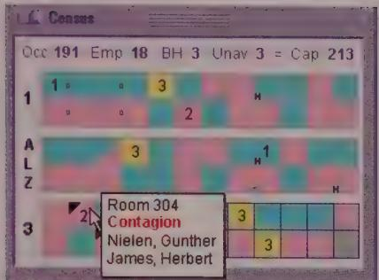
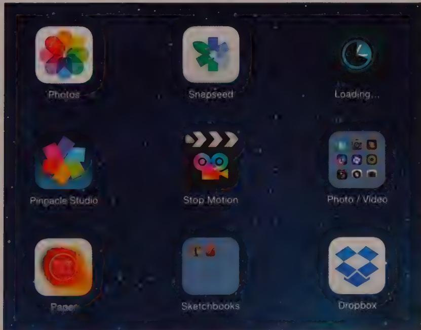
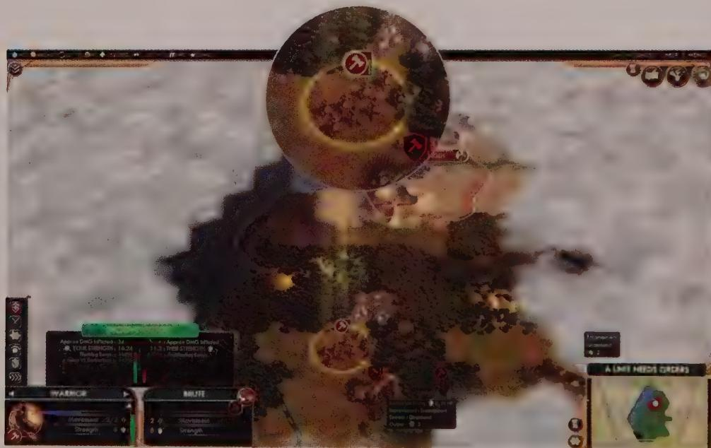
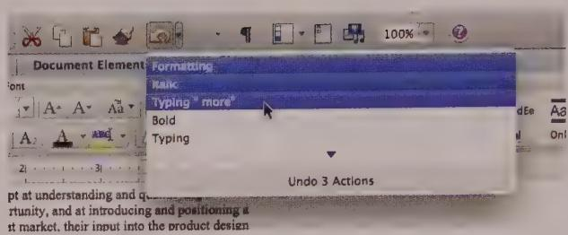
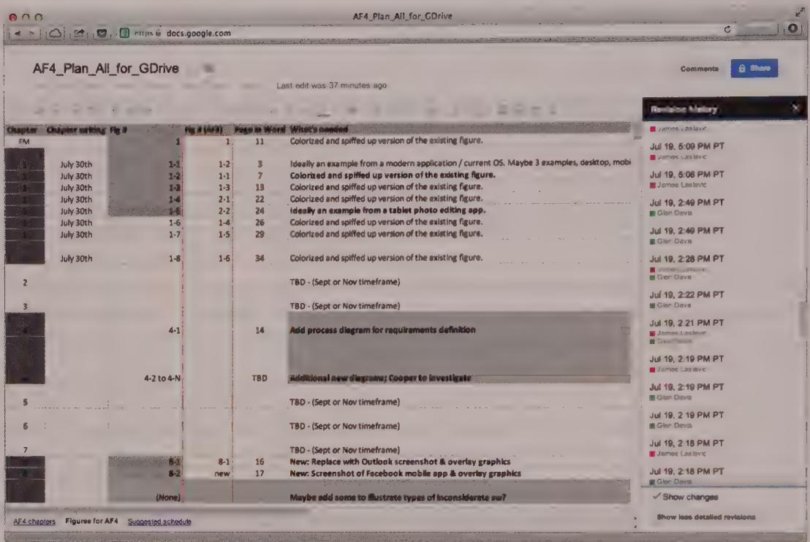
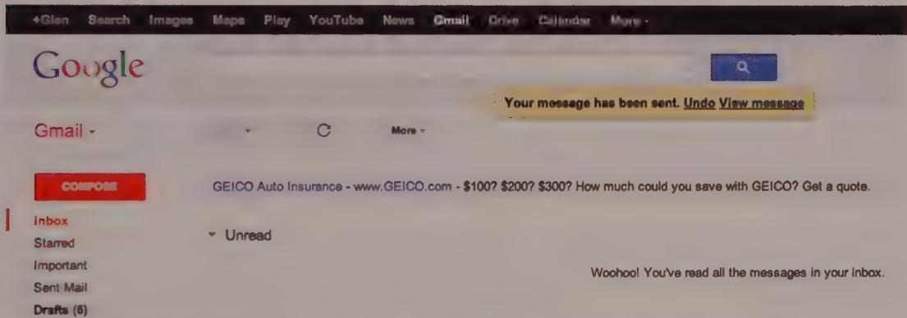

# PREVENTING ERRORS AND INFORMING DECISIONS

In the early days of the digital revolution, a significant portion of a software application's graphical interface was taken up by dialoges and messages telling users what they did wrong, or warning them about what their computer or software was unable to handle due to real or presumed technical limitations. The first edition of About Face was released during that time, and was, as you can probably imagine, quite critical of this state of affairs.

Today, the second of these two categories of error messages has dropped by the wayside as computational, storage, and communication speeds have all increased by several orders of magnitude and as the sophistication of programming tools and techniques has similarly advanced.

The first type of error message—scolding users for their mistakes—has begun to disappear as well (at least in consumer and mobile applications). Designers have discovered better ways to eliminate errors before they happen, allow users to reverse their actions, and provide them with the almost magical ability to see the results of their actions before they even take them. These three strategies of preventing errors and informing decisions are the subject of this chapter.

# Using Rich Modeless Feedback

Most computers (and, increasingly, many devices) come with high-resolution displays and high-quality audio systems. Yet very few applications (outside of games) even scratch the surface of using these facilities to provide useful information about the app's status, the users' tasks, and the system and its peripherals in general. An entire toolbox is available to supply information to users. But until quite recently, most designers and developers have used the same blunt instrument—the dialog—to communicate information (usually after it is truly useful) to users. We'll discuss in detail the reasoning behind why certain dialogs—errors, alerts, and confirmations—are not appropriate ways to communicate in Chapter 21.

Unfortunately, this means that subtle status information is simply never communicated to users, because most designers know you don't want dialogs to pop up constantly. But constant feedback—especially positive feedback—is exactly what users need. It's simply the channel of communication that needs to be different.

In this section, we'll discuss how visual information, when displayed in a modeless fashion in the main views of an application, won't stop the user's flow and can all but eliminate those pesky dialogs.

# Rich visual modeless feedback

Perhaps the most important type of modeless feedback is rich visual modeless feedback (RVMF). This type of feedback is rich in terms of giving in-depth information about the status or attributes of a process or object in the current application. It is visual in that it makes idiomatic use of pixels on the screen (often dynamically). It is modeless in that this information is always readily displayed, requiring no special action or mode shift on the user's part to view and make sense of the feedback.

For example, in Microsoft Outlook 2013, an icon next to an e-mail sender's name visually indicates whether that person is available for a chat session or phone call. This is handy when a real-time conversation is preferable to an e-mail exchange. This icon (as well as the ability to start a chat session from a right-click menu) means that users don't have to open their chat client and find the sender's name to see if that person is available. This is so easy and convenient that the user doesn't have to think about it. Another example of the strategy, as designed for a Cooper client, is shown in Figure 15-1.

Here's another example, this time from iOS: When you download an app from the App Store, the downloading file appears on the Home screen as an icon with a small, dynamically updating progress indicator, showing visually how far along the app is in the download and install process (see Figure 15-2).

  
Figure 15-1: This pane from a Cooper design for a long-term health-care information system is a good example of RVMF. The diagram represents all the rooms in the facility. Color coding indicates male, female, empty, or mixed-gender rooms; numbers indicate empty beds; tiny boxes between rooms indicate shared bathrooms. Black triangles indicate health issues, and a tiny H means a held bed. This RVMF is supplemented with ToolTips, which show room numbers and occupant names and highlight any important notices about the room or its residents. A numeric summary of rooms, beds, and employees is given at the top. This display has a short learning curve. After mastering it, nurses and facility managers can understand their facility's status at a glance.

  
Figure 15-2: When apps are purchased from Apple's App Store, the app icon appears on the Home screen of the iPad or iPhone (upper right). A dynamically updating circular indicator on the icon marks the progress of the download-and-install process.

A final example of RVMF is from the computer gaming world: Sid Meier's Civilization (see Figure 15-3). This game provides dozens of examples of RVMF in its main interface, which is a map of the historical world. You are the leader of an evolving civilization that you are trying to build. Civilization uses RVMF to indicate half a dozen dynamically changing attributes of a city, all represented visually. If a city is more advanced, its architecture is more modern. If it is larger, the icon is larger and more embellished. If it is plagued by civil unrest, smoke rises from the city. Individual troop and civilian units also show status visually, by way of tiny meters indicating unit health and strength. Even the landscape has RVMF: Dotted lines marking spheres of influence shift as units move and cities grow. Terrain changes as roads are laid, forests are cleared, and mountains are mined. Although dialogs exist in the game, much of the information needed to understand what is going on is communicated clearly with no words or dialogs whatsoever.

  
Figure 15-3: Civilization is a game in which you chart the course of civilization. Its interface provides dozens of examples of rich visual modeless feedback.

Imagine if all the objects that had pertinent status information on your desktop or in your application could display their status in this manner. Printer icons could show how close the printer is to completing your print job. Icons for hard drives and removable media could show how full these items are. When an object is selected for drag and drop, all the places that could receive it would become highlighted to announce their receptiveness.

Think about the objects in your application and their attributes—especially dynamically changing ones—and what kind of status information is critical for your users.

Figure out how to create a representation of this. After the user notices and learns this representation, it tells him what is going on at a glance. (There should also be a way to get fully detailed information if the user requests it.) Put this information into main application windows in the form of RVMF and see how many dialogs you can eliminate from routine use!

One important point needs to be made about rich modeless visual feedback: It isn't for beginners. Even if you add ToolTips to textually describe the details of any visual cues you add (which you should), a ToolTip requires users to perform work to discover it and decode its meaning. RVMF is something that users will begin to use over time. When they do, they'll think it's amazing, but in the meantime, they will need the support of menus and dialogs to find what they're looking for. This means that RVMF used to replace alerts and warnings of serious trouble must be extraordinarily clear to users. Make sure that this kind of status is visually emphasized over less critical, more informational RVMF.

# Audible feedback

In data-entry environments, clerks sit for hours in front of computer screens entering data. These users may well be examining source documents and typing by touch instead of looking at the screen. If a clerk enters something erroneous, he needs to be informed of it via both auditory and visual feedback. The clerk can then use his sense of hearing to monitor the success of his inputs while he keeps his eyes on the document.

The kind of auditory feedback we're proposing is not the same as the beep that accompanies an error message box. In fact, it isn't a beep at all. The auditory indicator we propose as feedback for a problem is silence. The problem with much current audible feedback is the still-prevalent idea that, rather than positive audible feedback, negative feedback is desirable.

# Avoid negative audible feedback

People frequently counter the idea of audible feedback with arguments that users don't like it. Users are offended by the sounds that computers make, and they don't want their computer beeping at them. Despite the fact that Microsoft and Apple have tried to improve the quality of alert sounds by hiring sound designers (including the legendary Brian Eno for Windows 95), warm ambience doesn't change the fact that sounds are used to convey negative, often insulting messages.

Emitting noise when something bad happens is called negative audible feedback. On most systems, error dialogs normally are accompanied by a shrill beep, so audible feedback has become strongly associated with them. That beep is a public announcement of the user's failure. It explains to all within earshot that you have done something stupid.

It is such a hateful idiom that most software developers now have an unquestioned belief that audible feedback is inappropriate to interface design. Nothing could be further from the truth. It is the negative aspect of the feedback that presents problems, not the audible aspect.

Negative audible feedback has several things working against it. Because the negative feedback is issued when a problem is discovered, it naturally takes on the characteristics of a home alarm. Home alarms are designed to be purposefully loud, discordant, and disturbing. They are supposed to wake sound sleepers from their slumbers when their house is on fire and their lives are at stake. Unfortunately, users are constantly doing things that cause apps to generate error messages, so these noises have become part of the normal course of interaction. Alarms have no place in this normal relationship, just as we don't expect our car alarms to go off if we accidentally change lanes without using the turn signal. Perhaps the most damning aspect of negative audible feedback is the implication that success must be greeted with silence. Humans like to know when they are doing well. They need to know when they are doing poorly, but that doesn't mean that they like to hear about it. Negative feedback systems are simply appreciated less than positive feedback systems.

Given the choice of no noise versus noise for negative feedback, people will choose the former. Given the choice of no noise versus soft and pleasant noises for positive feedback, however, many people will choose the latter. We have never given our users a chance by putting high-quality, positive audible feedback in our apps, so it's no wonder that people associate sound with bad interfaces.

# Provide positive audible feedback

Almost every object and system outside the world of software offers sound to indicate success rather than failure. When we close the door, we know that it is latched when we hear the click, but silence tells us that it is not yet secure. When we converse with someone and she says "Yes" or "Uh-huh," we know that, at least minimally, she registered what was said. When she is silent, however, we have reason to believe that something is amiss. When we turn the key in our car's ignition and get silence, we know we have a problem. When we flip the switch on the copier and it stays coldly silent instead of humming, we know that we have trouble. Even most equipment that we consider silent makes some noise: Turning on the stovetop returns a hiss of gas and a gratifying "whoomp" as the pilot ignites the burner. Electric ranges are inherently less friendly and harder to use because they lack that sound—they require indicator lights to tell us their status.

When success with our tools yields a sound, it is called positive audible feedback. Our software tools are mostly silent; all we hear is the quiet clicks of the keyboard. Hey! That's positive audible feedback. Every time you press a key, you hear a faint but positive sound. Keyboard manufacturers could make perfectly silent keyboards, but they don't because

we depend on audible feedback to tell us how we are doing. This is one of the reasons why tablet computers like the iPad provide audible feedback for their touchscreen keyboards by default. The feedback doesn't have to be sophisticated—those clicks don't tell us much—but they must be consistent. If we ever detect silence, we know that we have failed to press the key. The true value of positive audible feedback is that its absence is an extremely effective problem indicator.

The effectiveness of positive audible feedback originates in human sensitivity. Nobody likes to be told that they have failed. Error message boxes are negative feedback, telling the user that he has done something wrong. Silence can ensure that the user knows this without actually being told of the failure. It is remarkably effective, because the software doesn't have to insult the user to accomplish its ends.

Our software should give us constant, small, audible cues just like our keyboards. Our applications would be much friendlier and easier to use if they issued barely audible but easily identifiable sounds when user actions are correct. The app could issue a reassuring click every time the user enters valid input into a field, and an affirming tone when a form has been successfully completed. If an application doesn't understand some input, it should remain silent, subtly informing the user of the problem, allowing her to correct the input without embarrassment or ego bruising. When the user drags and drops an object appropriately, he might be rewarded with a soft, cheerful "plonk" from the speakers for success or with silence (and a visual hop back to its origin point) if the drop was not meaningful.

As with visual feedback, computer games tend to excel at positive audio feedback. Apple's OS X also does a good job with subtle positive audio feedback for activities like document saves and drag and drop. Of course, the audible feedback must be at the right volume for the situation. Windows and the Mac offer a standard volume control, so one obstacle to beneficial audible feedback has been overcome, but audible feedback also should not overpower music playing on the computer.

Rich modeless feedback is one of the greatest tools at the disposal of interaction designers. Replacing annoying, useless dialogs with subtle and powerful modeless communication can make the difference between an app users will despise and one they will love. Think of all the ways you might improve your own applications and prevent user errors with RVMF and other mechanisms of modeless feedback!

# Undo, Redo, and Reversible Histories

Undo is the remarkable facility that lets us reverse a previous action, painlessly turning back the clock on our mistakes. Simple and elegant in theory, the feature is of obvious value. Yet when we examine current implementations and uses of Undo from a Goal-Directed point of view, we see considerable variation in purpose and method.

Undo is critically important for users, but it's not quite as simple as it may appear at first glance.

# Undo should follow mental models

Undo is traditionally thought of as the rescuer of users in distress, the knight in shining armor, the cavalry galloping over the ridge, the superhero swooping in at the last second. As a computational facility, Undo has no merit. Because they don't make mistakes, computers have no need for Undo. Human beings, on the other hand, make mistakes all the time, and Undo is a facility that exists for their exclusive use. This singular observation should immediately tell us that of all the facilities in an app, Undo should be modeled the least like its construction methods—its implementation model—and the most like the user's mental model.

Not only do humans make mistakes, they make mistakes as part of their everyday behavior. From a computer's standpoint, a false start, a misdirected glance, a pause, a sneeze, some experimentation, an "uh," and a "you know" are all errors. But from a human standpoint, they are perfectly normal. Human "mistakes" are so commonplace that if you think of them as "errors" or even as abnormal behavior, you will adversely affect the design of your software.

# User mental models of mistakes

Users generally don't believe, or at least don't want to believe, that they make mistakes. This is another way of saying that the persona's mental model typically doesn't include error on his part. Following a persona's mental model means absolving him of blame. The implementation model, however, is based on an error-free CPU. Following the implementation model means proposing that all culpability must rest with the user. Thus, most software assumes that it is blameless, and any problems are purely the user's fault.

The solution is for the user-interface designer to abandon the idea that the user can make a mistake. This means that everything the user does is something he or she considers to be valid and reasonable. Most people don't like to admit to mistakes in their own minds, so the app shouldn't contradict this mindset in its interactions with users.

# Undo enables exploration

If we design software from the point of view that nothing users do should constitute a mistake, we immediately begin to see things differently. We cease to imagine the user as a module of code or a peripheral that drives the computer, and we begin to imagine him as an explorer, probing the unknown. We understand that exploration involves inevitable forays into blind alleys and down dead ends. It is natural for humans to experiment,

to vary their actions, to probe gently against the veil of the unknown to see where their boundaries lie. How can they know what they can do with a tool unless they experiment with it? Of course, the degree of willingness to experiment varies widely from person to person, but most people experiment at least a little bit.

Developers, who are highly paid to think like computers, view such behavior only as errors that must be handled by the code. From the implementation model—necessarily the developer's point of view—such gentle, innocent probing represents a continuous series of "mistakes." From a humanistic perspective based on our users' mental models, these actions are natural and normal. An application can either rebuff those perceived mistakes or assist users in their explorations. Undo is thus a primary tool for supporting exploration in software user interfaces. It allows users to reverse one or more previous actions if they change their mind.

A significant benefit of Undo is purely psychological: It reassures users. It is much easier to enter a cave if you are confident that you can get back out of it at any time. The Undo function is that comforting rope ladder to the surface, supporting the user's willingness to explore further by assuring him that he can back out of any dead-end caverns.

Curiously, users often don't think about Undo until they need it, in much the same way that homeowners don't think about their insurance policies until disaster strikes. Users frequently charge into the cave half prepared and start looking for the rope ladder—for Undo—only when they encounter trouble.

# Designing an Undo facility

Although users need Undo, it doesn't directly support any particular goal that underlies their tasks. Rather, it supports a necessary condition—trustworthiness—on the way to a real goal. It doesn't help users achieve their goals, but it keeps negative occurrences from spoiling the effort.

Users visualize the Undo facility in different ways, depending on the situation and their expectations. If a user is very computer-naive, he might see it as an unconditional panic button for extricating himself from a hopelessly tangled misadventure. A more experienced computer user might visualize Undo as a storage facility for deleted data. A really computer-sympathetic user with a logical mind might see it as a stack of procedures that can be undone one at a time in reverse order. To create an effective Undo facility, we must satisfy as many of these mental models as we expect our personas will bring to bear.

The secret to designing a successful Undo system is to make sure that it supports typically used tools and avoids any hint that Undo signals (whether visually, audibly, or textually) a failure by the user. It should be less a tool for reversing errors and more a tool for supporting exploration. Errors are generally single, incorrect actions. Exploration,

by contrast, is a long series of probes and steps, some of which are keepers and some of which must be abandoned.

Undo works best as a global, app-wide function that undoes the last action, regardless of whether it was done by direct manipulation or through a dialog. One of the biggest problems in current implementations of Undo functionality is when users lose the ability to reverse their actions after they save the document (in Excel, for example). Just because the user has saved her work to avoid losing it in a crash doesn't necessarily mean that she wants to commit to all the changes she has made. Furthermore, with our large disk drives, there is no reason not to save the Undo buffer with the document.

Undo can also be problematic for documents with embedded objects. If the user makes changes to a spreadsheet embedded in a Word document, clicks the Word document, and then invokes Undo, the most recent Word action is undone instead of the most recent spreadsheet action. Users have a difficult time with this. It forces them to abandon their mental model of a single unified document and forces them to think in terms of the implementation model: One document is embedded within another, and each has a separate editor with a separate Undo buffer.

# Common types of Undo

As is so common in the world of software, there is no adequate terminology to describe the different types of Undo—they are uniformly referred to as "Undo" and left at that. This language gap contributes to the lack of innovation in producing new and better variants of Undo. In this section, we define several Undo variants and explain their differences.

# Incremental and procedural actions

Undo operates on the user's actions. A typical user action in a typical application has a procedure component—what the user did—and often a data component—what information was affected. When the user requests an Undo function, the procedure component of the action is reversed. If the action had a data component—resulting in the addition, modification, or deletion of data—that data is modified appropriately. Cutting, pasting, drawing, typing, and deleting are all actions that have a data component, so undoing them involves removing or replacing the affected text or image parts. Actions that include a data component are called incremental actions.

Many undoable actions are data-free transformations such as a paragraph reformatting operation in a word processor or a rotation in a drawing app. Both of these operations act on data, but neither of them adds, modifies, or deletes data (from the perspective of the database, although a user may not share this view). Actions like these (with only a procedure component) are procedural actions. Most existing Undo functions don't

discriminate between procedural and incremental actions but simply reverse the most recent action.

# Blind and explanatory Undo

Normally, Undo is invoked by a menu item or toolbar control with an unchanging label or icon. Users know that triggering the idiom undoes the last operation, but there is no indication of what that operation is. This is called a blind Undo. On the other hand, if the idiom includes a textual or visual description of the particular operation that will be undone, it is an explanatory Undo.

For example, if the user's last operation was to type the word design, the Undo function on the menu says "Undo Typing design." Explanatory Undo is, generally, a much more pleasant feature than blind Undo. It is fairly easy to put on a menu item, but it is more difficult to put on a toolbar control, although putting the explanation in a ToolTip is a good compromise. (See Chapter 18 for more about toolbars and ToolTips.)

# Single and multiple Undo

The two most familiar types of Undo in common use today are single Undo and multiple Undo. Single Undo is the most basic variant, reversing the effects of the most recent user action, whether procedural or incremental. Performing a single Undo twice usually undoes the Undo and brings the system back to the state it was in before the first Undo was activated.

This facility is very effective because it is so simple to operate. The user interface is basic and clear, easy to describe and remember. The user gets precisely one free lunch. This is by far the most frequently implemented Undo, and it is certainly adequate, if not optimal, for many applications. For some users, the absence of this simple Undo is sufficient grounds to abandon a product.

A user generally notices most of his command mistakes right away: Something about what he did doesn't feel or look right, so he pauses to evaluate the situation. If the representation is clear, he sees his mistake and selects the Undo function to reset things to the previously correct state; then he proceeds.

Multiple Undo can be performed repeatedly in succession. It can undo more than one previous operation, in reverse temporal order—a reversible history. Any app with simple Undo must remember the user's last operation and, if applicable, cache any changed data. If the application implements multiple Undo, it must maintain a stack of operations, the depth of which the user may set as an advanced preference. Each time Undo is

invoked, it performs an incremental Undo: It reverses the most recent operation, replacing or removing data as necessary and discarding the restored operation from the stack.

# Limitations of single Undo

The biggest limitation of single-level, functional Undo occurs when the user accidentally short-circuits the capability of the Undo facility to rescue him. This problem crops up when the user doesn't notice his mistake immediately. For example, assume he deletes six paragraphs of text, and then deletes one word, and then decides that the six paragraphs were erroneously deleted and should be replaced. Unfortunately, performing Undo now merely brings back the one word, and the six paragraphs are lost forever. The Undo function has failed him by behaving literally rather than practically. Anybody can clearly see that the six paragraphs are more important than the single word, yet the app freely discarded those paragraphs in favor of the one word. The application's blindness caused it to keep a quarter and throw away a fifty-dollar bill, simply because the quarter was offered last.

In some applications, any click of the mouse, however innocent of function it might be, causes the single Undo function to forget the last meaningful thing the user did. Although multiple Undo solves these problems, it introduces some significant problems of its own.

# Limitations of multiple Undo

The response to the weaknesses of single-level Undo has been to create a multiple-level implementation of the same incremental Undo. The application saves each action the user takes. When the user selects Undo repeatedly, each action is undone in the reverse order of its original invocation. In the example given in the preceding section, the user can restore the deleted word with the first invocation of Undo and restore the precious six paragraphs with a second invocation. Having to redundantly re-delete the single word is a small price to pay for being able to recover those six valuable paragraphs. The excision of the one-word re-deletion tends to go unnoticed, just as we don't notice the cost of ambulance trips: Don't quibble over the little stuff when lives are at stake. But this doesn't change the fact that the Undo mechanism is built on a faulty model, and in other circumstances, undoing functions in a strict LIFO (last in, first out) order can make the cure as painful as the disease.

Imagine again our user deleting six paragraphs of text, calling up another document, and performing a global find-and-replace function. To retrieve the missing six paragraphs, the user must first unnecessarily undo the rather complex global find-and-replace operation. This time, the intervening operation was not the insignificant single-word deletion of the earlier example. The intervening operation was complex and difficult, and

having to undo it is clearly an unpleasant excision effort. It would sure be nice to be able to choose which operation in the queue to undo and to be able to leave intervening—but valid—operations untouched.

The problems with multiple Undo are not so much due to its behavior as much as they are due to its representation. Most Undo facilities are constructed in an unrelentingly function-centric manner. They remember what the user does function by function and separate her actions by individual function. In the time-honored way of creating represented models that follow implementation models, Undo systems tend to model code and data structures instead of user goals. Each click of the Undo button reverses precisely one function-sized bite of behavior. Reversing on a function-by-function basis is an appropriate mental model for solving most simple problems that arise when the user makes an erroneous entry. The mistake is noticed right away, and the user takes action to fix it right away, usually by the time he's taken two or three actions. However, when the problem grows more convoluted, the incremental, multiple-step Undo model doesn't scale very well.

# Undo and Redo

The Redo function came into being as the result of the implementation model for Undo, wherein operations must be undone in reverse sequence, and in which no operation may be undone without first undoing all the valid intervening operations. Redo essentially undoes Undo and is easy to implement if developers have already gone to the effort of implementing Undo.

Redo prevents a diabolical situation in multiple Undo. If the user wants to back out of a sequence of actions, he clicks the Undo control a few times, waiting to see things return to the desired state. It is very easy in this situation to press Undo one time too many. The user immediately sees that he has undone something desirable. Redo solves this problem by allowing him to undo the Undo, putting back the last good action.

Many applications that implement single Undo treat the last undone action as an undoable action. In effect, this makes a second invocation of the Undo function a minimal Redo function.

# Group multiple Undo

Microsoft Word contains what has unfortunately become a somewhat typical facility—a variation of multiple Undo that we will call group multiple Undo. It has several levels, showing a textual description of each operation in the Undo stack. You can examine the list of past operations and select an operation in the list to undo. However, you are not undoing that one operation, but rather all operations back to that point, inclusive (see Figure 15-4). This style of multiple Undo is also employed by many Adobe products.

  
Figure 15-4: With Microsoft Office's Undo/Redo facility, you can undo multiple actions, but only as a group; you can't choose to undo only the thing you did three actions ago. Redo works in the same manner.

As a result, you cannot recover your six missing paragraphs without first reversing all the intervening operations. After you select one or more operations to undo, the list of undone operations becomes available in reverse order in the Redo control. Redo works exactly the same way as Undo. You can select as many operations to redo as you want, and all operations up to that specific one are redone.

The application offers two visual clues to this fact. If the user selects the fifth item in the list, that item and all four items before it in the list are selected. Also, the text legend says "Undo 5 actions." The fact that the designers had to add that text legend tells us that, regardless of how developers constructed it, the users were applying a different mental model. The users imagined that they could go down the list and select a single action from the past to Undo. The app didn't offer that option, so the signs were posted. This is like a door with a pull handle that has a Push sign—which everybody still pulls on anyway. While multiple Undo is certainly a very useful mechanism, there's no reason not to finish the job and use our ample computing resources to allow users to undo just the undesirable actions, instead of everything that has happened since them.

# Other types of Undo

Undo in its simplest form—single Undo—conforms to the user's mental model: "I just did something I now wish I hadn't. I want to click a button and undo that last thing I did." Unfortunately, this represented model rapidly diverges from the user's mental model as the complexity of the situation grows. In this section, we discuss models of Undo-like behavior that work a bit differently from the more standard Undo and Redo idioms.

# Discontiguous multiple Undo

When the user goes down a logical dead end (rather than merely mistyping data), he can often take several complex steps into the unknown before realizing that he is lost and needs to get a bearing on known territory. At this point, however, he may have performed several interlaced functions, only some of which are undesirable. He may want

<!-- Chunk 8 End -->

<!-- Chunk 9 Start -->

to keep some actions and nullify others, not necessarily in strict reverse order. What if he entered some text, edited it, and then decided to undo the entry of that text but not undo the editing of it? Such an operation is problematic to implement and explain. Neil Rubenking offers this pernicious example: Suppose that the user did a global replace, changing tragedy to catastrophe, and then another changing cat to dog. To undo the first without undoing the second, can the application reliably fix all the dogastrophes?

In this more complex situation, the simplistic representation of Undo as a single LIFO stack doesn't satisfy the way it does in simpler situations. The user may want to study his actions as a menu and choose a discontinuous subset of them for reversion while keeping others. This demands an explanatory Undo with a more robust presentation than might otherwise be necessary for a normal blind multiple Undo. Additionally, the means for selecting from that presentation must be more sophisticated. Representing the operation in the queue to show the user what he is actually undoing is a more difficult problem.

# Category-specific Undo

The Backspace key is really an Undo function, albeit a special one. When the user mistypes, the Backspace key "undoes" the erroneous characters. If the user mistypes something, and then performs an unrelated function such as paragraph formatting, and then presses the Backspace key repeatedly, the mistyped characters are erased, and the formatting operation is ignored. Depending on how you look at it, this can be a great, flexible advantage, allowing users to undo discontinuously at any selected location. You could also see it as a trap for users, because they can move the cursor and inadvertently backspace away characters that were not the last ones keyed in.

Logic says that this latter case is a problem. Empirical observation says that it is rarely a problem for users. Such discontinuous, incremental Undo—so hard to explain in words—is so natural and easy to use because everything is visible: Users can clearly see what will be backspaced away. Backspace is a classic example of an incremental Undo, reversing only some data while ignoring other, intervening actions. Yet if you imagined an Undo facility that had a pointer that could be moved and that could undo the last function that occurred where the pointer points, you’d probably think that such a feature would be patently unmanageable and would confuse a typical user. Experience tells us that Backspace does nothing of the sort. It works as well as it does because its behavior is consistent with the user’s mental model of the cursor: Because it is the source of added characters, it can also reasonably be the locus of deleted characters.

Granted, Backspace is a special case. But using this concept as a springboard, we could perhaps create different categories of incremental Undo, like a format-Undo function that would undo only previous format commands and other types of category-specific Undo actions. If the user entered some text, changed it to italic, entered some more text,

increased the paragraph indentation, entered some more text, and then clicked the Format-Undo button, only the indentation increase would be undone. A second click of the Format-Undo button would reverse the italic operation. Neither invocation of the Format-Undo would affect the content.

What are the implications of category-specific Undo in a nontext application? A drawing app, for example, could have separate Undo commands for pigment application tools, transformations, and cut-and-paste. There is really no reason that we couldn't have independent Undo functions for each particular class of operation.

Pigment application tools include all drawing implements—pencils, pens, fills, prayers, brushes—and all shape tools—rectangles, lines, ellipses, arrows. Transformations include all image-manipulation tools—shear, sharpness, hue, rotate, contrast, and line weight. Cut-and-paste tools include all lassos, marqueees, clones, drags, and other repositioning tools. Unlike the Backspace function in the word processor, undoing a pigment application in a drawing app would be temporal and would work independently of selection. That is, the pigment that is removed first would be the last pigment applied, regardless of the current selection. Western text has an implied reading order from the upper left to the lower right. Deleting from the lower right to the upper left maps to a strong, intrinsic mental model, so it seems natural. In a drawing, no such conventional order exists, so any deletion order other than one based on entry sequence would be disconcerting to users.

A better alternative might be to undo within the current selection only. The user selects a graphic object, for example, and requests a transformation-Undo. The last transformation to have been applied to that selected object would be reversed.

Most software users are familiar with incremental Undo and would find a category-specific Undo novel and possibly disturbing. However, the ubiquity of the Backspace key shows that incremental Undo is a learned behavior that users find helpful. If more apps had modal Undo tools, users would soon adapt to them. They would even come to expect them, the way they expect to find the Backspace key on word processors.

# Deleted data buffers

As the user works on a document for an extended time, she may want a repository of deleted text. Consider the six missing paragraphs from the earlier example. If they are separated from the user by a couple of complex search and replaces, they can be as difficult to reclaim through Undo as they are to rekey. Our user is thinking, "If the app would just remember the stuff I deleted and keep it in a special place, I could go get what I want directly."

The user is imagining a repository of the data components of her actions, rather than merely a LIFO stack of functions—a deleted data buffer. The user wants the missing text without regard to which function got rid of it. The usual manifest model forces her not only to be aware of every intermediate step but also to reverse each one in turn. To create a facility more amenable to our user, we can create, in addition to the normal Undo stack, an independent buffer that collects all deleted text or data. At any time, she can open this buffer as a document and use standard cut-and-paste or click-and-drag idioms to examine and recover the desired text. If the entries in this deletion buffer were headed with simple date stamps and document names, navigation would be simple and visual.

The user can then browse the buffer of deleted data at will, randomly rather than sequentially. Finding those six missing paragraphs would be a simple, visual procedure, regardless of the number or type of complex, intervening steps the user had taken. A deleted data buffer should be offered in addition to the regular, incremental, multiple Undo because it complements it. The data must be saved in a buffer, anyway. This feature would be quite useful in most applications, whether spreadsheet, drawing app, or invoice generator.

# Versioning and reversion

Users occasionally want to back up long distances, but when they do, the granular actions are not terribly important. The need for an incremental Undo remains, but discerning the individual components of more than the last few operations is overkill in most cases. Versioning (as we discussed in Chapter 14) simply makes a copy of the entire document the way a camera snapshot captures an image in time. Because versioning involves the entire document, it is typically implemented by direct use of the file system. The biggest difference between versioning and other Undo systems is that the user must explicitly request the version—recording a copy or snapshot of the document. After he has done this, he can safely modify the original. If he later decides that his changes were undesirable, he can return to the saved copy—a previous version of the document.

Many tools exist to support the versioning concept in source code, but this concept is just emerging in the world outside of software development. 37signals' Writeboard, for example (see Figure 15-5), automatically creates versions of a collaborative text document. It allows users to compare versions and, of course, revert to any previous version.

  
Figure 15-5: Google Docs allows multiple people to collaborate on a single document. It creates a new version every time the user saves changes to the document and allows users to view the different versions. This can be quite useful because it allows collaboration without worry that valuable work will be overwritten.

Critical to the effectiveness of a versioning facility is the behavior of the revert command. It should provide a list of the available saved versions of the document in question. This should include some information about each document, such as the time and day it was recorded, the name of the person who recorded it, the size, and some optional user-entered notes. A user should be able to understand the differences among versions and ultimately choose to revert to any one of these versions. In the case of reversion, the current state of the document should be saved as another version that can be reverted to.

# Freezing

Freezing involves locking selected data within a document so that it cannot be changed. Anything that has already been entered becomes uneditable, although new data can be added. Existing paragraphs are untouchable, but new ones can be added between older ones.

This idiom is much more useful for a graphic document than for a text document. It is much like an artist spraying a drawing with fixative. All marks made up to that point are now permanent, yet new marks can be made at will. Images already placed on the screen are locked down and cannot be changed, but new images can be freely superimposed on the older ones. Corel Painter offers a similar feature with its Wet Paint and Dry Paint commands.

# Undoing the undoable

Some operations simply cannot be undone because they involve some action that triggers a device not under the application's direct control. For example, after an e-mail message has been sent, there is no undoing it. (Gmail gives you a short amount of time to halt an e-mail by not actually sending it for a few seconds after you click Send, which is really quite clever. See Figure 15-6.)

  
Figure 15-6: Gmail lets you temporarily undo the undoable—sending an e-mail message—by waiting a few seconds after you click Send before really sending it.

Why isn't a filename Undo provided? Because it doesn't fall into the traditional view of what Undo is for; developers generally don't provide a true Undo function for changing a filename.

There are also situations where we're told that it's impossible to undo an action because of business rules or institutional policies. Examples include records of financial transactions and entries in medical charts. In these cases, it may very well be true that Undo isn't an appropriate function, but you can still better support human goals and mental models by providing a way to reverse or adjust the action while leaving an audit trail.

Spend some time looking at your own application and see if you can find functions that seem as if they should be undoable but currently aren't. You may be surprised by how many you find.

# What If: Compare and Preview

Besides providing robust support for the terminally indecisive, the paired Undo-Redo function is a convenient comparison tool. Suppose you want to compare the visual effect of ragged-right margins versus justified right margins. You start with ragged right and then invoke Justification. Then you invoke Undo to see ragged right. Then you invoke Redo to see justified margins again. In effect, toggling between Undo and Redo implements a comparison or what-if function; it just happens to be represented in the form of its implementation model. If this same function were added to the interface following a user's mental model, it might be represented as a comparison or what-if control. This function would let you compare several states before confirming action.

Some TV remote controls include a Jump button that switches between the current channel and the previous channel—very convenient for viewing two programs concurrently. The Jump function provides the same utility as the Undo-Redo function pair with a single command—a 50 percent reduction in excise (see Chapter 12) for the same functionality.

When used as comparison functions, Undo and Redo are really one function and not two. One says "Apply this change," and the other says "Don't apply this change." A single Compare button might more accurately represent the action to users. Although we have been describing this tool in the context of a text-oriented word processing app, a Compare function might be most useful in an image processing or drawing application, where users apply successive visual transformations. The ability to see the image with the transformation (or even multiple variants of it simultaneously) and quickly and easily compare it to the image without the transformation would be a great help to the digital artist. Many products address this with thumbnail "preview" images, as shown in Figure 15-7.

Compare may seem like an advanced function, and it is for some applications. Just as the Jump function may not be used by the majority of TV watchers, the Compare button would remain a nicety for frequent users. This shouldn't detract from its usefulness, however. And for some applications, like photo manipulation and other media authoring apps, visual comparison tools that show the future before it happens have become almost a necessity.

  
Figure 15-7: Numerous photo processing apps on the iPad, including Photo Toaster, provide preview thumbnails of the image you are working on, each showing the result of a different effect or image parameter change. Tapping the thumbnail applies the change to the image, which is in itself a sort of preview, since it can be undone with a single additional tap.

