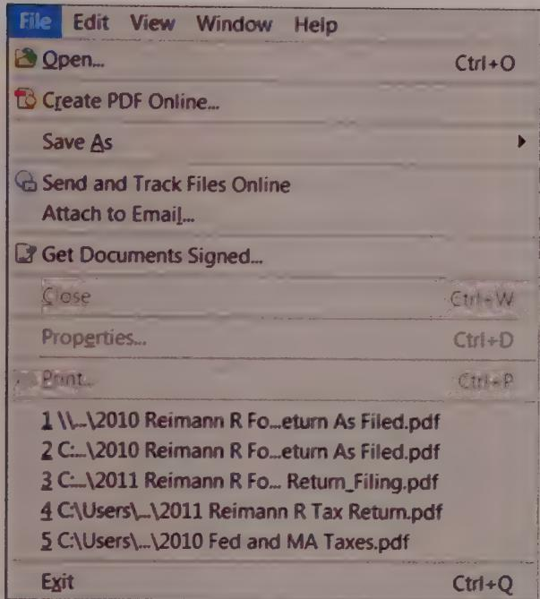
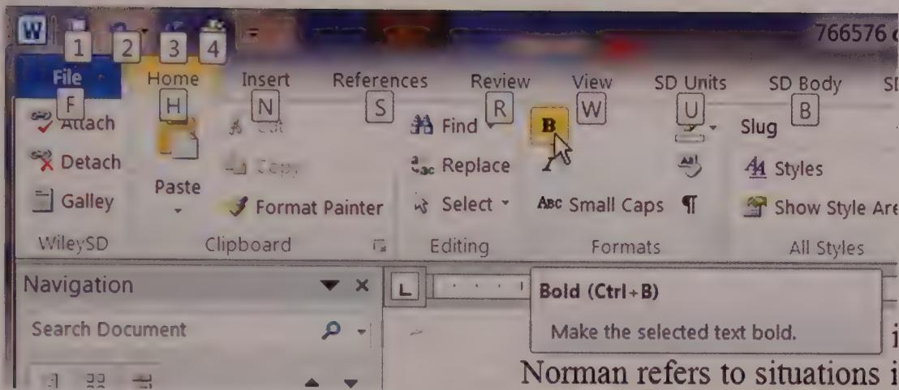
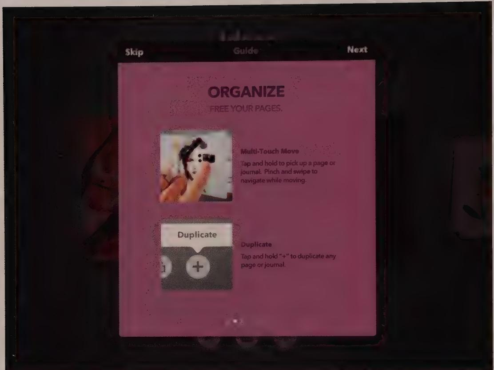
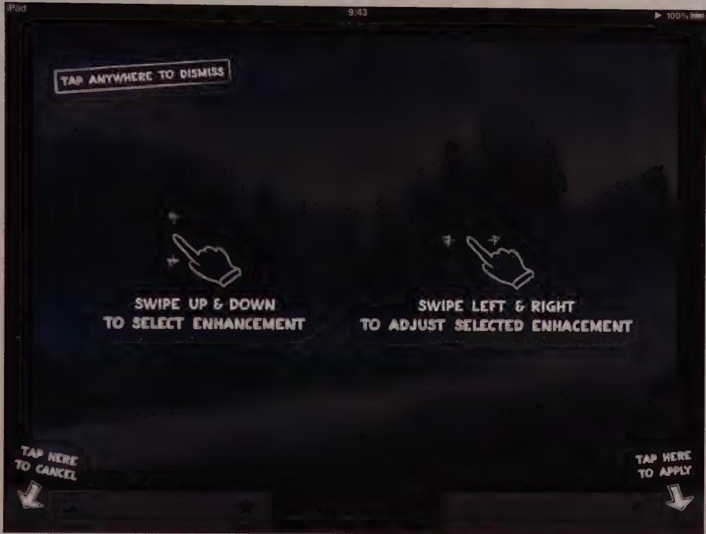
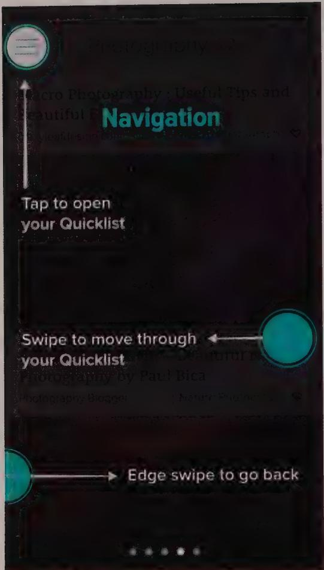
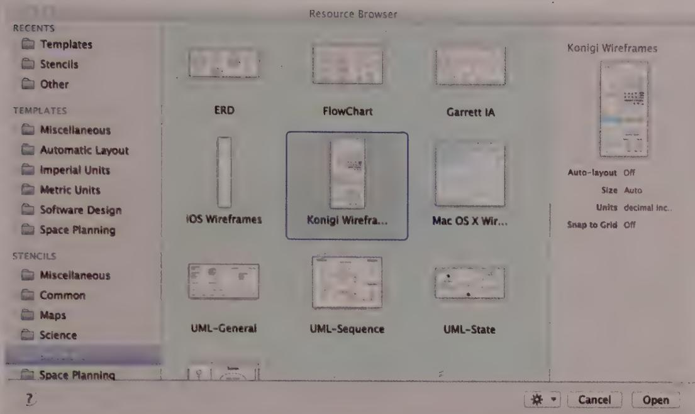

# DESIGNING FOR DIFFERENT NEEDS

As we discussed in Part I, personas and scenarios help us focus our design efforts on the goals, behaviors, needs, and mental models of real users. In addition to the specific focus that personas can give a design effort, some consistent and generalizable patterns of user needs should inform how our products are designed. In this chapter, we'll explore some strategies for serving these well-known needs: learnability and help, customizability, localization and globalization, and accessibility.

# Learnability and Help

Two concepts are particularly useful in sorting out the needs of users with different levels of experience trying to learn an interface: command modalities and working sets. The fallback option, should these prove insufficient, is online help in its various forms. This section covers each of these methods of helping users understand and learn an interface.

# Command modalities

User interfaces are, in a reductionist sense, a means for users to enter data and issue commands to the computer. Data entry is generally fairly straightforward: dictating to a speech recognition algorithm, typing into an empty page or text field, using a finger or stylus to draw, clicking and dragging objects, or picking a value from a menu or similar

- widget. Commands that activate functions are a bit more difficult to learn, since users need to figure out both what commands are available and how they are to be used.

Command modalities are the distinct techniques for allowing users to issue these instructions to the application. Direct-manipulation handles, drop-down and pop-up menu items, toolbar controls, and keyboard accelerators are all examples of command modalities.

Considerate user interfaces often provide multiple command modalities for critical functions—menu items, toolbar items, keyboard accelerators, gestures, or direct-manipulation controls—each with the parallel capability to invoke a single, particular command. This redundancy enables users with different skill sets and aptitudes to direct the application according to their abilities and inclinations. Mobile apps have less capacity for multiple modalities, but the tradeoff is that there is usually fewer interface elements to search when looking for a particular function.

# Pedagogic, immediate, and invisible commands

Some command modalities offer new users more support. Dialog boxes and command menus (such as those found on a traditional desktop application's menu bar, as shown in Figure 16-1) teach the user with descriptive text. This is why commands presented in this manner express a pedagogic modality—commands that teach their behavior using inspection. Beginners use the pedagogical behavior of menus as they get oriented in a new application. But perpetual intermediates often want to leave menus behind to find more immediate and efficient tools, in the form of immediate and invisible commands.

Direct-manipulation controls like drag handles; real-time manipulation controls like sliders and knobs; and even pushbuttons and their toolbar variants, are commands that express an immediate modality. Immediate modality controls have an immediate effect on data (or its presentation) without any intermediary. Neither menus nor dialog boxes have this immediate property. Each one requires an intermediate step, sometimes more than one.

Keyboard accelerators and gestures take the idea of immediacy one step further: There is no locus of these commands in the visual interface—only invisible keystrokes, swipes, pinches, or flicks of the finger. These types of command interfaces express an invisible modality. Users must memorize invisible commands, because typically the interface offers little or no visual indication that they exist. Invisible commands also need to be initially identified for the user, unless they follow widely used conventions (such as flicking up or down to scroll on a touchscreen interface) or by having a reliable way to inform new users that they exist. Invisible commands are used extensively by intermediates and even more by experts.

  
Figure 16-1: Menus on the Windows version of Adobe Reader give users a textual overview of the application's functionality, call out keyboard mnemonics and accelerators, and offer toolbar icons. Unfortunately, this pedagogic idiom is seldom available in mobile apps, due to space constraints.

# Information in the world versus information in the head

Donald Norman provides a useful perspective on command modalities. In *The Design of Everyday Things* (Basic Books, 2002), Norman uses the phrases information in the world and information in the head to refer to different ways that users access information.

When he talks about information in the world, Norman refers to situations in which insufficient information is available in an environment or interface to accomplish something. A kiosk showing a map of downtown, for example, is information in the world. We don't have to bother remembering exactly where the Transamerica Building is, because we can find it by reading a map.

Opposing this is information in your head, which refers to knowledge that you have learned or memorized, like the back-alley shortcut that isn't printed on any map.

Information in your head is much faster and easier to use than information in the world, but you are responsible for ensuring that you learn it, that you don't forget it, and that it stays up to date. Information in the world is slower and more cumbersome, but very dependable.

Pedagogic commands are designed to be learnable via information in the world. Invisible commands must be memorized and thus count as information in the head. Immediate commands fall somewhere in between.

A menu item or dialog is necessarily filled with informational context, which is why it is a pedagogic command. Conversely, keyboard accelerators constitute invisible commands because using them requires the user to have memorized information about the functions and their keyboard equivalents, which may not be expressed in the visual interface.

# Memorization vectors

New users are happy with pedagogic commands, but as they progress to become perpetual intermediates, the slow, repetitive verosity of pedagogic interfaces starts to seem tedious. Users like to find more immediate commands for frequent tasks. This is a natural and appropriate user desire, and, if our software is to be judged easy to use, we must satisfy it. The solution consists of two components. First, we must provide immediate (or invisible) commands in addition to the pedagogic ones. Second, we must provide a path by which the user can learn the immediate command corresponding to each pedagogic command. This path is called a memorization vector.

There are several ways to provide memorization vectors for users. The least effective method is to mention the vector only in the user documentation. The slightly better, but still ineffective, method is to mention it in the app's main online help system. These methods put the onus of finding the memorization vector on users and also leave it up to users to realize that they need to find it in the first place.

Better still is to integrate memorization vectors directly into the main interface. The menus of most desktop applications already have two standard methods. As defined by Microsoft, a typical Windows application has two sets of immediate, keyboard-based commands: mnemonics and accelerators. In Microsoft Word, for example, the mnemonic for Save is Alt+F and then S. Alt+F navigates to the File menu and S issues the save command. The memorization vector mnemonics in Windows is shown when the user presses the alt key. The characters are shown with an underline, or—in the case of the Office Suite—with modal tooltips (see Figure 16-2). The user then presses the appropriate key or presses Alt again to hide the hints.

The accelerator for Save is Ctrl+S (Cmd+S on the Mac). Accelerators are noted explicitly on the right side of a menu item; this acts as a memorization vector. Adobe Reader, as shown in Figure 16-1, takes this a step further by also including the icons for toolbar commands to the left of their corresponding menu commands. Microsoft, meanwhile, shows accelerators as part of the ToolTips on the controls in the Ribbon UI in their Office Suite applications (see Figure 16-2).

  
Figure 16-2: Office Suite applications use small pop-up boxes to display mnemonics when Alt is pressed, and ToolTips to display keyboard accelerators, since the standard menus have been replaced by the toolbar-ish Ribbon UI.

Mac applications usually don't support mnemonics, but they often do have accelerator and palette or toolbar icon mappings.

None of these vectors intrudes on a new user. He may not even notice their existence until he has used the app for some time—that is, until he becomes an intermediate user. Eventually, he will notice these visual hints and will wonder about their meaning. Most reasonably intelligent people—most users—will comprehend the accelerator connection without any help. The mnemonic is slightly tougher. But once the user is clued in to the use of the Alt metadatakey, by either direction or accident, the idiom is easy to remember and use wherever it occurs.

Mobile operating systems, notably, lack common memorization vectors. It may be because there aren't any "spare" real estate or compound interactions (see Chapter 13) in which to place these signals. The closest they come to is the first-run tours (see below) and tutorials that play when the user first uses the device or app. As the mobile platform matures, we are eager to see how designers will help provide this bridge, or whether users are satisfied perpetually using the slow-but-discoverable controls until someone tells them about faster gestures.

As we'll discuss in Chapter 18, icon buttons are an excellent technique whereby icons are used to provide memorization vectors for transitioning from menus to toolbars. The icon identifying each function or facility should be shown on every artifact of the user interface that deals with it: each menu, each icon button, each dialog box, every mention in the help text, and every mention in the printed documentation. A memorization vector

formed of visual symbols in the interface is the most effective technique, yet it remains underexploited in the industry at large.

# Working sets

Because we all learn (by repetition) the things we do frequently, perpetual intermediates end up memorizing a moderately sized subset of commands and features. We call this set of memorized features a working set. The commands that comprise any user's working set are idiosyncratic to that individual, although they will likely overlap significantly with the working sets of other users who exhibit similar use patterns. In Excel, for example, almost every user will enter formulas, specify fonts and labels, and print pages. But Sally's working set might include drawing graphs, whereas Elliot's working set might include linking spreadsheets.

Modeling usage patterns can yield a subset of functions that designers can confidently conclude will be frequently accessed by most users. This minimal working set can be determined via usage analytics if you're working with an existing app that provides them and/or Goal-Directed Design methods, using scenarios to discover the functional needs of your personas. These needs translate directly into the contents of the minimal working set.

The commands in any person's working set are those that they use most often. Users want those commands to be especially quick and easy to invoke. This means that the designer should, at the very least, use immediate modality for all commands in the minimal working set of the application's primary users.

Although an application's minimal working set is by definition part of each user's full working set, individual user preferences and job requirements will dictate which additional features are included. Even custom software written for corporate operations can offer a range of features from which each user can pick and choose. This means that the designer, while providing immediate access to the minimal working set, must also provide means for promoting other commands to immediate modality. Similarly, any commands with immediate modality also require duplicate pedagogic versions to enable beginners to learn the interface. This implies that most functions in the interface should have multiple command modalities.

There is an exception to the rule of multiple command modalities: dangerous commands such as Erase All, Clear, and Abandon Changes should not have accidentally-activated or easy, immediate modality commands associated with them. Instead, they need to be protected within menus and dialog boxes (in keeping with our design principle from Chapter 11: Hide the ejector seat levers).

# Contextual help and assistive interfaces

Needless to say, the best kind of application help is the kind that provides assistance when and where in the interface it is needed, without the user's needing to break his or her flow (see Chapter 11) to seek it out. Whether the situation is the first use of an app or specific to the use of an individual control or feature, a number of patterns support help in context or help users accomplish involved tasks more easily.

# Guided tours and overlays

Guided tours and overlays are patterns that have become popular on mobile platforms because they provide reasonable solutions to the problem of initial learnability. Since mobile apps must rely more on immediate and invisible command modalities (because there's usually insufficient screen real estate for pedagogic command modalities), tours and overlays fill the need for some sort of pedagogy to bootstrap new users.

These patterns, while more optimized for mobile, have seen increasing use in desktop apps as well. Both try to tackle the problem of introducing a new app to users by providing a brief overview of the most important functions for typical use.

Guided tours provide the needed introduction to features and interface behaviors through a sequential set of screens or cards, each of which contains brief text and images (see Figure 16-3). They either describe a set of basic functions in order of importance or take the user through a typical sequential process, such as creating, editing, and sharing a document using the app. Users advance to the next screen in a tour by swiping or tapping. Tours have a structure somewhat similar to a wizard. The major difference is that, instead of asking for user input to configure something in the app, the sequence of cards, screens, or dialogs exists purely to demonstrate product function and behavior.

OS X has an interesting variant of this in the settings for mouse and trackpad gesture configuration: Rather than showing a sequence of mostly static cards, the UI demonstrates the gestures being configured using short, repeating video clips of hands performing the gestures.

Guided tours usually launch automatically the first time an app is run, and sometimes when a new version of an app is released with significant new features. It's important that tours have a "skip" button available on each screen of the tour, in case the user wants to get straight to work without visiting each screen. Of course, a screen to dismiss the tour at the end also is needed. The final screen of the tour should include a way to manually relaunch the tour.

  
Figure 16-3: FiftyThree Inc.'s iOS app, Paper, uses a guided tour to explain its main features and interactions. The user swipes through a set of illustrated cards, each of which describes a different pair of features or interactions. When the app is opened for the first time, the Welcome tour is available from an About menu accessed by tapping the company logo.

Generally speaking, tours shouldn't go on for more than five to seven screens at most. If you make them too long, your users probably will be unable to remember what they've just seen. They also will begin getting antsy if the tour seems interminable.

Overlays are a different approach to introducing functionality, best suited to relatively simple apps whose functions are not pedagogically evident. As the name implies, an overlay is like a transparent sheet laid over the interface on which arrows and descriptive text are embedded. The end result is a set of annotations that point out the app's key features or behaviors and give brief descriptions of their usage (see Figure 16-4).

  
Figure 16-4: The Snapseed app uses an overlay to show key features and behaviors. Unlike some overlays that use a close box, Snapseed's allows you to tap anywhere on the screen to dismiss. After initial use, the overlay remains accessible from the Help menu.

Like guided tours, overlays typically are launched when an app is first run (or when it is updated with a major new release version). An overlay should include a means to relaunch it somewhere in the app—often in a settings menu or via a tiny help icon placed in an unobtrusive corner of the screen.

Zite, shown in Figure 16-5, is a newsreader app that combines the sequential guided tour concept with the idea of an overlay. It walks the user through a series of full-screen overlays accessed by swiping. It ends with a large Done button in the center of the screen.

  
Figure 16-5: Zite is a newsreader app that uses a combination of guided tour and overlay to introduce readers to the app. The tour is available at any time from a tab in the menu system.

This approach is useful in that each feature discussed can be shown in the spatial context of a full screen, potentially making it a bit easier for users to orient themselves.

# Galleries and templates

Not all users of document-creation applications are capable of building nicely-formatted documents from scratch. Many apps, however, offer users only atomic tools: the equivalent of hammers, saws, and chisels. That is fine for some users, but others require more: the equivalent of an unfinished table or chair that they can then sand and paint.

For example, consider an app like OmniGraffle on the Mac, shown in Figure 16-6, which lets you create diagrams, flowcharts, and user interface mock-ups.

  
Figure 16-6: OmniGraffle Pro offers galleries of templates at both the document level and the level of line and shape styles.

Undoubtedly some users will want to create their diagrams from scratch, but most would jump at the chance to start with some stylistic choices made for them in the form of layout templates. Similarly, some users may want to draw their own shapes for things such as arrows and stars, but most people would be happy to select from a gallery of predefined shapes (OmniGraffle calls them stencils). Naturally, users should be able to tweak a template after they choose it.

